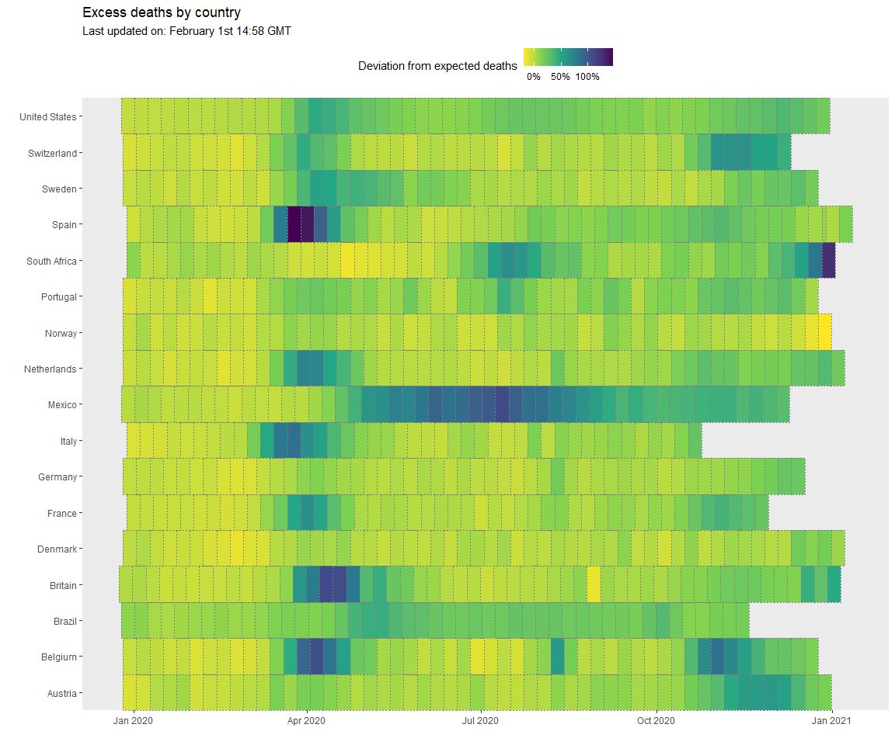
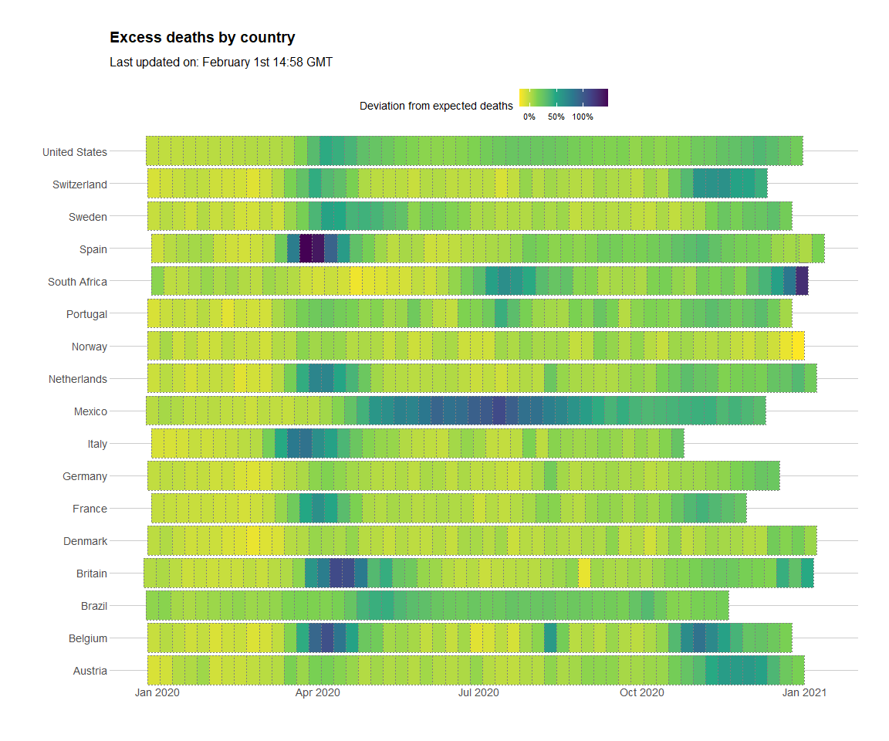
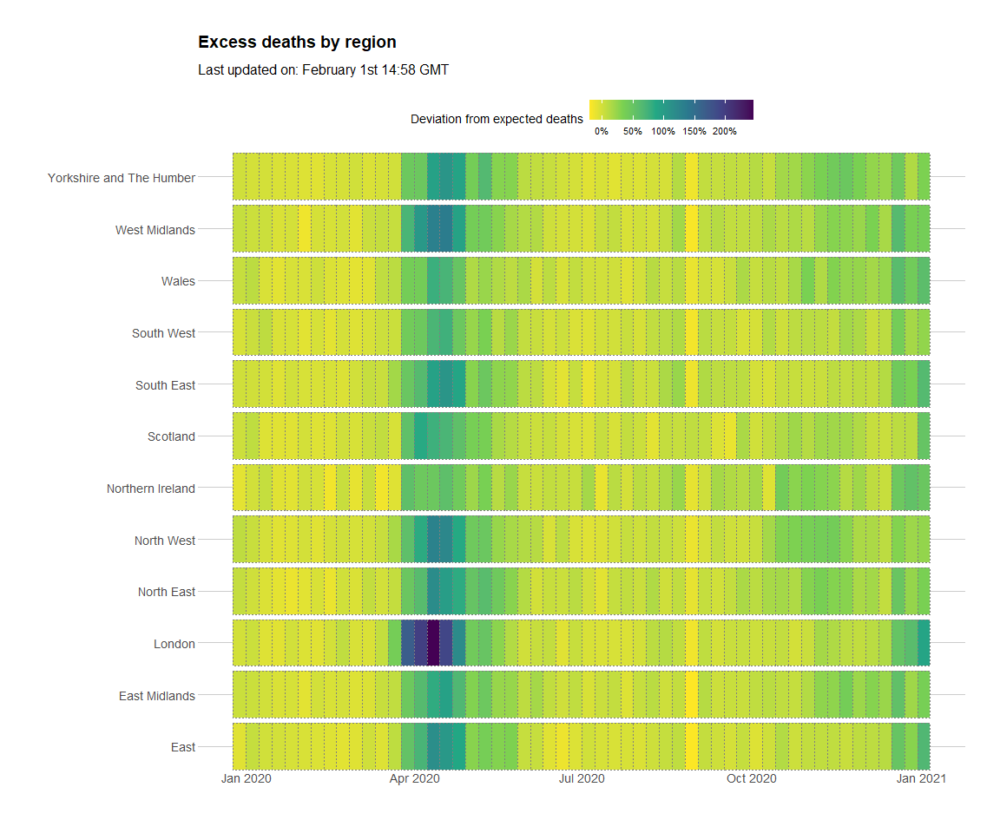

# R and Reactable

The following report analyses COVID data developed and published by The Economist, In particular, their analysis focuses on COVID excess deaths. Here, I have begun by replicating some work published on Medium's 'Towards Data Science' publication, and further explored the use of the package `reactable` to produce tables likes those seen in The Economist publication. There is also some use of `ggplot2`.

The original Economist article can be found here:

https://www.economist.com/graphic-detail/2020/07/15/tracking-covid-19-excess-deaths-across-countries

And the backing data/code used in their article can be found here:

https://github.com/TheEconomist/covid-19-excess-deaths-tracker

Initially, the work below is just a duplication of the following article, which i then build on using `ggplot2` and some additional work with `reactable`. You can find the original work here:

https://towardsdatascience.com/recreate-publication-quality-interactive-tables-in-r-using-reactable-187407bc9702

And the backing Github: https://github.com/connorrothschild/economist-table-replication/blob/master/economist-table-replication.Rmd


## Initial Setup


The following work attempts to replicate the table below, previously featured in *The Economist* publication. This will be done with the `reactable` package.

This package allows the building of interactive tables with R, and offers extensive capabilities to customise, either via R, JavaScript or CSS, as we will see. 


The work published in Medium used the following packages: `reactable`, `htmltools`, `lubridate` for days and times, `hrbrthemes` for *The Economist's* font, and `tidyverse` for data wrangling.

## Loading packages


```r
library(reactable)
library(htmltools)
library(lubridate)
library(hrbrthemes)
library(tidyverse)
library(sparkline)
```

The data wrangling steps are taken from the original Medium article, see link provided above for more details...


## Creating the table


The following is the final table produced by a series of customisations to `reactable`. The code is slightly different to that included in the Medium article, given I use a previously created function to produce the bar charts, which don't rely on CSS.


```r
# define bar_chart function first, outside of reactable function call, seems tidier.
bar_chart <- function(label, width = "100%", height = "16px", fill = "#F15A3F", background = NULL) {
  bar <- div(style = list(background = fill, width = width, height = height))
  chart <- div(style = list(flexGrow = 1, marginLeft = "8px", background = background), bar)  
  div(style = list(display = "flex", alignItems = "center"), label, chart)
}


table_final <- reactable(
  data_for_table,
  defaultSortOrder = 'desc',
  defaultSorted = 'excess_deaths',
  showSortIcon = FALSE,
  compact = TRUE,
  pagination = FALSE,
  defaultColDef = colDef(
    headerStyle = list(
      textAlign = "left",
      fontSize = "11px",
      lineHeight = "14px",
      textTransform = "uppercase",
      color = "#0c0c0c",
      fontWeight = "500",
      borderBottom = "2px solid #e9edf0",
      paddingBottom = "3px",
      verticalAlign = "bottom",
      fontFamily = font_tw
    ),
    style = list(
      fontFamily = font_tw,
      fontSize = "14px",
      verticalAlign = "center",
      align = "left"
    )
  ),
  columns = list(
    country = colDef(
      name = "Region / Country",
      style = list(fontFamily = font_tw,
                   fontWeight = "400")
    ),
    perc = colDef(
      html = TRUE,
      header = JS("
      function(colInfo) {
        return 'COVID-19 as<br>% of total'
      }"),
      name = "COVID-19 as % of Total",
      align = "right",
      maxWidth = 100,
      format = colFormat(percent = TRUE, digits = 0),
      style = list(fontFamily =  font_tw),
      headerStyle = list(
        fontSize = "11px",
        lineHeight = "14px",
        textTransform = "uppercase",
        color = "#0c0c0c",
        fontWeight = "500",
        borderBottom = "2px solid #e9edf0",
        paddingBottom = "3px",
        verticalAlign = "bottom",
        fontFamily = font_tw,
        textAlign = "right"
      )
    ),
    clean_range = colDef(
      name = "Time Period",
      style = list(
        color = '#3f5661',
        fontSize = '12px',
        fontFamily = font_tw
      )
    ),
    ###### NEW ######
    covid_deaths = colDef(
      name = "COVID-19 Deaths",
      #align = "left",
      cell = function(value) {
      width <- paste0(value / max(data_for_table$covid_deaths) * 100, "%")
      value <- format(value, big.mark = ",")
      value <- format(value, width = 10, justify = "right")
      bar_chart(value, width = width, background = "#e1e1e1")
      } 
  ),
  excess_deaths = colDef(
      name = "Total Excess Deaths",
      align = "left",
      cell = function(value) {
      width <- paste0(value / max(data_for_table$covid_deaths) * 100, "%")
      value <- format(value, big.mark = ",")
      value <- format(value, width = 10, justify = "right")
      bar_chart(value, width = width, background = "#e1e1e1", fill = "#3F5661")
      }
    )
  )
)

table_final
```

<!--html_preserve--><div id="htmlwidget-cf9f40ba3aa12a56241e" class="reactable html-widget" style="width:auto;height:auto;"></div>
<script type="application/json" data-for="htmlwidget-cf9f40ba3aa12a56241e">{"x":{"tag":{"name":"Reactable","attribs":{"data":{"country":["Austria","Belgium","Britain","France","Istanbul","Italy","Jakarta","Netherlands","New York City","Spain","Sweden"],"clean_range":["Mar 23rd-Jan 3rd","Mar 16th-Dec 27th","Mar 14th-Jan 8th","Mar 11th-Dec 1st","Mar 25th-Nov 18th","Feb 26th-Oct 27th","Mar 1st-May 31st","Mar 16th-Jan 10th","Mar 15th-Jan 2nd","Mar 4th-Jan 14th","Mar 16th-Dec 27th"],"covid_deaths":[6273,18934,93354,52775,5654,35181,520,11790,24814,53139,8106],"excess_deaths":[9058,20030,99136,56825,9255,65960,4645,18927,28245,74150,9393],"perc":[0.692536983881652,0.945282076884673,0.941676081342802,0.928728552573691,0.610913019989195,0.533368708308065,0.11194833153929,0.622919638611507,0.878527172950965,0.71664194200944,0.862983072500798]},"columns":[{"accessor":"country","name":"Region / Country","type":"character","style":{"fontFamily":"Titillium Web","fontWeight":"400"},"headerStyle":{"textAlign":"left","fontSize":"11px","lineHeight":"14px","textTransform":"uppercase","color":"#0c0c0c","fontWeight":"500","borderBottom":"2px solid #e9edf0","paddingBottom":"3px","verticalAlign":"bottom","fontFamily":"Titillium Web"}},{"accessor":"clean_range","name":"Time Period","type":"character","style":{"color":"#3f5661","fontSize":"12px","fontFamily":"Titillium Web"},"headerStyle":{"textAlign":"left","fontSize":"11px","lineHeight":"14px","textTransform":"uppercase","color":"#0c0c0c","fontWeight":"500","borderBottom":"2px solid #e9edf0","paddingBottom":"3px","verticalAlign":"bottom","fontFamily":"Titillium Web"}},{"accessor":"covid_deaths","name":"COVID-19 Deaths","type":"numeric","style":{"fontFamily":"Titillium Web","fontSize":"14px","verticalAlign":"center","align":"left"},"headerStyle":{"textAlign":"left","fontSize":"11px","lineHeight":"14px","textTransform":"uppercase","color":"#0c0c0c","fontWeight":"500","borderBottom":"2px solid #e9edf0","paddingBottom":"3px","verticalAlign":"bottom","fontFamily":"Titillium Web"},"cell":[{"name":"div","attribs":{"style":{"display":"flex","alignItems":"center"}},"children":["     6,273",{"name":"div","attribs":{"style":{"flexGrow":1,"marginLeft":"8px","background":"#e1e1e1"}},"children":[{"name":"div","attribs":{"style":{"background":"#F15A3F","width":"6.71958352079182%","height":"16px"}},"children":[]}]}]},{"name":"div","attribs":{"style":{"display":"flex","alignItems":"center"}},"children":["    18,934",{"name":"div","attribs":{"style":{"flexGrow":1,"marginLeft":"8px","background":"#e1e1e1"}},"children":[{"name":"div","attribs":{"style":{"background":"#F15A3F","width":"20.2819375709664%","height":"16px"}},"children":[]}]}]},{"name":"div","attribs":{"style":{"display":"flex","alignItems":"center"}},"children":["    93,354",{"name":"div","attribs":{"style":{"flexGrow":1,"marginLeft":"8px","background":"#e1e1e1"}},"children":[{"name":"div","attribs":{"style":{"background":"#F15A3F","width":"100%","height":"16px"}},"children":[]}]}]},{"name":"div","attribs":{"style":{"display":"flex","alignItems":"center"}},"children":["    52,775",{"name":"div","attribs":{"style":{"flexGrow":1,"marginLeft":"8px","background":"#e1e1e1"}},"children":[{"name":"div","attribs":{"style":{"background":"#F15A3F","width":"56.5321250294578%","height":"16px"}},"children":[]}]}]},{"name":"div","attribs":{"style":{"display":"flex","alignItems":"center"}},"children":["     5,654",{"name":"div","attribs":{"style":{"flexGrow":1,"marginLeft":"8px","background":"#e1e1e1"}},"children":[{"name":"div","attribs":{"style":{"background":"#F15A3F","width":"6.05651605715877%","height":"16px"}},"children":[]}]}]},{"name":"div","attribs":{"style":{"display":"flex","alignItems":"center"}},"children":["    35,181",{"name":"div","attribs":{"style":{"flexGrow":1,"marginLeft":"8px","background":"#e1e1e1"}},"children":[{"name":"div","attribs":{"style":{"background":"#F15A3F","width":"37.6855839064207%","height":"16px"}},"children":[]}]}]},{"name":"div","attribs":{"style":{"display":"flex","alignItems":"center"}},"children":["       520",{"name":"div","attribs":{"style":{"flexGrow":1,"marginLeft":"8px","background":"#e1e1e1"}},"children":[{"name":"div","attribs":{"style":{"background":"#F15A3F","width":"0.557019517106926%","height":"16px"}},"children":[]}]}]},{"name":"div","attribs":{"style":{"display":"flex","alignItems":"center"}},"children":["    11,790",{"name":"div","attribs":{"style":{"flexGrow":1,"marginLeft":"8px","background":"#e1e1e1"}},"children":[{"name":"div","attribs":{"style":{"background":"#F15A3F","width":"12.6293463590205%","height":"16px"}},"children":[]}]}]},{"name":"div","attribs":{"style":{"display":"flex","alignItems":"center"}},"children":["    24,814",{"name":"div","attribs":{"style":{"flexGrow":1,"marginLeft":"8px","background":"#e1e1e1"}},"children":[{"name":"div","attribs":{"style":{"background":"#F15A3F","width":"26.5805428797909%","height":"16px"}},"children":[]}]}]},{"name":"div","attribs":{"style":{"display":"flex","alignItems":"center"}},"children":["    53,139",{"name":"div","attribs":{"style":{"flexGrow":1,"marginLeft":"8px","background":"#e1e1e1"}},"children":[{"name":"div","attribs":{"style":{"background":"#F15A3F","width":"56.9220386914326%","height":"16px"}},"children":[]}]}]},{"name":"div","attribs":{"style":{"display":"flex","alignItems":"center"}},"children":["     8,106",{"name":"div","attribs":{"style":{"flexGrow":1,"marginLeft":"8px","background":"#e1e1e1"}},"children":[{"name":"div","attribs":{"style":{"background":"#F15A3F","width":"8.68307731859374%","height":"16px"}},"children":[]}]}]}]},{"accessor":"excess_deaths","name":"Total Excess Deaths","type":"numeric","style":{"fontFamily":"Titillium Web","fontSize":"14px","verticalAlign":"center","align":"left"},"headerStyle":{"textAlign":"left","fontSize":"11px","lineHeight":"14px","textTransform":"uppercase","color":"#0c0c0c","fontWeight":"500","borderBottom":"2px solid #e9edf0","paddingBottom":"3px","verticalAlign":"bottom","fontFamily":"Titillium Web"},"cell":[{"name":"div","attribs":{"style":{"display":"flex","alignItems":"center"}},"children":["     9,058",{"name":"div","attribs":{"style":{"flexGrow":1,"marginLeft":"8px","background":"#e1e1e1"}},"children":[{"name":"div","attribs":{"style":{"background":"#3F5661","width":"9.70285151145104%","height":"16px"}},"children":[]}]}]},{"name":"div","attribs":{"style":{"display":"flex","alignItems":"center"}},"children":["    20,030",{"name":"div","attribs":{"style":{"flexGrow":1,"marginLeft":"8px","background":"#e1e1e1"}},"children":[{"name":"div","attribs":{"style":{"background":"#3F5661","width":"21.4559633224072%","height":"16px"}},"children":[]}]}]},{"name":"div","attribs":{"style":{"display":"flex","alignItems":"center"}},"children":["    99,136",{"name":"div","attribs":{"style":{"flexGrow":1,"marginLeft":"8px","background":"#e1e1e1"}},"children":[{"name":"div","attribs":{"style":{"background":"#3F5661","width":"106.193628553677%","height":"16px"}},"children":[]}]}]},{"name":"div","attribs":{"style":{"display":"flex","alignItems":"center"}},"children":["    56,825",{"name":"div","attribs":{"style":{"flexGrow":1,"marginLeft":"8px","background":"#e1e1e1"}},"children":[{"name":"div","attribs":{"style":{"background":"#3F5661","width":"60.8704501146175%","height":"16px"}},"children":[]}]}]},{"name":"div","attribs":{"style":{"display":"flex","alignItems":"center"}},"children":["     9,255",{"name":"div","attribs":{"style":{"flexGrow":1,"marginLeft":"8px","background":"#e1e1e1"}},"children":[{"name":"div","attribs":{"style":{"background":"#3F5661","width":"9.91387621312424%","height":"16px"}},"children":[]}]}]},{"name":"div","attribs":{"style":{"display":"flex","alignItems":"center"}},"children":["    65,960",{"name":"div","attribs":{"style":{"flexGrow":1,"marginLeft":"8px","background":"#e1e1e1"}},"children":[{"name":"div","attribs":{"style":{"background":"#3F5661","width":"70.6557833622555%","height":"16px"}},"children":[]}]}]},{"name":"div","attribs":{"style":{"display":"flex","alignItems":"center"}},"children":["     4,645",{"name":"div","attribs":{"style":{"flexGrow":1,"marginLeft":"8px","background":"#e1e1e1"}},"children":[{"name":"div","attribs":{"style":{"background":"#3F5661","width":"4.97568395569552%","height":"16px"}},"children":[]}]}]},{"name":"div","attribs":{"style":{"display":"flex","alignItems":"center"}},"children":["    18,927",{"name":"div","attribs":{"style":{"flexGrow":1,"marginLeft":"8px","background":"#e1e1e1"}},"children":[{"name":"div","attribs":{"style":{"background":"#3F5661","width":"20.2744392313131%","height":"16px"}},"children":[]}]}]},{"name":"div","attribs":{"style":{"display":"flex","alignItems":"center"}},"children":["    28,245",{"name":"div","attribs":{"style":{"flexGrow":1,"marginLeft":"8px","background":"#e1e1e1"}},"children":[{"name":"div","attribs":{"style":{"background":"#3F5661","width":"30.2558005013176%","height":"16px"}},"children":[]}]}]},{"name":"div","attribs":{"style":{"display":"flex","alignItems":"center"}},"children":["    74,150",{"name":"div","attribs":{"style":{"flexGrow":1,"marginLeft":"8px","background":"#e1e1e1"}},"children":[{"name":"div","attribs":{"style":{"background":"#3F5661","width":"79.4288407566896%","height":"16px"}},"children":[]}]}]},{"name":"div","attribs":{"style":{"display":"flex","alignItems":"center"}},"children":["     9,393",{"name":"div","attribs":{"style":{"flexGrow":1,"marginLeft":"8px","background":"#e1e1e1"}},"children":[{"name":"div","attribs":{"style":{"background":"#3F5661","width":"10.0617006234334%","height":"16px"}},"children":[]}]}]}],"align":"left"},{"accessor":"perc","name":"COVID-19 as % of Total","type":"numeric","style":{"fontFamily":"Titillium Web"},"headerStyle":{"fontSize":"11px","lineHeight":"14px","textTransform":"uppercase","color":"#0c0c0c","fontWeight":"500","borderBottom":"2px solid #e9edf0","paddingBottom":"3px","verticalAlign":"bottom","fontFamily":"Titillium Web","textAlign":"right"},"format":{"cell":{"digits":0,"percent":true},"aggregated":{"digits":0,"percent":true}},"header":"\n      function(colInfo) {\n        return 'COVID-19 as<br>% of total'\n      }","html":true,"maxWidth":100,"align":"right"}],"defaultSortDesc":true,"defaultSorted":[{"id":"excess_deaths","desc":true}],"defaultPageSize":11,"paginationType":"numbers","showPageInfo":true,"minRows":1,"compact":true,"showSortIcon":false,"dataKey":"b5ed483dc8fbc26f01b356b1ddd758ee","key":"b5ed483dc8fbc26f01b356b1ddd758ee"},"children":[]},"class":"reactR_markup"},"evals":["tag.attribs.columns.4.header"],"jsHooks":[]}</script><!--/html_preserve-->


Finally, we can add the table title and subtitle.

Now, we can include a title and subtitle above the table. We use some `htmltools` functions to create divs, headers, and paragraphs.


```r
div(
    div(
      h2("Excess mortality since region/country’s first 50 covid deaths"),
      p(
        ### create the 'Updated on ...' and make it dynamic
        paste0(
          "Updated on ", format(Sys.Date(), "%B "),
          append_date_suffix(
            as.numeric(format(Sys.Date(), "%d"))
            ), " ",
          strftime(Sys.time(), format = "%H:%M"), " GMT"
        )
      ),
    ),
    table_final)
```

<!--html_preserve--><div>
<div>
<h2>Excess mortality since region/country’s first 50 covid deaths</h2>
<p>Updated on February 1st 14:58 GMT</p>
</div>
<div id="htmlwidget-6bb2d250c480580e4dbd" class="reactable html-widget" style="width:auto;height:auto;"></div>
<script type="application/json" data-for="htmlwidget-6bb2d250c480580e4dbd">{"x":{"tag":{"name":"Reactable","attribs":{"data":{"country":["Austria","Belgium","Britain","France","Istanbul","Italy","Jakarta","Netherlands","New York City","Spain","Sweden"],"clean_range":["Mar 23rd-Jan 3rd","Mar 16th-Dec 27th","Mar 14th-Jan 8th","Mar 11th-Dec 1st","Mar 25th-Nov 18th","Feb 26th-Oct 27th","Mar 1st-May 31st","Mar 16th-Jan 10th","Mar 15th-Jan 2nd","Mar 4th-Jan 14th","Mar 16th-Dec 27th"],"covid_deaths":[6273,18934,93354,52775,5654,35181,520,11790,24814,53139,8106],"excess_deaths":[9058,20030,99136,56825,9255,65960,4645,18927,28245,74150,9393],"perc":[0.692536983881652,0.945282076884673,0.941676081342802,0.928728552573691,0.610913019989195,0.533368708308065,0.11194833153929,0.622919638611507,0.878527172950965,0.71664194200944,0.862983072500798]},"columns":[{"accessor":"country","name":"Region / Country","type":"character","style":{"fontFamily":"Titillium Web","fontWeight":"400"},"headerStyle":{"textAlign":"left","fontSize":"11px","lineHeight":"14px","textTransform":"uppercase","color":"#0c0c0c","fontWeight":"500","borderBottom":"2px solid #e9edf0","paddingBottom":"3px","verticalAlign":"bottom","fontFamily":"Titillium Web"}},{"accessor":"clean_range","name":"Time Period","type":"character","style":{"color":"#3f5661","fontSize":"12px","fontFamily":"Titillium Web"},"headerStyle":{"textAlign":"left","fontSize":"11px","lineHeight":"14px","textTransform":"uppercase","color":"#0c0c0c","fontWeight":"500","borderBottom":"2px solid #e9edf0","paddingBottom":"3px","verticalAlign":"bottom","fontFamily":"Titillium Web"}},{"accessor":"covid_deaths","name":"COVID-19 Deaths","type":"numeric","style":{"fontFamily":"Titillium Web","fontSize":"14px","verticalAlign":"center","align":"left"},"headerStyle":{"textAlign":"left","fontSize":"11px","lineHeight":"14px","textTransform":"uppercase","color":"#0c0c0c","fontWeight":"500","borderBottom":"2px solid #e9edf0","paddingBottom":"3px","verticalAlign":"bottom","fontFamily":"Titillium Web"},"cell":[{"name":"div","attribs":{"style":{"display":"flex","alignItems":"center"}},"children":["     6,273",{"name":"div","attribs":{"style":{"flexGrow":1,"marginLeft":"8px","background":"#e1e1e1"}},"children":[{"name":"div","attribs":{"style":{"background":"#F15A3F","width":"6.71958352079182%","height":"16px"}},"children":[]}]}]},{"name":"div","attribs":{"style":{"display":"flex","alignItems":"center"}},"children":["    18,934",{"name":"div","attribs":{"style":{"flexGrow":1,"marginLeft":"8px","background":"#e1e1e1"}},"children":[{"name":"div","attribs":{"style":{"background":"#F15A3F","width":"20.2819375709664%","height":"16px"}},"children":[]}]}]},{"name":"div","attribs":{"style":{"display":"flex","alignItems":"center"}},"children":["    93,354",{"name":"div","attribs":{"style":{"flexGrow":1,"marginLeft":"8px","background":"#e1e1e1"}},"children":[{"name":"div","attribs":{"style":{"background":"#F15A3F","width":"100%","height":"16px"}},"children":[]}]}]},{"name":"div","attribs":{"style":{"display":"flex","alignItems":"center"}},"children":["    52,775",{"name":"div","attribs":{"style":{"flexGrow":1,"marginLeft":"8px","background":"#e1e1e1"}},"children":[{"name":"div","attribs":{"style":{"background":"#F15A3F","width":"56.5321250294578%","height":"16px"}},"children":[]}]}]},{"name":"div","attribs":{"style":{"display":"flex","alignItems":"center"}},"children":["     5,654",{"name":"div","attribs":{"style":{"flexGrow":1,"marginLeft":"8px","background":"#e1e1e1"}},"children":[{"name":"div","attribs":{"style":{"background":"#F15A3F","width":"6.05651605715877%","height":"16px"}},"children":[]}]}]},{"name":"div","attribs":{"style":{"display":"flex","alignItems":"center"}},"children":["    35,181",{"name":"div","attribs":{"style":{"flexGrow":1,"marginLeft":"8px","background":"#e1e1e1"}},"children":[{"name":"div","attribs":{"style":{"background":"#F15A3F","width":"37.6855839064207%","height":"16px"}},"children":[]}]}]},{"name":"div","attribs":{"style":{"display":"flex","alignItems":"center"}},"children":["       520",{"name":"div","attribs":{"style":{"flexGrow":1,"marginLeft":"8px","background":"#e1e1e1"}},"children":[{"name":"div","attribs":{"style":{"background":"#F15A3F","width":"0.557019517106926%","height":"16px"}},"children":[]}]}]},{"name":"div","attribs":{"style":{"display":"flex","alignItems":"center"}},"children":["    11,790",{"name":"div","attribs":{"style":{"flexGrow":1,"marginLeft":"8px","background":"#e1e1e1"}},"children":[{"name":"div","attribs":{"style":{"background":"#F15A3F","width":"12.6293463590205%","height":"16px"}},"children":[]}]}]},{"name":"div","attribs":{"style":{"display":"flex","alignItems":"center"}},"children":["    24,814",{"name":"div","attribs":{"style":{"flexGrow":1,"marginLeft":"8px","background":"#e1e1e1"}},"children":[{"name":"div","attribs":{"style":{"background":"#F15A3F","width":"26.5805428797909%","height":"16px"}},"children":[]}]}]},{"name":"div","attribs":{"style":{"display":"flex","alignItems":"center"}},"children":["    53,139",{"name":"div","attribs":{"style":{"flexGrow":1,"marginLeft":"8px","background":"#e1e1e1"}},"children":[{"name":"div","attribs":{"style":{"background":"#F15A3F","width":"56.9220386914326%","height":"16px"}},"children":[]}]}]},{"name":"div","attribs":{"style":{"display":"flex","alignItems":"center"}},"children":["     8,106",{"name":"div","attribs":{"style":{"flexGrow":1,"marginLeft":"8px","background":"#e1e1e1"}},"children":[{"name":"div","attribs":{"style":{"background":"#F15A3F","width":"8.68307731859374%","height":"16px"}},"children":[]}]}]}]},{"accessor":"excess_deaths","name":"Total Excess Deaths","type":"numeric","style":{"fontFamily":"Titillium Web","fontSize":"14px","verticalAlign":"center","align":"left"},"headerStyle":{"textAlign":"left","fontSize":"11px","lineHeight":"14px","textTransform":"uppercase","color":"#0c0c0c","fontWeight":"500","borderBottom":"2px solid #e9edf0","paddingBottom":"3px","verticalAlign":"bottom","fontFamily":"Titillium Web"},"cell":[{"name":"div","attribs":{"style":{"display":"flex","alignItems":"center"}},"children":["     9,058",{"name":"div","attribs":{"style":{"flexGrow":1,"marginLeft":"8px","background":"#e1e1e1"}},"children":[{"name":"div","attribs":{"style":{"background":"#3F5661","width":"9.70285151145104%","height":"16px"}},"children":[]}]}]},{"name":"div","attribs":{"style":{"display":"flex","alignItems":"center"}},"children":["    20,030",{"name":"div","attribs":{"style":{"flexGrow":1,"marginLeft":"8px","background":"#e1e1e1"}},"children":[{"name":"div","attribs":{"style":{"background":"#3F5661","width":"21.4559633224072%","height":"16px"}},"children":[]}]}]},{"name":"div","attribs":{"style":{"display":"flex","alignItems":"center"}},"children":["    99,136",{"name":"div","attribs":{"style":{"flexGrow":1,"marginLeft":"8px","background":"#e1e1e1"}},"children":[{"name":"div","attribs":{"style":{"background":"#3F5661","width":"106.193628553677%","height":"16px"}},"children":[]}]}]},{"name":"div","attribs":{"style":{"display":"flex","alignItems":"center"}},"children":["    56,825",{"name":"div","attribs":{"style":{"flexGrow":1,"marginLeft":"8px","background":"#e1e1e1"}},"children":[{"name":"div","attribs":{"style":{"background":"#3F5661","width":"60.8704501146175%","height":"16px"}},"children":[]}]}]},{"name":"div","attribs":{"style":{"display":"flex","alignItems":"center"}},"children":["     9,255",{"name":"div","attribs":{"style":{"flexGrow":1,"marginLeft":"8px","background":"#e1e1e1"}},"children":[{"name":"div","attribs":{"style":{"background":"#3F5661","width":"9.91387621312424%","height":"16px"}},"children":[]}]}]},{"name":"div","attribs":{"style":{"display":"flex","alignItems":"center"}},"children":["    65,960",{"name":"div","attribs":{"style":{"flexGrow":1,"marginLeft":"8px","background":"#e1e1e1"}},"children":[{"name":"div","attribs":{"style":{"background":"#3F5661","width":"70.6557833622555%","height":"16px"}},"children":[]}]}]},{"name":"div","attribs":{"style":{"display":"flex","alignItems":"center"}},"children":["     4,645",{"name":"div","attribs":{"style":{"flexGrow":1,"marginLeft":"8px","background":"#e1e1e1"}},"children":[{"name":"div","attribs":{"style":{"background":"#3F5661","width":"4.97568395569552%","height":"16px"}},"children":[]}]}]},{"name":"div","attribs":{"style":{"display":"flex","alignItems":"center"}},"children":["    18,927",{"name":"div","attribs":{"style":{"flexGrow":1,"marginLeft":"8px","background":"#e1e1e1"}},"children":[{"name":"div","attribs":{"style":{"background":"#3F5661","width":"20.2744392313131%","height":"16px"}},"children":[]}]}]},{"name":"div","attribs":{"style":{"display":"flex","alignItems":"center"}},"children":["    28,245",{"name":"div","attribs":{"style":{"flexGrow":1,"marginLeft":"8px","background":"#e1e1e1"}},"children":[{"name":"div","attribs":{"style":{"background":"#3F5661","width":"30.2558005013176%","height":"16px"}},"children":[]}]}]},{"name":"div","attribs":{"style":{"display":"flex","alignItems":"center"}},"children":["    74,150",{"name":"div","attribs":{"style":{"flexGrow":1,"marginLeft":"8px","background":"#e1e1e1"}},"children":[{"name":"div","attribs":{"style":{"background":"#3F5661","width":"79.4288407566896%","height":"16px"}},"children":[]}]}]},{"name":"div","attribs":{"style":{"display":"flex","alignItems":"center"}},"children":["     9,393",{"name":"div","attribs":{"style":{"flexGrow":1,"marginLeft":"8px","background":"#e1e1e1"}},"children":[{"name":"div","attribs":{"style":{"background":"#3F5661","width":"10.0617006234334%","height":"16px"}},"children":[]}]}]}],"align":"left"},{"accessor":"perc","name":"COVID-19 as % of Total","type":"numeric","style":{"fontFamily":"Titillium Web"},"headerStyle":{"fontSize":"11px","lineHeight":"14px","textTransform":"uppercase","color":"#0c0c0c","fontWeight":"500","borderBottom":"2px solid #e9edf0","paddingBottom":"3px","verticalAlign":"bottom","fontFamily":"Titillium Web","textAlign":"right"},"format":{"cell":{"digits":0,"percent":true},"aggregated":{"digits":0,"percent":true}},"header":"\n      function(colInfo) {\n        return 'COVID-19 as<br>% of total'\n      }","html":true,"maxWidth":100,"align":"right"}],"defaultSortDesc":true,"defaultSorted":[{"id":"excess_deaths","desc":true}],"defaultPageSize":11,"paginationType":"numbers","showPageInfo":true,"minRows":1,"compact":true,"showSortIcon":false,"dataKey":"b5ed483dc8fbc26f01b356b1ddd758ee","key":"b5ed483dc8fbc26f01b356b1ddd758ee"},"children":[]},"class":"reactR_markup"},"evals":["tag.attribs.columns.4.header"],"jsHooks":[]}</script>
</div><!--/html_preserve-->
This is then adjusted using css:


```css
.table {
  margin: 0 auto;
  width: 675px;
}
.tableTitle {
  margin: 6px 0;
  font-size: 16px;
  font-family: 'Econ Sans Cnd'
}
.tableTitle h2 {
  font-size: 16px;
  font-weight: bold;
  font-family: 'Econ Sans Cnd'
}
.tableTitle p {
  font-size: 14px;
  font-weight: 500;
}
```


<style type="text/css">
.table {
  margin: 0 auto;
  width: 675px;
}
.tableTitle {
  margin: 6px 0;
  font-size: 16px;
  font-family: 'Econ Sans Cnd'
}
.tableTitle h2 {
  font-size: 16px;
  font-weight: bold;
  font-family: 'Econ Sans Cnd'
}
.tableTitle p {
  font-size: 14px;
  font-weight: 500;
}
</style>

Below is the final table:


```r
div(class = "tableTitle",
    div(
      class = "title",
      h2("Excess mortality since region/country’s first 50 covid deaths"),
      p(
        paste0("Updated on ", format(Sys.Date(),"%B "),
          append_date_suffix(as.numeric(format(Sys.Date(), "%d"))), " ",
          strftime(Sys.time(), format = "%H:%M"), " GMT"
        )
      ),
    ),
    table_final)
```

<!--html_preserve--><div class="tableTitle">
<div class="title">
<h2>Excess mortality since region/country’s first 50 covid deaths</h2>
<p>Updated on February 1st 14:58 GMT</p>
</div>
<div id="htmlwidget-788d94509ad98a27ff35" class="reactable html-widget" style="width:auto;height:auto;"></div>
<script type="application/json" data-for="htmlwidget-788d94509ad98a27ff35">{"x":{"tag":{"name":"Reactable","attribs":{"data":{"country":["Austria","Belgium","Britain","France","Istanbul","Italy","Jakarta","Netherlands","New York City","Spain","Sweden"],"clean_range":["Mar 23rd-Jan 3rd","Mar 16th-Dec 27th","Mar 14th-Jan 8th","Mar 11th-Dec 1st","Mar 25th-Nov 18th","Feb 26th-Oct 27th","Mar 1st-May 31st","Mar 16th-Jan 10th","Mar 15th-Jan 2nd","Mar 4th-Jan 14th","Mar 16th-Dec 27th"],"covid_deaths":[6273,18934,93354,52775,5654,35181,520,11790,24814,53139,8106],"excess_deaths":[9058,20030,99136,56825,9255,65960,4645,18927,28245,74150,9393],"perc":[0.692536983881652,0.945282076884673,0.941676081342802,0.928728552573691,0.610913019989195,0.533368708308065,0.11194833153929,0.622919638611507,0.878527172950965,0.71664194200944,0.862983072500798]},"columns":[{"accessor":"country","name":"Region / Country","type":"character","style":{"fontFamily":"Titillium Web","fontWeight":"400"},"headerStyle":{"textAlign":"left","fontSize":"11px","lineHeight":"14px","textTransform":"uppercase","color":"#0c0c0c","fontWeight":"500","borderBottom":"2px solid #e9edf0","paddingBottom":"3px","verticalAlign":"bottom","fontFamily":"Titillium Web"}},{"accessor":"clean_range","name":"Time Period","type":"character","style":{"color":"#3f5661","fontSize":"12px","fontFamily":"Titillium Web"},"headerStyle":{"textAlign":"left","fontSize":"11px","lineHeight":"14px","textTransform":"uppercase","color":"#0c0c0c","fontWeight":"500","borderBottom":"2px solid #e9edf0","paddingBottom":"3px","verticalAlign":"bottom","fontFamily":"Titillium Web"}},{"accessor":"covid_deaths","name":"COVID-19 Deaths","type":"numeric","style":{"fontFamily":"Titillium Web","fontSize":"14px","verticalAlign":"center","align":"left"},"headerStyle":{"textAlign":"left","fontSize":"11px","lineHeight":"14px","textTransform":"uppercase","color":"#0c0c0c","fontWeight":"500","borderBottom":"2px solid #e9edf0","paddingBottom":"3px","verticalAlign":"bottom","fontFamily":"Titillium Web"},"cell":[{"name":"div","attribs":{"style":{"display":"flex","alignItems":"center"}},"children":["     6,273",{"name":"div","attribs":{"style":{"flexGrow":1,"marginLeft":"8px","background":"#e1e1e1"}},"children":[{"name":"div","attribs":{"style":{"background":"#F15A3F","width":"6.71958352079182%","height":"16px"}},"children":[]}]}]},{"name":"div","attribs":{"style":{"display":"flex","alignItems":"center"}},"children":["    18,934",{"name":"div","attribs":{"style":{"flexGrow":1,"marginLeft":"8px","background":"#e1e1e1"}},"children":[{"name":"div","attribs":{"style":{"background":"#F15A3F","width":"20.2819375709664%","height":"16px"}},"children":[]}]}]},{"name":"div","attribs":{"style":{"display":"flex","alignItems":"center"}},"children":["    93,354",{"name":"div","attribs":{"style":{"flexGrow":1,"marginLeft":"8px","background":"#e1e1e1"}},"children":[{"name":"div","attribs":{"style":{"background":"#F15A3F","width":"100%","height":"16px"}},"children":[]}]}]},{"name":"div","attribs":{"style":{"display":"flex","alignItems":"center"}},"children":["    52,775",{"name":"div","attribs":{"style":{"flexGrow":1,"marginLeft":"8px","background":"#e1e1e1"}},"children":[{"name":"div","attribs":{"style":{"background":"#F15A3F","width":"56.5321250294578%","height":"16px"}},"children":[]}]}]},{"name":"div","attribs":{"style":{"display":"flex","alignItems":"center"}},"children":["     5,654",{"name":"div","attribs":{"style":{"flexGrow":1,"marginLeft":"8px","background":"#e1e1e1"}},"children":[{"name":"div","attribs":{"style":{"background":"#F15A3F","width":"6.05651605715877%","height":"16px"}},"children":[]}]}]},{"name":"div","attribs":{"style":{"display":"flex","alignItems":"center"}},"children":["    35,181",{"name":"div","attribs":{"style":{"flexGrow":1,"marginLeft":"8px","background":"#e1e1e1"}},"children":[{"name":"div","attribs":{"style":{"background":"#F15A3F","width":"37.6855839064207%","height":"16px"}},"children":[]}]}]},{"name":"div","attribs":{"style":{"display":"flex","alignItems":"center"}},"children":["       520",{"name":"div","attribs":{"style":{"flexGrow":1,"marginLeft":"8px","background":"#e1e1e1"}},"children":[{"name":"div","attribs":{"style":{"background":"#F15A3F","width":"0.557019517106926%","height":"16px"}},"children":[]}]}]},{"name":"div","attribs":{"style":{"display":"flex","alignItems":"center"}},"children":["    11,790",{"name":"div","attribs":{"style":{"flexGrow":1,"marginLeft":"8px","background":"#e1e1e1"}},"children":[{"name":"div","attribs":{"style":{"background":"#F15A3F","width":"12.6293463590205%","height":"16px"}},"children":[]}]}]},{"name":"div","attribs":{"style":{"display":"flex","alignItems":"center"}},"children":["    24,814",{"name":"div","attribs":{"style":{"flexGrow":1,"marginLeft":"8px","background":"#e1e1e1"}},"children":[{"name":"div","attribs":{"style":{"background":"#F15A3F","width":"26.5805428797909%","height":"16px"}},"children":[]}]}]},{"name":"div","attribs":{"style":{"display":"flex","alignItems":"center"}},"children":["    53,139",{"name":"div","attribs":{"style":{"flexGrow":1,"marginLeft":"8px","background":"#e1e1e1"}},"children":[{"name":"div","attribs":{"style":{"background":"#F15A3F","width":"56.9220386914326%","height":"16px"}},"children":[]}]}]},{"name":"div","attribs":{"style":{"display":"flex","alignItems":"center"}},"children":["     8,106",{"name":"div","attribs":{"style":{"flexGrow":1,"marginLeft":"8px","background":"#e1e1e1"}},"children":[{"name":"div","attribs":{"style":{"background":"#F15A3F","width":"8.68307731859374%","height":"16px"}},"children":[]}]}]}]},{"accessor":"excess_deaths","name":"Total Excess Deaths","type":"numeric","style":{"fontFamily":"Titillium Web","fontSize":"14px","verticalAlign":"center","align":"left"},"headerStyle":{"textAlign":"left","fontSize":"11px","lineHeight":"14px","textTransform":"uppercase","color":"#0c0c0c","fontWeight":"500","borderBottom":"2px solid #e9edf0","paddingBottom":"3px","verticalAlign":"bottom","fontFamily":"Titillium Web"},"cell":[{"name":"div","attribs":{"style":{"display":"flex","alignItems":"center"}},"children":["     9,058",{"name":"div","attribs":{"style":{"flexGrow":1,"marginLeft":"8px","background":"#e1e1e1"}},"children":[{"name":"div","attribs":{"style":{"background":"#3F5661","width":"9.70285151145104%","height":"16px"}},"children":[]}]}]},{"name":"div","attribs":{"style":{"display":"flex","alignItems":"center"}},"children":["    20,030",{"name":"div","attribs":{"style":{"flexGrow":1,"marginLeft":"8px","background":"#e1e1e1"}},"children":[{"name":"div","attribs":{"style":{"background":"#3F5661","width":"21.4559633224072%","height":"16px"}},"children":[]}]}]},{"name":"div","attribs":{"style":{"display":"flex","alignItems":"center"}},"children":["    99,136",{"name":"div","attribs":{"style":{"flexGrow":1,"marginLeft":"8px","background":"#e1e1e1"}},"children":[{"name":"div","attribs":{"style":{"background":"#3F5661","width":"106.193628553677%","height":"16px"}},"children":[]}]}]},{"name":"div","attribs":{"style":{"display":"flex","alignItems":"center"}},"children":["    56,825",{"name":"div","attribs":{"style":{"flexGrow":1,"marginLeft":"8px","background":"#e1e1e1"}},"children":[{"name":"div","attribs":{"style":{"background":"#3F5661","width":"60.8704501146175%","height":"16px"}},"children":[]}]}]},{"name":"div","attribs":{"style":{"display":"flex","alignItems":"center"}},"children":["     9,255",{"name":"div","attribs":{"style":{"flexGrow":1,"marginLeft":"8px","background":"#e1e1e1"}},"children":[{"name":"div","attribs":{"style":{"background":"#3F5661","width":"9.91387621312424%","height":"16px"}},"children":[]}]}]},{"name":"div","attribs":{"style":{"display":"flex","alignItems":"center"}},"children":["    65,960",{"name":"div","attribs":{"style":{"flexGrow":1,"marginLeft":"8px","background":"#e1e1e1"}},"children":[{"name":"div","attribs":{"style":{"background":"#3F5661","width":"70.6557833622555%","height":"16px"}},"children":[]}]}]},{"name":"div","attribs":{"style":{"display":"flex","alignItems":"center"}},"children":["     4,645",{"name":"div","attribs":{"style":{"flexGrow":1,"marginLeft":"8px","background":"#e1e1e1"}},"children":[{"name":"div","attribs":{"style":{"background":"#3F5661","width":"4.97568395569552%","height":"16px"}},"children":[]}]}]},{"name":"div","attribs":{"style":{"display":"flex","alignItems":"center"}},"children":["    18,927",{"name":"div","attribs":{"style":{"flexGrow":1,"marginLeft":"8px","background":"#e1e1e1"}},"children":[{"name":"div","attribs":{"style":{"background":"#3F5661","width":"20.2744392313131%","height":"16px"}},"children":[]}]}]},{"name":"div","attribs":{"style":{"display":"flex","alignItems":"center"}},"children":["    28,245",{"name":"div","attribs":{"style":{"flexGrow":1,"marginLeft":"8px","background":"#e1e1e1"}},"children":[{"name":"div","attribs":{"style":{"background":"#3F5661","width":"30.2558005013176%","height":"16px"}},"children":[]}]}]},{"name":"div","attribs":{"style":{"display":"flex","alignItems":"center"}},"children":["    74,150",{"name":"div","attribs":{"style":{"flexGrow":1,"marginLeft":"8px","background":"#e1e1e1"}},"children":[{"name":"div","attribs":{"style":{"background":"#3F5661","width":"79.4288407566896%","height":"16px"}},"children":[]}]}]},{"name":"div","attribs":{"style":{"display":"flex","alignItems":"center"}},"children":["     9,393",{"name":"div","attribs":{"style":{"flexGrow":1,"marginLeft":"8px","background":"#e1e1e1"}},"children":[{"name":"div","attribs":{"style":{"background":"#3F5661","width":"10.0617006234334%","height":"16px"}},"children":[]}]}]}],"align":"left"},{"accessor":"perc","name":"COVID-19 as % of Total","type":"numeric","style":{"fontFamily":"Titillium Web"},"headerStyle":{"fontSize":"11px","lineHeight":"14px","textTransform":"uppercase","color":"#0c0c0c","fontWeight":"500","borderBottom":"2px solid #e9edf0","paddingBottom":"3px","verticalAlign":"bottom","fontFamily":"Titillium Web","textAlign":"right"},"format":{"cell":{"digits":0,"percent":true},"aggregated":{"digits":0,"percent":true}},"header":"\n      function(colInfo) {\n        return 'COVID-19 as<br>% of total'\n      }","html":true,"maxWidth":100,"align":"right"}],"defaultSortDesc":true,"defaultSorted":[{"id":"excess_deaths","desc":true}],"defaultPageSize":11,"paginationType":"numbers","showPageInfo":true,"minRows":1,"compact":true,"showSortIcon":false,"dataKey":"b5ed483dc8fbc26f01b356b1ddd758ee","key":"b5ed483dc8fbc26f01b356b1ddd758ee"},"children":[]},"class":"reactR_markup"},"evals":["tag.attribs.columns.4.header"],"jsHooks":[]}</script>
</div><!--/html_preserve-->


## Heat map by excess deaths


The following produces some heat maps inspired by some of those includes in The Economist publication, but using `ggplot2` alone. The heat maps shows excess deaths by country, region and week, to give an indication of hot spots.

Arrange the data accordingly, first expand on previous country list


```r
# selected countries to include:

good_countries_2 <- append(good_countries, c("Mexico", "South Africa", "Switzerland", "Sweden", "Brazil", "Portugal", "United States", "Germany", "Norway", "Denmark"))
good_countries_2
```

```
##  [1] "Britain"       "Spain"         "Italy"         "France"       
##  [5] "Netherlands"   "Belgium"       "Sweden"        "Austria"      
##  [9] "Mexico"        "South Africa"  "Switzerland"   "Sweden"       
## [13] "Brazil"        "Portugal"      "United States" "Germany"      
## [17] "Norway"        "Denmark"
```


```r
data_heat_map <- data %>%
  select(country, region, start_date, end_date, total_deaths, expected_deaths, excess_deaths) %>%
  filter(country %in% good_countries_2) %>%
  group_by(country, start_date, end_date) %>%
  summarise(
    total_deaths = sum(total_deaths),
    expected_deaths = sum(expected_deaths),
    excess_deaths = total_deaths - expected_deaths,
    .groups = "drop"
  ) %>%
  mutate(
    dev_from_expected = (total_deaths - expected_deaths) / expected_deaths # calculates the deviation from the expected deaths, %
  )

data_heat_map
```

```
## # A tibble: 874 x 7
##    country start_date end_date   total_deaths expected_deaths excess_deaths
##    <chr>   <date>     <date>            <dbl>           <dbl>         <dbl>
##  1 Austria 2019-12-30 2020-01-05         1611           1785.      -174.   
##  2 Austria 2020-01-06 2020-01-12         1702           1840.      -138.   
##  3 Austria 2020-01-13 2020-01-19         1797           1797.         0.262
##  4 Austria 2020-01-20 2020-01-26         1779           1761.        18.1  
##  5 Austria 2020-01-27 2020-02-02         1947           1849.        98.4  
##  6 Austria 2020-02-03 2020-02-09         1681           1819.      -138.   
##  7 Austria 2020-02-10 2020-02-16         1721           1806.       -85.1  
##  8 Austria 2020-02-17 2020-02-23         1718           1813.       -95.2  
##  9 Austria 2020-02-24 2020-03-01         1768           1826.       -57.9  
## 10 Austria 2020-03-02 2020-03-08         1744           1764.       -19.9  
## # ... with 864 more rows, and 1 more variable: dev_from_expected <dbl>
```


### ggplot Heatmap

First one below without applying a theme.


```r
# using standard themes
ggplot(data = data_heat_map, aes(x = start_date, y = country, dev_from_expected, fill = dev_from_expected, width = 7)) +
  geom_tile(colour = "gray50", linetype = 3) +
  labs(x = "", y = "", fill = "Deviation from expected deaths",
       title = "Excess deaths by country",
       subtitle = paste0("Last updated on: ",format(Sys.Date(),"%B "),
          append_date_suffix(as.numeric(format(Sys.Date(), "%d"))), " ",
          strftime(Sys.time(), format = "%H:%M"), " GMT")) +
  scale_y_discrete(expand=c(0,0)) +
  #scale_fill_continuous(labels = scales::percent) +
  scale_fill_viridis_c(labels = scales::percent, direction = -1) +
  theme(strip.background = element_blank(),
        panel.grid.major = element_blank(),
        panel.grid.minor = element_blank(),
        legend.position = "top")
```

<!-- -->

We then apply the `theme_ipsum_tw` and drop some of the grid lines, as well as space out the cells. This produces an altogether cleaner output.


```r
heat_plot <- ggplot(data = data_heat_map, aes(x = start_date, y = country, dev_from_expected, fill = dev_from_expected, width = 7)) +
  geom_tile(colour = "gray50", linetype = 3, height=.9) +  # changed from linetype 1
  labs(x = "", y = "", fill = "Deviation from expected deaths",
       title = "Excess deaths by country",
       subtitle = paste0("Last updated on: ",format(Sys.Date(),"%B "),
          append_date_suffix(as.numeric(format(Sys.Date(), "%d"))), " ",
          strftime(Sys.time(), format = "%H:%M"), " GMT")) +
  scale_y_discrete(expand=c(0,0)) +
  #scale_fill_continuous(labels = scales::percent) +
  scale_fill_viridis_c(labels = scales::percent, direction = -1) +
  theme_ipsum_tw(plot_title_size = 14, subtitle_size = 12) +
  theme(legend.position = "top",
        panel.grid.major.x = element_blank(),
        panel.grid.minor.x = element_blank())

heat_plot
```

<!-- -->


Heat map for UK regions only...


```r
data_heat_map_uk <- data %>%
  filter(country == "Britain" & !region %in% c("England and Wales","Britain")) %>%
  select(region, start_date, end_date, total_deaths, expected_deaths, excess_deaths) %>%
  group_by(region, start_date, end_date) %>%
  summarise(
    total_deaths = sum(total_deaths),
    expected_deaths = sum(expected_deaths),
    excess_deaths = total_deaths - expected_deaths,
    .groups = "drop"
  ) %>%
  mutate(
    dev_from_expected = (total_deaths - expected_deaths) / expected_deaths # calculates the deviation from the expected deaths, %
  )

data_heat_map_uk
```

```
## # A tibble: 648 x 7
##    region start_date end_date   total_deaths expected_deaths excess_deaths
##    <chr>  <date>     <date>            <dbl>           <dbl>         <dbl>
##  1 East   2019-12-28 2020-01-03         1162           1258.        -95.8 
##  2 East   2020-01-04 2020-01-10         1573           1512.         61.2 
##  3 East   2020-01-11 2020-01-17         1457           1466.         -8.51
##  4 East   2020-01-18 2020-01-24         1410           1430.        -19.8 
##  5 East   2020-01-25 2020-01-31         1286           1331.        -45.0 
##  6 East   2020-02-01 2020-02-07         1259           1311.        -51.5 
##  7 East   2020-02-08 2020-02-14         1172           1242.        -69.8 
##  8 East   2020-02-15 2020-02-21         1167           1251.        -83.7 
##  9 East   2020-02-22 2020-02-28         1115           1218.       -103.  
## 10 East   2020-02-29 2020-03-06         1149           1239.        -89.8 
## # ... with 638 more rows, and 1 more variable: dev_from_expected <dbl>
```

UK heat map:


```r
heat_plot_uk <- ggplot(data = data_heat_map_uk, aes(x = start_date, y = region, dev_from_expected, fill = dev_from_expected, width = 7)) +
  geom_tile(colour = "gray50", linetype = 3, height=.9) +  # changed from linetype 1
  labs(x = "", y = "", fill = "Deviation from expected deaths",
       title = "Excess deaths by region",
       subtitle = paste0("Last updated on: ",format(Sys.Date(),"%B "),
          append_date_suffix(as.numeric(format(Sys.Date(), "%d"))), " ",
          strftime(Sys.time(), format = "%H:%M"), " GMT")) +
  scale_y_discrete(expand=c(0,0)) +
  #scale_fill_continuous(labels = scales::percent) +
  scale_fill_viridis_c(labels = scales::percent, direction = -1) +
  theme_ipsum_tw(plot_title_size = 14, subtitle_size = 12) +
  theme(legend.position = "top",
        legend.key.width = unit(1, 'cm'),
        panel.grid.major.x = element_blank(),
        panel.grid.minor.x = element_blank())

heat_plot_uk
```

<!-- -->


### Including sparklines

The following builds a `reactable` with embedded sparklines showing COVID deaths and excess deaths.

The first step is to build the data from the raw data frame, filtering for the key countries we want and building the data for the sparklines. We also first retrieve the date periods for the countries selected.


```r
dates_data_2 <- data %>% 
  filter(country %in% good_countries_2 & country == region) %>%
  # only looking at date ranges starting post-50 deaths
  group_by(country) %>% 
  mutate(csum = cumsum(covid_deaths)) %>%
  ungroup() %>%
  filter(csum >50) %>%
  group_by(country) %>%
  summarise(start_date = min(start_date),
            end_date = max(end_date)) %>%
  mutate(
    clean_start_day = format(start_date, "%d"),
    clean_start_day = append_date_suffix(as.numeric(clean_start_day)),
    clean_start_month = format(start_date, "%b"),
    clean_end_day = format(end_date, "%d"),
    clean_end_day = append_date_suffix(as.numeric(clean_end_day)),
    clean_end_month = format(end_date, "%b")
  ) %>% 
  mutate(
    clean_range = paste0(
      clean_start_month, " ", ## Mar
      clean_start_day, "-", ## 6-
      clean_end_month, " ", ## May
      clean_end_day ## 18
    )
  ) %>%
  select(country, clean_range)

dates_data_2
```

```
## # A tibble: 17 x 2
##    country       clean_range      
##    <chr>         <chr>            
##  1 Austria       Mar 23rd-Jan 3rd 
##  2 Belgium       Mar 16th-Dec 27th
##  3 Brazil        Mar 22nd-Nov 21st
##  4 Britain       Mar 14th-Jan 8th 
##  5 Denmark       Mar 23rd-Jan 10th
##  6 France        Mar 11th-Dec 1st 
##  7 Germany       Mar 16th-Dec 20th
##  8 Italy         Feb 26th-Oct 27th
##  9 Mexico        Mar 29th-Dec 12th
## 10 Netherlands   Mar 16th-Jan 10th
## 11 Norway        Mar 30th-Jan 3rd 
## 12 Portugal      Mar 23rd-Dec 27th
## 13 South Africa  Apr 15th-Jan 5th 
## 14 Spain         Mar 4th-Jan 14th 
## 15 Sweden        Mar 16th-Dec 27th
## 16 Switzerland   Mar 16th-Dec 13th
## 17 United States Mar 8th-Jan 2nd
```


```r
data_spark_holder <- data %>%
  filter(country %in% good_countries_2 & country == region) %>% # selects list of countries needed and removes region
  group_by(country) %>%
  summarise(
    excess_deaths = round(sum(excess_deaths)),
    covid_deaths = round(sum(covid_deaths)),
    perc = covid_deaths / excess_deaths
  ) %>%
  left_join(dates_data_2, by = 'country') %>%
  select(country, clean_range, covid_deaths, excess_deaths, perc) %>%
  mutate(
    sparkline_covid = NA,
    sparkline_excess = NA
  )

# the following two objects give lists holding the time series data we need for the sparklines.
excess_spark <- data %>%
  filter(country %in% good_countries_2 & country == region) %>%
  group_by(country) %>% 
  mutate(csum = cumsum(covid_deaths)) %>%
  ungroup() %>%
  filter(csum >50) %>% # show excess deaths since COVID deaths > 50
  select(country, excess_deaths) %>%
  group_by(country) %>%
  summarise(excess_deaths = list(excess_deaths))

covid_spark <- data %>%
  filter(country %in% good_countries_2 & country == region) %>%
  select(country, covid_deaths) %>%
  group_by(country) %>%
  mutate(cumsum_covid = cumsum(covid_deaths)) %>%
  filter(cumsum_covid > 50) %>%
  summarise(covid_deaths = list(covid_deaths))
```


An example of css class to add to the `reactable`:


```css
.my-col {
  border-right: 1px solid rgba(0, 0, 0, 0.05);
}
```


<style type="text/css">
.my-col {
  border-right: 1px solid rgba(0, 0, 0, 0.05);
}
</style>


```r
spark_table_final <- reactable(data_spark_holder, 
  defaultSortOrder = 'desc',
  defaultSorted = 'excess_deaths',
  showSortIcon = FALSE,
  compact = TRUE,
  pagination = FALSE,
  defaultColGroup = colGroup(headerStyle = list(fontFamily = font_tw, color = "#0c0c0c",
                                                fontWeight = "500",textTransform = "uppercase",
                                                fontSize = "11px")), # css headerClass = "group-header" # this is quite messy, better to do as css style cheet
  columnGroups = list(
    colGroup(name = "Trend", columns = c("sparkline_covid", "sparkline_excess"))
  ),
  defaultColDef = colDef(
    header = function(value) gsub("_", " ", value, fixed = TRUE),
    headerStyle = list(
      textAlign = "left",
      fontSize = "11px",
      lineHeight = "14px",
      textTransform = "uppercase",
      color = "#0c0c0c",
      fontWeight = "500",
      borderBottom = "2px solid #e9edf0",
      paddingBottom = "3px",
      verticalAlign = "bottom",
      fontFamily = font_tw
    ),
    style = list(
      fontFamily = font_tw,
      fontSize = "14px",
      verticalAlign = "center",
      align = "left"
    )
  ),
  columns = list(
      sparkline_excess = colDef(name = "Excess Deaths", cell = function(value, index) {
        sparkline(excess_spark$excess_deaths[[index]], width = 100, height = 30)
  }),
      sparkline_covid = colDef(name = "COVID Deaths", cell = function(value, index) {
        sparkline(covid_spark$covid_deaths[[index]], width = 100, height = 30)
  }),
      clean_range = colDef(name = "Date Range"),
      covid_deaths = colDef(format = colFormat(separators = TRUE)),
      excess_deaths = colDef(format = colFormat(separators = TRUE), class = "my-col"),
      perc = colDef(format = colFormat(percent = TRUE, digits = 1),
                    html = TRUE, header = JS("
          function(colInfo) {
          return 'COVID-19 as<br>% of total'
          }"), show = FALSE) # not show this column
))

spark_table_final
```

<!--html_preserve--><div id="htmlwidget-5c926903d133b0a8b13f" class="reactable html-widget" style="width:auto;height:auto;"></div>
<script type="application/json" data-for="htmlwidget-5c926903d133b0a8b13f">{"x":{"tag":{"name":"Reactable","attribs":{"data":{"country":["Austria","Belgium","Brazil","Britain","Denmark","France","Germany","Italy","Mexico","Netherlands","Norway","Portugal","South Africa","Spain","Sweden","Switzerland","United States"],"clean_range":["Mar 23rd-Jan 3rd","Mar 16th-Dec 27th","Mar 22nd-Nov 21st","Mar 14th-Jan 8th","Mar 23rd-Jan 10th","Mar 11th-Dec 1st","Mar 16th-Dec 20th","Feb 26th-Oct 27th","Mar 29th-Dec 12th","Mar 16th-Jan 10th","Mar 30th-Jan 3rd","Mar 23rd-Dec 27th","Apr 15th-Jan 5th","Mar 4th-Jan 14th","Mar 16th-Dec 27th","Mar 16th-Dec 13th","Mar 8th-Jan 2nd"],"covid_deaths":[6324,19200,168989,95942,1571,53596,26400,36973,113704,12461,436,6619,30524,54172,8279,5985,339674],"excess_deaths":[8243,17647,202885,91555,46,48712,18843,56664,267734,16155,-298,10542,71803,70016,8288,5926,419310],"perc":[0.767196409074366,1.08800362667876,0.832929984966853,1.0479165528917,34.1521739130435,1.10026276892757,1.40105078809107,0.652495411548779,0.424690177564299,0.771340142370783,-1.46308724832215,0.62786947448302,0.42510758603401,0.77370886654479,0.998914092664093,1.00995612554843,0.810078462235577],"sparkline_covid":[null,null,null,null,null,null,null,null,null,null,null,null,null,null,null,null,null],"sparkline_excess":[null,null,null,null,null,null,null,null,null,null,null,null,null,null,null,null,null]},"columns":[{"accessor":"country","name":"country","type":"character","header":"country","style":{"fontFamily":"Titillium Web","fontSize":"14px","verticalAlign":"center","align":"left"},"headerStyle":{"textAlign":"left","fontSize":"11px","lineHeight":"14px","textTransform":"uppercase","color":"#0c0c0c","fontWeight":"500","borderBottom":"2px solid #e9edf0","paddingBottom":"3px","verticalAlign":"bottom","fontFamily":"Titillium Web"}},{"accessor":"clean_range","name":"Date Range","type":"character","header":"Date Range","style":{"fontFamily":"Titillium Web","fontSize":"14px","verticalAlign":"center","align":"left"},"headerStyle":{"textAlign":"left","fontSize":"11px","lineHeight":"14px","textTransform":"uppercase","color":"#0c0c0c","fontWeight":"500","borderBottom":"2px solid #e9edf0","paddingBottom":"3px","verticalAlign":"bottom","fontFamily":"Titillium Web"}},{"accessor":"covid_deaths","name":"covid_deaths","type":"numeric","header":"covid deaths","style":{"fontFamily":"Titillium Web","fontSize":"14px","verticalAlign":"center","align":"left"},"headerStyle":{"textAlign":"left","fontSize":"11px","lineHeight":"14px","textTransform":"uppercase","color":"#0c0c0c","fontWeight":"500","borderBottom":"2px solid #e9edf0","paddingBottom":"3px","verticalAlign":"bottom","fontFamily":"Titillium Web"},"format":{"cell":{"separators":true},"aggregated":{"separators":true}}},{"accessor":"excess_deaths","name":"excess_deaths","type":"numeric","header":"excess deaths","style":{"fontFamily":"Titillium Web","fontSize":"14px","verticalAlign":"center","align":"left"},"headerStyle":{"textAlign":"left","fontSize":"11px","lineHeight":"14px","textTransform":"uppercase","color":"#0c0c0c","fontWeight":"500","borderBottom":"2px solid #e9edf0","paddingBottom":"3px","verticalAlign":"bottom","fontFamily":"Titillium Web"},"format":{"cell":{"separators":true},"aggregated":{"separators":true}},"className":"my-col"},{"accessor":"perc","name":"perc","type":"numeric","header":"\n          function(colInfo) {\n          return 'COVID-19 as<br>% of total'\n          }","style":{"fontFamily":"Titillium Web","fontSize":"14px","verticalAlign":"center","align":"left"},"headerStyle":{"textAlign":"left","fontSize":"11px","lineHeight":"14px","textTransform":"uppercase","color":"#0c0c0c","fontWeight":"500","borderBottom":"2px solid #e9edf0","paddingBottom":"3px","verticalAlign":"bottom","fontFamily":"Titillium Web"},"show":false,"format":{"cell":{"digits":1,"percent":true},"aggregated":{"digits":1,"percent":true}},"html":true},{"accessor":"sparkline_covid","name":"COVID Deaths","type":"logical","header":"COVID Deaths","style":{"fontFamily":"Titillium Web","fontSize":"14px","verticalAlign":"center","align":"left"},"headerStyle":{"textAlign":"left","fontSize":"11px","lineHeight":"14px","textTransform":"uppercase","color":"#0c0c0c","fontWeight":"500","borderBottom":"2px solid #e9edf0","paddingBottom":"3px","verticalAlign":"bottom","fontFamily":"Titillium Web"},"cell":[{"name":"WidgetContainer","attribs":{"key":"e0f8e1c366afada480ee43baeca747d4"},"children":[{"name":"Fragment","attribs":[],"children":[{"name":"span","attribs":{"id":"htmlwidget-7da5b60465cea5399806","className":"sparkline html-widget"},"children":[]},{"name":"script","attribs":{"type":"application/json","data-for":"htmlwidget-7da5b60465cea5399806"},"children":["{\"x\":{\"values\":[70,118,146,102,90,56,20,11,11,28,4,5,13,12,4,2,3,1,6,3,7,4,1,3,20,10,21,26,38,42,86,151,281,418,559,717,735,633,878,530,443],\"options\":{\"height\":30,\"width\":100},\"width\":100,\"height\":30},\"evals\":[],\"jsHooks\":[]}"]}]}]},{"name":"WidgetContainer","attribs":{"key":"3e3f49d7e080c4235bbe1a5666f0c923"},"children":[{"name":"Fragment","attribs":[],"children":[{"name":"span","attribs":{"id":"htmlwidget-21d5d96fd0de66ebf2c5","className":"sparkline html-widget"},"children":[]},{"name":"script","attribs":{"type":"application/json","data-for":"htmlwidget-21d5d96fd0de66ebf2c5"},"children":["{\"x\":{\"values\":[71,356,1016,2153,2083,1411,750,812,396,228,187,128,60,41,36,39,11,18,21,24,27,67,53,-98,13,18,23,32,84,127,222,397,927,1318,1366,1197,929,773,631,675,574],\"options\":{\"height\":30,\"width\":100},\"width\":100,\"height\":30},\"evals\":[],\"jsHooks\":[]}"]}]}]},{"name":"WidgetContainer","attribs":{"key":"92369dacd084a684728076bb9821a16a"},"children":[{"name":"Fragment","attribs":[],"children":[{"name":"span","attribs":{"id":"htmlwidget-1da333b63229db318e94","className":"sparkline html-widget"},"children":[]},{"name":"script","attribs":{"type":"application/json","data-for":"htmlwidget-1da333b63229db318e94"},"children":["{\"x\":{\"values\":[96,334,679,1230,1703,2704,3895,5006,6351,6821,7096,6790,7256,7094,7195,7204,7303,7677,7114,6914,6755,7018,6012,5941,5007,5322,4874,4581,4211,3477,3228,2981,2385,3389,3331],\"options\":{\"height\":30,\"width\":100},\"width\":100,\"height\":30},\"evals\":[],\"jsHooks\":[]}"]}]}]},{"name":"WidgetContainer","attribs":{"key":"57b0c19ad9b24722f13470865fbfb7f5"},"children":[{"name":"Fragment","attribs":[],"children":[{"name":"span","attribs":{"id":"htmlwidget-342fe5b8fde07aa27dda","className":"sparkline html-widget"},"children":[]},{"name":"script","attribs":{"type":"application/json","data-for":"htmlwidget-342fe5b8fde07aa27dda"},"children":["{\"x\":{\"values\":[115,610,3812,6898,9509,9026,6686,4429,4220,2872,2002,1697,1204,849,653,561,388,303,232,201,162,146,150,112,83,111,158,234,343,474,762,1126,1598,2226,2841,3043,3373,3165,3069,3276,3200,3425,6593],\"options\":{\"height\":30,\"width\":100},\"width\":100,\"height\":30},\"evals\":[],\"jsHooks\":[]}"]}]}]},{"name":"WidgetContainer","attribs":{"key":"be5aa787eca928e873570fd41ed9ca89"},"children":[{"name":"Fragment","attribs":[],"children":[{"name":"span","attribs":{"id":"htmlwidget-f51aeb6fd5334d8bd401","className":"sparkline html-widget"},"children":[]},{"name":"script","attribs":{"type":"application/json","data-for":"htmlwidget-f51aeb6fd5334d8bd401"},"children":["{\"x\":{\"values\":[59,107,94,82,67,62,45,18,15,12,15,8,3,4,2,3,2,2,2,2,4,1,2,3,4,7,11,9,11,11,22,21,20,17,24,45,56,56,94,139,200,197],\"options\":{\"height\":30,\"width\":100},\"width\":100,\"height\":30},\"evals\":[],\"jsHooks\":[]}"]}]}]},{"name":"WidgetContainer","attribs":{"key":"53e02f23aad8b20bcc65081ef0324d07"},"children":[{"name":"Fragment","attribs":[],"children":[{"name":"span","attribs":{"id":"htmlwidget-779032f81c978d64d96a","className":"sparkline html-widget"},"children":[]},{"name":"script","attribs":{"type":"application/json","data-for":"htmlwidget-779032f81c978d64d96a"},"children":["{\"x\":{\"values\":[116,953,2424,6804,5382,5057,2865,1903,1457,1031,573,345,358,252,169,124,90,101,132,58,73,58,98,97,120,100,240,417,468,488,569,957,1655,3198,3516,4069,3972,3274],\"options\":{\"height\":30,\"width\":100},\"width\":100,\"height\":30},\"evals\":[],\"jsHooks\":[]}"]}]}]},{"name":"WidgetContainer","attribs":{"key":"cc09ad0e0c51812d4bd182b92b5d0edd"},"children":[{"name":"Fragment","attribs":[],"children":[{"name":"span","attribs":{"id":"htmlwidget-4a8af2cafbf777d3b109","className":"sparkline html-widget"},"children":[]},{"name":"script","attribs":{"type":"application/json","data-for":"htmlwidget-4a8af2cafbf777d3b109"},"children":["{\"x\":{\"values\":[83,439,1051,1438,1564,1390,890,703,393,321,257,145,116,94,73,55,48,21,32,30,48,33,40,25,30,24,36,74,69,93,172,264,451,859,1201,1586,2147,2683,3117,4294],\"options\":{\"height\":30,\"width\":100},\"width\":100,\"height\":30},\"evals\":[],\"jsHooks\":[]}"]}]}]},{"name":"WidgetContainer","attribs":{"key":"8c38469c577dc59b6385a0e69d971fdd"},"children":[{"name":"Fragment","attribs":[],"children":[{"name":"span","attribs":{"id":"htmlwidget-613ba4f474fa4df6bb98","className":"sparkline html-widget"},"children":[]},{"name":"script","attribs":{"type":"application/json","data-for":"htmlwidget-613ba4f474fa4df6bb98"},"children":["{\"x\":{\"values\":[69,552,1857,4238,5462,4521,3834,3478,2654,1921,1580,1247,780,573,511,361,269,153,132,85,89,50,48,44,190,40,46,72,70,105,136,155,210,450,981],\"options\":{\"height\":30,\"width\":100},\"width\":100,\"height\":30},\"evals\":[],\"jsHooks\":[]}"]}]}]},{"name":"WidgetContainer","attribs":{"key":"516c05b5ee23e4aaf3d390181fdaac42"},"children":[{"name":"Fragment","attribs":[],"children":[{"name":"span","attribs":{"id":"htmlwidget-63dcfacf30ef01ded073","className":"sparkline html-widget"},"children":[]},{"name":"script","attribs":{"type":"application/json","data-for":"htmlwidget-63dcfacf30ef01ded073"},"children":["{\"x\":{\"values\":[63,194,377,655,756,1292,1692,2134,2600,3732,3361,3909,5600,3985,4364,4158,4486,4098,4534,4537,3711,3565,3507,3278,2654,2985,2637,4762,2417,2684,3010,3055,3451,3114,4086,3997,4248],\"options\":{\"height\":30,\"width\":100},\"width\":100,\"height\":30},\"evals\":[],\"jsHooks\":[]}"]}]}]},{"name":"WidgetContainer","attribs":{"key":"ab55d94bc614ceb9a439afa4f1edb7a0"},"children":[{"name":"Fragment","attribs":[],"children":[{"name":"span","attribs":{"id":"htmlwidget-7186cd7e33d69b6b1908","className":"sparkline html-widget"},"children":[]},{"name":"script","attribs":{"type":"application/json","data-for":"htmlwidget-7186cd7e33d69b6b1908"},"children":["{\"x\":{\"values\":[160,592,999,976,950,794,581,387,240,142,134,57,46,31,15,22,10,-1,23,-9,9,16,31,27,25,15,32,99,85,134,169,297,390,574,487,408,459,342,366,444,512,617,754],\"options\":{\"height\":30,\"width\":100},\"width\":100,\"height\":30},\"evals\":[],\"jsHooks\":[]}"]}]}]},{"name":"WidgetContainer","attribs":{"key":"e269166f920b94b9e45ed4ecd4072d8b"},"children":[{"name":"Fragment","attribs":[],"children":[{"name":"span","attribs":{"id":"htmlwidget-9357174a08f0eea6d400","className":"sparkline html-widget"},"children":[]},{"name":"script","attribs":{"type":"application/json","data-for":"htmlwidget-9357174a08f0eea6d400"},"children":["{\"x\":{\"values\":[46,57,37,36,10,8,13,3,1,2,4,2,5,2,1,3,0,0,1,5,3,0,0,1,2,3,5,0,3,1,3,3,9,12,22,26,33,17,17,15],\"options\":{\"height\":30,\"width\":100},\"width\":100,\"height\":30},\"evals\":[],\"jsHooks\":[]}"]}]}]},{"name":"WidgetContainer","attribs":{"key":"b663e4affafa3c8958a32afb6263eca4"},"children":[{"name":"Fragment","attribs":[],"children":[{"name":"span","attribs":{"id":"htmlwidget-243633443196397c2d2f","className":"sparkline html-widget"},"children":[]},{"name":"script","attribs":{"type":"application/json","data-for":"htmlwidget-243633443196397c2d2f"},"children":["{\"x\":{\"values\":[105,176,209,210,189,140,92,83,98,94,69,38,13,34,50,46,29,28,21,18,22,18,23,21,27,45,41,52,75,101,135,228,352,485,516,530,536,596,575,485],\"options\":{\"height\":30,\"width\":100},\"width\":100,\"height\":30},\"evals\":[],\"jsHooks\":[]}"]}]}]},{"name":"WidgetContainer","attribs":{"key":"f291c9f76c94cbd2dbf891d621853eec"},"children":[{"name":"Fragment","attribs":[],"children":[{"name":"span","attribs":{"id":"htmlwidget-15e4784dd0ee7917a348","className":"sparkline html-widget"},"children":[]},{"name":"script","attribs":{"type":"application/json","data-for":"htmlwidget-15e4784dd0ee7917a348"},"children":["{\"x\":{\"values\":[31,35,55,58,106,212,231,407,463,477,555,845,844,1022,1889,1627,1867,1513,1044,955,823,555,477,549,436,925,628,397,486,412,481,651,561,788,1229,1585,2322,2956],\"options\":{\"height\":30,\"width\":100},\"width\":100,\"height\":30},\"evals\":[],\"jsHooks\":[]}"]}]}]},{"name":"WidgetContainer","attribs":{"key":"fe5bb98232c3299a5c7db265734f50da"},"children":[{"name":"Fragment","attribs":[],"children":[{"name":"span","attribs":{"id":"htmlwidget-1b4a973ed54cccbaf357","className":"sparkline html-widget"},"children":[]},{"name":"script","attribs":{"type":"application/json","data-for":"htmlwidget-1b4a973ed54cccbaf357"},"children":["{\"x\":{\"values\":[68,787,3475,6097,5568,4489,3212,2098,1418,951,519,441,293,202,144,98,64,30,20,30,49,83,157,202,309,391,518,698,798,897,872,937,1034,1386,1705,2051,2062,1801,1536,1196,1106,960,950,289,1016,1163],\"options\":{\"height\":30,\"width\":100},\"width\":100,\"height\":30},\"evals\":[],\"jsHooks\":[]}"]}]}]},{"name":"WidgetContainer","attribs":{"key":"0b87b629ee8cc3d32ee3b6b95fe924da"},"children":[{"name":"Fragment","attribs":[],"children":[{"name":"span","attribs":{"id":"htmlwidget-7cd5cd1b035321367571","className":"sparkline html-widget"},"children":[]},{"name":"script","attribs":{"type":"application/json","data-for":"htmlwidget-7cd5cd1b035321367571"},"children":["{\"x\":{\"values\":[53,224,117,498,641,654,485,546,454,319,397,264,215,179,227,140,106,93,78,46,20,20,27,11,14,11,19,15,15,-1,24,15,5,84,142,242,275,386,447,479,286],\"options\":{\"height\":30,\"width\":100},\"width\":100,\"height\":30},\"evals\":[],\"jsHooks\":[]}"]}]}]},{"name":"WidgetContainer","attribs":{"key":"7036543ed2aef77681290a59be550f2e"},"children":[{"name":"Fragment","attribs":[],"children":[{"name":"span","attribs":{"id":"htmlwidget-415c0bac2c714354df4b","className":"sparkline html-widget"},"children":[]},{"name":"script","attribs":{"type":"application/json","data-for":"htmlwidget-415c0bac2c714354df4b"},"children":["{\"x\":{\"values\":[84,202,415,391,287,217,152,71,48,25,14,1,17,18,6,3,3,1,8,4,5,5,10,4,8,8,24,19,13,11,35,-40,243,446,597,687,594,699,636],\"options\":{\"height\":30,\"width\":100},\"width\":100,\"height\":30},\"evals\":[],\"jsHooks\":[]}"]}]}]},{"name":"WidgetContainer","attribs":{"key":"835d50aabb61d0891a19b1eac3f0ab85"},"children":[{"name":"Fragment","attribs":[],"children":[{"name":"span","attribs":{"id":"htmlwidget-4d7454ddf6c75e9d0e83","className":"sparkline html-widget"},"children":[]},{"name":"script","attribs":{"type":"application/json","data-for":"htmlwidget-4d7454ddf6c75e9d0e83"},"children":["{\"x\":{\"values\":[39,284,1988,7056,13518,14154,15603,12859,12662,9575,8541,6646,6377,5201,4288,5818,4100,4825,5273,5800,8511,7154,7466,6905,6563,5853,5013,5478,5153,4832,4673,4686,5439,5383,6152,7468,9084,10386,14133,16068,16944,13906,17795],\"options\":{\"height\":30,\"width\":100},\"width\":100,\"height\":30},\"evals\":[],\"jsHooks\":[]}"]}]}]}]},{"accessor":"sparkline_excess","name":"Excess Deaths","type":"logical","header":"Excess Deaths","style":{"fontFamily":"Titillium Web","fontSize":"14px","verticalAlign":"center","align":"left"},"headerStyle":{"textAlign":"left","fontSize":"11px","lineHeight":"14px","textTransform":"uppercase","color":"#0c0c0c","fontWeight":"500","borderBottom":"2px solid #e9edf0","paddingBottom":"3px","verticalAlign":"bottom","fontFamily":"Titillium Web"},"cell":[{"name":"WidgetContainer","attribs":{"key":"ee450cdda4b72309c55819e1689eecba"},"children":[{"name":"Fragment","attribs":[],"children":[{"name":"span","attribs":{"id":"htmlwidget-cdef5af7ceb6eceaf10a","className":"sparkline html-widget"},"children":[]},{"name":"script","attribs":{"type":"application/json","data-for":"htmlwidget-cdef5af7ceb6eceaf10a"},"children":["{\"x\":{\"values\":[108.914044943849,232.314044943849,236.51404494385,170.314044943849,107.514044943849,5.11404494385033,70.3140449438501,15.7140449438502,49.114044943849,-6.68595505615144,67.3140449438488,7.31404494384878,-4.8859550561524,26.9140449438487,115.51404494385,-4.6859550561519,-37.0859550561497,-47.0859550561506,11.9140449438487,-3.48595505615026,136.114044943849,32.9140449438505,60.9140449438485,135.51404494385,132.914044943848,135.71404494385,50.1140449438499,63.3140449438492,94.7140449438493,102.514044943849,257.714044943849,371.714044943849,485.314044943849,722.314044943849,860.714044943849,874.51404494385,926.714044943849,839.914044943849,586.114044943849,368.51404494385,250.404494382054],\"options\":{\"height\":30,\"width\":100},\"width\":100,\"height\":30},\"evals\":[],\"jsHooks\":[]}"]}]}]},{"name":"WidgetContainer","attribs":{"key":"386118561eefe3cf89f00c0a36a50a15"},"children":[{"name":"Fragment","attribs":[],"children":[{"name":"span","attribs":{"id":"htmlwidget-1bcf3627397db339aca0","className":"sparkline html-widget"},"children":[]},{"name":"script","attribs":{"type":"application/json","data-for":"htmlwidget-1bcf3627397db339aca0"},"children":["{\"x\":{\"values\":[267.685112359507,989.085112359507,1924.28511235951,2212.68511235951,1670.48511235951,1023.68511235951,423.685112359509,371.685112359508,79.6851123595088,121.685112359507,67.4851123595067,-65.1148876404932,53.2851123595069,-88.7148876404949,82.8851123595075,-239.314887640492,-162.914887640494,-38.9148876404904,-173.914887640492,77.4851123595067,179.485112359508,1037.68511235951,318.08511235951,-21.1148876404932,53.8851123595082,-34.5148876404933,127.085112359508,13.2851123595085,-38.1148876404925,48.8851123595077,159.885112359508,643.085112359508,1300.48511235951,1679.28511235951,1383.88511235951,1075.08511235951,787.685112359508,522.285112359507,554.885112359508,458.285112359508,320.485112359508],\"options\":{\"height\":30,\"width\":100},\"width\":100,\"height\":30},\"evals\":[],\"jsHooks\":[]}"]}]}]},{"name":"WidgetContainer","attribs":{"key":"23d5dfcb901ffc883bc23f65d121310e"},"children":[{"name":"Fragment","attribs":[],"children":[{"name":"span","attribs":{"id":"htmlwidget-b192a21fdba5d3a165c1","className":"sparkline html-widget"},"children":[]},{"name":"script","attribs":{"type":"application/json","data-for":"htmlwidget-b192a21fdba5d3a165c1"},"children":["{\"x\":{\"values\":[2919.464604576,2840.029978496,2734.598782273,3298.525036718,5583.536760818,8746.659451018,9833.321920582,10149.263666678,8417.9765231,7462.996774988,6996.11374707,5833.46661537,5265.60658265,4945.71789456,5628.29434118,5164.878516136,5479.42208061,6086.333935165,5671.987999142,5735.594252762,5789.750449534,4837.891479579,5258.985102445,4828.544001272,4269.314336482,4193.512349072,3615.900598468,5660.138266877,7153.282441942,4478.773284946,2583.164308934,2501.589605285,3230.426185598,3372.14206585,3635.043821579],\"options\":{\"height\":30,\"width\":100},\"width\":100,\"height\":30},\"evals\":[],\"jsHooks\":[]}"]}]}]},{"name":"WidgetContainer","attribs":{"key":"270c81918a130d128461eadb920c3fc4"},"children":[{"name":"Fragment","attribs":[],"children":[{"name":"span","attribs":{"id":"htmlwidget-0663c468d20f7accd95b","className":"sparkline html-widget"},"children":[]},{"name":"script","attribs":{"type":"application/json","data-for":"htmlwidget-0663c468d20f7accd95b"},"children":["{\"x\":{\"values\":[119.682940367109,987.282940366724,6883.28294036692,9065.28294036689,12846.2829403668,12486.6829403668,8767.88294036698,3546.88294036679,4885.0829403666,2570.68294036695,1846.28294036712,818.882940367215,610.082940366901,18.6829403668326,-296.717059632927,-43.9170596334425,-548.517059633365,-236.917059633459,-140.117059633389,-14.1170596330612,-90.51705963327,256.682940366883,585.082940366541,912.682940366796,-1377.51705963325,593.482940366637,278.882940366713,207.682940366671,603.282940366727,216.082940366774,738.882940366688,1247.88294036671,1311.88294036668,1726.28294036672,2234.88294036682,2485.68294036676,2367.68294036682,1849.2829403667,1641.08294036675,1533.28294036676,3778.68294036678,2423.64771151861,6328.06343042785],\"options\":{\"height\":30,\"width\":100},\"width\":100,\"height\":30},\"evals\":[],\"jsHooks\":[]}"]}]}]},{"name":"WidgetContainer","attribs":{"key":"9de0dafd812210edccbb7edb0834202c"},"children":[{"name":"Fragment","attribs":[],"children":[{"name":"span","attribs":{"id":"htmlwidget-560cee48f1c790e6756c","className":"sparkline html-widget"},"children":[]},{"name":"script","attribs":{"type":"application/json","data-for":"htmlwidget-560cee48f1c790e6756c"},"children":["{\"x\":{\"values\":[5.29185393259809,78.891853932598,52.8918539325982,31.0918539325983,81.2918539325977,-8.30814606740159,-8.30814606740159,-43.3081460674016,4.29185393259809,-22.7081460674021,-30.9081460674021,4.49185393259791,-43.3081460674027,32.6918539325977,31.8918539325982,-7.3081460674025,46.4918539325985,-56.708146067402,-4.30814606740228,-20.9081460674017,27.2918539325979,4.29185393259854,-9.50814606740221,21.4918539325982,12.2918539325976,95.2918539325982,-26.5081460674018,4.09185393259781,-75.3081460674018,3.69185393259806,89.691853932598,-29.108146067402,8.09185393259759,57.2918539325981,40.2918539325981,33.6918539325982,1.69185393259795,0.891853932597996,195.491853932598,125.291853932598,181.935393258439,73.240496254768],\"options\":{\"height\":30,\"width\":100},\"width\":100,\"height\":30},\"evals\":[],\"jsHooks\":[]}"]}]}]},{"name":"WidgetContainer","attribs":{"key":"c5850c2e561ac3491a98ef884e3bf07e"},"children":[{"name":"Fragment","attribs":[],"children":[{"name":"span","attribs":{"id":"htmlwidget-fa7a704579656149d320","className":"sparkline html-widget"},"children":[]},{"name":"script","attribs":{"type":"application/json","data-for":"htmlwidget-fa7a704579656149d320"},"children":["{\"x\":{\"values\":[862.632499999883,2317.83249999986,5594.63249999989,7286.63249999988,5557.63249999983,3385.83249999987,1467.2324999999,228.2324999999,35.032499999852,371.032499999888,269.832499999902,-62.5675000000265,27.2324999999128,223.032499999876,134.232499999878,110.03249999989,-642.167500000118,-13.5675000001102,-343.967499999992,33.0324999998866,337.032499999847,1070.43249999989,1089.83249999986,135.832499999882,-63.3675000001385,582.232499999907,978.432499999839,810.232499999876,307.032499999872,906.432499999872,603.432499999883,1328.63249999989,2639.43249999989,3782.8324999999,4376.83249999989,3877.23249999988,3339.4324999999,2755.43249999986],\"options\":{\"height\":30,\"width\":100},\"width\":100,\"height\":30},\"evals\":[],\"jsHooks\":[]}"]}]}]},{"name":"WidgetContainer","attribs":{"key":"c12fb64195c9ea0cf6de5a118492a2ea"},"children":[{"name":"Fragment","attribs":[],"children":[{"name":"span","attribs":{"id":"htmlwidget-884a4885d74d6dfa73b3","className":"sparkline html-widget"},"children":[]},{"name":"script","attribs":{"type":"application/json","data-for":"htmlwidget-884a4885d74d6dfa73b3"},"children":["{\"x\":{\"values\":[-160.008196721799,411.741803278201,1816.49180327819,2268.2418032782,1574.49180327819,796.241803278197,597.491803278193,-30.258196721803,-225.008196721807,236.241803278201,-379.258196721807,469.241803278193,294.24180327821,-500.008196721799,378.241803278201,-358.008196721788,-223.258196721812,-606.258196721803,-984.508196721796,-278.758196721799,557.491803278201,3022.24180327819,725.241803278201,-170.758196721799,324.741803278193,457.491803278201,855.241803278193,415.241803278197,578.49180327819,-319.258196721807,65.9918032782007,1004.7418032782,933.491803278201,920.741803278197,1394.4918032782,1648.9918032782,2469.9918032782,3202.4918032782,4351.4918032782,4233.7418032782],\"options\":{\"height\":30,\"width\":100},\"width\":100,\"height\":30},\"evals\":[],\"jsHooks\":[]}"]}]}]},{"name":"WidgetContainer","attribs":{"key":"6f95bc13244434c9194321c3d83c76e0"},"children":[{"name":"Fragment","attribs":[],"children":[{"name":"span","attribs":{"id":"htmlwidget-e023a946168e46f27a6f","className":"sparkline html-widget"},"children":[]},{"name":"script","attribs":{"type":"application/json","data-for":"htmlwidget-e023a946168e46f27a6f"},"children":["{\"x\":{\"values\":[-55.1918367349244,2123.00816326494,5946.00816326503,9938.40816326495,10311.6081632651,7745.40816326497,6199.20816326515,4139.20816326502,2526.60816326508,1257.80816326516,854.40816326508,782.008163265056,56.4081632650286,-221.991836734936,-309.79183673497,-411.991836734909,429.208163265021,876.608163265133,535.808163265005,-399.391836734907,-428.191836734917,-241.391836734954,1502.40816326509,-246.591836734895,1152.00816326503,756.408163265027,551.008163265025,680.608163265038,1057.40816326508,813.80816326507,246.008163265067,849.408163265032,488.008163265029,1314.60816326509,2826.20816326507],\"options\":{\"height\":30,\"width\":100},\"width\":100,\"height\":30},\"evals\":[],\"jsHooks\":[]}"]}]}]},{"name":"WidgetContainer","attribs":{"key":"6dbc7e25f8c1e79f3fab2fc07dcfce91"},"children":[{"name":"Fragment","attribs":[],"children":[{"name":"span","attribs":{"id":"htmlwidget-2fbadf06fe73869ca892","className":"sparkline html-widget"},"children":[]},{"name":"script","attribs":{"type":"application/json","data-for":"htmlwidget-2fbadf06fe73869ca892"},"children":["{\"x\":{\"values\":[-112,595,1485,3393,5147,7562,8500,9716,9564,10489,11718,11153,11192,12133,12976,14392,12894,11210,10821,9534,8789,7786,7011,5836,4882,5503,4841,4516,4775,5021,5441,5684,5785,5105,5645,5165,4830],\"options\":{\"height\":30,\"width\":100},\"width\":100,\"height\":30},\"evals\":[],\"jsHooks\":[]}"]}]}]},{"name":"WidgetContainer","attribs":{"key":"e10d0830d594bee2f552f47f2351e408"},"children":[{"name":"Fragment","attribs":[],"children":[{"name":"span","attribs":{"id":"htmlwidget-99e4dd1d38015c8c88f4","className":"sparkline html-widget"},"children":[]},{"name":"script","attribs":{"type":"application/json","data-for":"htmlwidget-99e4dd1d38015c8c88f4"},"children":["{\"x\":{\"values\":[491.495786516891,1360.49578651689,2116.49578651689,2077.89578651689,1418.89578651689,1055.29578651689,592.295786516891,147.09578651689,-3.5042134831092,-5.10421348311093,-38.3042134831121,-18.7042134831117,5.6957865168888,22.0957865168862,-56.1042134831118,-156.104213483111,-71.5042134831133,-185.504213483109,-70.504213483111,12.2957865168878,-44.10421348311,580.695786516887,197.295786516891,73.4957865168881,66.495786516889,39.4957865168876,37.2957865168901,141.09578651689,222.095786516889,149.495786516889,405.895786516889,591.495786516889,830.095786516889,688.695786516888,666.895786516889,366.295786516889,441.295786516889,497.095786516888,468.495786516889,768.695786516889,754.895786516889,1002.82865168543,636.745084269875],\"options\":{\"height\":30,\"width\":100},\"width\":100,\"height\":30},\"evals\":[],\"jsHooks\":[]}"]}]}]},{"name":"WidgetContainer","attribs":{"key":"d2eee9174383f561602b92e40b199f85"},"children":[{"name":"Fragment","attribs":[],"children":[{"name":"span","attribs":{"id":"htmlwidget-ed70a2aac30e4ebc2ee7","className":"sparkline html-widget"},"children":[]},{"name":"script","attribs":{"type":"application/json","data-for":"htmlwidget-ed70a2aac30e4ebc2ee7"},"children":["{\"x\":{\"values\":[38.3792134831343,60.1792134831346,54.9792134831341,0.779213483133844,16.1792134831348,10.3792134831349,-33.820786516865,13.5792134831343,-45.8207865168663,-29.4207865168661,12.1792134831339,19.7792134831334,-45.4207865168657,-44.8207865168657,-47.2207865168664,35.579213483135,13.3792134831342,57.3792134831338,24.5792134831345,30.5792134831339,33.5792134831349,-30.6207865168661,-8.02078651686566,82.3792134831336,57.1792134831345,7.37921348313466,60.5792134831341,-3.62078651686568,-34.4207865168657,41.7792134831343,36.3792134831343,2.979213483134,-2.62078651686568,19.7792134831344,-29.8207865168656,-50.4207865168659,-8.62078651686568,-57.0207865168657,-123.420786516866,-171.578651685406],\"options\":{\"height\":30,\"width\":100},\"width\":100,\"height\":30},\"evals\":[],\"jsHooks\":[]}"]}]}]},{"name":"WidgetContainer","attribs":{"key":"e05fead05b5bec846b9dc8ab194bd36c"},"children":[{"name":"Fragment","attribs":[],"children":[{"name":"span","attribs":{"id":"htmlwidget-19e93eedecab2bfd07db","className":"sparkline html-widget"},"children":[]},{"name":"script","attribs":{"type":"application/json","data-for":"htmlwidget-19e93eedecab2bfd07db"},"children":["{\"x\":{\"values\":[355.181460674153,440.581460674156,472.781460674157,351.981460674155,293.981460674154,169.381460674159,222.981460674158,70.5814606741592,122.781460674156,387.981460674155,114.381460674155,-31.818539325845,-72.2185393258476,240.981460674155,217.181460674157,354.981460674154,780.781460674159,554.981460674156,282.181460674154,120.181460674158,79.5814606741546,65.9814606741597,248.381460674154,188.781460674156,414.181460674154,268.181460674157,-6.81853932584181,193.981460674156,252.181460674156,241.581460674156,206.381460674156,451.381460674157,492.581460674155,629.181460674156,545.581460674156,425.981460674156,549.981460674156,683.381460674156,454.181460674156,109.981460674157],\"options\":{\"height\":30,\"width\":100},\"width\":100,\"height\":30},\"evals\":[],\"jsHooks\":[]}"]}]}]},{"name":"WidgetContainer","attribs":{"key":"9d973ef8ba51069095d4db59376668ad"},"children":[{"name":"Fragment","attribs":[],"children":[{"name":"span","attribs":{"id":"htmlwidget-eb54c45144e0e8e6077d","className":"sparkline html-widget"},"children":[]},{"name":"script","attribs":{"type":"application/json","data-for":"htmlwidget-eb54c45144e0e8e6077d"},"children":["{\"x\":{\"values\":[-686,-1454,-1146,-1032,-742,-794,-311,-715,-64,915,1906,3161,5206,6502,5735,4544,3014,2283,2474,987,1114,178,300,346,189,1114,1341,756,476,1536,1204,1603,1047,2528,3379,4952,7875,11208],\"options\":{\"height\":30,\"width\":100},\"width\":100,\"height\":30},\"evals\":[],\"jsHooks\":[]}"]}]}]},{"name":"WidgetContainer","attribs":{"key":"bfafa21f8ea7f57cb9e590041e70e711"},"children":[{"name":"Fragment","attribs":[],"children":[{"name":"span","attribs":{"id":"htmlwidget-877f3bd9031521ee2c04","className":"sparkline html-widget"},"children":[]},{"name":"script","attribs":{"type":"application/json","data-for":"htmlwidget-877f3bd9031521ee2c04"},"children":["{\"x\":{\"values\":[-185,1479.25,6098.75,11501.25,10674.75,7092.5,4136.5,1966.25,1113.75,392.75,-147.25,236.75,133.75,-483.25,-368.5,-200.5,8.75,92.25,140,220.5,463,1218.25,995.5,639.75,767.5,611,766.5,1172.5,1090.25,857.5,893,1176.5,1443.5,1829.5,2067.25,2407,1943,1496.75,1212,1243.25,1158.75,496,339,191.25,173,1249.5],\"options\":{\"height\":30,\"width\":100},\"width\":100,\"height\":30},\"evals\":[],\"jsHooks\":[]}"]}]}]},{"name":"WidgetContainer","attribs":{"key":"4f26ca3b36677d7729b67bb4405ddb4e"},"children":[{"name":"Fragment","attribs":[],"children":[{"name":"span","attribs":{"id":"htmlwidget-e4d070612df5188f3181","className":"sparkline html-widget"},"children":[]},{"name":"script","attribs":{"type":"application/json","data-for":"htmlwidget-e4d070612df5188f3181"},"children":["{\"x\":{\"values\":[115.734831460657,268.134831460654,627.934831460655,870.734831460655,812.534831460655,621.334831460654,638.734831460656,593.534831460656,464.734831460657,404.334831460655,142.734831460654,262.734831460655,244.734831460654,181.334831460653,162.134831460655,33.3348314606549,53.1348314606537,-10.8651685393436,27.1348314606548,12.334831460654,90.1348314606553,38.1348314606544,87.9348314606561,-53.8651685393456,-5.86516853934518,24.1348314606539,-9.06516853934454,18.334831460656,-44.4651685393453,-61.0651685393448,33.5348314606551,-53.6651685393454,42.3348314606549,57.7348314606543,225.934831460655,365.534831460655,262.934831460655,396.734831460655,397.134831460655,496.134831460655,310.934831460655],\"options\":{\"height\":30,\"width\":100},\"width\":100,\"height\":30},\"evals\":[],\"jsHooks\":[]}"]}]}]},{"name":"WidgetContainer","attribs":{"key":"1dcd4ea98835de3982b6cc9c7d6b5f53"},"children":[{"name":"Fragment","attribs":[],"children":[{"name":"span","attribs":{"id":"htmlwidget-3592f31e4235a0ab9bc5","className":"sparkline html-widget"},"children":[]},{"name":"script","attribs":{"type":"application/json","data-for":"htmlwidget-3592f31e4235a0ab9bc5"},"children":["{\"x\":{\"values\":[186.25533707866,335.055337078658,573.255337078659,405.855337078659,339.855337078659,169.455337078658,18.2553370786595,-19.9446629213403,-24.9446629213408,-19.1446629213413,-58.7446629213418,2.65533707865825,8.65533707865848,-28.9446629213426,-18.7446629213416,-16.9446629213412,-18.3446629213422,-113.94466292134,-41.5446629213411,92.8553370786583,-3.74466292134093,57.4553370786582,25.6553370786596,-2.14466292134171,-6.54466292134111,55.6553370786582,21.4553370786589,22.8553370786592,-24.9446629213412,70.4553370786589,15.8553370786587,225.655337078658,403.855337078659,764.255337078658,801.055337078659,799.255337078659,682.455337078659,664.455337078658,552.855337078659],\"options\":{\"height\":30,\"width\":100},\"width\":100,\"height\":30},\"evals\":[],\"jsHooks\":[]}"]}]}]},{"name":"WidgetContainer","attribs":{"key":"9ef7b8707f53594c4054a4336a3f67c2"},"children":[{"name":"Fragment","attribs":[],"children":[{"name":"span","attribs":{"id":"htmlwidget-2e6442f56a2f0d03cb0b","className":"sparkline html-widget"},"children":[]},{"name":"script","attribs":{"type":"application/json","data-for":"htmlwidget-2e6442f56a2f0d03cb0b"},"children":["{\"x\":{\"values\":[489.529707110429,1382.92970711026,5938.52970710991,15293.3297071103,22458.1297071102,21254.7297071109,18998.9297071097,14386.5297071095,12692.1297071103,10912.7297071106,8182.72970711081,6655.12970711102,5358.72970710977,4981.52970711028,5069.52970711006,5692.3297071104,6808.92970711068,9235.7297071107,10799.9297071097,12065.5297071104,12343.3297071104,11617.1297071106,11708.9297071102,10725.7297071109,8843.729707111,7671.32970711059,6786.12970711059,6589.52970711047,7077.92970711106,4662.52970711137,6442.32970711034,4138.9297071106,5482.72970711068,6203.9297071106,9665.7297071104,10497.3297071103,13171.1297071108,13877.1297071107,15868.3297071103,18530.3297071104,16156.3297071106,13057.729707111,8476.72970711027],\"options\":{\"height\":30,\"width\":100},\"width\":100,\"height\":30},\"evals\":[],\"jsHooks\":[]}"]}]}]}]}],"columnGroups":[{"headerStyle":{"fontFamily":"Titillium Web","color":"#0c0c0c","fontWeight":"500","textTransform":"uppercase","fontSize":"11px"},"name":"Trend","columns":["sparkline_covid","sparkline_excess"]}],"defaultSortDesc":true,"defaultSorted":[{"id":"excess_deaths","desc":true}],"defaultPageSize":17,"paginationType":"numbers","showPageInfo":true,"minRows":1,"compact":true,"showSortIcon":false,"dataKey":"78a86da51eca4a1585203fa9e0511d5b","key":"78a86da51eca4a1585203fa9e0511d5b"},"children":[]},"class":"reactR_markup"},"evals":["tag.attribs.columns.4.header"],"jsHooks":[]}</script><!--/html_preserve-->

The following adds a title and some additional details.


```r
div(class = "tableTitle",
    div(
      class = "title",
      h2("Excess mortality and COVID deaths"),
      p("Table showing COVID deaths since country exceeded 50 and excess deaths since beginning of the year"),
      p(
        paste0("Updated on ", format(Sys.Date(),"%B "),
          append_date_suffix(as.numeric(format(Sys.Date(), "%d"))), " ",
          strftime(Sys.time(), format = "%H:%M"), " GMT"
        )
      ),
    ),
    spark_table_final)
```

<!--html_preserve--><div class="tableTitle">
<div class="title">
<h2>Excess mortality and COVID deaths</h2>
<p>Table showing COVID deaths since country exceeded 50 and excess deaths since beginning of the year</p>
<p>Updated on February 1st 14:58 GMT</p>
</div>
<div id="htmlwidget-0febc19b55c43647a63d" class="reactable html-widget" style="width:auto;height:auto;"></div>
<script type="application/json" data-for="htmlwidget-0febc19b55c43647a63d">{"x":{"tag":{"name":"Reactable","attribs":{"data":{"country":["Austria","Belgium","Brazil","Britain","Denmark","France","Germany","Italy","Mexico","Netherlands","Norway","Portugal","South Africa","Spain","Sweden","Switzerland","United States"],"clean_range":["Mar 23rd-Jan 3rd","Mar 16th-Dec 27th","Mar 22nd-Nov 21st","Mar 14th-Jan 8th","Mar 23rd-Jan 10th","Mar 11th-Dec 1st","Mar 16th-Dec 20th","Feb 26th-Oct 27th","Mar 29th-Dec 12th","Mar 16th-Jan 10th","Mar 30th-Jan 3rd","Mar 23rd-Dec 27th","Apr 15th-Jan 5th","Mar 4th-Jan 14th","Mar 16th-Dec 27th","Mar 16th-Dec 13th","Mar 8th-Jan 2nd"],"covid_deaths":[6324,19200,168989,95942,1571,53596,26400,36973,113704,12461,436,6619,30524,54172,8279,5985,339674],"excess_deaths":[8243,17647,202885,91555,46,48712,18843,56664,267734,16155,-298,10542,71803,70016,8288,5926,419310],"perc":[0.767196409074366,1.08800362667876,0.832929984966853,1.0479165528917,34.1521739130435,1.10026276892757,1.40105078809107,0.652495411548779,0.424690177564299,0.771340142370783,-1.46308724832215,0.62786947448302,0.42510758603401,0.77370886654479,0.998914092664093,1.00995612554843,0.810078462235577],"sparkline_covid":[null,null,null,null,null,null,null,null,null,null,null,null,null,null,null,null,null],"sparkline_excess":[null,null,null,null,null,null,null,null,null,null,null,null,null,null,null,null,null]},"columns":[{"accessor":"country","name":"country","type":"character","header":"country","style":{"fontFamily":"Titillium Web","fontSize":"14px","verticalAlign":"center","align":"left"},"headerStyle":{"textAlign":"left","fontSize":"11px","lineHeight":"14px","textTransform":"uppercase","color":"#0c0c0c","fontWeight":"500","borderBottom":"2px solid #e9edf0","paddingBottom":"3px","verticalAlign":"bottom","fontFamily":"Titillium Web"}},{"accessor":"clean_range","name":"Date Range","type":"character","header":"Date Range","style":{"fontFamily":"Titillium Web","fontSize":"14px","verticalAlign":"center","align":"left"},"headerStyle":{"textAlign":"left","fontSize":"11px","lineHeight":"14px","textTransform":"uppercase","color":"#0c0c0c","fontWeight":"500","borderBottom":"2px solid #e9edf0","paddingBottom":"3px","verticalAlign":"bottom","fontFamily":"Titillium Web"}},{"accessor":"covid_deaths","name":"covid_deaths","type":"numeric","header":"covid deaths","style":{"fontFamily":"Titillium Web","fontSize":"14px","verticalAlign":"center","align":"left"},"headerStyle":{"textAlign":"left","fontSize":"11px","lineHeight":"14px","textTransform":"uppercase","color":"#0c0c0c","fontWeight":"500","borderBottom":"2px solid #e9edf0","paddingBottom":"3px","verticalAlign":"bottom","fontFamily":"Titillium Web"},"format":{"cell":{"separators":true},"aggregated":{"separators":true}}},{"accessor":"excess_deaths","name":"excess_deaths","type":"numeric","header":"excess deaths","style":{"fontFamily":"Titillium Web","fontSize":"14px","verticalAlign":"center","align":"left"},"headerStyle":{"textAlign":"left","fontSize":"11px","lineHeight":"14px","textTransform":"uppercase","color":"#0c0c0c","fontWeight":"500","borderBottom":"2px solid #e9edf0","paddingBottom":"3px","verticalAlign":"bottom","fontFamily":"Titillium Web"},"format":{"cell":{"separators":true},"aggregated":{"separators":true}},"className":"my-col"},{"accessor":"perc","name":"perc","type":"numeric","header":"\n          function(colInfo) {\n          return 'COVID-19 as<br>% of total'\n          }","style":{"fontFamily":"Titillium Web","fontSize":"14px","verticalAlign":"center","align":"left"},"headerStyle":{"textAlign":"left","fontSize":"11px","lineHeight":"14px","textTransform":"uppercase","color":"#0c0c0c","fontWeight":"500","borderBottom":"2px solid #e9edf0","paddingBottom":"3px","verticalAlign":"bottom","fontFamily":"Titillium Web"},"show":false,"format":{"cell":{"digits":1,"percent":true},"aggregated":{"digits":1,"percent":true}},"html":true},{"accessor":"sparkline_covid","name":"COVID Deaths","type":"logical","header":"COVID Deaths","style":{"fontFamily":"Titillium Web","fontSize":"14px","verticalAlign":"center","align":"left"},"headerStyle":{"textAlign":"left","fontSize":"11px","lineHeight":"14px","textTransform":"uppercase","color":"#0c0c0c","fontWeight":"500","borderBottom":"2px solid #e9edf0","paddingBottom":"3px","verticalAlign":"bottom","fontFamily":"Titillium Web"},"cell":[{"name":"WidgetContainer","attribs":{"key":"e0f8e1c366afada480ee43baeca747d4"},"children":[{"name":"Fragment","attribs":[],"children":[{"name":"span","attribs":{"id":"htmlwidget-7da5b60465cea5399806","className":"sparkline html-widget"},"children":[]},{"name":"script","attribs":{"type":"application/json","data-for":"htmlwidget-7da5b60465cea5399806"},"children":["{\"x\":{\"values\":[70,118,146,102,90,56,20,11,11,28,4,5,13,12,4,2,3,1,6,3,7,4,1,3,20,10,21,26,38,42,86,151,281,418,559,717,735,633,878,530,443],\"options\":{\"height\":30,\"width\":100},\"width\":100,\"height\":30},\"evals\":[],\"jsHooks\":[]}"]}]}]},{"name":"WidgetContainer","attribs":{"key":"3e3f49d7e080c4235bbe1a5666f0c923"},"children":[{"name":"Fragment","attribs":[],"children":[{"name":"span","attribs":{"id":"htmlwidget-21d5d96fd0de66ebf2c5","className":"sparkline html-widget"},"children":[]},{"name":"script","attribs":{"type":"application/json","data-for":"htmlwidget-21d5d96fd0de66ebf2c5"},"children":["{\"x\":{\"values\":[71,356,1016,2153,2083,1411,750,812,396,228,187,128,60,41,36,39,11,18,21,24,27,67,53,-98,13,18,23,32,84,127,222,397,927,1318,1366,1197,929,773,631,675,574],\"options\":{\"height\":30,\"width\":100},\"width\":100,\"height\":30},\"evals\":[],\"jsHooks\":[]}"]}]}]},{"name":"WidgetContainer","attribs":{"key":"92369dacd084a684728076bb9821a16a"},"children":[{"name":"Fragment","attribs":[],"children":[{"name":"span","attribs":{"id":"htmlwidget-1da333b63229db318e94","className":"sparkline html-widget"},"children":[]},{"name":"script","attribs":{"type":"application/json","data-for":"htmlwidget-1da333b63229db318e94"},"children":["{\"x\":{\"values\":[96,334,679,1230,1703,2704,3895,5006,6351,6821,7096,6790,7256,7094,7195,7204,7303,7677,7114,6914,6755,7018,6012,5941,5007,5322,4874,4581,4211,3477,3228,2981,2385,3389,3331],\"options\":{\"height\":30,\"width\":100},\"width\":100,\"height\":30},\"evals\":[],\"jsHooks\":[]}"]}]}]},{"name":"WidgetContainer","attribs":{"key":"57b0c19ad9b24722f13470865fbfb7f5"},"children":[{"name":"Fragment","attribs":[],"children":[{"name":"span","attribs":{"id":"htmlwidget-342fe5b8fde07aa27dda","className":"sparkline html-widget"},"children":[]},{"name":"script","attribs":{"type":"application/json","data-for":"htmlwidget-342fe5b8fde07aa27dda"},"children":["{\"x\":{\"values\":[115,610,3812,6898,9509,9026,6686,4429,4220,2872,2002,1697,1204,849,653,561,388,303,232,201,162,146,150,112,83,111,158,234,343,474,762,1126,1598,2226,2841,3043,3373,3165,3069,3276,3200,3425,6593],\"options\":{\"height\":30,\"width\":100},\"width\":100,\"height\":30},\"evals\":[],\"jsHooks\":[]}"]}]}]},{"name":"WidgetContainer","attribs":{"key":"be5aa787eca928e873570fd41ed9ca89"},"children":[{"name":"Fragment","attribs":[],"children":[{"name":"span","attribs":{"id":"htmlwidget-f51aeb6fd5334d8bd401","className":"sparkline html-widget"},"children":[]},{"name":"script","attribs":{"type":"application/json","data-for":"htmlwidget-f51aeb6fd5334d8bd401"},"children":["{\"x\":{\"values\":[59,107,94,82,67,62,45,18,15,12,15,8,3,4,2,3,2,2,2,2,4,1,2,3,4,7,11,9,11,11,22,21,20,17,24,45,56,56,94,139,200,197],\"options\":{\"height\":30,\"width\":100},\"width\":100,\"height\":30},\"evals\":[],\"jsHooks\":[]}"]}]}]},{"name":"WidgetContainer","attribs":{"key":"53e02f23aad8b20bcc65081ef0324d07"},"children":[{"name":"Fragment","attribs":[],"children":[{"name":"span","attribs":{"id":"htmlwidget-779032f81c978d64d96a","className":"sparkline html-widget"},"children":[]},{"name":"script","attribs":{"type":"application/json","data-for":"htmlwidget-779032f81c978d64d96a"},"children":["{\"x\":{\"values\":[116,953,2424,6804,5382,5057,2865,1903,1457,1031,573,345,358,252,169,124,90,101,132,58,73,58,98,97,120,100,240,417,468,488,569,957,1655,3198,3516,4069,3972,3274],\"options\":{\"height\":30,\"width\":100},\"width\":100,\"height\":30},\"evals\":[],\"jsHooks\":[]}"]}]}]},{"name":"WidgetContainer","attribs":{"key":"cc09ad0e0c51812d4bd182b92b5d0edd"},"children":[{"name":"Fragment","attribs":[],"children":[{"name":"span","attribs":{"id":"htmlwidget-4a8af2cafbf777d3b109","className":"sparkline html-widget"},"children":[]},{"name":"script","attribs":{"type":"application/json","data-for":"htmlwidget-4a8af2cafbf777d3b109"},"children":["{\"x\":{\"values\":[83,439,1051,1438,1564,1390,890,703,393,321,257,145,116,94,73,55,48,21,32,30,48,33,40,25,30,24,36,74,69,93,172,264,451,859,1201,1586,2147,2683,3117,4294],\"options\":{\"height\":30,\"width\":100},\"width\":100,\"height\":30},\"evals\":[],\"jsHooks\":[]}"]}]}]},{"name":"WidgetContainer","attribs":{"key":"8c38469c577dc59b6385a0e69d971fdd"},"children":[{"name":"Fragment","attribs":[],"children":[{"name":"span","attribs":{"id":"htmlwidget-613ba4f474fa4df6bb98","className":"sparkline html-widget"},"children":[]},{"name":"script","attribs":{"type":"application/json","data-for":"htmlwidget-613ba4f474fa4df6bb98"},"children":["{\"x\":{\"values\":[69,552,1857,4238,5462,4521,3834,3478,2654,1921,1580,1247,780,573,511,361,269,153,132,85,89,50,48,44,190,40,46,72,70,105,136,155,210,450,981],\"options\":{\"height\":30,\"width\":100},\"width\":100,\"height\":30},\"evals\":[],\"jsHooks\":[]}"]}]}]},{"name":"WidgetContainer","attribs":{"key":"516c05b5ee23e4aaf3d390181fdaac42"},"children":[{"name":"Fragment","attribs":[],"children":[{"name":"span","attribs":{"id":"htmlwidget-63dcfacf30ef01ded073","className":"sparkline html-widget"},"children":[]},{"name":"script","attribs":{"type":"application/json","data-for":"htmlwidget-63dcfacf30ef01ded073"},"children":["{\"x\":{\"values\":[63,194,377,655,756,1292,1692,2134,2600,3732,3361,3909,5600,3985,4364,4158,4486,4098,4534,4537,3711,3565,3507,3278,2654,2985,2637,4762,2417,2684,3010,3055,3451,3114,4086,3997,4248],\"options\":{\"height\":30,\"width\":100},\"width\":100,\"height\":30},\"evals\":[],\"jsHooks\":[]}"]}]}]},{"name":"WidgetContainer","attribs":{"key":"ab55d94bc614ceb9a439afa4f1edb7a0"},"children":[{"name":"Fragment","attribs":[],"children":[{"name":"span","attribs":{"id":"htmlwidget-7186cd7e33d69b6b1908","className":"sparkline html-widget"},"children":[]},{"name":"script","attribs":{"type":"application/json","data-for":"htmlwidget-7186cd7e33d69b6b1908"},"children":["{\"x\":{\"values\":[160,592,999,976,950,794,581,387,240,142,134,57,46,31,15,22,10,-1,23,-9,9,16,31,27,25,15,32,99,85,134,169,297,390,574,487,408,459,342,366,444,512,617,754],\"options\":{\"height\":30,\"width\":100},\"width\":100,\"height\":30},\"evals\":[],\"jsHooks\":[]}"]}]}]},{"name":"WidgetContainer","attribs":{"key":"e269166f920b94b9e45ed4ecd4072d8b"},"children":[{"name":"Fragment","attribs":[],"children":[{"name":"span","attribs":{"id":"htmlwidget-9357174a08f0eea6d400","className":"sparkline html-widget"},"children":[]},{"name":"script","attribs":{"type":"application/json","data-for":"htmlwidget-9357174a08f0eea6d400"},"children":["{\"x\":{\"values\":[46,57,37,36,10,8,13,3,1,2,4,2,5,2,1,3,0,0,1,5,3,0,0,1,2,3,5,0,3,1,3,3,9,12,22,26,33,17,17,15],\"options\":{\"height\":30,\"width\":100},\"width\":100,\"height\":30},\"evals\":[],\"jsHooks\":[]}"]}]}]},{"name":"WidgetContainer","attribs":{"key":"b663e4affafa3c8958a32afb6263eca4"},"children":[{"name":"Fragment","attribs":[],"children":[{"name":"span","attribs":{"id":"htmlwidget-243633443196397c2d2f","className":"sparkline html-widget"},"children":[]},{"name":"script","attribs":{"type":"application/json","data-for":"htmlwidget-243633443196397c2d2f"},"children":["{\"x\":{\"values\":[105,176,209,210,189,140,92,83,98,94,69,38,13,34,50,46,29,28,21,18,22,18,23,21,27,45,41,52,75,101,135,228,352,485,516,530,536,596,575,485],\"options\":{\"height\":30,\"width\":100},\"width\":100,\"height\":30},\"evals\":[],\"jsHooks\":[]}"]}]}]},{"name":"WidgetContainer","attribs":{"key":"f291c9f76c94cbd2dbf891d621853eec"},"children":[{"name":"Fragment","attribs":[],"children":[{"name":"span","attribs":{"id":"htmlwidget-15e4784dd0ee7917a348","className":"sparkline html-widget"},"children":[]},{"name":"script","attribs":{"type":"application/json","data-for":"htmlwidget-15e4784dd0ee7917a348"},"children":["{\"x\":{\"values\":[31,35,55,58,106,212,231,407,463,477,555,845,844,1022,1889,1627,1867,1513,1044,955,823,555,477,549,436,925,628,397,486,412,481,651,561,788,1229,1585,2322,2956],\"options\":{\"height\":30,\"width\":100},\"width\":100,\"height\":30},\"evals\":[],\"jsHooks\":[]}"]}]}]},{"name":"WidgetContainer","attribs":{"key":"fe5bb98232c3299a5c7db265734f50da"},"children":[{"name":"Fragment","attribs":[],"children":[{"name":"span","attribs":{"id":"htmlwidget-1b4a973ed54cccbaf357","className":"sparkline html-widget"},"children":[]},{"name":"script","attribs":{"type":"application/json","data-for":"htmlwidget-1b4a973ed54cccbaf357"},"children":["{\"x\":{\"values\":[68,787,3475,6097,5568,4489,3212,2098,1418,951,519,441,293,202,144,98,64,30,20,30,49,83,157,202,309,391,518,698,798,897,872,937,1034,1386,1705,2051,2062,1801,1536,1196,1106,960,950,289,1016,1163],\"options\":{\"height\":30,\"width\":100},\"width\":100,\"height\":30},\"evals\":[],\"jsHooks\":[]}"]}]}]},{"name":"WidgetContainer","attribs":{"key":"0b87b629ee8cc3d32ee3b6b95fe924da"},"children":[{"name":"Fragment","attribs":[],"children":[{"name":"span","attribs":{"id":"htmlwidget-7cd5cd1b035321367571","className":"sparkline html-widget"},"children":[]},{"name":"script","attribs":{"type":"application/json","data-for":"htmlwidget-7cd5cd1b035321367571"},"children":["{\"x\":{\"values\":[53,224,117,498,641,654,485,546,454,319,397,264,215,179,227,140,106,93,78,46,20,20,27,11,14,11,19,15,15,-1,24,15,5,84,142,242,275,386,447,479,286],\"options\":{\"height\":30,\"width\":100},\"width\":100,\"height\":30},\"evals\":[],\"jsHooks\":[]}"]}]}]},{"name":"WidgetContainer","attribs":{"key":"7036543ed2aef77681290a59be550f2e"},"children":[{"name":"Fragment","attribs":[],"children":[{"name":"span","attribs":{"id":"htmlwidget-415c0bac2c714354df4b","className":"sparkline html-widget"},"children":[]},{"name":"script","attribs":{"type":"application/json","data-for":"htmlwidget-415c0bac2c714354df4b"},"children":["{\"x\":{\"values\":[84,202,415,391,287,217,152,71,48,25,14,1,17,18,6,3,3,1,8,4,5,5,10,4,8,8,24,19,13,11,35,-40,243,446,597,687,594,699,636],\"options\":{\"height\":30,\"width\":100},\"width\":100,\"height\":30},\"evals\":[],\"jsHooks\":[]}"]}]}]},{"name":"WidgetContainer","attribs":{"key":"835d50aabb61d0891a19b1eac3f0ab85"},"children":[{"name":"Fragment","attribs":[],"children":[{"name":"span","attribs":{"id":"htmlwidget-4d7454ddf6c75e9d0e83","className":"sparkline html-widget"},"children":[]},{"name":"script","attribs":{"type":"application/json","data-for":"htmlwidget-4d7454ddf6c75e9d0e83"},"children":["{\"x\":{\"values\":[39,284,1988,7056,13518,14154,15603,12859,12662,9575,8541,6646,6377,5201,4288,5818,4100,4825,5273,5800,8511,7154,7466,6905,6563,5853,5013,5478,5153,4832,4673,4686,5439,5383,6152,7468,9084,10386,14133,16068,16944,13906,17795],\"options\":{\"height\":30,\"width\":100},\"width\":100,\"height\":30},\"evals\":[],\"jsHooks\":[]}"]}]}]}]},{"accessor":"sparkline_excess","name":"Excess Deaths","type":"logical","header":"Excess Deaths","style":{"fontFamily":"Titillium Web","fontSize":"14px","verticalAlign":"center","align":"left"},"headerStyle":{"textAlign":"left","fontSize":"11px","lineHeight":"14px","textTransform":"uppercase","color":"#0c0c0c","fontWeight":"500","borderBottom":"2px solid #e9edf0","paddingBottom":"3px","verticalAlign":"bottom","fontFamily":"Titillium Web"},"cell":[{"name":"WidgetContainer","attribs":{"key":"ee450cdda4b72309c55819e1689eecba"},"children":[{"name":"Fragment","attribs":[],"children":[{"name":"span","attribs":{"id":"htmlwidget-cdef5af7ceb6eceaf10a","className":"sparkline html-widget"},"children":[]},{"name":"script","attribs":{"type":"application/json","data-for":"htmlwidget-cdef5af7ceb6eceaf10a"},"children":["{\"x\":{\"values\":[108.914044943849,232.314044943849,236.51404494385,170.314044943849,107.514044943849,5.11404494385033,70.3140449438501,15.7140449438502,49.114044943849,-6.68595505615144,67.3140449438488,7.31404494384878,-4.8859550561524,26.9140449438487,115.51404494385,-4.6859550561519,-37.0859550561497,-47.0859550561506,11.9140449438487,-3.48595505615026,136.114044943849,32.9140449438505,60.9140449438485,135.51404494385,132.914044943848,135.71404494385,50.1140449438499,63.3140449438492,94.7140449438493,102.514044943849,257.714044943849,371.714044943849,485.314044943849,722.314044943849,860.714044943849,874.51404494385,926.714044943849,839.914044943849,586.114044943849,368.51404494385,250.404494382054],\"options\":{\"height\":30,\"width\":100},\"width\":100,\"height\":30},\"evals\":[],\"jsHooks\":[]}"]}]}]},{"name":"WidgetContainer","attribs":{"key":"386118561eefe3cf89f00c0a36a50a15"},"children":[{"name":"Fragment","attribs":[],"children":[{"name":"span","attribs":{"id":"htmlwidget-1bcf3627397db339aca0","className":"sparkline html-widget"},"children":[]},{"name":"script","attribs":{"type":"application/json","data-for":"htmlwidget-1bcf3627397db339aca0"},"children":["{\"x\":{\"values\":[267.685112359507,989.085112359507,1924.28511235951,2212.68511235951,1670.48511235951,1023.68511235951,423.685112359509,371.685112359508,79.6851123595088,121.685112359507,67.4851123595067,-65.1148876404932,53.2851123595069,-88.7148876404949,82.8851123595075,-239.314887640492,-162.914887640494,-38.9148876404904,-173.914887640492,77.4851123595067,179.485112359508,1037.68511235951,318.08511235951,-21.1148876404932,53.8851123595082,-34.5148876404933,127.085112359508,13.2851123595085,-38.1148876404925,48.8851123595077,159.885112359508,643.085112359508,1300.48511235951,1679.28511235951,1383.88511235951,1075.08511235951,787.685112359508,522.285112359507,554.885112359508,458.285112359508,320.485112359508],\"options\":{\"height\":30,\"width\":100},\"width\":100,\"height\":30},\"evals\":[],\"jsHooks\":[]}"]}]}]},{"name":"WidgetContainer","attribs":{"key":"23d5dfcb901ffc883bc23f65d121310e"},"children":[{"name":"Fragment","attribs":[],"children":[{"name":"span","attribs":{"id":"htmlwidget-b192a21fdba5d3a165c1","className":"sparkline html-widget"},"children":[]},{"name":"script","attribs":{"type":"application/json","data-for":"htmlwidget-b192a21fdba5d3a165c1"},"children":["{\"x\":{\"values\":[2919.464604576,2840.029978496,2734.598782273,3298.525036718,5583.536760818,8746.659451018,9833.321920582,10149.263666678,8417.9765231,7462.996774988,6996.11374707,5833.46661537,5265.60658265,4945.71789456,5628.29434118,5164.878516136,5479.42208061,6086.333935165,5671.987999142,5735.594252762,5789.750449534,4837.891479579,5258.985102445,4828.544001272,4269.314336482,4193.512349072,3615.900598468,5660.138266877,7153.282441942,4478.773284946,2583.164308934,2501.589605285,3230.426185598,3372.14206585,3635.043821579],\"options\":{\"height\":30,\"width\":100},\"width\":100,\"height\":30},\"evals\":[],\"jsHooks\":[]}"]}]}]},{"name":"WidgetContainer","attribs":{"key":"270c81918a130d128461eadb920c3fc4"},"children":[{"name":"Fragment","attribs":[],"children":[{"name":"span","attribs":{"id":"htmlwidget-0663c468d20f7accd95b","className":"sparkline html-widget"},"children":[]},{"name":"script","attribs":{"type":"application/json","data-for":"htmlwidget-0663c468d20f7accd95b"},"children":["{\"x\":{\"values\":[119.682940367109,987.282940366724,6883.28294036692,9065.28294036689,12846.2829403668,12486.6829403668,8767.88294036698,3546.88294036679,4885.0829403666,2570.68294036695,1846.28294036712,818.882940367215,610.082940366901,18.6829403668326,-296.717059632927,-43.9170596334425,-548.517059633365,-236.917059633459,-140.117059633389,-14.1170596330612,-90.51705963327,256.682940366883,585.082940366541,912.682940366796,-1377.51705963325,593.482940366637,278.882940366713,207.682940366671,603.282940366727,216.082940366774,738.882940366688,1247.88294036671,1311.88294036668,1726.28294036672,2234.88294036682,2485.68294036676,2367.68294036682,1849.2829403667,1641.08294036675,1533.28294036676,3778.68294036678,2423.64771151861,6328.06343042785],\"options\":{\"height\":30,\"width\":100},\"width\":100,\"height\":30},\"evals\":[],\"jsHooks\":[]}"]}]}]},{"name":"WidgetContainer","attribs":{"key":"9de0dafd812210edccbb7edb0834202c"},"children":[{"name":"Fragment","attribs":[],"children":[{"name":"span","attribs":{"id":"htmlwidget-560cee48f1c790e6756c","className":"sparkline html-widget"},"children":[]},{"name":"script","attribs":{"type":"application/json","data-for":"htmlwidget-560cee48f1c790e6756c"},"children":["{\"x\":{\"values\":[5.29185393259809,78.891853932598,52.8918539325982,31.0918539325983,81.2918539325977,-8.30814606740159,-8.30814606740159,-43.3081460674016,4.29185393259809,-22.7081460674021,-30.9081460674021,4.49185393259791,-43.3081460674027,32.6918539325977,31.8918539325982,-7.3081460674025,46.4918539325985,-56.708146067402,-4.30814606740228,-20.9081460674017,27.2918539325979,4.29185393259854,-9.50814606740221,21.4918539325982,12.2918539325976,95.2918539325982,-26.5081460674018,4.09185393259781,-75.3081460674018,3.69185393259806,89.691853932598,-29.108146067402,8.09185393259759,57.2918539325981,40.2918539325981,33.6918539325982,1.69185393259795,0.891853932597996,195.491853932598,125.291853932598,181.935393258439,73.240496254768],\"options\":{\"height\":30,\"width\":100},\"width\":100,\"height\":30},\"evals\":[],\"jsHooks\":[]}"]}]}]},{"name":"WidgetContainer","attribs":{"key":"c5850c2e561ac3491a98ef884e3bf07e"},"children":[{"name":"Fragment","attribs":[],"children":[{"name":"span","attribs":{"id":"htmlwidget-fa7a704579656149d320","className":"sparkline html-widget"},"children":[]},{"name":"script","attribs":{"type":"application/json","data-for":"htmlwidget-fa7a704579656149d320"},"children":["{\"x\":{\"values\":[862.632499999883,2317.83249999986,5594.63249999989,7286.63249999988,5557.63249999983,3385.83249999987,1467.2324999999,228.2324999999,35.032499999852,371.032499999888,269.832499999902,-62.5675000000265,27.2324999999128,223.032499999876,134.232499999878,110.03249999989,-642.167500000118,-13.5675000001102,-343.967499999992,33.0324999998866,337.032499999847,1070.43249999989,1089.83249999986,135.832499999882,-63.3675000001385,582.232499999907,978.432499999839,810.232499999876,307.032499999872,906.432499999872,603.432499999883,1328.63249999989,2639.43249999989,3782.8324999999,4376.83249999989,3877.23249999988,3339.4324999999,2755.43249999986],\"options\":{\"height\":30,\"width\":100},\"width\":100,\"height\":30},\"evals\":[],\"jsHooks\":[]}"]}]}]},{"name":"WidgetContainer","attribs":{"key":"c12fb64195c9ea0cf6de5a118492a2ea"},"children":[{"name":"Fragment","attribs":[],"children":[{"name":"span","attribs":{"id":"htmlwidget-884a4885d74d6dfa73b3","className":"sparkline html-widget"},"children":[]},{"name":"script","attribs":{"type":"application/json","data-for":"htmlwidget-884a4885d74d6dfa73b3"},"children":["{\"x\":{\"values\":[-160.008196721799,411.741803278201,1816.49180327819,2268.2418032782,1574.49180327819,796.241803278197,597.491803278193,-30.258196721803,-225.008196721807,236.241803278201,-379.258196721807,469.241803278193,294.24180327821,-500.008196721799,378.241803278201,-358.008196721788,-223.258196721812,-606.258196721803,-984.508196721796,-278.758196721799,557.491803278201,3022.24180327819,725.241803278201,-170.758196721799,324.741803278193,457.491803278201,855.241803278193,415.241803278197,578.49180327819,-319.258196721807,65.9918032782007,1004.7418032782,933.491803278201,920.741803278197,1394.4918032782,1648.9918032782,2469.9918032782,3202.4918032782,4351.4918032782,4233.7418032782],\"options\":{\"height\":30,\"width\":100},\"width\":100,\"height\":30},\"evals\":[],\"jsHooks\":[]}"]}]}]},{"name":"WidgetContainer","attribs":{"key":"6f95bc13244434c9194321c3d83c76e0"},"children":[{"name":"Fragment","attribs":[],"children":[{"name":"span","attribs":{"id":"htmlwidget-e023a946168e46f27a6f","className":"sparkline html-widget"},"children":[]},{"name":"script","attribs":{"type":"application/json","data-for":"htmlwidget-e023a946168e46f27a6f"},"children":["{\"x\":{\"values\":[-55.1918367349244,2123.00816326494,5946.00816326503,9938.40816326495,10311.6081632651,7745.40816326497,6199.20816326515,4139.20816326502,2526.60816326508,1257.80816326516,854.40816326508,782.008163265056,56.4081632650286,-221.991836734936,-309.79183673497,-411.991836734909,429.208163265021,876.608163265133,535.808163265005,-399.391836734907,-428.191836734917,-241.391836734954,1502.40816326509,-246.591836734895,1152.00816326503,756.408163265027,551.008163265025,680.608163265038,1057.40816326508,813.80816326507,246.008163265067,849.408163265032,488.008163265029,1314.60816326509,2826.20816326507],\"options\":{\"height\":30,\"width\":100},\"width\":100,\"height\":30},\"evals\":[],\"jsHooks\":[]}"]}]}]},{"name":"WidgetContainer","attribs":{"key":"6dbc7e25f8c1e79f3fab2fc07dcfce91"},"children":[{"name":"Fragment","attribs":[],"children":[{"name":"span","attribs":{"id":"htmlwidget-2fbadf06fe73869ca892","className":"sparkline html-widget"},"children":[]},{"name":"script","attribs":{"type":"application/json","data-for":"htmlwidget-2fbadf06fe73869ca892"},"children":["{\"x\":{\"values\":[-112,595,1485,3393,5147,7562,8500,9716,9564,10489,11718,11153,11192,12133,12976,14392,12894,11210,10821,9534,8789,7786,7011,5836,4882,5503,4841,4516,4775,5021,5441,5684,5785,5105,5645,5165,4830],\"options\":{\"height\":30,\"width\":100},\"width\":100,\"height\":30},\"evals\":[],\"jsHooks\":[]}"]}]}]},{"name":"WidgetContainer","attribs":{"key":"e10d0830d594bee2f552f47f2351e408"},"children":[{"name":"Fragment","attribs":[],"children":[{"name":"span","attribs":{"id":"htmlwidget-99e4dd1d38015c8c88f4","className":"sparkline html-widget"},"children":[]},{"name":"script","attribs":{"type":"application/json","data-for":"htmlwidget-99e4dd1d38015c8c88f4"},"children":["{\"x\":{\"values\":[491.495786516891,1360.49578651689,2116.49578651689,2077.89578651689,1418.89578651689,1055.29578651689,592.295786516891,147.09578651689,-3.5042134831092,-5.10421348311093,-38.3042134831121,-18.7042134831117,5.6957865168888,22.0957865168862,-56.1042134831118,-156.104213483111,-71.5042134831133,-185.504213483109,-70.504213483111,12.2957865168878,-44.10421348311,580.695786516887,197.295786516891,73.4957865168881,66.495786516889,39.4957865168876,37.2957865168901,141.09578651689,222.095786516889,149.495786516889,405.895786516889,591.495786516889,830.095786516889,688.695786516888,666.895786516889,366.295786516889,441.295786516889,497.095786516888,468.495786516889,768.695786516889,754.895786516889,1002.82865168543,636.745084269875],\"options\":{\"height\":30,\"width\":100},\"width\":100,\"height\":30},\"evals\":[],\"jsHooks\":[]}"]}]}]},{"name":"WidgetContainer","attribs":{"key":"d2eee9174383f561602b92e40b199f85"},"children":[{"name":"Fragment","attribs":[],"children":[{"name":"span","attribs":{"id":"htmlwidget-ed70a2aac30e4ebc2ee7","className":"sparkline html-widget"},"children":[]},{"name":"script","attribs":{"type":"application/json","data-for":"htmlwidget-ed70a2aac30e4ebc2ee7"},"children":["{\"x\":{\"values\":[38.3792134831343,60.1792134831346,54.9792134831341,0.779213483133844,16.1792134831348,10.3792134831349,-33.820786516865,13.5792134831343,-45.8207865168663,-29.4207865168661,12.1792134831339,19.7792134831334,-45.4207865168657,-44.8207865168657,-47.2207865168664,35.579213483135,13.3792134831342,57.3792134831338,24.5792134831345,30.5792134831339,33.5792134831349,-30.6207865168661,-8.02078651686566,82.3792134831336,57.1792134831345,7.37921348313466,60.5792134831341,-3.62078651686568,-34.4207865168657,41.7792134831343,36.3792134831343,2.979213483134,-2.62078651686568,19.7792134831344,-29.8207865168656,-50.4207865168659,-8.62078651686568,-57.0207865168657,-123.420786516866,-171.578651685406],\"options\":{\"height\":30,\"width\":100},\"width\":100,\"height\":30},\"evals\":[],\"jsHooks\":[]}"]}]}]},{"name":"WidgetContainer","attribs":{"key":"e05fead05b5bec846b9dc8ab194bd36c"},"children":[{"name":"Fragment","attribs":[],"children":[{"name":"span","attribs":{"id":"htmlwidget-19e93eedecab2bfd07db","className":"sparkline html-widget"},"children":[]},{"name":"script","attribs":{"type":"application/json","data-for":"htmlwidget-19e93eedecab2bfd07db"},"children":["{\"x\":{\"values\":[355.181460674153,440.581460674156,472.781460674157,351.981460674155,293.981460674154,169.381460674159,222.981460674158,70.5814606741592,122.781460674156,387.981460674155,114.381460674155,-31.818539325845,-72.2185393258476,240.981460674155,217.181460674157,354.981460674154,780.781460674159,554.981460674156,282.181460674154,120.181460674158,79.5814606741546,65.9814606741597,248.381460674154,188.781460674156,414.181460674154,268.181460674157,-6.81853932584181,193.981460674156,252.181460674156,241.581460674156,206.381460674156,451.381460674157,492.581460674155,629.181460674156,545.581460674156,425.981460674156,549.981460674156,683.381460674156,454.181460674156,109.981460674157],\"options\":{\"height\":30,\"width\":100},\"width\":100,\"height\":30},\"evals\":[],\"jsHooks\":[]}"]}]}]},{"name":"WidgetContainer","attribs":{"key":"9d973ef8ba51069095d4db59376668ad"},"children":[{"name":"Fragment","attribs":[],"children":[{"name":"span","attribs":{"id":"htmlwidget-eb54c45144e0e8e6077d","className":"sparkline html-widget"},"children":[]},{"name":"script","attribs":{"type":"application/json","data-for":"htmlwidget-eb54c45144e0e8e6077d"},"children":["{\"x\":{\"values\":[-686,-1454,-1146,-1032,-742,-794,-311,-715,-64,915,1906,3161,5206,6502,5735,4544,3014,2283,2474,987,1114,178,300,346,189,1114,1341,756,476,1536,1204,1603,1047,2528,3379,4952,7875,11208],\"options\":{\"height\":30,\"width\":100},\"width\":100,\"height\":30},\"evals\":[],\"jsHooks\":[]}"]}]}]},{"name":"WidgetContainer","attribs":{"key":"bfafa21f8ea7f57cb9e590041e70e711"},"children":[{"name":"Fragment","attribs":[],"children":[{"name":"span","attribs":{"id":"htmlwidget-877f3bd9031521ee2c04","className":"sparkline html-widget"},"children":[]},{"name":"script","attribs":{"type":"application/json","data-for":"htmlwidget-877f3bd9031521ee2c04"},"children":["{\"x\":{\"values\":[-185,1479.25,6098.75,11501.25,10674.75,7092.5,4136.5,1966.25,1113.75,392.75,-147.25,236.75,133.75,-483.25,-368.5,-200.5,8.75,92.25,140,220.5,463,1218.25,995.5,639.75,767.5,611,766.5,1172.5,1090.25,857.5,893,1176.5,1443.5,1829.5,2067.25,2407,1943,1496.75,1212,1243.25,1158.75,496,339,191.25,173,1249.5],\"options\":{\"height\":30,\"width\":100},\"width\":100,\"height\":30},\"evals\":[],\"jsHooks\":[]}"]}]}]},{"name":"WidgetContainer","attribs":{"key":"4f26ca3b36677d7729b67bb4405ddb4e"},"children":[{"name":"Fragment","attribs":[],"children":[{"name":"span","attribs":{"id":"htmlwidget-e4d070612df5188f3181","className":"sparkline html-widget"},"children":[]},{"name":"script","attribs":{"type":"application/json","data-for":"htmlwidget-e4d070612df5188f3181"},"children":["{\"x\":{\"values\":[115.734831460657,268.134831460654,627.934831460655,870.734831460655,812.534831460655,621.334831460654,638.734831460656,593.534831460656,464.734831460657,404.334831460655,142.734831460654,262.734831460655,244.734831460654,181.334831460653,162.134831460655,33.3348314606549,53.1348314606537,-10.8651685393436,27.1348314606548,12.334831460654,90.1348314606553,38.1348314606544,87.9348314606561,-53.8651685393456,-5.86516853934518,24.1348314606539,-9.06516853934454,18.334831460656,-44.4651685393453,-61.0651685393448,33.5348314606551,-53.6651685393454,42.3348314606549,57.7348314606543,225.934831460655,365.534831460655,262.934831460655,396.734831460655,397.134831460655,496.134831460655,310.934831460655],\"options\":{\"height\":30,\"width\":100},\"width\":100,\"height\":30},\"evals\":[],\"jsHooks\":[]}"]}]}]},{"name":"WidgetContainer","attribs":{"key":"1dcd4ea98835de3982b6cc9c7d6b5f53"},"children":[{"name":"Fragment","attribs":[],"children":[{"name":"span","attribs":{"id":"htmlwidget-3592f31e4235a0ab9bc5","className":"sparkline html-widget"},"children":[]},{"name":"script","attribs":{"type":"application/json","data-for":"htmlwidget-3592f31e4235a0ab9bc5"},"children":["{\"x\":{\"values\":[186.25533707866,335.055337078658,573.255337078659,405.855337078659,339.855337078659,169.455337078658,18.2553370786595,-19.9446629213403,-24.9446629213408,-19.1446629213413,-58.7446629213418,2.65533707865825,8.65533707865848,-28.9446629213426,-18.7446629213416,-16.9446629213412,-18.3446629213422,-113.94466292134,-41.5446629213411,92.8553370786583,-3.74466292134093,57.4553370786582,25.6553370786596,-2.14466292134171,-6.54466292134111,55.6553370786582,21.4553370786589,22.8553370786592,-24.9446629213412,70.4553370786589,15.8553370786587,225.655337078658,403.855337078659,764.255337078658,801.055337078659,799.255337078659,682.455337078659,664.455337078658,552.855337078659],\"options\":{\"height\":30,\"width\":100},\"width\":100,\"height\":30},\"evals\":[],\"jsHooks\":[]}"]}]}]},{"name":"WidgetContainer","attribs":{"key":"9ef7b8707f53594c4054a4336a3f67c2"},"children":[{"name":"Fragment","attribs":[],"children":[{"name":"span","attribs":{"id":"htmlwidget-2e6442f56a2f0d03cb0b","className":"sparkline html-widget"},"children":[]},{"name":"script","attribs":{"type":"application/json","data-for":"htmlwidget-2e6442f56a2f0d03cb0b"},"children":["{\"x\":{\"values\":[489.529707110429,1382.92970711026,5938.52970710991,15293.3297071103,22458.1297071102,21254.7297071109,18998.9297071097,14386.5297071095,12692.1297071103,10912.7297071106,8182.72970711081,6655.12970711102,5358.72970710977,4981.52970711028,5069.52970711006,5692.3297071104,6808.92970711068,9235.7297071107,10799.9297071097,12065.5297071104,12343.3297071104,11617.1297071106,11708.9297071102,10725.7297071109,8843.729707111,7671.32970711059,6786.12970711059,6589.52970711047,7077.92970711106,4662.52970711137,6442.32970711034,4138.9297071106,5482.72970711068,6203.9297071106,9665.7297071104,10497.3297071103,13171.1297071108,13877.1297071107,15868.3297071103,18530.3297071104,16156.3297071106,13057.729707111,8476.72970711027],\"options\":{\"height\":30,\"width\":100},\"width\":100,\"height\":30},\"evals\":[],\"jsHooks\":[]}"]}]}]}]}],"columnGroups":[{"headerStyle":{"fontFamily":"Titillium Web","color":"#0c0c0c","fontWeight":"500","textTransform":"uppercase","fontSize":"11px"},"name":"Trend","columns":["sparkline_covid","sparkline_excess"]}],"defaultSortDesc":true,"defaultSorted":[{"id":"excess_deaths","desc":true}],"defaultPageSize":17,"paginationType":"numbers","showPageInfo":true,"minRows":1,"compact":true,"showSortIcon":false,"dataKey":"78a86da51eca4a1585203fa9e0511d5b","key":"78a86da51eca4a1585203fa9e0511d5b"},"children":[]},"class":"reactR_markup"},"evals":["tag.attribs.columns.4.header"],"jsHooks":[]}</script>
</div><!--/html_preserve-->


We want to add some more details into the table, such as rate per 100,000 COVID deaths per country.
First add population column into the data:


```r
populations <- data %>%
  filter(country %in% good_countries_2 & country == region) %>% 
  select(country, population) %>%
  distinct(country, .keep_all = TRUE)

data_spark_holder_pop <- data_spark_holder %>%
  left_join(populations, by = 'country') %>%
  mutate(covid_rate = round((covid_deaths / population) * 100000, 1)) # rate per 100,000 added

data_spark_holder_pop
```

```
## # A tibble: 17 x 9
##    country clean_range covid_deaths excess_deaths   perc sparkline_covid
##    <chr>   <chr>              <dbl>         <dbl>  <dbl> <lgl>          
##  1 Austria Mar 23rd-J~         6324          8243  0.767 NA             
##  2 Belgium Mar 16th-D~        19200         17647  1.09  NA             
##  3 Brazil  Mar 22nd-N~       168989        202885  0.833 NA             
##  4 Britain Mar 14th-J~        95942         91555  1.05  NA             
##  5 Denmark Mar 23rd-J~         1571            46 34.2   NA             
##  6 France  Mar 11th-D~        53596         48712  1.10  NA             
##  7 Germany Mar 16th-D~        26400         18843  1.40  NA             
##  8 Italy   Feb 26th-O~        36973         56664  0.652 NA             
##  9 Mexico  Mar 29th-D~       113704        267734  0.425 NA             
## 10 Nether~ Mar 16th-J~        12461         16155  0.771 NA             
## 11 Norway  Mar 30th-J~          436          -298 -1.46  NA             
## 12 Portug~ Mar 23rd-D~         6619         10542  0.628 NA             
## 13 South ~ Apr 15th-J~        30524         71803  0.425 NA             
## 14 Spain   Mar 4th-Ja~        54172         70016  0.774 NA             
## 15 Sweden  Mar 16th-D~         8279          8288  0.999 NA             
## 16 Switze~ Mar 16th-D~         5985          5926  1.01  NA             
## 17 United~ Mar 8th-Ja~       339674        419310  0.810 NA             
## # ... with 3 more variables: sparkline_excess <lgl>, population <dbl>,
## #   covid_rate <dbl>
```

Details added:


```r
spark_table_final_pop <- reactable(data_spark_holder_pop, 
  defaultSortOrder = 'desc',
  defaultSorted = 'excess_deaths',
  showSortIcon = FALSE,
  compact = FALSE, # amended
  pagination = FALSE,
  defaultColGroup = colGroup(headerStyle = list(fontFamily = font_tw, color = "#0c0c0c",
                                                fontWeight = "500",textTransform = "uppercase",
                                                fontSize = "11px")), # css headerClass = "group-header" # this is quite messy, better to do as css style sheet
  columnGroups = list(
    colGroup(name = "Trend", columns = c("sparkline_covid", "sparkline_excess"))
  ),
  defaultColDef = colDef(
    header = function(value) gsub("_", " ", value, fixed = TRUE),
    headerStyle = list(
      textAlign = "left",
      fontSize = "11px",
      lineHeight = "14px",
      textTransform = "uppercase",
      color = "#0c0c0c",
      fontWeight = "500",
      borderBottom = "2px solid #e9edf0",
      paddingBottom = "3px",
      verticalAlign = "bottom",
      fontFamily = font_tw
    ),
    style = list(
      fontFamily = font_tw,
      fontSize = "14px",
      verticalAlign = "center",
      align = "left"
    )
  ),
  columns = list(
      sparkline_excess = colDef(name = "Excess Deaths", cell = function(value, index) {
        sparkline(excess_spark$excess_deaths[[index]], width = 100, height = 30)
  }),
      sparkline_covid = colDef(name = "COVID Deaths", cell = function(value, index) {
        sparkline(covid_spark$covid_deaths[[index]], width = 100, height = 30)
  }),
      clean_range = colDef(name = "Date Range"),
      covid_deaths = colDef(format = colFormat(separators = TRUE)),
      excess_deaths = colDef(format = colFormat(separators = TRUE), class = "my-col"),
      perc = colDef(format = colFormat(percent = TRUE, digits = 1),
                    html = TRUE, header = JS("
          function(colInfo) {
          return 'COVID-19 as<br>% of total'
          }"), show = FALSE) # not show this column
))

spark_table_final_pop
```

<!--html_preserve--><div id="htmlwidget-7361f0f3b56ff2dab005" class="reactable html-widget" style="width:auto;height:auto;"></div>
<script type="application/json" data-for="htmlwidget-7361f0f3b56ff2dab005">{"x":{"tag":{"name":"Reactable","attribs":{"data":{"country":["Austria","Belgium","Brazil","Britain","Denmark","France","Germany","Italy","Mexico","Netherlands","Norway","Portugal","South Africa","Spain","Sweden","Switzerland","United States"],"clean_range":["Mar 23rd-Jan 3rd","Mar 16th-Dec 27th","Mar 22nd-Nov 21st","Mar 14th-Jan 8th","Mar 23rd-Jan 10th","Mar 11th-Dec 1st","Mar 16th-Dec 20th","Feb 26th-Oct 27th","Mar 29th-Dec 12th","Mar 16th-Jan 10th","Mar 30th-Jan 3rd","Mar 23rd-Dec 27th","Apr 15th-Jan 5th","Mar 4th-Jan 14th","Mar 16th-Dec 27th","Mar 16th-Dec 13th","Mar 8th-Jan 2nd"],"covid_deaths":[6324,19200,168989,95942,1571,53596,26400,36973,113704,12461,436,6619,30524,54172,8279,5985,339674],"excess_deaths":[8243,17647,202885,91555,46,48712,18843,56664,267734,16155,-298,10542,71803,70016,8288,5926,419310],"perc":[0.767196409074366,1.08800362667876,0.832929984966853,1.0479165528917,34.1521739130435,1.10026276892757,1.40105078809107,0.652495411548779,0.424690177564299,0.771340142370783,-1.46308724832215,0.62786947448302,0.42510758603401,0.77370886654479,0.998914092664093,1.00995612554843,0.810078462235577],"sparkline_covid":[null,null,null,null,null,null,null,null,null,null,null,null,null,null,null,null,null],"sparkline_excess":[null,null,null,null,null,null,null,null,null,null,null,null,null,null,null,null,null],"population":[8902600,11431406,210147125,66435550,5837213,64639133,83166711,59228911,119530753,17414806,5384576,10295909,58775022,46733038,10380245,8570146,328300544],"covid_rate":[71,168,80.4,144.4,26.9,82.9,31.7,62.4,95.1,71.6,8.1,64.3,51.9,115.9,79.8,69.8,103.5]},"columns":[{"accessor":"country","name":"country","type":"character","header":"country","style":{"fontFamily":"Titillium Web","fontSize":"14px","verticalAlign":"center","align":"left"},"headerStyle":{"textAlign":"left","fontSize":"11px","lineHeight":"14px","textTransform":"uppercase","color":"#0c0c0c","fontWeight":"500","borderBottom":"2px solid #e9edf0","paddingBottom":"3px","verticalAlign":"bottom","fontFamily":"Titillium Web"}},{"accessor":"clean_range","name":"Date Range","type":"character","header":"Date Range","style":{"fontFamily":"Titillium Web","fontSize":"14px","verticalAlign":"center","align":"left"},"headerStyle":{"textAlign":"left","fontSize":"11px","lineHeight":"14px","textTransform":"uppercase","color":"#0c0c0c","fontWeight":"500","borderBottom":"2px solid #e9edf0","paddingBottom":"3px","verticalAlign":"bottom","fontFamily":"Titillium Web"}},{"accessor":"covid_deaths","name":"covid_deaths","type":"numeric","header":"covid deaths","style":{"fontFamily":"Titillium Web","fontSize":"14px","verticalAlign":"center","align":"left"},"headerStyle":{"textAlign":"left","fontSize":"11px","lineHeight":"14px","textTransform":"uppercase","color":"#0c0c0c","fontWeight":"500","borderBottom":"2px solid #e9edf0","paddingBottom":"3px","verticalAlign":"bottom","fontFamily":"Titillium Web"},"format":{"cell":{"separators":true},"aggregated":{"separators":true}}},{"accessor":"excess_deaths","name":"excess_deaths","type":"numeric","header":"excess deaths","style":{"fontFamily":"Titillium Web","fontSize":"14px","verticalAlign":"center","align":"left"},"headerStyle":{"textAlign":"left","fontSize":"11px","lineHeight":"14px","textTransform":"uppercase","color":"#0c0c0c","fontWeight":"500","borderBottom":"2px solid #e9edf0","paddingBottom":"3px","verticalAlign":"bottom","fontFamily":"Titillium Web"},"format":{"cell":{"separators":true},"aggregated":{"separators":true}},"className":"my-col"},{"accessor":"perc","name":"perc","type":"numeric","header":"\n          function(colInfo) {\n          return 'COVID-19 as<br>% of total'\n          }","style":{"fontFamily":"Titillium Web","fontSize":"14px","verticalAlign":"center","align":"left"},"headerStyle":{"textAlign":"left","fontSize":"11px","lineHeight":"14px","textTransform":"uppercase","color":"#0c0c0c","fontWeight":"500","borderBottom":"2px solid #e9edf0","paddingBottom":"3px","verticalAlign":"bottom","fontFamily":"Titillium Web"},"show":false,"format":{"cell":{"digits":1,"percent":true},"aggregated":{"digits":1,"percent":true}},"html":true},{"accessor":"sparkline_covid","name":"COVID Deaths","type":"logical","header":"COVID Deaths","style":{"fontFamily":"Titillium Web","fontSize":"14px","verticalAlign":"center","align":"left"},"headerStyle":{"textAlign":"left","fontSize":"11px","lineHeight":"14px","textTransform":"uppercase","color":"#0c0c0c","fontWeight":"500","borderBottom":"2px solid #e9edf0","paddingBottom":"3px","verticalAlign":"bottom","fontFamily":"Titillium Web"},"cell":[{"name":"WidgetContainer","attribs":{"key":"e0f8e1c366afada480ee43baeca747d4"},"children":[{"name":"Fragment","attribs":[],"children":[{"name":"span","attribs":{"id":"htmlwidget-e2a221b2aab5013336b9","className":"sparkline html-widget"},"children":[]},{"name":"script","attribs":{"type":"application/json","data-for":"htmlwidget-e2a221b2aab5013336b9"},"children":["{\"x\":{\"values\":[70,118,146,102,90,56,20,11,11,28,4,5,13,12,4,2,3,1,6,3,7,4,1,3,20,10,21,26,38,42,86,151,281,418,559,717,735,633,878,530,443],\"options\":{\"height\":30,\"width\":100},\"width\":100,\"height\":30},\"evals\":[],\"jsHooks\":[]}"]}]}]},{"name":"WidgetContainer","attribs":{"key":"3e3f49d7e080c4235bbe1a5666f0c923"},"children":[{"name":"Fragment","attribs":[],"children":[{"name":"span","attribs":{"id":"htmlwidget-cdae14ba222ddaddeddd","className":"sparkline html-widget"},"children":[]},{"name":"script","attribs":{"type":"application/json","data-for":"htmlwidget-cdae14ba222ddaddeddd"},"children":["{\"x\":{\"values\":[71,356,1016,2153,2083,1411,750,812,396,228,187,128,60,41,36,39,11,18,21,24,27,67,53,-98,13,18,23,32,84,127,222,397,927,1318,1366,1197,929,773,631,675,574],\"options\":{\"height\":30,\"width\":100},\"width\":100,\"height\":30},\"evals\":[],\"jsHooks\":[]}"]}]}]},{"name":"WidgetContainer","attribs":{"key":"92369dacd084a684728076bb9821a16a"},"children":[{"name":"Fragment","attribs":[],"children":[{"name":"span","attribs":{"id":"htmlwidget-f0ffedfbd9200d804100","className":"sparkline html-widget"},"children":[]},{"name":"script","attribs":{"type":"application/json","data-for":"htmlwidget-f0ffedfbd9200d804100"},"children":["{\"x\":{\"values\":[96,334,679,1230,1703,2704,3895,5006,6351,6821,7096,6790,7256,7094,7195,7204,7303,7677,7114,6914,6755,7018,6012,5941,5007,5322,4874,4581,4211,3477,3228,2981,2385,3389,3331],\"options\":{\"height\":30,\"width\":100},\"width\":100,\"height\":30},\"evals\":[],\"jsHooks\":[]}"]}]}]},{"name":"WidgetContainer","attribs":{"key":"57b0c19ad9b24722f13470865fbfb7f5"},"children":[{"name":"Fragment","attribs":[],"children":[{"name":"span","attribs":{"id":"htmlwidget-8eefb4f3254abc55e237","className":"sparkline html-widget"},"children":[]},{"name":"script","attribs":{"type":"application/json","data-for":"htmlwidget-8eefb4f3254abc55e237"},"children":["{\"x\":{\"values\":[115,610,3812,6898,9509,9026,6686,4429,4220,2872,2002,1697,1204,849,653,561,388,303,232,201,162,146,150,112,83,111,158,234,343,474,762,1126,1598,2226,2841,3043,3373,3165,3069,3276,3200,3425,6593],\"options\":{\"height\":30,\"width\":100},\"width\":100,\"height\":30},\"evals\":[],\"jsHooks\":[]}"]}]}]},{"name":"WidgetContainer","attribs":{"key":"be5aa787eca928e873570fd41ed9ca89"},"children":[{"name":"Fragment","attribs":[],"children":[{"name":"span","attribs":{"id":"htmlwidget-7895bae5f7fb5579ba00","className":"sparkline html-widget"},"children":[]},{"name":"script","attribs":{"type":"application/json","data-for":"htmlwidget-7895bae5f7fb5579ba00"},"children":["{\"x\":{\"values\":[59,107,94,82,67,62,45,18,15,12,15,8,3,4,2,3,2,2,2,2,4,1,2,3,4,7,11,9,11,11,22,21,20,17,24,45,56,56,94,139,200,197],\"options\":{\"height\":30,\"width\":100},\"width\":100,\"height\":30},\"evals\":[],\"jsHooks\":[]}"]}]}]},{"name":"WidgetContainer","attribs":{"key":"53e02f23aad8b20bcc65081ef0324d07"},"children":[{"name":"Fragment","attribs":[],"children":[{"name":"span","attribs":{"id":"htmlwidget-43dbdfe2b1a2d3d4eba1","className":"sparkline html-widget"},"children":[]},{"name":"script","attribs":{"type":"application/json","data-for":"htmlwidget-43dbdfe2b1a2d3d4eba1"},"children":["{\"x\":{\"values\":[116,953,2424,6804,5382,5057,2865,1903,1457,1031,573,345,358,252,169,124,90,101,132,58,73,58,98,97,120,100,240,417,468,488,569,957,1655,3198,3516,4069,3972,3274],\"options\":{\"height\":30,\"width\":100},\"width\":100,\"height\":30},\"evals\":[],\"jsHooks\":[]}"]}]}]},{"name":"WidgetContainer","attribs":{"key":"cc09ad0e0c51812d4bd182b92b5d0edd"},"children":[{"name":"Fragment","attribs":[],"children":[{"name":"span","attribs":{"id":"htmlwidget-e02e7addd7ac235f9e7f","className":"sparkline html-widget"},"children":[]},{"name":"script","attribs":{"type":"application/json","data-for":"htmlwidget-e02e7addd7ac235f9e7f"},"children":["{\"x\":{\"values\":[83,439,1051,1438,1564,1390,890,703,393,321,257,145,116,94,73,55,48,21,32,30,48,33,40,25,30,24,36,74,69,93,172,264,451,859,1201,1586,2147,2683,3117,4294],\"options\":{\"height\":30,\"width\":100},\"width\":100,\"height\":30},\"evals\":[],\"jsHooks\":[]}"]}]}]},{"name":"WidgetContainer","attribs":{"key":"8c38469c577dc59b6385a0e69d971fdd"},"children":[{"name":"Fragment","attribs":[],"children":[{"name":"span","attribs":{"id":"htmlwidget-d81120bc944875ebd062","className":"sparkline html-widget"},"children":[]},{"name":"script","attribs":{"type":"application/json","data-for":"htmlwidget-d81120bc944875ebd062"},"children":["{\"x\":{\"values\":[69,552,1857,4238,5462,4521,3834,3478,2654,1921,1580,1247,780,573,511,361,269,153,132,85,89,50,48,44,190,40,46,72,70,105,136,155,210,450,981],\"options\":{\"height\":30,\"width\":100},\"width\":100,\"height\":30},\"evals\":[],\"jsHooks\":[]}"]}]}]},{"name":"WidgetContainer","attribs":{"key":"516c05b5ee23e4aaf3d390181fdaac42"},"children":[{"name":"Fragment","attribs":[],"children":[{"name":"span","attribs":{"id":"htmlwidget-970851ce42518478fec6","className":"sparkline html-widget"},"children":[]},{"name":"script","attribs":{"type":"application/json","data-for":"htmlwidget-970851ce42518478fec6"},"children":["{\"x\":{\"values\":[63,194,377,655,756,1292,1692,2134,2600,3732,3361,3909,5600,3985,4364,4158,4486,4098,4534,4537,3711,3565,3507,3278,2654,2985,2637,4762,2417,2684,3010,3055,3451,3114,4086,3997,4248],\"options\":{\"height\":30,\"width\":100},\"width\":100,\"height\":30},\"evals\":[],\"jsHooks\":[]}"]}]}]},{"name":"WidgetContainer","attribs":{"key":"ab55d94bc614ceb9a439afa4f1edb7a0"},"children":[{"name":"Fragment","attribs":[],"children":[{"name":"span","attribs":{"id":"htmlwidget-8e27349d0d17c39c2e47","className":"sparkline html-widget"},"children":[]},{"name":"script","attribs":{"type":"application/json","data-for":"htmlwidget-8e27349d0d17c39c2e47"},"children":["{\"x\":{\"values\":[160,592,999,976,950,794,581,387,240,142,134,57,46,31,15,22,10,-1,23,-9,9,16,31,27,25,15,32,99,85,134,169,297,390,574,487,408,459,342,366,444,512,617,754],\"options\":{\"height\":30,\"width\":100},\"width\":100,\"height\":30},\"evals\":[],\"jsHooks\":[]}"]}]}]},{"name":"WidgetContainer","attribs":{"key":"e269166f920b94b9e45ed4ecd4072d8b"},"children":[{"name":"Fragment","attribs":[],"children":[{"name":"span","attribs":{"id":"htmlwidget-016a58ead5e69c8ef0ba","className":"sparkline html-widget"},"children":[]},{"name":"script","attribs":{"type":"application/json","data-for":"htmlwidget-016a58ead5e69c8ef0ba"},"children":["{\"x\":{\"values\":[46,57,37,36,10,8,13,3,1,2,4,2,5,2,1,3,0,0,1,5,3,0,0,1,2,3,5,0,3,1,3,3,9,12,22,26,33,17,17,15],\"options\":{\"height\":30,\"width\":100},\"width\":100,\"height\":30},\"evals\":[],\"jsHooks\":[]}"]}]}]},{"name":"WidgetContainer","attribs":{"key":"b663e4affafa3c8958a32afb6263eca4"},"children":[{"name":"Fragment","attribs":[],"children":[{"name":"span","attribs":{"id":"htmlwidget-b9337e3b7a92820e8746","className":"sparkline html-widget"},"children":[]},{"name":"script","attribs":{"type":"application/json","data-for":"htmlwidget-b9337e3b7a92820e8746"},"children":["{\"x\":{\"values\":[105,176,209,210,189,140,92,83,98,94,69,38,13,34,50,46,29,28,21,18,22,18,23,21,27,45,41,52,75,101,135,228,352,485,516,530,536,596,575,485],\"options\":{\"height\":30,\"width\":100},\"width\":100,\"height\":30},\"evals\":[],\"jsHooks\":[]}"]}]}]},{"name":"WidgetContainer","attribs":{"key":"f291c9f76c94cbd2dbf891d621853eec"},"children":[{"name":"Fragment","attribs":[],"children":[{"name":"span","attribs":{"id":"htmlwidget-938fe00430bfb8980e9f","className":"sparkline html-widget"},"children":[]},{"name":"script","attribs":{"type":"application/json","data-for":"htmlwidget-938fe00430bfb8980e9f"},"children":["{\"x\":{\"values\":[31,35,55,58,106,212,231,407,463,477,555,845,844,1022,1889,1627,1867,1513,1044,955,823,555,477,549,436,925,628,397,486,412,481,651,561,788,1229,1585,2322,2956],\"options\":{\"height\":30,\"width\":100},\"width\":100,\"height\":30},\"evals\":[],\"jsHooks\":[]}"]}]}]},{"name":"WidgetContainer","attribs":{"key":"fe5bb98232c3299a5c7db265734f50da"},"children":[{"name":"Fragment","attribs":[],"children":[{"name":"span","attribs":{"id":"htmlwidget-adedc2be303275d39c33","className":"sparkline html-widget"},"children":[]},{"name":"script","attribs":{"type":"application/json","data-for":"htmlwidget-adedc2be303275d39c33"},"children":["{\"x\":{\"values\":[68,787,3475,6097,5568,4489,3212,2098,1418,951,519,441,293,202,144,98,64,30,20,30,49,83,157,202,309,391,518,698,798,897,872,937,1034,1386,1705,2051,2062,1801,1536,1196,1106,960,950,289,1016,1163],\"options\":{\"height\":30,\"width\":100},\"width\":100,\"height\":30},\"evals\":[],\"jsHooks\":[]}"]}]}]},{"name":"WidgetContainer","attribs":{"key":"0b87b629ee8cc3d32ee3b6b95fe924da"},"children":[{"name":"Fragment","attribs":[],"children":[{"name":"span","attribs":{"id":"htmlwidget-718f498b845fec87191a","className":"sparkline html-widget"},"children":[]},{"name":"script","attribs":{"type":"application/json","data-for":"htmlwidget-718f498b845fec87191a"},"children":["{\"x\":{\"values\":[53,224,117,498,641,654,485,546,454,319,397,264,215,179,227,140,106,93,78,46,20,20,27,11,14,11,19,15,15,-1,24,15,5,84,142,242,275,386,447,479,286],\"options\":{\"height\":30,\"width\":100},\"width\":100,\"height\":30},\"evals\":[],\"jsHooks\":[]}"]}]}]},{"name":"WidgetContainer","attribs":{"key":"7036543ed2aef77681290a59be550f2e"},"children":[{"name":"Fragment","attribs":[],"children":[{"name":"span","attribs":{"id":"htmlwidget-6e72a8f65117166c029b","className":"sparkline html-widget"},"children":[]},{"name":"script","attribs":{"type":"application/json","data-for":"htmlwidget-6e72a8f65117166c029b"},"children":["{\"x\":{\"values\":[84,202,415,391,287,217,152,71,48,25,14,1,17,18,6,3,3,1,8,4,5,5,10,4,8,8,24,19,13,11,35,-40,243,446,597,687,594,699,636],\"options\":{\"height\":30,\"width\":100},\"width\":100,\"height\":30},\"evals\":[],\"jsHooks\":[]}"]}]}]},{"name":"WidgetContainer","attribs":{"key":"835d50aabb61d0891a19b1eac3f0ab85"},"children":[{"name":"Fragment","attribs":[],"children":[{"name":"span","attribs":{"id":"htmlwidget-e137fec59249bfd3b2b3","className":"sparkline html-widget"},"children":[]},{"name":"script","attribs":{"type":"application/json","data-for":"htmlwidget-e137fec59249bfd3b2b3"},"children":["{\"x\":{\"values\":[39,284,1988,7056,13518,14154,15603,12859,12662,9575,8541,6646,6377,5201,4288,5818,4100,4825,5273,5800,8511,7154,7466,6905,6563,5853,5013,5478,5153,4832,4673,4686,5439,5383,6152,7468,9084,10386,14133,16068,16944,13906,17795],\"options\":{\"height\":30,\"width\":100},\"width\":100,\"height\":30},\"evals\":[],\"jsHooks\":[]}"]}]}]}]},{"accessor":"sparkline_excess","name":"Excess Deaths","type":"logical","header":"Excess Deaths","style":{"fontFamily":"Titillium Web","fontSize":"14px","verticalAlign":"center","align":"left"},"headerStyle":{"textAlign":"left","fontSize":"11px","lineHeight":"14px","textTransform":"uppercase","color":"#0c0c0c","fontWeight":"500","borderBottom":"2px solid #e9edf0","paddingBottom":"3px","verticalAlign":"bottom","fontFamily":"Titillium Web"},"cell":[{"name":"WidgetContainer","attribs":{"key":"ee450cdda4b72309c55819e1689eecba"},"children":[{"name":"Fragment","attribs":[],"children":[{"name":"span","attribs":{"id":"htmlwidget-1b19327e1adfdfa2148f","className":"sparkline html-widget"},"children":[]},{"name":"script","attribs":{"type":"application/json","data-for":"htmlwidget-1b19327e1adfdfa2148f"},"children":["{\"x\":{\"values\":[108.914044943849,232.314044943849,236.51404494385,170.314044943849,107.514044943849,5.11404494385033,70.3140449438501,15.7140449438502,49.114044943849,-6.68595505615144,67.3140449438488,7.31404494384878,-4.8859550561524,26.9140449438487,115.51404494385,-4.6859550561519,-37.0859550561497,-47.0859550561506,11.9140449438487,-3.48595505615026,136.114044943849,32.9140449438505,60.9140449438485,135.51404494385,132.914044943848,135.71404494385,50.1140449438499,63.3140449438492,94.7140449438493,102.514044943849,257.714044943849,371.714044943849,485.314044943849,722.314044943849,860.714044943849,874.51404494385,926.714044943849,839.914044943849,586.114044943849,368.51404494385,250.404494382054],\"options\":{\"height\":30,\"width\":100},\"width\":100,\"height\":30},\"evals\":[],\"jsHooks\":[]}"]}]}]},{"name":"WidgetContainer","attribs":{"key":"386118561eefe3cf89f00c0a36a50a15"},"children":[{"name":"Fragment","attribs":[],"children":[{"name":"span","attribs":{"id":"htmlwidget-09f80d52386febbb1e92","className":"sparkline html-widget"},"children":[]},{"name":"script","attribs":{"type":"application/json","data-for":"htmlwidget-09f80d52386febbb1e92"},"children":["{\"x\":{\"values\":[267.685112359507,989.085112359507,1924.28511235951,2212.68511235951,1670.48511235951,1023.68511235951,423.685112359509,371.685112359508,79.6851123595088,121.685112359507,67.4851123595067,-65.1148876404932,53.2851123595069,-88.7148876404949,82.8851123595075,-239.314887640492,-162.914887640494,-38.9148876404904,-173.914887640492,77.4851123595067,179.485112359508,1037.68511235951,318.08511235951,-21.1148876404932,53.8851123595082,-34.5148876404933,127.085112359508,13.2851123595085,-38.1148876404925,48.8851123595077,159.885112359508,643.085112359508,1300.48511235951,1679.28511235951,1383.88511235951,1075.08511235951,787.685112359508,522.285112359507,554.885112359508,458.285112359508,320.485112359508],\"options\":{\"height\":30,\"width\":100},\"width\":100,\"height\":30},\"evals\":[],\"jsHooks\":[]}"]}]}]},{"name":"WidgetContainer","attribs":{"key":"23d5dfcb901ffc883bc23f65d121310e"},"children":[{"name":"Fragment","attribs":[],"children":[{"name":"span","attribs":{"id":"htmlwidget-1ab1e9d5d59683c61a43","className":"sparkline html-widget"},"children":[]},{"name":"script","attribs":{"type":"application/json","data-for":"htmlwidget-1ab1e9d5d59683c61a43"},"children":["{\"x\":{\"values\":[2919.464604576,2840.029978496,2734.598782273,3298.525036718,5583.536760818,8746.659451018,9833.321920582,10149.263666678,8417.9765231,7462.996774988,6996.11374707,5833.46661537,5265.60658265,4945.71789456,5628.29434118,5164.878516136,5479.42208061,6086.333935165,5671.987999142,5735.594252762,5789.750449534,4837.891479579,5258.985102445,4828.544001272,4269.314336482,4193.512349072,3615.900598468,5660.138266877,7153.282441942,4478.773284946,2583.164308934,2501.589605285,3230.426185598,3372.14206585,3635.043821579],\"options\":{\"height\":30,\"width\":100},\"width\":100,\"height\":30},\"evals\":[],\"jsHooks\":[]}"]}]}]},{"name":"WidgetContainer","attribs":{"key":"270c81918a130d128461eadb920c3fc4"},"children":[{"name":"Fragment","attribs":[],"children":[{"name":"span","attribs":{"id":"htmlwidget-91ab5cdd37cc61c773ca","className":"sparkline html-widget"},"children":[]},{"name":"script","attribs":{"type":"application/json","data-for":"htmlwidget-91ab5cdd37cc61c773ca"},"children":["{\"x\":{\"values\":[119.682940367109,987.282940366724,6883.28294036692,9065.28294036689,12846.2829403668,12486.6829403668,8767.88294036698,3546.88294036679,4885.0829403666,2570.68294036695,1846.28294036712,818.882940367215,610.082940366901,18.6829403668326,-296.717059632927,-43.9170596334425,-548.517059633365,-236.917059633459,-140.117059633389,-14.1170596330612,-90.51705963327,256.682940366883,585.082940366541,912.682940366796,-1377.51705963325,593.482940366637,278.882940366713,207.682940366671,603.282940366727,216.082940366774,738.882940366688,1247.88294036671,1311.88294036668,1726.28294036672,2234.88294036682,2485.68294036676,2367.68294036682,1849.2829403667,1641.08294036675,1533.28294036676,3778.68294036678,2423.64771151861,6328.06343042785],\"options\":{\"height\":30,\"width\":100},\"width\":100,\"height\":30},\"evals\":[],\"jsHooks\":[]}"]}]}]},{"name":"WidgetContainer","attribs":{"key":"9de0dafd812210edccbb7edb0834202c"},"children":[{"name":"Fragment","attribs":[],"children":[{"name":"span","attribs":{"id":"htmlwidget-0140cb29cda07b544f47","className":"sparkline html-widget"},"children":[]},{"name":"script","attribs":{"type":"application/json","data-for":"htmlwidget-0140cb29cda07b544f47"},"children":["{\"x\":{\"values\":[5.29185393259809,78.891853932598,52.8918539325982,31.0918539325983,81.2918539325977,-8.30814606740159,-8.30814606740159,-43.3081460674016,4.29185393259809,-22.7081460674021,-30.9081460674021,4.49185393259791,-43.3081460674027,32.6918539325977,31.8918539325982,-7.3081460674025,46.4918539325985,-56.708146067402,-4.30814606740228,-20.9081460674017,27.2918539325979,4.29185393259854,-9.50814606740221,21.4918539325982,12.2918539325976,95.2918539325982,-26.5081460674018,4.09185393259781,-75.3081460674018,3.69185393259806,89.691853932598,-29.108146067402,8.09185393259759,57.2918539325981,40.2918539325981,33.6918539325982,1.69185393259795,0.891853932597996,195.491853932598,125.291853932598,181.935393258439,73.240496254768],\"options\":{\"height\":30,\"width\":100},\"width\":100,\"height\":30},\"evals\":[],\"jsHooks\":[]}"]}]}]},{"name":"WidgetContainer","attribs":{"key":"c5850c2e561ac3491a98ef884e3bf07e"},"children":[{"name":"Fragment","attribs":[],"children":[{"name":"span","attribs":{"id":"htmlwidget-533a9ea96bcade180a02","className":"sparkline html-widget"},"children":[]},{"name":"script","attribs":{"type":"application/json","data-for":"htmlwidget-533a9ea96bcade180a02"},"children":["{\"x\":{\"values\":[862.632499999883,2317.83249999986,5594.63249999989,7286.63249999988,5557.63249999983,3385.83249999987,1467.2324999999,228.2324999999,35.032499999852,371.032499999888,269.832499999902,-62.5675000000265,27.2324999999128,223.032499999876,134.232499999878,110.03249999989,-642.167500000118,-13.5675000001102,-343.967499999992,33.0324999998866,337.032499999847,1070.43249999989,1089.83249999986,135.832499999882,-63.3675000001385,582.232499999907,978.432499999839,810.232499999876,307.032499999872,906.432499999872,603.432499999883,1328.63249999989,2639.43249999989,3782.8324999999,4376.83249999989,3877.23249999988,3339.4324999999,2755.43249999986],\"options\":{\"height\":30,\"width\":100},\"width\":100,\"height\":30},\"evals\":[],\"jsHooks\":[]}"]}]}]},{"name":"WidgetContainer","attribs":{"key":"c12fb64195c9ea0cf6de5a118492a2ea"},"children":[{"name":"Fragment","attribs":[],"children":[{"name":"span","attribs":{"id":"htmlwidget-00827d17a076ec39ea6a","className":"sparkline html-widget"},"children":[]},{"name":"script","attribs":{"type":"application/json","data-for":"htmlwidget-00827d17a076ec39ea6a"},"children":["{\"x\":{\"values\":[-160.008196721799,411.741803278201,1816.49180327819,2268.2418032782,1574.49180327819,796.241803278197,597.491803278193,-30.258196721803,-225.008196721807,236.241803278201,-379.258196721807,469.241803278193,294.24180327821,-500.008196721799,378.241803278201,-358.008196721788,-223.258196721812,-606.258196721803,-984.508196721796,-278.758196721799,557.491803278201,3022.24180327819,725.241803278201,-170.758196721799,324.741803278193,457.491803278201,855.241803278193,415.241803278197,578.49180327819,-319.258196721807,65.9918032782007,1004.7418032782,933.491803278201,920.741803278197,1394.4918032782,1648.9918032782,2469.9918032782,3202.4918032782,4351.4918032782,4233.7418032782],\"options\":{\"height\":30,\"width\":100},\"width\":100,\"height\":30},\"evals\":[],\"jsHooks\":[]}"]}]}]},{"name":"WidgetContainer","attribs":{"key":"6f95bc13244434c9194321c3d83c76e0"},"children":[{"name":"Fragment","attribs":[],"children":[{"name":"span","attribs":{"id":"htmlwidget-7914697ebd51b48bb77c","className":"sparkline html-widget"},"children":[]},{"name":"script","attribs":{"type":"application/json","data-for":"htmlwidget-7914697ebd51b48bb77c"},"children":["{\"x\":{\"values\":[-55.1918367349244,2123.00816326494,5946.00816326503,9938.40816326495,10311.6081632651,7745.40816326497,6199.20816326515,4139.20816326502,2526.60816326508,1257.80816326516,854.40816326508,782.008163265056,56.4081632650286,-221.991836734936,-309.79183673497,-411.991836734909,429.208163265021,876.608163265133,535.808163265005,-399.391836734907,-428.191836734917,-241.391836734954,1502.40816326509,-246.591836734895,1152.00816326503,756.408163265027,551.008163265025,680.608163265038,1057.40816326508,813.80816326507,246.008163265067,849.408163265032,488.008163265029,1314.60816326509,2826.20816326507],\"options\":{\"height\":30,\"width\":100},\"width\":100,\"height\":30},\"evals\":[],\"jsHooks\":[]}"]}]}]},{"name":"WidgetContainer","attribs":{"key":"6dbc7e25f8c1e79f3fab2fc07dcfce91"},"children":[{"name":"Fragment","attribs":[],"children":[{"name":"span","attribs":{"id":"htmlwidget-abd62012ef6b24e60497","className":"sparkline html-widget"},"children":[]},{"name":"script","attribs":{"type":"application/json","data-for":"htmlwidget-abd62012ef6b24e60497"},"children":["{\"x\":{\"values\":[-112,595,1485,3393,5147,7562,8500,9716,9564,10489,11718,11153,11192,12133,12976,14392,12894,11210,10821,9534,8789,7786,7011,5836,4882,5503,4841,4516,4775,5021,5441,5684,5785,5105,5645,5165,4830],\"options\":{\"height\":30,\"width\":100},\"width\":100,\"height\":30},\"evals\":[],\"jsHooks\":[]}"]}]}]},{"name":"WidgetContainer","attribs":{"key":"e10d0830d594bee2f552f47f2351e408"},"children":[{"name":"Fragment","attribs":[],"children":[{"name":"span","attribs":{"id":"htmlwidget-bc0baa2d0f03fc177343","className":"sparkline html-widget"},"children":[]},{"name":"script","attribs":{"type":"application/json","data-for":"htmlwidget-bc0baa2d0f03fc177343"},"children":["{\"x\":{\"values\":[491.495786516891,1360.49578651689,2116.49578651689,2077.89578651689,1418.89578651689,1055.29578651689,592.295786516891,147.09578651689,-3.5042134831092,-5.10421348311093,-38.3042134831121,-18.7042134831117,5.6957865168888,22.0957865168862,-56.1042134831118,-156.104213483111,-71.5042134831133,-185.504213483109,-70.504213483111,12.2957865168878,-44.10421348311,580.695786516887,197.295786516891,73.4957865168881,66.495786516889,39.4957865168876,37.2957865168901,141.09578651689,222.095786516889,149.495786516889,405.895786516889,591.495786516889,830.095786516889,688.695786516888,666.895786516889,366.295786516889,441.295786516889,497.095786516888,468.495786516889,768.695786516889,754.895786516889,1002.82865168543,636.745084269875],\"options\":{\"height\":30,\"width\":100},\"width\":100,\"height\":30},\"evals\":[],\"jsHooks\":[]}"]}]}]},{"name":"WidgetContainer","attribs":{"key":"d2eee9174383f561602b92e40b199f85"},"children":[{"name":"Fragment","attribs":[],"children":[{"name":"span","attribs":{"id":"htmlwidget-1fa00aa4ff45d94b6ba6","className":"sparkline html-widget"},"children":[]},{"name":"script","attribs":{"type":"application/json","data-for":"htmlwidget-1fa00aa4ff45d94b6ba6"},"children":["{\"x\":{\"values\":[38.3792134831343,60.1792134831346,54.9792134831341,0.779213483133844,16.1792134831348,10.3792134831349,-33.820786516865,13.5792134831343,-45.8207865168663,-29.4207865168661,12.1792134831339,19.7792134831334,-45.4207865168657,-44.8207865168657,-47.2207865168664,35.579213483135,13.3792134831342,57.3792134831338,24.5792134831345,30.5792134831339,33.5792134831349,-30.6207865168661,-8.02078651686566,82.3792134831336,57.1792134831345,7.37921348313466,60.5792134831341,-3.62078651686568,-34.4207865168657,41.7792134831343,36.3792134831343,2.979213483134,-2.62078651686568,19.7792134831344,-29.8207865168656,-50.4207865168659,-8.62078651686568,-57.0207865168657,-123.420786516866,-171.578651685406],\"options\":{\"height\":30,\"width\":100},\"width\":100,\"height\":30},\"evals\":[],\"jsHooks\":[]}"]}]}]},{"name":"WidgetContainer","attribs":{"key":"e05fead05b5bec846b9dc8ab194bd36c"},"children":[{"name":"Fragment","attribs":[],"children":[{"name":"span","attribs":{"id":"htmlwidget-c95307d410a1917127ad","className":"sparkline html-widget"},"children":[]},{"name":"script","attribs":{"type":"application/json","data-for":"htmlwidget-c95307d410a1917127ad"},"children":["{\"x\":{\"values\":[355.181460674153,440.581460674156,472.781460674157,351.981460674155,293.981460674154,169.381460674159,222.981460674158,70.5814606741592,122.781460674156,387.981460674155,114.381460674155,-31.818539325845,-72.2185393258476,240.981460674155,217.181460674157,354.981460674154,780.781460674159,554.981460674156,282.181460674154,120.181460674158,79.5814606741546,65.9814606741597,248.381460674154,188.781460674156,414.181460674154,268.181460674157,-6.81853932584181,193.981460674156,252.181460674156,241.581460674156,206.381460674156,451.381460674157,492.581460674155,629.181460674156,545.581460674156,425.981460674156,549.981460674156,683.381460674156,454.181460674156,109.981460674157],\"options\":{\"height\":30,\"width\":100},\"width\":100,\"height\":30},\"evals\":[],\"jsHooks\":[]}"]}]}]},{"name":"WidgetContainer","attribs":{"key":"9d973ef8ba51069095d4db59376668ad"},"children":[{"name":"Fragment","attribs":[],"children":[{"name":"span","attribs":{"id":"htmlwidget-f6ed2cc1d39aa9a63105","className":"sparkline html-widget"},"children":[]},{"name":"script","attribs":{"type":"application/json","data-for":"htmlwidget-f6ed2cc1d39aa9a63105"},"children":["{\"x\":{\"values\":[-686,-1454,-1146,-1032,-742,-794,-311,-715,-64,915,1906,3161,5206,6502,5735,4544,3014,2283,2474,987,1114,178,300,346,189,1114,1341,756,476,1536,1204,1603,1047,2528,3379,4952,7875,11208],\"options\":{\"height\":30,\"width\":100},\"width\":100,\"height\":30},\"evals\":[],\"jsHooks\":[]}"]}]}]},{"name":"WidgetContainer","attribs":{"key":"bfafa21f8ea7f57cb9e590041e70e711"},"children":[{"name":"Fragment","attribs":[],"children":[{"name":"span","attribs":{"id":"htmlwidget-5f2f4971ba7dde76deb2","className":"sparkline html-widget"},"children":[]},{"name":"script","attribs":{"type":"application/json","data-for":"htmlwidget-5f2f4971ba7dde76deb2"},"children":["{\"x\":{\"values\":[-185,1479.25,6098.75,11501.25,10674.75,7092.5,4136.5,1966.25,1113.75,392.75,-147.25,236.75,133.75,-483.25,-368.5,-200.5,8.75,92.25,140,220.5,463,1218.25,995.5,639.75,767.5,611,766.5,1172.5,1090.25,857.5,893,1176.5,1443.5,1829.5,2067.25,2407,1943,1496.75,1212,1243.25,1158.75,496,339,191.25,173,1249.5],\"options\":{\"height\":30,\"width\":100},\"width\":100,\"height\":30},\"evals\":[],\"jsHooks\":[]}"]}]}]},{"name":"WidgetContainer","attribs":{"key":"4f26ca3b36677d7729b67bb4405ddb4e"},"children":[{"name":"Fragment","attribs":[],"children":[{"name":"span","attribs":{"id":"htmlwidget-e7ea9d04d3480874797d","className":"sparkline html-widget"},"children":[]},{"name":"script","attribs":{"type":"application/json","data-for":"htmlwidget-e7ea9d04d3480874797d"},"children":["{\"x\":{\"values\":[115.734831460657,268.134831460654,627.934831460655,870.734831460655,812.534831460655,621.334831460654,638.734831460656,593.534831460656,464.734831460657,404.334831460655,142.734831460654,262.734831460655,244.734831460654,181.334831460653,162.134831460655,33.3348314606549,53.1348314606537,-10.8651685393436,27.1348314606548,12.334831460654,90.1348314606553,38.1348314606544,87.9348314606561,-53.8651685393456,-5.86516853934518,24.1348314606539,-9.06516853934454,18.334831460656,-44.4651685393453,-61.0651685393448,33.5348314606551,-53.6651685393454,42.3348314606549,57.7348314606543,225.934831460655,365.534831460655,262.934831460655,396.734831460655,397.134831460655,496.134831460655,310.934831460655],\"options\":{\"height\":30,\"width\":100},\"width\":100,\"height\":30},\"evals\":[],\"jsHooks\":[]}"]}]}]},{"name":"WidgetContainer","attribs":{"key":"1dcd4ea98835de3982b6cc9c7d6b5f53"},"children":[{"name":"Fragment","attribs":[],"children":[{"name":"span","attribs":{"id":"htmlwidget-5776ac74b730fa567606","className":"sparkline html-widget"},"children":[]},{"name":"script","attribs":{"type":"application/json","data-for":"htmlwidget-5776ac74b730fa567606"},"children":["{\"x\":{\"values\":[186.25533707866,335.055337078658,573.255337078659,405.855337078659,339.855337078659,169.455337078658,18.2553370786595,-19.9446629213403,-24.9446629213408,-19.1446629213413,-58.7446629213418,2.65533707865825,8.65533707865848,-28.9446629213426,-18.7446629213416,-16.9446629213412,-18.3446629213422,-113.94466292134,-41.5446629213411,92.8553370786583,-3.74466292134093,57.4553370786582,25.6553370786596,-2.14466292134171,-6.54466292134111,55.6553370786582,21.4553370786589,22.8553370786592,-24.9446629213412,70.4553370786589,15.8553370786587,225.655337078658,403.855337078659,764.255337078658,801.055337078659,799.255337078659,682.455337078659,664.455337078658,552.855337078659],\"options\":{\"height\":30,\"width\":100},\"width\":100,\"height\":30},\"evals\":[],\"jsHooks\":[]}"]}]}]},{"name":"WidgetContainer","attribs":{"key":"9ef7b8707f53594c4054a4336a3f67c2"},"children":[{"name":"Fragment","attribs":[],"children":[{"name":"span","attribs":{"id":"htmlwidget-ec5779661632e797ce8e","className":"sparkline html-widget"},"children":[]},{"name":"script","attribs":{"type":"application/json","data-for":"htmlwidget-ec5779661632e797ce8e"},"children":["{\"x\":{\"values\":[489.529707110429,1382.92970711026,5938.52970710991,15293.3297071103,22458.1297071102,21254.7297071109,18998.9297071097,14386.5297071095,12692.1297071103,10912.7297071106,8182.72970711081,6655.12970711102,5358.72970710977,4981.52970711028,5069.52970711006,5692.3297071104,6808.92970711068,9235.7297071107,10799.9297071097,12065.5297071104,12343.3297071104,11617.1297071106,11708.9297071102,10725.7297071109,8843.729707111,7671.32970711059,6786.12970711059,6589.52970711047,7077.92970711106,4662.52970711137,6442.32970711034,4138.9297071106,5482.72970711068,6203.9297071106,9665.7297071104,10497.3297071103,13171.1297071108,13877.1297071107,15868.3297071103,18530.3297071104,16156.3297071106,13057.729707111,8476.72970711027],\"options\":{\"height\":30,\"width\":100},\"width\":100,\"height\":30},\"evals\":[],\"jsHooks\":[]}"]}]}]}]},{"accessor":"population","name":"population","type":"numeric","header":"population","style":{"fontFamily":"Titillium Web","fontSize":"14px","verticalAlign":"center","align":"left"},"headerStyle":{"textAlign":"left","fontSize":"11px","lineHeight":"14px","textTransform":"uppercase","color":"#0c0c0c","fontWeight":"500","borderBottom":"2px solid #e9edf0","paddingBottom":"3px","verticalAlign":"bottom","fontFamily":"Titillium Web"}},{"accessor":"covid_rate","name":"covid_rate","type":"numeric","header":"covid rate","style":{"fontFamily":"Titillium Web","fontSize":"14px","verticalAlign":"center","align":"left"},"headerStyle":{"textAlign":"left","fontSize":"11px","lineHeight":"14px","textTransform":"uppercase","color":"#0c0c0c","fontWeight":"500","borderBottom":"2px solid #e9edf0","paddingBottom":"3px","verticalAlign":"bottom","fontFamily":"Titillium Web"}}],"columnGroups":[{"headerStyle":{"fontFamily":"Titillium Web","color":"#0c0c0c","fontWeight":"500","textTransform":"uppercase","fontSize":"11px"},"name":"Trend","columns":["sparkline_covid","sparkline_excess"]}],"defaultSortDesc":true,"defaultSorted":[{"id":"excess_deaths","desc":true}],"defaultPageSize":17,"paginationType":"numbers","showPageInfo":true,"minRows":1,"showSortIcon":false,"dataKey":"6761be0a51a73980cb5d428527542a97","key":"6761be0a51a73980cb5d428527542a97"},"children":[]},"class":"reactR_markup"},"evals":["tag.attribs.columns.4.header"],"jsHooks":[]}</script><!--/html_preserve-->

Try to add some custom formatting to the rate cell using CSS (better to use external CSS style sheet, but in this case we will just include it here for visibility/practice).


```css
.cell {
  /* box-shadow: inset 0 -1px 0 rgba(0, 0, 0, 0.15); */
}
.number {
  font-family: "Fira Mono", Consolas, Monaco, monospace;
  font-size: 16px;
  line-height: 30px;
  white-space: pre;
}

.spi-rating {
  width: 40px;
  height: 30px;
  border: 1px solid rgba(0, 0, 0, 0.03); 
  border-radius: 50%;
  color: #000;
  font-size: 13px;
  /* letter-spacing: -2px; */
}

```


<style type="text/css">
.cell {
  /* box-shadow: inset 0 -1px 0 rgba(0, 0, 0, 0.15); */
}
.number {
  font-family: "Fira Mono", Consolas, Monaco, monospace;
  font-size: 16px;
  line-height: 30px;
  white-space: pre;
}

.spi-rating {
  width: 40px;
  height: 30px;
  border: 1px solid rgba(0, 0, 0, 0.03); 
  border-radius: 50%;
  color: #000;
  font-size: 13px;
  /* letter-spacing: -2px; */
}

</style>

The CSS above adds the conditionally formatted circles to the rate columns. This was derived from the following example published in the `reactable` documentation:

https://glin.github.io/reactable/articles/womens-world-cup/womens-world-cup.html


```r
rate_column <- function(maxWidth = 55, ...) {
  colDef(maxWidth = maxWidth, align = "center", class = "cell number", ...)
}

make_color_pal <- function(colors, bias = 1) {
  get_color <- colorRamp(colors, bias = bias)
  function(x) rgb(get_color(x), maxColorValue = 255)
}

rate_color <- make_color_pal(c("#ff2700", "#f8fcf8", "#44ab43"), bias = 0.6)


spark_table_final_pop <- reactable(data_spark_holder_pop, 
  defaultSortOrder = 'desc',
  defaultSorted = 'excess_deaths',
  showSortIcon = FALSE,
  compact = FALSE, # amended
  pagination = FALSE,
  defaultColGroup = colGroup(headerStyle = list(fontFamily = font_tw, color = "#0c0c0c",
                                                fontWeight = "500",textTransform = "uppercase",
                                                fontSize = "11px")), # css headerClass = "group-header" # this is quite messy, better to do as css style sheet
  columnGroups = list(
    colGroup(name = "Trend", columns = c("sparkline_covid", "sparkline_excess"))
  ),
  defaultColDef = colDef(
    header = function(value) gsub("_", " ", value, fixed = TRUE),
    headerStyle = list(
      textAlign = "left",
      fontSize = "11px",
      lineHeight = "14px",
      textTransform = "uppercase",
      color = "#0c0c0c",
      fontWeight = "500",
      borderBottom = "2px solid #e9edf0",
      paddingBottom = "3px",
      verticalAlign = "bottom",
      fontFamily = font_tw
    ),
    style = list(
      fontFamily = font_tw,
      fontSize = "14px",
      verticalAlign = "center",
      align = "left"
    )
  ),
  columns = list(
      sparkline_excess = colDef(name = "Excess Deaths", cell = function(value, index) {
        sparkline(excess_spark$excess_deaths[[index]], width = 100, height = 30)
  }),
      sparkline_covid = colDef(name = "COVID Deaths", cell = function(value, index) {
        sparkline(covid_spark$covid_deaths[[index]], width = 100, height = 30)
  }),
      clean_range = colDef(name = "Date Range"),
      covid_deaths = colDef(format = colFormat(separators = TRUE)),
      excess_deaths = colDef(format = colFormat(separators = TRUE), class = "my-col"),
      perc = colDef(format = colFormat(percent = TRUE, digits = 1),
                    html = TRUE, header = JS("
          function(colInfo) {
          return 'COVID-19 as<br>% of total'
          }"), show = FALSE), # not show this column
      covid_rate = rate_column(
        cell = function(value) {
          scaled <- 1 - (value - min(data_spark_holder_pop$covid_rate)) / (max(data_spark_holder_pop$covid_rate) - min(data_spark_holder_pop$covid_rate))
          color <- rate_color(scaled)
          value <- format(round(value, 1), nsmall = 1)
          div(class = "spi-rating", style = list(background = color), value)
        }
      ),
      population = colDef(show = FALSE)
))

spark_table_final_pop
```

<!--html_preserve--><div id="htmlwidget-3359f5a661b7a0b0417f" class="reactable html-widget" style="width:auto;height:auto;"></div>
<script type="application/json" data-for="htmlwidget-3359f5a661b7a0b0417f">{"x":{"tag":{"name":"Reactable","attribs":{"data":{"country":["Austria","Belgium","Brazil","Britain","Denmark","France","Germany","Italy","Mexico","Netherlands","Norway","Portugal","South Africa","Spain","Sweden","Switzerland","United States"],"clean_range":["Mar 23rd-Jan 3rd","Mar 16th-Dec 27th","Mar 22nd-Nov 21st","Mar 14th-Jan 8th","Mar 23rd-Jan 10th","Mar 11th-Dec 1st","Mar 16th-Dec 20th","Feb 26th-Oct 27th","Mar 29th-Dec 12th","Mar 16th-Jan 10th","Mar 30th-Jan 3rd","Mar 23rd-Dec 27th","Apr 15th-Jan 5th","Mar 4th-Jan 14th","Mar 16th-Dec 27th","Mar 16th-Dec 13th","Mar 8th-Jan 2nd"],"covid_deaths":[6324,19200,168989,95942,1571,53596,26400,36973,113704,12461,436,6619,30524,54172,8279,5985,339674],"excess_deaths":[8243,17647,202885,91555,46,48712,18843,56664,267734,16155,-298,10542,71803,70016,8288,5926,419310],"perc":[0.767196409074366,1.08800362667876,0.832929984966853,1.0479165528917,34.1521739130435,1.10026276892757,1.40105078809107,0.652495411548779,0.424690177564299,0.771340142370783,-1.46308724832215,0.62786947448302,0.42510758603401,0.77370886654479,0.998914092664093,1.00995612554843,0.810078462235577],"sparkline_covid":[null,null,null,null,null,null,null,null,null,null,null,null,null,null,null,null,null],"sparkline_excess":[null,null,null,null,null,null,null,null,null,null,null,null,null,null,null,null,null],"population":[8902600,11431406,210147125,66435550,5837213,64639133,83166711,59228911,119530753,17414806,5384576,10295909,58775022,46733038,10380245,8570146,328300544],"covid_rate":[71,168,80.4,144.4,26.9,82.9,31.7,62.4,95.1,71.6,8.1,64.3,51.9,115.9,79.8,69.8,103.5]},"columns":[{"accessor":"country","name":"country","type":"character","header":"country","style":{"fontFamily":"Titillium Web","fontSize":"14px","verticalAlign":"center","align":"left"},"headerStyle":{"textAlign":"left","fontSize":"11px","lineHeight":"14px","textTransform":"uppercase","color":"#0c0c0c","fontWeight":"500","borderBottom":"2px solid #e9edf0","paddingBottom":"3px","verticalAlign":"bottom","fontFamily":"Titillium Web"}},{"accessor":"clean_range","name":"Date Range","type":"character","header":"Date Range","style":{"fontFamily":"Titillium Web","fontSize":"14px","verticalAlign":"center","align":"left"},"headerStyle":{"textAlign":"left","fontSize":"11px","lineHeight":"14px","textTransform":"uppercase","color":"#0c0c0c","fontWeight":"500","borderBottom":"2px solid #e9edf0","paddingBottom":"3px","verticalAlign":"bottom","fontFamily":"Titillium Web"}},{"accessor":"covid_deaths","name":"covid_deaths","type":"numeric","header":"covid deaths","style":{"fontFamily":"Titillium Web","fontSize":"14px","verticalAlign":"center","align":"left"},"headerStyle":{"textAlign":"left","fontSize":"11px","lineHeight":"14px","textTransform":"uppercase","color":"#0c0c0c","fontWeight":"500","borderBottom":"2px solid #e9edf0","paddingBottom":"3px","verticalAlign":"bottom","fontFamily":"Titillium Web"},"format":{"cell":{"separators":true},"aggregated":{"separators":true}}},{"accessor":"excess_deaths","name":"excess_deaths","type":"numeric","header":"excess deaths","style":{"fontFamily":"Titillium Web","fontSize":"14px","verticalAlign":"center","align":"left"},"headerStyle":{"textAlign":"left","fontSize":"11px","lineHeight":"14px","textTransform":"uppercase","color":"#0c0c0c","fontWeight":"500","borderBottom":"2px solid #e9edf0","paddingBottom":"3px","verticalAlign":"bottom","fontFamily":"Titillium Web"},"format":{"cell":{"separators":true},"aggregated":{"separators":true}},"className":"my-col"},{"accessor":"perc","name":"perc","type":"numeric","header":"\n          function(colInfo) {\n          return 'COVID-19 as<br>% of total'\n          }","style":{"fontFamily":"Titillium Web","fontSize":"14px","verticalAlign":"center","align":"left"},"headerStyle":{"textAlign":"left","fontSize":"11px","lineHeight":"14px","textTransform":"uppercase","color":"#0c0c0c","fontWeight":"500","borderBottom":"2px solid #e9edf0","paddingBottom":"3px","verticalAlign":"bottom","fontFamily":"Titillium Web"},"show":false,"format":{"cell":{"digits":1,"percent":true},"aggregated":{"digits":1,"percent":true}},"html":true},{"accessor":"sparkline_covid","name":"COVID Deaths","type":"logical","header":"COVID Deaths","style":{"fontFamily":"Titillium Web","fontSize":"14px","verticalAlign":"center","align":"left"},"headerStyle":{"textAlign":"left","fontSize":"11px","lineHeight":"14px","textTransform":"uppercase","color":"#0c0c0c","fontWeight":"500","borderBottom":"2px solid #e9edf0","paddingBottom":"3px","verticalAlign":"bottom","fontFamily":"Titillium Web"},"cell":[{"name":"WidgetContainer","attribs":{"key":"e0f8e1c366afada480ee43baeca747d4"},"children":[{"name":"Fragment","attribs":[],"children":[{"name":"span","attribs":{"id":"htmlwidget-9943093c79d2ac4b1cfc","className":"sparkline html-widget"},"children":[]},{"name":"script","attribs":{"type":"application/json","data-for":"htmlwidget-9943093c79d2ac4b1cfc"},"children":["{\"x\":{\"values\":[70,118,146,102,90,56,20,11,11,28,4,5,13,12,4,2,3,1,6,3,7,4,1,3,20,10,21,26,38,42,86,151,281,418,559,717,735,633,878,530,443],\"options\":{\"height\":30,\"width\":100},\"width\":100,\"height\":30},\"evals\":[],\"jsHooks\":[]}"]}]}]},{"name":"WidgetContainer","attribs":{"key":"3e3f49d7e080c4235bbe1a5666f0c923"},"children":[{"name":"Fragment","attribs":[],"children":[{"name":"span","attribs":{"id":"htmlwidget-8fd1f7204a33811b5fcf","className":"sparkline html-widget"},"children":[]},{"name":"script","attribs":{"type":"application/json","data-for":"htmlwidget-8fd1f7204a33811b5fcf"},"children":["{\"x\":{\"values\":[71,356,1016,2153,2083,1411,750,812,396,228,187,128,60,41,36,39,11,18,21,24,27,67,53,-98,13,18,23,32,84,127,222,397,927,1318,1366,1197,929,773,631,675,574],\"options\":{\"height\":30,\"width\":100},\"width\":100,\"height\":30},\"evals\":[],\"jsHooks\":[]}"]}]}]},{"name":"WidgetContainer","attribs":{"key":"92369dacd084a684728076bb9821a16a"},"children":[{"name":"Fragment","attribs":[],"children":[{"name":"span","attribs":{"id":"htmlwidget-9e56be55e70b40665918","className":"sparkline html-widget"},"children":[]},{"name":"script","attribs":{"type":"application/json","data-for":"htmlwidget-9e56be55e70b40665918"},"children":["{\"x\":{\"values\":[96,334,679,1230,1703,2704,3895,5006,6351,6821,7096,6790,7256,7094,7195,7204,7303,7677,7114,6914,6755,7018,6012,5941,5007,5322,4874,4581,4211,3477,3228,2981,2385,3389,3331],\"options\":{\"height\":30,\"width\":100},\"width\":100,\"height\":30},\"evals\":[],\"jsHooks\":[]}"]}]}]},{"name":"WidgetContainer","attribs":{"key":"57b0c19ad9b24722f13470865fbfb7f5"},"children":[{"name":"Fragment","attribs":[],"children":[{"name":"span","attribs":{"id":"htmlwidget-fe6245c36cc2a3b76413","className":"sparkline html-widget"},"children":[]},{"name":"script","attribs":{"type":"application/json","data-for":"htmlwidget-fe6245c36cc2a3b76413"},"children":["{\"x\":{\"values\":[115,610,3812,6898,9509,9026,6686,4429,4220,2872,2002,1697,1204,849,653,561,388,303,232,201,162,146,150,112,83,111,158,234,343,474,762,1126,1598,2226,2841,3043,3373,3165,3069,3276,3200,3425,6593],\"options\":{\"height\":30,\"width\":100},\"width\":100,\"height\":30},\"evals\":[],\"jsHooks\":[]}"]}]}]},{"name":"WidgetContainer","attribs":{"key":"be5aa787eca928e873570fd41ed9ca89"},"children":[{"name":"Fragment","attribs":[],"children":[{"name":"span","attribs":{"id":"htmlwidget-d8744a873cc5999cce5c","className":"sparkline html-widget"},"children":[]},{"name":"script","attribs":{"type":"application/json","data-for":"htmlwidget-d8744a873cc5999cce5c"},"children":["{\"x\":{\"values\":[59,107,94,82,67,62,45,18,15,12,15,8,3,4,2,3,2,2,2,2,4,1,2,3,4,7,11,9,11,11,22,21,20,17,24,45,56,56,94,139,200,197],\"options\":{\"height\":30,\"width\":100},\"width\":100,\"height\":30},\"evals\":[],\"jsHooks\":[]}"]}]}]},{"name":"WidgetContainer","attribs":{"key":"53e02f23aad8b20bcc65081ef0324d07"},"children":[{"name":"Fragment","attribs":[],"children":[{"name":"span","attribs":{"id":"htmlwidget-11d93ba65ff42174aa99","className":"sparkline html-widget"},"children":[]},{"name":"script","attribs":{"type":"application/json","data-for":"htmlwidget-11d93ba65ff42174aa99"},"children":["{\"x\":{\"values\":[116,953,2424,6804,5382,5057,2865,1903,1457,1031,573,345,358,252,169,124,90,101,132,58,73,58,98,97,120,100,240,417,468,488,569,957,1655,3198,3516,4069,3972,3274],\"options\":{\"height\":30,\"width\":100},\"width\":100,\"height\":30},\"evals\":[],\"jsHooks\":[]}"]}]}]},{"name":"WidgetContainer","attribs":{"key":"cc09ad0e0c51812d4bd182b92b5d0edd"},"children":[{"name":"Fragment","attribs":[],"children":[{"name":"span","attribs":{"id":"htmlwidget-ccfc61cf73d48b58ddd5","className":"sparkline html-widget"},"children":[]},{"name":"script","attribs":{"type":"application/json","data-for":"htmlwidget-ccfc61cf73d48b58ddd5"},"children":["{\"x\":{\"values\":[83,439,1051,1438,1564,1390,890,703,393,321,257,145,116,94,73,55,48,21,32,30,48,33,40,25,30,24,36,74,69,93,172,264,451,859,1201,1586,2147,2683,3117,4294],\"options\":{\"height\":30,\"width\":100},\"width\":100,\"height\":30},\"evals\":[],\"jsHooks\":[]}"]}]}]},{"name":"WidgetContainer","attribs":{"key":"8c38469c577dc59b6385a0e69d971fdd"},"children":[{"name":"Fragment","attribs":[],"children":[{"name":"span","attribs":{"id":"htmlwidget-d480e0fb621f72554820","className":"sparkline html-widget"},"children":[]},{"name":"script","attribs":{"type":"application/json","data-for":"htmlwidget-d480e0fb621f72554820"},"children":["{\"x\":{\"values\":[69,552,1857,4238,5462,4521,3834,3478,2654,1921,1580,1247,780,573,511,361,269,153,132,85,89,50,48,44,190,40,46,72,70,105,136,155,210,450,981],\"options\":{\"height\":30,\"width\":100},\"width\":100,\"height\":30},\"evals\":[],\"jsHooks\":[]}"]}]}]},{"name":"WidgetContainer","attribs":{"key":"516c05b5ee23e4aaf3d390181fdaac42"},"children":[{"name":"Fragment","attribs":[],"children":[{"name":"span","attribs":{"id":"htmlwidget-e42ef2cce246454506f4","className":"sparkline html-widget"},"children":[]},{"name":"script","attribs":{"type":"application/json","data-for":"htmlwidget-e42ef2cce246454506f4"},"children":["{\"x\":{\"values\":[63,194,377,655,756,1292,1692,2134,2600,3732,3361,3909,5600,3985,4364,4158,4486,4098,4534,4537,3711,3565,3507,3278,2654,2985,2637,4762,2417,2684,3010,3055,3451,3114,4086,3997,4248],\"options\":{\"height\":30,\"width\":100},\"width\":100,\"height\":30},\"evals\":[],\"jsHooks\":[]}"]}]}]},{"name":"WidgetContainer","attribs":{"key":"ab55d94bc614ceb9a439afa4f1edb7a0"},"children":[{"name":"Fragment","attribs":[],"children":[{"name":"span","attribs":{"id":"htmlwidget-365330b15f32be033fdd","className":"sparkline html-widget"},"children":[]},{"name":"script","attribs":{"type":"application/json","data-for":"htmlwidget-365330b15f32be033fdd"},"children":["{\"x\":{\"values\":[160,592,999,976,950,794,581,387,240,142,134,57,46,31,15,22,10,-1,23,-9,9,16,31,27,25,15,32,99,85,134,169,297,390,574,487,408,459,342,366,444,512,617,754],\"options\":{\"height\":30,\"width\":100},\"width\":100,\"height\":30},\"evals\":[],\"jsHooks\":[]}"]}]}]},{"name":"WidgetContainer","attribs":{"key":"e269166f920b94b9e45ed4ecd4072d8b"},"children":[{"name":"Fragment","attribs":[],"children":[{"name":"span","attribs":{"id":"htmlwidget-df574cb83ae76181019b","className":"sparkline html-widget"},"children":[]},{"name":"script","attribs":{"type":"application/json","data-for":"htmlwidget-df574cb83ae76181019b"},"children":["{\"x\":{\"values\":[46,57,37,36,10,8,13,3,1,2,4,2,5,2,1,3,0,0,1,5,3,0,0,1,2,3,5,0,3,1,3,3,9,12,22,26,33,17,17,15],\"options\":{\"height\":30,\"width\":100},\"width\":100,\"height\":30},\"evals\":[],\"jsHooks\":[]}"]}]}]},{"name":"WidgetContainer","attribs":{"key":"b663e4affafa3c8958a32afb6263eca4"},"children":[{"name":"Fragment","attribs":[],"children":[{"name":"span","attribs":{"id":"htmlwidget-9c6639e0fac2d486174d","className":"sparkline html-widget"},"children":[]},{"name":"script","attribs":{"type":"application/json","data-for":"htmlwidget-9c6639e0fac2d486174d"},"children":["{\"x\":{\"values\":[105,176,209,210,189,140,92,83,98,94,69,38,13,34,50,46,29,28,21,18,22,18,23,21,27,45,41,52,75,101,135,228,352,485,516,530,536,596,575,485],\"options\":{\"height\":30,\"width\":100},\"width\":100,\"height\":30},\"evals\":[],\"jsHooks\":[]}"]}]}]},{"name":"WidgetContainer","attribs":{"key":"f291c9f76c94cbd2dbf891d621853eec"},"children":[{"name":"Fragment","attribs":[],"children":[{"name":"span","attribs":{"id":"htmlwidget-475f7116279a906bc42e","className":"sparkline html-widget"},"children":[]},{"name":"script","attribs":{"type":"application/json","data-for":"htmlwidget-475f7116279a906bc42e"},"children":["{\"x\":{\"values\":[31,35,55,58,106,212,231,407,463,477,555,845,844,1022,1889,1627,1867,1513,1044,955,823,555,477,549,436,925,628,397,486,412,481,651,561,788,1229,1585,2322,2956],\"options\":{\"height\":30,\"width\":100},\"width\":100,\"height\":30},\"evals\":[],\"jsHooks\":[]}"]}]}]},{"name":"WidgetContainer","attribs":{"key":"fe5bb98232c3299a5c7db265734f50da"},"children":[{"name":"Fragment","attribs":[],"children":[{"name":"span","attribs":{"id":"htmlwidget-b778a4777d7bf2d7843b","className":"sparkline html-widget"},"children":[]},{"name":"script","attribs":{"type":"application/json","data-for":"htmlwidget-b778a4777d7bf2d7843b"},"children":["{\"x\":{\"values\":[68,787,3475,6097,5568,4489,3212,2098,1418,951,519,441,293,202,144,98,64,30,20,30,49,83,157,202,309,391,518,698,798,897,872,937,1034,1386,1705,2051,2062,1801,1536,1196,1106,960,950,289,1016,1163],\"options\":{\"height\":30,\"width\":100},\"width\":100,\"height\":30},\"evals\":[],\"jsHooks\":[]}"]}]}]},{"name":"WidgetContainer","attribs":{"key":"0b87b629ee8cc3d32ee3b6b95fe924da"},"children":[{"name":"Fragment","attribs":[],"children":[{"name":"span","attribs":{"id":"htmlwidget-615a29830693fd91c698","className":"sparkline html-widget"},"children":[]},{"name":"script","attribs":{"type":"application/json","data-for":"htmlwidget-615a29830693fd91c698"},"children":["{\"x\":{\"values\":[53,224,117,498,641,654,485,546,454,319,397,264,215,179,227,140,106,93,78,46,20,20,27,11,14,11,19,15,15,-1,24,15,5,84,142,242,275,386,447,479,286],\"options\":{\"height\":30,\"width\":100},\"width\":100,\"height\":30},\"evals\":[],\"jsHooks\":[]}"]}]}]},{"name":"WidgetContainer","attribs":{"key":"7036543ed2aef77681290a59be550f2e"},"children":[{"name":"Fragment","attribs":[],"children":[{"name":"span","attribs":{"id":"htmlwidget-28c954e42af4d22e5829","className":"sparkline html-widget"},"children":[]},{"name":"script","attribs":{"type":"application/json","data-for":"htmlwidget-28c954e42af4d22e5829"},"children":["{\"x\":{\"values\":[84,202,415,391,287,217,152,71,48,25,14,1,17,18,6,3,3,1,8,4,5,5,10,4,8,8,24,19,13,11,35,-40,243,446,597,687,594,699,636],\"options\":{\"height\":30,\"width\":100},\"width\":100,\"height\":30},\"evals\":[],\"jsHooks\":[]}"]}]}]},{"name":"WidgetContainer","attribs":{"key":"835d50aabb61d0891a19b1eac3f0ab85"},"children":[{"name":"Fragment","attribs":[],"children":[{"name":"span","attribs":{"id":"htmlwidget-2b2feaf57ee836635fea","className":"sparkline html-widget"},"children":[]},{"name":"script","attribs":{"type":"application/json","data-for":"htmlwidget-2b2feaf57ee836635fea"},"children":["{\"x\":{\"values\":[39,284,1988,7056,13518,14154,15603,12859,12662,9575,8541,6646,6377,5201,4288,5818,4100,4825,5273,5800,8511,7154,7466,6905,6563,5853,5013,5478,5153,4832,4673,4686,5439,5383,6152,7468,9084,10386,14133,16068,16944,13906,17795],\"options\":{\"height\":30,\"width\":100},\"width\":100,\"height\":30},\"evals\":[],\"jsHooks\":[]}"]}]}]}]},{"accessor":"sparkline_excess","name":"Excess Deaths","type":"logical","header":"Excess Deaths","style":{"fontFamily":"Titillium Web","fontSize":"14px","verticalAlign":"center","align":"left"},"headerStyle":{"textAlign":"left","fontSize":"11px","lineHeight":"14px","textTransform":"uppercase","color":"#0c0c0c","fontWeight":"500","borderBottom":"2px solid #e9edf0","paddingBottom":"3px","verticalAlign":"bottom","fontFamily":"Titillium Web"},"cell":[{"name":"WidgetContainer","attribs":{"key":"ee450cdda4b72309c55819e1689eecba"},"children":[{"name":"Fragment","attribs":[],"children":[{"name":"span","attribs":{"id":"htmlwidget-7ad41c0de381673264a6","className":"sparkline html-widget"},"children":[]},{"name":"script","attribs":{"type":"application/json","data-for":"htmlwidget-7ad41c0de381673264a6"},"children":["{\"x\":{\"values\":[108.914044943849,232.314044943849,236.51404494385,170.314044943849,107.514044943849,5.11404494385033,70.3140449438501,15.7140449438502,49.114044943849,-6.68595505615144,67.3140449438488,7.31404494384878,-4.8859550561524,26.9140449438487,115.51404494385,-4.6859550561519,-37.0859550561497,-47.0859550561506,11.9140449438487,-3.48595505615026,136.114044943849,32.9140449438505,60.9140449438485,135.51404494385,132.914044943848,135.71404494385,50.1140449438499,63.3140449438492,94.7140449438493,102.514044943849,257.714044943849,371.714044943849,485.314044943849,722.314044943849,860.714044943849,874.51404494385,926.714044943849,839.914044943849,586.114044943849,368.51404494385,250.404494382054],\"options\":{\"height\":30,\"width\":100},\"width\":100,\"height\":30},\"evals\":[],\"jsHooks\":[]}"]}]}]},{"name":"WidgetContainer","attribs":{"key":"386118561eefe3cf89f00c0a36a50a15"},"children":[{"name":"Fragment","attribs":[],"children":[{"name":"span","attribs":{"id":"htmlwidget-3b70627fae9065ef91a1","className":"sparkline html-widget"},"children":[]},{"name":"script","attribs":{"type":"application/json","data-for":"htmlwidget-3b70627fae9065ef91a1"},"children":["{\"x\":{\"values\":[267.685112359507,989.085112359507,1924.28511235951,2212.68511235951,1670.48511235951,1023.68511235951,423.685112359509,371.685112359508,79.6851123595088,121.685112359507,67.4851123595067,-65.1148876404932,53.2851123595069,-88.7148876404949,82.8851123595075,-239.314887640492,-162.914887640494,-38.9148876404904,-173.914887640492,77.4851123595067,179.485112359508,1037.68511235951,318.08511235951,-21.1148876404932,53.8851123595082,-34.5148876404933,127.085112359508,13.2851123595085,-38.1148876404925,48.8851123595077,159.885112359508,643.085112359508,1300.48511235951,1679.28511235951,1383.88511235951,1075.08511235951,787.685112359508,522.285112359507,554.885112359508,458.285112359508,320.485112359508],\"options\":{\"height\":30,\"width\":100},\"width\":100,\"height\":30},\"evals\":[],\"jsHooks\":[]}"]}]}]},{"name":"WidgetContainer","attribs":{"key":"23d5dfcb901ffc883bc23f65d121310e"},"children":[{"name":"Fragment","attribs":[],"children":[{"name":"span","attribs":{"id":"htmlwidget-82110c0e035771c74de9","className":"sparkline html-widget"},"children":[]},{"name":"script","attribs":{"type":"application/json","data-for":"htmlwidget-82110c0e035771c74de9"},"children":["{\"x\":{\"values\":[2919.464604576,2840.029978496,2734.598782273,3298.525036718,5583.536760818,8746.659451018,9833.321920582,10149.263666678,8417.9765231,7462.996774988,6996.11374707,5833.46661537,5265.60658265,4945.71789456,5628.29434118,5164.878516136,5479.42208061,6086.333935165,5671.987999142,5735.594252762,5789.750449534,4837.891479579,5258.985102445,4828.544001272,4269.314336482,4193.512349072,3615.900598468,5660.138266877,7153.282441942,4478.773284946,2583.164308934,2501.589605285,3230.426185598,3372.14206585,3635.043821579],\"options\":{\"height\":30,\"width\":100},\"width\":100,\"height\":30},\"evals\":[],\"jsHooks\":[]}"]}]}]},{"name":"WidgetContainer","attribs":{"key":"270c81918a130d128461eadb920c3fc4"},"children":[{"name":"Fragment","attribs":[],"children":[{"name":"span","attribs":{"id":"htmlwidget-a74a2ab035647818e305","className":"sparkline html-widget"},"children":[]},{"name":"script","attribs":{"type":"application/json","data-for":"htmlwidget-a74a2ab035647818e305"},"children":["{\"x\":{\"values\":[119.682940367109,987.282940366724,6883.28294036692,9065.28294036689,12846.2829403668,12486.6829403668,8767.88294036698,3546.88294036679,4885.0829403666,2570.68294036695,1846.28294036712,818.882940367215,610.082940366901,18.6829403668326,-296.717059632927,-43.9170596334425,-548.517059633365,-236.917059633459,-140.117059633389,-14.1170596330612,-90.51705963327,256.682940366883,585.082940366541,912.682940366796,-1377.51705963325,593.482940366637,278.882940366713,207.682940366671,603.282940366727,216.082940366774,738.882940366688,1247.88294036671,1311.88294036668,1726.28294036672,2234.88294036682,2485.68294036676,2367.68294036682,1849.2829403667,1641.08294036675,1533.28294036676,3778.68294036678,2423.64771151861,6328.06343042785],\"options\":{\"height\":30,\"width\":100},\"width\":100,\"height\":30},\"evals\":[],\"jsHooks\":[]}"]}]}]},{"name":"WidgetContainer","attribs":{"key":"9de0dafd812210edccbb7edb0834202c"},"children":[{"name":"Fragment","attribs":[],"children":[{"name":"span","attribs":{"id":"htmlwidget-93a90b7fc37d60a21b4c","className":"sparkline html-widget"},"children":[]},{"name":"script","attribs":{"type":"application/json","data-for":"htmlwidget-93a90b7fc37d60a21b4c"},"children":["{\"x\":{\"values\":[5.29185393259809,78.891853932598,52.8918539325982,31.0918539325983,81.2918539325977,-8.30814606740159,-8.30814606740159,-43.3081460674016,4.29185393259809,-22.7081460674021,-30.9081460674021,4.49185393259791,-43.3081460674027,32.6918539325977,31.8918539325982,-7.3081460674025,46.4918539325985,-56.708146067402,-4.30814606740228,-20.9081460674017,27.2918539325979,4.29185393259854,-9.50814606740221,21.4918539325982,12.2918539325976,95.2918539325982,-26.5081460674018,4.09185393259781,-75.3081460674018,3.69185393259806,89.691853932598,-29.108146067402,8.09185393259759,57.2918539325981,40.2918539325981,33.6918539325982,1.69185393259795,0.891853932597996,195.491853932598,125.291853932598,181.935393258439,73.240496254768],\"options\":{\"height\":30,\"width\":100},\"width\":100,\"height\":30},\"evals\":[],\"jsHooks\":[]}"]}]}]},{"name":"WidgetContainer","attribs":{"key":"c5850c2e561ac3491a98ef884e3bf07e"},"children":[{"name":"Fragment","attribs":[],"children":[{"name":"span","attribs":{"id":"htmlwidget-acdbf8bcd1f9dd45fb7d","className":"sparkline html-widget"},"children":[]},{"name":"script","attribs":{"type":"application/json","data-for":"htmlwidget-acdbf8bcd1f9dd45fb7d"},"children":["{\"x\":{\"values\":[862.632499999883,2317.83249999986,5594.63249999989,7286.63249999988,5557.63249999983,3385.83249999987,1467.2324999999,228.2324999999,35.032499999852,371.032499999888,269.832499999902,-62.5675000000265,27.2324999999128,223.032499999876,134.232499999878,110.03249999989,-642.167500000118,-13.5675000001102,-343.967499999992,33.0324999998866,337.032499999847,1070.43249999989,1089.83249999986,135.832499999882,-63.3675000001385,582.232499999907,978.432499999839,810.232499999876,307.032499999872,906.432499999872,603.432499999883,1328.63249999989,2639.43249999989,3782.8324999999,4376.83249999989,3877.23249999988,3339.4324999999,2755.43249999986],\"options\":{\"height\":30,\"width\":100},\"width\":100,\"height\":30},\"evals\":[],\"jsHooks\":[]}"]}]}]},{"name":"WidgetContainer","attribs":{"key":"c12fb64195c9ea0cf6de5a118492a2ea"},"children":[{"name":"Fragment","attribs":[],"children":[{"name":"span","attribs":{"id":"htmlwidget-d0eb941ed54bc1166e32","className":"sparkline html-widget"},"children":[]},{"name":"script","attribs":{"type":"application/json","data-for":"htmlwidget-d0eb941ed54bc1166e32"},"children":["{\"x\":{\"values\":[-160.008196721799,411.741803278201,1816.49180327819,2268.2418032782,1574.49180327819,796.241803278197,597.491803278193,-30.258196721803,-225.008196721807,236.241803278201,-379.258196721807,469.241803278193,294.24180327821,-500.008196721799,378.241803278201,-358.008196721788,-223.258196721812,-606.258196721803,-984.508196721796,-278.758196721799,557.491803278201,3022.24180327819,725.241803278201,-170.758196721799,324.741803278193,457.491803278201,855.241803278193,415.241803278197,578.49180327819,-319.258196721807,65.9918032782007,1004.7418032782,933.491803278201,920.741803278197,1394.4918032782,1648.9918032782,2469.9918032782,3202.4918032782,4351.4918032782,4233.7418032782],\"options\":{\"height\":30,\"width\":100},\"width\":100,\"height\":30},\"evals\":[],\"jsHooks\":[]}"]}]}]},{"name":"WidgetContainer","attribs":{"key":"6f95bc13244434c9194321c3d83c76e0"},"children":[{"name":"Fragment","attribs":[],"children":[{"name":"span","attribs":{"id":"htmlwidget-213c526dd2c587a2e38d","className":"sparkline html-widget"},"children":[]},{"name":"script","attribs":{"type":"application/json","data-for":"htmlwidget-213c526dd2c587a2e38d"},"children":["{\"x\":{\"values\":[-55.1918367349244,2123.00816326494,5946.00816326503,9938.40816326495,10311.6081632651,7745.40816326497,6199.20816326515,4139.20816326502,2526.60816326508,1257.80816326516,854.40816326508,782.008163265056,56.4081632650286,-221.991836734936,-309.79183673497,-411.991836734909,429.208163265021,876.608163265133,535.808163265005,-399.391836734907,-428.191836734917,-241.391836734954,1502.40816326509,-246.591836734895,1152.00816326503,756.408163265027,551.008163265025,680.608163265038,1057.40816326508,813.80816326507,246.008163265067,849.408163265032,488.008163265029,1314.60816326509,2826.20816326507],\"options\":{\"height\":30,\"width\":100},\"width\":100,\"height\":30},\"evals\":[],\"jsHooks\":[]}"]}]}]},{"name":"WidgetContainer","attribs":{"key":"6dbc7e25f8c1e79f3fab2fc07dcfce91"},"children":[{"name":"Fragment","attribs":[],"children":[{"name":"span","attribs":{"id":"htmlwidget-02172fb1a7a492afc31d","className":"sparkline html-widget"},"children":[]},{"name":"script","attribs":{"type":"application/json","data-for":"htmlwidget-02172fb1a7a492afc31d"},"children":["{\"x\":{\"values\":[-112,595,1485,3393,5147,7562,8500,9716,9564,10489,11718,11153,11192,12133,12976,14392,12894,11210,10821,9534,8789,7786,7011,5836,4882,5503,4841,4516,4775,5021,5441,5684,5785,5105,5645,5165,4830],\"options\":{\"height\":30,\"width\":100},\"width\":100,\"height\":30},\"evals\":[],\"jsHooks\":[]}"]}]}]},{"name":"WidgetContainer","attribs":{"key":"e10d0830d594bee2f552f47f2351e408"},"children":[{"name":"Fragment","attribs":[],"children":[{"name":"span","attribs":{"id":"htmlwidget-e7e5563c781c632a00e9","className":"sparkline html-widget"},"children":[]},{"name":"script","attribs":{"type":"application/json","data-for":"htmlwidget-e7e5563c781c632a00e9"},"children":["{\"x\":{\"values\":[491.495786516891,1360.49578651689,2116.49578651689,2077.89578651689,1418.89578651689,1055.29578651689,592.295786516891,147.09578651689,-3.5042134831092,-5.10421348311093,-38.3042134831121,-18.7042134831117,5.6957865168888,22.0957865168862,-56.1042134831118,-156.104213483111,-71.5042134831133,-185.504213483109,-70.504213483111,12.2957865168878,-44.10421348311,580.695786516887,197.295786516891,73.4957865168881,66.495786516889,39.4957865168876,37.2957865168901,141.09578651689,222.095786516889,149.495786516889,405.895786516889,591.495786516889,830.095786516889,688.695786516888,666.895786516889,366.295786516889,441.295786516889,497.095786516888,468.495786516889,768.695786516889,754.895786516889,1002.82865168543,636.745084269875],\"options\":{\"height\":30,\"width\":100},\"width\":100,\"height\":30},\"evals\":[],\"jsHooks\":[]}"]}]}]},{"name":"WidgetContainer","attribs":{"key":"d2eee9174383f561602b92e40b199f85"},"children":[{"name":"Fragment","attribs":[],"children":[{"name":"span","attribs":{"id":"htmlwidget-445906e5529d27377d01","className":"sparkline html-widget"},"children":[]},{"name":"script","attribs":{"type":"application/json","data-for":"htmlwidget-445906e5529d27377d01"},"children":["{\"x\":{\"values\":[38.3792134831343,60.1792134831346,54.9792134831341,0.779213483133844,16.1792134831348,10.3792134831349,-33.820786516865,13.5792134831343,-45.8207865168663,-29.4207865168661,12.1792134831339,19.7792134831334,-45.4207865168657,-44.8207865168657,-47.2207865168664,35.579213483135,13.3792134831342,57.3792134831338,24.5792134831345,30.5792134831339,33.5792134831349,-30.6207865168661,-8.02078651686566,82.3792134831336,57.1792134831345,7.37921348313466,60.5792134831341,-3.62078651686568,-34.4207865168657,41.7792134831343,36.3792134831343,2.979213483134,-2.62078651686568,19.7792134831344,-29.8207865168656,-50.4207865168659,-8.62078651686568,-57.0207865168657,-123.420786516866,-171.578651685406],\"options\":{\"height\":30,\"width\":100},\"width\":100,\"height\":30},\"evals\":[],\"jsHooks\":[]}"]}]}]},{"name":"WidgetContainer","attribs":{"key":"e05fead05b5bec846b9dc8ab194bd36c"},"children":[{"name":"Fragment","attribs":[],"children":[{"name":"span","attribs":{"id":"htmlwidget-14b2f70413aeb9797ad7","className":"sparkline html-widget"},"children":[]},{"name":"script","attribs":{"type":"application/json","data-for":"htmlwidget-14b2f70413aeb9797ad7"},"children":["{\"x\":{\"values\":[355.181460674153,440.581460674156,472.781460674157,351.981460674155,293.981460674154,169.381460674159,222.981460674158,70.5814606741592,122.781460674156,387.981460674155,114.381460674155,-31.818539325845,-72.2185393258476,240.981460674155,217.181460674157,354.981460674154,780.781460674159,554.981460674156,282.181460674154,120.181460674158,79.5814606741546,65.9814606741597,248.381460674154,188.781460674156,414.181460674154,268.181460674157,-6.81853932584181,193.981460674156,252.181460674156,241.581460674156,206.381460674156,451.381460674157,492.581460674155,629.181460674156,545.581460674156,425.981460674156,549.981460674156,683.381460674156,454.181460674156,109.981460674157],\"options\":{\"height\":30,\"width\":100},\"width\":100,\"height\":30},\"evals\":[],\"jsHooks\":[]}"]}]}]},{"name":"WidgetContainer","attribs":{"key":"9d973ef8ba51069095d4db59376668ad"},"children":[{"name":"Fragment","attribs":[],"children":[{"name":"span","attribs":{"id":"htmlwidget-e69b14a1d075b85224a0","className":"sparkline html-widget"},"children":[]},{"name":"script","attribs":{"type":"application/json","data-for":"htmlwidget-e69b14a1d075b85224a0"},"children":["{\"x\":{\"values\":[-686,-1454,-1146,-1032,-742,-794,-311,-715,-64,915,1906,3161,5206,6502,5735,4544,3014,2283,2474,987,1114,178,300,346,189,1114,1341,756,476,1536,1204,1603,1047,2528,3379,4952,7875,11208],\"options\":{\"height\":30,\"width\":100},\"width\":100,\"height\":30},\"evals\":[],\"jsHooks\":[]}"]}]}]},{"name":"WidgetContainer","attribs":{"key":"bfafa21f8ea7f57cb9e590041e70e711"},"children":[{"name":"Fragment","attribs":[],"children":[{"name":"span","attribs":{"id":"htmlwidget-1614271c641d6c2eb5b5","className":"sparkline html-widget"},"children":[]},{"name":"script","attribs":{"type":"application/json","data-for":"htmlwidget-1614271c641d6c2eb5b5"},"children":["{\"x\":{\"values\":[-185,1479.25,6098.75,11501.25,10674.75,7092.5,4136.5,1966.25,1113.75,392.75,-147.25,236.75,133.75,-483.25,-368.5,-200.5,8.75,92.25,140,220.5,463,1218.25,995.5,639.75,767.5,611,766.5,1172.5,1090.25,857.5,893,1176.5,1443.5,1829.5,2067.25,2407,1943,1496.75,1212,1243.25,1158.75,496,339,191.25,173,1249.5],\"options\":{\"height\":30,\"width\":100},\"width\":100,\"height\":30},\"evals\":[],\"jsHooks\":[]}"]}]}]},{"name":"WidgetContainer","attribs":{"key":"4f26ca3b36677d7729b67bb4405ddb4e"},"children":[{"name":"Fragment","attribs":[],"children":[{"name":"span","attribs":{"id":"htmlwidget-08a20497f4cbea05567a","className":"sparkline html-widget"},"children":[]},{"name":"script","attribs":{"type":"application/json","data-for":"htmlwidget-08a20497f4cbea05567a"},"children":["{\"x\":{\"values\":[115.734831460657,268.134831460654,627.934831460655,870.734831460655,812.534831460655,621.334831460654,638.734831460656,593.534831460656,464.734831460657,404.334831460655,142.734831460654,262.734831460655,244.734831460654,181.334831460653,162.134831460655,33.3348314606549,53.1348314606537,-10.8651685393436,27.1348314606548,12.334831460654,90.1348314606553,38.1348314606544,87.9348314606561,-53.8651685393456,-5.86516853934518,24.1348314606539,-9.06516853934454,18.334831460656,-44.4651685393453,-61.0651685393448,33.5348314606551,-53.6651685393454,42.3348314606549,57.7348314606543,225.934831460655,365.534831460655,262.934831460655,396.734831460655,397.134831460655,496.134831460655,310.934831460655],\"options\":{\"height\":30,\"width\":100},\"width\":100,\"height\":30},\"evals\":[],\"jsHooks\":[]}"]}]}]},{"name":"WidgetContainer","attribs":{"key":"1dcd4ea98835de3982b6cc9c7d6b5f53"},"children":[{"name":"Fragment","attribs":[],"children":[{"name":"span","attribs":{"id":"htmlwidget-8423611c5bde22210ad4","className":"sparkline html-widget"},"children":[]},{"name":"script","attribs":{"type":"application/json","data-for":"htmlwidget-8423611c5bde22210ad4"},"children":["{\"x\":{\"values\":[186.25533707866,335.055337078658,573.255337078659,405.855337078659,339.855337078659,169.455337078658,18.2553370786595,-19.9446629213403,-24.9446629213408,-19.1446629213413,-58.7446629213418,2.65533707865825,8.65533707865848,-28.9446629213426,-18.7446629213416,-16.9446629213412,-18.3446629213422,-113.94466292134,-41.5446629213411,92.8553370786583,-3.74466292134093,57.4553370786582,25.6553370786596,-2.14466292134171,-6.54466292134111,55.6553370786582,21.4553370786589,22.8553370786592,-24.9446629213412,70.4553370786589,15.8553370786587,225.655337078658,403.855337078659,764.255337078658,801.055337078659,799.255337078659,682.455337078659,664.455337078658,552.855337078659],\"options\":{\"height\":30,\"width\":100},\"width\":100,\"height\":30},\"evals\":[],\"jsHooks\":[]}"]}]}]},{"name":"WidgetContainer","attribs":{"key":"9ef7b8707f53594c4054a4336a3f67c2"},"children":[{"name":"Fragment","attribs":[],"children":[{"name":"span","attribs":{"id":"htmlwidget-567a2e798e6cf00c0507","className":"sparkline html-widget"},"children":[]},{"name":"script","attribs":{"type":"application/json","data-for":"htmlwidget-567a2e798e6cf00c0507"},"children":["{\"x\":{\"values\":[489.529707110429,1382.92970711026,5938.52970710991,15293.3297071103,22458.1297071102,21254.7297071109,18998.9297071097,14386.5297071095,12692.1297071103,10912.7297071106,8182.72970711081,6655.12970711102,5358.72970710977,4981.52970711028,5069.52970711006,5692.3297071104,6808.92970711068,9235.7297071107,10799.9297071097,12065.5297071104,12343.3297071104,11617.1297071106,11708.9297071102,10725.7297071109,8843.729707111,7671.32970711059,6786.12970711059,6589.52970711047,7077.92970711106,4662.52970711137,6442.32970711034,4138.9297071106,5482.72970711068,6203.9297071106,9665.7297071104,10497.3297071103,13171.1297071108,13877.1297071107,15868.3297071103,18530.3297071104,16156.3297071106,13057.729707111,8476.72970711027],\"options\":{\"height\":30,\"width\":100},\"width\":100,\"height\":30},\"evals\":[],\"jsHooks\":[]}"]}]}]}]},{"accessor":"population","name":"population","type":"numeric","header":"population","style":{"fontFamily":"Titillium Web","fontSize":"14px","verticalAlign":"center","align":"left"},"headerStyle":{"textAlign":"left","fontSize":"11px","lineHeight":"14px","textTransform":"uppercase","color":"#0c0c0c","fontWeight":"500","borderBottom":"2px solid #e9edf0","paddingBottom":"3px","verticalAlign":"bottom","fontFamily":"Titillium Web"},"show":false},{"accessor":"covid_rate","name":"covid_rate","type":"numeric","header":"covid rate","style":{"fontFamily":"Titillium Web","fontSize":"14px","verticalAlign":"center","align":"left"},"headerStyle":{"textAlign":"left","fontSize":"11px","lineHeight":"14px","textTransform":"uppercase","color":"#0c0c0c","fontWeight":"500","borderBottom":"2px solid #e9edf0","paddingBottom":"3px","verticalAlign":"bottom","fontFamily":"Titillium Web"},"cell":[{"name":"div","attribs":{"style":{"background":"#F8EAE4"},"className":"spi-rating"},"children":["71.0"]},{"name":"div","attribs":{"style":{"background":"#FF2700"},"className":"spi-rating"},"children":["168.0"]},{"name":"div","attribs":{"style":{"background":"#F9D7CD"},"className":"spi-rating"},"children":["80.4"]},{"name":"div","attribs":{"style":{"background":"#FD5637"},"className":"spi-rating"},"children":["144.4"]},{"name":"div","attribs":{"style":{"background":"#82C681"},"className":"spi-rating"},"children":["26.9"]},{"name":"div","attribs":{"style":{"background":"#F9D2C8"},"className":"spi-rating"},"children":["82.9"]},{"name":"div","attribs":{"style":{"background":"#92CE91"},"className":"spi-rating"},"children":["31.7"]},{"name":"div","attribs":{"style":{"background":"#F7FBF7"},"className":"spi-rating"},"children":["62.4"]},{"name":"div","attribs":{"style":{"background":"#FABAAB"},"className":"spi-rating"},"children":["95.1"]},{"name":"div","attribs":{"style":{"background":"#F8E9E2"},"className":"spi-rating"},"children":["71.6"]},{"name":"div","attribs":{"style":{"background":"#44AB43"},"className":"spi-rating"},"children":["8.1"]},{"name":"div","attribs":{"style":{"background":"#F8F8F3"},"className":"spi-rating"},"children":["64.3"]},{"name":"div","attribs":{"style":{"background":"#D4ECD4"},"className":"spi-rating"},"children":["51.9"]},{"name":"div","attribs":{"style":{"background":"#FB907A"},"className":"spi-rating"},"children":["115.9"]},{"name":"div","attribs":{"style":{"background":"#F9D9CF"},"className":"spi-rating"},"children":["79.8"]},{"name":"div","attribs":{"style":{"background":"#F8EDE6"},"className":"spi-rating"},"children":["69.8"]},{"name":"div","attribs":{"style":{"background":"#FAA997"},"className":"spi-rating"},"children":["103.5"]}],"maxWidth":55,"align":"center","className":"cell number"}],"columnGroups":[{"headerStyle":{"fontFamily":"Titillium Web","color":"#0c0c0c","fontWeight":"500","textTransform":"uppercase","fontSize":"11px"},"name":"Trend","columns":["sparkline_covid","sparkline_excess"]}],"defaultSortDesc":true,"defaultSorted":[{"id":"excess_deaths","desc":true}],"defaultPageSize":17,"paginationType":"numbers","showPageInfo":true,"minRows":1,"showSortIcon":false,"dataKey":"bfa14ba31fe3d1a4cdd0fba97d7534d3","key":"bfa14ba31fe3d1a4cdd0fba97d7534d3"},"children":[]},"class":"reactR_markup"},"evals":["tag.attribs.columns.4.header"],"jsHooks":[]}</script><!--/html_preserve-->

Add title and caption details:


```r
div(class = "tableTitle",
    div(
      class = "title",
      h2("Excess mortality and COVID deaths"),
      p("Table showing COVID deaths since country exceeded 50 and excess deaths since beginning of the year"),
      p(
        paste0("Updated on ", format(Sys.Date(),"%B "),
          append_date_suffix(as.numeric(format(Sys.Date(), "%d"))), " ",
          strftime(Sys.time(), format = "%H:%M"), " GMT"
        )
      ),
    ),
    spark_table_final_pop,
    p("The COVID rate is the rate of COVID deaths per 100,000 population \nThe 
      number of COVID deaths is for the period shown only (once country surpassed 50)"))
```

<!--html_preserve--><div class="tableTitle">
<div class="title">
<h2>Excess mortality and COVID deaths</h2>
<p>Table showing COVID deaths since country exceeded 50 and excess deaths since beginning of the year</p>
<p>Updated on February 1st 14:58 GMT</p>
</div>
<div id="htmlwidget-caf3be8c0849d1216906" class="reactable html-widget" style="width:auto;height:auto;"></div>
<script type="application/json" data-for="htmlwidget-caf3be8c0849d1216906">{"x":{"tag":{"name":"Reactable","attribs":{"data":{"country":["Austria","Belgium","Brazil","Britain","Denmark","France","Germany","Italy","Mexico","Netherlands","Norway","Portugal","South Africa","Spain","Sweden","Switzerland","United States"],"clean_range":["Mar 23rd-Jan 3rd","Mar 16th-Dec 27th","Mar 22nd-Nov 21st","Mar 14th-Jan 8th","Mar 23rd-Jan 10th","Mar 11th-Dec 1st","Mar 16th-Dec 20th","Feb 26th-Oct 27th","Mar 29th-Dec 12th","Mar 16th-Jan 10th","Mar 30th-Jan 3rd","Mar 23rd-Dec 27th","Apr 15th-Jan 5th","Mar 4th-Jan 14th","Mar 16th-Dec 27th","Mar 16th-Dec 13th","Mar 8th-Jan 2nd"],"covid_deaths":[6324,19200,168989,95942,1571,53596,26400,36973,113704,12461,436,6619,30524,54172,8279,5985,339674],"excess_deaths":[8243,17647,202885,91555,46,48712,18843,56664,267734,16155,-298,10542,71803,70016,8288,5926,419310],"perc":[0.767196409074366,1.08800362667876,0.832929984966853,1.0479165528917,34.1521739130435,1.10026276892757,1.40105078809107,0.652495411548779,0.424690177564299,0.771340142370783,-1.46308724832215,0.62786947448302,0.42510758603401,0.77370886654479,0.998914092664093,1.00995612554843,0.810078462235577],"sparkline_covid":[null,null,null,null,null,null,null,null,null,null,null,null,null,null,null,null,null],"sparkline_excess":[null,null,null,null,null,null,null,null,null,null,null,null,null,null,null,null,null],"population":[8902600,11431406,210147125,66435550,5837213,64639133,83166711,59228911,119530753,17414806,5384576,10295909,58775022,46733038,10380245,8570146,328300544],"covid_rate":[71,168,80.4,144.4,26.9,82.9,31.7,62.4,95.1,71.6,8.1,64.3,51.9,115.9,79.8,69.8,103.5]},"columns":[{"accessor":"country","name":"country","type":"character","header":"country","style":{"fontFamily":"Titillium Web","fontSize":"14px","verticalAlign":"center","align":"left"},"headerStyle":{"textAlign":"left","fontSize":"11px","lineHeight":"14px","textTransform":"uppercase","color":"#0c0c0c","fontWeight":"500","borderBottom":"2px solid #e9edf0","paddingBottom":"3px","verticalAlign":"bottom","fontFamily":"Titillium Web"}},{"accessor":"clean_range","name":"Date Range","type":"character","header":"Date Range","style":{"fontFamily":"Titillium Web","fontSize":"14px","verticalAlign":"center","align":"left"},"headerStyle":{"textAlign":"left","fontSize":"11px","lineHeight":"14px","textTransform":"uppercase","color":"#0c0c0c","fontWeight":"500","borderBottom":"2px solid #e9edf0","paddingBottom":"3px","verticalAlign":"bottom","fontFamily":"Titillium Web"}},{"accessor":"covid_deaths","name":"covid_deaths","type":"numeric","header":"covid deaths","style":{"fontFamily":"Titillium Web","fontSize":"14px","verticalAlign":"center","align":"left"},"headerStyle":{"textAlign":"left","fontSize":"11px","lineHeight":"14px","textTransform":"uppercase","color":"#0c0c0c","fontWeight":"500","borderBottom":"2px solid #e9edf0","paddingBottom":"3px","verticalAlign":"bottom","fontFamily":"Titillium Web"},"format":{"cell":{"separators":true},"aggregated":{"separators":true}}},{"accessor":"excess_deaths","name":"excess_deaths","type":"numeric","header":"excess deaths","style":{"fontFamily":"Titillium Web","fontSize":"14px","verticalAlign":"center","align":"left"},"headerStyle":{"textAlign":"left","fontSize":"11px","lineHeight":"14px","textTransform":"uppercase","color":"#0c0c0c","fontWeight":"500","borderBottom":"2px solid #e9edf0","paddingBottom":"3px","verticalAlign":"bottom","fontFamily":"Titillium Web"},"format":{"cell":{"separators":true},"aggregated":{"separators":true}},"className":"my-col"},{"accessor":"perc","name":"perc","type":"numeric","header":"\n          function(colInfo) {\n          return 'COVID-19 as<br>% of total'\n          }","style":{"fontFamily":"Titillium Web","fontSize":"14px","verticalAlign":"center","align":"left"},"headerStyle":{"textAlign":"left","fontSize":"11px","lineHeight":"14px","textTransform":"uppercase","color":"#0c0c0c","fontWeight":"500","borderBottom":"2px solid #e9edf0","paddingBottom":"3px","verticalAlign":"bottom","fontFamily":"Titillium Web"},"show":false,"format":{"cell":{"digits":1,"percent":true},"aggregated":{"digits":1,"percent":true}},"html":true},{"accessor":"sparkline_covid","name":"COVID Deaths","type":"logical","header":"COVID Deaths","style":{"fontFamily":"Titillium Web","fontSize":"14px","verticalAlign":"center","align":"left"},"headerStyle":{"textAlign":"left","fontSize":"11px","lineHeight":"14px","textTransform":"uppercase","color":"#0c0c0c","fontWeight":"500","borderBottom":"2px solid #e9edf0","paddingBottom":"3px","verticalAlign":"bottom","fontFamily":"Titillium Web"},"cell":[{"name":"WidgetContainer","attribs":{"key":"e0f8e1c366afada480ee43baeca747d4"},"children":[{"name":"Fragment","attribs":[],"children":[{"name":"span","attribs":{"id":"htmlwidget-9943093c79d2ac4b1cfc","className":"sparkline html-widget"},"children":[]},{"name":"script","attribs":{"type":"application/json","data-for":"htmlwidget-9943093c79d2ac4b1cfc"},"children":["{\"x\":{\"values\":[70,118,146,102,90,56,20,11,11,28,4,5,13,12,4,2,3,1,6,3,7,4,1,3,20,10,21,26,38,42,86,151,281,418,559,717,735,633,878,530,443],\"options\":{\"height\":30,\"width\":100},\"width\":100,\"height\":30},\"evals\":[],\"jsHooks\":[]}"]}]}]},{"name":"WidgetContainer","attribs":{"key":"3e3f49d7e080c4235bbe1a5666f0c923"},"children":[{"name":"Fragment","attribs":[],"children":[{"name":"span","attribs":{"id":"htmlwidget-8fd1f7204a33811b5fcf","className":"sparkline html-widget"},"children":[]},{"name":"script","attribs":{"type":"application/json","data-for":"htmlwidget-8fd1f7204a33811b5fcf"},"children":["{\"x\":{\"values\":[71,356,1016,2153,2083,1411,750,812,396,228,187,128,60,41,36,39,11,18,21,24,27,67,53,-98,13,18,23,32,84,127,222,397,927,1318,1366,1197,929,773,631,675,574],\"options\":{\"height\":30,\"width\":100},\"width\":100,\"height\":30},\"evals\":[],\"jsHooks\":[]}"]}]}]},{"name":"WidgetContainer","attribs":{"key":"92369dacd084a684728076bb9821a16a"},"children":[{"name":"Fragment","attribs":[],"children":[{"name":"span","attribs":{"id":"htmlwidget-9e56be55e70b40665918","className":"sparkline html-widget"},"children":[]},{"name":"script","attribs":{"type":"application/json","data-for":"htmlwidget-9e56be55e70b40665918"},"children":["{\"x\":{\"values\":[96,334,679,1230,1703,2704,3895,5006,6351,6821,7096,6790,7256,7094,7195,7204,7303,7677,7114,6914,6755,7018,6012,5941,5007,5322,4874,4581,4211,3477,3228,2981,2385,3389,3331],\"options\":{\"height\":30,\"width\":100},\"width\":100,\"height\":30},\"evals\":[],\"jsHooks\":[]}"]}]}]},{"name":"WidgetContainer","attribs":{"key":"57b0c19ad9b24722f13470865fbfb7f5"},"children":[{"name":"Fragment","attribs":[],"children":[{"name":"span","attribs":{"id":"htmlwidget-fe6245c36cc2a3b76413","className":"sparkline html-widget"},"children":[]},{"name":"script","attribs":{"type":"application/json","data-for":"htmlwidget-fe6245c36cc2a3b76413"},"children":["{\"x\":{\"values\":[115,610,3812,6898,9509,9026,6686,4429,4220,2872,2002,1697,1204,849,653,561,388,303,232,201,162,146,150,112,83,111,158,234,343,474,762,1126,1598,2226,2841,3043,3373,3165,3069,3276,3200,3425,6593],\"options\":{\"height\":30,\"width\":100},\"width\":100,\"height\":30},\"evals\":[],\"jsHooks\":[]}"]}]}]},{"name":"WidgetContainer","attribs":{"key":"be5aa787eca928e873570fd41ed9ca89"},"children":[{"name":"Fragment","attribs":[],"children":[{"name":"span","attribs":{"id":"htmlwidget-d8744a873cc5999cce5c","className":"sparkline html-widget"},"children":[]},{"name":"script","attribs":{"type":"application/json","data-for":"htmlwidget-d8744a873cc5999cce5c"},"children":["{\"x\":{\"values\":[59,107,94,82,67,62,45,18,15,12,15,8,3,4,2,3,2,2,2,2,4,1,2,3,4,7,11,9,11,11,22,21,20,17,24,45,56,56,94,139,200,197],\"options\":{\"height\":30,\"width\":100},\"width\":100,\"height\":30},\"evals\":[],\"jsHooks\":[]}"]}]}]},{"name":"WidgetContainer","attribs":{"key":"53e02f23aad8b20bcc65081ef0324d07"},"children":[{"name":"Fragment","attribs":[],"children":[{"name":"span","attribs":{"id":"htmlwidget-11d93ba65ff42174aa99","className":"sparkline html-widget"},"children":[]},{"name":"script","attribs":{"type":"application/json","data-for":"htmlwidget-11d93ba65ff42174aa99"},"children":["{\"x\":{\"values\":[116,953,2424,6804,5382,5057,2865,1903,1457,1031,573,345,358,252,169,124,90,101,132,58,73,58,98,97,120,100,240,417,468,488,569,957,1655,3198,3516,4069,3972,3274],\"options\":{\"height\":30,\"width\":100},\"width\":100,\"height\":30},\"evals\":[],\"jsHooks\":[]}"]}]}]},{"name":"WidgetContainer","attribs":{"key":"cc09ad0e0c51812d4bd182b92b5d0edd"},"children":[{"name":"Fragment","attribs":[],"children":[{"name":"span","attribs":{"id":"htmlwidget-ccfc61cf73d48b58ddd5","className":"sparkline html-widget"},"children":[]},{"name":"script","attribs":{"type":"application/json","data-for":"htmlwidget-ccfc61cf73d48b58ddd5"},"children":["{\"x\":{\"values\":[83,439,1051,1438,1564,1390,890,703,393,321,257,145,116,94,73,55,48,21,32,30,48,33,40,25,30,24,36,74,69,93,172,264,451,859,1201,1586,2147,2683,3117,4294],\"options\":{\"height\":30,\"width\":100},\"width\":100,\"height\":30},\"evals\":[],\"jsHooks\":[]}"]}]}]},{"name":"WidgetContainer","attribs":{"key":"8c38469c577dc59b6385a0e69d971fdd"},"children":[{"name":"Fragment","attribs":[],"children":[{"name":"span","attribs":{"id":"htmlwidget-d480e0fb621f72554820","className":"sparkline html-widget"},"children":[]},{"name":"script","attribs":{"type":"application/json","data-for":"htmlwidget-d480e0fb621f72554820"},"children":["{\"x\":{\"values\":[69,552,1857,4238,5462,4521,3834,3478,2654,1921,1580,1247,780,573,511,361,269,153,132,85,89,50,48,44,190,40,46,72,70,105,136,155,210,450,981],\"options\":{\"height\":30,\"width\":100},\"width\":100,\"height\":30},\"evals\":[],\"jsHooks\":[]}"]}]}]},{"name":"WidgetContainer","attribs":{"key":"516c05b5ee23e4aaf3d390181fdaac42"},"children":[{"name":"Fragment","attribs":[],"children":[{"name":"span","attribs":{"id":"htmlwidget-e42ef2cce246454506f4","className":"sparkline html-widget"},"children":[]},{"name":"script","attribs":{"type":"application/json","data-for":"htmlwidget-e42ef2cce246454506f4"},"children":["{\"x\":{\"values\":[63,194,377,655,756,1292,1692,2134,2600,3732,3361,3909,5600,3985,4364,4158,4486,4098,4534,4537,3711,3565,3507,3278,2654,2985,2637,4762,2417,2684,3010,3055,3451,3114,4086,3997,4248],\"options\":{\"height\":30,\"width\":100},\"width\":100,\"height\":30},\"evals\":[],\"jsHooks\":[]}"]}]}]},{"name":"WidgetContainer","attribs":{"key":"ab55d94bc614ceb9a439afa4f1edb7a0"},"children":[{"name":"Fragment","attribs":[],"children":[{"name":"span","attribs":{"id":"htmlwidget-365330b15f32be033fdd","className":"sparkline html-widget"},"children":[]},{"name":"script","attribs":{"type":"application/json","data-for":"htmlwidget-365330b15f32be033fdd"},"children":["{\"x\":{\"values\":[160,592,999,976,950,794,581,387,240,142,134,57,46,31,15,22,10,-1,23,-9,9,16,31,27,25,15,32,99,85,134,169,297,390,574,487,408,459,342,366,444,512,617,754],\"options\":{\"height\":30,\"width\":100},\"width\":100,\"height\":30},\"evals\":[],\"jsHooks\":[]}"]}]}]},{"name":"WidgetContainer","attribs":{"key":"e269166f920b94b9e45ed4ecd4072d8b"},"children":[{"name":"Fragment","attribs":[],"children":[{"name":"span","attribs":{"id":"htmlwidget-df574cb83ae76181019b","className":"sparkline html-widget"},"children":[]},{"name":"script","attribs":{"type":"application/json","data-for":"htmlwidget-df574cb83ae76181019b"},"children":["{\"x\":{\"values\":[46,57,37,36,10,8,13,3,1,2,4,2,5,2,1,3,0,0,1,5,3,0,0,1,2,3,5,0,3,1,3,3,9,12,22,26,33,17,17,15],\"options\":{\"height\":30,\"width\":100},\"width\":100,\"height\":30},\"evals\":[],\"jsHooks\":[]}"]}]}]},{"name":"WidgetContainer","attribs":{"key":"b663e4affafa3c8958a32afb6263eca4"},"children":[{"name":"Fragment","attribs":[],"children":[{"name":"span","attribs":{"id":"htmlwidget-9c6639e0fac2d486174d","className":"sparkline html-widget"},"children":[]},{"name":"script","attribs":{"type":"application/json","data-for":"htmlwidget-9c6639e0fac2d486174d"},"children":["{\"x\":{\"values\":[105,176,209,210,189,140,92,83,98,94,69,38,13,34,50,46,29,28,21,18,22,18,23,21,27,45,41,52,75,101,135,228,352,485,516,530,536,596,575,485],\"options\":{\"height\":30,\"width\":100},\"width\":100,\"height\":30},\"evals\":[],\"jsHooks\":[]}"]}]}]},{"name":"WidgetContainer","attribs":{"key":"f291c9f76c94cbd2dbf891d621853eec"},"children":[{"name":"Fragment","attribs":[],"children":[{"name":"span","attribs":{"id":"htmlwidget-475f7116279a906bc42e","className":"sparkline html-widget"},"children":[]},{"name":"script","attribs":{"type":"application/json","data-for":"htmlwidget-475f7116279a906bc42e"},"children":["{\"x\":{\"values\":[31,35,55,58,106,212,231,407,463,477,555,845,844,1022,1889,1627,1867,1513,1044,955,823,555,477,549,436,925,628,397,486,412,481,651,561,788,1229,1585,2322,2956],\"options\":{\"height\":30,\"width\":100},\"width\":100,\"height\":30},\"evals\":[],\"jsHooks\":[]}"]}]}]},{"name":"WidgetContainer","attribs":{"key":"fe5bb98232c3299a5c7db265734f50da"},"children":[{"name":"Fragment","attribs":[],"children":[{"name":"span","attribs":{"id":"htmlwidget-b778a4777d7bf2d7843b","className":"sparkline html-widget"},"children":[]},{"name":"script","attribs":{"type":"application/json","data-for":"htmlwidget-b778a4777d7bf2d7843b"},"children":["{\"x\":{\"values\":[68,787,3475,6097,5568,4489,3212,2098,1418,951,519,441,293,202,144,98,64,30,20,30,49,83,157,202,309,391,518,698,798,897,872,937,1034,1386,1705,2051,2062,1801,1536,1196,1106,960,950,289,1016,1163],\"options\":{\"height\":30,\"width\":100},\"width\":100,\"height\":30},\"evals\":[],\"jsHooks\":[]}"]}]}]},{"name":"WidgetContainer","attribs":{"key":"0b87b629ee8cc3d32ee3b6b95fe924da"},"children":[{"name":"Fragment","attribs":[],"children":[{"name":"span","attribs":{"id":"htmlwidget-615a29830693fd91c698","className":"sparkline html-widget"},"children":[]},{"name":"script","attribs":{"type":"application/json","data-for":"htmlwidget-615a29830693fd91c698"},"children":["{\"x\":{\"values\":[53,224,117,498,641,654,485,546,454,319,397,264,215,179,227,140,106,93,78,46,20,20,27,11,14,11,19,15,15,-1,24,15,5,84,142,242,275,386,447,479,286],\"options\":{\"height\":30,\"width\":100},\"width\":100,\"height\":30},\"evals\":[],\"jsHooks\":[]}"]}]}]},{"name":"WidgetContainer","attribs":{"key":"7036543ed2aef77681290a59be550f2e"},"children":[{"name":"Fragment","attribs":[],"children":[{"name":"span","attribs":{"id":"htmlwidget-28c954e42af4d22e5829","className":"sparkline html-widget"},"children":[]},{"name":"script","attribs":{"type":"application/json","data-for":"htmlwidget-28c954e42af4d22e5829"},"children":["{\"x\":{\"values\":[84,202,415,391,287,217,152,71,48,25,14,1,17,18,6,3,3,1,8,4,5,5,10,4,8,8,24,19,13,11,35,-40,243,446,597,687,594,699,636],\"options\":{\"height\":30,\"width\":100},\"width\":100,\"height\":30},\"evals\":[],\"jsHooks\":[]}"]}]}]},{"name":"WidgetContainer","attribs":{"key":"835d50aabb61d0891a19b1eac3f0ab85"},"children":[{"name":"Fragment","attribs":[],"children":[{"name":"span","attribs":{"id":"htmlwidget-2b2feaf57ee836635fea","className":"sparkline html-widget"},"children":[]},{"name":"script","attribs":{"type":"application/json","data-for":"htmlwidget-2b2feaf57ee836635fea"},"children":["{\"x\":{\"values\":[39,284,1988,7056,13518,14154,15603,12859,12662,9575,8541,6646,6377,5201,4288,5818,4100,4825,5273,5800,8511,7154,7466,6905,6563,5853,5013,5478,5153,4832,4673,4686,5439,5383,6152,7468,9084,10386,14133,16068,16944,13906,17795],\"options\":{\"height\":30,\"width\":100},\"width\":100,\"height\":30},\"evals\":[],\"jsHooks\":[]}"]}]}]}]},{"accessor":"sparkline_excess","name":"Excess Deaths","type":"logical","header":"Excess Deaths","style":{"fontFamily":"Titillium Web","fontSize":"14px","verticalAlign":"center","align":"left"},"headerStyle":{"textAlign":"left","fontSize":"11px","lineHeight":"14px","textTransform":"uppercase","color":"#0c0c0c","fontWeight":"500","borderBottom":"2px solid #e9edf0","paddingBottom":"3px","verticalAlign":"bottom","fontFamily":"Titillium Web"},"cell":[{"name":"WidgetContainer","attribs":{"key":"ee450cdda4b72309c55819e1689eecba"},"children":[{"name":"Fragment","attribs":[],"children":[{"name":"span","attribs":{"id":"htmlwidget-7ad41c0de381673264a6","className":"sparkline html-widget"},"children":[]},{"name":"script","attribs":{"type":"application/json","data-for":"htmlwidget-7ad41c0de381673264a6"},"children":["{\"x\":{\"values\":[108.914044943849,232.314044943849,236.51404494385,170.314044943849,107.514044943849,5.11404494385033,70.3140449438501,15.7140449438502,49.114044943849,-6.68595505615144,67.3140449438488,7.31404494384878,-4.8859550561524,26.9140449438487,115.51404494385,-4.6859550561519,-37.0859550561497,-47.0859550561506,11.9140449438487,-3.48595505615026,136.114044943849,32.9140449438505,60.9140449438485,135.51404494385,132.914044943848,135.71404494385,50.1140449438499,63.3140449438492,94.7140449438493,102.514044943849,257.714044943849,371.714044943849,485.314044943849,722.314044943849,860.714044943849,874.51404494385,926.714044943849,839.914044943849,586.114044943849,368.51404494385,250.404494382054],\"options\":{\"height\":30,\"width\":100},\"width\":100,\"height\":30},\"evals\":[],\"jsHooks\":[]}"]}]}]},{"name":"WidgetContainer","attribs":{"key":"386118561eefe3cf89f00c0a36a50a15"},"children":[{"name":"Fragment","attribs":[],"children":[{"name":"span","attribs":{"id":"htmlwidget-3b70627fae9065ef91a1","className":"sparkline html-widget"},"children":[]},{"name":"script","attribs":{"type":"application/json","data-for":"htmlwidget-3b70627fae9065ef91a1"},"children":["{\"x\":{\"values\":[267.685112359507,989.085112359507,1924.28511235951,2212.68511235951,1670.48511235951,1023.68511235951,423.685112359509,371.685112359508,79.6851123595088,121.685112359507,67.4851123595067,-65.1148876404932,53.2851123595069,-88.7148876404949,82.8851123595075,-239.314887640492,-162.914887640494,-38.9148876404904,-173.914887640492,77.4851123595067,179.485112359508,1037.68511235951,318.08511235951,-21.1148876404932,53.8851123595082,-34.5148876404933,127.085112359508,13.2851123595085,-38.1148876404925,48.8851123595077,159.885112359508,643.085112359508,1300.48511235951,1679.28511235951,1383.88511235951,1075.08511235951,787.685112359508,522.285112359507,554.885112359508,458.285112359508,320.485112359508],\"options\":{\"height\":30,\"width\":100},\"width\":100,\"height\":30},\"evals\":[],\"jsHooks\":[]}"]}]}]},{"name":"WidgetContainer","attribs":{"key":"23d5dfcb901ffc883bc23f65d121310e"},"children":[{"name":"Fragment","attribs":[],"children":[{"name":"span","attribs":{"id":"htmlwidget-82110c0e035771c74de9","className":"sparkline html-widget"},"children":[]},{"name":"script","attribs":{"type":"application/json","data-for":"htmlwidget-82110c0e035771c74de9"},"children":["{\"x\":{\"values\":[2919.464604576,2840.029978496,2734.598782273,3298.525036718,5583.536760818,8746.659451018,9833.321920582,10149.263666678,8417.9765231,7462.996774988,6996.11374707,5833.46661537,5265.60658265,4945.71789456,5628.29434118,5164.878516136,5479.42208061,6086.333935165,5671.987999142,5735.594252762,5789.750449534,4837.891479579,5258.985102445,4828.544001272,4269.314336482,4193.512349072,3615.900598468,5660.138266877,7153.282441942,4478.773284946,2583.164308934,2501.589605285,3230.426185598,3372.14206585,3635.043821579],\"options\":{\"height\":30,\"width\":100},\"width\":100,\"height\":30},\"evals\":[],\"jsHooks\":[]}"]}]}]},{"name":"WidgetContainer","attribs":{"key":"270c81918a130d128461eadb920c3fc4"},"children":[{"name":"Fragment","attribs":[],"children":[{"name":"span","attribs":{"id":"htmlwidget-a74a2ab035647818e305","className":"sparkline html-widget"},"children":[]},{"name":"script","attribs":{"type":"application/json","data-for":"htmlwidget-a74a2ab035647818e305"},"children":["{\"x\":{\"values\":[119.682940367109,987.282940366724,6883.28294036692,9065.28294036689,12846.2829403668,12486.6829403668,8767.88294036698,3546.88294036679,4885.0829403666,2570.68294036695,1846.28294036712,818.882940367215,610.082940366901,18.6829403668326,-296.717059632927,-43.9170596334425,-548.517059633365,-236.917059633459,-140.117059633389,-14.1170596330612,-90.51705963327,256.682940366883,585.082940366541,912.682940366796,-1377.51705963325,593.482940366637,278.882940366713,207.682940366671,603.282940366727,216.082940366774,738.882940366688,1247.88294036671,1311.88294036668,1726.28294036672,2234.88294036682,2485.68294036676,2367.68294036682,1849.2829403667,1641.08294036675,1533.28294036676,3778.68294036678,2423.64771151861,6328.06343042785],\"options\":{\"height\":30,\"width\":100},\"width\":100,\"height\":30},\"evals\":[],\"jsHooks\":[]}"]}]}]},{"name":"WidgetContainer","attribs":{"key":"9de0dafd812210edccbb7edb0834202c"},"children":[{"name":"Fragment","attribs":[],"children":[{"name":"span","attribs":{"id":"htmlwidget-93a90b7fc37d60a21b4c","className":"sparkline html-widget"},"children":[]},{"name":"script","attribs":{"type":"application/json","data-for":"htmlwidget-93a90b7fc37d60a21b4c"},"children":["{\"x\":{\"values\":[5.29185393259809,78.891853932598,52.8918539325982,31.0918539325983,81.2918539325977,-8.30814606740159,-8.30814606740159,-43.3081460674016,4.29185393259809,-22.7081460674021,-30.9081460674021,4.49185393259791,-43.3081460674027,32.6918539325977,31.8918539325982,-7.3081460674025,46.4918539325985,-56.708146067402,-4.30814606740228,-20.9081460674017,27.2918539325979,4.29185393259854,-9.50814606740221,21.4918539325982,12.2918539325976,95.2918539325982,-26.5081460674018,4.09185393259781,-75.3081460674018,3.69185393259806,89.691853932598,-29.108146067402,8.09185393259759,57.2918539325981,40.2918539325981,33.6918539325982,1.69185393259795,0.891853932597996,195.491853932598,125.291853932598,181.935393258439,73.240496254768],\"options\":{\"height\":30,\"width\":100},\"width\":100,\"height\":30},\"evals\":[],\"jsHooks\":[]}"]}]}]},{"name":"WidgetContainer","attribs":{"key":"c5850c2e561ac3491a98ef884e3bf07e"},"children":[{"name":"Fragment","attribs":[],"children":[{"name":"span","attribs":{"id":"htmlwidget-acdbf8bcd1f9dd45fb7d","className":"sparkline html-widget"},"children":[]},{"name":"script","attribs":{"type":"application/json","data-for":"htmlwidget-acdbf8bcd1f9dd45fb7d"},"children":["{\"x\":{\"values\":[862.632499999883,2317.83249999986,5594.63249999989,7286.63249999988,5557.63249999983,3385.83249999987,1467.2324999999,228.2324999999,35.032499999852,371.032499999888,269.832499999902,-62.5675000000265,27.2324999999128,223.032499999876,134.232499999878,110.03249999989,-642.167500000118,-13.5675000001102,-343.967499999992,33.0324999998866,337.032499999847,1070.43249999989,1089.83249999986,135.832499999882,-63.3675000001385,582.232499999907,978.432499999839,810.232499999876,307.032499999872,906.432499999872,603.432499999883,1328.63249999989,2639.43249999989,3782.8324999999,4376.83249999989,3877.23249999988,3339.4324999999,2755.43249999986],\"options\":{\"height\":30,\"width\":100},\"width\":100,\"height\":30},\"evals\":[],\"jsHooks\":[]}"]}]}]},{"name":"WidgetContainer","attribs":{"key":"c12fb64195c9ea0cf6de5a118492a2ea"},"children":[{"name":"Fragment","attribs":[],"children":[{"name":"span","attribs":{"id":"htmlwidget-d0eb941ed54bc1166e32","className":"sparkline html-widget"},"children":[]},{"name":"script","attribs":{"type":"application/json","data-for":"htmlwidget-d0eb941ed54bc1166e32"},"children":["{\"x\":{\"values\":[-160.008196721799,411.741803278201,1816.49180327819,2268.2418032782,1574.49180327819,796.241803278197,597.491803278193,-30.258196721803,-225.008196721807,236.241803278201,-379.258196721807,469.241803278193,294.24180327821,-500.008196721799,378.241803278201,-358.008196721788,-223.258196721812,-606.258196721803,-984.508196721796,-278.758196721799,557.491803278201,3022.24180327819,725.241803278201,-170.758196721799,324.741803278193,457.491803278201,855.241803278193,415.241803278197,578.49180327819,-319.258196721807,65.9918032782007,1004.7418032782,933.491803278201,920.741803278197,1394.4918032782,1648.9918032782,2469.9918032782,3202.4918032782,4351.4918032782,4233.7418032782],\"options\":{\"height\":30,\"width\":100},\"width\":100,\"height\":30},\"evals\":[],\"jsHooks\":[]}"]}]}]},{"name":"WidgetContainer","attribs":{"key":"6f95bc13244434c9194321c3d83c76e0"},"children":[{"name":"Fragment","attribs":[],"children":[{"name":"span","attribs":{"id":"htmlwidget-213c526dd2c587a2e38d","className":"sparkline html-widget"},"children":[]},{"name":"script","attribs":{"type":"application/json","data-for":"htmlwidget-213c526dd2c587a2e38d"},"children":["{\"x\":{\"values\":[-55.1918367349244,2123.00816326494,5946.00816326503,9938.40816326495,10311.6081632651,7745.40816326497,6199.20816326515,4139.20816326502,2526.60816326508,1257.80816326516,854.40816326508,782.008163265056,56.4081632650286,-221.991836734936,-309.79183673497,-411.991836734909,429.208163265021,876.608163265133,535.808163265005,-399.391836734907,-428.191836734917,-241.391836734954,1502.40816326509,-246.591836734895,1152.00816326503,756.408163265027,551.008163265025,680.608163265038,1057.40816326508,813.80816326507,246.008163265067,849.408163265032,488.008163265029,1314.60816326509,2826.20816326507],\"options\":{\"height\":30,\"width\":100},\"width\":100,\"height\":30},\"evals\":[],\"jsHooks\":[]}"]}]}]},{"name":"WidgetContainer","attribs":{"key":"6dbc7e25f8c1e79f3fab2fc07dcfce91"},"children":[{"name":"Fragment","attribs":[],"children":[{"name":"span","attribs":{"id":"htmlwidget-02172fb1a7a492afc31d","className":"sparkline html-widget"},"children":[]},{"name":"script","attribs":{"type":"application/json","data-for":"htmlwidget-02172fb1a7a492afc31d"},"children":["{\"x\":{\"values\":[-112,595,1485,3393,5147,7562,8500,9716,9564,10489,11718,11153,11192,12133,12976,14392,12894,11210,10821,9534,8789,7786,7011,5836,4882,5503,4841,4516,4775,5021,5441,5684,5785,5105,5645,5165,4830],\"options\":{\"height\":30,\"width\":100},\"width\":100,\"height\":30},\"evals\":[],\"jsHooks\":[]}"]}]}]},{"name":"WidgetContainer","attribs":{"key":"e10d0830d594bee2f552f47f2351e408"},"children":[{"name":"Fragment","attribs":[],"children":[{"name":"span","attribs":{"id":"htmlwidget-e7e5563c781c632a00e9","className":"sparkline html-widget"},"children":[]},{"name":"script","attribs":{"type":"application/json","data-for":"htmlwidget-e7e5563c781c632a00e9"},"children":["{\"x\":{\"values\":[491.495786516891,1360.49578651689,2116.49578651689,2077.89578651689,1418.89578651689,1055.29578651689,592.295786516891,147.09578651689,-3.5042134831092,-5.10421348311093,-38.3042134831121,-18.7042134831117,5.6957865168888,22.0957865168862,-56.1042134831118,-156.104213483111,-71.5042134831133,-185.504213483109,-70.504213483111,12.2957865168878,-44.10421348311,580.695786516887,197.295786516891,73.4957865168881,66.495786516889,39.4957865168876,37.2957865168901,141.09578651689,222.095786516889,149.495786516889,405.895786516889,591.495786516889,830.095786516889,688.695786516888,666.895786516889,366.295786516889,441.295786516889,497.095786516888,468.495786516889,768.695786516889,754.895786516889,1002.82865168543,636.745084269875],\"options\":{\"height\":30,\"width\":100},\"width\":100,\"height\":30},\"evals\":[],\"jsHooks\":[]}"]}]}]},{"name":"WidgetContainer","attribs":{"key":"d2eee9174383f561602b92e40b199f85"},"children":[{"name":"Fragment","attribs":[],"children":[{"name":"span","attribs":{"id":"htmlwidget-445906e5529d27377d01","className":"sparkline html-widget"},"children":[]},{"name":"script","attribs":{"type":"application/json","data-for":"htmlwidget-445906e5529d27377d01"},"children":["{\"x\":{\"values\":[38.3792134831343,60.1792134831346,54.9792134831341,0.779213483133844,16.1792134831348,10.3792134831349,-33.820786516865,13.5792134831343,-45.8207865168663,-29.4207865168661,12.1792134831339,19.7792134831334,-45.4207865168657,-44.8207865168657,-47.2207865168664,35.579213483135,13.3792134831342,57.3792134831338,24.5792134831345,30.5792134831339,33.5792134831349,-30.6207865168661,-8.02078651686566,82.3792134831336,57.1792134831345,7.37921348313466,60.5792134831341,-3.62078651686568,-34.4207865168657,41.7792134831343,36.3792134831343,2.979213483134,-2.62078651686568,19.7792134831344,-29.8207865168656,-50.4207865168659,-8.62078651686568,-57.0207865168657,-123.420786516866,-171.578651685406],\"options\":{\"height\":30,\"width\":100},\"width\":100,\"height\":30},\"evals\":[],\"jsHooks\":[]}"]}]}]},{"name":"WidgetContainer","attribs":{"key":"e05fead05b5bec846b9dc8ab194bd36c"},"children":[{"name":"Fragment","attribs":[],"children":[{"name":"span","attribs":{"id":"htmlwidget-14b2f70413aeb9797ad7","className":"sparkline html-widget"},"children":[]},{"name":"script","attribs":{"type":"application/json","data-for":"htmlwidget-14b2f70413aeb9797ad7"},"children":["{\"x\":{\"values\":[355.181460674153,440.581460674156,472.781460674157,351.981460674155,293.981460674154,169.381460674159,222.981460674158,70.5814606741592,122.781460674156,387.981460674155,114.381460674155,-31.818539325845,-72.2185393258476,240.981460674155,217.181460674157,354.981460674154,780.781460674159,554.981460674156,282.181460674154,120.181460674158,79.5814606741546,65.9814606741597,248.381460674154,188.781460674156,414.181460674154,268.181460674157,-6.81853932584181,193.981460674156,252.181460674156,241.581460674156,206.381460674156,451.381460674157,492.581460674155,629.181460674156,545.581460674156,425.981460674156,549.981460674156,683.381460674156,454.181460674156,109.981460674157],\"options\":{\"height\":30,\"width\":100},\"width\":100,\"height\":30},\"evals\":[],\"jsHooks\":[]}"]}]}]},{"name":"WidgetContainer","attribs":{"key":"9d973ef8ba51069095d4db59376668ad"},"children":[{"name":"Fragment","attribs":[],"children":[{"name":"span","attribs":{"id":"htmlwidget-e69b14a1d075b85224a0","className":"sparkline html-widget"},"children":[]},{"name":"script","attribs":{"type":"application/json","data-for":"htmlwidget-e69b14a1d075b85224a0"},"children":["{\"x\":{\"values\":[-686,-1454,-1146,-1032,-742,-794,-311,-715,-64,915,1906,3161,5206,6502,5735,4544,3014,2283,2474,987,1114,178,300,346,189,1114,1341,756,476,1536,1204,1603,1047,2528,3379,4952,7875,11208],\"options\":{\"height\":30,\"width\":100},\"width\":100,\"height\":30},\"evals\":[],\"jsHooks\":[]}"]}]}]},{"name":"WidgetContainer","attribs":{"key":"bfafa21f8ea7f57cb9e590041e70e711"},"children":[{"name":"Fragment","attribs":[],"children":[{"name":"span","attribs":{"id":"htmlwidget-1614271c641d6c2eb5b5","className":"sparkline html-widget"},"children":[]},{"name":"script","attribs":{"type":"application/json","data-for":"htmlwidget-1614271c641d6c2eb5b5"},"children":["{\"x\":{\"values\":[-185,1479.25,6098.75,11501.25,10674.75,7092.5,4136.5,1966.25,1113.75,392.75,-147.25,236.75,133.75,-483.25,-368.5,-200.5,8.75,92.25,140,220.5,463,1218.25,995.5,639.75,767.5,611,766.5,1172.5,1090.25,857.5,893,1176.5,1443.5,1829.5,2067.25,2407,1943,1496.75,1212,1243.25,1158.75,496,339,191.25,173,1249.5],\"options\":{\"height\":30,\"width\":100},\"width\":100,\"height\":30},\"evals\":[],\"jsHooks\":[]}"]}]}]},{"name":"WidgetContainer","attribs":{"key":"4f26ca3b36677d7729b67bb4405ddb4e"},"children":[{"name":"Fragment","attribs":[],"children":[{"name":"span","attribs":{"id":"htmlwidget-08a20497f4cbea05567a","className":"sparkline html-widget"},"children":[]},{"name":"script","attribs":{"type":"application/json","data-for":"htmlwidget-08a20497f4cbea05567a"},"children":["{\"x\":{\"values\":[115.734831460657,268.134831460654,627.934831460655,870.734831460655,812.534831460655,621.334831460654,638.734831460656,593.534831460656,464.734831460657,404.334831460655,142.734831460654,262.734831460655,244.734831460654,181.334831460653,162.134831460655,33.3348314606549,53.1348314606537,-10.8651685393436,27.1348314606548,12.334831460654,90.1348314606553,38.1348314606544,87.9348314606561,-53.8651685393456,-5.86516853934518,24.1348314606539,-9.06516853934454,18.334831460656,-44.4651685393453,-61.0651685393448,33.5348314606551,-53.6651685393454,42.3348314606549,57.7348314606543,225.934831460655,365.534831460655,262.934831460655,396.734831460655,397.134831460655,496.134831460655,310.934831460655],\"options\":{\"height\":30,\"width\":100},\"width\":100,\"height\":30},\"evals\":[],\"jsHooks\":[]}"]}]}]},{"name":"WidgetContainer","attribs":{"key":"1dcd4ea98835de3982b6cc9c7d6b5f53"},"children":[{"name":"Fragment","attribs":[],"children":[{"name":"span","attribs":{"id":"htmlwidget-8423611c5bde22210ad4","className":"sparkline html-widget"},"children":[]},{"name":"script","attribs":{"type":"application/json","data-for":"htmlwidget-8423611c5bde22210ad4"},"children":["{\"x\":{\"values\":[186.25533707866,335.055337078658,573.255337078659,405.855337078659,339.855337078659,169.455337078658,18.2553370786595,-19.9446629213403,-24.9446629213408,-19.1446629213413,-58.7446629213418,2.65533707865825,8.65533707865848,-28.9446629213426,-18.7446629213416,-16.9446629213412,-18.3446629213422,-113.94466292134,-41.5446629213411,92.8553370786583,-3.74466292134093,57.4553370786582,25.6553370786596,-2.14466292134171,-6.54466292134111,55.6553370786582,21.4553370786589,22.8553370786592,-24.9446629213412,70.4553370786589,15.8553370786587,225.655337078658,403.855337078659,764.255337078658,801.055337078659,799.255337078659,682.455337078659,664.455337078658,552.855337078659],\"options\":{\"height\":30,\"width\":100},\"width\":100,\"height\":30},\"evals\":[],\"jsHooks\":[]}"]}]}]},{"name":"WidgetContainer","attribs":{"key":"9ef7b8707f53594c4054a4336a3f67c2"},"children":[{"name":"Fragment","attribs":[],"children":[{"name":"span","attribs":{"id":"htmlwidget-567a2e798e6cf00c0507","className":"sparkline html-widget"},"children":[]},{"name":"script","attribs":{"type":"application/json","data-for":"htmlwidget-567a2e798e6cf00c0507"},"children":["{\"x\":{\"values\":[489.529707110429,1382.92970711026,5938.52970710991,15293.3297071103,22458.1297071102,21254.7297071109,18998.9297071097,14386.5297071095,12692.1297071103,10912.7297071106,8182.72970711081,6655.12970711102,5358.72970710977,4981.52970711028,5069.52970711006,5692.3297071104,6808.92970711068,9235.7297071107,10799.9297071097,12065.5297071104,12343.3297071104,11617.1297071106,11708.9297071102,10725.7297071109,8843.729707111,7671.32970711059,6786.12970711059,6589.52970711047,7077.92970711106,4662.52970711137,6442.32970711034,4138.9297071106,5482.72970711068,6203.9297071106,9665.7297071104,10497.3297071103,13171.1297071108,13877.1297071107,15868.3297071103,18530.3297071104,16156.3297071106,13057.729707111,8476.72970711027],\"options\":{\"height\":30,\"width\":100},\"width\":100,\"height\":30},\"evals\":[],\"jsHooks\":[]}"]}]}]}]},{"accessor":"population","name":"population","type":"numeric","header":"population","style":{"fontFamily":"Titillium Web","fontSize":"14px","verticalAlign":"center","align":"left"},"headerStyle":{"textAlign":"left","fontSize":"11px","lineHeight":"14px","textTransform":"uppercase","color":"#0c0c0c","fontWeight":"500","borderBottom":"2px solid #e9edf0","paddingBottom":"3px","verticalAlign":"bottom","fontFamily":"Titillium Web"},"show":false},{"accessor":"covid_rate","name":"covid_rate","type":"numeric","header":"covid rate","style":{"fontFamily":"Titillium Web","fontSize":"14px","verticalAlign":"center","align":"left"},"headerStyle":{"textAlign":"left","fontSize":"11px","lineHeight":"14px","textTransform":"uppercase","color":"#0c0c0c","fontWeight":"500","borderBottom":"2px solid #e9edf0","paddingBottom":"3px","verticalAlign":"bottom","fontFamily":"Titillium Web"},"cell":[{"name":"div","attribs":{"style":{"background":"#F8EAE4"},"className":"spi-rating"},"children":["71.0"]},{"name":"div","attribs":{"style":{"background":"#FF2700"},"className":"spi-rating"},"children":["168.0"]},{"name":"div","attribs":{"style":{"background":"#F9D7CD"},"className":"spi-rating"},"children":["80.4"]},{"name":"div","attribs":{"style":{"background":"#FD5637"},"className":"spi-rating"},"children":["144.4"]},{"name":"div","attribs":{"style":{"background":"#82C681"},"className":"spi-rating"},"children":["26.9"]},{"name":"div","attribs":{"style":{"background":"#F9D2C8"},"className":"spi-rating"},"children":["82.9"]},{"name":"div","attribs":{"style":{"background":"#92CE91"},"className":"spi-rating"},"children":["31.7"]},{"name":"div","attribs":{"style":{"background":"#F7FBF7"},"className":"spi-rating"},"children":["62.4"]},{"name":"div","attribs":{"style":{"background":"#FABAAB"},"className":"spi-rating"},"children":["95.1"]},{"name":"div","attribs":{"style":{"background":"#F8E9E2"},"className":"spi-rating"},"children":["71.6"]},{"name":"div","attribs":{"style":{"background":"#44AB43"},"className":"spi-rating"},"children":["8.1"]},{"name":"div","attribs":{"style":{"background":"#F8F8F3"},"className":"spi-rating"},"children":["64.3"]},{"name":"div","attribs":{"style":{"background":"#D4ECD4"},"className":"spi-rating"},"children":["51.9"]},{"name":"div","attribs":{"style":{"background":"#FB907A"},"className":"spi-rating"},"children":["115.9"]},{"name":"div","attribs":{"style":{"background":"#F9D9CF"},"className":"spi-rating"},"children":["79.8"]},{"name":"div","attribs":{"style":{"background":"#F8EDE6"},"className":"spi-rating"},"children":["69.8"]},{"name":"div","attribs":{"style":{"background":"#FAA997"},"className":"spi-rating"},"children":["103.5"]}],"maxWidth":55,"align":"center","className":"cell number"}],"columnGroups":[{"headerStyle":{"fontFamily":"Titillium Web","color":"#0c0c0c","fontWeight":"500","textTransform":"uppercase","fontSize":"11px"},"name":"Trend","columns":["sparkline_covid","sparkline_excess"]}],"defaultSortDesc":true,"defaultSorted":[{"id":"excess_deaths","desc":true}],"defaultPageSize":17,"paginationType":"numbers","showPageInfo":true,"minRows":1,"showSortIcon":false,"dataKey":"bfa14ba31fe3d1a4cdd0fba97d7534d3","key":"bfa14ba31fe3d1a4cdd0fba97d7534d3"},"children":[]},"class":"reactR_markup"},"evals":["tag.attribs.columns.4.header"],"jsHooks":[]}</script>
<p>The COVID rate is the rate of COVID deaths per 100,000 population 
The 
      number of COVID deaths is for the period shown only (once country surpassed 50)</p>
</div><!--/html_preserve-->


### More reactable work

The following is just some replication of the `reactable` documentation around the basic usage of the package, using the COVID data as an example:


#### Basic Usage


```r
reactable(data_for_table)
```

<!--html_preserve--><div id="htmlwidget-972cfc04332777523402" class="reactable html-widget" style="width:auto;height:auto;"></div>
<script type="application/json" data-for="htmlwidget-972cfc04332777523402">{"x":{"tag":{"name":"Reactable","attribs":{"data":{"country":["Austria","Belgium","Britain","France","Istanbul","Italy","Jakarta","Netherlands","New York City","Spain","Sweden"],"clean_range":["Mar 23rd-Jan 3rd","Mar 16th-Dec 27th","Mar 14th-Jan 8th","Mar 11th-Dec 1st","Mar 25th-Nov 18th","Feb 26th-Oct 27th","Mar 1st-May 31st","Mar 16th-Jan 10th","Mar 15th-Jan 2nd","Mar 4th-Jan 14th","Mar 16th-Dec 27th"],"covid_deaths":[6273,18934,93354,52775,5654,35181,520,11790,24814,53139,8106],"excess_deaths":[9058,20030,99136,56825,9255,65960,4645,18927,28245,74150,9393],"perc":[0.692536983881652,0.945282076884673,0.941676081342802,0.928728552573691,0.610913019989195,0.533368708308065,0.11194833153929,0.622919638611507,0.878527172950965,0.71664194200944,0.862983072500798]},"columns":[{"accessor":"country","name":"country","type":"character"},{"accessor":"clean_range","name":"clean_range","type":"character"},{"accessor":"covid_deaths","name":"covid_deaths","type":"numeric"},{"accessor":"excess_deaths","name":"excess_deaths","type":"numeric"},{"accessor":"perc","name":"perc","type":"numeric"}],"defaultPageSize":10,"paginationType":"numbers","showPageInfo":true,"minRows":1,"dataKey":"ab0c19bfeb234c2b35e183ee1c9ca924","key":"ab0c19bfeb234c2b35e183ee1c9ca924"},"children":[]},"class":"reactR_markup"},"evals":[],"jsHooks":[]}</script><!--/html_preserve-->
Columns can be customized by providing a named list of column definitions created by colDef() to columns


```r
reactable(data_for_table, columns = list(
  country = colDef(name = "Country"),
  clean_range = colDef(name = "Date Range"),
  covid_deaths = colDef(name = "COVID Deaths"),
  excess_deaths = colDef(name = "Excess Deaths"),
  perc = colDef(name = "% of Total")
))
```

<!--html_preserve--><div id="htmlwidget-5f67a272dee2757d076c" class="reactable html-widget" style="width:auto;height:auto;"></div>
<script type="application/json" data-for="htmlwidget-5f67a272dee2757d076c">{"x":{"tag":{"name":"Reactable","attribs":{"data":{"country":["Austria","Belgium","Britain","France","Istanbul","Italy","Jakarta","Netherlands","New York City","Spain","Sweden"],"clean_range":["Mar 23rd-Jan 3rd","Mar 16th-Dec 27th","Mar 14th-Jan 8th","Mar 11th-Dec 1st","Mar 25th-Nov 18th","Feb 26th-Oct 27th","Mar 1st-May 31st","Mar 16th-Jan 10th","Mar 15th-Jan 2nd","Mar 4th-Jan 14th","Mar 16th-Dec 27th"],"covid_deaths":[6273,18934,93354,52775,5654,35181,520,11790,24814,53139,8106],"excess_deaths":[9058,20030,99136,56825,9255,65960,4645,18927,28245,74150,9393],"perc":[0.692536983881652,0.945282076884673,0.941676081342802,0.928728552573691,0.610913019989195,0.533368708308065,0.11194833153929,0.622919638611507,0.878527172950965,0.71664194200944,0.862983072500798]},"columns":[{"accessor":"country","name":"Country","type":"character"},{"accessor":"clean_range","name":"Date Range","type":"character"},{"accessor":"covid_deaths","name":"COVID Deaths","type":"numeric"},{"accessor":"excess_deaths","name":"Excess Deaths","type":"numeric"},{"accessor":"perc","name":"% of Total","type":"numeric"}],"defaultPageSize":10,"paginationType":"numbers","showPageInfo":true,"minRows":1,"dataKey":"827e6d3d33b55d16ab1e72c544deca4e","key":"827e6d3d33b55d16ab1e72c544deca4e"},"children":[]},"class":"reactR_markup"},"evals":[],"jsHooks":[]}</script><!--/html_preserve-->

For convenience, you can also specify a default colDef() to use for all columns in defaultColDef:

Tables are sorted in ascending order first by default. To customize the sort order, set defaultSortOrder on a table or column to either "asc" (ascending) or "desc" (descending):


```r
reactable(data_for_table,
          defaultColDef = colDef(
            header = function(value) gsub("_", " ", value, fixed = TRUE),
            cell = function(value) format(value, nsmall = 1),
            align = "center",
            minWidth = 70,
            headerStyle = list(background = "#f7f7f8")
          ),
          columns = list(
            perc = colDef(minWidth = 50, # overrides the default
                          defaultSortOrder = "desc")
          ),
          bordered = TRUE,
          highlight = TRUE
          )
```

<!--html_preserve--><div id="htmlwidget-140ac52b90e37723fdc9" class="reactable html-widget" style="width:auto;height:auto;"></div>
<script type="application/json" data-for="htmlwidget-140ac52b90e37723fdc9">{"x":{"tag":{"name":"Reactable","attribs":{"data":{"country":["Austria","Belgium","Britain","France","Istanbul","Italy","Jakarta","Netherlands","New York City","Spain","Sweden"],"clean_range":["Mar 23rd-Jan 3rd","Mar 16th-Dec 27th","Mar 14th-Jan 8th","Mar 11th-Dec 1st","Mar 25th-Nov 18th","Feb 26th-Oct 27th","Mar 1st-May 31st","Mar 16th-Jan 10th","Mar 15th-Jan 2nd","Mar 4th-Jan 14th","Mar 16th-Dec 27th"],"covid_deaths":[6273,18934,93354,52775,5654,35181,520,11790,24814,53139,8106],"excess_deaths":[9058,20030,99136,56825,9255,65960,4645,18927,28245,74150,9393],"perc":[0.692536983881652,0.945282076884673,0.941676081342802,0.928728552573691,0.610913019989195,0.533368708308065,0.11194833153929,0.622919638611507,0.878527172950965,0.71664194200944,0.862983072500798]},"columns":[{"accessor":"country","name":"country","type":"character","cell":["Austria","Belgium","Britain","France","Istanbul","Italy","Jakarta","Netherlands","New York City","Spain","Sweden"],"header":"country","minWidth":70,"align":"center","headerStyle":{"background":"#f7f7f8"}},{"accessor":"clean_range","name":"clean_range","type":"character","cell":["Mar 23rd-Jan 3rd","Mar 16th-Dec 27th","Mar 14th-Jan 8th","Mar 11th-Dec 1st","Mar 25th-Nov 18th","Feb 26th-Oct 27th","Mar 1st-May 31st","Mar 16th-Jan 10th","Mar 15th-Jan 2nd","Mar 4th-Jan 14th","Mar 16th-Dec 27th"],"header":"clean range","minWidth":70,"align":"center","headerStyle":{"background":"#f7f7f8"}},{"accessor":"covid_deaths","name":"covid_deaths","type":"numeric","cell":["6273.0","18934.0","93354.0","52775.0","5654.0","35181.0","520.0","11790.0","24814.0","53139.0","8106.0"],"header":"covid deaths","minWidth":70,"align":"center","headerStyle":{"background":"#f7f7f8"}},{"accessor":"excess_deaths","name":"excess_deaths","type":"numeric","cell":["9058.0","20030.0","99136.0","56825.0","9255.0","65960.0","4645.0","18927.0","28245.0","74150.0","9393.0"],"header":"excess deaths","minWidth":70,"align":"center","headerStyle":{"background":"#f7f7f8"}},{"accessor":"perc","name":"perc","type":"numeric","cell":["0.692537","0.9452821","0.9416761","0.9287286","0.610913","0.5333687","0.1119483","0.6229196","0.8785272","0.7166419","0.8629831"],"header":"perc","minWidth":50,"align":"center","headerStyle":{"background":"#f7f7f8"},"defaultSortDesc":true}],"defaultPageSize":10,"paginationType":"numbers","showPageInfo":true,"minRows":1,"highlight":true,"bordered":true,"dataKey":"0c963db0e109d47d1d5e33f3fc311e46","key":"0c963db0e109d47d1d5e33f3fc311e46"},"children":[]},"class":"reactR_markup"},"evals":[],"jsHooks":[]}</script><!--/html_preserve-->

You can make columns filterable using filterable.
To make specific columns filterable (or not), set filterable in the column definition:
You can make the entire table searchable using searchable:
You can change the default page size by configuring defaultPageSize
You can show a dropdown of page sizes for users to choose from using showPageSizeOptions. The page size options can be customized through pageSizeOptions:


```r
reactable(data_for_table,
          defaultColDef = colDef(
            header = function(value) gsub("_", " ", value, fixed = TRUE),
            cell = function(value) format(value, nsmall = 1),
            align = "center",
            minWidth = 70,
            headerStyle = list(background = "#f7f7f8")
          ),
          columns = list(
            perc = colDef(minWidth = 50, # overrides the default
                          defaultSortOrder = "desc",
                          filterable = FALSE)
          ),
          bordered = TRUE,
          highlight = TRUE,
          filterable = TRUE,
          searchable = TRUE,
          showPageSizeOptions = TRUE,
          pageSizeOptions = c(5, 10),
          defaultPageSize = 5,
          defaultSorted = "perc"
          #minRows = 10
          )
```

<!--html_preserve--><div id="htmlwidget-c0981cd4e3205b372467" class="reactable html-widget" style="width:auto;height:auto;"></div>
<script type="application/json" data-for="htmlwidget-c0981cd4e3205b372467">{"x":{"tag":{"name":"Reactable","attribs":{"data":{"country":["Austria","Belgium","Britain","France","Istanbul","Italy","Jakarta","Netherlands","New York City","Spain","Sweden"],"clean_range":["Mar 23rd-Jan 3rd","Mar 16th-Dec 27th","Mar 14th-Jan 8th","Mar 11th-Dec 1st","Mar 25th-Nov 18th","Feb 26th-Oct 27th","Mar 1st-May 31st","Mar 16th-Jan 10th","Mar 15th-Jan 2nd","Mar 4th-Jan 14th","Mar 16th-Dec 27th"],"covid_deaths":[6273,18934,93354,52775,5654,35181,520,11790,24814,53139,8106],"excess_deaths":[9058,20030,99136,56825,9255,65960,4645,18927,28245,74150,9393],"perc":[0.692536983881652,0.945282076884673,0.941676081342802,0.928728552573691,0.610913019989195,0.533368708308065,0.11194833153929,0.622919638611507,0.878527172950965,0.71664194200944,0.862983072500798]},"columns":[{"accessor":"country","name":"country","type":"character","cell":["Austria","Belgium","Britain","France","Istanbul","Italy","Jakarta","Netherlands","New York City","Spain","Sweden"],"header":"country","minWidth":70,"align":"center","headerStyle":{"background":"#f7f7f8"}},{"accessor":"clean_range","name":"clean_range","type":"character","cell":["Mar 23rd-Jan 3rd","Mar 16th-Dec 27th","Mar 14th-Jan 8th","Mar 11th-Dec 1st","Mar 25th-Nov 18th","Feb 26th-Oct 27th","Mar 1st-May 31st","Mar 16th-Jan 10th","Mar 15th-Jan 2nd","Mar 4th-Jan 14th","Mar 16th-Dec 27th"],"header":"clean range","minWidth":70,"align":"center","headerStyle":{"background":"#f7f7f8"}},{"accessor":"covid_deaths","name":"covid_deaths","type":"numeric","cell":["6273.0","18934.0","93354.0","52775.0","5654.0","35181.0","520.0","11790.0","24814.0","53139.0","8106.0"],"header":"covid deaths","minWidth":70,"align":"center","headerStyle":{"background":"#f7f7f8"}},{"accessor":"excess_deaths","name":"excess_deaths","type":"numeric","cell":["9058.0","20030.0","99136.0","56825.0","9255.0","65960.0","4645.0","18927.0","28245.0","74150.0","9393.0"],"header":"excess deaths","minWidth":70,"align":"center","headerStyle":{"background":"#f7f7f8"}},{"accessor":"perc","name":"perc","type":"numeric","cell":["0.692537","0.9452821","0.9416761","0.9287286","0.610913","0.5333687","0.1119483","0.6229196","0.8785272","0.7166419","0.8629831"],"header":"perc","minWidth":50,"align":"center","headerStyle":{"background":"#f7f7f8"},"filterable":false,"defaultSortDesc":true}],"filterable":true,"searchable":true,"defaultSorted":[{"id":"perc","desc":true}],"defaultPageSize":5,"showPageSizeOptions":true,"pageSizeOptions":[5,10],"paginationType":"numbers","showPageInfo":true,"minRows":1,"highlight":true,"bordered":true,"dataKey":"4420d99816f7d5568bb7205c9fcc6d61","key":"4420d99816f7d5568bb7205c9fcc6d61"},"children":[]},"class":"reactR_markup"},"evals":[],"jsHooks":[]}</script><!--/html_preserve-->

You can use an alternative pagination type by setting paginationType to:

"jump" to show a page jump
"simple" to show previous/next buttons only


```r
reactable(data_for_table,
          defaultColDef = colDef(
            header = function(value) gsub("_", " ", value, fixed = TRUE),
            cell = function(value) format(value, nsmall = 1),
            align = "center",
            minWidth = 70,
            headerStyle = list(background = "#f7f7f8")
          ),
          columns = list(
            perc = colDef(minWidth = 50, # overrides the default
                          defaultSortOrder = "desc",
                          filterable = FALSE)
          ),
          bordered = TRUE,
          highlight = TRUE,
          filterable = TRUE,
          searchable = TRUE,
          paginationType = "jump",
          #pageSizeOptions = c(5, 10),
          defaultPageSize = 5,
          defaultSorted = "perc"
          #minRows = 10
          )
```

<!--html_preserve--><div id="htmlwidget-46e279587bc12cbe4273" class="reactable html-widget" style="width:auto;height:auto;"></div>
<script type="application/json" data-for="htmlwidget-46e279587bc12cbe4273">{"x":{"tag":{"name":"Reactable","attribs":{"data":{"country":["Austria","Belgium","Britain","France","Istanbul","Italy","Jakarta","Netherlands","New York City","Spain","Sweden"],"clean_range":["Mar 23rd-Jan 3rd","Mar 16th-Dec 27th","Mar 14th-Jan 8th","Mar 11th-Dec 1st","Mar 25th-Nov 18th","Feb 26th-Oct 27th","Mar 1st-May 31st","Mar 16th-Jan 10th","Mar 15th-Jan 2nd","Mar 4th-Jan 14th","Mar 16th-Dec 27th"],"covid_deaths":[6273,18934,93354,52775,5654,35181,520,11790,24814,53139,8106],"excess_deaths":[9058,20030,99136,56825,9255,65960,4645,18927,28245,74150,9393],"perc":[0.692536983881652,0.945282076884673,0.941676081342802,0.928728552573691,0.610913019989195,0.533368708308065,0.11194833153929,0.622919638611507,0.878527172950965,0.71664194200944,0.862983072500798]},"columns":[{"accessor":"country","name":"country","type":"character","cell":["Austria","Belgium","Britain","France","Istanbul","Italy","Jakarta","Netherlands","New York City","Spain","Sweden"],"header":"country","minWidth":70,"align":"center","headerStyle":{"background":"#f7f7f8"}},{"accessor":"clean_range","name":"clean_range","type":"character","cell":["Mar 23rd-Jan 3rd","Mar 16th-Dec 27th","Mar 14th-Jan 8th","Mar 11th-Dec 1st","Mar 25th-Nov 18th","Feb 26th-Oct 27th","Mar 1st-May 31st","Mar 16th-Jan 10th","Mar 15th-Jan 2nd","Mar 4th-Jan 14th","Mar 16th-Dec 27th"],"header":"clean range","minWidth":70,"align":"center","headerStyle":{"background":"#f7f7f8"}},{"accessor":"covid_deaths","name":"covid_deaths","type":"numeric","cell":["6273.0","18934.0","93354.0","52775.0","5654.0","35181.0","520.0","11790.0","24814.0","53139.0","8106.0"],"header":"covid deaths","minWidth":70,"align":"center","headerStyle":{"background":"#f7f7f8"}},{"accessor":"excess_deaths","name":"excess_deaths","type":"numeric","cell":["9058.0","20030.0","99136.0","56825.0","9255.0","65960.0","4645.0","18927.0","28245.0","74150.0","9393.0"],"header":"excess deaths","minWidth":70,"align":"center","headerStyle":{"background":"#f7f7f8"}},{"accessor":"perc","name":"perc","type":"numeric","cell":["0.692537","0.9452821","0.9416761","0.9287286","0.610913","0.5333687","0.1119483","0.6229196","0.8785272","0.7166419","0.8629831"],"header":"perc","minWidth":50,"align":"center","headerStyle":{"background":"#f7f7f8"},"filterable":false,"defaultSortDesc":true}],"filterable":true,"searchable":true,"defaultSorted":[{"id":"perc","desc":true}],"defaultPageSize":5,"paginationType":"jump","showPageInfo":true,"minRows":1,"highlight":true,"bordered":true,"dataKey":"4420d99816f7d5568bb7205c9fcc6d61","key":"4420d99816f7d5568bb7205c9fcc6d61"},"children":[]},"class":"reactR_markup"},"evals":[],"jsHooks":[]}</script><!--/html_preserve-->

Tables are paged by default, but you can disable pagination by setting pagination to FALSE:


```r
reactable(data_for_table,
          defaultColDef = colDef(
            header = function(value) gsub("_", " ", value, fixed = TRUE),
            cell = function(value) format(value, nsmall = 1),
            align = "center",
            minWidth = 70,
            headerStyle = list(background = "#f7f7f8")
          ),
          columns = list(
            perc = colDef(minWidth = 50, # overrides the default
                          defaultSortOrder = "desc",
                          filterable = FALSE)
          ),
          bordered = TRUE,
          highlight = TRUE,
          filterable = TRUE,
          searchable = TRUE,
          pagination = FALSE,
          #paginationType = "jump",
          #pageSizeOptions = c(5, 10),
          #defaultPageSize = 5,
          defaultSorted = "perc"
          #minRows = 10
          )
```

<!--html_preserve--><div id="htmlwidget-500967c8d1fd1c465fa5" class="reactable html-widget" style="width:auto;height:auto;"></div>
<script type="application/json" data-for="htmlwidget-500967c8d1fd1c465fa5">{"x":{"tag":{"name":"Reactable","attribs":{"data":{"country":["Austria","Belgium","Britain","France","Istanbul","Italy","Jakarta","Netherlands","New York City","Spain","Sweden"],"clean_range":["Mar 23rd-Jan 3rd","Mar 16th-Dec 27th","Mar 14th-Jan 8th","Mar 11th-Dec 1st","Mar 25th-Nov 18th","Feb 26th-Oct 27th","Mar 1st-May 31st","Mar 16th-Jan 10th","Mar 15th-Jan 2nd","Mar 4th-Jan 14th","Mar 16th-Dec 27th"],"covid_deaths":[6273,18934,93354,52775,5654,35181,520,11790,24814,53139,8106],"excess_deaths":[9058,20030,99136,56825,9255,65960,4645,18927,28245,74150,9393],"perc":[0.692536983881652,0.945282076884673,0.941676081342802,0.928728552573691,0.610913019989195,0.533368708308065,0.11194833153929,0.622919638611507,0.878527172950965,0.71664194200944,0.862983072500798]},"columns":[{"accessor":"country","name":"country","type":"character","cell":["Austria","Belgium","Britain","France","Istanbul","Italy","Jakarta","Netherlands","New York City","Spain","Sweden"],"header":"country","minWidth":70,"align":"center","headerStyle":{"background":"#f7f7f8"}},{"accessor":"clean_range","name":"clean_range","type":"character","cell":["Mar 23rd-Jan 3rd","Mar 16th-Dec 27th","Mar 14th-Jan 8th","Mar 11th-Dec 1st","Mar 25th-Nov 18th","Feb 26th-Oct 27th","Mar 1st-May 31st","Mar 16th-Jan 10th","Mar 15th-Jan 2nd","Mar 4th-Jan 14th","Mar 16th-Dec 27th"],"header":"clean range","minWidth":70,"align":"center","headerStyle":{"background":"#f7f7f8"}},{"accessor":"covid_deaths","name":"covid_deaths","type":"numeric","cell":["6273.0","18934.0","93354.0","52775.0","5654.0","35181.0","520.0","11790.0","24814.0","53139.0","8106.0"],"header":"covid deaths","minWidth":70,"align":"center","headerStyle":{"background":"#f7f7f8"}},{"accessor":"excess_deaths","name":"excess_deaths","type":"numeric","cell":["9058.0","20030.0","99136.0","56825.0","9255.0","65960.0","4645.0","18927.0","28245.0","74150.0","9393.0"],"header":"excess deaths","minWidth":70,"align":"center","headerStyle":{"background":"#f7f7f8"}},{"accessor":"perc","name":"perc","type":"numeric","cell":["0.692537","0.9452821","0.9416761","0.9287286","0.610913","0.5333687","0.1119483","0.6229196","0.8785272","0.7166419","0.8629831"],"header":"perc","minWidth":50,"align":"center","headerStyle":{"background":"#f7f7f8"},"filterable":false,"defaultSortDesc":true}],"filterable":true,"searchable":true,"defaultSorted":[{"id":"perc","desc":true}],"defaultPageSize":11,"paginationType":"numbers","showPageInfo":true,"minRows":1,"highlight":true,"bordered":true,"dataKey":"4420d99816f7d5568bb7205c9fcc6d61","key":"4420d99816f7d5568bb7205c9fcc6d61"},"children":[]},"class":"reactR_markup"},"evals":[],"jsHooks":[]}</script><!--/html_preserve-->


You can group rows in a table by specifying one or more columns in groupBy:

When rows are grouped, you can aggregate data in a column using an aggregate function:


```r
data_cars <- MASS::Cars93[14:38, c("Type", "Price", "MPG.city", "DriveTrain", "Man.trans.avail")]

reactable(data_cars, groupBy = "Type", columns = list(
  Price = colDef(aggregate = "max"),
  MPG.city = colDef(aggregate = "mean", format = colFormat(digits = 1)),
  DriveTrain = colDef(aggregate = "unique"),
  Man.trans.avail = colDef(aggregate = "frequency")
))
```

<!--html_preserve--><div id="htmlwidget-8be45604b65045a9fbf7" class="reactable html-widget" style="width:auto;height:auto;"></div>
<script type="application/json" data-for="htmlwidget-8be45604b65045a9fbf7">{"x":{"tag":{"name":"Reactable","attribs":{"data":{"Type":["Sporty","Midsize","Van","Van","Large","Sporty","Large","Compact","Large","Small","Small","Compact","Van","Midsize","Sporty","Small","Large","Small","Small","Compact","Sporty","Sporty","Van","Midsize","Large"],"Price":[15.1,15.9,16.3,16.6,18.8,38,18.4,15.8,29.5,9.2,11.3,13.3,19,15.6,25.8,12.2,19.3,7.4,10.1,11.3,15.9,14,19.9,20.2,20.9],"MPG.city":[19,21,18,15,17,17,20,23,20,29,23,22,17,21,18,29,20,31,23,22,22,24,15,21,18],"DriveTrain":["Rear","Front","Front","4WD","Rear","Rear","Front","Front","Front","Front","Front","Front","4WD","Front","4WD","Front","Front","Front","Front","Front","Rear","Front","4WD","Front","Rear"],"Man.trans.avail":["Yes","No","No","No","No","Yes","No","No","No","Yes","Yes","Yes","No","No","Yes","Yes","No","Yes","Yes","Yes","Yes","Yes","Yes","No","No"]},"columns":[{"accessor":"Type","name":"Type","type":"factor"},{"accessor":"Price","name":"Price","type":"numeric","aggregate":"max"},{"accessor":"MPG.city","name":"MPG.city","type":"numeric","aggregate":"mean","format":{"cell":{"digits":1},"aggregated":{"digits":1}}},{"accessor":"DriveTrain","name":"DriveTrain","type":"factor","aggregate":"unique"},{"accessor":"Man.trans.avail","name":"Man.trans.avail","type":"factor","aggregate":"frequency"}],"pivotBy":["Type"],"defaultPageSize":10,"paginationType":"numbers","showPageInfo":true,"minRows":1,"dataKey":"55aeffa596b5e3fba3fc7fc5e4443d3f","key":"55aeffa596b5e3fba3fc7fc5e4443d3f"},"children":[]},"class":"reactR_markup"},"evals":[],"jsHooks":[]}</script><!--/html_preserve-->


```r
# built in options:
colDef(aggregate = "sum")        # Sum of numbers
colDef(aggregate = "mean")       # Mean of numbers
colDef(aggregate = "max")        # Maximum of numbers
colDef(aggregate = "min")        # Minimum of numbers
colDef(aggregate = "median")     # Median of numbers
colDef(aggregate = "count")      # Count of values
colDef(aggregate = "unique")     # Comma-separated list of unique values
colDef(aggregate = "frequency")  # Comma-separated counts of unique values

# Or a custom aggregate function in JavaScript:

colDef(
  aggregate = JS("
    function(values, rows) {
      // input:
      //  - values: an array of all values in the group
      //  - rows: an array of row data objects for all rows in the group (optional)
      //
      // output:
      //  - an aggregated value, e.g. a comma-separated list
      return values.join(', ')
    }
  ")
)
```

Multiple groups


```r
data_states <- data.frame(
  State = state.name,
  Region = state.region,
  Division = state.division,
  Area = state.area
)

reactable(
  data_states,
  groupBy = c("Region", "Division"),
  columns = list(
    Division = colDef(aggregate = "unique"),
    Area = colDef(aggregate = "sum", format = colFormat(separators = TRUE))
  ),
  bordered = TRUE
)
```

<!--html_preserve--><div id="htmlwidget-194be802e9f418c99ee6" class="reactable html-widget" style="width:auto;height:auto;"></div>
<script type="application/json" data-for="htmlwidget-194be802e9f418c99ee6">{"x":{"tag":{"name":"Reactable","attribs":{"data":{"State":["Alabama","Alaska","Arizona","Arkansas","California","Colorado","Connecticut","Delaware","Florida","Georgia","Hawaii","Idaho","Illinois","Indiana","Iowa","Kansas","Kentucky","Louisiana","Maine","Maryland","Massachusetts","Michigan","Minnesota","Mississippi","Missouri","Montana","Nebraska","Nevada","New Hampshire","New Jersey","New Mexico","New York","North Carolina","North Dakota","Ohio","Oklahoma","Oregon","Pennsylvania","Rhode Island","South Carolina","South Dakota","Tennessee","Texas","Utah","Vermont","Virginia","Washington","West Virginia","Wisconsin","Wyoming"],"Region":["South","West","West","South","West","West","Northeast","South","South","South","West","West","North Central","North Central","North Central","North Central","South","South","Northeast","South","Northeast","North Central","North Central","South","North Central","West","North Central","West","Northeast","Northeast","West","Northeast","South","North Central","North Central","South","West","Northeast","Northeast","South","North Central","South","South","West","Northeast","South","West","South","North Central","West"],"Division":["East South Central","Pacific","Mountain","West South Central","Pacific","Mountain","New England","South Atlantic","South Atlantic","South Atlantic","Pacific","Mountain","East North Central","East North Central","West North Central","West North Central","East South Central","West South Central","New England","South Atlantic","New England","East North Central","West North Central","East South Central","West North Central","Mountain","West North Central","Mountain","New England","Middle Atlantic","Mountain","Middle Atlantic","South Atlantic","West North Central","East North Central","West South Central","Pacific","Middle Atlantic","New England","South Atlantic","West North Central","East South Central","West South Central","Mountain","New England","South Atlantic","Pacific","South Atlantic","East North Central","Mountain"],"Area":[51609,589757,113909,53104,158693,104247,5009,2057,58560,58876,6450,83557,56400,36291,56290,82264,40395,48523,33215,10577,8257,58216,84068,47716,69686,147138,77227,110540,9304,7836,121666,49576,52586,70665,41222,69919,96981,45333,1214,31055,77047,42244,267339,84916,9609,40815,68192,24181,56154,97914]},"columns":[{"accessor":"State","name":"State","type":"character"},{"accessor":"Region","name":"Region","type":"factor"},{"accessor":"Division","name":"Division","type":"factor","aggregate":"unique"},{"accessor":"Area","name":"Area","type":"numeric","aggregate":"sum","format":{"cell":{"separators":true},"aggregated":{"separators":true}}}],"pivotBy":["Region","Division"],"defaultPageSize":10,"paginationType":"numbers","showPageInfo":true,"minRows":1,"bordered":true,"dataKey":"4f6b96e4f81c8ba849bd5bb13cc9de33","key":"4f6b96e4f81c8ba849bd5bb13cc9de33"},"children":[]},"class":"reactR_markup"},"evals":[],"jsHooks":[]}</script><!--/html_preserve-->

Column formatting

You can format data in a column by providing colFormat() options to format:

https://glin.github.io/reactable/articles/examples.html#custom-rendering-1


```r
data_format <- data.frame(
  price_USD = c(123456.56, 132, 5650.12),
  price_INR = c(350, 23208.552, 1773156.4),
  number_FR = c(123456.56, 132, 5650.12),
  temp = c(22, NA, 31),
  percent = c(0.9525556, 0.5, 0.112),
  date = as.Date(c("2019-01-02", "2019-03-15", "2019-09-22"))
)

reactable(data_format, columns = list(
  price_USD = colDef(format = colFormat(prefix = "$", separators = TRUE, digits = 2)),
  price_INR = colDef(format = colFormat(currency = "INR", separators = TRUE, locales = "hi-IN")),
  temp = colDef(format = colFormat(suffix = " °C")),
  percent = colDef(format = colFormat(percent = TRUE, digits = 1)),
  date = colDef(format = colFormat(date = TRUE, locales = "en-GB"))
))
```

<!--html_preserve--><div id="htmlwidget-a9696591133edd382d7b" class="reactable html-widget" style="width:auto;height:auto;"></div>
<script type="application/json" data-for="htmlwidget-a9696591133edd382d7b">{"x":{"tag":{"name":"Reactable","attribs":{"data":{"price_USD":[123456.56,132,5650.12],"price_INR":[350,23208.552,1773156.4],"number_FR":[123456.56,132,5650.12],"temp":[22,"NA",31],"percent":[0.9525556,0.5,0.112],"date":["2019-01-02","2019-03-15","2019-09-22"]},"columns":[{"accessor":"price_USD","name":"price_USD","type":"numeric","format":{"cell":{"prefix":"$","digits":2,"separators":true},"aggregated":{"prefix":"$","digits":2,"separators":true}}},{"accessor":"price_INR","name":"price_INR","type":"numeric","format":{"cell":{"separators":true,"currency":"INR","locales":"hi-IN"},"aggregated":{"separators":true,"currency":"INR","locales":"hi-IN"}}},{"accessor":"number_FR","name":"number_FR","type":"numeric"},{"accessor":"temp","name":"temp","type":"numeric","format":{"cell":{"suffix":" °C"},"aggregated":{"suffix":" °C"}}},{"accessor":"percent","name":"percent","type":"numeric","format":{"cell":{"digits":1,"percent":true},"aggregated":{"digits":1,"percent":true}}},{"accessor":"date","name":"date","type":"Date","format":{"cell":{"date":true,"locales":"en-GB"},"aggregated":{"date":true,"locales":"en-GB"}}}],"defaultPageSize":10,"paginationType":"numbers","showPageInfo":true,"minRows":1,"dataKey":"313c065aa4b6801d95f57b4cf323b2b0","key":"313c065aa4b6801d95f57b4cf323b2b0"},"children":[]},"class":"reactR_markup"},"evals":[],"jsHooks":[]}</script><!--/html_preserve-->

Format aggregated cells:


```r
data_states <- data.frame(
  States = state.name,
  Region = state.region,
  Area = state.area
)

reactable(data_states, groupBy = "Region", columns = list(
  States = colDef(
    aggregate = "count",
    format = list(
      aggregated = colFormat(suffix = " states")
    )
  ),
  Area = colDef(
    aggregate = "sum",
    format = colFormat(suffix = " mi²", separators = TRUE)
  )
))
```

<!--html_preserve--><div id="htmlwidget-e01e7d4ce8885524c933" class="reactable html-widget" style="width:auto;height:auto;"></div>
<script type="application/json" data-for="htmlwidget-e01e7d4ce8885524c933">{"x":{"tag":{"name":"Reactable","attribs":{"data":{"States":["Alabama","Alaska","Arizona","Arkansas","California","Colorado","Connecticut","Delaware","Florida","Georgia","Hawaii","Idaho","Illinois","Indiana","Iowa","Kansas","Kentucky","Louisiana","Maine","Maryland","Massachusetts","Michigan","Minnesota","Mississippi","Missouri","Montana","Nebraska","Nevada","New Hampshire","New Jersey","New Mexico","New York","North Carolina","North Dakota","Ohio","Oklahoma","Oregon","Pennsylvania","Rhode Island","South Carolina","South Dakota","Tennessee","Texas","Utah","Vermont","Virginia","Washington","West Virginia","Wisconsin","Wyoming"],"Region":["South","West","West","South","West","West","Northeast","South","South","South","West","West","North Central","North Central","North Central","North Central","South","South","Northeast","South","Northeast","North Central","North Central","South","North Central","West","North Central","West","Northeast","Northeast","West","Northeast","South","North Central","North Central","South","West","Northeast","Northeast","South","North Central","South","South","West","Northeast","South","West","South","North Central","West"],"Area":[51609,589757,113909,53104,158693,104247,5009,2057,58560,58876,6450,83557,56400,36291,56290,82264,40395,48523,33215,10577,8257,58216,84068,47716,69686,147138,77227,110540,9304,7836,121666,49576,52586,70665,41222,69919,96981,45333,1214,31055,77047,42244,267339,84916,9609,40815,68192,24181,56154,97914]},"columns":[{"accessor":"States","name":"States","type":"character","aggregate":"count","format":{"aggregated":{"suffix":" states"}}},{"accessor":"Region","name":"Region","type":"factor"},{"accessor":"Area","name":"Area","type":"numeric","aggregate":"sum","format":{"cell":{"suffix":" mi²","separators":true},"aggregated":{"suffix":" mi²","separators":true}}}],"pivotBy":["Region"],"defaultPageSize":10,"paginationType":"numbers","showPageInfo":true,"minRows":1,"dataKey":"4598d235245841f8db48fcc46dfb805a","key":"4598d235245841f8db48fcc46dfb805a"},"children":[]},"class":"reactR_markup"},"evals":[],"jsHooks":[]}</script><!--/html_preserve-->

#### Custom rendering

You can customize how data is displayed using an R or JavaScript function that returns custom content. R render functions support Shiny HTML tags (or htmltools) and htmlwidgets, while JavaScript render functions allow for more dynamic behavior.

You can also render content as HTML using colDef(html = TRUE). Note that all raw HTML is escaped by default.

See Custom Rendering for details on how to use render functions, and the Demo Cookbook for even more examples of custom rendering

Embedding HTML widgets

Using sparkline


```r
#install.packages("sparkline")
data_chick <- chickwts %>% 
  group_by(feed) %>%
  summarise(weight = list(weight)) %>% 
  mutate(boxplot = NA, sparkline = NA)

reactable(data_chick, columns = list(
  weight = colDef(cell = function(values) {
    sparkline(values, type = "bar", chartRangeMin = 0, chartRangeMax = max(chickwts$weight))
  }),
  boxplot = colDef(cell = function(value, index) {
    sparkline(data_chick$weight[[index]], type = "box")
  }),
  sparkline = colDef(cell = function(value, index) {
    sparkline(data_chick$weight[[index]])
  })
))
```

<!--html_preserve--><div id="htmlwidget-c0273e0f4307a354dd45" class="reactable html-widget" style="width:auto;height:auto;"></div>
<script type="application/json" data-for="htmlwidget-c0273e0f4307a354dd45">{"x":{"tag":{"name":"Reactable","attribs":{"data":{"feed":["casein","horsebean","linseed","meatmeal","soybean","sunflower"],"weight":[[368,390,379,260,404,318,352,359,216,222,283,332],[179,160,136,227,217,168,108,124,143,140],[309,229,181,141,260,203,148,169,213,257,244,271],[325,257,303,315,380,153,263,242,206,344,258],[243,230,248,327,329,250,193,271,316,267,199,171,158,248],[423,340,392,339,341,226,320,295,334,322,297,318]],"boxplot":[null,null,null,null,null,null],"sparkline":[null,null,null,null,null,null]},"columns":[{"accessor":"feed","name":"feed","type":"factor"},{"accessor":"weight","name":"weight","type":"list","cell":[{"name":"WidgetContainer","attribs":{"key":"d302ba191dfa99490d9d21d6db306c12"},"children":[{"name":"Fragment","attribs":[],"children":[{"name":"span","attribs":{"id":"htmlwidget-fe09e1b0f7977203d542","className":"sparkline html-widget"},"children":[]},{"name":"script","attribs":{"type":"application/json","data-for":"htmlwidget-fe09e1b0f7977203d542"},"children":["{\"x\":{\"values\":[368,390,379,260,404,318,352,359,216,222,283,332],\"options\":{\"type\":\"bar\",\"chartRangeMin\":0,\"chartRangeMax\":423,\"height\":20,\"width\":60},\"width\":60,\"height\":20},\"evals\":[],\"jsHooks\":[]}"]}]}]},{"name":"WidgetContainer","attribs":{"key":"c0ecffe2bce4fc2676bd826d92ccd853"},"children":[{"name":"Fragment","attribs":[],"children":[{"name":"span","attribs":{"id":"htmlwidget-c132753f0a20445cc71f","className":"sparkline html-widget"},"children":[]},{"name":"script","attribs":{"type":"application/json","data-for":"htmlwidget-c132753f0a20445cc71f"},"children":["{\"x\":{\"values\":[179,160,136,227,217,168,108,124,143,140],\"options\":{\"type\":\"bar\",\"chartRangeMin\":0,\"chartRangeMax\":423,\"height\":20,\"width\":60},\"width\":60,\"height\":20},\"evals\":[],\"jsHooks\":[]}"]}]}]},{"name":"WidgetContainer","attribs":{"key":"b34677720af6d879ccf934b06792920d"},"children":[{"name":"Fragment","attribs":[],"children":[{"name":"span","attribs":{"id":"htmlwidget-576cfee9a0069a5cf8d6","className":"sparkline html-widget"},"children":[]},{"name":"script","attribs":{"type":"application/json","data-for":"htmlwidget-576cfee9a0069a5cf8d6"},"children":["{\"x\":{\"values\":[309,229,181,141,260,203,148,169,213,257,244,271],\"options\":{\"type\":\"bar\",\"chartRangeMin\":0,\"chartRangeMax\":423,\"height\":20,\"width\":60},\"width\":60,\"height\":20},\"evals\":[],\"jsHooks\":[]}"]}]}]},{"name":"WidgetContainer","attribs":{"key":"89032d1f74ec08b6c3c5df89ee40f8ec"},"children":[{"name":"Fragment","attribs":[],"children":[{"name":"span","attribs":{"id":"htmlwidget-a1de4f64bbe66654d612","className":"sparkline html-widget"},"children":[]},{"name":"script","attribs":{"type":"application/json","data-for":"htmlwidget-a1de4f64bbe66654d612"},"children":["{\"x\":{\"values\":[325,257,303,315,380,153,263,242,206,344,258],\"options\":{\"type\":\"bar\",\"chartRangeMin\":0,\"chartRangeMax\":423,\"height\":20,\"width\":60},\"width\":60,\"height\":20},\"evals\":[],\"jsHooks\":[]}"]}]}]},{"name":"WidgetContainer","attribs":{"key":"fd8feccc6bc151b1354443baae45906e"},"children":[{"name":"Fragment","attribs":[],"children":[{"name":"span","attribs":{"id":"htmlwidget-fa587ad77ec74a842754","className":"sparkline html-widget"},"children":[]},{"name":"script","attribs":{"type":"application/json","data-for":"htmlwidget-fa587ad77ec74a842754"},"children":["{\"x\":{\"values\":[243,230,248,327,329,250,193,271,316,267,199,171,158,248],\"options\":{\"type\":\"bar\",\"chartRangeMin\":0,\"chartRangeMax\":423,\"height\":20,\"width\":60},\"width\":60,\"height\":20},\"evals\":[],\"jsHooks\":[]}"]}]}]},{"name":"WidgetContainer","attribs":{"key":"ca772d3de85b768a58291315bf710e64"},"children":[{"name":"Fragment","attribs":[],"children":[{"name":"span","attribs":{"id":"htmlwidget-8e2c2be1e0fd831b5570","className":"sparkline html-widget"},"children":[]},{"name":"script","attribs":{"type":"application/json","data-for":"htmlwidget-8e2c2be1e0fd831b5570"},"children":["{\"x\":{\"values\":[423,340,392,339,341,226,320,295,334,322,297,318],\"options\":{\"type\":\"bar\",\"chartRangeMin\":0,\"chartRangeMax\":423,\"height\":20,\"width\":60},\"width\":60,\"height\":20},\"evals\":[],\"jsHooks\":[]}"]}]}]}]},{"accessor":"boxplot","name":"boxplot","type":"logical","cell":[{"name":"WidgetContainer","attribs":{"key":"63388bbeb6e8a03e30b5cd84739e2bea"},"children":[{"name":"Fragment","attribs":[],"children":[{"name":"span","attribs":{"id":"htmlwidget-8651d9f57e362a5d9a80","className":"sparkline html-widget"},"children":[]},{"name":"script","attribs":{"type":"application/json","data-for":"htmlwidget-8651d9f57e362a5d9a80"},"children":["{\"x\":{\"values\":[368,390,379,260,404,318,352,359,216,222,283,332],\"options\":{\"type\":\"box\",\"height\":20,\"width\":60},\"width\":60,\"height\":20},\"evals\":[],\"jsHooks\":[]}"]}]}]},{"name":"WidgetContainer","attribs":{"key":"fda4c493bad19de2c81d8fc026a82f89"},"children":[{"name":"Fragment","attribs":[],"children":[{"name":"span","attribs":{"id":"htmlwidget-11a507848d1025de0915","className":"sparkline html-widget"},"children":[]},{"name":"script","attribs":{"type":"application/json","data-for":"htmlwidget-11a507848d1025de0915"},"children":["{\"x\":{\"values\":[179,160,136,227,217,168,108,124,143,140],\"options\":{\"type\":\"box\",\"height\":20,\"width\":60},\"width\":60,\"height\":20},\"evals\":[],\"jsHooks\":[]}"]}]}]},{"name":"WidgetContainer","attribs":{"key":"92c8e3fba245fcb94f09a264a760352f"},"children":[{"name":"Fragment","attribs":[],"children":[{"name":"span","attribs":{"id":"htmlwidget-e1e9bbe80a9c8a902063","className":"sparkline html-widget"},"children":[]},{"name":"script","attribs":{"type":"application/json","data-for":"htmlwidget-e1e9bbe80a9c8a902063"},"children":["{\"x\":{\"values\":[309,229,181,141,260,203,148,169,213,257,244,271],\"options\":{\"type\":\"box\",\"height\":20,\"width\":60},\"width\":60,\"height\":20},\"evals\":[],\"jsHooks\":[]}"]}]}]},{"name":"WidgetContainer","attribs":{"key":"b310c00ed47e8b7f22914679e2762e87"},"children":[{"name":"Fragment","attribs":[],"children":[{"name":"span","attribs":{"id":"htmlwidget-1a45e8fef0a3f20a72cb","className":"sparkline html-widget"},"children":[]},{"name":"script","attribs":{"type":"application/json","data-for":"htmlwidget-1a45e8fef0a3f20a72cb"},"children":["{\"x\":{\"values\":[325,257,303,315,380,153,263,242,206,344,258],\"options\":{\"type\":\"box\",\"height\":20,\"width\":60},\"width\":60,\"height\":20},\"evals\":[],\"jsHooks\":[]}"]}]}]},{"name":"WidgetContainer","attribs":{"key":"1820f6e509b0a7d06fab6a033280084a"},"children":[{"name":"Fragment","attribs":[],"children":[{"name":"span","attribs":{"id":"htmlwidget-53f463a6a13c503d8eb6","className":"sparkline html-widget"},"children":[]},{"name":"script","attribs":{"type":"application/json","data-for":"htmlwidget-53f463a6a13c503d8eb6"},"children":["{\"x\":{\"values\":[243,230,248,327,329,250,193,271,316,267,199,171,158,248],\"options\":{\"type\":\"box\",\"height\":20,\"width\":60},\"width\":60,\"height\":20},\"evals\":[],\"jsHooks\":[]}"]}]}]},{"name":"WidgetContainer","attribs":{"key":"61fe52c2a8093b38aaba7f611e506cf0"},"children":[{"name":"Fragment","attribs":[],"children":[{"name":"span","attribs":{"id":"htmlwidget-6bffe6affe3b22084fe1","className":"sparkline html-widget"},"children":[]},{"name":"script","attribs":{"type":"application/json","data-for":"htmlwidget-6bffe6affe3b22084fe1"},"children":["{\"x\":{\"values\":[423,340,392,339,341,226,320,295,334,322,297,318],\"options\":{\"type\":\"box\",\"height\":20,\"width\":60},\"width\":60,\"height\":20},\"evals\":[],\"jsHooks\":[]}"]}]}]}]},{"accessor":"sparkline","name":"sparkline","type":"logical","cell":[{"name":"WidgetContainer","attribs":{"key":"86b0f2deb9972f3d28c9df48b2c6a152"},"children":[{"name":"Fragment","attribs":[],"children":[{"name":"span","attribs":{"id":"htmlwidget-68f84048ad953e259839","className":"sparkline html-widget"},"children":[]},{"name":"script","attribs":{"type":"application/json","data-for":"htmlwidget-68f84048ad953e259839"},"children":["{\"x\":{\"values\":[368,390,379,260,404,318,352,359,216,222,283,332],\"options\":{\"height\":20,\"width\":60},\"width\":60,\"height\":20},\"evals\":[],\"jsHooks\":[]}"]}]}]},{"name":"WidgetContainer","attribs":{"key":"687992c248ec1da94a980337a93ec640"},"children":[{"name":"Fragment","attribs":[],"children":[{"name":"span","attribs":{"id":"htmlwidget-0675adf914e0b218cb12","className":"sparkline html-widget"},"children":[]},{"name":"script","attribs":{"type":"application/json","data-for":"htmlwidget-0675adf914e0b218cb12"},"children":["{\"x\":{\"values\":[179,160,136,227,217,168,108,124,143,140],\"options\":{\"height\":20,\"width\":60},\"width\":60,\"height\":20},\"evals\":[],\"jsHooks\":[]}"]}]}]},{"name":"WidgetContainer","attribs":{"key":"8b6dcbfe279f1380770aaed51aa3ad05"},"children":[{"name":"Fragment","attribs":[],"children":[{"name":"span","attribs":{"id":"htmlwidget-39c22e2dbce7afbaae90","className":"sparkline html-widget"},"children":[]},{"name":"script","attribs":{"type":"application/json","data-for":"htmlwidget-39c22e2dbce7afbaae90"},"children":["{\"x\":{\"values\":[309,229,181,141,260,203,148,169,213,257,244,271],\"options\":{\"height\":20,\"width\":60},\"width\":60,\"height\":20},\"evals\":[],\"jsHooks\":[]}"]}]}]},{"name":"WidgetContainer","attribs":{"key":"745a0b49d32d026fb27d15d2ab9a41d1"},"children":[{"name":"Fragment","attribs":[],"children":[{"name":"span","attribs":{"id":"htmlwidget-7e1741ec01cd3e7f7689","className":"sparkline html-widget"},"children":[]},{"name":"script","attribs":{"type":"application/json","data-for":"htmlwidget-7e1741ec01cd3e7f7689"},"children":["{\"x\":{\"values\":[325,257,303,315,380,153,263,242,206,344,258],\"options\":{\"height\":20,\"width\":60},\"width\":60,\"height\":20},\"evals\":[],\"jsHooks\":[]}"]}]}]},{"name":"WidgetContainer","attribs":{"key":"34e24d831d52000dedc5ce7ea3842ed5"},"children":[{"name":"Fragment","attribs":[],"children":[{"name":"span","attribs":{"id":"htmlwidget-b0c7ebee6767e208ee00","className":"sparkline html-widget"},"children":[]},{"name":"script","attribs":{"type":"application/json","data-for":"htmlwidget-b0c7ebee6767e208ee00"},"children":["{\"x\":{\"values\":[243,230,248,327,329,250,193,271,316,267,199,171,158,248],\"options\":{\"height\":20,\"width\":60},\"width\":60,\"height\":20},\"evals\":[],\"jsHooks\":[]}"]}]}]},{"name":"WidgetContainer","attribs":{"key":"5ab53679f35ca1e1aa67180e1ba6214a"},"children":[{"name":"Fragment","attribs":[],"children":[{"name":"span","attribs":{"id":"htmlwidget-4fb6cda198d6e79b7aa6","className":"sparkline html-widget"},"children":[]},{"name":"script","attribs":{"type":"application/json","data-for":"htmlwidget-4fb6cda198d6e79b7aa6"},"children":["{\"x\":{\"values\":[423,340,392,339,341,226,320,295,334,322,297,318],\"options\":{\"height\":20,\"width\":60},\"width\":60,\"height\":20},\"evals\":[],\"jsHooks\":[]}"]}]}]}]}],"defaultPageSize":10,"paginationType":"numbers","showPageInfo":true,"minRows":1,"dataKey":"86c09bac2d4f541260f5983c3dbc6432","key":"86c09bac2d4f541260f5983c3dbc6432"},"children":[]},"class":"reactR_markup"},"evals":[],"jsHooks":[]}</script><!--/html_preserve-->

Try with excess death data


```r
# select countries with regional breakdown
data_country_region <- data %>%
  select(country, region, start_date, total_deaths, expected_deaths, excess_deaths) %>%
  filter(country %in% c("United States", "Britain", "Italy", "France", "Chile", "Ecuador")) %>%
  mutate(
    dev_from_expected = (total_deaths - expected_deaths) / expected_deaths # calculates the deviation from the expected deaths, %
  )

reactable(
  data_country_region,
  groupBy = c("country"),
  columns = list(
    region = colDef(aggregate = "unique"),
    total_deaths = colDef(aggregate = "sum", format = colFormat(separators = TRUE)),
    expected_deaths = colDef(aggregate = "sum", format = colFormat(separators = TRUE)),
    excess_deaths = colDef(aggregate = "sum", format = colFormat(separators = TRUE)),
    dev_from_expected = colDef(aggregate = "max", format = colFormat(percent = TRUE, digits = 1))
  ),
  bordered = TRUE
)
```

<!--html_preserve--><div id="htmlwidget-dd41b5e54e35a9195d50" class="reactable html-widget" style="width:auto;height:auto;"></div>
<script type="application/json" data-for="htmlwidget-dd41b5e54e35a9195d50">{"x":{"tag":{"name":"Reactable","attribs":{"data":{"country":["Britain","Britain","Britain","Britain","Britain","Britain","Britain","Britain","Britain","Britain","Britain","Britain","Britain","Britain","Britain","Britain","Britain","Britain","Britain","Britain","Britain","Britain","Britain","Britain","Britain","Britain","Britain","Britain","Britain","Britain","Britain","Britain","Britain","Britain","Britain","Britain","Britain","Britain","Britain","Britain","Britain","Britain","Britain","Britain","Britain","Britain","Britain","Britain","Britain","Britain","Britain","Britain","Britain","Britain","Britain","Britain","Britain","Britain","Britain","Britain","Britain","Britain","Britain","Britain","Britain","Britain","Britain","Britain","Britain","Britain","Britain","Britain","Britain","Britain","Britain","Britain","Britain","Britain","Britain","Britain","Britain","Britain","Britain","Britain","Britain","Britain","Britain","Britain","Britain","Britain","Britain","Britain","Britain","Britain","Britain","Britain","Britain","Britain","Britain","Britain","Britain","Britain","Britain","Britain","Britain","Britain","Britain","Britain","Britain","Britain","Britain","Britain","Britain","Britain","Britain","Britain","Britain","Britain","Britain","Britain","Britain","Britain","Britain","Britain","Britain","Britain","Britain","Britain","Britain","Britain","Britain","Britain","Britain","Britain","Britain","Britain","Britain","Britain","Britain","Britain","Britain","Britain","Britain","Britain","Britain","Britain","Britain","Britain","Britain","Britain","Britain","Britain","Britain","Britain","Britain","Britain","Britain","Britain","Britain","Britain","Britain","Britain","Britain","Britain","Britain","Britain","Britain","Britain","Britain","Britain","Britain","Britain","Britain","Britain","Britain","Britain","Britain","Britain","Britain","Britain","Britain","Britain","Britain","Britain","Britain","Britain","Britain","Britain","Britain","Britain","Britain","Britain","Britain","Britain","Britain","Britain","Britain","Britain","Britain","Britain","Britain","Britain","Britain","Britain","Britain","Britain","Britain","Britain","Britain","Britain","Britain","Britain","Britain","Britain","Britain","Britain","Britain","Britain","Britain","Britain","Britain","Britain","Britain","Britain","Britain","Britain","Britain","Britain","Britain","Britain","Britain","Britain","Britain","Britain","Britain","Britain","Britain","Britain","Britain","Britain","Britain","Britain","Britain","Britain","Britain","Britain","Britain","Britain","Britain","Britain","Britain","Britain","Britain","Britain","Britain","Britain","Britain","Britain","Britain","Britain","Britain","Britain","Britain","Britain","Britain","Britain","Britain","Britain","Britain","Britain","Britain","Britain","Britain","Britain","Britain","Britain","Britain","Britain","Britain","Britain","Britain","Britain","Britain","Britain","Britain","Britain","Britain","Britain","Britain","Britain","Britain","Britain","Britain","Britain","Britain","Britain","Britain","Britain","Britain","Britain","Britain","Britain","Britain","Britain","Britain","Britain","Britain","Britain","Britain","Britain","Britain","Britain","Britain","Britain","Britain","Britain","Britain","Britain","Britain","Britain","Britain","Britain","Britain","Britain","Britain","Britain","Britain","Britain","Britain","Britain","Britain","Britain","Britain","Britain","Britain","Britain","Britain","Britain","Britain","Britain","Britain","Britain","Britain","Britain","Britain","Britain","Britain","Britain","Britain","Britain","Britain","Britain","Britain","Britain","Britain","Britain","Britain","Britain","Britain","Britain","Britain","Britain","Britain","Britain","Britain","Britain","Britain","Britain","Britain","Britain","Britain","Britain","Britain","Britain","Britain","Britain","Britain","Britain","Britain","Britain","Britain","Britain","Britain","Britain","Britain","Britain","Britain","Britain","Britain","Britain","Britain","Britain","Britain","Britain","Britain","Britain","Britain","Britain","Britain","Britain","Britain","Britain","Britain","Britain","Britain","Britain","Britain","Britain","Britain","Britain","Britain","Britain","Britain","Britain","Britain","Britain","Britain","Britain","Britain","Britain","Britain","Britain","Britain","Britain","Britain","Britain","Britain","Britain","Britain","Britain","Britain","Britain","Britain","Britain","Britain","Britain","Britain","Britain","Britain","Britain","Britain","Britain","Britain","Britain","Britain","Britain","Britain","Britain","Britain","Britain","Britain","Britain","Britain","Britain","Britain","Britain","Britain","Britain","Britain","Britain","Britain","Britain","Britain","Britain","Britain","Britain","Britain","Britain","Britain","Britain","Britain","Britain","Britain","Britain","Britain","Britain","Britain","Britain","Britain","Britain","Britain","Britain","Britain","Britain","Britain","Britain","Britain","Britain","Britain","Britain","Britain","Britain","Britain","Britain","Britain","Britain","Britain","Britain","Britain","Britain","Britain","Britain","Britain","Britain","Britain","Britain","Britain","Britain","Britain","Britain","Britain","Britain","Britain","Britain","Britain","Britain","Britain","Britain","Britain","Britain","Britain","Britain","Britain","Britain","Britain","Britain","Britain","Britain","Britain","Britain","Britain","Britain","Britain","Britain","Britain","Britain","Britain","Britain","Britain","Britain","Britain","Britain","Britain","Britain","Britain","Britain","Britain","Britain","Britain","Britain","Britain","Britain","Britain","Britain","Britain","Britain","Britain","Britain","Britain","Britain","Britain","Britain","Britain","Britain","Britain","Britain","Britain","Britain","Britain","Britain","Britain","Britain","Britain","Britain","Britain","Britain","Britain","Britain","Britain","Britain","Britain","Britain","Britain","Britain","Britain","Britain","Britain","Britain","Britain","Britain","Britain","Britain","Britain","Britain","Britain","Britain","Britain","Britain","Britain","Britain","Britain","Britain","Britain","Britain","Britain","Britain","Britain","Britain","Britain","Britain","Britain","Britain","Britain","Britain","Britain","Britain","Britain","Britain","Britain","Britain","Britain","Britain","Britain","Britain","Britain","Britain","Britain","Britain","Britain","Britain","Britain","Britain","Britain","Britain","Britain","Britain","Britain","Britain","Britain","Britain","Britain","Britain","Britain","Britain","Britain","Britain","Britain","Britain","Britain","Britain","Britain","Britain","Britain","Britain","Britain","Britain","Britain","Britain","Britain","Britain","Britain","Britain","Britain","Britain","Britain","Britain","Britain","Britain","Britain","Britain","Britain","Britain","Britain","Britain","Britain","Britain","Britain","Britain","Britain","Britain","Britain","Britain","Britain","Britain","Britain","Britain","Britain","Britain","Britain","Britain","Britain","Britain","Britain","Britain","Britain","Britain","Britain","Britain","Britain","Britain","Britain","Britain","Britain","Britain","Britain","Britain","Britain","Britain","Britain","Britain","Britain","Britain","Britain","Britain","Britain","Britain","Britain","Britain","Britain","Britain","Britain","Britain","Britain","Britain","Britain","Britain","Britain","Britain","Britain","Britain","Britain","Britain","Britain","Britain","Britain","Britain","Britain","Britain","Britain","Britain","Britain","Britain","Britain","Britain","Britain","Britain","Britain","Britain","Britain","Britain","Britain","Britain","Britain","Britain","Britain","Britain","Ecuador","Ecuador","Ecuador","Ecuador","Ecuador","Ecuador","Ecuador","Ecuador","Ecuador","Ecuador","Ecuador","Ecuador","Ecuador","Ecuador","Ecuador","Ecuador","Ecuador","Ecuador","Ecuador","Ecuador","Ecuador","Ecuador","Ecuador","Ecuador","Ecuador","Ecuador","Ecuador","Ecuador","Ecuador","Ecuador","Ecuador","Ecuador","Ecuador","Ecuador","Ecuador","Ecuador","Ecuador","Ecuador","Ecuador","Ecuador","Ecuador","Ecuador","Ecuador","Ecuador","Ecuador","Ecuador","Ecuador","Ecuador","Ecuador","Ecuador","Ecuador","Ecuador","Ecuador","Ecuador","Ecuador","Ecuador","Ecuador","Ecuador","Ecuador","Ecuador","Ecuador","Ecuador","Ecuador","Ecuador","Ecuador","Ecuador","Ecuador","Ecuador","Ecuador","Ecuador","Ecuador","Ecuador","Ecuador","Ecuador","Ecuador","Ecuador","Ecuador","Ecuador","Ecuador","Ecuador","Ecuador","Ecuador","Ecuador","Ecuador","Ecuador","Ecuador","Ecuador","Ecuador","Ecuador","Ecuador","Ecuador","Ecuador","Ecuador","Ecuador","Ecuador","Ecuador","Ecuador","Ecuador","Ecuador","Ecuador","Ecuador","Ecuador","Ecuador","Ecuador","Ecuador","Ecuador","Ecuador","Ecuador","Ecuador","Ecuador","Ecuador","Ecuador","Ecuador","Ecuador","Ecuador","Ecuador","Ecuador","Ecuador","Ecuador","Ecuador","Ecuador","Ecuador","Ecuador","Ecuador","Ecuador","Ecuador","Ecuador","Ecuador","Ecuador","Ecuador","Ecuador","Ecuador","Ecuador","Ecuador","Ecuador","Ecuador","Ecuador","Ecuador","Ecuador","Ecuador","Ecuador","Ecuador","Ecuador","Ecuador","Ecuador","Ecuador","Ecuador","Ecuador","Ecuador","Ecuador","Ecuador","Ecuador","Ecuador","Ecuador","Ecuador","Ecuador","Ecuador","Ecuador","Ecuador","Ecuador","Ecuador","Ecuador","Ecuador","Ecuador","Ecuador","Ecuador","Ecuador","Ecuador","Ecuador","Ecuador","Ecuador","Ecuador","Ecuador","Ecuador","Ecuador","Ecuador","Ecuador","Ecuador","Ecuador","Ecuador","Ecuador","Ecuador","Ecuador","Ecuador","Ecuador","Ecuador","Ecuador","Ecuador","Ecuador","Ecuador","Ecuador","Ecuador","Ecuador","Ecuador","Ecuador","Ecuador","Ecuador","Ecuador","Ecuador","Ecuador","Ecuador","Ecuador","Ecuador","Ecuador","Ecuador","Ecuador","Ecuador","Ecuador","Ecuador","Ecuador","Ecuador","Ecuador","Ecuador","Ecuador","Ecuador","Ecuador","Ecuador","Ecuador","Ecuador","Ecuador","Ecuador","Ecuador","Ecuador","Ecuador","Ecuador","United States","United States","United States","United States","United States","United States","United States","United States","United States","United States","United States","United States","United States","United States","United States","United States","United States","United States","United States","United States","United States","United States","United States","United States","United States","United States","United States","United States","United States","United States","United States","United States","United States","United States","United States","United States","United States","United States","United States","United States","United States","United States","United States","United States","United States","United States","United States","United States","United States","United States","United States","United States","United States","United States","United States","United States","United States","United States","United States","United States","United States","United States","United States","United States","United States","United States","United States","United States","United States","United States","United States","United States","United States","United States","United States","United States","United States","United States","United States","United States","United States","United States","United States","United States","United States","United States","United States","United States","United States","United States","United States","United States","United States","United States","United States","United States","United States","United States","United States","United States","United States","United States","United States","United States","United States","United States","United States","United States","United States","United States","United States","United States","United States","United States","United States","United States","United States","United States","United States","United States","United States","United States","United States","United States","United States","United States","United States","United States","United States","United States","United States","United States","United States","United States","United States","United States","United States","United States","United States","United States","United States","United States","United States","United States","United States","United States","United States","United States","United States","United States","United States","United States","United States","United States","United States","United States","United States","United States","United States","United States","United States","United States","United States","United States","United States","United States","United States","United States","United States","United States","United States","United States","United States","United States","United States","United States","United States","United States","United States","United States","United States","United States","United States","United States","United States","United States","United States","United States","United States","United States","United States","United States","United States","United States","United States","United States","United States","United States","United States","United States","United States","United States","United States","United States","United States","United States","United States","United States","United States","United States","United States","United States","United States","United States","United States","United States","United States","United States","United States","United States","United States","United States","United States","United States","United States","United States","United States","United States","United States","United States","United States","United States","United States","United States","United States","United States","United States","United States","United States","United States","United States","United States","United States","United States","United States","United States","United States","United States","United States","United States","United States","United States","United States","United States","United States","United States","United States","United States","United States","United States","United States","United States","United States","United States","United States","United States","United States","United States","United States","United States","United States","United States","United States","United States","United States","United States","United States","United States","United States","United States","United States","United States","United States","United States","United States","United States","United States","United States","United States","United States","United States","United States","United States","United States","United States","United States","United States","United States","United States","United States","United States","United States","United States","United States","United States","United States","United States","United States","United States","United States","United States","United States","United States","United States","United States","United States","United States","United States","United States","United States","United States","United States","United States","United States","United States","United States","United States","United States","United States","United States","United States","United States","United States","United States","United States","United States","United States","United States","United States","United States","United States","United States","United States","United States","United States","United States","United States","United States","United States","United States","United States","United States","United States","United States","United States","United States","United States","United States","United States","United States","United States","United States","United States","United States","United States","United States","United States","United States","United States","United States","United States","United States","United States","United States","United States","United States","United States","United States","United States","United States","United States","United States","United States","United States","United States","United States","United States","United States","United States","United States","United States","United States","United States","United States","United States","United States","United States","United States","United States","United States","United States","United States","United States","United States","United States","United States","United States","United States","United States","United States","United States","United States","United States","United States","United States","United States","United States","United States","United States","United States","United States","United States","United States","United States","United States","United States","United States","United States","United States","United States","United States","United States","United States","United States","United States","United States","United States","United States","United States","United States","United States","United States","United States","United States","United States","United States","United States","United States","United States","United States","United States","United States","United States","United States","United States","United States","United States","United States","United States","United States","United States","United States","United States","United States","United States","United States","United States","United States","United States","United States","United States","United States","United States","United States","United States","United States","United States","United States","United States","United States","United States","United States","United States","United States","United States","United States","United States","United States","United States","United States","United States","United States","United States","United States","United States","United States","United States","United States","United States","United States","United States","United States","United States","United States","United States","United States","United States","United States","United States","United States","United States","United States","United States","United States","United States","United States","United States","United States","United States","United States","United States","United States","United States","United States","United States","United States","United States","United States","United States","United States","United States","United States","United States","United States","United States","United States","United States","United States","United States","United States","United States","United States","United States","United States","United States","United States","United States","United States","United States","United States","United States","United States","United States","United States","United States","United States","United States","United States","United States","United States","United States","United States","United States","United States","United States","United States","United States","United States","United States","United States","United States","United States","United States","United States","United States","United States","United States","United States","United States","United States","United States","United States","United States","United States","United States","United States","United States","United States","United States","United States","United States","United States","United States","United States","United States","United States","United States","United States","United States","United States","United States","United States","United States","United States","United States","United States","United States","United States","United States","United States","United States","United States","United States","United States","United States","United States","United States","United States","United States","United States","United States","United States","United States","United States","United States","United States","United States","United States","United States","United States","United States","United States","United States","United States","United States","United States","United States","United States","United States","United States","United States","United States","United States","United States","United States","United States","United States","United States","United States","United States","United States","United States","United States","United States","United States","United States","United States","United States","United States","United States","United States","United States","United States","United States","United States","United States","United States","United States","United States","United States","United States","United States","United States","United States","United States","United States","United States","United States","United States","United States","United States","United States","United States","United States","United States","United States","United States","United States","United States","United States","United States","United States","United States","United States","United States","United States","United States","United States","United States","United States","United States","United States","United States","United States","United States","United States","United States","United States","United States","United States","United States","United States","United States","United States","United States","United States","United States","United States","United States","United States","United States","United States","United States","United States","United States","United States","United States","United States","United States","United States","United States","United States","United States","United States","United States","United States","United States","United States","United States","United States","United States","United States","United States","United States","United States","United States","United States","United States","United States","United States","United States","United States","United States","United States","United States","United States","United States","United States","United States","United States","United States","United States","United States","United States","United States","United States","United States","United States","United States","United States","United States","United States","United States","United States","United States","United States","United States","United States","United States","United States","United States","United States","United States","United States","United States","United States","United States","United States","United States","United States","United States","United States","United States","United States","United States","United States","United States","United States","United States","United States","United States","United States","United States","United States","United States","United States","United States","United States","United States","United States","United States","United States","United States","United States","United States","United States","United States","United States","United States","United States","United States","United States","United States","United States","United States","United States","United States","United States","United States","United States","United States","United States","United States","United States","United States","United States","United States","United States","United States","United States","United States","United States","United States","United States","United States","United States","United States","United States","United States","United States","United States","United States","United States","United States","United States","United States","United States","United States","United States","United States","United States","United States","United States","United States","United States","United States","United States","United States","United States","United States","United States","United States","United States","United States","United States","United States","United States","United States","United States","United States","United States","United States","United States","United States","United States","United States","United States","United States","United States","United States","United States","United States","United States","United States","United States","United States","United States","United States","United States","United States","United States","United States","United States","United States","United States","United States","United States","United States","United States","United States","United States","United States","United States","United States","United States","United States","United States","United States","United States","United States","United States","United States","United States","United States","United States","United States","United States","United States","United States","United States","United States","United States","United States","United States","United States","United States","United States","United States","United States","United States","United States","United States","United States","United States","United States","United States","United States","United States","United States","United States","United States","United States","United States","United States","United States","United States","United States","United States","United States","United States","United States","United States","United States","United States","United States","United States","United States","United States","United States","United States","United States","United States","United States","United States","United States","United States","United States","United States","United States","United States","United States","United States","United States","United States","United States","United States","United States","United States","United States","United States","United States","United States","United States","United States","United States","United States","United States","United States","United States","United States","United States","United States","United States","United States","United States","United States","United States","United States","United States","United States","United States","United States","United States","United States","United States","United States","United States","United States","United States","United States","United States","United States","United States","United States","United States","United States","United States","United States","United States","United States","United States","United States","United States","United States","United States","United States","United States","United States","United States","United States","United States","United States","United States","United States","United States","United States","United States","United States","United States","United States","United States","United States","United States","United States","United States","United States","United States","United States","United States","United States","United States","United States","United States","United States","United States","United States","United States","United States","United States","United States","United States","United States","United States","United States","United States","United States","United States","United States","United States","United States","United States","United States","United States","United States","United States","United States","United States","United States","United States","United States","United States","United States","United States","United States","United States","United States","United States","United States","United States","United States","United States","United States","United States","United States","United States","United States","United States","United States","United States","United States","United States","United States","United States","United States","United States","United States","United States","United States","United States","United States","United States","United States","United States","United States","United States","United States","United States","United States","United States","United States","United States","United States","United States","United States","United States","United States","United States","United States","United States","United States","United States","United States","United States","United States","United States","United States","United States","United States","United States","United States","United States","United States","United States","United States","United States","United States","United States","United States","United States","United States","United States","United States","United States","United States","United States","United States","United States","United States","United States","United States","United States","United States","United States","United States","United States","United States","United States","United States","United States","United States","United States","United States","United States","United States","United States","United States","United States","United States","United States","United States","United States","United States","United States","United States","United States","United States","United States","United States","United States","United States","United States","United States","United States","United States","United States","United States","United States","United States","United States","United States","United States","United States","United States","United States","United States","United States","United States","United States","United States","United States","United States","United States","United States","United States","United States","United States","United States","United States","United States","United States","United States","United States","United States","United States","United States","United States","United States","United States","United States","United States","United States","United States","United States","United States","United States","United States","United States","United States","United States","United States","United States","United States","United States","United States","United States","United States","United States","United States","United States","United States","United States","United States","United States","United States","United States","United States","United States","United States","United States","United States","United States","United States","United States","United States","United States","United States","United States","United States","United States","United States","United States","United States","United States","United States","United States","United States","United States","United States","United States","United States","United States","United States","United States","United States","United States","United States","United States","United States","United States","United States","United States","United States","United States","United States","United States","United States","United States","United States","United States","United States","United States","United States","United States","United States","United States","United States","United States","United States","United States","United States","United States","United States","United States","United States","United States","United States","United States","United States","United States","United States","United States","United States","United States","United States","United States","United States","United States","United States","United States","United States","United States","United States","United States","United States","United States","United States","United States","United States","United States","United States","United States","United States","United States","United States","United States","United States","United States","United States","United States","United States","United States","United States","United States","United States","United States","United States","United States","United States","United States","United States","United States","United States","United States","United States","United States","United States","United States","United States","United States","United States","United States","United States","United States","United States","United States","United States","United States","United States","United States","United States","United States","United States","United States","United States","United States","United States","United States","United States","United States","United States","United States","United States","United States","United States","United States","United States","United States","United States","United States","United States","United States","United States","United States","United States","United States","United States","United States","United States","United States","United States","United States","United States","United States","United States","United States","United States","United States","United States","United States","United States","United States","United States","United States","United States","United States","United States","United States","United States","United States","United States","United States","United States","United States","United States","United States","United States","United States","United States","United States","United States","United States","United States","United States","United States","United States","United States","United States","United States","United States","United States","United States","United States","United States","United States","United States","United States","United States","United States","United States","United States","United States","United States","United States","United States","United States","United States","United States","United States","United States","United States","United States","United States","United States","United States","United States","United States","United States","United States","United States","United States","United States","United States","United States","United States","United States","United States","United States","United States","United States","United States","United States","United States","United States","United States","United States","United States","United States","United States","United States","United States","United States","United States","United States","United States","United States","United States","United States","United States","United States","United States","United States","United States","United States","United States","United States","United States","United States","United States","United States","United States","United States","United States","United States","United States","United States","United States","United States","United States","United States","United States","United States","United States","United States","United States","United States","United States","United States","United States","United States","United States","United States","United States","United States","United States","United States","United States","United States","United States","United States","United States","United States","United States","United States","United States","United States","United States","United States","United States","United States","United States","United States","United States","United States","United States","United States","United States","United States","United States","United States","United States","United States","United States","United States","United States","United States","United States","United States","United States","United States","United States","United States","United States","United States","United States","United States","United States","United States","United States","United States","United States","United States","United States","United States","United States","United States","United States","United States","United States","United States","United States","United States","United States","United States","United States","United States","United States","United States","United States","United States","United States","United States","United States","United States","United States","United States","United States","United States","United States","United States","United States","United States","United States","United States","United States","United States","United States","United States","United States","United States","United States","United States","United States","United States","United States","United States","United States","United States","United States","United States","United States","United States","United States","United States","United States","United States","United States","United States","United States","United States","United States","United States","United States","United States","United States","United States","United States","United States","United States","United States","United States","United States","United States","United States","United States","United States","United States","United States","United States","United States","United States","United States","United States","United States","United States","United States","United States","United States","United States","United States","United States","United States","United States","United States","United States","United States","United States","United States","United States","United States","United States","United States","United States","United States","United States","United States","United States","United States","United States","United States","United States","United States","United States","United States","United States","United States","United States","United States","United States","United States","United States","United States","United States","United States","United States","United States","United States","United States","United States","United States","United States","United States","United States","United States","United States","United States","United States","United States","United States","United States","United States","United States","United States","United States","United States","United States","United States","United States","United States","United States","United States","United States","United States","United States","United States","United States","United States","United States","United States","United States","United States","United States","United States","United States","United States","United States","United States","United States","United States","United States","United States","United States","United States","United States","United States","United States","United States","United States","United States","United States","United States","United States","United States","United States","United States","United States","United States","United States","United States","United States","United States","United States","United States","United States","United States","United States","United States","United States","United States","United States","United States","United States","United States","United States","United States","United States","United States","United States","United States","United States","United States","United States","United States","United States","United States","United States","United States","United States","United States","United States","United States","United States","United States","United States","United States","United States","United States","United States","United States","United States","United States","United States","United States","United States","United States","United States","United States","United States","United States","United States","United States","United States","United States","United States","United States","United States","United States","United States","United States","United States","United States","United States","United States","United States","United States","United States","United States","United States","United States","United States","United States","United States","United States","United States","United States","United States","United States","United States","United States","United States","United States","United States","United States","United States","United States","United States","United States","United States","United States","United States","United States","United States","United States","United States","United States","United States","United States","United States","United States","United States","United States","United States","United States","United States","United States","United States","United States","United States","United States","United States","United States","United States","United States","United States","United States","United States","United States","United States","United States","United States","United States","United States","United States","United States","United States","United States","United States","United States","United States","United States","United States","United States","United States","United States","United States","United States","United States","United States","United States","United States","United States","United States","United States","United States","United States","United States","United States","United States","United States","United States","United States","United States","United States","United States","United States","United States","United States","United States","United States","United States","United States","United States","United States","United States","United States","United States","United States","United States","United States","United States","United States","United States","United States","United States","United States","United States","United States","United States","United States","United States","United States","United States","United States","United States","United States","United States","United States","United States","United States","United States","United States","United States","United States","United States","United States","United States","United States","United States","United States","United States","United States","United States","United States","United States","United States","United States","United States","United States","United States","United States","United States","United States","United States","United States","United States","United States","United States","United States","United States","United States","United States","United States","United States","United States","United States","United States","United States","United States","United States","United States","United States","United States","United States","United States","United States","United States","United States","United States","United States","United States","United States","United States","United States","United States","United States","United States","United States","United States","United States","United States","United States","United States","United States","United States","United States","United States","United States","United States","United States","United States","United States","United States","United States","United States","United States","United States","United States","United States","United States","United States","United States","United States","United States","United States","United States","United States","United States","United States","United States","United States","United States","United States","United States","United States","United States","United States","United States","United States","United States","United States","United States","United States","United States","United States","United States","United States","United States","United States","United States","United States","United States","United States","United States","United States","United States","United States","United States","United States","United States","United States","United States","United States","United States","United States","United States","United States","United States","United States","United States","United States","United States","United States","United States","United States","United States","United States","United States","United States","United States","United States","United States","United States","United States","United States","United States","United States","United States","United States","United States","United States","United States","United States","United States","United States","United States","United States","United States","United States","United States","United States","United States","United States","United States","United States","United States","United States","United States","United States","United States","United States","United States","United States","United States","United States","United States","United States","United States","United States","United States","United States","United States","United States","United States","United States","United States","United States","United States","United States","United States","United States","United States","United States","United States","United States","United States","United States","United States","United States","United States","United States","United States","United States","United States","United States","United States","United States","United States","United States","United States","United States","United States","United States","United States","United States","United States","United States","United States","United States","United States","United States","United States","United States","United States","United States","United States","United States","United States","United States","United States","United States","United States","United States","United States","United States","United States","United States","United States","United States","United States","United States","United States","United States","United States","United States","United States","United States","United States","United States","United States","United States","United States","United States","United States","United States","United States","United States","United States","United States","United States","United States","United States","United States","United States","United States","United States","United States","United States","United States","United States","United States","United States","United States","United States","United States","United States","United States","United States","United States","United States","United States","United States","United States","United States","United States","United States","United States","United States","United States","United States","United States","United States","United States","United States","United States","United States","United States","United States","United States","United States","United States","United States","United States","United States","United States","United States","United States","United States","United States","United States","United States","United States","United States","United States","United States","United States","United States","United States","United States","United States","United States","United States","United States","United States","United States","United States","United States","United States","United States","United States","United States","United States","United States","United States","United States","United States","United States","United States","United States","United States","United States","United States","United States","United States","United States","United States","United States","United States","United States","United States","United States","United States","United States","United States","United States","United States","United States","United States","United States","United States","United States","United States","United States","United States","United States","United States","United States","United States","United States","United States","United States","United States","United States","United States","United States","United States","United States","United States","United States","United States","United States","United States","United States","United States","United States","United States","United States","United States","United States","United States","United States","United States","United States","United States","United States","United States","United States","United States","United States","United States","United States","United States","United States","United States","United States","United States","United States","United States","United States","United States","United States","United States","United States","United States","United States","United States","United States","United States","United States","United States","United States","United States","United States","United States","United States","United States","United States","United States","United States","United States","United States","United States","United States","United States","United States","United States","United States","United States","United States","United States","United States","United States","United States","United States","United States","United States","United States","United States","United States","United States","United States","United States","United States","United States","United States","United States","United States","United States","United States","United States","United States","United States","United States","United States","United States","United States","United States","United States","United States","United States","United States","United States","United States","United States","United States","United States","United States","United States","United States","United States","United States","United States","United States","United States","United States","United States","United States","United States","United States","United States","United States","United States","United States","United States","United States","United States","United States","United States","United States","United States","United States","United States","United States","United States","United States","United States","United States","United States","United States","United States","United States","United States","United States","United States","United States","United States","United States","United States","United States","United States","United States","United States","United States","United States","United States","United States","United States","United States","United States","United States","United States","United States","United States","United States","United States","United States","United States","United States","United States","United States","United States","United States","United States","United States","United States","United States","United States","United States","United States","United States","United States","United States","United States","United States","United States","United States","United States","United States","United States","United States","United States","United States","United States","United States","United States","United States","United States","United States","United States","United States","United States","United States","United States","United States","United States","United States","United States","United States","United States","United States","United States","United States","United States","United States","United States","United States","United States","United States","United States","United States","United States","United States","United States","United States","United States","United States","United States","United States","United States","United States","United States","United States","United States","United States","United States","United States","United States","United States","United States","United States","United States","United States","United States","United States","United States","United States","United States","United States","United States","United States","United States","United States","United States","United States","United States","United States","United States","United States","United States","United States","United States","United States","United States","United States","United States","United States","United States","United States","United States","United States","United States","United States","United States","United States","United States","United States","United States","United States","United States","United States","United States","United States","United States","United States","United States","United States","United States","United States","United States","United States","United States","United States","United States","United States","United States","United States","United States","United States","United States","United States","United States","United States","United States","United States","United States","United States","United States","United States","United States","United States","United States","United States","United States","United States","United States","United States","United States","United States","United States","United States","United States","United States","United States","United States","United States","United States","United States","United States","United States","United States","United States","United States","United States","United States","United States","United States","United States","United States","United States","United States","United States","United States","United States","United States","United States","United States","United States","United States","United States","United States","United States","United States","United States","United States","United States","United States","United States","United States","United States","United States","United States","United States","United States","United States","United States","United States","United States","United States","United States","United States","United States","United States","United States","United States","United States","United States","United States","United States","United States","United States","United States","United States","United States","United States","United States","United States","United States","United States","United States","United States","United States","United States","United States","United States","United States","United States","United States","United States","United States","United States","United States","United States","United States","United States","United States","United States","United States","United States","United States","United States","United States","United States","United States","United States","United States","United States","United States","United States","United States","United States","United States","United States","United States","United States","United States","United States","United States","United States","United States","United States","United States","United States","United States","United States","United States","United States","United States","United States","United States","United States","United States","United States","United States","United States","United States","Chile","Chile","Chile","Chile","Chile","Chile","Chile","Chile","Chile","Chile","Chile","Chile","Chile","Chile","Chile","Chile","Chile","Chile","Chile","Chile","Chile","Chile","Chile","Chile","Chile","Chile","Chile","Chile","Chile","Chile","Chile","Chile","Chile","Chile","Chile","Chile","Chile","Chile","Chile","Chile","Chile","Chile","Chile","Chile","Chile","Chile","Chile","Chile","Chile","Chile","Chile","Chile","Chile","Chile","Chile","Chile","Chile","Chile","Chile","Chile","Chile","Chile","Chile","Chile","Chile","Chile","Chile","Chile","Chile","Chile","Chile","Chile","Chile","Chile","Chile","Chile","Chile","Chile","Chile","Chile","Chile","Chile","Chile","Chile","Chile","Chile","Chile","Chile","Chile","Chile","Chile","Chile","Chile","Chile","Chile","Chile","Chile","Chile","Chile","Chile","Chile","Chile","Chile","Chile","Chile","Chile","Chile","Chile","Chile","Chile","Chile","Chile","Chile","Chile","Chile","Chile","Chile","Chile","Chile","Chile","Chile","Chile","Chile","Chile","Chile","Chile","Chile","Chile","Chile","Chile","Chile","Chile","Chile","Chile","Chile","Chile","Chile","Chile","Chile","Chile","Chile","Chile","Chile","Chile","Chile","Chile","Chile","Chile","Chile","Chile","Chile","Chile","Chile","Chile","Chile","Chile","Chile","Chile","Chile","Chile","Chile","Chile","Chile","Chile","Chile","Chile","Chile","Chile","Chile","Chile","Chile","Chile","Chile","Chile","Chile","Chile","Chile","Chile","Chile","Chile","Chile","Chile","Chile","Chile","Chile","Chile","Chile","Chile","Chile","Chile","Chile","Chile","Chile","Chile","Chile","Chile","Chile","Chile","Chile","Chile","Chile","Chile","Chile","Chile","Chile","Chile","Chile","Chile","Chile","Chile","Chile","Chile","Chile","Chile","Chile","Chile","Chile","Chile","Chile","Chile","Chile","Chile","Chile","Chile","Chile","Chile","Chile","Chile","Chile","Chile","Chile","Chile","Chile","Chile","Chile","Chile","Chile","Chile","Chile","Chile","Chile","Chile","Chile","Chile","Chile","Chile","Chile","Chile","Chile","Chile","Chile","Chile","Chile","Chile","Chile","Chile","Chile","Chile","Chile","Chile","Chile","Chile","Chile","Chile","Chile","Chile","Chile","Chile","Chile","Chile","Chile","Chile","Chile","Chile","Chile","Chile","Chile","Chile","Chile","Chile","Chile","Chile","Chile","Chile","Chile","Chile","Chile","Chile","Chile","Chile","Chile","Chile","Chile","Chile","Chile","Chile","Chile","Chile","Chile","Chile","Chile","Chile","Chile","Chile","Chile","Chile","Chile","Chile","Chile","Chile","Chile","Chile","Chile","Chile","Chile","Chile","Chile","Chile","Chile","Chile","Chile","Chile","Chile","Chile","Chile","Chile","Chile","Chile","Chile","Chile","Chile","Chile","Chile","Chile","Chile","Chile","Chile","Chile","Chile","Chile","Chile","Chile","Chile","Chile","Chile","Chile","Chile","Chile","Chile","Chile","Chile","Chile","Chile","Chile","Chile","Chile","Chile","Chile","Chile","Chile","Chile","Chile","Chile","Chile","Chile","Chile","Chile","Chile","Chile","Chile","Chile","Chile","Chile","Chile","Chile","Chile","Chile","Chile","Chile","Chile","Chile","Chile","Chile","Chile","Chile","Chile","Chile","Chile","Chile","Chile","Chile","Chile","Chile","Chile","Chile","Chile","Chile","Chile","Chile","Chile","Chile","Chile","Chile","Chile","Chile","Chile","Chile","Chile","Chile","Chile","Chile","Chile","Chile","Chile","Chile","Chile","Chile","Chile","Chile","Chile","Chile","Chile","Chile","Chile","Chile","Chile","Chile","Chile","Chile","Chile","Chile","Chile","Chile","Chile","Chile","Chile","Chile","Chile","Chile","Chile","Chile","Chile","Chile","Chile","Chile","Chile","Chile","Chile","Chile","Chile","Chile","Chile","Chile","Chile","Chile","Chile","Chile","Chile","Chile","Chile","Chile","Chile","Chile","Chile","Chile","Chile","Chile","Chile","Chile","Chile","Chile","Chile","Chile","Chile","Chile","Chile","Chile","Chile","Chile","Chile","Chile","Chile","Chile","Chile","Chile","Chile","Chile","Chile","Chile","Chile","Chile","Chile","Chile","Chile","Chile","Chile","Chile","Chile","Chile","Chile","Chile","Chile","Chile","Chile","Chile","Chile","Chile","Chile","Chile","Chile","Chile","Chile","Chile","Chile","Chile","Chile","Chile","Chile","Chile","Chile","Chile","Chile","Chile","Chile","Chile","Chile","Chile","Chile","Chile","Chile","Chile","Chile","Chile","Chile","Chile","Chile","Chile","Chile","Chile","Chile","Chile","Chile","Chile","Chile","Chile","Chile","Chile","Chile","Chile","Chile","Chile","Chile","Chile","Chile","Chile","Chile","Chile","Chile","Chile","Chile","Chile","Chile","Chile","Chile","Chile","Chile","Chile","Chile","Chile","Chile","Chile","Chile","Chile","Chile","Chile","Chile","Chile","Chile","Chile","Chile","Chile","Chile","Chile","Chile","Chile","Chile","Chile","Chile","Chile","Chile","Chile","Chile","Chile","Chile","Chile","Chile","Chile","Chile","Chile","Chile","Chile","Chile","Chile","Chile","Chile","Chile","Chile","Chile","Chile","Chile","Chile","Chile","Chile","Chile","Chile","Chile","Chile","Chile","Chile","Chile","Chile","Chile","Chile","Chile","Chile","Chile","Chile","Chile","Chile","Chile","Chile","Chile","Chile","Chile","Chile","Chile","Chile","Chile","Chile","Chile","Chile","Chile","Chile","Chile","Chile","Chile","Chile","Chile","Chile","Chile","Chile","Chile","Chile","Chile","Chile","Chile","Chile","Chile","Chile","Chile","Chile","Chile","Chile","Chile","Chile","Chile","Chile","Chile","Chile","Chile","Chile","Chile","Chile","Chile","Chile","Chile","Chile","Chile","Chile","Chile","Chile","Chile","Chile","Chile","Chile","Chile","Chile","Chile","Chile","Chile","Chile","Chile","Chile","Chile","Chile","Chile","Chile","Chile","Chile","Chile","Chile","Chile","Chile","Chile","Chile","Chile","Chile","Chile","Chile","Chile","Chile","Chile","Chile","Chile","Chile","Chile","Chile","Chile","Chile","Chile","Chile","Chile","Chile","Chile","Chile","Chile","Chile","Chile","Chile","Chile","Chile","Chile","Chile","Chile","Chile","Chile","Chile","Chile","Chile","Chile","Chile","Chile","Chile","Chile","Chile","Chile","Chile","Chile","Chile","Chile","Chile","Chile","Chile","Chile","Chile","Chile","Chile","Chile","Chile","Chile","Chile","Chile","Chile","Chile","Chile","Chile","Chile","Chile","Chile","Chile","Chile","Chile","Chile","Chile","Chile","Chile","Chile","Chile","Chile","Chile","Chile","Chile","Chile","Chile","Chile","Chile","Chile","Chile","Chile","Chile","Chile","Chile","Chile","Chile","Chile","Chile","Chile","Chile","Chile","Chile","Chile","Chile","Chile","Chile","Chile","Chile","Chile","Chile","Chile","Chile","Chile","Chile","Chile","Chile","Chile","Chile","Chile","Chile","Chile","Chile","Chile","Chile","Chile","Chile","Chile","Chile","Chile","Chile","Chile","Chile","Chile","Chile","Chile","Chile","Chile","Chile","Chile","Chile","Chile","Chile","Chile","Chile","Chile","Chile","Chile","Chile","Chile","Chile","Chile","Chile","Chile","Chile","Chile","Chile","Chile","Chile","Chile","Chile","Chile","Chile","Chile","Chile","Chile","Chile","Chile","Chile","Chile","Chile","Chile","Chile","Chile","Chile","Chile","Chile","Chile","Chile","Chile","Chile","France","France","France","France","France","France","France","France","France","France","France","France","France","France","France","France","France","France","France","France","France","France","France","France","France","France","France","France","France","France","France","France","France","France","France","France","France","France","France","France","France","France","France","France","France","France","France","France","France","France","France","France","France","France","France","France","France","France","France","France","France","France","France","France","France","France","France","France","France","France","France","France","France","France","France","France","France","France","France","France","France","France","France","France","France","France","France","France","France","France","France","France","France","France","France","France","France","France","France","France","France","France","France","France","France","France","France","France","France","France","France","France","France","France","France","France","France","France","France","France","France","France","France","France","France","France","France","France","France","France","France","France","France","France","France","France","France","France","France","France","France","France","France","France","France","France","France","France","France","France","France","France","France","France","France","France","France","France","France","France","France","France","France","France","France","France","France","France","France","France","France","France","France","France","France","France","France","France","France","France","France","France","France","France","France","France","France","France","France","France","France","France","France","France","France","France","France","France","France","France","France","France","France","France","France","France","France","France","France","France","France","France","France","France","France","France","France","France","France","France","France","France","France","France","France","France","France","France","France","France","France","France","France","France","France","France","France","France","France","France","France","France","France","France","France","France","France","France","France","France","France","France","France","France","France","France","France","France","France","France","France","France","France","France","France","France","France","France","France","France","France","France","France","France","France","France","France","France","France","France","France","France","France","France","France","France","France","France","France","France","France","France","France","France","France","France","France","France","France","France","France","France","France","France","France","France","France","France","France","France","France","France","France","France","France","France","France","France","France","France","France","France","France","France","France","France","France","France","France","France","France","France","France","France","France","France","France","France","France","France","France","France","France","France","France","France","France","France","France","France","France","France","France","France","France","France","France","France","France","France","France","France","France","France","France","France","France","France","France","France","France","France","France","France","France","France","France","France","France","France","France","France","France","France","France","France","France","France","France","France","France","France","France","France","France","France","France","France","France","France","France","France","France","France","France","France","France","France","France","France","France","France","France","France","France","France","France","France","France","France","France","France","France","France","France","France","France","France","France","France","France","France","France","France","France","France","France","France","France","France","France","France","France","France","France","France","France","France","France","France","France","France","France","France","France","France","France","France","France","France","France","France","France","France","France","France","France","France","France","France","France","France","France","France","France","France","France","France","France","France","France","France","France","France","France","France","France","France","France","France","France","France","France","France","France","France","France","France","France","France","France","France","France","France","France","France","France","France","France","France","France","France","France","France","France","France","France","France","France","France","France","France","France","France","France","France","France","France","France","France","France","France","France","France","France","France","France","France","France","France","France","France","France","France","France","France","France","France","France","France","France","France","France","France","France","France","France","France","France","France","France","France","France","France","France","France","France","France","France","France","France","France","France","France","France","France","France","France","France","France","France","France","France","France","France","France","France","France","France","France","France","France","France","France","France","France","France","France","France","France","France","France","France","France","France","France","France","France","France","France","France","France","France","France","France","France","France","France","France","France","France","France","France","France","France","France","France","France","France","France","France","France","France","France","France","France","France","France","France","France","France","France","France","France","France","France","France","France","France","France","France","France","France","France","France","France","France","France","France","France","France","France","France","France","France","France","France","France","France","France","France","France","Italy","Italy","Italy","Italy","Italy","Italy","Italy","Italy","Italy","Italy","Italy","Italy","Italy","Italy","Italy","Italy","Italy","Italy","Italy","Italy","Italy","Italy","Italy","Italy","Italy","Italy","Italy","Italy","Italy","Italy","Italy","Italy","Italy","Italy","Italy","Italy","Italy","Italy","Italy","Italy","Italy","Italy","Italy","Italy","Italy","Italy","Italy","Italy","Italy","Italy","Italy","Italy","Italy","Italy","Italy","Italy","Italy","Italy","Italy","Italy","Italy","Italy","Italy","Italy","Italy","Italy","Italy","Italy","Italy","Italy","Italy","Italy","Italy","Italy","Italy","Italy","Italy","Italy","Italy","Italy","Italy","Italy","Italy","Italy","Italy","Italy","Italy","Italy","Italy","Italy","Italy","Italy","Italy","Italy","Italy","Italy","Italy","Italy","Italy","Italy","Italy","Italy","Italy","Italy","Italy","Italy","Italy","Italy","Italy","Italy","Italy","Italy","Italy","Italy","Italy","Italy","Italy","Italy","Italy","Italy","Italy","Italy","Italy","Italy","Italy","Italy","Italy","Italy","Italy","Italy","Italy","Italy","Italy","Italy","Italy","Italy","Italy","Italy","Italy","Italy","Italy","Italy","Italy","Italy","Italy","Italy","Italy","Italy","Italy","Italy","Italy","Italy","Italy","Italy","Italy","Italy","Italy","Italy","Italy","Italy","Italy","Italy","Italy","Italy","Italy","Italy","Italy","Italy","Italy","Italy","Italy","Italy","Italy","Italy","Italy","Italy","Italy","Italy","Italy","Italy","Italy","Italy","Italy","Italy","Italy","Italy","Italy","Italy","Italy","Italy","Italy","Italy","Italy","Italy","Italy","Italy","Italy","Italy","Italy","Italy","Italy","Italy","Italy","Italy","Italy","Italy","Italy","Italy","Italy","Italy","Italy","Italy","Italy","Italy","Italy","Italy","Italy","Italy","Italy","Italy","Italy","Italy","Italy","Italy","Italy","Italy","Italy","Italy","Italy","Italy","Italy","Italy","Italy","Italy","Italy","Italy","Italy","Italy","Italy","Italy","Italy","Italy","Italy","Italy","Italy","Italy","Italy","Italy","Italy","Italy","Italy","Italy","Italy","Italy","Italy","Italy","Italy","Italy","Italy","Italy","Italy","Italy","Italy","Italy","Italy","Italy","Italy","Italy","Italy","Italy","Italy","Italy","Italy","Italy","Italy","Italy","Italy","Italy","Italy","Italy","Italy","Italy","Italy","Italy","Italy","Italy","Italy","Italy","Italy","Italy","Italy","Italy","Italy","Italy","Italy","Italy","Italy","Italy","Italy","Italy","Italy","Italy","Italy","Italy","Italy","Italy","Italy","Italy","Italy","Italy","Italy","Italy","Italy","Italy","Italy","Italy","Italy","Italy","Italy","Italy","Italy","Italy","Italy","Italy","Italy","Italy","Italy","Italy","Italy","Italy","Italy","Italy","Italy","Italy","Italy","Italy","Italy","Italy","Italy","Italy","Italy","Italy","Italy","Italy","Italy","Italy","Italy","Italy","Italy","Italy","Italy","Italy","Italy","Italy","Italy","Italy","Italy","Italy","Italy","Italy","Italy","Italy","Italy","Italy","Italy","Italy","Italy","Italy","Italy","Italy","Italy","Italy","Italy","Italy","Italy","Italy","Italy","Italy","Italy","Italy","Italy","Italy","Italy","Italy","Italy","Italy","Italy","Italy","Italy","Italy","Italy","Italy","Italy","Italy","Italy","Italy","Italy","Italy","Italy","Italy","Italy","Italy","Italy","Italy","Italy","Italy","Italy","Italy","Italy","Italy","Italy","Italy","Italy","Italy","Italy","Italy","Italy","Italy","Italy","Italy","Italy","Italy","Italy","Italy","Italy","Italy","Italy","Italy","Italy","Italy","Italy","Italy","Italy","Italy","Italy","Italy","Italy","Italy","Italy","Italy","Italy","Italy","Italy","Italy","Italy","Italy","Italy","Italy","Italy","Italy","Italy","Italy","Italy","Italy","Italy","Italy","Italy","Italy","Italy","Italy","Italy","Italy","Italy","Italy","Italy","Italy","Italy","Italy","Italy","Italy","Italy","Italy","Italy","Italy","Italy","Italy","Italy","Italy","Italy","Italy","Italy","Italy","Italy","Italy","Italy","Italy","Italy","Italy","Italy","Italy","Italy","Italy","Italy","Italy","Italy","Italy","Italy","Italy","Italy","Italy","Italy","Italy","Italy","Italy","Italy","Italy","Italy","Italy","Italy","Italy","Italy","Italy","Italy","Italy","Italy","Italy","Italy","Italy","Italy","Italy","Italy","Italy","Italy","Italy","Italy","Italy","Italy","Italy","Italy","Italy","Italy","Italy","Italy","Italy","Italy","Italy","Italy","Italy","Italy","Italy","Italy","Italy","Italy","Italy","Italy","Italy","Italy","Italy","Italy","Italy","Italy","Italy","Italy","Italy","Italy","Italy","Italy","Italy","Italy","Italy","Italy","Italy","Italy","Italy","Italy","Italy","Italy","Italy","Italy","Italy","Italy","Italy","Italy","Italy","Italy","Italy","Italy","Italy","Italy","Italy","Italy","Italy","Italy","Italy","Italy","Italy","Italy","Italy","Italy","Italy","Italy","Italy","Italy","Italy","Italy","Italy","Italy","Italy","Italy","Italy","Italy","Italy","Italy","Italy","Italy","Italy","Italy","Italy","Italy","Italy","Italy","Italy","Italy","Italy","Italy","Italy","Italy","Italy","Italy","Italy","Italy","Italy","Italy","Italy","Italy","Italy","Italy","Italy","Italy","Italy","Italy","Italy","Italy","Italy","Italy","Italy","Italy","Italy","Italy","Italy","Italy","Italy","Italy","Italy","Italy","Italy","Italy","Italy","Italy","Italy","Italy","Italy","Italy","Italy","Italy","Italy","Italy","Italy","Italy","Italy","Italy","Italy","Italy","Italy","Italy","Italy","Italy","Italy","Italy","Italy","Italy","Italy","Italy","Italy","Italy","Italy","Italy","Italy","Italy","Italy","Italy","Italy","Italy","Italy","Italy","Italy","Italy","Italy","Italy","Italy","Italy","Italy","Italy","Italy","Italy","Italy","Italy","Italy","Italy","Italy","Italy","Italy","Italy","Italy","Italy","Italy","Italy","Italy","Italy","Italy","Italy","Italy","Italy","Italy","Italy","Italy","Italy","Italy","Italy","Italy","Italy","Italy","Italy","Italy","Italy","Italy","Italy","Italy","Italy","Italy","Italy","Italy","Italy","Italy","Italy","Italy","Italy","Italy","Italy","Italy","Italy","Italy","Italy","Italy","Italy","Italy","Italy","Italy","Italy","Italy","Italy","Italy","Italy","Italy","Italy","Italy","Italy","Italy","Italy","Italy","Italy","Italy","Italy","Italy","Italy","Italy","Italy","Italy","Italy","Italy","Italy","Italy","Italy","Italy","Italy","Italy","Italy","Italy","Italy","Italy","Italy","Italy","Italy","Italy","Italy","Italy","Italy","Italy","Italy","Italy","Italy","Italy","Italy","Italy","Italy","Italy","Italy","Italy","Italy","Italy","Italy","Italy","Italy","Italy","Italy","Italy","Italy","Italy","Italy","Italy","Italy","Italy","Italy","Italy","Italy","Italy","Italy","Italy","Italy","Italy","Italy","Italy","Italy","Italy","Italy","Italy","Italy","Italy","Italy","Italy","Italy","Italy","Italy","Italy","Italy","Italy","Italy","Italy","Italy","Italy","Italy","Italy","Italy","Italy","Italy","Italy","Italy","Italy","Italy","Italy","Italy","Italy","Italy","Italy","Italy","Italy","Italy","Italy","Italy","Italy"],"region":["England and Wales","England and Wales","England and Wales","England and Wales","England and Wales","England and Wales","England and Wales","England and Wales","England and Wales","England and Wales","England and Wales","England and Wales","England and Wales","England and Wales","England and Wales","England and Wales","England and Wales","England and Wales","England and Wales","England and Wales","England and Wales","England and Wales","England and Wales","England and Wales","England and Wales","England and Wales","England and Wales","England and Wales","England and Wales","England and Wales","England and Wales","England and Wales","England and Wales","England and Wales","England and Wales","England and Wales","England and Wales","England and Wales","England and Wales","England and Wales","England and Wales","England and Wales","England and Wales","England and Wales","England and Wales","England and Wales","England and Wales","England and Wales","England and Wales","England and Wales","England and Wales","England and Wales","England and Wales","England and Wales","North East","North East","North East","North East","North East","North East","North East","North East","North East","North East","North East","North East","North East","North East","North East","North East","North East","North East","North East","North East","North East","North East","North East","North East","North East","North East","North East","North East","North East","North East","North East","North East","North East","North East","North East","North East","North East","North East","North East","North East","North East","North East","North East","North East","North East","North East","North East","North East","North East","North East","North East","North East","North East","North East","North West","North West","North West","North West","North West","North West","North West","North West","North West","North West","North West","North West","North West","North West","North West","North West","North West","North West","North West","North West","North West","North West","North West","North West","North West","North West","North West","North West","North West","North West","North West","North West","North West","North West","North West","North West","North West","North West","North West","North West","North West","North West","North West","North West","North West","North West","North West","North West","North West","North West","North West","North West","North West","North West","Yorkshire and The Humber","Yorkshire and The Humber","Yorkshire and The Humber","Yorkshire and The Humber","Yorkshire and The Humber","Yorkshire and The Humber","Yorkshire and The Humber","Yorkshire and The Humber","Yorkshire and The Humber","Yorkshire and The Humber","Yorkshire and The Humber","Yorkshire and The Humber","Yorkshire and The Humber","Yorkshire and The Humber","Yorkshire and The Humber","Yorkshire and The Humber","Yorkshire and The Humber","Yorkshire and The Humber","Yorkshire and The Humber","Yorkshire and The Humber","Yorkshire and The Humber","Yorkshire and The Humber","Yorkshire and The Humber","Yorkshire and The Humber","Yorkshire and The Humber","Yorkshire and The Humber","Yorkshire and The Humber","Yorkshire and The Humber","Yorkshire and The Humber","Yorkshire and The Humber","Yorkshire and The Humber","Yorkshire and The Humber","Yorkshire and The Humber","Yorkshire and The Humber","Yorkshire and The Humber","Yorkshire and The Humber","Yorkshire and The Humber","Yorkshire and The Humber","Yorkshire and The Humber","Yorkshire and The Humber","Yorkshire and The Humber","Yorkshire and The Humber","Yorkshire and The Humber","Yorkshire and The Humber","Yorkshire and The Humber","Yorkshire and The Humber","Yorkshire and The Humber","Yorkshire and The Humber","Yorkshire and The Humber","Yorkshire and The Humber","Yorkshire and The Humber","Yorkshire and The Humber","Yorkshire and The Humber","Yorkshire and The Humber","East Midlands","East Midlands","East Midlands","East Midlands","East Midlands","East Midlands","East Midlands","East Midlands","East Midlands","East Midlands","East Midlands","East Midlands","East Midlands","East Midlands","East Midlands","East Midlands","East Midlands","East Midlands","East Midlands","East Midlands","East Midlands","East Midlands","East Midlands","East Midlands","East Midlands","East Midlands","East Midlands","East Midlands","East Midlands","East Midlands","East Midlands","East Midlands","East Midlands","East Midlands","East Midlands","East Midlands","East Midlands","East Midlands","East Midlands","East Midlands","East Midlands","East Midlands","East Midlands","East Midlands","East Midlands","East Midlands","East Midlands","East Midlands","East Midlands","East Midlands","East Midlands","East Midlands","East Midlands","East Midlands","West Midlands","West Midlands","West Midlands","West Midlands","West Midlands","West Midlands","West Midlands","West Midlands","West Midlands","West Midlands","West Midlands","West Midlands","West Midlands","West Midlands","West Midlands","West Midlands","West Midlands","West Midlands","West Midlands","West Midlands","West Midlands","West Midlands","West Midlands","West Midlands","West Midlands","West Midlands","West Midlands","West Midlands","West Midlands","West Midlands","West Midlands","West Midlands","West Midlands","West Midlands","West Midlands","West Midlands","West Midlands","West Midlands","West Midlands","West Midlands","West Midlands","West Midlands","West Midlands","West Midlands","West Midlands","West Midlands","West Midlands","West Midlands","West Midlands","West Midlands","West Midlands","West Midlands","West Midlands","West Midlands","East","East","East","East","East","East","East","East","East","East","East","East","East","East","East","East","East","East","East","East","East","East","East","East","East","East","East","East","East","East","East","East","East","East","East","East","East","East","East","East","East","East","East","East","East","East","East","East","East","East","East","East","East","East","London","London","London","London","London","London","London","London","London","London","London","London","London","London","London","London","London","London","London","London","London","London","London","London","London","London","London","London","London","London","London","London","London","London","London","London","London","London","London","London","London","London","London","London","London","London","London","London","London","London","London","London","London","London","South East","South East","South East","South East","South East","South East","South East","South East","South East","South East","South East","South East","South East","South East","South East","South East","South East","South East","South East","South East","South East","South East","South East","South East","South East","South East","South East","South East","South East","South East","South East","South East","South East","South East","South East","South East","South East","South East","South East","South East","South East","South East","South East","South East","South East","South East","South East","South East","South East","South East","South East","South East","South East","South East","South West","South West","South West","South West","South West","South West","South West","South West","South West","South West","South West","South West","South West","South West","South West","South West","South West","South West","South West","South West","South West","South West","South West","South West","South West","South West","South West","South West","South West","South West","South West","South West","South West","South West","South West","South West","South West","South West","South West","South West","South West","South West","South West","South West","South West","South West","South West","South West","South West","South West","South West","South West","South West","South West","Wales","Wales","Wales","Wales","Wales","Wales","Wales","Wales","Wales","Wales","Wales","Wales","Wales","Wales","Wales","Wales","Wales","Wales","Wales","Wales","Wales","Wales","Wales","Wales","Wales","Wales","Wales","Wales","Wales","Wales","Wales","Wales","Wales","Wales","Wales","Wales","Wales","Wales","Wales","Wales","Wales","Wales","Wales","Wales","Wales","Wales","Wales","Wales","Wales","Wales","Wales","Wales","Wales","Wales","Scotland","Scotland","Scotland","Scotland","Scotland","Scotland","Scotland","Scotland","Scotland","Scotland","Scotland","Scotland","Scotland","Scotland","Scotland","Scotland","Scotland","Scotland","Scotland","Scotland","Scotland","Scotland","Scotland","Scotland","Scotland","Scotland","Scotland","Scotland","Scotland","Scotland","Scotland","Scotland","Scotland","Scotland","Scotland","Scotland","Scotland","Scotland","Scotland","Scotland","Scotland","Scotland","Scotland","Scotland","Scotland","Scotland","Scotland","Scotland","Scotland","Scotland","Scotland","Scotland","Scotland","Scotland","Northern Ireland","Northern Ireland","Northern Ireland","Northern Ireland","Northern Ireland","Northern Ireland","Northern Ireland","Northern Ireland","Northern Ireland","Northern Ireland","Northern Ireland","Northern Ireland","Northern Ireland","Northern Ireland","Northern Ireland","Northern Ireland","Northern Ireland","Northern Ireland","Northern Ireland","Northern Ireland","Northern Ireland","Northern Ireland","Northern Ireland","Northern Ireland","Northern Ireland","Northern Ireland","Northern Ireland","Northern Ireland","Northern Ireland","Northern Ireland","Northern Ireland","Northern Ireland","Northern Ireland","Northern Ireland","Northern Ireland","Northern Ireland","Northern Ireland","Northern Ireland","Northern Ireland","Northern Ireland","Northern Ireland","Northern Ireland","Northern Ireland","Northern Ireland","Northern Ireland","Northern Ireland","Northern Ireland","Northern Ireland","Northern Ireland","Northern Ireland","Northern Ireland","Northern Ireland","Northern Ireland","Northern Ireland","Britain","Britain","Britain","Britain","Britain","Britain","Britain","Britain","Britain","Britain","Britain","Britain","Britain","Britain","Britain","Britain","Britain","Britain","Britain","Britain","Britain","Britain","Britain","Britain","Britain","Britain","Britain","Britain","Britain","Britain","Britain","Britain","Britain","Britain","Britain","Britain","Britain","Britain","Britain","Britain","Britain","Britain","Britain","Britain","Britain","Britain","Britain","Britain","Britain","Britain","Britain","Britain","Britain","Britain","Ecuador","Ecuador","Ecuador","Ecuador","Ecuador","Ecuador","Ecuador","Ecuador","Ecuador","Azuay","Azuay","Azuay","Azuay","Azuay","Azuay","Azuay","Azuay","Azuay","Bolívar","Bolívar","Bolívar","Bolívar","Bolívar","Bolívar","Bolívar","Bolívar","Bolívar","Carchi","Carchi","Carchi","Carchi","Carchi","Carchi","Carchi","Carchi","Carchi","Orellana","Orellana","Orellana","Orellana","Orellana","Orellana","Orellana","Orellana","Orellana","Esmeraldas","Esmeraldas","Esmeraldas","Esmeraldas","Esmeraldas","Esmeraldas","Esmeraldas","Esmeraldas","Esmeraldas","Cañar","Cañar","Cañar","Cañar","Cañar","Cañar","Cañar","Cañar","Cañar","Guayas","Guayas","Guayas","Guayas","Guayas","Guayas","Guayas","Guayas","Guayas","Chimborazo","Chimborazo","Chimborazo","Chimborazo","Chimborazo","Chimborazo","Chimborazo","Chimborazo","Chimborazo","Imbabura","Imbabura","Imbabura","Imbabura","Imbabura","Imbabura","Imbabura","Imbabura","Imbabura","Loja","Loja","Loja","Loja","Loja","Loja","Loja","Loja","Loja","Manabí","Manabí","Manabí","Manabí","Manabí","Manabí","Manabí","Manabí","Manabí","Napo","Napo","Napo","Napo","Napo","Napo","Napo","Napo","Napo","El Oro","El Oro","El Oro","El Oro","El Oro","El Oro","El Oro","El Oro","El Oro","Pichincha","Pichincha","Pichincha","Pichincha","Pichincha","Pichincha","Pichincha","Pichincha","Pichincha","Los Ríos","Los Ríos","Los Ríos","Los Ríos","Los Ríos","Los Ríos","Los Ríos","Los Ríos","Los Ríos","Morona Santiago","Morona Santiago","Morona Santiago","Morona Santiago","Morona Santiago","Morona Santiago","Morona Santiago","Morona Santiago","Morona Santiago","Santo Domingo de los Tsáchilas","Santo Domingo de los Tsáchilas","Santo Domingo de los Tsáchilas","Santo Domingo de los Tsáchilas","Santo Domingo de los Tsáchilas","Santo Domingo de los Tsáchilas","Santo Domingo de los Tsáchilas","Santo Domingo de los Tsáchilas","Santo Domingo de los Tsáchilas","Santa Elena","Santa Elena","Santa Elena","Santa Elena","Santa Elena","Santa Elena","Santa Elena","Santa Elena","Santa Elena","Tungurahua","Tungurahua","Tungurahua","Tungurahua","Tungurahua","Tungurahua","Tungurahua","Tungurahua","Tungurahua","Sucumbíos","Sucumbíos","Sucumbíos","Sucumbíos","Sucumbíos","Sucumbíos","Sucumbíos","Sucumbíos","Sucumbíos","Galápagos","Galápagos","Galápagos","Galápagos","Galápagos","Galápagos","Galápagos","Galápagos","Galápagos","Cotopaxi","Cotopaxi","Cotopaxi","Cotopaxi","Cotopaxi","Cotopaxi","Cotopaxi","Cotopaxi","Cotopaxi","Pastaza","Pastaza","Pastaza","Pastaza","Pastaza","Pastaza","Pastaza","Pastaza","Pastaza","Zamora Chinchipe","Zamora Chinchipe","Zamora Chinchipe","Zamora Chinchipe","Zamora Chinchipe","Zamora Chinchipe","Zamora Chinchipe","Zamora Chinchipe","Zamora Chinchipe","Alabama","Alabama","Alabama","Alabama","Alabama","Alabama","Alabama","Alabama","Alabama","Alabama","Alabama","Alabama","Alabama","Alabama","Alabama","Alabama","Alabama","Alabama","Alabama","Alabama","Alabama","Alabama","Alabama","Alabama","Alabama","Alabama","Alabama","Alabama","Alabama","Alabama","Alabama","Alabama","Alabama","Alabama","Alabama","Alabama","Alabama","Alabama","Alabama","Alabama","Alabama","Alabama","Alabama","Alabama","Alabama","Alabama","Alabama","Alabama","Alabama","Alabama","Alabama","Alabama","Alabama","Alaska","Alaska","Alaska","Alaska","Alaska","Alaska","Alaska","Alaska","Alaska","Alaska","Alaska","Alaska","Alaska","Alaska","Alaska","Alaska","Alaska","Alaska","Alaska","Alaska","Alaska","Alaska","Alaska","Alaska","Alaska","Alaska","Alaska","Alaska","Alaska","Alaska","Alaska","Alaska","Alaska","Alaska","Alaska","Alaska","Alaska","Alaska","Alaska","Alaska","Alaska","Alaska","Alaska","Alaska","Alaska","Alaska","Alaska","Alaska","Alaska","Alaska","Alaska","Alaska","Alaska","Arizona","Arizona","Arizona","Arizona","Arizona","Arizona","Arizona","Arizona","Arizona","Arizona","Arizona","Arizona","Arizona","Arizona","Arizona","Arizona","Arizona","Arizona","Arizona","Arizona","Arizona","Arizona","Arizona","Arizona","Arizona","Arizona","Arizona","Arizona","Arizona","Arizona","Arizona","Arizona","Arizona","Arizona","Arizona","Arizona","Arizona","Arizona","Arizona","Arizona","Arizona","Arizona","Arizona","Arizona","Arizona","Arizona","Arizona","Arizona","Arizona","Arizona","Arizona","Arizona","Arizona","Arkansas","Arkansas","Arkansas","Arkansas","Arkansas","Arkansas","Arkansas","Arkansas","Arkansas","Arkansas","Arkansas","Arkansas","Arkansas","Arkansas","Arkansas","Arkansas","Arkansas","Arkansas","Arkansas","Arkansas","Arkansas","Arkansas","Arkansas","Arkansas","Arkansas","Arkansas","Arkansas","Arkansas","Arkansas","Arkansas","Arkansas","Arkansas","Arkansas","Arkansas","Arkansas","Arkansas","Arkansas","Arkansas","Arkansas","Arkansas","Arkansas","Arkansas","Arkansas","Arkansas","Arkansas","Arkansas","Arkansas","Arkansas","Arkansas","Arkansas","Arkansas","Arkansas","Arkansas","California","California","California","California","California","California","California","California","California","California","California","California","California","California","California","California","California","California","California","California","California","California","California","California","California","California","California","California","California","California","California","California","California","California","California","California","California","California","California","California","California","California","California","California","California","California","California","California","California","California","California","California","California","Colorado","Colorado","Colorado","Colorado","Colorado","Colorado","Colorado","Colorado","Colorado","Colorado","Colorado","Colorado","Colorado","Colorado","Colorado","Colorado","Colorado","Colorado","Colorado","Colorado","Colorado","Colorado","Colorado","Colorado","Colorado","Colorado","Colorado","Colorado","Colorado","Colorado","Colorado","Colorado","Colorado","Colorado","Colorado","Colorado","Colorado","Colorado","Colorado","Colorado","Colorado","Colorado","Colorado","Colorado","Colorado","Colorado","Colorado","Colorado","Colorado","Colorado","Colorado","Colorado","Colorado","Connecticut","Connecticut","Connecticut","Connecticut","Connecticut","Connecticut","Connecticut","Connecticut","Connecticut","Connecticut","Connecticut","Connecticut","Connecticut","Connecticut","Connecticut","Connecticut","Connecticut","Connecticut","Connecticut","Connecticut","Connecticut","Connecticut","Connecticut","Connecticut","Connecticut","Connecticut","Connecticut","Connecticut","Connecticut","Connecticut","Connecticut","Connecticut","Connecticut","Connecticut","Connecticut","Connecticut","Connecticut","Connecticut","Connecticut","Connecticut","Connecticut","Connecticut","Connecticut","Connecticut","Connecticut","Connecticut","Connecticut","Connecticut","Connecticut","Connecticut","Connecticut","Connecticut","Delaware","Delaware","Delaware","Delaware","Delaware","Delaware","Delaware","Delaware","Delaware","Delaware","Delaware","Delaware","Delaware","Delaware","Delaware","Delaware","Delaware","Delaware","Delaware","Delaware","Delaware","Delaware","Delaware","Delaware","Delaware","Delaware","Delaware","Delaware","Delaware","Delaware","Delaware","Delaware","Delaware","Delaware","Delaware","Delaware","Delaware","Delaware","Delaware","Delaware","Delaware","Delaware","Delaware","Delaware","Delaware","Delaware","Delaware","Delaware","Delaware","Delaware","Delaware","Delaware","Delaware","District of Columbia","District of Columbia","District of Columbia","District of Columbia","District of Columbia","District of Columbia","District of Columbia","District of Columbia","District of Columbia","District of Columbia","District of Columbia","District of Columbia","District of Columbia","District of Columbia","District of Columbia","District of Columbia","District of Columbia","District of Columbia","District of Columbia","District of Columbia","District of Columbia","District of Columbia","District of Columbia","District of Columbia","District of Columbia","District of Columbia","District of Columbia","District of Columbia","District of Columbia","District of Columbia","District of Columbia","District of Columbia","District of Columbia","District of Columbia","District of Columbia","District of Columbia","District of Columbia","District of Columbia","District of Columbia","District of Columbia","District of Columbia","District of Columbia","District of Columbia","District of Columbia","District of Columbia","District of Columbia","District of Columbia","District of Columbia","District of Columbia","District of Columbia","District of Columbia","District of Columbia","District of Columbia","Florida","Florida","Florida","Florida","Florida","Florida","Florida","Florida","Florida","Florida","Florida","Florida","Florida","Florida","Florida","Florida","Florida","Florida","Florida","Florida","Florida","Florida","Florida","Florida","Florida","Florida","Florida","Florida","Florida","Florida","Florida","Florida","Florida","Florida","Florida","Florida","Florida","Florida","Florida","Florida","Florida","Florida","Florida","Florida","Florida","Florida","Florida","Florida","Florida","Florida","Florida","Florida","Florida","Georgia","Georgia","Georgia","Georgia","Georgia","Georgia","Georgia","Georgia","Georgia","Georgia","Georgia","Georgia","Georgia","Georgia","Georgia","Georgia","Georgia","Georgia","Georgia","Georgia","Georgia","Georgia","Georgia","Georgia","Georgia","Georgia","Georgia","Georgia","Georgia","Georgia","Georgia","Georgia","Georgia","Georgia","Georgia","Georgia","Georgia","Georgia","Georgia","Georgia","Georgia","Georgia","Georgia","Georgia","Georgia","Georgia","Georgia","Georgia","Georgia","Georgia","Georgia","Georgia","Georgia","Hawaii","Hawaii","Hawaii","Hawaii","Hawaii","Hawaii","Hawaii","Hawaii","Hawaii","Hawaii","Hawaii","Hawaii","Hawaii","Hawaii","Hawaii","Hawaii","Hawaii","Hawaii","Hawaii","Hawaii","Hawaii","Hawaii","Hawaii","Hawaii","Hawaii","Hawaii","Hawaii","Hawaii","Hawaii","Hawaii","Hawaii","Hawaii","Hawaii","Hawaii","Hawaii","Hawaii","Hawaii","Hawaii","Hawaii","Hawaii","Hawaii","Hawaii","Hawaii","Hawaii","Hawaii","Hawaii","Hawaii","Hawaii","Hawaii","Hawaii","Hawaii","Hawaii","Hawaii","Idaho","Idaho","Idaho","Idaho","Idaho","Idaho","Idaho","Idaho","Idaho","Idaho","Idaho","Idaho","Idaho","Idaho","Idaho","Idaho","Idaho","Idaho","Idaho","Idaho","Idaho","Idaho","Idaho","Idaho","Idaho","Idaho","Idaho","Idaho","Idaho","Idaho","Idaho","Idaho","Idaho","Idaho","Idaho","Idaho","Idaho","Idaho","Idaho","Idaho","Idaho","Idaho","Idaho","Idaho","Idaho","Idaho","Idaho","Idaho","Idaho","Idaho","Idaho","Idaho","Idaho","Illinois","Illinois","Illinois","Illinois","Illinois","Illinois","Illinois","Illinois","Illinois","Illinois","Illinois","Illinois","Illinois","Illinois","Illinois","Illinois","Illinois","Illinois","Illinois","Illinois","Illinois","Illinois","Illinois","Illinois","Illinois","Illinois","Illinois","Illinois","Illinois","Illinois","Illinois","Illinois","Illinois","Illinois","Illinois","Illinois","Illinois","Illinois","Illinois","Illinois","Illinois","Illinois","Illinois","Illinois","Illinois","Illinois","Illinois","Illinois","Illinois","Illinois","Illinois","Illinois","Illinois","Indiana","Indiana","Indiana","Indiana","Indiana","Indiana","Indiana","Indiana","Indiana","Indiana","Indiana","Indiana","Indiana","Indiana","Indiana","Indiana","Indiana","Indiana","Indiana","Indiana","Indiana","Indiana","Indiana","Indiana","Indiana","Indiana","Indiana","Indiana","Indiana","Indiana","Indiana","Indiana","Indiana","Indiana","Indiana","Indiana","Indiana","Indiana","Indiana","Indiana","Indiana","Indiana","Indiana","Indiana","Indiana","Indiana","Indiana","Indiana","Indiana","Indiana","Indiana","Indiana","Iowa","Iowa","Iowa","Iowa","Iowa","Iowa","Iowa","Iowa","Iowa","Iowa","Iowa","Iowa","Iowa","Iowa","Iowa","Iowa","Iowa","Iowa","Iowa","Iowa","Iowa","Iowa","Iowa","Iowa","Iowa","Iowa","Iowa","Iowa","Iowa","Iowa","Iowa","Iowa","Iowa","Iowa","Iowa","Iowa","Iowa","Iowa","Iowa","Iowa","Iowa","Iowa","Iowa","Iowa","Iowa","Iowa","Iowa","Iowa","Iowa","Iowa","Iowa","Iowa","Iowa","Kansas","Kansas","Kansas","Kansas","Kansas","Kansas","Kansas","Kansas","Kansas","Kansas","Kansas","Kansas","Kansas","Kansas","Kansas","Kansas","Kansas","Kansas","Kansas","Kansas","Kansas","Kansas","Kansas","Kansas","Kansas","Kansas","Kansas","Kansas","Kansas","Kansas","Kansas","Kansas","Kansas","Kansas","Kansas","Kansas","Kansas","Kansas","Kansas","Kansas","Kansas","Kansas","Kansas","Kansas","Kansas","Kansas","Kansas","Kansas","Kansas","Kansas","Kansas","Kansas","Kansas","Kentucky","Kentucky","Kentucky","Kentucky","Kentucky","Kentucky","Kentucky","Kentucky","Kentucky","Kentucky","Kentucky","Kentucky","Kentucky","Kentucky","Kentucky","Kentucky","Kentucky","Kentucky","Kentucky","Kentucky","Kentucky","Kentucky","Kentucky","Kentucky","Kentucky","Kentucky","Kentucky","Kentucky","Kentucky","Kentucky","Kentucky","Kentucky","Kentucky","Kentucky","Kentucky","Kentucky","Kentucky","Kentucky","Kentucky","Kentucky","Kentucky","Kentucky","Kentucky","Kentucky","Kentucky","Kentucky","Kentucky","Kentucky","Kentucky","Kentucky","Kentucky","Kentucky","Kentucky","Louisiana","Louisiana","Louisiana","Louisiana","Louisiana","Louisiana","Louisiana","Louisiana","Louisiana","Louisiana","Louisiana","Louisiana","Louisiana","Louisiana","Louisiana","Louisiana","Louisiana","Louisiana","Louisiana","Louisiana","Louisiana","Louisiana","Louisiana","Louisiana","Louisiana","Louisiana","Louisiana","Louisiana","Louisiana","Louisiana","Louisiana","Louisiana","Louisiana","Louisiana","Louisiana","Louisiana","Louisiana","Louisiana","Louisiana","Louisiana","Louisiana","Louisiana","Louisiana","Louisiana","Louisiana","Louisiana","Louisiana","Louisiana","Louisiana","Louisiana","Louisiana","Louisiana","Louisiana","Maine","Maine","Maine","Maine","Maine","Maine","Maine","Maine","Maine","Maine","Maine","Maine","Maine","Maine","Maine","Maine","Maine","Maine","Maine","Maine","Maine","Maine","Maine","Maine","Maine","Maine","Maine","Maine","Maine","Maine","Maine","Maine","Maine","Maine","Maine","Maine","Maine","Maine","Maine","Maine","Maine","Maine","Maine","Maine","Maine","Maine","Maine","Maine","Maine","Maine","Maine","Maine","Maine","Maryland","Maryland","Maryland","Maryland","Maryland","Maryland","Maryland","Maryland","Maryland","Maryland","Maryland","Maryland","Maryland","Maryland","Maryland","Maryland","Maryland","Maryland","Maryland","Maryland","Maryland","Maryland","Maryland","Maryland","Maryland","Maryland","Maryland","Maryland","Maryland","Maryland","Maryland","Maryland","Maryland","Maryland","Maryland","Maryland","Maryland","Maryland","Maryland","Maryland","Maryland","Maryland","Maryland","Maryland","Maryland","Maryland","Maryland","Maryland","Maryland","Maryland","Maryland","Maryland","Maryland","Massachusetts","Massachusetts","Massachusetts","Massachusetts","Massachusetts","Massachusetts","Massachusetts","Massachusetts","Massachusetts","Massachusetts","Massachusetts","Massachusetts","Massachusetts","Massachusetts","Massachusetts","Massachusetts","Massachusetts","Massachusetts","Massachusetts","Massachusetts","Massachusetts","Massachusetts","Massachusetts","Massachusetts","Massachusetts","Massachusetts","Massachusetts","Massachusetts","Massachusetts","Massachusetts","Massachusetts","Massachusetts","Massachusetts","Massachusetts","Massachusetts","Massachusetts","Massachusetts","Massachusetts","Massachusetts","Massachusetts","Massachusetts","Massachusetts","Massachusetts","Massachusetts","Massachusetts","Massachusetts","Massachusetts","Massachusetts","Massachusetts","Massachusetts","Massachusetts","Massachusetts","Massachusetts","Michigan","Michigan","Michigan","Michigan","Michigan","Michigan","Michigan","Michigan","Michigan","Michigan","Michigan","Michigan","Michigan","Michigan","Michigan","Michigan","Michigan","Michigan","Michigan","Michigan","Michigan","Michigan","Michigan","Michigan","Michigan","Michigan","Michigan","Michigan","Michigan","Michigan","Michigan","Michigan","Michigan","Michigan","Michigan","Michigan","Michigan","Michigan","Michigan","Michigan","Michigan","Michigan","Michigan","Michigan","Michigan","Michigan","Michigan","Michigan","Michigan","Michigan","Michigan","Michigan","Michigan","Minnesota","Minnesota","Minnesota","Minnesota","Minnesota","Minnesota","Minnesota","Minnesota","Minnesota","Minnesota","Minnesota","Minnesota","Minnesota","Minnesota","Minnesota","Minnesota","Minnesota","Minnesota","Minnesota","Minnesota","Minnesota","Minnesota","Minnesota","Minnesota","Minnesota","Minnesota","Minnesota","Minnesota","Minnesota","Minnesota","Minnesota","Minnesota","Minnesota","Minnesota","Minnesota","Minnesota","Minnesota","Minnesota","Minnesota","Minnesota","Minnesota","Minnesota","Minnesota","Minnesota","Minnesota","Minnesota","Minnesota","Minnesota","Minnesota","Minnesota","Minnesota","Minnesota","Minnesota","Mississippi","Mississippi","Mississippi","Mississippi","Mississippi","Mississippi","Mississippi","Mississippi","Mississippi","Mississippi","Mississippi","Mississippi","Mississippi","Mississippi","Mississippi","Mississippi","Mississippi","Mississippi","Mississippi","Mississippi","Mississippi","Mississippi","Mississippi","Mississippi","Mississippi","Mississippi","Mississippi","Mississippi","Mississippi","Mississippi","Mississippi","Mississippi","Mississippi","Mississippi","Mississippi","Mississippi","Mississippi","Mississippi","Mississippi","Mississippi","Mississippi","Mississippi","Mississippi","Mississippi","Mississippi","Mississippi","Mississippi","Mississippi","Mississippi","Mississippi","Mississippi","Mississippi","Mississippi","Missouri","Missouri","Missouri","Missouri","Missouri","Missouri","Missouri","Missouri","Missouri","Missouri","Missouri","Missouri","Missouri","Missouri","Missouri","Missouri","Missouri","Missouri","Missouri","Missouri","Missouri","Missouri","Missouri","Missouri","Missouri","Missouri","Missouri","Missouri","Missouri","Missouri","Missouri","Missouri","Missouri","Missouri","Missouri","Missouri","Missouri","Missouri","Missouri","Missouri","Missouri","Missouri","Missouri","Missouri","Missouri","Missouri","Missouri","Missouri","Missouri","Missouri","Missouri","Missouri","Missouri","Montana","Montana","Montana","Montana","Montana","Montana","Montana","Montana","Montana","Montana","Montana","Montana","Montana","Montana","Montana","Montana","Montana","Montana","Montana","Montana","Montana","Montana","Montana","Montana","Montana","Montana","Montana","Montana","Montana","Montana","Montana","Montana","Montana","Montana","Montana","Montana","Montana","Montana","Montana","Montana","Montana","Montana","Montana","Montana","Montana","Montana","Montana","Montana","Montana","Montana","Montana","Montana","Montana","Nebraska","Nebraska","Nebraska","Nebraska","Nebraska","Nebraska","Nebraska","Nebraska","Nebraska","Nebraska","Nebraska","Nebraska","Nebraska","Nebraska","Nebraska","Nebraska","Nebraska","Nebraska","Nebraska","Nebraska","Nebraska","Nebraska","Nebraska","Nebraska","Nebraska","Nebraska","Nebraska","Nebraska","Nebraska","Nebraska","Nebraska","Nebraska","Nebraska","Nebraska","Nebraska","Nebraska","Nebraska","Nebraska","Nebraska","Nebraska","Nebraska","Nebraska","Nebraska","Nebraska","Nebraska","Nebraska","Nebraska","Nebraska","Nebraska","Nebraska","Nebraska","Nebraska","Nebraska","Nevada","Nevada","Nevada","Nevada","Nevada","Nevada","Nevada","Nevada","Nevada","Nevada","Nevada","Nevada","Nevada","Nevada","Nevada","Nevada","Nevada","Nevada","Nevada","Nevada","Nevada","Nevada","Nevada","Nevada","Nevada","Nevada","Nevada","Nevada","Nevada","Nevada","Nevada","Nevada","Nevada","Nevada","Nevada","Nevada","Nevada","Nevada","Nevada","Nevada","Nevada","Nevada","Nevada","Nevada","Nevada","Nevada","Nevada","Nevada","Nevada","Nevada","Nevada","Nevada","Nevada","New Hampshire","New Hampshire","New Hampshire","New Hampshire","New Hampshire","New Hampshire","New Hampshire","New Hampshire","New Hampshire","New Hampshire","New Hampshire","New Hampshire","New Hampshire","New Hampshire","New Hampshire","New Hampshire","New Hampshire","New Hampshire","New Hampshire","New Hampshire","New Hampshire","New Hampshire","New Hampshire","New Hampshire","New Hampshire","New Hampshire","New Hampshire","New Hampshire","New Hampshire","New Hampshire","New Hampshire","New Hampshire","New Hampshire","New Hampshire","New Hampshire","New Hampshire","New Hampshire","New Hampshire","New Hampshire","New Hampshire","New Hampshire","New Hampshire","New Hampshire","New Hampshire","New Hampshire","New Hampshire","New Hampshire","New Hampshire","New Hampshire","New Hampshire","New Hampshire","New Hampshire","New Hampshire","New Jersey","New Jersey","New Jersey","New Jersey","New Jersey","New Jersey","New Jersey","New Jersey","New Jersey","New Jersey","New Jersey","New Jersey","New Jersey","New Jersey","New Jersey","New Jersey","New Jersey","New Jersey","New Jersey","New Jersey","New Jersey","New Jersey","New Jersey","New Jersey","New Jersey","New Jersey","New Jersey","New Jersey","New Jersey","New Jersey","New Jersey","New Jersey","New Jersey","New Jersey","New Jersey","New Jersey","New Jersey","New Jersey","New Jersey","New Jersey","New Jersey","New Jersey","New Jersey","New Jersey","New Jersey","New Jersey","New Jersey","New Jersey","New Jersey","New Jersey","New Jersey","New Jersey","New Jersey","New Mexico","New Mexico","New Mexico","New Mexico","New Mexico","New Mexico","New Mexico","New Mexico","New Mexico","New Mexico","New Mexico","New Mexico","New Mexico","New Mexico","New Mexico","New Mexico","New Mexico","New Mexico","New Mexico","New Mexico","New Mexico","New Mexico","New Mexico","New Mexico","New Mexico","New Mexico","New Mexico","New Mexico","New Mexico","New Mexico","New Mexico","New Mexico","New Mexico","New Mexico","New Mexico","New Mexico","New Mexico","New Mexico","New Mexico","New Mexico","New Mexico","New Mexico","New Mexico","New Mexico","New Mexico","New Mexico","New Mexico","New Mexico","New Mexico","New Mexico","New Mexico","New Mexico","New Mexico","New York City","New York City","New York City","New York City","New York City","New York City","New York City","New York City","New York City","New York City","New York City","New York City","New York City","New York City","New York City","New York City","New York City","New York City","New York City","New York City","New York City","New York City","New York City","New York City","New York City","New York City","New York City","New York City","New York City","New York City","New York City","New York City","New York City","New York City","New York City","New York City","New York City","New York City","New York City","New York City","New York City","New York City","New York City","New York City","New York City","New York City","New York City","New York City","New York City","New York City","New York City","New York City","New York City","North Carolina","North Carolina","North Carolina","North Carolina","North Carolina","North Carolina","North Carolina","North Carolina","North Carolina","North Carolina","North Carolina","North Carolina","North Carolina","North Carolina","North Carolina","North Carolina","North Carolina","North Carolina","North Carolina","North Carolina","North Carolina","North Carolina","North Carolina","North Carolina","North Carolina","North Carolina","North Carolina","North Carolina","North Carolina","North Carolina","North Carolina","North Carolina","North Carolina","North Carolina","North Carolina","North Carolina","North Carolina","North Carolina","North Carolina","North Carolina","North Carolina","North Dakota","North Dakota","North Dakota","North Dakota","North Dakota","North Dakota","North Dakota","North Dakota","North Dakota","North Dakota","North Dakota","North Dakota","North Dakota","North Dakota","North Dakota","North Dakota","North Dakota","North Dakota","North Dakota","North Dakota","North Dakota","North Dakota","North Dakota","North Dakota","North Dakota","North Dakota","North Dakota","North Dakota","North Dakota","North Dakota","North Dakota","North Dakota","North Dakota","North Dakota","North Dakota","North Dakota","North Dakota","North Dakota","North Dakota","North Dakota","North Dakota","North Dakota","North Dakota","North Dakota","North Dakota","North Dakota","North Dakota","North Dakota","North Dakota","North Dakota","North Dakota","North Dakota","North Dakota","Ohio","Ohio","Ohio","Ohio","Ohio","Ohio","Ohio","Ohio","Ohio","Ohio","Ohio","Ohio","Ohio","Ohio","Ohio","Ohio","Ohio","Ohio","Ohio","Ohio","Ohio","Ohio","Ohio","Ohio","Ohio","Ohio","Ohio","Ohio","Ohio","Ohio","Ohio","Ohio","Ohio","Ohio","Ohio","Ohio","Ohio","Ohio","Ohio","Ohio","Ohio","Ohio","Ohio","Ohio","Ohio","Ohio","Ohio","Ohio","Ohio","Ohio","Ohio","Ohio","Ohio","Oklahoma","Oklahoma","Oklahoma","Oklahoma","Oklahoma","Oklahoma","Oklahoma","Oklahoma","Oklahoma","Oklahoma","Oklahoma","Oklahoma","Oklahoma","Oklahoma","Oklahoma","Oklahoma","Oklahoma","Oklahoma","Oklahoma","Oklahoma","Oklahoma","Oklahoma","Oklahoma","Oklahoma","Oklahoma","Oklahoma","Oklahoma","Oklahoma","Oklahoma","Oklahoma","Oklahoma","Oklahoma","Oklahoma","Oklahoma","Oklahoma","Oklahoma","Oklahoma","Oklahoma","Oklahoma","Oklahoma","Oklahoma","Oklahoma","Oklahoma","Oklahoma","Oklahoma","Oklahoma","Oklahoma","Oklahoma","Oklahoma","Oklahoma","Oklahoma","Oklahoma","Oklahoma","Oregon","Oregon","Oregon","Oregon","Oregon","Oregon","Oregon","Oregon","Oregon","Oregon","Oregon","Oregon","Oregon","Oregon","Oregon","Oregon","Oregon","Oregon","Oregon","Oregon","Oregon","Oregon","Oregon","Oregon","Oregon","Oregon","Oregon","Oregon","Oregon","Oregon","Oregon","Oregon","Oregon","Oregon","Oregon","Oregon","Oregon","Oregon","Oregon","Oregon","Oregon","Oregon","Oregon","Oregon","Oregon","Oregon","Oregon","Oregon","Oregon","Oregon","Oregon","Oregon","Oregon","Pennsylvania","Pennsylvania","Pennsylvania","Pennsylvania","Pennsylvania","Pennsylvania","Pennsylvania","Pennsylvania","Pennsylvania","Pennsylvania","Pennsylvania","Pennsylvania","Pennsylvania","Pennsylvania","Pennsylvania","Pennsylvania","Pennsylvania","Pennsylvania","Pennsylvania","Pennsylvania","Pennsylvania","Pennsylvania","Pennsylvania","Pennsylvania","Pennsylvania","Pennsylvania","Pennsylvania","Pennsylvania","Pennsylvania","Pennsylvania","Pennsylvania","Pennsylvania","Pennsylvania","Pennsylvania","Pennsylvania","Pennsylvania","Pennsylvania","Pennsylvania","Pennsylvania","Pennsylvania","Pennsylvania","Pennsylvania","Pennsylvania","Pennsylvania","Pennsylvania","Pennsylvania","Pennsylvania","Pennsylvania","Pennsylvania","Pennsylvania","Pennsylvania","Pennsylvania","Pennsylvania","Rhode Island","Rhode Island","Rhode Island","Rhode Island","Rhode Island","Rhode Island","Rhode Island","Rhode Island","Rhode Island","Rhode Island","Rhode Island","Rhode Island","Rhode Island","Rhode Island","Rhode Island","Rhode Island","Rhode Island","Rhode Island","Rhode Island","Rhode Island","Rhode Island","Rhode Island","Rhode Island","Rhode Island","Rhode Island","Rhode Island","Rhode Island","Rhode Island","Rhode Island","Rhode Island","Rhode Island","Rhode Island","Rhode Island","Rhode Island","Rhode Island","Rhode Island","Rhode Island","Rhode Island","Rhode Island","Rhode Island","Rhode Island","Rhode Island","Rhode Island","Rhode Island","Rhode Island","Rhode Island","Rhode Island","Rhode Island","Rhode Island","Rhode Island","Rhode Island","Rhode Island","Rhode Island","South Carolina","South Carolina","South Carolina","South Carolina","South Carolina","South Carolina","South Carolina","South Carolina","South Carolina","South Carolina","South Carolina","South Carolina","South Carolina","South Carolina","South Carolina","South Carolina","South Carolina","South Carolina","South Carolina","South Carolina","South Carolina","South Carolina","South Carolina","South Carolina","South Carolina","South Carolina","South Carolina","South Carolina","South Carolina","South Carolina","South Carolina","South Carolina","South Carolina","South Carolina","South Carolina","South Carolina","South Carolina","South Carolina","South Carolina","South Carolina","South Carolina","South Carolina","South Carolina","South Carolina","South Carolina","South Carolina","South Carolina","South Carolina","South Carolina","South Carolina","South Carolina","South Carolina","South Carolina","South Dakota","South Dakota","South Dakota","South Dakota","South Dakota","South Dakota","South Dakota","South Dakota","South Dakota","South Dakota","South Dakota","South Dakota","South Dakota","South Dakota","South Dakota","South Dakota","South Dakota","South Dakota","South Dakota","South Dakota","South Dakota","South Dakota","South Dakota","South Dakota","South Dakota","South Dakota","South Dakota","South Dakota","South Dakota","South Dakota","South Dakota","South Dakota","South Dakota","South Dakota","South Dakota","South Dakota","South Dakota","South Dakota","South Dakota","South Dakota","South Dakota","South Dakota","South Dakota","South Dakota","South Dakota","South Dakota","South Dakota","South Dakota","South Dakota","South Dakota","South Dakota","South Dakota","South Dakota","Tennessee","Tennessee","Tennessee","Tennessee","Tennessee","Tennessee","Tennessee","Tennessee","Tennessee","Tennessee","Tennessee","Tennessee","Tennessee","Tennessee","Tennessee","Tennessee","Tennessee","Tennessee","Tennessee","Tennessee","Tennessee","Tennessee","Tennessee","Tennessee","Tennessee","Tennessee","Tennessee","Tennessee","Tennessee","Tennessee","Tennessee","Tennessee","Tennessee","Tennessee","Tennessee","Tennessee","Tennessee","Tennessee","Tennessee","Tennessee","Tennessee","Tennessee","Tennessee","Tennessee","Tennessee","Tennessee","Tennessee","Tennessee","Tennessee","Tennessee","Tennessee","Tennessee","Tennessee","Texas","Texas","Texas","Texas","Texas","Texas","Texas","Texas","Texas","Texas","Texas","Texas","Texas","Texas","Texas","Texas","Texas","Texas","Texas","Texas","Texas","Texas","Texas","Texas","Texas","Texas","Texas","Texas","Texas","Texas","Texas","Texas","Texas","Texas","Texas","Texas","Texas","Texas","Texas","Texas","Texas","Texas","Texas","Texas","Texas","Texas","Texas","Texas","Texas","Texas","Texas","Texas","Texas","Utah","Utah","Utah","Utah","Utah","Utah","Utah","Utah","Utah","Utah","Utah","Utah","Utah","Utah","Utah","Utah","Utah","Utah","Utah","Utah","Utah","Utah","Utah","Utah","Utah","Utah","Utah","Utah","Utah","Utah","Utah","Utah","Utah","Utah","Utah","Utah","Utah","Utah","Utah","Utah","Utah","Utah","Utah","Utah","Utah","Utah","Utah","Utah","Utah","Utah","Utah","Utah","Utah","Vermont","Vermont","Vermont","Vermont","Vermont","Vermont","Vermont","Vermont","Vermont","Vermont","Vermont","Vermont","Vermont","Vermont","Vermont","Vermont","Vermont","Vermont","Vermont","Vermont","Vermont","Vermont","Vermont","Vermont","Vermont","Vermont","Vermont","Vermont","Vermont","Vermont","Vermont","Vermont","Vermont","Vermont","Vermont","Vermont","Vermont","Vermont","Vermont","Vermont","Vermont","Vermont","Vermont","Vermont","Vermont","Vermont","Vermont","Vermont","Vermont","Vermont","Vermont","Vermont","Vermont","Virginia","Virginia","Virginia","Virginia","Virginia","Virginia","Virginia","Virginia","Virginia","Virginia","Virginia","Virginia","Virginia","Virginia","Virginia","Virginia","Virginia","Virginia","Virginia","Virginia","Virginia","Virginia","Virginia","Virginia","Virginia","Virginia","Virginia","Virginia","Virginia","Virginia","Virginia","Virginia","Virginia","Virginia","Virginia","Virginia","Virginia","Virginia","Virginia","Virginia","Virginia","Virginia","Virginia","Virginia","Virginia","Virginia","Virginia","Virginia","Virginia","Virginia","Virginia","Virginia","Virginia","Washington","Washington","Washington","Washington","Washington","Washington","Washington","Washington","Washington","Washington","Washington","Washington","Washington","Washington","Washington","Washington","Washington","Washington","Washington","Washington","Washington","Washington","Washington","Washington","Washington","Washington","Washington","Washington","Washington","Washington","Washington","Washington","Washington","Washington","Washington","Washington","Washington","Washington","Washington","Washington","Washington","Washington","Washington","Washington","Washington","Washington","Washington","Washington","Washington","Washington","Washington","Washington","Washington","West Virginia","West Virginia","West Virginia","West Virginia","West Virginia","West Virginia","West Virginia","West Virginia","West Virginia","West Virginia","West Virginia","West Virginia","West Virginia","West Virginia","West Virginia","West Virginia","West Virginia","West Virginia","West Virginia","West Virginia","West Virginia","West Virginia","West Virginia","West Virginia","West Virginia","West Virginia","West Virginia","West Virginia","West Virginia","West Virginia","West Virginia","West Virginia","West Virginia","West Virginia","West Virginia","West Virginia","West Virginia","West Virginia","West Virginia","West Virginia","West Virginia","West Virginia","West Virginia","West Virginia","West Virginia","West Virginia","West Virginia","West Virginia","West Virginia","West Virginia","West Virginia","Wisconsin","Wisconsin","Wisconsin","Wisconsin","Wisconsin","Wisconsin","Wisconsin","Wisconsin","Wisconsin","Wisconsin","Wisconsin","Wisconsin","Wisconsin","Wisconsin","Wisconsin","Wisconsin","Wisconsin","Wisconsin","Wisconsin","Wisconsin","Wisconsin","Wisconsin","Wisconsin","Wisconsin","Wisconsin","Wisconsin","Wisconsin","Wisconsin","Wisconsin","Wisconsin","Wisconsin","Wisconsin","Wisconsin","Wisconsin","Wisconsin","Wisconsin","Wisconsin","Wisconsin","Wisconsin","Wisconsin","Wisconsin","Wisconsin","Wisconsin","Wisconsin","Wisconsin","Wisconsin","Wisconsin","Wisconsin","Wisconsin","Wisconsin","Wisconsin","Wisconsin","Wisconsin","Wyoming","Wyoming","Wyoming","Wyoming","Wyoming","Wyoming","Wyoming","Wyoming","Wyoming","Wyoming","Wyoming","Wyoming","Wyoming","Wyoming","Wyoming","Wyoming","Wyoming","Wyoming","Wyoming","Wyoming","Wyoming","Wyoming","Wyoming","Wyoming","Wyoming","Wyoming","Wyoming","Wyoming","Wyoming","Wyoming","Wyoming","Wyoming","Wyoming","Wyoming","Wyoming","Wyoming","Wyoming","Wyoming","Wyoming","Wyoming","Wyoming","Wyoming","Wyoming","Wyoming","Wyoming","Wyoming","Wyoming","Wyoming","Wyoming","Wyoming","Wyoming","Wyoming","Wyoming","New York","New York","New York","New York","New York","New York","New York","New York","New York","New York","New York","New York","New York","New York","New York","New York","New York","New York","New York","New York","New York","New York","New York","New York","New York","New York","New York","New York","New York","New York","New York","New York","New York","New York","New York","New York","New York","New York","New York","New York","New York","New York","New York","New York","New York","New York","New York","New York","New York","New York","New York","New York","New York","United States","United States","United States","United States","United States","United States","United States","United States","United States","United States","United States","United States","United States","United States","United States","United States","United States","United States","United States","United States","United States","United States","United States","United States","United States","United States","United States","United States","United States","United States","United States","United States","United States","United States","United States","United States","United States","United States","United States","United States","United States","United States","United States","United States","United States","United States","United States","United States","United States","United States","United States","United States","United States","Tarapacá","Tarapacá","Tarapacá","Tarapacá","Tarapacá","Tarapacá","Tarapacá","Tarapacá","Tarapacá","Tarapacá","Tarapacá","Tarapacá","Tarapacá","Tarapacá","Tarapacá","Tarapacá","Tarapacá","Tarapacá","Tarapacá","Tarapacá","Tarapacá","Tarapacá","Tarapacá","Tarapacá","Tarapacá","Tarapacá","Tarapacá","Tarapacá","Tarapacá","Tarapacá","Tarapacá","Tarapacá","Tarapacá","Tarapacá","Tarapacá","Tarapacá","Tarapacá","Tarapacá","Tarapacá","Tarapacá","Tarapacá","Tarapacá","Tarapacá","Tarapacá","Tarapacá","Tarapacá","Tarapacá","Tarapacá","Tarapacá","Tarapacá","Tarapacá","Tarapacá","Tarapacá","Tarapacá","Tarapacá","Antofagasta","Antofagasta","Antofagasta","Antofagasta","Antofagasta","Antofagasta","Antofagasta","Antofagasta","Antofagasta","Antofagasta","Antofagasta","Antofagasta","Antofagasta","Antofagasta","Antofagasta","Antofagasta","Antofagasta","Antofagasta","Antofagasta","Antofagasta","Antofagasta","Antofagasta","Antofagasta","Antofagasta","Antofagasta","Antofagasta","Antofagasta","Antofagasta","Antofagasta","Antofagasta","Antofagasta","Antofagasta","Antofagasta","Antofagasta","Antofagasta","Antofagasta","Antofagasta","Antofagasta","Antofagasta","Antofagasta","Antofagasta","Antofagasta","Antofagasta","Antofagasta","Antofagasta","Antofagasta","Antofagasta","Antofagasta","Antofagasta","Antofagasta","Antofagasta","Antofagasta","Antofagasta","Antofagasta","Antofagasta","Atacama","Atacama","Atacama","Atacama","Atacama","Atacama","Atacama","Atacama","Atacama","Atacama","Atacama","Atacama","Atacama","Atacama","Atacama","Atacama","Atacama","Atacama","Atacama","Atacama","Atacama","Atacama","Atacama","Atacama","Atacama","Atacama","Atacama","Atacama","Atacama","Atacama","Atacama","Atacama","Atacama","Atacama","Atacama","Atacama","Atacama","Atacama","Atacama","Atacama","Atacama","Atacama","Atacama","Atacama","Atacama","Atacama","Atacama","Atacama","Atacama","Atacama","Atacama","Atacama","Atacama","Atacama","Atacama","Coquimbo","Coquimbo","Coquimbo","Coquimbo","Coquimbo","Coquimbo","Coquimbo","Coquimbo","Coquimbo","Coquimbo","Coquimbo","Coquimbo","Coquimbo","Coquimbo","Coquimbo","Coquimbo","Coquimbo","Coquimbo","Coquimbo","Coquimbo","Coquimbo","Coquimbo","Coquimbo","Coquimbo","Coquimbo","Coquimbo","Coquimbo","Coquimbo","Coquimbo","Coquimbo","Coquimbo","Coquimbo","Coquimbo","Coquimbo","Coquimbo","Coquimbo","Coquimbo","Coquimbo","Coquimbo","Coquimbo","Coquimbo","Coquimbo","Coquimbo","Coquimbo","Coquimbo","Coquimbo","Coquimbo","Coquimbo","Coquimbo","Coquimbo","Coquimbo","Coquimbo","Coquimbo","Coquimbo","Coquimbo","Valparaíso","Valparaíso","Valparaíso","Valparaíso","Valparaíso","Valparaíso","Valparaíso","Valparaíso","Valparaíso","Valparaíso","Valparaíso","Valparaíso","Valparaíso","Valparaíso","Valparaíso","Valparaíso","Valparaíso","Valparaíso","Valparaíso","Valparaíso","Valparaíso","Valparaíso","Valparaíso","Valparaíso","Valparaíso","Valparaíso","Valparaíso","Valparaíso","Valparaíso","Valparaíso","Valparaíso","Valparaíso","Valparaíso","Valparaíso","Valparaíso","Valparaíso","Valparaíso","Valparaíso","Valparaíso","Valparaíso","Valparaíso","Valparaíso","Valparaíso","Valparaíso","Valparaíso","Valparaíso","Valparaíso","Valparaíso","Valparaíso","Valparaíso","Valparaíso","Valparaíso","Valparaíso","Valparaíso","Valparaíso","Libertador General Bernardo OHiggins","Libertador General Bernardo OHiggins","Libertador General Bernardo OHiggins","Libertador General Bernardo OHiggins","Libertador General Bernardo OHiggins","Libertador General Bernardo OHiggins","Libertador General Bernardo OHiggins","Libertador General Bernardo OHiggins","Libertador General Bernardo OHiggins","Libertador General Bernardo OHiggins","Libertador General Bernardo OHiggins","Libertador General Bernardo OHiggins","Libertador General Bernardo OHiggins","Libertador General Bernardo OHiggins","Libertador General Bernardo OHiggins","Libertador General Bernardo OHiggins","Libertador General Bernardo OHiggins","Libertador General Bernardo OHiggins","Libertador General Bernardo OHiggins","Libertador General Bernardo OHiggins","Libertador General Bernardo OHiggins","Libertador General Bernardo OHiggins","Libertador General Bernardo OHiggins","Libertador General Bernardo OHiggins","Libertador General Bernardo OHiggins","Libertador General Bernardo OHiggins","Libertador General Bernardo OHiggins","Libertador General Bernardo OHiggins","Libertador General Bernardo OHiggins","Libertador General Bernardo OHiggins","Libertador General Bernardo OHiggins","Libertador General Bernardo OHiggins","Libertador General Bernardo OHiggins","Libertador General Bernardo OHiggins","Libertador General Bernardo OHiggins","Libertador General Bernardo OHiggins","Libertador General Bernardo OHiggins","Libertador General Bernardo OHiggins","Libertador General Bernardo OHiggins","Libertador General Bernardo OHiggins","Libertador General Bernardo OHiggins","Libertador General Bernardo OHiggins","Libertador General Bernardo OHiggins","Libertador General Bernardo OHiggins","Libertador General Bernardo OHiggins","Libertador General Bernardo OHiggins","Libertador General Bernardo OHiggins","Libertador General Bernardo OHiggins","Libertador General Bernardo OHiggins","Libertador General Bernardo OHiggins","Libertador General Bernardo OHiggins","Libertador General Bernardo OHiggins","Libertador General Bernardo OHiggins","Libertador General Bernardo OHiggins","Libertador General Bernardo OHiggins","Maule","Maule","Maule","Maule","Maule","Maule","Maule","Maule","Maule","Maule","Maule","Maule","Maule","Maule","Maule","Maule","Maule","Maule","Maule","Maule","Maule","Maule","Maule","Maule","Maule","Maule","Maule","Maule","Maule","Maule","Maule","Maule","Maule","Maule","Maule","Maule","Maule","Maule","Maule","Maule","Maule","Maule","Maule","Maule","Maule","Maule","Maule","Maule","Maule","Maule","Maule","Maule","Maule","Maule","Maule","Biobio","Biobio","Biobio","Biobio","Biobio","Biobio","Biobio","Biobio","Biobio","Biobio","Biobio","Biobio","Biobio","Biobio","Biobio","Biobio","Biobio","Biobio","Biobio","Biobio","Biobio","Biobio","Biobio","Biobio","Biobio","Biobio","Biobio","Biobio","Biobio","Biobio","Biobio","Biobio","Biobio","Biobio","Biobio","Biobio","Biobio","Biobio","Biobio","Biobio","Biobio","Biobio","Biobio","Biobio","Biobio","Biobio","Biobio","Biobio","Biobio","Biobio","Biobio","Biobio","Biobio","Biobio","Biobio","Araucanía","Araucanía","Araucanía","Araucanía","Araucanía","Araucanía","Araucanía","Araucanía","Araucanía","Araucanía","Araucanía","Araucanía","Araucanía","Araucanía","Araucanía","Araucanía","Araucanía","Araucanía","Araucanía","Araucanía","Araucanía","Araucanía","Araucanía","Araucanía","Araucanía","Araucanía","Araucanía","Araucanía","Araucanía","Araucanía","Araucanía","Araucanía","Araucanía","Araucanía","Araucanía","Araucanía","Araucanía","Araucanía","Araucanía","Araucanía","Araucanía","Araucanía","Araucanía","Araucanía","Araucanía","Araucanía","Araucanía","Araucanía","Araucanía","Araucanía","Araucanía","Araucanía","Araucanía","Araucanía","Araucanía","Los Lagos","Los Lagos","Los Lagos","Los Lagos","Los Lagos","Los Lagos","Los Lagos","Los Lagos","Los Lagos","Los Lagos","Los Lagos","Los Lagos","Los Lagos","Los Lagos","Los Lagos","Los Lagos","Los Lagos","Los Lagos","Los Lagos","Los Lagos","Los Lagos","Los Lagos","Los Lagos","Los Lagos","Los Lagos","Los Lagos","Los Lagos","Los Lagos","Los Lagos","Los Lagos","Los Lagos","Los Lagos","Los Lagos","Los Lagos","Los Lagos","Los Lagos","Los Lagos","Los Lagos","Los Lagos","Los Lagos","Los Lagos","Los Lagos","Los Lagos","Los Lagos","Los Lagos","Los Lagos","Los Lagos","Los Lagos","Los Lagos","Los Lagos","Los Lagos","Los Lagos","Los Lagos","Los Lagos","Los Lagos","General Carlos Ibáñez del Campo's Aysén","General Carlos Ibáñez del Campo's Aysén","General Carlos Ibáñez del Campo's Aysén","General Carlos Ibáñez del Campo's Aysén","General Carlos Ibáñez del Campo's Aysén","General Carlos Ibáñez del Campo's Aysén","General Carlos Ibáñez del Campo's Aysén","General Carlos Ibáñez del Campo's Aysén","General Carlos Ibáñez del Campo's Aysén","General Carlos Ibáñez del Campo's Aysén","General Carlos Ibáñez del Campo's Aysén","General Carlos Ibáñez del Campo's Aysén","General Carlos Ibáñez del Campo's Aysén","General Carlos Ibáñez del Campo's Aysén","General Carlos Ibáñez del Campo's Aysén","General Carlos Ibáñez del Campo's Aysén","General Carlos Ibáñez del Campo's Aysén","General Carlos Ibáñez del Campo's Aysén","General Carlos Ibáñez del Campo's Aysén","General Carlos Ibáñez del Campo's Aysén","General Carlos Ibáñez del Campo's Aysén","General Carlos Ibáñez del Campo's Aysén","General Carlos Ibáñez del Campo's Aysén","General Carlos Ibáñez del Campo's Aysén","General Carlos Ibáñez del Campo's Aysén","General Carlos Ibáñez del Campo's Aysén","General Carlos Ibáñez del Campo's Aysén","General Carlos Ibáñez del Campo's Aysén","General Carlos Ibáñez del Campo's Aysén","General Carlos Ibáñez del Campo's Aysén","General Carlos Ibáñez del Campo's Aysén","General Carlos Ibáñez del Campo's Aysén","General Carlos Ibáñez del Campo's Aysén","General Carlos Ibáñez del Campo's Aysén","General Carlos Ibáñez del Campo's Aysén","General Carlos Ibáñez del Campo's Aysén","General Carlos Ibáñez del Campo's Aysén","General Carlos Ibáñez del Campo's Aysén","General Carlos Ibáñez del Campo's Aysén","General Carlos Ibáñez del Campo's Aysén","General Carlos Ibáñez del Campo's Aysén","General Carlos Ibáñez del Campo's Aysén","General Carlos Ibáñez del Campo's Aysén","General Carlos Ibáñez del Campo's Aysén","General Carlos Ibáñez del Campo's Aysén","General Carlos Ibáñez del Campo's Aysén","General Carlos Ibáñez del Campo's Aysén","General Carlos Ibáñez del Campo's Aysén","General Carlos Ibáñez del Campo's Aysén","General Carlos Ibáñez del Campo's Aysén","General Carlos Ibáñez del Campo's Aysén","General Carlos Ibáñez del Campo's Aysén","General Carlos Ibáñez del Campo's Aysén","General Carlos Ibáñez del Campo's Aysén","Magellan and Chilean Antarctica","Magellan and Chilean Antarctica","Magellan and Chilean Antarctica","Magellan and Chilean Antarctica","Magellan and Chilean Antarctica","Magellan and Chilean Antarctica","Magellan and Chilean Antarctica","Magellan and Chilean Antarctica","Magellan and Chilean Antarctica","Magellan and Chilean Antarctica","Magellan and Chilean Antarctica","Magellan and Chilean Antarctica","Magellan and Chilean Antarctica","Magellan and Chilean Antarctica","Magellan and Chilean Antarctica","Magellan and Chilean Antarctica","Magellan and Chilean Antarctica","Magellan and Chilean Antarctica","Magellan and Chilean Antarctica","Magellan and Chilean Antarctica","Magellan and Chilean Antarctica","Magellan and Chilean Antarctica","Magellan and Chilean Antarctica","Magellan and Chilean Antarctica","Magellan and Chilean Antarctica","Magellan and Chilean Antarctica","Magellan and Chilean Antarctica","Magellan and Chilean Antarctica","Magellan and Chilean Antarctica","Magellan and Chilean Antarctica","Magellan and Chilean Antarctica","Magellan and Chilean Antarctica","Magellan and Chilean Antarctica","Magellan and Chilean Antarctica","Magellan and Chilean Antarctica","Magellan and Chilean Antarctica","Magellan and Chilean Antarctica","Magellan and Chilean Antarctica","Magellan and Chilean Antarctica","Magellan and Chilean Antarctica","Magellan and Chilean Antarctica","Magellan and Chilean Antarctica","Magellan and Chilean Antarctica","Magellan and Chilean Antarctica","Magellan and Chilean Antarctica","Magellan and Chilean Antarctica","Magellan and Chilean Antarctica","Magellan and Chilean Antarctica","Magellan and Chilean Antarctica","Magellan and Chilean Antarctica","Magellan and Chilean Antarctica","Magellan and Chilean Antarctica","Magellan and Chilean Antarctica","Magellan and Chilean Antarctica","Magellan and Chilean Antarctica","Santiago Metropolitan","Santiago Metropolitan","Santiago Metropolitan","Santiago Metropolitan","Santiago Metropolitan","Santiago Metropolitan","Santiago Metropolitan","Santiago Metropolitan","Santiago Metropolitan","Santiago Metropolitan","Santiago Metropolitan","Santiago Metropolitan","Santiago Metropolitan","Santiago Metropolitan","Santiago Metropolitan","Santiago Metropolitan","Santiago Metropolitan","Santiago Metropolitan","Santiago Metropolitan","Santiago Metropolitan","Santiago Metropolitan","Santiago Metropolitan","Santiago Metropolitan","Santiago Metropolitan","Santiago Metropolitan","Santiago Metropolitan","Santiago Metropolitan","Santiago Metropolitan","Santiago Metropolitan","Santiago Metropolitan","Santiago Metropolitan","Santiago Metropolitan","Santiago Metropolitan","Santiago Metropolitan","Santiago Metropolitan","Santiago Metropolitan","Santiago Metropolitan","Santiago Metropolitan","Santiago Metropolitan","Santiago Metropolitan","Santiago Metropolitan","Santiago Metropolitan","Santiago Metropolitan","Santiago Metropolitan","Santiago Metropolitan","Santiago Metropolitan","Santiago Metropolitan","Santiago Metropolitan","Santiago Metropolitan","Santiago Metropolitan","Santiago Metropolitan","Santiago Metropolitan","Santiago Metropolitan","Santiago Metropolitan","Santiago Metropolitan","Los Ríos","Los Ríos","Los Ríos","Los Ríos","Los Ríos","Los Ríos","Los Ríos","Los Ríos","Los Ríos","Los Ríos","Los Ríos","Los Ríos","Los Ríos","Los Ríos","Los Ríos","Los Ríos","Los Ríos","Los Ríos","Los Ríos","Los Ríos","Los Ríos","Los Ríos","Los Ríos","Los Ríos","Los Ríos","Los Ríos","Los Ríos","Los Ríos","Los Ríos","Los Ríos","Los Ríos","Los Ríos","Los Ríos","Los Ríos","Los Ríos","Los Ríos","Los Ríos","Los Ríos","Los Ríos","Los Ríos","Los Ríos","Los Ríos","Los Ríos","Los Ríos","Los Ríos","Los Ríos","Los Ríos","Los Ríos","Los Ríos","Los Ríos","Los Ríos","Los Ríos","Los Ríos","Los Ríos","Los Ríos","Arica y Parinacota","Arica y Parinacota","Arica y Parinacota","Arica y Parinacota","Arica y Parinacota","Arica y Parinacota","Arica y Parinacota","Arica y Parinacota","Arica y Parinacota","Arica y Parinacota","Arica y Parinacota","Arica y Parinacota","Arica y Parinacota","Arica y Parinacota","Arica y Parinacota","Arica y Parinacota","Arica y Parinacota","Arica y Parinacota","Arica y Parinacota","Arica y Parinacota","Arica y Parinacota","Arica y Parinacota","Arica y Parinacota","Arica y Parinacota","Arica y Parinacota","Arica y Parinacota","Arica y Parinacota","Arica y Parinacota","Arica y Parinacota","Arica y Parinacota","Arica y Parinacota","Arica y Parinacota","Arica y Parinacota","Arica y Parinacota","Arica y Parinacota","Arica y Parinacota","Arica y Parinacota","Arica y Parinacota","Arica y Parinacota","Arica y Parinacota","Arica y Parinacota","Arica y Parinacota","Arica y Parinacota","Arica y Parinacota","Arica y Parinacota","Arica y Parinacota","Arica y Parinacota","Arica y Parinacota","Arica y Parinacota","Arica y Parinacota","Arica y Parinacota","Arica y Parinacota","Arica y Parinacota","Arica y Parinacota","Arica y Parinacota","Chile","Chile","Chile","Chile","Chile","Chile","Chile","Chile","Chile","Chile","Chile","Chile","Chile","Chile","Chile","Chile","Chile","Chile","Chile","Chile","Chile","Chile","Chile","Chile","Chile","Chile","Chile","Chile","Chile","Chile","Chile","Chile","Chile","Chile","Chile","Chile","Chile","Chile","Chile","Chile","Chile","Chile","Chile","Chile","Chile","Chile","Chile","Chile","Chile","Chile","Chile","Chile","Chile","Chile","Auvergne-Rhône-Alpes","Auvergne-Rhône-Alpes","Auvergne-Rhône-Alpes","Auvergne-Rhône-Alpes","Auvergne-Rhône-Alpes","Auvergne-Rhône-Alpes","Auvergne-Rhône-Alpes","Auvergne-Rhône-Alpes","Auvergne-Rhône-Alpes","Auvergne-Rhône-Alpes","Auvergne-Rhône-Alpes","Auvergne-Rhône-Alpes","Auvergne-Rhône-Alpes","Auvergne-Rhône-Alpes","Auvergne-Rhône-Alpes","Auvergne-Rhône-Alpes","Auvergne-Rhône-Alpes","Auvergne-Rhône-Alpes","Auvergne-Rhône-Alpes","Auvergne-Rhône-Alpes","Auvergne-Rhône-Alpes","Auvergne-Rhône-Alpes","Auvergne-Rhône-Alpes","Auvergne-Rhône-Alpes","Auvergne-Rhône-Alpes","Auvergne-Rhône-Alpes","Auvergne-Rhône-Alpes","Auvergne-Rhône-Alpes","Auvergne-Rhône-Alpes","Auvergne-Rhône-Alpes","Auvergne-Rhône-Alpes","Auvergne-Rhône-Alpes","Auvergne-Rhône-Alpes","Auvergne-Rhône-Alpes","Auvergne-Rhône-Alpes","Auvergne-Rhône-Alpes","Auvergne-Rhône-Alpes","Auvergne-Rhône-Alpes","Auvergne-Rhône-Alpes","Auvergne-Rhône-Alpes","Auvergne-Rhône-Alpes","Auvergne-Rhône-Alpes","Auvergne-Rhône-Alpes","Auvergne-Rhône-Alpes","Auvergne-Rhône-Alpes","Auvergne-Rhône-Alpes","Auvergne-Rhône-Alpes","Auvergne-Rhône-Alpes","Bourgogne-Franche-Comté","Bourgogne-Franche-Comté","Bourgogne-Franche-Comté","Bourgogne-Franche-Comté","Bourgogne-Franche-Comté","Bourgogne-Franche-Comté","Bourgogne-Franche-Comté","Bourgogne-Franche-Comté","Bourgogne-Franche-Comté","Bourgogne-Franche-Comté","Bourgogne-Franche-Comté","Bourgogne-Franche-Comté","Bourgogne-Franche-Comté","Bourgogne-Franche-Comté","Bourgogne-Franche-Comté","Bourgogne-Franche-Comté","Bourgogne-Franche-Comté","Bourgogne-Franche-Comté","Bourgogne-Franche-Comté","Bourgogne-Franche-Comté","Bourgogne-Franche-Comté","Bourgogne-Franche-Comté","Bourgogne-Franche-Comté","Bourgogne-Franche-Comté","Bourgogne-Franche-Comté","Bourgogne-Franche-Comté","Bourgogne-Franche-Comté","Bourgogne-Franche-Comté","Bourgogne-Franche-Comté","Bourgogne-Franche-Comté","Bourgogne-Franche-Comté","Bourgogne-Franche-Comté","Bourgogne-Franche-Comté","Bourgogne-Franche-Comté","Bourgogne-Franche-Comté","Bourgogne-Franche-Comté","Bourgogne-Franche-Comté","Bourgogne-Franche-Comté","Bourgogne-Franche-Comté","Bourgogne-Franche-Comté","Bourgogne-Franche-Comté","Bourgogne-Franche-Comté","Bourgogne-Franche-Comté","Bourgogne-Franche-Comté","Bourgogne-Franche-Comté","Bourgogne-Franche-Comté","Bourgogne-Franche-Comté","Bourgogne-Franche-Comté","Brittany","Brittany","Brittany","Brittany","Brittany","Brittany","Brittany","Brittany","Brittany","Brittany","Brittany","Brittany","Brittany","Brittany","Brittany","Brittany","Brittany","Brittany","Brittany","Brittany","Brittany","Brittany","Brittany","Brittany","Brittany","Brittany","Brittany","Brittany","Brittany","Brittany","Brittany","Brittany","Brittany","Brittany","Brittany","Brittany","Brittany","Brittany","Brittany","Brittany","Brittany","Brittany","Brittany","Brittany","Brittany","Brittany","Brittany","Brittany","Centre-Val de Loire","Centre-Val de Loire","Centre-Val de Loire","Centre-Val de Loire","Centre-Val de Loire","Centre-Val de Loire","Centre-Val de Loire","Centre-Val de Loire","Centre-Val de Loire","Centre-Val de Loire","Centre-Val de Loire","Centre-Val de Loire","Centre-Val de Loire","Centre-Val de Loire","Centre-Val de Loire","Centre-Val de Loire","Centre-Val de Loire","Centre-Val de Loire","Centre-Val de Loire","Centre-Val de Loire","Centre-Val de Loire","Centre-Val de Loire","Centre-Val de Loire","Centre-Val de Loire","Centre-Val de Loire","Centre-Val de Loire","Centre-Val de Loire","Centre-Val de Loire","Centre-Val de Loire","Centre-Val de Loire","Centre-Val de Loire","Centre-Val de Loire","Centre-Val de Loire","Centre-Val de Loire","Centre-Val de Loire","Centre-Val de Loire","Centre-Val de Loire","Centre-Val de Loire","Centre-Val de Loire","Centre-Val de Loire","Centre-Val de Loire","Centre-Val de Loire","Centre-Val de Loire","Centre-Val de Loire","Centre-Val de Loire","Centre-Val de Loire","Centre-Val de Loire","Centre-Val de Loire","Corsica","Corsica","Corsica","Corsica","Corsica","Corsica","Corsica","Corsica","Corsica","Corsica","Corsica","Corsica","Corsica","Corsica","Corsica","Corsica","Corsica","Corsica","Corsica","Corsica","Corsica","Corsica","Corsica","Corsica","Corsica","Corsica","Corsica","Corsica","Corsica","Corsica","Corsica","Corsica","Corsica","Corsica","Corsica","Corsica","Corsica","Corsica","Corsica","Corsica","Corsica","Corsica","Corsica","Corsica","Corsica","Corsica","Corsica","Corsica","Grand Est","Grand Est","Grand Est","Grand Est","Grand Est","Grand Est","Grand Est","Grand Est","Grand Est","Grand Est","Grand Est","Grand Est","Grand Est","Grand Est","Grand Est","Grand Est","Grand Est","Grand Est","Grand Est","Grand Est","Grand Est","Grand Est","Grand Est","Grand Est","Grand Est","Grand Est","Grand Est","Grand Est","Grand Est","Grand Est","Grand Est","Grand Est","Grand Est","Grand Est","Grand Est","Grand Est","Grand Est","Grand Est","Grand Est","Grand Est","Grand Est","Grand Est","Grand Est","Grand Est","Grand Est","Grand Est","Grand Est","Grand Est","Hauts-de-France","Hauts-de-France","Hauts-de-France","Hauts-de-France","Hauts-de-France","Hauts-de-France","Hauts-de-France","Hauts-de-France","Hauts-de-France","Hauts-de-France","Hauts-de-France","Hauts-de-France","Hauts-de-France","Hauts-de-France","Hauts-de-France","Hauts-de-France","Hauts-de-France","Hauts-de-France","Hauts-de-France","Hauts-de-France","Hauts-de-France","Hauts-de-France","Hauts-de-France","Hauts-de-France","Hauts-de-France","Hauts-de-France","Hauts-de-France","Hauts-de-France","Hauts-de-France","Hauts-de-France","Hauts-de-France","Hauts-de-France","Hauts-de-France","Hauts-de-France","Hauts-de-France","Hauts-de-France","Hauts-de-France","Hauts-de-France","Hauts-de-France","Hauts-de-France","Hauts-de-France","Hauts-de-France","Hauts-de-France","Hauts-de-France","Hauts-de-France","Hauts-de-France","Hauts-de-France","Hauts-de-France","Île-de-France (Paris)","Île-de-France (Paris)","Île-de-France (Paris)","Île-de-France (Paris)","Île-de-France (Paris)","Île-de-France (Paris)","Île-de-France (Paris)","Île-de-France (Paris)","Île-de-France (Paris)","Île-de-France (Paris)","Île-de-France (Paris)","Île-de-France (Paris)","Île-de-France (Paris)","Île-de-France (Paris)","Île-de-France (Paris)","Île-de-France (Paris)","Île-de-France (Paris)","Île-de-France (Paris)","Île-de-France (Paris)","Île-de-France (Paris)","Île-de-France (Paris)","Île-de-France (Paris)","Île-de-France (Paris)","Île-de-France (Paris)","Île-de-France (Paris)","Île-de-France (Paris)","Île-de-France (Paris)","Île-de-France (Paris)","Île-de-France (Paris)","Île-de-France (Paris)","Île-de-France (Paris)","Île-de-France (Paris)","Île-de-France (Paris)","Île-de-France (Paris)","Île-de-France (Paris)","Île-de-France (Paris)","Île-de-France (Paris)","Île-de-France (Paris)","Île-de-France (Paris)","Île-de-France (Paris)","Île-de-France (Paris)","Île-de-France (Paris)","Île-de-France (Paris)","Île-de-France (Paris)","Île-de-France (Paris)","Île-de-France (Paris)","Île-de-France (Paris)","Île-de-France (Paris)","Normandy","Normandy","Normandy","Normandy","Normandy","Normandy","Normandy","Normandy","Normandy","Normandy","Normandy","Normandy","Normandy","Normandy","Normandy","Normandy","Normandy","Normandy","Normandy","Normandy","Normandy","Normandy","Normandy","Normandy","Normandy","Normandy","Normandy","Normandy","Normandy","Normandy","Normandy","Normandy","Normandy","Normandy","Normandy","Normandy","Normandy","Normandy","Normandy","Normandy","Normandy","Normandy","Normandy","Normandy","Normandy","Normandy","Normandy","Normandy","Nouvelle-Aquitaine","Nouvelle-Aquitaine","Nouvelle-Aquitaine","Nouvelle-Aquitaine","Nouvelle-Aquitaine","Nouvelle-Aquitaine","Nouvelle-Aquitaine","Nouvelle-Aquitaine","Nouvelle-Aquitaine","Nouvelle-Aquitaine","Nouvelle-Aquitaine","Nouvelle-Aquitaine","Nouvelle-Aquitaine","Nouvelle-Aquitaine","Nouvelle-Aquitaine","Nouvelle-Aquitaine","Nouvelle-Aquitaine","Nouvelle-Aquitaine","Nouvelle-Aquitaine","Nouvelle-Aquitaine","Nouvelle-Aquitaine","Nouvelle-Aquitaine","Nouvelle-Aquitaine","Nouvelle-Aquitaine","Nouvelle-Aquitaine","Nouvelle-Aquitaine","Nouvelle-Aquitaine","Nouvelle-Aquitaine","Nouvelle-Aquitaine","Nouvelle-Aquitaine","Nouvelle-Aquitaine","Nouvelle-Aquitaine","Nouvelle-Aquitaine","Nouvelle-Aquitaine","Nouvelle-Aquitaine","Nouvelle-Aquitaine","Nouvelle-Aquitaine","Nouvelle-Aquitaine","Nouvelle-Aquitaine","Nouvelle-Aquitaine","Nouvelle-Aquitaine","Nouvelle-Aquitaine","Nouvelle-Aquitaine","Nouvelle-Aquitaine","Nouvelle-Aquitaine","Nouvelle-Aquitaine","Nouvelle-Aquitaine","Nouvelle-Aquitaine","Occitanie","Occitanie","Occitanie","Occitanie","Occitanie","Occitanie","Occitanie","Occitanie","Occitanie","Occitanie","Occitanie","Occitanie","Occitanie","Occitanie","Occitanie","Occitanie","Occitanie","Occitanie","Occitanie","Occitanie","Occitanie","Occitanie","Occitanie","Occitanie","Occitanie","Occitanie","Occitanie","Occitanie","Occitanie","Occitanie","Occitanie","Occitanie","Occitanie","Occitanie","Occitanie","Occitanie","Occitanie","Occitanie","Occitanie","Occitanie","Occitanie","Occitanie","Occitanie","Occitanie","Occitanie","Occitanie","Occitanie","Occitanie","Pays de la Loire","Pays de la Loire","Pays de la Loire","Pays de la Loire","Pays de la Loire","Pays de la Loire","Pays de la Loire","Pays de la Loire","Pays de la Loire","Pays de la Loire","Pays de la Loire","Pays de la Loire","Pays de la Loire","Pays de la Loire","Pays de la Loire","Pays de la Loire","Pays de la Loire","Pays de la Loire","Pays de la Loire","Pays de la Loire","Pays de la Loire","Pays de la Loire","Pays de la Loire","Pays de la Loire","Pays de la Loire","Pays de la Loire","Pays de la Loire","Pays de la Loire","Pays de la Loire","Pays de la Loire","Pays de la Loire","Pays de la Loire","Pays de la Loire","Pays de la Loire","Pays de la Loire","Pays de la Loire","Pays de la Loire","Pays de la Loire","Pays de la Loire","Pays de la Loire","Pays de la Loire","Pays de la Loire","Pays de la Loire","Pays de la Loire","Pays de la Loire","Pays de la Loire","Pays de la Loire","Pays de la Loire","Provence-Alpes-Côte d'Azur","Provence-Alpes-Côte d'Azur","Provence-Alpes-Côte d'Azur","Provence-Alpes-Côte d'Azur","Provence-Alpes-Côte d'Azur","Provence-Alpes-Côte d'Azur","Provence-Alpes-Côte d'Azur","Provence-Alpes-Côte d'Azur","Provence-Alpes-Côte d'Azur","Provence-Alpes-Côte d'Azur","Provence-Alpes-Côte d'Azur","Provence-Alpes-Côte d'Azur","Provence-Alpes-Côte d'Azur","Provence-Alpes-Côte d'Azur","Provence-Alpes-Côte d'Azur","Provence-Alpes-Côte d'Azur","Provence-Alpes-Côte d'Azur","Provence-Alpes-Côte d'Azur","Provence-Alpes-Côte d'Azur","Provence-Alpes-Côte d'Azur","Provence-Alpes-Côte d'Azur","Provence-Alpes-Côte d'Azur","Provence-Alpes-Côte d'Azur","Provence-Alpes-Côte d'Azur","Provence-Alpes-Côte d'Azur","Provence-Alpes-Côte d'Azur","Provence-Alpes-Côte d'Azur","Provence-Alpes-Côte d'Azur","Provence-Alpes-Côte d'Azur","Provence-Alpes-Côte d'Azur","Provence-Alpes-Côte d'Azur","Provence-Alpes-Côte d'Azur","Provence-Alpes-Côte d'Azur","Provence-Alpes-Côte d'Azur","Provence-Alpes-Côte d'Azur","Provence-Alpes-Côte d'Azur","Provence-Alpes-Côte d'Azur","Provence-Alpes-Côte d'Azur","Provence-Alpes-Côte d'Azur","Provence-Alpes-Côte d'Azur","Provence-Alpes-Côte d'Azur","Provence-Alpes-Côte d'Azur","Provence-Alpes-Côte d'Azur","Provence-Alpes-Côte d'Azur","Provence-Alpes-Côte d'Azur","Provence-Alpes-Côte d'Azur","Provence-Alpes-Côte d'Azur","Provence-Alpes-Côte d'Azur","France","France","France","France","France","France","France","France","France","France","France","France","France","France","France","France","France","France","France","France","France","France","France","France","France","France","France","France","France","France","France","France","France","France","France","France","France","France","France","France","France","France","France","France","France","France","France","France","Piemonte","Piemonte","Piemonte","Piemonte","Piemonte","Piemonte","Piemonte","Piemonte","Piemonte","Piemonte","Piemonte","Piemonte","Piemonte","Piemonte","Piemonte","Piemonte","Piemonte","Piemonte","Piemonte","Piemonte","Piemonte","Piemonte","Piemonte","Piemonte","Piemonte","Piemonte","Piemonte","Piemonte","Piemonte","Piemonte","Piemonte","Piemonte","Piemonte","Piemonte","Piemonte","Piemonte","Piemonte","Piemonte","Piemonte","Piemonte","Piemonte","Piemonte","Piemonte","Valle d'Aosta/Vallée d'Aoste","Valle d'Aosta/Vallée d'Aoste","Valle d'Aosta/Vallée d'Aoste","Valle d'Aosta/Vallée d'Aoste","Valle d'Aosta/Vallée d'Aoste","Valle d'Aosta/Vallée d'Aoste","Valle d'Aosta/Vallée d'Aoste","Valle d'Aosta/Vallée d'Aoste","Valle d'Aosta/Vallée d'Aoste","Valle d'Aosta/Vallée d'Aoste","Valle d'Aosta/Vallée d'Aoste","Valle d'Aosta/Vallée d'Aoste","Valle d'Aosta/Vallée d'Aoste","Valle d'Aosta/Vallée d'Aoste","Valle d'Aosta/Vallée d'Aoste","Valle d'Aosta/Vallée d'Aoste","Valle d'Aosta/Vallée d'Aoste","Valle d'Aosta/Vallée d'Aoste","Valle d'Aosta/Vallée d'Aoste","Valle d'Aosta/Vallée d'Aoste","Valle d'Aosta/Vallée d'Aoste","Valle d'Aosta/Vallée d'Aoste","Valle d'Aosta/Vallée d'Aoste","Valle d'Aosta/Vallée d'Aoste","Valle d'Aosta/Vallée d'Aoste","Valle d'Aosta/Vallée d'Aoste","Valle d'Aosta/Vallée d'Aoste","Valle d'Aosta/Vallée d'Aoste","Valle d'Aosta/Vallée d'Aoste","Valle d'Aosta/Vallée d'Aoste","Valle d'Aosta/Vallée d'Aoste","Valle d'Aosta/Vallée d'Aoste","Valle d'Aosta/Vallée d'Aoste","Valle d'Aosta/Vallée d'Aoste","Valle d'Aosta/Vallée d'Aoste","Valle d'Aosta/Vallée d'Aoste","Valle d'Aosta/Vallée d'Aoste","Valle d'Aosta/Vallée d'Aoste","Valle d'Aosta/Vallée d'Aoste","Valle d'Aosta/Vallée d'Aoste","Valle d'Aosta/Vallée d'Aoste","Valle d'Aosta/Vallée d'Aoste","Valle d'Aosta/Vallée d'Aoste","Lombardy","Lombardy","Lombardy","Lombardy","Lombardy","Lombardy","Lombardy","Lombardy","Lombardy","Lombardy","Lombardy","Lombardy","Lombardy","Lombardy","Lombardy","Lombardy","Lombardy","Lombardy","Lombardy","Lombardy","Lombardy","Lombardy","Lombardy","Lombardy","Lombardy","Lombardy","Lombardy","Lombardy","Lombardy","Lombardy","Lombardy","Lombardy","Lombardy","Lombardy","Lombardy","Lombardy","Lombardy","Lombardy","Lombardy","Lombardy","Lombardy","Lombardy","Lombardy","Veneto","Veneto","Veneto","Veneto","Veneto","Veneto","Veneto","Veneto","Veneto","Veneto","Veneto","Veneto","Veneto","Veneto","Veneto","Veneto","Veneto","Veneto","Veneto","Veneto","Veneto","Veneto","Veneto","Veneto","Veneto","Veneto","Veneto","Veneto","Veneto","Veneto","Veneto","Veneto","Veneto","Veneto","Veneto","Veneto","Veneto","Veneto","Veneto","Veneto","Veneto","Veneto","Veneto","Friuli-Venezia Giulia","Friuli-Venezia Giulia","Friuli-Venezia Giulia","Friuli-Venezia Giulia","Friuli-Venezia Giulia","Friuli-Venezia Giulia","Friuli-Venezia Giulia","Friuli-Venezia Giulia","Friuli-Venezia Giulia","Friuli-Venezia Giulia","Friuli-Venezia Giulia","Friuli-Venezia Giulia","Friuli-Venezia Giulia","Friuli-Venezia Giulia","Friuli-Venezia Giulia","Friuli-Venezia Giulia","Friuli-Venezia Giulia","Friuli-Venezia Giulia","Friuli-Venezia Giulia","Friuli-Venezia Giulia","Friuli-Venezia Giulia","Friuli-Venezia Giulia","Friuli-Venezia Giulia","Friuli-Venezia Giulia","Friuli-Venezia Giulia","Friuli-Venezia Giulia","Friuli-Venezia Giulia","Friuli-Venezia Giulia","Friuli-Venezia Giulia","Friuli-Venezia Giulia","Friuli-Venezia Giulia","Friuli-Venezia Giulia","Friuli-Venezia Giulia","Friuli-Venezia Giulia","Friuli-Venezia Giulia","Friuli-Venezia Giulia","Friuli-Venezia Giulia","Friuli-Venezia Giulia","Friuli-Venezia Giulia","Friuli-Venezia Giulia","Friuli-Venezia Giulia","Friuli-Venezia Giulia","Friuli-Venezia Giulia","Liguria","Liguria","Liguria","Liguria","Liguria","Liguria","Liguria","Liguria","Liguria","Liguria","Liguria","Liguria","Liguria","Liguria","Liguria","Liguria","Liguria","Liguria","Liguria","Liguria","Liguria","Liguria","Liguria","Liguria","Liguria","Liguria","Liguria","Liguria","Liguria","Liguria","Liguria","Liguria","Liguria","Liguria","Liguria","Liguria","Liguria","Liguria","Liguria","Liguria","Liguria","Liguria","Liguria","Emilia-Romagna","Emilia-Romagna","Emilia-Romagna","Emilia-Romagna","Emilia-Romagna","Emilia-Romagna","Emilia-Romagna","Emilia-Romagna","Emilia-Romagna","Emilia-Romagna","Emilia-Romagna","Emilia-Romagna","Emilia-Romagna","Emilia-Romagna","Emilia-Romagna","Emilia-Romagna","Emilia-Romagna","Emilia-Romagna","Emilia-Romagna","Emilia-Romagna","Emilia-Romagna","Emilia-Romagna","Emilia-Romagna","Emilia-Romagna","Emilia-Romagna","Emilia-Romagna","Emilia-Romagna","Emilia-Romagna","Emilia-Romagna","Emilia-Romagna","Emilia-Romagna","Emilia-Romagna","Emilia-Romagna","Emilia-Romagna","Emilia-Romagna","Emilia-Romagna","Emilia-Romagna","Emilia-Romagna","Emilia-Romagna","Emilia-Romagna","Emilia-Romagna","Emilia-Romagna","Emilia-Romagna","Tuscany","Tuscany","Tuscany","Tuscany","Tuscany","Tuscany","Tuscany","Tuscany","Tuscany","Tuscany","Tuscany","Tuscany","Tuscany","Tuscany","Tuscany","Tuscany","Tuscany","Tuscany","Tuscany","Tuscany","Tuscany","Tuscany","Tuscany","Tuscany","Tuscany","Tuscany","Tuscany","Tuscany","Tuscany","Tuscany","Tuscany","Tuscany","Tuscany","Tuscany","Tuscany","Tuscany","Tuscany","Tuscany","Tuscany","Tuscany","Tuscany","Tuscany","Tuscany","Umbria","Umbria","Umbria","Umbria","Umbria","Umbria","Umbria","Umbria","Umbria","Umbria","Umbria","Umbria","Umbria","Umbria","Umbria","Umbria","Umbria","Umbria","Umbria","Umbria","Umbria","Umbria","Umbria","Umbria","Umbria","Umbria","Umbria","Umbria","Umbria","Umbria","Umbria","Umbria","Umbria","Umbria","Umbria","Umbria","Umbria","Umbria","Umbria","Umbria","Umbria","Umbria","Umbria","Marche","Marche","Marche","Marche","Marche","Marche","Marche","Marche","Marche","Marche","Marche","Marche","Marche","Marche","Marche","Marche","Marche","Marche","Marche","Marche","Marche","Marche","Marche","Marche","Marche","Marche","Marche","Marche","Marche","Marche","Marche","Marche","Marche","Marche","Marche","Marche","Marche","Marche","Marche","Marche","Marche","Marche","Marche","Lazio","Lazio","Lazio","Lazio","Lazio","Lazio","Lazio","Lazio","Lazio","Lazio","Lazio","Lazio","Lazio","Lazio","Lazio","Lazio","Lazio","Lazio","Lazio","Lazio","Lazio","Lazio","Lazio","Lazio","Lazio","Lazio","Lazio","Lazio","Lazio","Lazio","Lazio","Lazio","Lazio","Lazio","Lazio","Lazio","Lazio","Lazio","Lazio","Lazio","Lazio","Lazio","Lazio","Abruzzo","Abruzzo","Abruzzo","Abruzzo","Abruzzo","Abruzzo","Abruzzo","Abruzzo","Abruzzo","Abruzzo","Abruzzo","Abruzzo","Abruzzo","Abruzzo","Abruzzo","Abruzzo","Abruzzo","Abruzzo","Abruzzo","Abruzzo","Abruzzo","Abruzzo","Abruzzo","Abruzzo","Abruzzo","Abruzzo","Abruzzo","Abruzzo","Abruzzo","Abruzzo","Abruzzo","Abruzzo","Abruzzo","Abruzzo","Abruzzo","Abruzzo","Abruzzo","Abruzzo","Abruzzo","Abruzzo","Abruzzo","Abruzzo","Abruzzo","Molise","Molise","Molise","Molise","Molise","Molise","Molise","Molise","Molise","Molise","Molise","Molise","Molise","Molise","Molise","Molise","Molise","Molise","Molise","Molise","Molise","Molise","Molise","Molise","Molise","Molise","Molise","Molise","Molise","Molise","Molise","Molise","Molise","Molise","Molise","Molise","Molise","Molise","Molise","Molise","Molise","Molise","Molise","Campania","Campania","Campania","Campania","Campania","Campania","Campania","Campania","Campania","Campania","Campania","Campania","Campania","Campania","Campania","Campania","Campania","Campania","Campania","Campania","Campania","Campania","Campania","Campania","Campania","Campania","Campania","Campania","Campania","Campania","Campania","Campania","Campania","Campania","Campania","Campania","Campania","Campania","Campania","Campania","Campania","Campania","Campania","Puglia","Puglia","Puglia","Puglia","Puglia","Puglia","Puglia","Puglia","Puglia","Puglia","Puglia","Puglia","Puglia","Puglia","Puglia","Puglia","Puglia","Puglia","Puglia","Puglia","Puglia","Puglia","Puglia","Puglia","Puglia","Puglia","Puglia","Puglia","Puglia","Puglia","Puglia","Puglia","Puglia","Puglia","Puglia","Puglia","Puglia","Puglia","Puglia","Puglia","Puglia","Puglia","Puglia","Basilicata","Basilicata","Basilicata","Basilicata","Basilicata","Basilicata","Basilicata","Basilicata","Basilicata","Basilicata","Basilicata","Basilicata","Basilicata","Basilicata","Basilicata","Basilicata","Basilicata","Basilicata","Basilicata","Basilicata","Basilicata","Basilicata","Basilicata","Basilicata","Basilicata","Basilicata","Basilicata","Basilicata","Basilicata","Basilicata","Basilicata","Basilicata","Basilicata","Basilicata","Basilicata","Basilicata","Basilicata","Basilicata","Basilicata","Basilicata","Basilicata","Basilicata","Basilicata","Calabria","Calabria","Calabria","Calabria","Calabria","Calabria","Calabria","Calabria","Calabria","Calabria","Calabria","Calabria","Calabria","Calabria","Calabria","Calabria","Calabria","Calabria","Calabria","Calabria","Calabria","Calabria","Calabria","Calabria","Calabria","Calabria","Calabria","Calabria","Calabria","Calabria","Calabria","Calabria","Calabria","Calabria","Calabria","Calabria","Calabria","Calabria","Calabria","Calabria","Calabria","Calabria","Calabria","Sicily","Sicily","Sicily","Sicily","Sicily","Sicily","Sicily","Sicily","Sicily","Sicily","Sicily","Sicily","Sicily","Sicily","Sicily","Sicily","Sicily","Sicily","Sicily","Sicily","Sicily","Sicily","Sicily","Sicily","Sicily","Sicily","Sicily","Sicily","Sicily","Sicily","Sicily","Sicily","Sicily","Sicily","Sicily","Sicily","Sicily","Sicily","Sicily","Sicily","Sicily","Sicily","Sicily","Sardinia","Sardinia","Sardinia","Sardinia","Sardinia","Sardinia","Sardinia","Sardinia","Sardinia","Sardinia","Sardinia","Sardinia","Sardinia","Sardinia","Sardinia","Sardinia","Sardinia","Sardinia","Sardinia","Sardinia","Sardinia","Sardinia","Sardinia","Sardinia","Sardinia","Sardinia","Sardinia","Sardinia","Sardinia","Sardinia","Sardinia","Sardinia","Sardinia","Sardinia","Sardinia","Sardinia","Sardinia","Sardinia","Sardinia","Sardinia","Sardinia","Sardinia","Sardinia","Italy","Italy","Italy","Italy","Italy","Italy","Italy","Italy","Italy","Italy","Italy","Italy","Italy","Italy","Italy","Italy","Italy","Italy","Italy","Italy","Italy","Italy","Italy","Italy","Italy","Italy","Italy","Italy","Italy","Italy","Italy","Italy","Italy","Italy","Italy","Italy","Italy","Italy","Italy","Italy","Italy","Italy","Italy"],"start_date":["2019-12-28","2020-01-04","2020-01-11","2020-01-18","2020-01-25","2020-02-01","2020-02-08","2020-02-15","2020-02-22","2020-02-29","2020-03-07","2020-03-14","2020-03-21","2020-03-28","2020-04-04","2020-04-11","2020-04-18","2020-04-25","2020-05-02","2020-05-09","2020-05-16","2020-05-23","2020-05-30","2020-06-06","2020-06-13","2020-06-20","2020-06-27","2020-07-04","2020-07-11","2020-07-18","2020-07-25","2020-08-01","2020-08-08","2020-08-15","2020-08-22","2020-08-29","2020-09-05","2020-09-12","2020-09-19","2020-09-26","2020-10-03","2020-10-10","2020-10-17","2020-10-24","2020-10-31","2020-11-07","2020-11-14","2020-11-21","2020-11-28","2020-12-05","2020-12-12","2020-12-19","2020-12-26","2021-01-02","2019-12-28","2020-01-04","2020-01-11","2020-01-18","2020-01-25","2020-02-01","2020-02-08","2020-02-15","2020-02-22","2020-02-29","2020-03-07","2020-03-14","2020-03-21","2020-03-28","2020-04-04","2020-04-11","2020-04-18","2020-04-25","2020-05-02","2020-05-09","2020-05-16","2020-05-23","2020-05-30","2020-06-06","2020-06-13","2020-06-20","2020-06-27","2020-07-04","2020-07-11","2020-07-18","2020-07-25","2020-08-01","2020-08-08","2020-08-15","2020-08-22","2020-08-29","2020-09-05","2020-09-12","2020-09-19","2020-09-26","2020-10-03","2020-10-10","2020-10-17","2020-10-24","2020-10-31","2020-11-07","2020-11-14","2020-11-21","2020-11-28","2020-12-05","2020-12-12","2020-12-19","2020-12-26","2021-01-02","2019-12-28","2020-01-04","2020-01-11","2020-01-18","2020-01-25","2020-02-01","2020-02-08","2020-02-15","2020-02-22","2020-02-29","2020-03-07","2020-03-14","2020-03-21","2020-03-28","2020-04-04","2020-04-11","2020-04-18","2020-04-25","2020-05-02","2020-05-09","2020-05-16","2020-05-23","2020-05-30","2020-06-06","2020-06-13","2020-06-20","2020-06-27","2020-07-04","2020-07-11","2020-07-18","2020-07-25","2020-08-01","2020-08-08","2020-08-15","2020-08-22","2020-08-29","2020-09-05","2020-09-12","2020-09-19","2020-09-26","2020-10-03","2020-10-10","2020-10-17","2020-10-24","2020-10-31","2020-11-07","2020-11-14","2020-11-21","2020-11-28","2020-12-05","2020-12-12","2020-12-19","2020-12-26","2021-01-02","2019-12-28","2020-01-04","2020-01-11","2020-01-18","2020-01-25","2020-02-01","2020-02-08","2020-02-15","2020-02-22","2020-02-29","2020-03-07","2020-03-14","2020-03-21","2020-03-28","2020-04-04","2020-04-11","2020-04-18","2020-04-25","2020-05-02","2020-05-09","2020-05-16","2020-05-23","2020-05-30","2020-06-06","2020-06-13","2020-06-20","2020-06-27","2020-07-04","2020-07-11","2020-07-18","2020-07-25","2020-08-01","2020-08-08","2020-08-15","2020-08-22","2020-08-29","2020-09-05","2020-09-12","2020-09-19","2020-09-26","2020-10-03","2020-10-10","2020-10-17","2020-10-24","2020-10-31","2020-11-07","2020-11-14","2020-11-21","2020-11-28","2020-12-05","2020-12-12","2020-12-19","2020-12-26","2021-01-02","2019-12-28","2020-01-04","2020-01-11","2020-01-18","2020-01-25","2020-02-01","2020-02-08","2020-02-15","2020-02-22","2020-02-29","2020-03-07","2020-03-14","2020-03-21","2020-03-28","2020-04-04","2020-04-11","2020-04-18","2020-04-25","2020-05-02","2020-05-09","2020-05-16","2020-05-23","2020-05-30","2020-06-06","2020-06-13","2020-06-20","2020-06-27","2020-07-04","2020-07-11","2020-07-18","2020-07-25","2020-08-01","2020-08-08","2020-08-15","2020-08-22","2020-08-29","2020-09-05","2020-09-12","2020-09-19","2020-09-26","2020-10-03","2020-10-10","2020-10-17","2020-10-24","2020-10-31","2020-11-07","2020-11-14","2020-11-21","2020-11-28","2020-12-05","2020-12-12","2020-12-19","2020-12-26","2021-01-02","2019-12-28","2020-01-04","2020-01-11","2020-01-18","2020-01-25","2020-02-01","2020-02-08","2020-02-15","2020-02-22","2020-02-29","2020-03-07","2020-03-14","2020-03-21","2020-03-28","2020-04-04","2020-04-11","2020-04-18","2020-04-25","2020-05-02","2020-05-09","2020-05-16","2020-05-23","2020-05-30","2020-06-06","2020-06-13","2020-06-20","2020-06-27","2020-07-04","2020-07-11","2020-07-18","2020-07-25","2020-08-01","2020-08-08","2020-08-15","2020-08-22","2020-08-29","2020-09-05","2020-09-12","2020-09-19","2020-09-26","2020-10-03","2020-10-10","2020-10-17","2020-10-24","2020-10-31","2020-11-07","2020-11-14","2020-11-21","2020-11-28","2020-12-05","2020-12-12","2020-12-19","2020-12-26","2021-01-02","2019-12-28","2020-01-04","2020-01-11","2020-01-18","2020-01-25","2020-02-01","2020-02-08","2020-02-15","2020-02-22","2020-02-29","2020-03-07","2020-03-14","2020-03-21","2020-03-28","2020-04-04","2020-04-11","2020-04-18","2020-04-25","2020-05-02","2020-05-09","2020-05-16","2020-05-23","2020-05-30","2020-06-06","2020-06-13","2020-06-20","2020-06-27","2020-07-04","2020-07-11","2020-07-18","2020-07-25","2020-08-01","2020-08-08","2020-08-15","2020-08-22","2020-08-29","2020-09-05","2020-09-12","2020-09-19","2020-09-26","2020-10-03","2020-10-10","2020-10-17","2020-10-24","2020-10-31","2020-11-07","2020-11-14","2020-11-21","2020-11-28","2020-12-05","2020-12-12","2020-12-19","2020-12-26","2021-01-02","2019-12-28","2020-01-04","2020-01-11","2020-01-18","2020-01-25","2020-02-01","2020-02-08","2020-02-15","2020-02-22","2020-02-29","2020-03-07","2020-03-14","2020-03-21","2020-03-28","2020-04-04","2020-04-11","2020-04-18","2020-04-25","2020-05-02","2020-05-09","2020-05-16","2020-05-23","2020-05-30","2020-06-06","2020-06-13","2020-06-20","2020-06-27","2020-07-04","2020-07-11","2020-07-18","2020-07-25","2020-08-01","2020-08-08","2020-08-15","2020-08-22","2020-08-29","2020-09-05","2020-09-12","2020-09-19","2020-09-26","2020-10-03","2020-10-10","2020-10-17","2020-10-24","2020-10-31","2020-11-07","2020-11-14","2020-11-21","2020-11-28","2020-12-05","2020-12-12","2020-12-19","2020-12-26","2021-01-02","2019-12-28","2020-01-04","2020-01-11","2020-01-18","2020-01-25","2020-02-01","2020-02-08","2020-02-15","2020-02-22","2020-02-29","2020-03-07","2020-03-14","2020-03-21","2020-03-28","2020-04-04","2020-04-11","2020-04-18","2020-04-25","2020-05-02","2020-05-09","2020-05-16","2020-05-23","2020-05-30","2020-06-06","2020-06-13","2020-06-20","2020-06-27","2020-07-04","2020-07-11","2020-07-18","2020-07-25","2020-08-01","2020-08-08","2020-08-15","2020-08-22","2020-08-29","2020-09-05","2020-09-12","2020-09-19","2020-09-26","2020-10-03","2020-10-10","2020-10-17","2020-10-24","2020-10-31","2020-11-07","2020-11-14","2020-11-21","2020-11-28","2020-12-05","2020-12-12","2020-12-19","2020-12-26","2021-01-02","2019-12-28","2020-01-04","2020-01-11","2020-01-18","2020-01-25","2020-02-01","2020-02-08","2020-02-15","2020-02-22","2020-02-29","2020-03-07","2020-03-14","2020-03-21","2020-03-28","2020-04-04","2020-04-11","2020-04-18","2020-04-25","2020-05-02","2020-05-09","2020-05-16","2020-05-23","2020-05-30","2020-06-06","2020-06-13","2020-06-20","2020-06-27","2020-07-04","2020-07-11","2020-07-18","2020-07-25","2020-08-01","2020-08-08","2020-08-15","2020-08-22","2020-08-29","2020-09-05","2020-09-12","2020-09-19","2020-09-26","2020-10-03","2020-10-10","2020-10-17","2020-10-24","2020-10-31","2020-11-07","2020-11-14","2020-11-21","2020-11-28","2020-12-05","2020-12-12","2020-12-19","2020-12-26","2021-01-02","2019-12-28","2020-01-04","2020-01-11","2020-01-18","2020-01-25","2020-02-01","2020-02-08","2020-02-15","2020-02-22","2020-02-29","2020-03-07","2020-03-14","2020-03-21","2020-03-28","2020-04-04","2020-04-11","2020-04-18","2020-04-25","2020-05-02","2020-05-09","2020-05-16","2020-05-23","2020-05-30","2020-06-06","2020-06-13","2020-06-20","2020-06-27","2020-07-04","2020-07-11","2020-07-18","2020-07-25","2020-08-01","2020-08-08","2020-08-15","2020-08-22","2020-08-29","2020-09-05","2020-09-12","2020-09-19","2020-09-26","2020-10-03","2020-10-10","2020-10-17","2020-10-24","2020-10-31","2020-11-07","2020-11-14","2020-11-21","2020-11-28","2020-12-05","2020-12-12","2020-12-19","2020-12-26","2021-01-02","2019-12-28","2020-01-04","2020-01-11","2020-01-18","2020-01-25","2020-02-01","2020-02-08","2020-02-15","2020-02-22","2020-02-29","2020-03-07","2020-03-14","2020-03-21","2020-03-28","2020-04-04","2020-04-11","2020-04-18","2020-04-25","2020-05-02","2020-05-09","2020-05-16","2020-05-23","2020-05-30","2020-06-06","2020-06-13","2020-06-20","2020-06-27","2020-07-04","2020-07-11","2020-07-18","2020-07-25","2020-08-01","2020-08-08","2020-08-15","2020-08-22","2020-08-29","2020-09-05","2020-09-12","2020-09-19","2020-09-26","2020-10-03","2020-10-10","2020-10-17","2020-10-24","2020-10-31","2020-11-07","2020-11-14","2020-11-21","2020-11-28","2020-12-05","2020-12-12","2020-12-19","2020-12-26","2021-01-02","2019-12-28","2020-01-04","2020-01-11","2020-01-18","2020-01-25","2020-02-01","2020-02-08","2020-02-15","2020-02-22","2020-02-29","2020-03-07","2020-03-14","2020-03-21","2020-03-28","2020-04-04","2020-04-11","2020-04-18","2020-04-25","2020-05-02","2020-05-09","2020-05-16","2020-05-23","2020-05-30","2020-06-06","2020-06-13","2020-06-20","2020-06-27","2020-07-04","2020-07-11","2020-07-18","2020-07-25","2020-08-01","2020-08-08","2020-08-15","2020-08-22","2020-08-29","2020-09-05","2020-09-12","2020-09-19","2020-09-26","2020-10-03","2020-10-10","2020-10-17","2020-10-24","2020-10-31","2020-11-07","2020-11-14","2020-11-21","2020-11-28","2020-12-05","2020-12-12","2020-12-19","2020-12-26","2021-01-02","2019-12-28","2020-01-04","2020-01-11","2020-01-18","2020-01-25","2020-02-01","2020-02-08","2020-02-15","2020-02-22","2020-02-29","2020-03-07","2020-03-14","2020-03-21","2020-03-28","2020-04-04","2020-04-11","2020-04-18","2020-04-25","2020-05-02","2020-05-09","2020-05-16","2020-05-23","2020-05-30","2020-06-06","2020-06-13","2020-06-20","2020-06-27","2020-07-04","2020-07-11","2020-07-18","2020-07-25","2020-08-01","2020-08-08","2020-08-15","2020-08-22","2020-08-29","2020-09-05","2020-09-12","2020-09-19","2020-09-26","2020-10-03","2020-10-10","2020-10-17","2020-10-24","2020-10-31","2020-11-07","2020-11-14","2020-11-21","2020-11-28","2020-12-05","2020-12-12","2020-12-19","2020-12-26","2021-01-02","2020-01-01","2020-02-01","2020-03-01","2020-04-01","2020-05-01","2020-06-01","2020-07-01","2020-08-01","2020-09-01","2020-01-01","2020-02-01","2020-03-01","2020-04-01","2020-05-01","2020-06-01","2020-07-01","2020-08-01","2020-09-01","2020-01-01","2020-02-01","2020-03-01","2020-04-01","2020-05-01","2020-06-01","2020-07-01","2020-08-01","2020-09-01","2020-01-01","2020-02-01","2020-03-01","2020-04-01","2020-05-01","2020-06-01","2020-07-01","2020-08-01","2020-09-01","2020-01-01","2020-02-01","2020-03-01","2020-04-01","2020-05-01","2020-06-01","2020-07-01","2020-08-01","2020-09-01","2020-01-01","2020-02-01","2020-03-01","2020-04-01","2020-05-01","2020-06-01","2020-07-01","2020-08-01","2020-09-01","2020-01-01","2020-02-01","2020-03-01","2020-04-01","2020-05-01","2020-06-01","2020-07-01","2020-08-01","2020-09-01","2020-01-01","2020-02-01","2020-03-01","2020-04-01","2020-05-01","2020-06-01","2020-07-01","2020-08-01","2020-09-01","2020-01-01","2020-02-01","2020-03-01","2020-04-01","2020-05-01","2020-06-01","2020-07-01","2020-08-01","2020-09-01","2020-01-01","2020-02-01","2020-03-01","2020-04-01","2020-05-01","2020-06-01","2020-07-01","2020-08-01","2020-09-01","2020-01-01","2020-02-01","2020-03-01","2020-04-01","2020-05-01","2020-06-01","2020-07-01","2020-08-01","2020-09-01","2020-01-01","2020-02-01","2020-03-01","2020-04-01","2020-05-01","2020-06-01","2020-07-01","2020-08-01","2020-09-01","2020-01-01","2020-02-01","2020-03-01","2020-04-01","2020-05-01","2020-06-01","2020-07-01","2020-08-01","2020-09-01","2020-01-01","2020-02-01","2020-03-01","2020-04-01","2020-05-01","2020-06-01","2020-07-01","2020-08-01","2020-09-01","2020-01-01","2020-02-01","2020-03-01","2020-04-01","2020-05-01","2020-06-01","2020-07-01","2020-08-01","2020-09-01","2020-01-01","2020-02-01","2020-03-01","2020-04-01","2020-05-01","2020-06-01","2020-07-01","2020-08-01","2020-09-01","2020-01-01","2020-02-01","2020-03-01","2020-04-01","2020-05-01","2020-06-01","2020-07-01","2020-08-01","2020-09-01","2020-01-01","2020-02-01","2020-03-01","2020-04-01","2020-05-01","2020-06-01","2020-07-01","2020-08-01","2020-09-01","2020-01-01","2020-02-01","2020-03-01","2020-04-01","2020-05-01","2020-06-01","2020-07-01","2020-08-01","2020-09-01","2020-01-01","2020-02-01","2020-03-01","2020-04-01","2020-05-01","2020-06-01","2020-07-01","2020-08-01","2020-09-01","2020-01-01","2020-02-01","2020-03-01","2020-04-01","2020-05-01","2020-06-01","2020-07-01","2020-08-01","2020-09-01","2020-01-01","2020-02-01","2020-03-01","2020-04-01","2020-05-01","2020-06-01","2020-07-01","2020-08-01","2020-09-01","2020-01-01","2020-02-01","2020-03-01","2020-04-01","2020-05-01","2020-06-01","2020-07-01","2020-08-01","2020-09-01","2020-01-01","2020-02-01","2020-03-01","2020-04-01","2020-05-01","2020-06-01","2020-07-01","2020-08-01","2020-09-01","2020-01-01","2020-02-01","2020-03-01","2020-04-01","2020-05-01","2020-06-01","2020-07-01","2020-08-01","2020-09-01","2019-12-29","2020-01-05","2020-01-12","2020-01-19","2020-01-26","2020-02-02","2020-02-09","2020-02-16","2020-02-23","2020-03-01","2020-03-08","2020-03-15","2020-03-22","2020-03-29","2020-04-05","2020-04-12","2020-04-19","2020-04-26","2020-05-03","2020-05-10","2020-05-17","2020-05-24","2020-05-31","2020-06-07","2020-06-14","2020-06-21","2020-06-28","2020-07-05","2020-07-12","2020-07-19","2020-07-26","2020-08-02","2020-08-09","2020-08-16","2020-08-23","2020-08-30","2020-09-06","2020-09-13","2020-09-20","2020-09-27","2020-10-04","2020-10-11","2020-10-18","2020-10-25","2020-11-01","2020-11-08","2020-11-15","2020-11-22","2020-11-29","2020-12-06","2020-12-13","2020-12-20","2020-12-27","2019-12-29","2020-01-05","2020-01-12","2020-01-19","2020-01-26","2020-02-02","2020-02-09","2020-02-16","2020-02-23","2020-03-01","2020-03-08","2020-03-15","2020-03-22","2020-03-29","2020-04-05","2020-04-12","2020-04-19","2020-04-26","2020-05-03","2020-05-10","2020-05-17","2020-05-24","2020-05-31","2020-06-07","2020-06-14","2020-06-21","2020-06-28","2020-07-05","2020-07-12","2020-07-19","2020-07-26","2020-08-02","2020-08-09","2020-08-16","2020-08-23","2020-08-30","2020-09-06","2020-09-13","2020-09-20","2020-09-27","2020-10-04","2020-10-11","2020-10-18","2020-10-25","2020-11-01","2020-11-08","2020-11-15","2020-11-22","2020-11-29","2020-12-06","2020-12-13","2020-12-20","2020-12-27","2019-12-29","2020-01-05","2020-01-12","2020-01-19","2020-01-26","2020-02-02","2020-02-09","2020-02-16","2020-02-23","2020-03-01","2020-03-08","2020-03-15","2020-03-22","2020-03-29","2020-04-05","2020-04-12","2020-04-19","2020-04-26","2020-05-03","2020-05-10","2020-05-17","2020-05-24","2020-05-31","2020-06-07","2020-06-14","2020-06-21","2020-06-28","2020-07-05","2020-07-12","2020-07-19","2020-07-26","2020-08-02","2020-08-09","2020-08-16","2020-08-23","2020-08-30","2020-09-06","2020-09-13","2020-09-20","2020-09-27","2020-10-04","2020-10-11","2020-10-18","2020-10-25","2020-11-01","2020-11-08","2020-11-15","2020-11-22","2020-11-29","2020-12-06","2020-12-13","2020-12-20","2020-12-27","2019-12-29","2020-01-05","2020-01-12","2020-01-19","2020-01-26","2020-02-02","2020-02-09","2020-02-16","2020-02-23","2020-03-01","2020-03-08","2020-03-15","2020-03-22","2020-03-29","2020-04-05","2020-04-12","2020-04-19","2020-04-26","2020-05-03","2020-05-10","2020-05-17","2020-05-24","2020-05-31","2020-06-07","2020-06-14","2020-06-21","2020-06-28","2020-07-05","2020-07-12","2020-07-19","2020-07-26","2020-08-02","2020-08-09","2020-08-16","2020-08-23","2020-08-30","2020-09-06","2020-09-13","2020-09-20","2020-09-27","2020-10-04","2020-10-11","2020-10-18","2020-10-25","2020-11-01","2020-11-08","2020-11-15","2020-11-22","2020-11-29","2020-12-06","2020-12-13","2020-12-20","2020-12-27","2019-12-29","2020-01-05","2020-01-12","2020-01-19","2020-01-26","2020-02-02","2020-02-09","2020-02-16","2020-02-23","2020-03-01","2020-03-08","2020-03-15","2020-03-22","2020-03-29","2020-04-05","2020-04-12","2020-04-19","2020-04-26","2020-05-03","2020-05-10","2020-05-17","2020-05-24","2020-05-31","2020-06-07","2020-06-14","2020-06-21","2020-06-28","2020-07-05","2020-07-12","2020-07-19","2020-07-26","2020-08-02","2020-08-09","2020-08-16","2020-08-23","2020-08-30","2020-09-06","2020-09-13","2020-09-20","2020-09-27","2020-10-04","2020-10-11","2020-10-18","2020-10-25","2020-11-01","2020-11-08","2020-11-15","2020-11-22","2020-11-29","2020-12-06","2020-12-13","2020-12-20","2020-12-27","2019-12-29","2020-01-05","2020-01-12","2020-01-19","2020-01-26","2020-02-02","2020-02-09","2020-02-16","2020-02-23","2020-03-01","2020-03-08","2020-03-15","2020-03-22","2020-03-29","2020-04-05","2020-04-12","2020-04-19","2020-04-26","2020-05-03","2020-05-10","2020-05-17","2020-05-24","2020-05-31","2020-06-07","2020-06-14","2020-06-21","2020-06-28","2020-07-05","2020-07-12","2020-07-19","2020-07-26","2020-08-02","2020-08-09","2020-08-16","2020-08-23","2020-08-30","2020-09-06","2020-09-13","2020-09-20","2020-09-27","2020-10-04","2020-10-11","2020-10-18","2020-10-25","2020-11-01","2020-11-08","2020-11-15","2020-11-22","2020-11-29","2020-12-06","2020-12-13","2020-12-20","2020-12-27","2019-12-29","2020-01-05","2020-01-12","2020-01-19","2020-01-26","2020-02-02","2020-02-09","2020-02-16","2020-02-23","2020-03-01","2020-03-08","2020-03-15","2020-03-22","2020-03-29","2020-04-05","2020-04-12","2020-04-19","2020-04-26","2020-05-03","2020-05-10","2020-05-17","2020-05-24","2020-05-31","2020-06-07","2020-06-14","2020-06-21","2020-06-28","2020-07-05","2020-07-12","2020-07-19","2020-07-26","2020-08-02","2020-08-09","2020-08-16","2020-08-23","2020-08-30","2020-09-06","2020-09-13","2020-09-20","2020-09-27","2020-10-04","2020-10-11","2020-10-18","2020-10-25","2020-11-01","2020-11-08","2020-11-15","2020-11-22","2020-11-29","2020-12-06","2020-12-13","2020-12-20","2019-12-29","2020-01-05","2020-01-12","2020-01-19","2020-01-26","2020-02-02","2020-02-09","2020-02-16","2020-02-23","2020-03-01","2020-03-08","2020-03-15","2020-03-22","2020-03-29","2020-04-05","2020-04-12","2020-04-19","2020-04-26","2020-05-03","2020-05-10","2020-05-17","2020-05-24","2020-05-31","2020-06-07","2020-06-14","2020-06-21","2020-06-28","2020-07-05","2020-07-12","2020-07-19","2020-07-26","2020-08-02","2020-08-09","2020-08-16","2020-08-23","2020-08-30","2020-09-06","2020-09-13","2020-09-20","2020-09-27","2020-10-04","2020-10-11","2020-10-18","2020-10-25","2020-11-01","2020-11-08","2020-11-15","2020-11-22","2020-11-29","2020-12-06","2020-12-13","2020-12-20","2020-12-27","2019-12-29","2020-01-05","2020-01-12","2020-01-19","2020-01-26","2020-02-02","2020-02-09","2020-02-16","2020-02-23","2020-03-01","2020-03-08","2020-03-15","2020-03-22","2020-03-29","2020-04-05","2020-04-12","2020-04-19","2020-04-26","2020-05-03","2020-05-10","2020-05-17","2020-05-24","2020-05-31","2020-06-07","2020-06-14","2020-06-21","2020-06-28","2020-07-05","2020-07-12","2020-07-19","2020-07-26","2020-08-02","2020-08-09","2020-08-16","2020-08-23","2020-08-30","2020-09-06","2020-09-13","2020-09-20","2020-09-27","2020-10-04","2020-10-11","2020-10-18","2020-10-25","2020-11-01","2020-11-08","2020-11-15","2020-11-22","2020-11-29","2020-12-06","2020-12-13","2020-12-20","2020-12-27","2019-12-29","2020-01-05","2020-01-12","2020-01-19","2020-01-26","2020-02-02","2020-02-09","2020-02-16","2020-02-23","2020-03-01","2020-03-08","2020-03-15","2020-03-22","2020-03-29","2020-04-05","2020-04-12","2020-04-19","2020-04-26","2020-05-03","2020-05-10","2020-05-17","2020-05-24","2020-05-31","2020-06-07","2020-06-14","2020-06-21","2020-06-28","2020-07-05","2020-07-12","2020-07-19","2020-07-26","2020-08-02","2020-08-09","2020-08-16","2020-08-23","2020-08-30","2020-09-06","2020-09-13","2020-09-20","2020-09-27","2020-10-04","2020-10-11","2020-10-18","2020-10-25","2020-11-01","2020-11-08","2020-11-15","2020-11-22","2020-11-29","2020-12-06","2020-12-13","2020-12-20","2020-12-27","2019-12-29","2020-01-05","2020-01-12","2020-01-19","2020-01-26","2020-02-02","2020-02-09","2020-02-16","2020-02-23","2020-03-01","2020-03-08","2020-03-15","2020-03-22","2020-03-29","2020-04-05","2020-04-12","2020-04-19","2020-04-26","2020-05-03","2020-05-10","2020-05-17","2020-05-24","2020-05-31","2020-06-07","2020-06-14","2020-06-21","2020-06-28","2020-07-05","2020-07-12","2020-07-19","2020-07-26","2020-08-02","2020-08-09","2020-08-16","2020-08-23","2020-08-30","2020-09-06","2020-09-13","2020-09-20","2020-09-27","2020-10-04","2020-10-11","2020-10-18","2020-10-25","2020-11-01","2020-11-08","2020-11-15","2020-11-22","2020-11-29","2020-12-06","2020-12-13","2020-12-20","2020-12-27","2019-12-29","2020-01-05","2020-01-12","2020-01-19","2020-01-26","2020-02-02","2020-02-09","2020-02-16","2020-02-23","2020-03-01","2020-03-08","2020-03-15","2020-03-22","2020-03-29","2020-04-05","2020-04-12","2020-04-19","2020-04-26","2020-05-03","2020-05-10","2020-05-17","2020-05-24","2020-05-31","2020-06-07","2020-06-14","2020-06-21","2020-06-28","2020-07-05","2020-07-12","2020-07-19","2020-07-26","2020-08-02","2020-08-09","2020-08-16","2020-08-23","2020-08-30","2020-09-06","2020-09-13","2020-09-20","2020-09-27","2020-10-04","2020-10-11","2020-10-18","2020-10-25","2020-11-01","2020-11-08","2020-11-15","2020-11-22","2020-11-29","2020-12-06","2020-12-13","2020-12-20","2020-12-27","2019-12-29","2020-01-05","2020-01-12","2020-01-19","2020-01-26","2020-02-02","2020-02-09","2020-02-16","2020-02-23","2020-03-01","2020-03-08","2020-03-15","2020-03-22","2020-03-29","2020-04-05","2020-04-12","2020-04-19","2020-04-26","2020-05-03","2020-05-10","2020-05-17","2020-05-24","2020-05-31","2020-06-07","2020-06-14","2020-06-21","2020-06-28","2020-07-05","2020-07-12","2020-07-19","2020-07-26","2020-08-02","2020-08-09","2020-08-16","2020-08-23","2020-08-30","2020-09-06","2020-09-13","2020-09-20","2020-09-27","2020-10-04","2020-10-11","2020-10-18","2020-10-25","2020-11-01","2020-11-08","2020-11-15","2020-11-22","2020-11-29","2020-12-06","2020-12-13","2020-12-20","2020-12-27","2019-12-29","2020-01-05","2020-01-12","2020-01-19","2020-01-26","2020-02-02","2020-02-09","2020-02-16","2020-02-23","2020-03-01","2020-03-08","2020-03-15","2020-03-22","2020-03-29","2020-04-05","2020-04-12","2020-04-19","2020-04-26","2020-05-03","2020-05-10","2020-05-17","2020-05-24","2020-05-31","2020-06-07","2020-06-14","2020-06-21","2020-06-28","2020-07-05","2020-07-12","2020-07-19","2020-07-26","2020-08-02","2020-08-09","2020-08-16","2020-08-23","2020-08-30","2020-09-06","2020-09-13","2020-09-20","2020-09-27","2020-10-04","2020-10-11","2020-10-18","2020-10-25","2020-11-01","2020-11-08","2020-11-15","2020-11-22","2020-11-29","2020-12-06","2020-12-13","2020-12-20","2020-12-27","2019-12-29","2020-01-05","2020-01-12","2020-01-19","2020-01-26","2020-02-02","2020-02-09","2020-02-16","2020-02-23","2020-03-01","2020-03-08","2020-03-15","2020-03-22","2020-03-29","2020-04-05","2020-04-12","2020-04-19","2020-04-26","2020-05-03","2020-05-10","2020-05-17","2020-05-24","2020-05-31","2020-06-07","2020-06-14","2020-06-21","2020-06-28","2020-07-05","2020-07-12","2020-07-19","2020-07-26","2020-08-02","2020-08-09","2020-08-16","2020-08-23","2020-08-30","2020-09-06","2020-09-13","2020-09-20","2020-09-27","2020-10-04","2020-10-11","2020-10-18","2020-10-25","2020-11-01","2020-11-08","2020-11-15","2020-11-22","2020-11-29","2020-12-06","2020-12-13","2020-12-20","2019-12-29","2020-01-05","2020-01-12","2020-01-19","2020-01-26","2020-02-02","2020-02-09","2020-02-16","2020-02-23","2020-03-01","2020-03-08","2020-03-15","2020-03-22","2020-03-29","2020-04-05","2020-04-12","2020-04-19","2020-04-26","2020-05-03","2020-05-10","2020-05-17","2020-05-24","2020-05-31","2020-06-07","2020-06-14","2020-06-21","2020-06-28","2020-07-05","2020-07-12","2020-07-19","2020-07-26","2020-08-02","2020-08-09","2020-08-16","2020-08-23","2020-08-30","2020-09-06","2020-09-13","2020-09-20","2020-09-27","2020-10-04","2020-10-11","2020-10-18","2020-10-25","2020-11-01","2020-11-08","2020-11-15","2020-11-22","2020-11-29","2020-12-06","2020-12-13","2020-12-20","2020-12-27","2019-12-29","2020-01-05","2020-01-12","2020-01-19","2020-01-26","2020-02-02","2020-02-09","2020-02-16","2020-02-23","2020-03-01","2020-03-08","2020-03-15","2020-03-22","2020-03-29","2020-04-05","2020-04-12","2020-04-19","2020-04-26","2020-05-03","2020-05-10","2020-05-17","2020-05-24","2020-05-31","2020-06-07","2020-06-14","2020-06-21","2020-06-28","2020-07-05","2020-07-12","2020-07-19","2020-07-26","2020-08-02","2020-08-09","2020-08-16","2020-08-23","2020-08-30","2020-09-06","2020-09-13","2020-09-20","2020-09-27","2020-10-04","2020-10-11","2020-10-18","2020-10-25","2020-11-01","2020-11-08","2020-11-15","2020-11-22","2020-11-29","2020-12-06","2020-12-13","2020-12-20","2020-12-27","2019-12-29","2020-01-05","2020-01-12","2020-01-19","2020-01-26","2020-02-02","2020-02-09","2020-02-16","2020-02-23","2020-03-01","2020-03-08","2020-03-15","2020-03-22","2020-03-29","2020-04-05","2020-04-12","2020-04-19","2020-04-26","2020-05-03","2020-05-10","2020-05-17","2020-05-24","2020-05-31","2020-06-07","2020-06-14","2020-06-21","2020-06-28","2020-07-05","2020-07-12","2020-07-19","2020-07-26","2020-08-02","2020-08-09","2020-08-16","2020-08-23","2020-08-30","2020-09-06","2020-09-13","2020-09-20","2020-09-27","2020-10-04","2020-10-11","2020-10-18","2020-10-25","2020-11-01","2020-11-08","2020-11-15","2020-11-22","2020-11-29","2020-12-06","2020-12-13","2020-12-20","2020-12-27","2019-12-29","2020-01-05","2020-01-12","2020-01-19","2020-01-26","2020-02-02","2020-02-09","2020-02-16","2020-02-23","2020-03-01","2020-03-08","2020-03-15","2020-03-22","2020-03-29","2020-04-05","2020-04-12","2020-04-19","2020-04-26","2020-05-03","2020-05-10","2020-05-17","2020-05-24","2020-05-31","2020-06-07","2020-06-14","2020-06-21","2020-06-28","2020-07-05","2020-07-12","2020-07-19","2020-07-26","2020-08-02","2020-08-09","2020-08-16","2020-08-23","2020-08-30","2020-09-06","2020-09-13","2020-09-20","2020-09-27","2020-10-04","2020-10-11","2020-10-18","2020-10-25","2020-11-01","2020-11-08","2020-11-15","2020-11-22","2020-11-29","2020-12-06","2020-12-13","2020-12-20","2020-12-27","2019-12-29","2020-01-05","2020-01-12","2020-01-19","2020-01-26","2020-02-02","2020-02-09","2020-02-16","2020-02-23","2020-03-01","2020-03-08","2020-03-15","2020-03-22","2020-03-29","2020-04-05","2020-04-12","2020-04-19","2020-04-26","2020-05-03","2020-05-10","2020-05-17","2020-05-24","2020-05-31","2020-06-07","2020-06-14","2020-06-21","2020-06-28","2020-07-05","2020-07-12","2020-07-19","2020-07-26","2020-08-02","2020-08-09","2020-08-16","2020-08-23","2020-08-30","2020-09-06","2020-09-13","2020-09-20","2020-09-27","2020-10-04","2020-10-11","2020-10-18","2020-10-25","2020-11-01","2020-11-08","2020-11-15","2020-11-22","2020-11-29","2020-12-06","2020-12-13","2020-12-20","2020-12-27","2019-12-29","2020-01-05","2020-01-12","2020-01-19","2020-01-26","2020-02-02","2020-02-09","2020-02-16","2020-02-23","2020-03-01","2020-03-08","2020-03-15","2020-03-22","2020-03-29","2020-04-05","2020-04-12","2020-04-19","2020-04-26","2020-05-03","2020-05-10","2020-05-17","2020-05-24","2020-05-31","2020-06-07","2020-06-14","2020-06-21","2020-06-28","2020-07-05","2020-07-12","2020-07-19","2020-07-26","2020-08-02","2020-08-09","2020-08-16","2020-08-23","2020-08-30","2020-09-06","2020-09-13","2020-09-20","2020-09-27","2020-10-04","2020-10-11","2020-10-18","2020-10-25","2020-11-01","2020-11-08","2020-11-15","2020-11-22","2020-11-29","2020-12-06","2020-12-13","2020-12-20","2020-12-27","2019-12-29","2020-01-05","2020-01-12","2020-01-19","2020-01-26","2020-02-02","2020-02-09","2020-02-16","2020-02-23","2020-03-01","2020-03-08","2020-03-15","2020-03-22","2020-03-29","2020-04-05","2020-04-12","2020-04-19","2020-04-26","2020-05-03","2020-05-10","2020-05-17","2020-05-24","2020-05-31","2020-06-07","2020-06-14","2020-06-21","2020-06-28","2020-07-05","2020-07-12","2020-07-19","2020-07-26","2020-08-02","2020-08-09","2020-08-16","2020-08-23","2020-08-30","2020-09-06","2020-09-13","2020-09-20","2020-09-27","2020-10-04","2020-10-11","2020-10-18","2020-10-25","2020-11-01","2020-11-08","2020-11-15","2020-11-22","2020-11-29","2020-12-06","2020-12-13","2020-12-20","2020-12-27","2019-12-29","2020-01-05","2020-01-12","2020-01-19","2020-01-26","2020-02-02","2020-02-09","2020-02-16","2020-02-23","2020-03-01","2020-03-08","2020-03-15","2020-03-22","2020-03-29","2020-04-05","2020-04-12","2020-04-19","2020-04-26","2020-05-03","2020-05-10","2020-05-17","2020-05-24","2020-05-31","2020-06-07","2020-06-14","2020-06-21","2020-06-28","2020-07-05","2020-07-12","2020-07-19","2020-07-26","2020-08-02","2020-08-09","2020-08-16","2020-08-23","2020-08-30","2020-09-06","2020-09-13","2020-09-20","2020-09-27","2020-10-04","2020-10-11","2020-10-18","2020-10-25","2020-11-01","2020-11-08","2020-11-15","2020-11-22","2020-11-29","2020-12-06","2020-12-13","2020-12-20","2020-12-27","2019-12-29","2020-01-05","2020-01-12","2020-01-19","2020-01-26","2020-02-02","2020-02-09","2020-02-16","2020-02-23","2020-03-01","2020-03-08","2020-03-15","2020-03-22","2020-03-29","2020-04-05","2020-04-12","2020-04-19","2020-04-26","2020-05-03","2020-05-10","2020-05-17","2020-05-24","2020-05-31","2020-06-07","2020-06-14","2020-06-21","2020-06-28","2020-07-05","2020-07-12","2020-07-19","2020-07-26","2020-08-02","2020-08-09","2020-08-16","2020-08-23","2020-08-30","2020-09-06","2020-09-13","2020-09-20","2020-09-27","2020-10-04","2020-10-11","2020-10-18","2020-10-25","2020-11-01","2020-11-08","2020-11-15","2020-11-22","2020-11-29","2020-12-06","2020-12-13","2020-12-20","2020-12-27","2019-12-29","2020-01-05","2020-01-12","2020-01-19","2020-01-26","2020-02-02","2020-02-09","2020-02-16","2020-02-23","2020-03-01","2020-03-08","2020-03-15","2020-03-22","2020-03-29","2020-04-05","2020-04-12","2020-04-19","2020-04-26","2020-05-03","2020-05-10","2020-05-17","2020-05-24","2020-05-31","2020-06-07","2020-06-14","2020-06-21","2020-06-28","2020-07-05","2020-07-12","2020-07-19","2020-07-26","2020-08-02","2020-08-09","2020-08-16","2020-08-23","2020-08-30","2020-09-06","2020-09-13","2020-09-20","2020-09-27","2020-10-04","2020-10-11","2020-10-18","2020-10-25","2020-11-01","2020-11-08","2020-11-15","2020-11-22","2020-11-29","2020-12-06","2020-12-13","2020-12-20","2020-12-27","2019-12-29","2020-01-05","2020-01-12","2020-01-19","2020-01-26","2020-02-02","2020-02-09","2020-02-16","2020-02-23","2020-03-01","2020-03-08","2020-03-15","2020-03-22","2020-03-29","2020-04-05","2020-04-12","2020-04-19","2020-04-26","2020-05-03","2020-05-10","2020-05-17","2020-05-24","2020-05-31","2020-06-07","2020-06-14","2020-06-21","2020-06-28","2020-07-05","2020-07-12","2020-07-19","2020-07-26","2020-08-02","2020-08-09","2020-08-16","2020-08-23","2020-08-30","2020-09-06","2020-09-13","2020-09-20","2020-09-27","2020-10-04","2020-10-11","2020-10-18","2020-10-25","2020-11-01","2020-11-08","2020-11-15","2020-11-22","2020-11-29","2020-12-06","2020-12-13","2020-12-20","2020-12-27","2019-12-29","2020-01-05","2020-01-12","2020-01-19","2020-01-26","2020-02-02","2020-02-09","2020-02-16","2020-02-23","2020-03-01","2020-03-08","2020-03-15","2020-03-22","2020-03-29","2020-04-05","2020-04-12","2020-04-19","2020-04-26","2020-05-03","2020-05-10","2020-05-17","2020-05-24","2020-05-31","2020-06-07","2020-06-14","2020-06-21","2020-06-28","2020-07-05","2020-07-12","2020-07-19","2020-07-26","2020-08-02","2020-08-09","2020-08-16","2020-08-23","2020-08-30","2020-09-06","2020-09-13","2020-09-20","2020-09-27","2020-10-04","2020-10-11","2020-10-18","2020-10-25","2020-11-01","2020-11-08","2020-11-15","2020-11-22","2020-11-29","2020-12-06","2020-12-13","2020-12-20","2020-12-27","2019-12-29","2020-01-05","2020-01-12","2020-01-19","2020-01-26","2020-02-02","2020-02-09","2020-02-16","2020-02-23","2020-03-01","2020-03-08","2020-03-15","2020-03-22","2020-03-29","2020-04-05","2020-04-12","2020-04-19","2020-04-26","2020-05-03","2020-05-10","2020-05-17","2020-05-24","2020-05-31","2020-06-07","2020-06-14","2020-06-21","2020-06-28","2020-07-05","2020-07-12","2020-07-19","2020-07-26","2020-08-02","2020-08-09","2020-08-16","2020-08-23","2020-08-30","2020-09-06","2020-09-13","2020-09-20","2020-09-27","2020-10-04","2020-10-11","2020-10-18","2020-10-25","2020-11-01","2020-11-08","2020-11-15","2020-11-22","2020-11-29","2020-12-06","2020-12-13","2020-12-20","2020-12-27","2019-12-29","2020-01-05","2020-01-12","2020-01-19","2020-01-26","2020-02-02","2020-02-09","2020-02-16","2020-02-23","2020-03-01","2020-03-08","2020-03-15","2020-03-22","2020-03-29","2020-04-05","2020-04-12","2020-04-19","2020-04-26","2020-05-03","2020-05-10","2020-05-17","2020-05-24","2020-05-31","2020-06-07","2020-06-14","2020-06-21","2020-06-28","2020-07-05","2020-07-12","2020-07-19","2020-07-26","2020-08-02","2020-08-09","2020-08-16","2020-08-23","2020-08-30","2020-09-06","2020-09-13","2020-09-20","2020-09-27","2020-10-04","2020-10-11","2020-10-18","2020-10-25","2020-11-01","2020-11-08","2020-11-15","2020-11-22","2020-11-29","2020-12-06","2020-12-13","2020-12-20","2020-12-27","2019-12-29","2020-01-05","2020-01-12","2020-01-19","2020-01-26","2020-02-02","2020-02-09","2020-02-16","2020-02-23","2020-03-01","2020-03-08","2020-03-15","2020-03-22","2020-03-29","2020-04-05","2020-04-12","2020-04-19","2020-04-26","2020-05-03","2020-05-10","2020-05-17","2020-05-24","2020-05-31","2020-06-07","2020-06-14","2020-06-21","2020-06-28","2020-07-05","2020-07-12","2020-07-19","2020-07-26","2020-08-02","2020-08-09","2020-08-16","2020-08-23","2020-08-30","2020-09-06","2020-09-13","2020-09-20","2020-09-27","2020-10-04","2020-10-11","2020-10-18","2020-10-25","2020-11-01","2020-11-08","2020-11-15","2020-11-22","2020-11-29","2020-12-06","2020-12-13","2020-12-20","2020-12-27","2019-12-29","2020-01-05","2020-01-12","2020-01-19","2020-01-26","2020-02-02","2020-02-09","2020-02-16","2020-02-23","2020-03-01","2020-03-08","2020-03-15","2020-03-22","2020-03-29","2020-04-05","2020-04-12","2020-04-19","2020-04-26","2020-05-03","2020-05-10","2020-05-17","2020-05-24","2020-05-31","2020-06-07","2020-06-14","2020-06-21","2020-06-28","2020-07-05","2020-07-12","2020-07-19","2020-07-26","2020-08-02","2020-08-09","2020-08-16","2020-08-23","2020-08-30","2020-09-06","2020-09-13","2020-09-20","2020-09-27","2020-10-04","2020-10-11","2020-10-18","2020-10-25","2020-11-01","2020-11-08","2020-11-15","2020-11-22","2020-11-29","2020-12-06","2020-12-13","2020-12-20","2020-12-27","2019-12-29","2020-01-05","2020-01-12","2020-01-19","2020-01-26","2020-02-02","2020-02-09","2020-02-16","2020-02-23","2020-03-01","2020-03-08","2020-03-15","2020-03-22","2020-03-29","2020-04-05","2020-04-12","2020-04-19","2020-04-26","2020-05-03","2020-05-10","2020-05-17","2020-05-24","2020-05-31","2020-06-07","2020-06-14","2020-06-21","2020-06-28","2020-07-05","2020-07-12","2020-07-19","2020-07-26","2020-08-02","2020-08-09","2020-08-16","2020-08-23","2020-08-30","2020-09-06","2020-09-13","2020-09-20","2020-09-27","2020-10-04","2020-10-11","2020-10-18","2020-10-25","2020-11-01","2020-11-08","2020-11-15","2020-11-22","2020-11-29","2020-12-06","2020-12-13","2020-12-20","2020-12-27","2019-12-29","2020-01-05","2020-01-12","2020-01-19","2020-01-26","2020-02-02","2020-02-09","2020-02-16","2020-02-23","2020-03-01","2020-03-08","2020-03-15","2020-03-22","2020-03-29","2020-04-05","2020-04-12","2020-04-19","2020-04-26","2020-05-03","2020-05-10","2020-05-17","2020-05-24","2020-05-31","2020-06-07","2020-06-14","2020-06-21","2020-06-28","2020-07-05","2020-07-12","2020-07-19","2020-07-26","2020-08-02","2020-08-09","2020-08-16","2020-08-23","2020-08-30","2020-09-06","2020-09-13","2020-09-20","2020-09-27","2020-10-04","2020-10-11","2020-10-18","2020-10-25","2020-11-01","2020-11-08","2020-11-15","2020-11-22","2020-11-29","2020-12-06","2020-12-13","2020-12-20","2020-12-27","2019-12-29","2020-01-05","2020-01-12","2020-01-19","2020-01-26","2020-02-02","2020-02-09","2020-02-16","2020-02-23","2020-03-01","2020-03-08","2020-03-15","2020-03-22","2020-03-29","2020-04-05","2020-04-12","2020-04-19","2020-04-26","2020-05-03","2020-05-10","2020-05-17","2020-05-24","2020-05-31","2020-06-07","2020-06-14","2020-06-21","2020-06-28","2020-07-05","2020-07-12","2020-07-19","2020-07-26","2020-08-02","2020-08-09","2020-08-16","2020-08-23","2020-08-30","2020-09-06","2020-09-13","2020-09-20","2020-09-27","2020-10-04","2019-12-29","2020-01-05","2020-01-12","2020-01-19","2020-01-26","2020-02-02","2020-02-09","2020-02-16","2020-02-23","2020-03-01","2020-03-08","2020-03-15","2020-03-22","2020-03-29","2020-04-05","2020-04-12","2020-04-19","2020-04-26","2020-05-03","2020-05-10","2020-05-17","2020-05-24","2020-05-31","2020-06-07","2020-06-14","2020-06-21","2020-06-28","2020-07-05","2020-07-12","2020-07-19","2020-07-26","2020-08-02","2020-08-09","2020-08-16","2020-08-23","2020-08-30","2020-09-06","2020-09-13","2020-09-20","2020-09-27","2020-10-04","2020-10-11","2020-10-18","2020-10-25","2020-11-01","2020-11-08","2020-11-15","2020-11-22","2020-11-29","2020-12-06","2020-12-13","2020-12-20","2020-12-27","2019-12-29","2020-01-05","2020-01-12","2020-01-19","2020-01-26","2020-02-02","2020-02-09","2020-02-16","2020-02-23","2020-03-01","2020-03-08","2020-03-15","2020-03-22","2020-03-29","2020-04-05","2020-04-12","2020-04-19","2020-04-26","2020-05-03","2020-05-10","2020-05-17","2020-05-24","2020-05-31","2020-06-07","2020-06-14","2020-06-21","2020-06-28","2020-07-05","2020-07-12","2020-07-19","2020-07-26","2020-08-02","2020-08-09","2020-08-16","2020-08-23","2020-08-30","2020-09-06","2020-09-13","2020-09-20","2020-09-27","2020-10-04","2020-10-11","2020-10-18","2020-10-25","2020-11-01","2020-11-08","2020-11-15","2020-11-22","2020-11-29","2020-12-06","2020-12-13","2020-12-20","2020-12-27","2019-12-29","2020-01-05","2020-01-12","2020-01-19","2020-01-26","2020-02-02","2020-02-09","2020-02-16","2020-02-23","2020-03-01","2020-03-08","2020-03-15","2020-03-22","2020-03-29","2020-04-05","2020-04-12","2020-04-19","2020-04-26","2020-05-03","2020-05-10","2020-05-17","2020-05-24","2020-05-31","2020-06-07","2020-06-14","2020-06-21","2020-06-28","2020-07-05","2020-07-12","2020-07-19","2020-07-26","2020-08-02","2020-08-09","2020-08-16","2020-08-23","2020-08-30","2020-09-06","2020-09-13","2020-09-20","2020-09-27","2020-10-04","2020-10-11","2020-10-18","2020-10-25","2020-11-01","2020-11-08","2020-11-15","2020-11-22","2020-11-29","2020-12-06","2020-12-13","2020-12-20","2020-12-27","2019-12-29","2020-01-05","2020-01-12","2020-01-19","2020-01-26","2020-02-02","2020-02-09","2020-02-16","2020-02-23","2020-03-01","2020-03-08","2020-03-15","2020-03-22","2020-03-29","2020-04-05","2020-04-12","2020-04-19","2020-04-26","2020-05-03","2020-05-10","2020-05-17","2020-05-24","2020-05-31","2020-06-07","2020-06-14","2020-06-21","2020-06-28","2020-07-05","2020-07-12","2020-07-19","2020-07-26","2020-08-02","2020-08-09","2020-08-16","2020-08-23","2020-08-30","2020-09-06","2020-09-13","2020-09-20","2020-09-27","2020-10-04","2020-10-11","2020-10-18","2020-10-25","2020-11-01","2020-11-08","2020-11-15","2020-11-22","2020-11-29","2020-12-06","2020-12-13","2020-12-20","2020-12-27","2019-12-29","2020-01-05","2020-01-12","2020-01-19","2020-01-26","2020-02-02","2020-02-09","2020-02-16","2020-02-23","2020-03-01","2020-03-08","2020-03-15","2020-03-22","2020-03-29","2020-04-05","2020-04-12","2020-04-19","2020-04-26","2020-05-03","2020-05-10","2020-05-17","2020-05-24","2020-05-31","2020-06-07","2020-06-14","2020-06-21","2020-06-28","2020-07-05","2020-07-12","2020-07-19","2020-07-26","2020-08-02","2020-08-09","2020-08-16","2020-08-23","2020-08-30","2020-09-06","2020-09-13","2020-09-20","2020-09-27","2020-10-04","2020-10-11","2020-10-18","2020-10-25","2020-11-01","2020-11-08","2020-11-15","2020-11-22","2020-11-29","2020-12-06","2020-12-13","2020-12-20","2020-12-27","2019-12-29","2020-01-05","2020-01-12","2020-01-19","2020-01-26","2020-02-02","2020-02-09","2020-02-16","2020-02-23","2020-03-01","2020-03-08","2020-03-15","2020-03-22","2020-03-29","2020-04-05","2020-04-12","2020-04-19","2020-04-26","2020-05-03","2020-05-10","2020-05-17","2020-05-24","2020-05-31","2020-06-07","2020-06-14","2020-06-21","2020-06-28","2020-07-05","2020-07-12","2020-07-19","2020-07-26","2020-08-02","2020-08-09","2020-08-16","2020-08-23","2020-08-30","2020-09-06","2020-09-13","2020-09-20","2020-09-27","2020-10-04","2020-10-11","2020-10-18","2020-10-25","2020-11-01","2020-11-08","2020-11-15","2020-11-22","2020-11-29","2020-12-06","2020-12-13","2020-12-20","2020-12-27","2019-12-29","2020-01-05","2020-01-12","2020-01-19","2020-01-26","2020-02-02","2020-02-09","2020-02-16","2020-02-23","2020-03-01","2020-03-08","2020-03-15","2020-03-22","2020-03-29","2020-04-05","2020-04-12","2020-04-19","2020-04-26","2020-05-03","2020-05-10","2020-05-17","2020-05-24","2020-05-31","2020-06-07","2020-06-14","2020-06-21","2020-06-28","2020-07-05","2020-07-12","2020-07-19","2020-07-26","2020-08-02","2020-08-09","2020-08-16","2020-08-23","2020-08-30","2020-09-06","2020-09-13","2020-09-20","2020-09-27","2020-10-04","2020-10-11","2020-10-18","2020-10-25","2020-11-01","2020-11-08","2020-11-15","2020-11-22","2020-11-29","2020-12-06","2020-12-13","2020-12-20","2020-12-27","2019-12-29","2020-01-05","2020-01-12","2020-01-19","2020-01-26","2020-02-02","2020-02-09","2020-02-16","2020-02-23","2020-03-01","2020-03-08","2020-03-15","2020-03-22","2020-03-29","2020-04-05","2020-04-12","2020-04-19","2020-04-26","2020-05-03","2020-05-10","2020-05-17","2020-05-24","2020-05-31","2020-06-07","2020-06-14","2020-06-21","2020-06-28","2020-07-05","2020-07-12","2020-07-19","2020-07-26","2020-08-02","2020-08-09","2020-08-16","2020-08-23","2020-08-30","2020-09-06","2020-09-13","2020-09-20","2020-09-27","2020-10-04","2020-10-11","2020-10-18","2020-10-25","2020-11-01","2020-11-08","2020-11-15","2020-11-22","2020-11-29","2020-12-06","2020-12-13","2020-12-20","2020-12-27","2019-12-29","2020-01-05","2020-01-12","2020-01-19","2020-01-26","2020-02-02","2020-02-09","2020-02-16","2020-02-23","2020-03-01","2020-03-08","2020-03-15","2020-03-22","2020-03-29","2020-04-05","2020-04-12","2020-04-19","2020-04-26","2020-05-03","2020-05-10","2020-05-17","2020-05-24","2020-05-31","2020-06-07","2020-06-14","2020-06-21","2020-06-28","2020-07-05","2020-07-12","2020-07-19","2020-07-26","2020-08-02","2020-08-09","2020-08-16","2020-08-23","2020-08-30","2020-09-06","2020-09-13","2020-09-20","2020-09-27","2020-10-04","2020-10-11","2020-10-18","2020-10-25","2020-11-01","2020-11-08","2020-11-15","2020-11-22","2020-11-29","2020-12-06","2020-12-13","2020-12-20","2020-12-27","2019-12-29","2020-01-05","2020-01-12","2020-01-19","2020-01-26","2020-02-02","2020-02-09","2020-02-16","2020-02-23","2020-03-01","2020-03-08","2020-03-15","2020-03-22","2020-03-29","2020-04-05","2020-04-12","2020-04-19","2020-04-26","2020-05-03","2020-05-10","2020-05-17","2020-05-24","2020-05-31","2020-06-07","2020-06-14","2020-06-21","2020-06-28","2020-07-05","2020-07-12","2020-07-19","2020-07-26","2020-08-02","2020-08-09","2020-08-16","2020-08-23","2020-08-30","2020-09-06","2020-09-13","2020-09-20","2020-09-27","2020-10-04","2020-10-11","2020-10-18","2020-10-25","2020-11-01","2020-11-08","2020-11-15","2020-11-22","2020-11-29","2020-12-06","2020-12-13","2020-12-20","2020-12-27","2019-12-29","2020-01-05","2020-01-12","2020-01-19","2020-01-26","2020-02-02","2020-02-09","2020-02-16","2020-02-23","2020-03-01","2020-03-08","2020-03-15","2020-03-22","2020-03-29","2020-04-05","2020-04-12","2020-04-19","2020-04-26","2020-05-03","2020-05-10","2020-05-17","2020-05-24","2020-05-31","2020-06-07","2020-06-14","2020-06-21","2020-06-28","2020-07-05","2020-07-12","2020-07-19","2020-07-26","2020-08-02","2020-08-09","2020-08-16","2020-08-23","2020-08-30","2020-09-06","2020-09-13","2020-09-20","2020-09-27","2020-10-04","2020-10-11","2020-10-18","2020-10-25","2020-11-01","2020-11-08","2020-11-15","2020-11-22","2020-11-29","2020-12-06","2020-12-13","2020-12-20","2020-12-27","2019-12-29","2020-01-05","2020-01-12","2020-01-19","2020-01-26","2020-02-02","2020-02-09","2020-02-16","2020-02-23","2020-03-01","2020-03-08","2020-03-15","2020-03-22","2020-03-29","2020-04-05","2020-04-12","2020-04-19","2020-04-26","2020-05-03","2020-05-10","2020-05-17","2020-05-24","2020-05-31","2020-06-07","2020-06-14","2020-06-21","2020-06-28","2020-07-05","2020-07-12","2020-07-19","2020-07-26","2020-08-02","2020-08-09","2020-08-16","2020-08-23","2020-08-30","2020-09-06","2020-09-13","2020-09-20","2020-09-27","2020-10-04","2020-10-11","2020-10-18","2020-10-25","2020-11-01","2020-11-08","2020-11-15","2020-11-22","2020-11-29","2020-12-06","2020-12-13","2020-12-20","2020-12-27","2019-12-29","2020-01-05","2020-01-12","2020-01-19","2020-01-26","2020-02-02","2020-02-09","2020-02-16","2020-02-23","2020-03-01","2020-03-08","2020-03-15","2020-03-22","2020-03-29","2020-04-05","2020-04-12","2020-04-19","2020-04-26","2020-05-03","2020-05-10","2020-05-17","2020-05-24","2020-05-31","2020-06-07","2020-06-14","2020-06-21","2020-06-28","2020-07-05","2020-07-12","2020-07-19","2020-07-26","2020-08-02","2020-08-09","2020-08-16","2020-08-23","2020-08-30","2020-09-06","2020-09-13","2020-09-20","2020-09-27","2020-10-04","2020-10-11","2020-10-18","2020-10-25","2020-11-01","2020-11-08","2020-11-15","2020-11-22","2020-11-29","2020-12-06","2020-12-13","2020-12-20","2020-12-27","2019-12-29","2020-01-05","2020-01-12","2020-01-19","2020-01-26","2020-02-02","2020-02-09","2020-02-16","2020-02-23","2020-03-01","2020-03-08","2020-03-15","2020-03-22","2020-03-29","2020-04-05","2020-04-12","2020-04-19","2020-04-26","2020-05-03","2020-05-10","2020-05-17","2020-05-24","2020-05-31","2020-06-07","2020-06-14","2020-06-21","2020-06-28","2020-07-05","2020-07-12","2020-07-19","2020-07-26","2020-08-02","2020-08-09","2020-08-16","2020-08-23","2020-08-30","2020-09-06","2020-09-13","2020-09-20","2020-09-27","2020-10-04","2020-10-11","2020-10-18","2020-10-25","2020-11-01","2020-11-08","2020-11-15","2020-11-22","2020-11-29","2020-12-06","2020-12-13","2020-12-20","2020-12-27","2019-12-29","2020-01-05","2020-01-12","2020-01-19","2020-01-26","2020-02-02","2020-02-09","2020-02-16","2020-02-23","2020-03-01","2020-03-08","2020-03-15","2020-03-22","2020-03-29","2020-04-05","2020-04-12","2020-04-19","2020-04-26","2020-05-03","2020-05-10","2020-05-17","2020-05-24","2020-05-31","2020-06-07","2020-06-14","2020-06-21","2020-06-28","2020-07-05","2020-07-12","2020-07-19","2020-07-26","2020-08-02","2020-08-09","2020-08-16","2020-08-23","2020-08-30","2020-09-06","2020-09-13","2020-09-20","2020-09-27","2020-10-04","2020-10-11","2020-10-18","2020-10-25","2020-11-01","2020-11-08","2020-11-15","2020-11-22","2020-11-29","2020-12-06","2020-12-13","2019-12-29","2020-01-05","2020-01-12","2020-01-19","2020-01-26","2020-02-02","2020-02-09","2020-02-16","2020-02-23","2020-03-01","2020-03-08","2020-03-15","2020-03-22","2020-03-29","2020-04-05","2020-04-12","2020-04-19","2020-04-26","2020-05-03","2020-05-10","2020-05-17","2020-05-24","2020-05-31","2020-06-07","2020-06-14","2020-06-21","2020-06-28","2020-07-05","2020-07-12","2020-07-19","2020-07-26","2020-08-02","2020-08-09","2020-08-16","2020-08-23","2020-08-30","2020-09-06","2020-09-13","2020-09-20","2020-09-27","2020-10-04","2020-10-11","2020-10-18","2020-10-25","2020-11-01","2020-11-08","2020-11-15","2020-11-22","2020-11-29","2020-12-06","2020-12-13","2020-12-20","2020-12-27","2019-12-29","2020-01-05","2020-01-12","2020-01-19","2020-01-26","2020-02-02","2020-02-09","2020-02-16","2020-02-23","2020-03-01","2020-03-08","2020-03-15","2020-03-22","2020-03-29","2020-04-05","2020-04-12","2020-04-19","2020-04-26","2020-05-03","2020-05-10","2020-05-17","2020-05-24","2020-05-31","2020-06-07","2020-06-14","2020-06-21","2020-06-28","2020-07-05","2020-07-12","2020-07-19","2020-07-26","2020-08-02","2020-08-09","2020-08-16","2020-08-23","2020-08-30","2020-09-06","2020-09-13","2020-09-20","2020-09-27","2020-10-04","2020-10-11","2020-10-18","2020-10-25","2020-11-01","2020-11-08","2020-11-15","2020-11-22","2020-11-29","2020-12-06","2020-12-13","2020-12-20","2020-12-27","2019-12-29","2020-01-05","2020-01-12","2020-01-19","2020-01-26","2020-02-02","2020-02-09","2020-02-16","2020-02-23","2020-03-01","2020-03-08","2020-03-15","2020-03-22","2020-03-29","2020-04-05","2020-04-12","2020-04-19","2020-04-26","2020-05-03","2020-05-10","2020-05-17","2020-05-24","2020-05-31","2020-06-07","2020-06-14","2020-06-21","2020-06-28","2020-07-05","2020-07-12","2020-07-19","2020-07-26","2020-08-02","2020-08-09","2020-08-16","2020-08-23","2020-08-30","2020-09-06","2020-09-13","2020-09-20","2020-09-27","2020-10-04","2020-10-11","2020-10-18","2020-10-25","2020-11-01","2020-11-08","2020-11-15","2020-11-22","2020-11-29","2020-12-06","2020-12-13","2020-12-20","2020-12-27","2019-12-29","2020-01-05","2020-01-12","2020-01-19","2020-01-26","2020-02-02","2020-02-09","2020-02-16","2020-02-23","2020-03-01","2020-03-08","2020-03-15","2020-03-22","2020-03-29","2020-04-05","2020-04-12","2020-04-19","2020-04-26","2020-05-03","2020-05-10","2020-05-17","2020-05-24","2020-05-31","2020-06-07","2020-06-14","2020-06-21","2020-06-28","2020-07-05","2020-07-12","2020-07-19","2020-07-26","2020-08-02","2020-08-09","2020-08-16","2020-08-23","2020-08-30","2020-09-06","2020-09-13","2020-09-20","2020-09-27","2020-10-04","2020-10-11","2020-10-18","2020-10-25","2020-11-01","2020-11-08","2020-11-15","2020-11-22","2020-11-29","2020-12-06","2020-12-13","2020-12-20","2020-12-27","2020-01-01","2020-01-08","2020-01-15","2020-01-22","2020-01-29","2020-02-05","2020-02-12","2020-02-19","2020-02-26","2020-03-04","2020-03-11","2020-03-18","2020-03-25","2020-04-01","2020-04-08","2020-04-15","2020-04-22","2020-04-29","2020-05-06","2020-05-13","2020-05-20","2020-05-27","2020-06-03","2020-06-10","2020-06-17","2020-06-24","2020-07-01","2020-07-08","2020-07-15","2020-07-22","2020-07-29","2020-08-05","2020-08-12","2020-08-19","2020-08-26","2020-09-02","2020-09-09","2020-09-16","2020-09-23","2020-09-30","2020-10-07","2020-10-14","2020-10-21","2020-10-28","2020-11-04","2020-11-11","2020-11-18","2020-11-25","2020-12-02","2020-12-09","2020-12-16","2020-12-23","2020-12-30","2021-01-01","2021-01-08","2020-01-01","2020-01-08","2020-01-15","2020-01-22","2020-01-29","2020-02-05","2020-02-12","2020-02-19","2020-02-26","2020-03-04","2020-03-11","2020-03-18","2020-03-25","2020-04-01","2020-04-08","2020-04-15","2020-04-22","2020-04-29","2020-05-06","2020-05-13","2020-05-20","2020-05-27","2020-06-03","2020-06-10","2020-06-17","2020-06-24","2020-07-01","2020-07-08","2020-07-15","2020-07-22","2020-07-29","2020-08-05","2020-08-12","2020-08-19","2020-08-26","2020-09-02","2020-09-09","2020-09-16","2020-09-23","2020-09-30","2020-10-07","2020-10-14","2020-10-21","2020-10-28","2020-11-04","2020-11-11","2020-11-18","2020-11-25","2020-12-02","2020-12-09","2020-12-16","2020-12-23","2020-12-30","2021-01-01","2021-01-08","2020-01-01","2020-01-08","2020-01-15","2020-01-22","2020-01-29","2020-02-05","2020-02-12","2020-02-19","2020-02-26","2020-03-04","2020-03-11","2020-03-18","2020-03-25","2020-04-01","2020-04-08","2020-04-15","2020-04-22","2020-04-29","2020-05-06","2020-05-13","2020-05-20","2020-05-27","2020-06-03","2020-06-10","2020-06-17","2020-06-24","2020-07-01","2020-07-08","2020-07-15","2020-07-22","2020-07-29","2020-08-05","2020-08-12","2020-08-19","2020-08-26","2020-09-02","2020-09-09","2020-09-16","2020-09-23","2020-09-30","2020-10-07","2020-10-14","2020-10-21","2020-10-28","2020-11-04","2020-11-11","2020-11-18","2020-11-25","2020-12-02","2020-12-09","2020-12-16","2020-12-23","2020-12-30","2021-01-01","2021-01-08","2020-01-01","2020-01-08","2020-01-15","2020-01-22","2020-01-29","2020-02-05","2020-02-12","2020-02-19","2020-02-26","2020-03-04","2020-03-11","2020-03-18","2020-03-25","2020-04-01","2020-04-08","2020-04-15","2020-04-22","2020-04-29","2020-05-06","2020-05-13","2020-05-20","2020-05-27","2020-06-03","2020-06-10","2020-06-17","2020-06-24","2020-07-01","2020-07-08","2020-07-15","2020-07-22","2020-07-29","2020-08-05","2020-08-12","2020-08-19","2020-08-26","2020-09-02","2020-09-09","2020-09-16","2020-09-23","2020-09-30","2020-10-07","2020-10-14","2020-10-21","2020-10-28","2020-11-04","2020-11-11","2020-11-18","2020-11-25","2020-12-02","2020-12-09","2020-12-16","2020-12-23","2020-12-30","2021-01-01","2021-01-08","2020-01-01","2020-01-08","2020-01-15","2020-01-22","2020-01-29","2020-02-05","2020-02-12","2020-02-19","2020-02-26","2020-03-04","2020-03-11","2020-03-18","2020-03-25","2020-04-01","2020-04-08","2020-04-15","2020-04-22","2020-04-29","2020-05-06","2020-05-13","2020-05-20","2020-05-27","2020-06-03","2020-06-10","2020-06-17","2020-06-24","2020-07-01","2020-07-08","2020-07-15","2020-07-22","2020-07-29","2020-08-05","2020-08-12","2020-08-19","2020-08-26","2020-09-02","2020-09-09","2020-09-16","2020-09-23","2020-09-30","2020-10-07","2020-10-14","2020-10-21","2020-10-28","2020-11-04","2020-11-11","2020-11-18","2020-11-25","2020-12-02","2020-12-09","2020-12-16","2020-12-23","2020-12-30","2021-01-01","2021-01-08","2020-01-01","2020-01-08","2020-01-15","2020-01-22","2020-01-29","2020-02-05","2020-02-12","2020-02-19","2020-02-26","2020-03-04","2020-03-11","2020-03-18","2020-03-25","2020-04-01","2020-04-08","2020-04-15","2020-04-22","2020-04-29","2020-05-06","2020-05-13","2020-05-20","2020-05-27","2020-06-03","2020-06-10","2020-06-17","2020-06-24","2020-07-01","2020-07-08","2020-07-15","2020-07-22","2020-07-29","2020-08-05","2020-08-12","2020-08-19","2020-08-26","2020-09-02","2020-09-09","2020-09-16","2020-09-23","2020-09-30","2020-10-07","2020-10-14","2020-10-21","2020-10-28","2020-11-04","2020-11-11","2020-11-18","2020-11-25","2020-12-02","2020-12-09","2020-12-16","2020-12-23","2020-12-30","2021-01-01","2021-01-08","2020-01-01","2020-01-08","2020-01-15","2020-01-22","2020-01-29","2020-02-05","2020-02-12","2020-02-19","2020-02-26","2020-03-04","2020-03-11","2020-03-18","2020-03-25","2020-04-01","2020-04-08","2020-04-15","2020-04-22","2020-04-29","2020-05-06","2020-05-13","2020-05-20","2020-05-27","2020-06-03","2020-06-10","2020-06-17","2020-06-24","2020-07-01","2020-07-08","2020-07-15","2020-07-22","2020-07-29","2020-08-05","2020-08-12","2020-08-19","2020-08-26","2020-09-02","2020-09-09","2020-09-16","2020-09-23","2020-09-30","2020-10-07","2020-10-14","2020-10-21","2020-10-28","2020-11-04","2020-11-11","2020-11-18","2020-11-25","2020-12-02","2020-12-09","2020-12-16","2020-12-23","2020-12-30","2021-01-01","2021-01-08","2020-01-01","2020-01-08","2020-01-15","2020-01-22","2020-01-29","2020-02-05","2020-02-12","2020-02-19","2020-02-26","2020-03-04","2020-03-11","2020-03-18","2020-03-25","2020-04-01","2020-04-08","2020-04-15","2020-04-22","2020-04-29","2020-05-06","2020-05-13","2020-05-20","2020-05-27","2020-06-03","2020-06-10","2020-06-17","2020-06-24","2020-07-01","2020-07-08","2020-07-15","2020-07-22","2020-07-29","2020-08-05","2020-08-12","2020-08-19","2020-08-26","2020-09-02","2020-09-09","2020-09-16","2020-09-23","2020-09-30","2020-10-07","2020-10-14","2020-10-21","2020-10-28","2020-11-04","2020-11-11","2020-11-18","2020-11-25","2020-12-02","2020-12-09","2020-12-16","2020-12-23","2020-12-30","2021-01-01","2021-01-08","2020-01-01","2020-01-08","2020-01-15","2020-01-22","2020-01-29","2020-02-05","2020-02-12","2020-02-19","2020-02-26","2020-03-04","2020-03-11","2020-03-18","2020-03-25","2020-04-01","2020-04-08","2020-04-15","2020-04-22","2020-04-29","2020-05-06","2020-05-13","2020-05-20","2020-05-27","2020-06-03","2020-06-10","2020-06-17","2020-06-24","2020-07-01","2020-07-08","2020-07-15","2020-07-22","2020-07-29","2020-08-05","2020-08-12","2020-08-19","2020-08-26","2020-09-02","2020-09-09","2020-09-16","2020-09-23","2020-09-30","2020-10-07","2020-10-14","2020-10-21","2020-10-28","2020-11-04","2020-11-11","2020-11-18","2020-11-25","2020-12-02","2020-12-09","2020-12-16","2020-12-23","2020-12-30","2021-01-01","2021-01-08","2020-01-01","2020-01-08","2020-01-15","2020-01-22","2020-01-29","2020-02-05","2020-02-12","2020-02-19","2020-02-26","2020-03-04","2020-03-11","2020-03-18","2020-03-25","2020-04-01","2020-04-08","2020-04-15","2020-04-22","2020-04-29","2020-05-06","2020-05-13","2020-05-20","2020-05-27","2020-06-03","2020-06-10","2020-06-17","2020-06-24","2020-07-01","2020-07-08","2020-07-15","2020-07-22","2020-07-29","2020-08-05","2020-08-12","2020-08-19","2020-08-26","2020-09-02","2020-09-09","2020-09-16","2020-09-23","2020-09-30","2020-10-07","2020-10-14","2020-10-21","2020-10-28","2020-11-04","2020-11-11","2020-11-18","2020-11-25","2020-12-02","2020-12-09","2020-12-16","2020-12-23","2020-12-30","2021-01-01","2021-01-08","2020-01-01","2020-01-08","2020-01-15","2020-01-22","2020-01-29","2020-02-05","2020-02-12","2020-02-19","2020-02-26","2020-03-04","2020-03-11","2020-03-18","2020-03-25","2020-04-01","2020-04-08","2020-04-15","2020-04-22","2020-04-29","2020-05-06","2020-05-13","2020-05-20","2020-05-27","2020-06-03","2020-06-10","2020-06-17","2020-06-24","2020-07-01","2020-07-08","2020-07-15","2020-07-22","2020-07-29","2020-08-05","2020-08-12","2020-08-19","2020-08-26","2020-09-02","2020-09-09","2020-09-16","2020-09-23","2020-09-30","2020-10-07","2020-10-14","2020-10-21","2020-10-28","2020-11-04","2020-11-11","2020-11-18","2020-11-25","2020-12-02","2020-12-09","2020-12-16","2020-12-23","2020-12-30","2021-01-01","2020-01-01","2020-01-08","2020-01-15","2020-01-22","2020-01-29","2020-02-05","2020-02-12","2020-02-19","2020-02-26","2020-03-04","2020-03-11","2020-03-18","2020-03-25","2020-04-01","2020-04-08","2020-04-15","2020-04-22","2020-04-29","2020-05-06","2020-05-13","2020-05-20","2020-05-27","2020-06-03","2020-06-10","2020-06-17","2020-06-24","2020-07-01","2020-07-08","2020-07-15","2020-07-22","2020-07-29","2020-08-05","2020-08-12","2020-08-19","2020-08-26","2020-09-02","2020-09-09","2020-09-16","2020-09-23","2020-09-30","2020-10-07","2020-10-14","2020-10-21","2020-10-28","2020-11-04","2020-11-11","2020-11-18","2020-11-25","2020-12-02","2020-12-09","2020-12-16","2020-12-23","2020-12-30","2021-01-01","2021-01-08","2020-01-01","2020-01-08","2020-01-15","2020-01-22","2020-01-29","2020-02-05","2020-02-12","2020-02-19","2020-02-26","2020-03-04","2020-03-11","2020-03-18","2020-03-25","2020-04-01","2020-04-08","2020-04-15","2020-04-22","2020-04-29","2020-05-06","2020-05-13","2020-05-20","2020-05-27","2020-06-03","2020-06-10","2020-06-17","2020-06-24","2020-07-01","2020-07-08","2020-07-15","2020-07-22","2020-07-29","2020-08-05","2020-08-12","2020-08-19","2020-08-26","2020-09-02","2020-09-09","2020-09-16","2020-09-23","2020-09-30","2020-10-07","2020-10-14","2020-10-21","2020-10-28","2020-11-04","2020-11-11","2020-11-18","2020-11-25","2020-12-02","2020-12-09","2020-12-16","2020-12-23","2020-12-30","2021-01-01","2021-01-08","2020-01-01","2020-01-08","2020-01-15","2020-01-22","2020-01-29","2020-02-05","2020-02-12","2020-02-19","2020-02-26","2020-03-04","2020-03-11","2020-03-18","2020-03-25","2020-04-01","2020-04-08","2020-04-15","2020-04-22","2020-04-29","2020-05-06","2020-05-13","2020-05-20","2020-05-27","2020-06-03","2020-06-10","2020-06-17","2020-06-24","2020-07-01","2020-07-08","2020-07-15","2020-07-22","2020-07-29","2020-08-05","2020-08-12","2020-08-19","2020-08-26","2020-09-02","2020-09-09","2020-09-16","2020-09-23","2020-09-30","2020-10-07","2020-10-14","2020-10-21","2020-10-28","2020-11-04","2020-11-11","2020-11-18","2020-11-25","2020-12-02","2020-12-09","2020-12-16","2020-12-23","2020-12-30","2021-01-01","2021-01-08","2020-01-01","2020-01-08","2020-01-15","2020-01-22","2020-01-29","2020-02-05","2020-02-12","2020-02-19","2020-02-26","2020-03-04","2020-03-11","2020-03-18","2020-03-25","2020-04-01","2020-04-08","2020-04-15","2020-04-22","2020-04-29","2020-05-06","2020-05-13","2020-05-20","2020-05-27","2020-06-03","2020-06-10","2020-06-17","2020-06-24","2020-07-01","2020-07-08","2020-07-15","2020-07-22","2020-07-29","2020-08-05","2020-08-12","2020-08-19","2020-08-26","2020-09-02","2020-09-09","2020-09-16","2020-09-23","2020-09-30","2020-10-07","2020-10-14","2020-10-21","2020-10-28","2020-11-04","2020-11-11","2020-11-18","2020-11-25","2020-12-02","2020-12-09","2020-12-16","2020-12-23","2020-12-30","2021-01-01","2021-01-08","2020-01-01","2020-01-08","2020-01-15","2020-01-22","2020-01-29","2020-02-05","2020-02-12","2020-02-19","2020-02-26","2020-03-04","2020-03-11","2020-03-18","2020-03-25","2020-04-01","2020-04-08","2020-04-15","2020-04-22","2020-04-29","2020-05-06","2020-05-13","2020-05-20","2020-05-27","2020-06-03","2020-06-10","2020-06-17","2020-06-24","2020-07-01","2020-07-08","2020-07-15","2020-07-22","2020-07-29","2020-08-05","2020-08-12","2020-08-19","2020-08-26","2020-09-02","2020-09-09","2020-09-16","2020-09-23","2020-09-30","2020-10-07","2020-10-14","2020-10-21","2020-10-28","2020-11-04","2020-11-11","2020-11-18","2020-11-25","2020-12-02","2020-12-09","2020-12-16","2020-12-23","2020-12-30","2021-01-01","2020-01-01","2020-01-08","2020-01-15","2020-01-22","2020-01-29","2020-02-05","2020-02-12","2020-02-19","2020-02-26","2020-03-04","2020-03-11","2020-03-18","2020-03-25","2020-04-01","2020-04-08","2020-04-15","2020-04-22","2020-04-29","2020-05-06","2020-05-13","2020-05-20","2020-05-27","2020-06-03","2020-06-10","2020-06-17","2020-06-24","2020-07-01","2020-07-08","2020-07-15","2020-07-22","2020-07-29","2020-08-05","2020-08-12","2020-08-19","2020-08-26","2020-09-02","2020-09-09","2020-09-16","2020-09-23","2020-09-30","2020-10-07","2020-10-14","2020-10-21","2020-10-28","2020-11-04","2020-11-11","2020-11-18","2020-11-25","2020-01-01","2020-01-08","2020-01-15","2020-01-22","2020-01-29","2020-02-05","2020-02-12","2020-02-19","2020-02-26","2020-03-04","2020-03-11","2020-03-18","2020-03-25","2020-04-01","2020-04-08","2020-04-15","2020-04-22","2020-04-29","2020-05-06","2020-05-13","2020-05-20","2020-05-27","2020-06-03","2020-06-10","2020-06-17","2020-06-24","2020-07-01","2020-07-08","2020-07-15","2020-07-22","2020-07-29","2020-08-05","2020-08-12","2020-08-19","2020-08-26","2020-09-02","2020-09-09","2020-09-16","2020-09-23","2020-09-30","2020-10-07","2020-10-14","2020-10-21","2020-10-28","2020-11-04","2020-11-11","2020-11-18","2020-11-25","2020-01-01","2020-01-08","2020-01-15","2020-01-22","2020-01-29","2020-02-05","2020-02-12","2020-02-19","2020-02-26","2020-03-04","2020-03-11","2020-03-18","2020-03-25","2020-04-01","2020-04-08","2020-04-15","2020-04-22","2020-04-29","2020-05-06","2020-05-13","2020-05-20","2020-05-27","2020-06-03","2020-06-10","2020-06-17","2020-06-24","2020-07-01","2020-07-08","2020-07-15","2020-07-22","2020-07-29","2020-08-05","2020-08-12","2020-08-19","2020-08-26","2020-09-02","2020-09-09","2020-09-16","2020-09-23","2020-09-30","2020-10-07","2020-10-14","2020-10-21","2020-10-28","2020-11-04","2020-11-11","2020-11-18","2020-11-25","2020-01-01","2020-01-08","2020-01-15","2020-01-22","2020-01-29","2020-02-05","2020-02-12","2020-02-19","2020-02-26","2020-03-04","2020-03-11","2020-03-18","2020-03-25","2020-04-01","2020-04-08","2020-04-15","2020-04-22","2020-04-29","2020-05-06","2020-05-13","2020-05-20","2020-05-27","2020-06-03","2020-06-10","2020-06-17","2020-06-24","2020-07-01","2020-07-08","2020-07-15","2020-07-22","2020-07-29","2020-08-05","2020-08-12","2020-08-19","2020-08-26","2020-09-02","2020-09-09","2020-09-16","2020-09-23","2020-09-30","2020-10-07","2020-10-14","2020-10-21","2020-10-28","2020-11-04","2020-11-11","2020-11-18","2020-11-25","2020-01-01","2020-01-08","2020-01-15","2020-01-22","2020-01-29","2020-02-05","2020-02-12","2020-02-19","2020-02-26","2020-03-04","2020-03-11","2020-03-18","2020-03-25","2020-04-01","2020-04-08","2020-04-15","2020-04-22","2020-04-29","2020-05-06","2020-05-13","2020-05-20","2020-05-27","2020-06-03","2020-06-10","2020-06-17","2020-06-24","2020-07-01","2020-07-08","2020-07-15","2020-07-22","2020-07-29","2020-08-05","2020-08-12","2020-08-19","2020-08-26","2020-09-02","2020-09-09","2020-09-16","2020-09-23","2020-09-30","2020-10-07","2020-10-14","2020-10-21","2020-10-28","2020-11-04","2020-11-11","2020-11-18","2020-11-25","2020-01-01","2020-01-08","2020-01-15","2020-01-22","2020-01-29","2020-02-05","2020-02-12","2020-02-19","2020-02-26","2020-03-04","2020-03-11","2020-03-18","2020-03-25","2020-04-01","2020-04-08","2020-04-15","2020-04-22","2020-04-29","2020-05-06","2020-05-13","2020-05-20","2020-05-27","2020-06-03","2020-06-10","2020-06-17","2020-06-24","2020-07-01","2020-07-08","2020-07-15","2020-07-22","2020-07-29","2020-08-05","2020-08-12","2020-08-19","2020-08-26","2020-09-02","2020-09-09","2020-09-16","2020-09-23","2020-09-30","2020-10-07","2020-10-14","2020-10-21","2020-10-28","2020-11-04","2020-11-11","2020-11-18","2020-11-25","2020-01-01","2020-01-08","2020-01-15","2020-01-22","2020-01-29","2020-02-05","2020-02-12","2020-02-19","2020-02-26","2020-03-04","2020-03-11","2020-03-18","2020-03-25","2020-04-01","2020-04-08","2020-04-15","2020-04-22","2020-04-29","2020-05-06","2020-05-13","2020-05-20","2020-05-27","2020-06-03","2020-06-10","2020-06-17","2020-06-24","2020-07-01","2020-07-08","2020-07-15","2020-07-22","2020-07-29","2020-08-05","2020-08-12","2020-08-19","2020-08-26","2020-09-02","2020-09-09","2020-09-16","2020-09-23","2020-09-30","2020-10-07","2020-10-14","2020-10-21","2020-10-28","2020-11-04","2020-11-11","2020-11-18","2020-11-25","2020-01-01","2020-01-08","2020-01-15","2020-01-22","2020-01-29","2020-02-05","2020-02-12","2020-02-19","2020-02-26","2020-03-04","2020-03-11","2020-03-18","2020-03-25","2020-04-01","2020-04-08","2020-04-15","2020-04-22","2020-04-29","2020-05-06","2020-05-13","2020-05-20","2020-05-27","2020-06-03","2020-06-10","2020-06-17","2020-06-24","2020-07-01","2020-07-08","2020-07-15","2020-07-22","2020-07-29","2020-08-05","2020-08-12","2020-08-19","2020-08-26","2020-09-02","2020-09-09","2020-09-16","2020-09-23","2020-09-30","2020-10-07","2020-10-14","2020-10-21","2020-10-28","2020-11-04","2020-11-11","2020-11-18","2020-11-25","2020-01-01","2020-01-08","2020-01-15","2020-01-22","2020-01-29","2020-02-05","2020-02-12","2020-02-19","2020-02-26","2020-03-04","2020-03-11","2020-03-18","2020-03-25","2020-04-01","2020-04-08","2020-04-15","2020-04-22","2020-04-29","2020-05-06","2020-05-13","2020-05-20","2020-05-27","2020-06-03","2020-06-10","2020-06-17","2020-06-24","2020-07-01","2020-07-08","2020-07-15","2020-07-22","2020-07-29","2020-08-05","2020-08-12","2020-08-19","2020-08-26","2020-09-02","2020-09-09","2020-09-16","2020-09-23","2020-09-30","2020-10-07","2020-10-14","2020-10-21","2020-10-28","2020-11-04","2020-11-11","2020-11-18","2020-11-25","2020-01-01","2020-01-08","2020-01-15","2020-01-22","2020-01-29","2020-02-05","2020-02-12","2020-02-19","2020-02-26","2020-03-04","2020-03-11","2020-03-18","2020-03-25","2020-04-01","2020-04-08","2020-04-15","2020-04-22","2020-04-29","2020-05-06","2020-05-13","2020-05-20","2020-05-27","2020-06-03","2020-06-10","2020-06-17","2020-06-24","2020-07-01","2020-07-08","2020-07-15","2020-07-22","2020-07-29","2020-08-05","2020-08-12","2020-08-19","2020-08-26","2020-09-02","2020-09-09","2020-09-16","2020-09-23","2020-09-30","2020-10-07","2020-10-14","2020-10-21","2020-10-28","2020-11-04","2020-11-11","2020-11-18","2020-11-25","2020-01-01","2020-01-08","2020-01-15","2020-01-22","2020-01-29","2020-02-05","2020-02-12","2020-02-19","2020-02-26","2020-03-04","2020-03-11","2020-03-18","2020-03-25","2020-04-01","2020-04-08","2020-04-15","2020-04-22","2020-04-29","2020-05-06","2020-05-13","2020-05-20","2020-05-27","2020-06-03","2020-06-10","2020-06-17","2020-06-24","2020-07-01","2020-07-08","2020-07-15","2020-07-22","2020-07-29","2020-08-05","2020-08-12","2020-08-19","2020-08-26","2020-09-02","2020-09-09","2020-09-16","2020-09-23","2020-09-30","2020-10-07","2020-10-14","2020-10-21","2020-10-28","2020-11-04","2020-11-11","2020-11-18","2020-11-25","2020-01-01","2020-01-08","2020-01-15","2020-01-22","2020-01-29","2020-02-05","2020-02-12","2020-02-19","2020-02-26","2020-03-04","2020-03-11","2020-03-18","2020-03-25","2020-04-01","2020-04-08","2020-04-15","2020-04-22","2020-04-29","2020-05-06","2020-05-13","2020-05-20","2020-05-27","2020-06-03","2020-06-10","2020-06-17","2020-06-24","2020-07-01","2020-07-08","2020-07-15","2020-07-22","2020-07-29","2020-08-05","2020-08-12","2020-08-19","2020-08-26","2020-09-02","2020-09-09","2020-09-16","2020-09-23","2020-09-30","2020-10-07","2020-10-14","2020-10-21","2020-10-28","2020-11-04","2020-11-11","2020-11-18","2020-11-25","2020-01-01","2020-01-08","2020-01-15","2020-01-22","2020-01-29","2020-02-05","2020-02-12","2020-02-19","2020-02-26","2020-03-04","2020-03-11","2020-03-18","2020-03-25","2020-04-01","2020-04-08","2020-04-15","2020-04-22","2020-04-29","2020-05-06","2020-05-13","2020-05-20","2020-05-27","2020-06-03","2020-06-10","2020-06-17","2020-06-24","2020-07-01","2020-07-08","2020-07-15","2020-07-22","2020-07-29","2020-08-05","2020-08-12","2020-08-19","2020-08-26","2020-09-02","2020-09-09","2020-09-16","2020-09-23","2020-09-30","2020-10-07","2020-10-14","2020-10-21","2020-10-28","2020-11-04","2020-11-11","2020-11-18","2020-11-25","2020-01-01","2020-01-08","2020-01-15","2020-01-22","2020-01-29","2020-02-05","2020-02-12","2020-02-19","2020-02-26","2020-03-04","2020-03-11","2020-03-18","2020-03-25","2020-04-01","2020-04-08","2020-04-15","2020-04-22","2020-04-29","2020-05-06","2020-05-13","2020-05-20","2020-05-27","2020-06-03","2020-06-10","2020-06-17","2020-06-24","2020-07-01","2020-07-08","2020-07-15","2020-07-22","2020-07-29","2020-08-05","2020-08-12","2020-08-19","2020-08-26","2020-09-02","2020-09-09","2020-09-16","2020-09-23","2020-09-30","2020-10-07","2020-10-14","2020-10-21","2020-10-28","2020-11-04","2020-11-11","2020-11-18","2020-11-25","2020-01-01","2020-01-08","2020-01-15","2020-01-22","2020-01-29","2020-02-05","2020-02-12","2020-02-19","2020-02-26","2020-03-04","2020-03-11","2020-03-18","2020-03-25","2020-04-01","2020-04-08","2020-04-15","2020-04-22","2020-04-29","2020-05-06","2020-05-13","2020-05-20","2020-05-27","2020-06-03","2020-06-10","2020-06-17","2020-06-24","2020-07-01","2020-07-08","2020-07-15","2020-07-22","2020-07-29","2020-08-05","2020-08-12","2020-08-19","2020-08-26","2020-09-02","2020-09-09","2020-09-16","2020-09-23","2020-09-30","2020-10-07","2020-10-14","2020-10-21","2020-01-01","2020-01-08","2020-01-15","2020-01-22","2020-01-29","2020-02-05","2020-02-12","2020-02-19","2020-02-26","2020-03-04","2020-03-11","2020-03-18","2020-03-25","2020-04-01","2020-04-08","2020-04-15","2020-04-22","2020-04-29","2020-05-06","2020-05-13","2020-05-20","2020-05-27","2020-06-03","2020-06-10","2020-06-17","2020-06-24","2020-07-01","2020-07-08","2020-07-15","2020-07-22","2020-07-29","2020-08-05","2020-08-12","2020-08-19","2020-08-26","2020-09-02","2020-09-09","2020-09-16","2020-09-23","2020-09-30","2020-10-07","2020-10-14","2020-10-21","2020-01-01","2020-01-08","2020-01-15","2020-01-22","2020-01-29","2020-02-05","2020-02-12","2020-02-19","2020-02-26","2020-03-04","2020-03-11","2020-03-18","2020-03-25","2020-04-01","2020-04-08","2020-04-15","2020-04-22","2020-04-29","2020-05-06","2020-05-13","2020-05-20","2020-05-27","2020-06-03","2020-06-10","2020-06-17","2020-06-24","2020-07-01","2020-07-08","2020-07-15","2020-07-22","2020-07-29","2020-08-05","2020-08-12","2020-08-19","2020-08-26","2020-09-02","2020-09-09","2020-09-16","2020-09-23","2020-09-30","2020-10-07","2020-10-14","2020-10-21","2020-01-01","2020-01-08","2020-01-15","2020-01-22","2020-01-29","2020-02-05","2020-02-12","2020-02-19","2020-02-26","2020-03-04","2020-03-11","2020-03-18","2020-03-25","2020-04-01","2020-04-08","2020-04-15","2020-04-22","2020-04-29","2020-05-06","2020-05-13","2020-05-20","2020-05-27","2020-06-03","2020-06-10","2020-06-17","2020-06-24","2020-07-01","2020-07-08","2020-07-15","2020-07-22","2020-07-29","2020-08-05","2020-08-12","2020-08-19","2020-08-26","2020-09-02","2020-09-09","2020-09-16","2020-09-23","2020-09-30","2020-10-07","2020-10-14","2020-10-21","2020-01-01","2020-01-08","2020-01-15","2020-01-22","2020-01-29","2020-02-05","2020-02-12","2020-02-19","2020-02-26","2020-03-04","2020-03-11","2020-03-18","2020-03-25","2020-04-01","2020-04-08","2020-04-15","2020-04-22","2020-04-29","2020-05-06","2020-05-13","2020-05-20","2020-05-27","2020-06-03","2020-06-10","2020-06-17","2020-06-24","2020-07-01","2020-07-08","2020-07-15","2020-07-22","2020-07-29","2020-08-05","2020-08-12","2020-08-19","2020-08-26","2020-09-02","2020-09-09","2020-09-16","2020-09-23","2020-09-30","2020-10-07","2020-10-14","2020-10-21","2020-01-01","2020-01-08","2020-01-15","2020-01-22","2020-01-29","2020-02-05","2020-02-12","2020-02-19","2020-02-26","2020-03-04","2020-03-11","2020-03-18","2020-03-25","2020-04-01","2020-04-08","2020-04-15","2020-04-22","2020-04-29","2020-05-06","2020-05-13","2020-05-20","2020-05-27","2020-06-03","2020-06-10","2020-06-17","2020-06-24","2020-07-01","2020-07-08","2020-07-15","2020-07-22","2020-07-29","2020-08-05","2020-08-12","2020-08-19","2020-08-26","2020-09-02","2020-09-09","2020-09-16","2020-09-23","2020-09-30","2020-10-07","2020-10-14","2020-10-21","2020-01-01","2020-01-08","2020-01-15","2020-01-22","2020-01-29","2020-02-05","2020-02-12","2020-02-19","2020-02-26","2020-03-04","2020-03-11","2020-03-18","2020-03-25","2020-04-01","2020-04-08","2020-04-15","2020-04-22","2020-04-29","2020-05-06","2020-05-13","2020-05-20","2020-05-27","2020-06-03","2020-06-10","2020-06-17","2020-06-24","2020-07-01","2020-07-08","2020-07-15","2020-07-22","2020-07-29","2020-08-05","2020-08-12","2020-08-19","2020-08-26","2020-09-02","2020-09-09","2020-09-16","2020-09-23","2020-09-30","2020-10-07","2020-10-14","2020-10-21","2020-01-01","2020-01-08","2020-01-15","2020-01-22","2020-01-29","2020-02-05","2020-02-12","2020-02-19","2020-02-26","2020-03-04","2020-03-11","2020-03-18","2020-03-25","2020-04-01","2020-04-08","2020-04-15","2020-04-22","2020-04-29","2020-05-06","2020-05-13","2020-05-20","2020-05-27","2020-06-03","2020-06-10","2020-06-17","2020-06-24","2020-07-01","2020-07-08","2020-07-15","2020-07-22","2020-07-29","2020-08-05","2020-08-12","2020-08-19","2020-08-26","2020-09-02","2020-09-09","2020-09-16","2020-09-23","2020-09-30","2020-10-07","2020-10-14","2020-10-21","2020-01-01","2020-01-08","2020-01-15","2020-01-22","2020-01-29","2020-02-05","2020-02-12","2020-02-19","2020-02-26","2020-03-04","2020-03-11","2020-03-18","2020-03-25","2020-04-01","2020-04-08","2020-04-15","2020-04-22","2020-04-29","2020-05-06","2020-05-13","2020-05-20","2020-05-27","2020-06-03","2020-06-10","2020-06-17","2020-06-24","2020-07-01","2020-07-08","2020-07-15","2020-07-22","2020-07-29","2020-08-05","2020-08-12","2020-08-19","2020-08-26","2020-09-02","2020-09-09","2020-09-16","2020-09-23","2020-09-30","2020-10-07","2020-10-14","2020-10-21","2020-01-01","2020-01-08","2020-01-15","2020-01-22","2020-01-29","2020-02-05","2020-02-12","2020-02-19","2020-02-26","2020-03-04","2020-03-11","2020-03-18","2020-03-25","2020-04-01","2020-04-08","2020-04-15","2020-04-22","2020-04-29","2020-05-06","2020-05-13","2020-05-20","2020-05-27","2020-06-03","2020-06-10","2020-06-17","2020-06-24","2020-07-01","2020-07-08","2020-07-15","2020-07-22","2020-07-29","2020-08-05","2020-08-12","2020-08-19","2020-08-26","2020-09-02","2020-09-09","2020-09-16","2020-09-23","2020-09-30","2020-10-07","2020-10-14","2020-10-21","2020-01-01","2020-01-08","2020-01-15","2020-01-22","2020-01-29","2020-02-05","2020-02-12","2020-02-19","2020-02-26","2020-03-04","2020-03-11","2020-03-18","2020-03-25","2020-04-01","2020-04-08","2020-04-15","2020-04-22","2020-04-29","2020-05-06","2020-05-13","2020-05-20","2020-05-27","2020-06-03","2020-06-10","2020-06-17","2020-06-24","2020-07-01","2020-07-08","2020-07-15","2020-07-22","2020-07-29","2020-08-05","2020-08-12","2020-08-19","2020-08-26","2020-09-02","2020-09-09","2020-09-16","2020-09-23","2020-09-30","2020-10-07","2020-10-14","2020-10-21","2020-01-01","2020-01-08","2020-01-15","2020-01-22","2020-01-29","2020-02-05","2020-02-12","2020-02-19","2020-02-26","2020-03-04","2020-03-11","2020-03-18","2020-03-25","2020-04-01","2020-04-08","2020-04-15","2020-04-22","2020-04-29","2020-05-06","2020-05-13","2020-05-20","2020-05-27","2020-06-03","2020-06-10","2020-06-17","2020-06-24","2020-07-01","2020-07-08","2020-07-15","2020-07-22","2020-07-29","2020-08-05","2020-08-12","2020-08-19","2020-08-26","2020-09-02","2020-09-09","2020-09-16","2020-09-23","2020-09-30","2020-10-07","2020-10-14","2020-10-21","2020-01-01","2020-01-08","2020-01-15","2020-01-22","2020-01-29","2020-02-05","2020-02-12","2020-02-19","2020-02-26","2020-03-04","2020-03-11","2020-03-18","2020-03-25","2020-04-01","2020-04-08","2020-04-15","2020-04-22","2020-04-29","2020-05-06","2020-05-13","2020-05-20","2020-05-27","2020-06-03","2020-06-10","2020-06-17","2020-06-24","2020-07-01","2020-07-08","2020-07-15","2020-07-22","2020-07-29","2020-08-05","2020-08-12","2020-08-19","2020-08-26","2020-09-02","2020-09-09","2020-09-16","2020-09-23","2020-09-30","2020-10-07","2020-10-14","2020-10-21","2020-01-01","2020-01-08","2020-01-15","2020-01-22","2020-01-29","2020-02-05","2020-02-12","2020-02-19","2020-02-26","2020-03-04","2020-03-11","2020-03-18","2020-03-25","2020-04-01","2020-04-08","2020-04-15","2020-04-22","2020-04-29","2020-05-06","2020-05-13","2020-05-20","2020-05-27","2020-06-03","2020-06-10","2020-06-17","2020-06-24","2020-07-01","2020-07-08","2020-07-15","2020-07-22","2020-07-29","2020-08-05","2020-08-12","2020-08-19","2020-08-26","2020-09-02","2020-09-09","2020-09-16","2020-09-23","2020-09-30","2020-10-07","2020-10-14","2020-10-21","2020-01-01","2020-01-08","2020-01-15","2020-01-22","2020-01-29","2020-02-05","2020-02-12","2020-02-19","2020-02-26","2020-03-04","2020-03-11","2020-03-18","2020-03-25","2020-04-01","2020-04-08","2020-04-15","2020-04-22","2020-04-29","2020-05-06","2020-05-13","2020-05-20","2020-05-27","2020-06-03","2020-06-10","2020-06-17","2020-06-24","2020-07-01","2020-07-08","2020-07-15","2020-07-22","2020-07-29","2020-08-05","2020-08-12","2020-08-19","2020-08-26","2020-09-02","2020-09-09","2020-09-16","2020-09-23","2020-09-30","2020-10-07","2020-10-14","2020-10-21","2020-01-01","2020-01-08","2020-01-15","2020-01-22","2020-01-29","2020-02-05","2020-02-12","2020-02-19","2020-02-26","2020-03-04","2020-03-11","2020-03-18","2020-03-25","2020-04-01","2020-04-08","2020-04-15","2020-04-22","2020-04-29","2020-05-06","2020-05-13","2020-05-20","2020-05-27","2020-06-03","2020-06-10","2020-06-17","2020-06-24","2020-07-01","2020-07-08","2020-07-15","2020-07-22","2020-07-29","2020-08-05","2020-08-12","2020-08-19","2020-08-26","2020-09-02","2020-09-09","2020-09-16","2020-09-23","2020-09-30","2020-10-07","2020-10-14","2020-10-21","2020-01-01","2020-01-08","2020-01-15","2020-01-22","2020-01-29","2020-02-05","2020-02-12","2020-02-19","2020-02-26","2020-03-04","2020-03-11","2020-03-18","2020-03-25","2020-04-01","2020-04-08","2020-04-15","2020-04-22","2020-04-29","2020-05-06","2020-05-13","2020-05-20","2020-05-27","2020-06-03","2020-06-10","2020-06-17","2020-06-24","2020-07-01","2020-07-08","2020-07-15","2020-07-22","2020-07-29","2020-08-05","2020-08-12","2020-08-19","2020-08-26","2020-09-02","2020-09-09","2020-09-16","2020-09-23","2020-09-30","2020-10-07","2020-10-14","2020-10-21","2020-01-01","2020-01-08","2020-01-15","2020-01-22","2020-01-29","2020-02-05","2020-02-12","2020-02-19","2020-02-26","2020-03-04","2020-03-11","2020-03-18","2020-03-25","2020-04-01","2020-04-08","2020-04-15","2020-04-22","2020-04-29","2020-05-06","2020-05-13","2020-05-20","2020-05-27","2020-06-03","2020-06-10","2020-06-17","2020-06-24","2020-07-01","2020-07-08","2020-07-15","2020-07-22","2020-07-29","2020-08-05","2020-08-12","2020-08-19","2020-08-26","2020-09-02","2020-09-09","2020-09-16","2020-09-23","2020-09-30","2020-10-07","2020-10-14","2020-10-21","2020-01-01","2020-01-08","2020-01-15","2020-01-22","2020-01-29","2020-02-05","2020-02-12","2020-02-19","2020-02-26","2020-03-04","2020-03-11","2020-03-18","2020-03-25","2020-04-01","2020-04-08","2020-04-15","2020-04-22","2020-04-29","2020-05-06","2020-05-13","2020-05-20","2020-05-27","2020-06-03","2020-06-10","2020-06-17","2020-06-24","2020-07-01","2020-07-08","2020-07-15","2020-07-22","2020-07-29","2020-08-05","2020-08-12","2020-08-19","2020-08-26","2020-09-02","2020-09-09","2020-09-16","2020-09-23","2020-09-30","2020-10-07","2020-10-14","2020-10-21","2020-01-01","2020-01-08","2020-01-15","2020-01-22","2020-01-29","2020-02-05","2020-02-12","2020-02-19","2020-02-26","2020-03-04","2020-03-11","2020-03-18","2020-03-25","2020-04-01","2020-04-08","2020-04-15","2020-04-22","2020-04-29","2020-05-06","2020-05-13","2020-05-20","2020-05-27","2020-06-03","2020-06-10","2020-06-17","2020-06-24","2020-07-01","2020-07-08","2020-07-15","2020-07-22","2020-07-29","2020-08-05","2020-08-12","2020-08-19","2020-08-26","2020-09-02","2020-09-09","2020-09-16","2020-09-23","2020-09-30","2020-10-07","2020-10-14","2020-10-21"],"total_deaths":[12254,14058,12990,11856,11612,10986,10944,10841,10816,10895,11019,10645,11141,16387,18516,22351,21997,17953,12657,14573,12288,9824,10709,9976,9339,8979,9140,8690,8823,8891,8946,8945,9392,9631,9032,7739,9811,9523,9634,9945,9954,10534,10739,10887,11812,12254,12535,12456,12303,12292,13011,11520,10069,17751,673,707,647,612,561,564,573,539,572,568,590,522,542,770,849,1155,1103,922,769,845,718,550,576,478,498,485,515,468,445,493,507,486,520,479,455,431,502,465,514,558,544,606,600,591,675,711,691,679,645,661,689,669,547,858,1806,1932,1696,1529,1461,1529,1427,1477,1476,1490,1472,1443,1538,2137,2597,3195,3109,2503,1790,1992,1636,1337,1478,1374,1234,1300,1225,1154,1159,1197,1272,1211,1304,1269,1148,1057,1229,1287,1271,1301,1367,1553,1714,1754,1900,1950,1935,1791,1679,1691,1718,1463,1346,2090,1240,1339,1278,1187,1136,1072,1059,1087,1078,1112,1053,1012,982,1436,1503,1960,2095,1844,1328,1589,1236,1046,1090,980,952,922,875,848,843,817,837,851,853,870,922,780,952,939,965,978,1067,1001,1111,1168,1294,1350,1441,1501,1403,1326,1380,1130,886,1640,1060,1195,1106,1024,1015,922,976,924,919,930,915,947,922,1246,1452,1632,1711,1418,1094,1283,1041,863,931,967,835,800,827,771,816,798,729,798,829,780,724,640,867,795,825,842,884,904,891,882,990,1099,1105,1218,1121,1199,1199,1097,842,1414,1349,1450,1407,1231,1262,1052,1159,1116,1174,1098,1187,1115,1035,1812,2182,2536,2481,1975,1326,1502,1319,970,1172,1096,973,946,949,902,956,964,902,933,923,1028,945,770,1021,1051,1036,1045,1053,1154,1124,1102,1186,1317,1385,1358,1340,1432,1385,1217,1024,1785,1162,1573,1457,1410,1286,1259,1172,1167,1115,1149,1211,1043,1182,1717,1984,2466,2299,1982,1321,1543,1397,1095,1131,1048,927,880,922,999,945,951,949,955,1006,1024,951,806,1052,1023,963,1054,1019,1056,1154,1089,1177,1172,1186,1159,1229,1224,1317,1198,997,2082,1113,1272,1073,1028,1092,987,967,1032,1085,982,964,1008,1297,2511,2832,3275,2785,1953,1213,1329,1125,841,891,883,896,791,837,803,806,816,773,832,928,920,810,737,898,844,869,899,902,923,922,888,952,1112,1086,1012,1029,1065,1167,1090,1159,2138,1814,2132,2064,1833,1820,1729,1688,1675,1587,1726,1751,1657,1822,2294,2604,3084,3334,2853,1887,2251,1937,1515,1610,1530,1411,1311,1454,1228,1339,1340,1447,1370,1395,1608,1511,1208,1610,1530,1521,1577,1462,1462,1510,1563,1614,1616,1687,1655,1720,1706,1947,1701,1595,2950,1225,1487,1466,1253,1233,1157,1169,1118,1133,1170,1174,1156,1092,1520,1560,1854,1924,1554,1218,1449,1177,1011,1116,1035,990,979,938,930,953,941,988,929,1009,1043,959,803,1084,1021,1041,1003,1010,1174,1044,1129,1174,1168,1159,1272,1284,1156,1311,1115,929,1570,787,939,767,723,727,690,728,679,651,652,675,719,719,920,928,1169,1124,929,692,772,692,587,700,574,617,552,584,572,550,565,531,563,617,594,591,488,578,555,617,671,638,688,661,712,832,742,848,797,836,814,882,825,727,1198,1161,1567,1322,1226,1188,1216,1162,1162,1171,1208,1198,1196,1079,1744,1978,1916,1836,1679,1435,1421,1226,1128,1093,1034,1065,1008,983,976,1033,961,1043,1011,922,1046,1030,1050,1069,952,933,1196,1071,1134,1187,1262,1250,1338,1360,1328,1296,1284,1297,1205,1178,1719,353,395,411,347,323,332,306,297,347,312,324,271,287,434,435,424,470,427,336,396,325,316,304,292,290,295,289,275,240,307,273,280,278,313,303,234,296,322,323,328,348,278,391,368,386,406,396,348,387,366,350,310,333,568,13768,16020,14723,13429,13123,12534,12412,12300,12334,12415,12541,12112,12507,18565,20929,24691,24303,20059,14428,16390,13839,11268,12106,11302,10694,10282,10412,9941,10096,10159,10262,10236,10592,10990,10365,9023,11176,10797,10890,11469,11373,11946,12317,12517,13448,13998,14291,14132,13986,13942,14658,13035,11580,20038,6692,6035,9921,20704,9961,8914,10751,9940,7352,363,320,350,351,367,379,483,630,474,63,85,64,118,100,102,117,113,75,57,57,58,54,69,72,109,137,111,42,27,29,30,43,81,82,53,28,133,153,114,201,310,274,226,155,116,108,76,97,169,98,96,153,172,120,1961,1712,5380,12425,2621,1837,2037,2065,1777,216,187,223,354,288,312,443,358,234,185,154,141,173,175,237,321,383,244,214,167,179,190,225,245,338,377,228,624,538,594,1737,1299,797,848,812,613,35,30,15,36,64,86,59,60,32,301,226,312,700,705,464,430,396,381,1211,1145,1124,1293,1588,1860,2869,2450,1699,297,286,349,883,583,441,426,387,282,49,48,44,30,48,68,75,67,41,204,202,188,249,294,391,423,321,221,116,116,172,1143,379,143,115,155,95,250,236,226,282,384,529,610,397,283,60,52,51,56,71,104,178,104,52,5,4,3,3,1,7,2,6,4,138,156,162,179,195,296,304,251,196,34,33,24,25,25,46,65,39,29,26,25,22,23,29,47,38,52,17,1081,1127,1039,1055,1026,1119,1094,1097,1162,1054,1091,1058,1073,1156,1134,1145,1138,1147,1168,1147,1151,1106,1169,1134,1087,1148,1196,1258,1289,1329,1367,1378,1308,1302,1223,1215,1239,1197,1188,1102,1202,1187,1142,1161,1261,1261,1258,1303,1305,1533,1425,1382,1405,89,105,99,97,85,92,89,83,84,79,92,69,85,98,84,80,61,87,89,83,82,97,78,88,92,88,84,100,88,92,115,104,76,117,96,107,89,106,115,76,114,102,103,108,106,106,118,108,101,111,74,70,56,1301,1390,1315,1275,1265,1264,1312,1342,1352,1380,1349,1290,1324,1356,1403,1316,1384,1398,1427,1306,1289,1310,1399,1463,1550,1616,1773,1952,1993,1862,1800,1593,1534,1512,1472,1300,1287,1265,1290,1207,1245,1240,1286,1314,1400,1259,1534,1535,1684,1976,2050,2109,2086,672,685,658,616,681,673,688,695,656,696,628,637,640,606,636,637,615,630,661,582,642,610,648,651,707,663,686,660,694,713,752,740,771,756,745,716,727,741,751,787,790,783,792,797,848,889,880,824,928,889,883,839,857,5888,5873,5830,5832,5686,5913,5585,5798,5680,5737,5462,5679,5687,5983,6045,6128,5938,5740,5669,5691,5528,5590,5516,5564,5487,5695,5898,6036,6226,6245,6350,6324,6302,6495,5885,5792,5887,5765,5570,5675,5567,5623,5348,5524,5859,5993,6331,6350,7026,7854,8531,8959,7939,854,872,848,853,793,847,807,880,842,821,822,891,860,967,1096,1106,1067,999,905,886,847,833,820,816,862,877,788,815,808,833,816,846,838,866,822,745,855,810,844,787,806,875,877,910,1015,1047,1136,1216,1253,1251,1184,1075,1037,632,632,638,652,681,647,634,651,633,623,630,661,742,887,1262,1382,1340,1168,1054,952,819,754,660,631,573,592,544,602,559,580,546,587,567,561,526,570,583,598,696,718,745,714,788,719,722,756,812,767,556,448,416,373,199,194,190,190,183,191,202,194,164,200,189,221,188,215,219,228,285,251,270,276,222,226,181,200,161,201,201,194,191,199,200,203,191,200,194,212,204,166,206,207,207,207,219,192,193,172,227,177,188,212,197,201,190,132,128,140,131,143,131,122,104,135,118,114,129,130,156,193,202,242,215,214,185,181,169,149,147,132,130,122,138,121,123,132,119,119,115,142,145,127,108,114,139,145,120,108,129,140,133,135,119,151,161,131,132,134,4340,4410,4384,4387,4419,4385,4358,4416,4399,4520,4435,4362,4461,4497,4545,4416,4554,4352,4407,4280,4360,4211,4264,4256,4408,4503,4726,5084,5508,5704,5809,5607,5530,5221,5029,4774,4527,4684,4459,4362,4541,4403,4352,4282,4329,4510,4580,4642,4909,5055,4880,5006,5383,1801,1801,1745,1829,1795,1780,1758,1746,1858,1753,1781,1772,1879,2030,2037,2029,2034,1970,1983,1955,1904,1772,1770,1736,1771,1813,1873,1968,2159,2159,2188,2195,2247,2255,2131,2033,2057,1916,1992,1922,1868,1896,1942,1905,1974,2020,1910,1971,2073,1960,1985,1819,1856,241,242,215,242,242,236,281,249,238,239,243,212,235,235,221,211,200,223,210,230,209,200,217,203,245,236,207,238,226,219,219,233,225,247,259,238,277,245,246,217,235,240,240,240,235,251,226,218,235,213,242,189,210,278,292,293,275,249,292,279,318,290,278,282,308,332,271,306,283,262,252,304,269,262,279,292,287,282,296,281,287,312,328,330,315,322,364,330,355,324,323,295,330,302,329,344,354,369,412,393,426,397,371,382,373,301,2191,2252,2231,2199,2137,2232,2217,2206,2208,2254,2191,2281,2303,2622,2870,2912,3010,2950,2961,2864,2638,2548,2509,2269,2254,2131,2182,2189,2087,2034,2075,2144,2130,2155,2124,2203,2086,2085,2301,2144,2336,2281,2293,2471,2714,2924,3205,3153,3266,3311,3084,2974,2938,1469,1386,1389,1421,1378,1362,1429,1409,1447,1371,1404,1329,1485,1581,1631,1510,1593,1532,1582,1568,1470,1380,1395,1391,1352,1377,1341,1352,1378,1310,1370,1353,1377,1367,1368,1274,1344,1411,1445,1415,1445,1527,1506,1585,1633,1701,1903,1968,1867,1954,1646,1166,665,647,620,640,615,637,600,643,642,624,636,597,595,608,596,633,586,673,701,674,618,632,599,588,574,550,596,565,601,649,652,654,674,629,693,599,640,645,645,685,739,687,756,763,862,907,999,972,982,916,805,718,518,592,562,577,572,549,503,575,559,548,575,522,514,523,548,525,546,541,525,505,529,518,505,499,515,507,522,562,503,517,539,548,605,581,518,536,570,585,556,604,584,643,641,663,579,683,722,784,810,862,853,905,799,714,1093,1056,1040,942,978,956,954,992,1019,1007,1020,948,937,1046,1026,960,973,997,1005,994,997,987,916,1002,966,934,987,1046,933,965,1035,1010,1020,1084,1009,1062,1020,1015,1064,1002,1064,1125,1164,1107,1170,1163,1268,1282,1267,1261,1198,1187,960,928,966,957,969,976,956,951,950,993,963,993,954,1230,1388,1526,1359,1246,1170,1126,1102,1052,1053,1014,950,1003,995,979,1055,1143,1211,1209,1246,1181,1132,1099,1104,1030,1041,991,1028,1035,983,989,923,1004,1010,1005,1025,1025,1063,987,947,861,320,318,295,308,288,316,329,299,292,313,301,277,279,300,304,310,285,277,293,256,267,302,255,254,275,299,280,289,294,282,286,279,283,315,288,292,323,302,312,292,305,278,278,277,338,327,310,354,347,359,327,344,350,1049,1035,988,1003,1034,1004,1019,973,1082,1049,1006,1064,1092,1191,1353,1357,1538,1522,1446,1430,1335,1263,1167,1156,1069,1031,1049,1031,1026,1001,1072,1012,1069,1009,1043,1050,999,995,1078,1079,1092,1057,1106,1076,1091,1107,1230,1178,1251,1356,1387,1272,1363,1235,1266,1189,1302,1205,1233,1251,1166,1278,1214,1311,1170,1289,1549,2038,2492,2533,2308,2071,1885,1578,1359,1235,1140,1126,1082,1047,1046,1060,1089,1027,1002,1056,1041,1067,1022,1019,1102,1132,1110,1106,1138,1200,1098,1223,1240,1220,1268,1334,1350,1403,1507,1438,2014,2065,1937,2011,2004,1939,2013,2056,1972,1988,1954,2035,2431,3117,3384,3157,2805,2588,2238,2159,2012,1959,1997,1860,1883,1915,1984,1889,1874,1891,1979,1885,2043,1937,1957,1982,1965,1931,2035,2067,2199,2084,2270,2245,2440,2551,2774,2855,3005,3139,2792,2552,2369,1009,950,945,957,942,919,941,912,932,944,882,893,906,922,936,946,1013,1042,1055,998,1002,1015,1039,973,941,839,875,865,868,878,822,899,892,911,922,901,895,958,973,889,1013,954,1031,1070,1140,1200,1325,1398,1328,1366,1230,1134,1083,673,648,624,611,608,703,648,624,663,662,622,625,696,707,698,732,750,748,747,775,721,749,726,702,743,718,709,793,784,879,870,918,858,812,808,736,743,738,719,725,762,676,719,709,733,778,793,821,852,949,886,908,947,1328,1335,1333,1349,1363,1330,1347,1358,1366,1394,1301,1269,1338,1300,1462,1352,1443,1389,1422,1343,1297,1244,1287,1259,1225,1281,1281,1286,1363,1352,1365,1362,1383,1404,1387,1413,1369,1447,1470,1515,1539,1512,1576,1618,1794,1842,1864,1907,1944,1915,1671,1529,1418,231,211,202,196,218,202,198,218,236,221,218,228,205,177,216,191,187,204,177,205,181,180,178,223,198,198,176,189,203,223,218,218,207,244,197,235,224,238,240,241,286,271,300,323,304,332,339,311,269,295,261,302,212,345,362,333,358,373,345,327,318,341,355,343,350,331,310,343,353,353,344,338,352,347,375,319,319,371,319,308,317,325,361,362,385,358,368,327,351,343,332,382,378,410,403,429,448,501,550,574,564,510,482,441,385,351,522,556,605,577,532,579,529,546,543,535,515,508,542,593,588,545,565,547,544,514,536,543,562,543,519,557,528,633,639,657,624,700,667,655,640,646,563,543,531,569,561,531,546,603,557,633,649,730,753,869,774,783,697,260,263,245,241,240,256,236,277,228,266,240,252,258,248,270,242,274,266,292,285,268,250,259,302,238,250,247,248,231,266,251,236,233,253,234,238,231,229,277,225,258,257,236,259,267,291,262,289,317,316,288,357,297,1628,1588,1490,1579,1517,1495,1488,1493,1571,1507,1477,1598,2124,3483,4771,4730,3976,3182,2602,2286,1937,1746,1585,1485,1410,1445,1407,1387,1322,1369,1398,1351,1316,1350,1346,1408,1397,1386,1401,1341,1407,1347,1478,1442,1576,1638,1683,1716,1936,2054,2061,2027,2133,406,410,388,399,370,375,382,387,396,399,340,388,363,395,405,418,405,417,437,467,393,428,444,437,408,397,441,400,397,427,408,434,395,404,399,375,394,400,402,381,390,376,403,425,476,526,553,567,608,601,490,405,333,1155,1137,1129,1182,1171,1173,1130,1096,1110,1113,1136,1405,2805,6294,7860,5899,4048,2846,2072,1603,1310,1166,1114,1097,990,1072,990,1027,969,1020,992,972,995,973,1006,978,971,1015,998,979,1029,1059,1053,1079,1168,1110,1116,1088,1182,1256,1380,1422,1398,2003,1983,1901,1993,1983,2053,2060,1925,1972,2032,2025,2051,1876,2023,2016,2028,2104,1948,2056,2039,2058,1990,1966,1876,1938,1944,2000,1977,2024,2141,2088,2053,2136,2077,1999,2022,1905,1862,1328,767,450,149,151,171,147,130,138,148,176,152,171,148,150,119,140,158,157,158,148,141,153,140,143,161,143,142,131,117,135,134,132,141,156,138,134,143,166,145,167,179,200,242,225,198,250,275,263,280,253,286,237,199,199,162,2541,2616,2478,2565,2493,2533,2496,2527,2461,2510,2555,2520,2511,2572,2632,2656,2835,2737,2616,2685,2663,2530,2596,2421,2404,2429,2529,2514,2537,2504,2628,2591,2591,2596,2657,2429,2561,2484,2636,2609,2663,2651,2696,2759,3022,3068,3249,3558,3898,4217,4028,3873,3831,900,823,851,803,832,816,805,816,829,797,792,827,856,784,856,798,779,759,776,733,812,740,786,770,739,764,780,768,790,902,883,818,866,882,816,833,805,793,914,849,963,859,938,1010,1010,1039,1097,1093,1241,1109,1090,981,646,737,765,769,745,728,727,783,733,735,788,746,774,768,778,769,765,770,714,703,716,744,748,683,727,731,688,758,712,758,740,725,774,784,794,754,709,743,797,733,737,765,721,767,790,832,836,827,862,909,897,879,730,647,2783,2845,2861,2792,2803,2780,2805,2696,2765,2772,2822,2596,2732,3003,3453,3739,3820,3561,3435,3281,2972,2789,2723,2571,2619,2558,2592,2676,2557,2532,2650,2544,2669,2642,2591,2609,2621,2618,2676,2672,2759,2663,2755,2719,2920,3053,3280,3587,3792,4199,4272,4242,4082,225,201,204,199,220,244,183,206,235,253,196,220,199,236,246,273,297,332,381,302,279,254,241,209,237,200,177,190,190,173,203,212,215,202,190,211,193,197,210,222,218,216,197,207,232,239,226,262,280,308,280,206,138,1086,1081,1048,1033,1032,1096,1003,1035,1044,1133,1103,1067,1039,1048,1138,1049,1023,1032,1060,1110,1045,1048,1037,1078,1052,1099,1196,1217,1332,1352,1334,1373,1324,1186,1242,1247,1192,1146,1157,1144,1137,1065,1152,1221,1182,1136,1189,1209,1277,1265,1334,1327,1330,170,170,168,151,162,150,178,177,163,194,166,162,149,170,150,152,175,159,181,147,162,157,147,159,175,163,160,172,158,173,153,190,165,171,192,212,185,183,194,208,218,200,245,244,359,345,331,332,293,272,220,191,183,1614,1685,1597,1531,1589,1612,1454,1514,1502,1611,1599,1526,1528,1593,1513,1541,1482,1493,1490,1543,1558,1466,1484,1497,1569,1562,1532,1629,1648,1709,1718,1713,1679,1691,1717,1624,1729,1626,1751,1736,1778,1777,1788,1834,1807,1935,1981,1908,2142,2119,2069,2183,2104,4327,4564,4251,4128,4174,4321,4343,4219,4146,4171,4168,4253,4258,4185,4265,4292,4463,4264,4277,4280,4254,4152,4230,4395,4503,4564,5035,5761,6256,6299,5969,5727,5809,5054,5151,4958,4666,4606,4554,4597,4716,4533,4783,5118,5339,5362,5337,5419,5407,5740,5738,5339,5198,392,438,409,390,362,313,411,366,396,403,405,410,394,408,382,387,404,379,371,403,375,390,405,387,400,386,438,407,434,436,437,454,452,423,378,368,383,401,445,396,446,429,443,462,455,483,545,490,545,552,537,497,477,109,102,125,128,105,112,135,116,137,115,140,135,128,152,127,129,120,127,112,103,103,143,116,103,102,136,91,129,87,115,120,123,127,119,102,115,124,129,122,108,120,102,146,137,114,145,126,126,140,116,131,145,134,1440,1565,1466,1459,1479,1524,1377,1444,1387,1480,1436,1454,1517,1467,1619,1602,1631,1669,1592,1565,1463,1442,1410,1423,1291,1456,1394,1487,1388,1463,1457,1517,1461,1457,1458,1487,1473,1462,1486,1517,1478,1448,1494,1549,1653,1516,1619,1618,1653,1786,1795,1781,1801,1184,1245,1221,1193,1198,1179,1179,1115,1134,1208,1165,1224,1294,1304,1304,1251,1232,1157,1211,1138,1115,1057,1054,1101,1133,1084,1124,1161,1178,1179,1239,1240,1186,1210,1128,1248,1156,1188,1175,1150,1170,1157,1202,1201,1283,1320,1329,1251,1366,1419,1335,1097,968,473,494,520,440,481,482,477,467,460,483,475,470,490,467,523,419,460,480,449,477,440,413,409,458,418,463,425,435,426,498,473,493,462,498,440,460,466,481,495,423,495,451,459,477,517,540,491,480,471,307,260,1118,1060,1133,1086,1176,1055,1125,1161,1136,1116,1105,1115,1146,1221,1170,1150,1026,1162,1080,1022,1076,1139,1043,1025,1085,1034,1066,1047,1037,1101,1062,1104,1131,1065,1086,1046,1071,1147,1110,1163,1169,1251,1396,1457,1610,1726,1665,1641,1652,1559,1477,1356,1321,144,81,103,96,94,97,75,101,100,80,85,117,88,123,102,89,98,68,83,101,96,84,105,96,93,89,102,104,101,95,92,108,115,102,91,109,124,96,114,122,104,109,134,117,139,134,138,142,122,145,160,124,107,3319,3229,3298,3205,3200,3231,3120,3128,3271,3184,3117,3532,5348,10068,12523,10364,7788,5975,4851,4109,3553,3279,3088,2996,2889,3001,2883,2919,2815,2831,2878,2851,2825,2852,2819,2773,2755,2891,3082,2947,3116,2991,2954,3082,3326,3170,3307,3405,3604,3915,4147,4327,4275,60180,60725,59356,59152,58816,59375,58800,58881,59275,59640,58642,59172,63003,72284,79069,76749,73861,69277,66768,64435,61571,59639,58832,57979,57939,58449,59757,61855,63069,64144,64445,63978,63888,62754,61252,60289,59650,59552,60129,58766,60364,58695,60231,61290,65032,66561,69297,70460,73607,76605,74967,72421,67840,35,24,35,29,31,28,19,35,28,37,39,25,27,25,17,21,27,49,30,36,34,46,59,49,59,44,38,39,38,41,37,43,35,39,40,40,34,31,31,24,18,49,27,25,42,26,37,34,28,31,21,45,10,43,4,53,60,51,54,62,56,59,61,52,60,55,47,64,60,46,62,67,65,68,70,70,53,99,112,131,122,133,109,112,112,91,78,77,71,71,76,85,61,70,46,72,55,63,64,47,51,51,72,50,72,68,58,16,75,20,34,31,31,33,25,29,24,27,18,30,27,34,20,32,25,28,22,34,33,37,19,41,31,32,36,33,35,29,32,32,35,28,58,43,36,29,21,33,30,34,30,40,32,42,25,27,24,30,34,35,26,30,18,16,2,90,89,94,91,80,73,71,77,82,79,65,89,79,89,78,74,99,90,74,75,87,91,109,109,86,97,98,116,92,105,108,94,111,106,116,124,103,112,106,90,88,92,98,95,97,77,74,90,75,102,79,95,19,109,17,255,244,233,224,223,256,253,219,238,235,229,241,257,239,247,276,259,255,306,276,285,285,345,333,330,350,345,350,325,292,331,314,317,335,323,308,295,306,284,285,303,282,306,240,260,228,280,264,212,311,255,265,67,261,44,117,124,116,113,126,111,106,101,93,111,104,93,96,106,96,101,97,99,103,112,116,127,143,151,161,167,184,142,149,168,176,142,132,131,135,113,137,116,125,126,108,143,129,107,116,117,111,109,99,124,109,145,42,133,22,128,146,115,147,117,143,111,118,113,130,113,96,110,112,136,154,119,122,129,130,156,152,167,155,149,169,149,177,159,165,135,139,148,162,149,152,139,172,157,154,161,160,149,148,142,149,142,141,140,186,171,157,52,180,50,256,268,268,225,262,243,212,264,278,213,282,270,265,288,245,268,253,267,250,276,249,269,250,298,279,305,300,307,308,294,281,301,313,317,298,323,303,274,312,308,281,316,308,288,279,279,290,280,244,317,307,375,96,371,97,146,112,131,115,120,131,141,107,128,109,127,104,120,140,138,141,142,121,122,131,149,145,146,155,148,161,126,140,140,132,117,134,126,152,129,130,138,156,163,131,138,153,140,159,147,146,135,138,145,141,129,176,38,131,25,103,100,97,99,84,110,92,98,101,92,80,98,83,97,101,108,91,88,117,105,100,100,115,113,130,109,104,121,121,133,126,93,107,123,104,101,121,106,123,102,119,125,122,91,140,131,129,125,104,115,115,120,48,125,34,10,11,12,7,13,12,9,6,8,11,9,14,11,15,10,11,8,3,3,12,10,13,16,15,8,17,11,9,7,13,13,17,7,11,5,19,8,12,11,15,11,13,19,14,14,15,14,9,11,12,14,10,5,15,21,12,22,22,15,23,24,23,18,18,21,23,20,18,23,25,29,24,40,22,25,22,19,18,29,25,20,16,18,15,23,20,18,22,23,24,40,30,31,43,30,27,38,25,32,28,31,30,31,18,25,19,10,24,5,811,790,729,761,711,700,716,620,671,774,688,727,734,760,771,785,818,763,986,1163,1609,2049,2267,2399,2065,1755,1536,1326,1164,1144,1021,971,939,1033,941,870,875,874,869,873,900,792,818,832,824,793,783,777,749,798,798,805,241,853,346,58,58,44,62,54,45,50,33,50,48,59,58,53,44,40,51,63,45,58,43,53,57,51,50,53,62,60,54,56,58,67,64,53,67,51,59,55,65,64,66,68,56,61,59,58,62,63,63,47,72,64,67,27,69,12,27,26,35,37,28,29,30,29,28,18,26,30,33,31,28,25,26,28,24,14,22,26,29,30,32,28,30,32,36,54,49,41,50,39,43,43,35,33,40,29,34,37,26,31,25,23,25,26,31,41,25,29,12,37,7,2144,2095,2013,2019,1951,1989,1917,1818,1906,1965,1924,1949,1972,2056,2001,2130,2120,2053,2343,2502,2984,3476,3846,4019,3696,3444,3169,2967,2757,2758,2610,2479,2491,2651,2464,2411,2389,2381,2416,2326,2361,2340,2336,2220,2248,2152,2189,2188,2000,2375,2206,2396,701,2442,1508,1468,1525,1443,1443,1423,1404,1382,1427,1473,1450,1551,1861,2027,1811,1752,1420,1326,1261,1296,1272,1231,1172,1217,1246,1268,1229,1257,1144,1238,1304,1293,1184,1236,1280,1165,1364,1413,1375,1332,1400,1671,1974,2389,2633,2518,2502,2236,660,634,604,664,628,590,593,590,588,594,702,756,909,951,865,751,626,557,580,547,558,500,517,541,548,508,568,500,518,480,527,556,545,530,497,518,524,604,554,608,599,609,673,742,845,847,811,836,744,759,743,741,763,842,706,752,757,720,727,707,788,763,738,671,633,624,585,665,619,665,618,596,591,635,584,622,614,611,646,745,665,616,628,645,667,672,644,731,639,712,744,763,745,697,736,728,599,584,545,525,576,568,528,500,563,535,532,569,639,706,677,633,547,490,479,483,447,494,453,459,475,456,452,480,491,488,466,531,444,456,448,476,494,471,445,494,491,477,535,619,594,626,624,634,56,68,66,80,77,63,77,54,68,89,65,63,69,68,72,69,40,49,63,56,52,55,48,51,73,63,61,64,53,55,68,73,67,58,63,62,63,49,51,72,70,78,62,79,72,72,70,61,1165,1133,1117,1102,1109,1108,1146,1074,1078,1091,1385,1803,2321,2190,1794,1526,1235,1062,991,946,981,920,901,948,938,961,861,917,903,927,989,984,995,941,935,980,966,922,894,1016,1000,972,1075,1168,1263,1318,1229,1270,1230,1197,1125,1174,1161,1116,1160,1093,1169,1177,1289,1368,1476,1604,1518,1282,1225,1102,1089,1108,982,998,985,985,984,968,952,924,943,964,996,1211,1232,900,953,974,1067,1024,1097,1099,1104,1132,1337,1375,1443,1365,1362,1274,1678,1728,1570,1615,1646,1638,1517,1482,1534,1526,1652,2303,3784,4772,4000,2972,2070,1659,1545,1494,1465,1342,1383,1352,1338,1353,1214,1270,1307,1266,1274,1413,1429,1292,1254,1371,1473,1492,1417,1556,1619,1644,1915,1925,1989,1870,1812,1686,733,703,718,700,719,680,739,662,665,676,734,689,752,851,845,738,636,589,632,637,662,567,586,578,578,645,527,570,559,638,660,635,673,643,599,658,687,629,609,676,633,684,792,830,843,792,782,805,1439,1501,1342,1312,1361,1342,1343,1256,1343,1340,1379,1288,1403,1375,1305,1150,1186,1146,1152,1130,1123,1158,1098,1133,1143,1184,1153,1142,1144,1217,1141,1238,1165,1150,1104,1206,1353,1313,1183,1289,1299,1288,1342,1424,1472,1524,1483,1464,1291,1285,1261,1255,1228,1159,1191,1104,1256,1188,1168,1293,1296,1297,1286,1189,1110,1006,989,1053,1083,1049,1013,1056,1112,1071,1011,1097,1056,1075,1078,1081,1128,1102,1080,1132,1121,1188,1128,1319,1247,1295,1341,1496,1460,1482,1376,1317,803,787,728,739,804,695,775,703,698,725,749,743,766,873,812,727,679,619,558,625,707,654,618,594,634,644,561,596,612,638,616,700,666,658,635,611,697,689,648,643,660,716,737,765,819,810,819,768,1115,1141,1095,1082,1056,1046,1089,1018,991,1107,1115,1090,1202,1288,1154,1077,1019,919,875,922,938,832,865,942,956,965,937,877,889,968,946,945,1005,926,971,981,1035,993,1003,1099,1054,1210,1372,1471,1467,1435,1336,1303,13021,12988,12439,12432,12571,12270,12268,11670,12137,12241,12947,14223,17266,18765,16877,14537,12426,11148,10799,10962,10889,10465,10257,10452,10616,10721,10110,10316,10233,10565,10711,11405,11198,10508,10447,10779,11511,11459,11048,11934,11815,12488,13899,15046,15645,15356,14942,14382,1054,1054,1069,1104,1113,1103,1086,1070,1134,1217,1420,1898,2245,2064,1902,1682,1453,1164,1135,1042,1017,890,934,870,888,1038,954,910,907,953,1103,982,980,924,954,906,908,973,900,997,1025,1146,1300,37,26,25,24,30,37,34,30,22,32,36,53,74,81,48,35,33,25,28,28,26,27,25,28,25,26,25,18,31,22,29,37,27,36,16,29,23,21,27,30,33,25,40,2102,2076,2153,2191,2138,2133,2094,2172,2365,3601,5867,7812,7283,5584,4574,3562,2815,2381,2223,1930,1791,1807,1780,1749,1812,1839,1849,1641,1757,1749,1885,1848,1853,1748,1711,1697,1834,1782,1679,1904,1891,2059,2288,1056,1071,1104,1106,1054,1054,1071,1047,1051,1091,1147,1283,1443,1324,1295,1144,1143,965,994,874,927,917,866,821,873,942,890,877,876,861,952,881,945,945,895,865,953,942,863,916,985,1080,1096,324,338,353,360,299,313,308,319,306,315,322,363,400,347,356,346,304,254,268,254,223,235,230,217,264,268,232,241,264,236,298,273,274,240,248,249,266,245,231,250,234,292,329,468,411,411,439,423,450,426,409,415,521,623,859,860,850,747,584,531,485,408,414,418,395,382,359,407,389,371,367,384,381,409,401,408,395,412,436,428,406,392,415,398,481,530,1147,1087,1005,1006,1032,1020,1109,1075,1098,1249,1826,2148,2048,1671,1610,1341,1213,1098,985,908,896,883,860,883,925,1023,991,894,858,940,967,935,937,901,915,924,917,917,927,1035,1020,1010,1095,929,929,902,949,966,859,895,867,879,961,981,1146,1081,1084,1064,977,861,818,806,740,719,702,715,682,795,836,879,802,750,759,881,838,928,801,779,763,888,787,810,862,865,932,1038,233,227,222,208,199,228,222,190,207,236,244,252,226,197,223,202,201,157,171,189,182,179,191,148,173,225,188,183,167,168,249,191,204,202,168,174,204,171,187,187,185,209,238,375,360,362,379,376,340,379,364,349,405,502,648,641,541,468,460,370,352,325,369,270,276,320,317,308,380,357,338,342,340,411,319,316,357,352,308,301,293,313,340,313,343,360,1227,1318,1255,1317,1186,1197,1213,1172,1144,1164,1216,1290,1269,1290,1225,1106,1083,1030,1008,1101,1008,934,929,970,1032,1083,1102,1033,1094,1002,1214,1154,1107,1001,1017,1057,1089,1097,975,1068,1080,1149,1300,337,315,328,352,322,322,319,335,334,296,348,376,416,349,371,321,305,288,289,299,253,249,259,243,239,306,284,233,233,286,337,251,283,275,232,239,285,236,226,310,258,279,324,70,75,87,83,86,62,85,80,69,75,95,91,80,89,70,81,66,69,76,75,72,67,59,77,69,78,83,59,62,62,94,54,78,73,69,57,80,69,65,61,73,72,97,1289,1229,1279,1284,1281,1218,1144,1180,1148,1098,1099,1185,1235,1156,1146,1015,988,977,954,974,885,874,931,871,911,1013,1025,997,900,948,1107,1006,942,968,931,883,999,920,984,1035,1017,1144,1295,870,981,852,907,871,817,831,845,904,938,849,895,978,906,940,864,841,741,715,734,695,679,742,713,747,817,881,689,684,724,886,808,778,766,763,719,752,727,715,693,683,732,873,124,143,129,113,135,150,126,163,136,104,156,126,140,154,139,138,123,121,127,118,127,110,104,102,111,117,135,106,101,120,119,101,120,119,121,98,133,96,95,137,130,124,133,464,493,445,428,421,390,436,445,401,447,471,425,480,496,424,440,378,352,380,396,354,329,357,363,367,377,382,369,339,353,437,340,436,398,362,363,375,318,338,343,328,377,403,1143,1195,1212,1267,1173,1113,1132,1125,1104,1118,1148,1182,1217,1192,1119,1069,952,952,930,1023,876,896,889,847,878,922,1000,915,866,933,1171,992,1095,998,1010,904,892,971,860,936,895,997,1131,366,384,395,372,369,354,337,370,369,388,395,399,388,404,380,350,314,320,322,293,273,310,265,274,303,316,331,312,280,327,380,321,340,321,339,313,298,328,308,341,338,364,373,13615,13712,13588,13889,13474,13160,13247,13258,13435,15256,18745,22431,22504,19779,18101,15717,13974,12549,12144,11761,11012,10759,10838,10534,11127,11995,11959,10984,10895,11164,12929,11732,12051,11468,11294,10984,11625,11299,10895,11860,11751,12815,14243],"expected_deaths":[12182.8897364776,13835.5564031423,13149.7230698084,12583.7230698091,12079.0564031415,11743.7230698095,11485.5564031476,11400.8897364798,11093.7230698088,11458.8676837708,11173.6676837758,10537.2676837704,10091.4676837698,10272.6676837705,10486.8676837705,10459.8676837711,10425.6676837712,9907.66768377052,9542.86768377053,10157.4676837711,9909.46768377005,8140.86768376986,9945.86768376961,9386.46768377054,9372.26768377015,9263.66768377046,9153.86768377059,9218.86768377071,9063.06768377038,9020.86768377066,9003.06768377025,9071.2676837703,9056.66768377029,9127.46768377046,8209.66768377026,9151.46768377046,9276.66768377055,9232.86768377032,9344.46768377039,9524.86768377028,9780.0676837703,9834.66768377052,9728.26768377043,9858.06768377051,10300.2676837703,10318.6676837708,10347.2676837703,10326.6676837702,10663.0676837704,10720.0676837703,11516.8676837707,7925.46768376992,7849.8529819672,12172.4456310678,643.329865939604,707.496532606372,685.16319927326,675.663199273012,642.329865939877,617.496532606408,596.663199272704,612.329865939455,575.996532606504,597.395839126984,562.795839127228,529.995839127055,518.595839127334,527.595839127136,528.995839127253,533.39583912722,557.795839127311,506.395839127113,512.395839127299,529.795839127545,502.995839127237,431.395839126996,519.395839126928,485.595839127177,483.195839127309,475.795839127118,474.395839127582,474.595839127431,486.795839127581,473.795839127566,479.995839127234,475.595839127383,461.595839127286,480.995839127507,429.395839127342,480.395839127364,482.995839127421,467.39583912735,490.395839127428,486.59583912736,503.595839127358,523.19583912744,510.395839127406,521.795839127446,523.995839127391,528.595839127326,534.595839127371,531.795839127298,559.79583912741,561.795839127374,655.595839127365,454.595839127315,444.828710141238,641.128478981323,1687.42371706103,1882.59038372757,1738.42371706112,1658.25705039415,1568.59038372776,1556.92371706093,1545.59038372724,1519.25705039402,1471.5903837277,1537.10846047258,1487.90846047283,1406.70846047254,1332.90846047293,1373.90846047263,1422.30846047276,1403.70846047277,1402.30846047287,1353.70846047262,1253.70846047278,1367.308460473,1335.10846047265,1152.90846047239,1319.30846047242,1250.10846047262,1278.70846047303,1206.70846047269,1274.708460473,1240.10846047292,1223.70846047314,1206.70846047296,1229.90846047274,1201.30846047287,1236.30846047287,1218.70846047302,1137.70846047276,1209.50846047293,1262.50846047301,1223.90846047304,1267.30846047297,1297.70846047278,1325.30846047287,1326.10846047299,1322.50846047305,1331.70846047296,1401.30846047292,1412.90846047291,1394.70846047286,1409.90846047278,1466.10846047292,1479.30846047293,1592.90846047285,1130.50846047281,1120.23162274749,1686.3932038848,1242.07165973203,1369.40499306529,1302.90499306546,1242.90499306523,1189.23832639877,1143.90499306528,1147.73832639824,1126.73832639837,1111.07165973204,1119.88599167824,1106.28599167847,1041.28599167823,994.485991678625,994.685991678415,1033.48599167845,1015.88599167852,1014.08599167856,964.285991678339,964.88599167855,974.885991678744,961.885991678436,812.085991678187,1006.68599167811,928.285991678424,921.685991678498,928.685991678281,896.885991678774,919.285991678688,876.485991678788,890.085991678716,876.085991678407,902.485991678606,874.48599167845,894.885991678783,830.885991678534,907.885991678588,902.885991678681,907.685991678622,911.285991678675,933.685991678588,969.085991678574,966.28599167864,947.285991678628,988.285991678651,1023.68599167863,1012.48599167853,1022.28599167859,1032.08599167852,1049.28599167862,1071.08599167858,1134.08599167857,792.285991678559,786.706657420664,1242.8336569584,1040.6546463249,1173.98797965817,1117.48797965835,1074.32131299144,1048.32131299166,1013.82131299151,989.821312991132,962.487979657924,940.32131299159,994.585575589581,963.785575589817,919.185575589584,870.785575589949,866.385575589749,898.185575589797,900.785575589853,885.5855755899,855.985575589702,841.185575589875,887.785575590077,850.785575589775,704.785575589514,869.785575589456,825.585575589756,791.385575589851,802.585575589639,779.98557559009,801.58557559003,799.785575590133,761.985575590057,777.985575589764,768.785575589942,762.385575589845,773.785575590086,691.385575589903,805.185575589935,787.185575590019,786.985575589948,802.385575590007,820.985575589918,831.585575589914,832.785575589991,838.785575589968,848.185575589976,887.185575589955,876.98557558989,882.385575589914,884.585575589869,929.785575589958,932.985575589924,987.385575589909,714.185575589878,705.039528433203,1043.31650485485,1296.37817845399,1429.71151178721,1384.04484512071,1292.21151178715,1289.87817845402,1225.71151178721,1194.71151178684,1161.0448451203,1191.37817845397,1199.2538141445,1162.65381414473,1066.85381414449,997.453814144882,1073.05381414467,1071.65381414471,1101.05381414478,1056.65381414482,1026.8538141446,961.453814144819,1067.453814145,1031.0538141447,833.853814144457,1052.25381414437,978.053814144682,971.853814144756,969.053814144537,968.853814145036,953.653814144956,931.053814145047,916.453814144982,940.453814144669,939.453814144862,943.453814144726,975.253814145039,799.65381414479,942.053814144832,957.853814144946,953.053814144871,984.653814144931,985.453814144857,985.253814144826,1008.85381414491,1035.25381414488,970.4538141449,1087.65381414489,1073.65381414479,1076.25381414485,1078.45381414479,1099.85381414489,1079.45381414484,1196.65381414483,753.253814144811,760.948682383163,1296.46278316904,1257.84373555154,1511.84373555145,1465.5104022183,1429.84373555139,1331.01040221826,1310.51040221812,1241.84373555108,1250.67706888453,1217.84373555154,1238.81248266142,1211.41248266166,1113.61248266143,1106.4124826618,1134.6124826616,1169.21248266164,1154.4124826617,1132.61248266174,1062.81248266154,1033.81248266171,1128.61248266193,1079.21248266161,831.61248266136,1092.01248266131,1012.6124826616,1001.8124826617,1014.41248266149,978.812482661951,1004.41248266186,978.612482662,992.812482661894,986.812482661605,1006.81248266178,999.412482661675,985.812482661938,892.412482661721,1010.01248266179,1006.61248266187,1018.41248266181,987.61248266185,1014.21248266178,1087.81248266176,1054.01248266185,1037.01248266182,1077.01248266184,1116.21248266182,1109.41248266172,1119.01248266176,1127.81248266171,1148.41248266181,1138.61248266177,1202.61248266175,803.012482661733,780.013869624089,1260.24789643862,1130.9248728589,1255.59153952542,1148.92487285897,1118.25820619206,1107.25820619228,1050.59153952551,1048.42487285844,1051.42487285852,1021.42487285881,1022.10984743024,1011.90984743048,966.309847430255,943.309847430571,944.909847430464,953.909847430496,949.309847430565,961.90984743058,897.509847430456,861.109847430487,895.309847430793,888.109847430389,754.509847429976,894.909847430127,855.509847430497,853.909847430482,855.109847430383,810.709847430727,837.709847430678,843.7098474309,846.709847430768,815.509847430375,848.909847430638,858.109847430535,830.709847430732,766.109847430536,862.309847430719,843.309847430817,859.7098474306,849.709847430637,867.509847430587,891.909847430554,898.709847430652,880.309847430588,906.309847430639,930.10984743064,950.70984743052,961.309847430501,937.109847430543,973.709847430622,980.109847430578,1029.50984743056,728.509847430484,728.622052700506,1123.5614886689,1821.14586222972,2141.81252889632,2097.14586222982,1963.47919556291,1843.81252889646,1795.8125288963,1757.14586222926,1737.81252889605,1675.97919556306,1746.37503467512,1687.57503467536,1617.37503467514,1543.7750346755,1565.1750346753,1611.77503467535,1591.77503467538,1618.37503467543,1513.37503467522,1477.57503467541,1553.97503467562,1539.57503467531,1215.57503467505,1489.57503467501,1426.17503467531,1459.77503467537,1440.37503467518,1400.97503467561,1389.97503467558,1363.37503467569,1378.1750346756,1331.37503467532,1366.17503467552,1369.57503467536,1405.97503467564,1238.57503467543,1392.57503467546,1430.37503467554,1424.17503467547,1419.17503467554,1463.97503467549,1497.97503467546,1514.97503467557,1460.57503467551,1516.97503467555,1590.57503467552,1575.97503467542,1571.37503467546,1571.37503467541,1606.77503467552,1632.37503467546,1752.37503467545,1201.57503467546,1186.47226075034,1818.73754045449,1267.74017568258,1456.74017568252,1371.40684234937,1310.90684234913,1276.74017568268,1262.07350901585,1209.74017568215,1229.74017568227,1160.90684234928,1253.68821081888,1217.08821081912,1144.28821081888,1070.88821081927,1084.68821081907,1081.68821081911,1101.08821081918,1102.8882108192,1072.48821081901,995.688210819189,1085.48821081939,1074.68821081912,834.88821081883,1066.28821081877,1005.88821081907,1011.88821081915,966.888210818938,985.088210819406,991.488210819366,963.088210819445,949.288210819385,961.888210819045,957.288210819235,952.688210819144,958.488210819412,851.888210819214,958.688210819223,998.68821081933,986.28821081927,996.288210819317,1036.08821081925,1039.4882108192,1054.28821081932,1036.28821081929,1051.28821081931,1078.88821081929,1085.28821081919,1103.48821081923,1081.28821081919,1125.88821081929,1123.08821081924,1217.08821081923,807.28821081919,794.931345354731,1262.96957928915,760.840499305491,869.673832638755,804.173832638927,788.673832638689,754.34049930556,722.340499305412,722.507165971708,716.340499305164,690.007165972166,719.408599166435,727.00859916666,676.808599166423,664.408599166832,667.00859916661,670.808599166648,661.208599166719,661.808599166756,623.408599166547,611.40859916675,634.408599166936,613.808599166622,545.808599166397,609.608599166308,588.208599166629,572.808599166702,570.808599166485,554.608599166968,577.408599166884,557.008599167,565.408599166924,571.808599166608,571.008599166805,564.008599166676,572.608599166971,539.208599166722,551.60859916679,576.808599166864,574.408599166815,603.808599166879,587.208599166791,614.808599166768,629.408599166848,628.208599166829,615.408599166855,624.80859916682,657.808599166718,653.208599166782,645.808599166725,678.408599166816,693.008599166766,717.808599166759,518.008599166744,517.62066574091,760.776699028004,1147.64956079461,1471.3162274612,1412.98289412805,1323.81622746113,1284.48289412801,1242.14956079452,1244.64956079415,1243.64956079428,1172.14956079462,1256.77947295324,1172.57947295344,1135.97947295322,1118.9794729536,1129.37947295341,1074.77947295343,1091.97947295352,1089.37947295356,1082.77947295335,1058.77947295354,1052.57947295375,1063.37947295342,1021.17947295321,1048.17947295309,1018.97947295343,1027.17947295349,1029.77947295329,1021.57947295374,1035.9794729537,999.179472953799,995.579472953712,993.779472953411,996.179472953615,1012.37947295347,1001.37947295375,993.979472953551,988.779472953589,1010.37947295366,1009.57947295361,1049.77947295366,1043.3794729536,1079.97947295357,1074.97947295364,1058.97947295363,1057.37947295364,1127.97947295362,1129.37947295351,1145.17947295357,1123.37947295352,1149.97947295361,1238.57947295355,1268.17947295355,1116.37947295352,1088.92163661504,1149.37605177914,387.891585759879,400.8915857598,394.724919093312,375.058252426404,352.391585759939,333.058252426455,316.224919092752,349.058252426211,337.558252426549,348.869902911596,314.2699029118,319.069902911582,309.269902911951,279.669902911753,302.069902911795,292.869902911873,301.269902911894,300.669902911712,279.469902911879,294.869902912075,295.46990291177,259.669902911554,293.069902911448,286.469902911783,275.869902911838,285.269902911633,280.4699029121,234.669902912058,270.669902912139,282.669902912073,279.269902911735,259.069902911932,266.269902911854,276.069902912134,248.669902911893,260.269902911924,295.469902912035,275.669902911968,288.06990291202,297.469902911937,296.869902911917,297.469902912001,281.869902911948,289.669902911991,293.46990291196,315.069902911887,312.869902911929,314.269902911859,323.66990291197,342.269902911908,339.669902911899,214.469902911879,217.577669902106,388.114886730576,13718.4308830276,15707.7642163609,14957.4308830277,14282.5975496941,13715.9308830277,13318.9308830275,13046.4308830271,12993.5975496939,12603.4308830276,13064.5170596328,12660.517059633,11992.3170596329,11519.7170596333,11681.7170596331,11863.7170596331,11844.7170596332,11816.3170596332,11291.117059633,10881.1170596332,11504.9170596334,11268.317059633,9421.71705963288,11287.1170596328,10691.9170596331,10675.3170596332,10578.7170596329,10455.9170596334,10489.5170596334,10332.9170596335,10299.1170596334,10276.1170596331,10326.5170596333,10335.3170596331,10404.9170596335,9452.3170596332,10400.5170596333,10582.5170596334,10518.1170596333,10682.3170596333,10865.7170596333,11156.9170596332,11207.1170596333,11069.1170596333,11205.1170596333,11721.7170596333,11763.1170596332,11805.3170596332,11764.3170596332,12136.7170596333,12300.9170596333,13124.7170596332,9256.31705963322,9156.35228848139,13709.9365695722,6793.57869731729,6132.02331285532,6453.86804597673,6089.54972191324,6061.86804597779,5959.54972191233,6173.8680459757,6313.86804597758,6147.04972191356,354.399671583864,314.406144384367,320.599507375784,317.854361975291,328.099507375419,319.354361975984,329.599507375014,348.099507375129,332.854361976541,73.0746250680945,77.348996415553,73.61193760308,60.7373589702826,62.6119376026793,74.2373589700703,65.6119376022383,59.6119376023854,64.7373589701597,58.3698522151915,61.4316282628213,58.05477832407,53.5207532164186,61.0547783236594,57.5207532161746,53.5547783232166,69.5547783233778,64.0207532162701,37.1133552265502,33.3061187911116,40.1700328407319,34.1806769422155,35.1700328403227,32.6806769419887,33.1700328398892,35.6700328400464,30.6806769420635,151.276737823922,143.236994369915,143.915106736711,142.804942002842,116.915106736306,129.804942002618,140.415106735871,126.415106736031,126.804942002694,101.331548990628,88.1093138791524,96.4973234865681,79.3038614381868,85.9973234861577,97.3038614379502,108.497323485719,111.997323485884,100.303861438045,1998.12379857968,1790.31934460074,1969.18569786953,1892.42164309913,1799.68569786914,1741.9216430989,1799.6856978687,1844.18569786888,1756.92164309901,209.927794197432,200.594895032684,202.391691297245,186.508088351752,180.891691296848,173.508088351529,201.891691296423,192.891691296572,216.008088351618,187.337679254815,158.171884279917,171.506518883261,172.248244080149,186.506518882853,175.748244079925,159.506518882425,187.006518882578,168.748244079999,208.337854405646,200.091786993982,184.006781609345,181.39365962152,186.006781608939,169.893659621294,184.506781608505,188.006781608657,176.393659621365,601.031253421004,555.304582693444,596.546880132176,540.367948514582,495.546880131769,519.367948514359,532.046880131345,558.546880131505,563.867948514436,38.3158620684774,29.9183717354006,38.4737931036233,38.2649610675922,37.4737931032126,42.7649610673683,45.9737931027857,37.4737931029388,38.2649610674438,289.393399014471,252.140291858456,278.590098522541,238.748482440738,261.090098522136,223.748482440517,246.090098521704,252.090098521858,275.248482440592,1269.95413245685,1089.37299027076,1078.93119868629,1032.27212776049,1124.93119868588,1093.77212776027,1111.43119868545,1133.93119868561,1068.27212776035,298.497504104618,299.088294930501,324.746256157789,302.028634990984,285.246256157384,290.028634990757,286.246256156952,304.246256157104,285.52863499083,49.7483634367927,44.9761955960834,47.6225451560877,46.5702049893361,40.6225451556814,36.5702049891112,33.6225451552484,39.6225451554052,43.5702049891853,219.107629994059,193.902529441511,223.161444991959,203.043333862762,205.161444991558,190.543333862543,207.661444991128,195.661444991286,203.043333862616,116.232380951881,114.669385560274,118.848571428744,105.256682027394,102.848571428344,115.256682027171,125.848571427911,124.348571428067,113.756682027244,256.012337164343,229.992724014024,241.01850574741,208.066295884165,224.518505747007,232.066295883941,234.518505746574,241.018505746728,251.566295884013,56.7724466334436,54.68459293366,45.1586699510674,58.1374225328656,46.658669950662,47.6374225326395,50.1586699502299,50.6586699503845,57.6374225327127,4.4605911328149,4.24769585242528,1.19088670002799,3.70085809637575,3.69088669962563,2.70085809615064,2.19088669919061,4.19088669934691,1.7008580962251,162.068133551943,145.723492063259,151.602200328766,144.647290640323,149.10220032837,149.647290640098,174.602200327936,150.102200328093,164.147290640176,28.6291625611171,29.4741321040945,28.4437438425708,27.3810424278695,21.943743842165,24.3810424276436,27.9437438417336,31.4437438418917,23.8810424277184,24.1314723585938,21.5753712233945,19.6972085387861,20.190846972591,20.1972085383765,20.6908469723649,19.1972085379458,27.1972085381024,19.1908469724371,1168.53626220655,1196.2029288688,1153.86959553116,1145.86959554095,1141.0362621991,1156.53626218827,1143.03626220172,1129.03626219819,1133.53626220145,1126.04351463887,1119.64351463706,1071.04351464208,1057.24351464618,1081.24351464142,1046.64351464503,1056.24351464413,1048.64351464186,1037.84351464635,1039.64351464383,1030.24351464199,1001.64351464453,991.043514645478,1038.8435146412,988.643514645462,1025.84351464257,997.843514646419,1019.44351464225,1034.04351464041,1004.04351463762,993.243514643915,1000.64351463594,1019.04351464473,1001.84351464236,1003.24351464103,1005.2435146407,1023.44351463842,1015.84351464446,1021.04351464187,1018.44351464331,1007.24351464365,985.443514642975,996.643514643467,1020.04351464372,1006.44351464372,1053.84351464613,1087.44351464534,1080.44351463446,1079.64351464305,1096.44351464329,1084.44351464156,1107.24351464277,1114.04351464186,1114.04351464262,93.0913528611391,95.7580195271683,97.5913528615816,94.4246861942196,92.7580195281105,85.4246861946149,89.0913528609961,84.7580195278468,87.758019527948,91.9096234331779,88.909623433229,89.1096234333058,91.7096234332477,90.5096234331365,91.3096234331032,85.5096234329295,87.5096234332493,89.5096234333673,93.1096234331448,88.7096234330646,80.1096234327498,86.3096234331104,86.5096234333429,83.5096234331075,84.9096234334006,80.1096234329578,86.3096234329869,92.1096234329076,83.3096234331601,76.9096234330056,78.7096234330581,78.3096234330397,84.5096234331245,86.3096234329249,83.1096234329834,89.9096234331423,84.7096234329036,84.5096234330865,91.1096234329546,95.9096234330749,94.1096234331023,91.109623433028,87.5096234330572,79.7096234330311,90.9096234329679,88.7096234329465,89.5096234332007,96.309623433025,91.5096234330314,97.9096234329506,95.9096234330085,94.5096234329911,94.5096234332332,1323.97071129531,1360.9707112947,1277.30404462911,1307.80404462841,1288.1373779623,1272.80404462881,1258.63737796185,1251.13737796203,1279.97071129547,1289.16485355498,1271.36485355503,1246.3648535551,1218.96485355505,1237.76485355493,1234.16485355491,1196.16485355473,1193.16485355506,1184.76485355518,1187.56485355494,1150.16485355487,1129.76485355455,1177.36485355491,1166.36485355515,1158.3648535549,1152.56485355521,1178.56485355476,1156.76485355477,1127.56485355471,1134.96485355498,1136.96485355482,1118.56485355487,1118.16485355484,1116.36485355492,1110.36485355472,1136.56485355478,1136.56485355495,1099.3648535547,1138.76485355488,1118.56485355474,1119.76485355486,1126.16485355489,1143.36485355482,1107.76485355485,1143.56485355482,1199.96485355477,1187.96485355474,1192.364853555,1194.96485355482,1222.96485355483,1216.96485355475,1257.7648535548,1287.56485355479,1287.56485355503,715.376569038489,691.876569037851,690.543235705595,673.209902371565,684.543235705454,675.043235705289,675.209902371675,701.543235705193,666.376569038625,667.051882846116,664.851882846167,633.051882846249,657.851882846191,636.251882846068,641.65188284604,612.451882845874,622.451882846181,616.851882846303,620.051882846077,624.651882846009,616.051882845689,611.85188284605,600.451882846279,620.651882846037,588.051882846342,601.251882845897,607.851882845919,609.251882845843,611.251882846103,577.251882845945,583.051882846001,603.851882845978,598.451882846058,592.651882845861,583.251882845922,612.851882846078,621.651882845843,599.851882846027,604.651882845887,597.251882846008,589.651882846038,612.851882845962,644.451882845993,621.651882845961,630.051882845906,651.051882845883,645.85188284614,650.25188284596,659.45188284597,692.851882845892,672.051882845947,697.851882845929,697.851882846174,6143.58089261317,6140.74755927922,5896.91422594697,5749.41422594626,5765.74755928015,5765.08089261332,5693.24755927971,5665.41422594654,5734.58089261331,5648.89707113499,5589.29707113502,5382.49707113511,5321.09707113505,5373.69707113494,5250.4970711349,5172.69707113473,5209.09707113508,5137.29707113518,5022.49707113495,4985.49707113488,5044.09707113453,5031.4970711349,5020.89707113515,4986.8970711349,5026.09707113521,4950.29707113477,4868.29707113477,4897.69707113472,4854.29707113498,4914.49707113483,4835.89707113487,4807.09707113485,4813.89707113492,4835.69707113472,4899.89707113479,4932.29707113497,4881.69707113471,4907.09707113489,4941.89707113476,4978.89707113485,4994.49707113489,4991.49707113483,5030.69707113484,5038.29707113483,5161.49707113477,5150.69707113473,5239.897071135,5268.69707113481,5527.49707113482,5479.49707113475,5613.2970711348,5889.89707113478,5889.89707113503,868.09135285917,866.424686191871,822.091352859616,828.758019525587,807.424686192811,820.92468619264,821.758019525692,818.758019525878,794.091352859311,815.509623431155,817.109623431203,820.90962343129,795.309623431224,792.309623431106,813.109623431075,791.509623430905,763.309623431232,771.309623431349,777.50962343112,756.109623431051,758.709623430724,722.109623431085,749.309623431319,741.909623431077,729.909623431386,711.109623430939,723.909623430951,718.709623430882,716.109623431142,724.709623430986,737.309623431041,709.509623431016,716.109623431096,733.3096234309,723.709623430959,738.509623431123,732.309623430885,735.30962343106,734.109623430924,752.709623431044,773.909623431072,756.909623431001,786.309623431029,759.709623431003,771.909623430943,778.109623430918,783.309623431174,773.909623431,797.709623431009,796.709623430933,800.109623430981,828.109623430969,828.10962343121,656.789400281305,673.289400280683,669.622733615087,674.95606694773,681.122733614958,681.289400281448,659.789400281163,659.289400281356,664.956066948122,645.347280337448,625.547280337496,657.947280337581,629.147280337519,654.347280337397,640.547280337365,616.5472803372,617.747280337515,589.947280337638,592.147280337411,560.947280337339,583.747280337018,569.347280337377,594.747280337607,567.147280337371,570.147280337677,575.347280337232,589.947280337249,582.947280337179,568.74728033743,549.147280337277,572.54728033733,550.147280337307,555.747280337389,559.347280337196,557.547280337257,563.747280337413,573.74728033718,569.347280337359,565.347280337219,604.147280337341,581.34728033737,609.347280337289,575.347280337326,620.147280337295,604.547280337238,635.947280337211,631.547280337469,629.747280337294,627.747280337302,637.147280337227,633.947280337278,630.547280337258,211.264993027074,204.764993026449,204.598326360847,203.098326360156,190.764993027384,195.098326360541,205.431659693592,194.598326360451,180.431659693879,190.117991632556,192.31799163261,193.717991632689,200.317991632631,177.717991632506,183.117991632479,197.717991632308,173.117991632624,172.317991632746,175.917991632525,169.117991632449,177.317991632127,171.717991632489,179.517991632716,175.317991632479,168.317991632789,177.51799163234,176.917991632361,174.517991632287,182.517991632541,165.517991632386,160.117991632441,188.717991632419,176.917991632504,179.717991632308,172.317991632363,181.917991632524,173.117991632288,178.717991632465,183.317991632329,182.517991632451,177.317991632478,185.117991632398,175.317991632432,179.117991632403,185.717991632345,196.117991632325,182.917991632574,183.917991632407,192.517991632407,198.717991632332,195.11799163239,194.917991632368,194.91799163261,116.368200837755,117.868200837122,108.701534171529,112.368200837507,111.201534171398,113.03486750456,110.701534170946,95.8682008377994,104.868200837897,110.041841005264,95.2418410053184,99.6418410054011,107.641841005341,100.84184100522,102.641841005192,97.6418410050214,103.041841005339,100.041841005457,89.841841005233,89.6418410051618,87.0418410048359,92.8418410052017,97.0418410054276,92.6418410051892,94.0418410054961,97.4418410050496,94.2418410050633,89.2418410049972,96.2418410052541,96.8418410050955,90.4418410051579,99.0418410051263,96.2418410052101,94.2418410050201,98.0418410050765,92.4418410052342,90.4418410049988,100.641841005179,94.2418410050406,92.2418410051685,99.6418410051899,104.641841005112,102.241841005147,99.4418410051175,97.641841005061,99.0418410050353,100.241841005291,101.641841005117,101.041841005122,103.041841005044,105.841841005104,104.641841005083,104.641841005327,4328.47210599841,4394.63877266448,4383.97210599889,4319.63877266484,4441.80543933207,4389.13877266523,4362.47210599828,4345.30543933179,4289.3054393319,4270.96652719802,4256.96652719808,4249.36652719813,4238.96652719811,4177.76652719797,4151.96652719793,4083.56652719779,4049.16652719812,4082.56652719822,4079.76652719798,4008.96652719792,3953.96652719757,3996.16652719793,3989.16652719822,3950.56652719793,3972.96652719827,3922.9665271978,4032.76652719779,3946.76652719775,3925.36652719805,3904.76652719788,3964.36652719791,3945.16652719787,3891.96652719796,3866.76652719773,3892.16652719781,3920.36652719802,3977.96652719774,4012.7665271979,3954.56652719777,3994.36652719787,3987.76652719792,3992.16652719784,3955.56652719786,4025.96652719785,4014.76652719779,4020.76652719775,4019.36652719804,4137.16652719783,4171.76652719787,4230.1665271978,4204.76652719781,4258.56652719781,4258.56652719806,1853.17852161789,1860.51185495061,1821.84518828501,1810.84518828432,1801.51185495154,1805.01185495137,1778.67852161775,1757.3451882846,1739.3451882847,1762.41422594162,1742.81422594168,1714.01422594175,1740.6142259417,1682.01422594158,1670.81422594154,1691.21422594138,1671.61422594171,1659.21422594182,1647.81422594159,1613.81422594152,1588.81422594119,1610.21422594155,1631.01422594179,1608.41422594154,1615.21422594187,1563.0142259414,1586.81422594141,1598.61422594135,1613.21422594162,1608.81422594146,1600.01422594151,1589.61422594147,1619.01422594156,1591.81422594136,1598.01422594142,1590.2142259416,1627.21422594135,1605.61422594152,1605.01422594139,1628.01422594151,1612.01422594154,1616.61422594147,1673.41422594148,1677.21422594146,1683.21422594141,1688.41422594138,1745.21422594164,1743.81422594146,1772.01422594147,1791.4142259414,1787.81422594145,1775.81422594143,1775.81422594168,251.421199441716,243.42119944109,242.087866108829,230.921199441468,240.921199442032,230.921199441856,247.087866108243,231.087866108428,236.254532775197,243.705439330288,243.705439330339,227.505439330428,235.105439330359,228.105439330245,226.105439330208,207.305439330038,218.905439330359,221.705439330481,227.305439330256,228.105439330185,218.905439329856,213.705439330223,218.305439330447,236.705439330206,231.105439330521,226.705439330072,216.505439330085,229.305439330018,212.105439330279,221.105439330112,211.105439330176,218.105439330149,217.905439330231,210.705439330041,230.305439330096,213.505439330249,240.705439330021,217.505439330199,216.305439330061,222.305439330185,207.50543933021,217.305439330135,200.305439330167,220.705439330137,219.50543933008,207.305439330057,216.905439330306,234.905439330138,230.305439330143,228.305439330064,232.905439330123,241.705439330102,241.705439330349,307.163179916602,303.163179915971,290.163179917047,295.163179916354,293.329846583581,288.996513250075,294.663179916461,307.329846583312,300.496513250081,295.795815900019,289.59581590007,307.195815900153,279.395815900089,296.795815899972,290.795815899936,299.595815899769,273.795815900089,287.39581590021,275.195815899984,289.595815899915,289.595815899583,284.395815899953,285.395815900179,277.995815899933,276.395815900247,276.395815899801,271.395815899809,268.395815899751,263.795815900006,263.195815899846,265.595815899905,274.595815899878,262.795815899961,262.195815899768,274.395815899824,268.795815899982,269.795815899747,292.395815899928,276.395815899792,272.795815899911,277.79581589994,286.395815899863,288.795815899896,280.995815899864,285.995815899811,283.395815899781,272.595815900033,285.995815899865,286.995815899869,298.395815899794,307.195815899851,292.595815899829,292.595815900077,2369.91910739118,2388.75244072388,2335.41910739162,2249.41910739093,2231.25244072483,2265.08577405798,2278.25244072437,2256.91910739123,2218.25244072466,2227.90292886967,2184.30292886972,2220.1029288698,2179.10292886974,2168.30292886962,2141.50292886958,2107.50292886942,2064.90292886974,2086.90292886986,2025.30292886964,2061.10292886956,2022.30292886923,2019.7029288696,2011.70292886983,1952.30292886958,1986.1029288699,1968.70292886945,1998.10292886946,1992.3029288694,1995.70292886966,1967.7029288695,1982.90292886955,1952.30292886953,1956.90292886962,1986.10292886942,1985.70292886947,2004.90292886964,2021.9029288694,2059.70292886958,2044.50292886944,2075.10292886956,2036.50292886959,2085.10292886952,2122.50292886954,2092.50292886952,2115.70292886946,2152.10292886943,2123.70292886968,2138.70292886951,2193.70292886952,2224.50292886945,2195.1029288695,2279.70292886948,2279.70292886973,1473.87377963634,1456.8737796357,1422.87377963678,1402.87377963608,1389.70711296998,1389.37377963647,1378.04044630285,1387.04044630304,1391.70711296981,1366.64853556388,1371.44853556393,1345.04853556401,1357.84853556395,1328.44853556383,1330.0485355638,1303.04853556363,1267.64853556395,1262.84853556407,1258.04853556385,1224.84853556377,1258.04853556345,1195.04853556381,1233.44853556404,1201.24853556379,1196.44853556411,1227.24853556366,1207.44853556367,1202.84853556361,1217.84853556387,1186.84853556371,1213.04853556376,1206.44853556374,1212.24853556382,1188.04853556363,1214.24853556368,1228.24853556385,1242.64853556361,1212.04853556379,1238.64853556365,1258.84853556376,1242.6485355638,1249.64853556372,1294.64853556375,1286.64853556372,1265.44853556367,1297.44853556364,1298.04853556389,1304.84853556372,1370.64853556373,1349.84853556365,1375.44853556371,1383.04853556369,679.355648535523,677.522315201558,659.522315202629,638.688981868606,633.188981869169,639.522315202328,641.355648535379,649.188981868901,628.522315202335,621.226778242792,635.226778242844,630.626778242925,600.626778242866,613.026778242742,604.826778242711,589.626778242542,598.226778242863,593.426778242982,565.826778242759,569.626778242692,563.426778242358,561.226778242725,558.826778242948,571.22677824271,552.226778243022,560.026778242575,544.226778242591,550.626778242519,529.626778242781,572.426778242624,538.826778242677,558.226778242652,528.426778242736,566.426778242546,566.026778242593,552.626778242761,558.826778242522,563.626778242702,570.426778242567,609.426778242686,585.826778242717,592.626778242637,588.226778242671,599.226778242637,598.026778242585,604.626778242555,633.226778242807,593.026778242636,618.826778242645,615.426778242569,639.22677824263,647.626778242607,647.626778242846,618.32775453169,602.827754531062,578.161087865467,576.661087864773,577.994421198678,559.827754531834,585.32775453155,572.994421198404,568.494421198508,565.59330543841,565.19330543846,566.993305438545,545.593305438483,547.593305438358,532.193305438326,516.993305438161,511.793305438477,514.593305438599,532.993305438377,504.193305438302,497.193305437977,487.593305438345,528.99330543857,499.393305438326,508.793305438643,515.593305438195,522.793305438206,512.39330543814,512.793305438399,498.99330543824,494.993305438294,498.393305438272,514.193305438355,496.193305438165,487.193305438208,508.193305438378,507.393305438141,514.393305438321,504.793305438183,521.593305438304,514.793305438335,518.793305438256,523.993305438285,533.993305438252,530.593305438199,542.393305438172,540.193305438424,536.793305438256,549.793305438259,577.793305438186,559.793305438247,580.593305438219,580.593305438467,1059.92538354177,1089.92538354114,1050.42538354222,1007.59205020819,1017.25871687543,1012.25871687525,995.425383541636,1011.09205020849,1020.59205020859,1013.11046025043,975.510460250478,983.110460250564,980.310460250501,965.310460250377,977.110460250343,964.91046025018,938.110460250498,926.11046025062,932.510460250396,921.510460250327,900.310460249995,886.510460250364,908.510460250593,909.910460250341,884.310460250661,895.710460250214,913.310460250222,897.31046025016,889.31046025042,887.910460250258,889.710460250314,894.310460250289,893.310460250377,895.710460250179,899.910460250233,901.310460250402,917.31046025016,892.71046025034,905.110460250207,919.510460250316,938.510460250349,934.510460250276,925.110460250303,955.510460250272,915.310460250217,973.110460250192,964.310460250447,964.310460250274,981.110460250276,1016.31046025021,1014.31046025027,1041.31046025024,1041.31046025048,988.235006973823,992.735006973196,995.568340307604,969.56834030691,967.735006974142,979.568340307304,954.235006973687,949.235006973869,930.068340307311,907.282008368696,921.882008368739,925.882008368831,918.882008368767,920.082008368646,889.082008368608,878.882008368449,905.082008368763,870.082008368882,891.282008368666,877.682008368595,856.482008368261,868.48200836863,898.482008368858,855.282008368606,841.282008368928,865.682008368479,847.482008368488,866.08200836842,869.682008368681,845.482008368526,846.68200836858,854.282008368553,859.082008368637,873.28200836844,856.282008368496,841.082008368669,896.682008368424,893.682008368603,830.28200836847,870.28200836858,871.682008368614,883.082008368538,872.682008368566,873.482008368534,909.482008368484,912.082008368458,907.482008368715,938.482008368538,957.482008368542,943.682008368472,964.082008368531,949.682008368504,949.682008368752,312.146443514051,310.479776846749,309.14644351449,315.146443513795,298.479776847699,306.146443514192,312.146443513907,310.479776847429,298.479776847537,316.975732217132,310.975732217178,304.175732217268,312.77573221721,311.775732217075,313.175732217047,287.375732216889,299.175732217196,295.375732217321,284.775732217099,278.175732217037,284.7757322167,266.375732217073,260.575732217293,273.375732217043,273.375732217362,275.175732216914,274.775732216931,264.57573221686,272.175732217118,262.575732216964,270.775732217017,277.375732216993,268.77573221708,265.375732216881,265.375732216936,267.575732217107,282.775732216866,278.575732217043,295.375732216908,281.375732217025,295.575732217054,289.375732216975,283.175732217009,300.37573221697,292.775732216926,297.375732216897,296.175732217155,303.975732216983,309.17573221698,293.575732216909,301.175732216976,296.975732216947,296.97573221719,1098.45746164515,1108.29079497785,1064.62412831226,1074.79079497823,1066.7907949788,1059.29079497862,1047.79079497834,1035.29079497852,1038.12412831196,1041.54895397448,1027.54895397452,1024.34895397461,1023.94895397455,1019.54895397442,1006.34895397439,987.948953974225,995.548953974543,979.14895397466,943.748953974445,951.548953974373,961.548953974041,935.94895397441,959.948953974638,964.148953974386,938.548953974707,954.748953974258,951.748953974265,939.748953974197,949.74895397447,937.148953974307,944.74895397436,938.948953974332,962.548953974418,937.548953974219,931.948953974274,951.948953974452,949.948953974203,913.148953974378,943.348953974246,967.548953974355,955.748953974391,1002.54895397432,1012.54895397434,990.148953974318,996.548953974262,1012.94895397424,1019.34895397449,1047.94895397432,1021.74895397432,1028.34895397425,1066.94895397431,1050.74895397428,1050.74895397453,1253.55299860572,1300.38633193841,1271.21966527282,1282.71966527213,1259.71966527268,1240.21966527252,1247.21966527223,1198.55299860575,1244.88633193919,1232.26359832692,1180.46359832697,1175.66359832706,1226.063598327,1202.06359832687,1188.26359832684,1153.66359832667,1131.86359832699,1146.86359832711,1105.06359832688,1074.46359832682,1089.4635983265,1088.46359832686,1085.26359832708,1074.26359832683,1061.46359832716,1063.46359832671,1086.86359832672,1057.06359832665,1038.26359832691,1061.06359832675,1061.46359832681,1052.66359832678,1065.06359832687,1041.26359832667,1039.26359832673,1052.4635983269,1060.06359832665,1046.86359832683,1070.6635983267,1120.66359832681,1103.66359832685,1130.26359832677,1116.2635983268,1141.66359832677,1124.06359832671,1164.26359832669,1162.06359832694,1137.46359832677,1178.66359832677,1143.0635983267,1187.66359832676,1198.06359832673,1198.06359832698,2126.66108786578,2127.16108786515,2089.32775453289,2037.8277545322,2012.32775453276,2045.82775453259,2037.99442119897,2042.99442119915,2062.49442119926,2070.59330543917,2023.59330543922,2001.39330543931,1987.59330543924,2027.79330543912,2003.79330543909,1926.59330543892,1948.19330543924,1911.59330543936,1884.99330543913,1848.79330543907,1830.99330543874,1838.9933054391,1829.79330543933,1837.79330543908,1824.3933054394,1802.79330543895,1816.19330543896,1787.39330543889,1825.99330543917,1765.793305439,1805.79330543906,1804.19330543903,1786.19330543912,1761.99330543891,1793.19330543897,1805.39330543915,1809.1933054389,1827.39330543908,1849.99330543894,1892.19330543905,1848.39330543908,1932.59330543901,1909.59330543904,1933.59330543901,1907.79330543896,1943.19330543893,1915.59330543919,1954.19330543901,1976.99330543902,2000.99330543895,1990.793305439,1990.59330543897,1990.59330543923,985.679218968062,999.179218967426,967.679218968506,952.012552301143,943.012552301705,951.51255230153,949.679218967916,923.012552301434,929.679218968206,925.215062761783,901.815062761837,909.815062761921,911.815062761859,918.615062761739,939.615062761703,888.015062761539,862.415062761856,876.015062761976,875.415062761753,860.615062761684,843.215062761358,827.815062761718,828.21506276195,825.615062761697,820.01506276202,843.01506276157,826.815062761576,829.815062761512,814.21506276178,842.815062761621,849.415062761672,853.615062761647,817.815062761731,857.415062761535,862.415062761584,855.415062761767,843.815062761512,864.21506276169,875.815062761565,889.215062761673,894.815062761706,886.41506276163,893.615062761658,905.615062761631,915.215062761574,936.015062761549,901.815062761809,899.015062761632,910.415062761634,931.615062761566,956.61506276162,966.615062761597,966.615062761848,702.036959552532,696.870292885229,666.703626219644,667.87029288561,665.870292886176,696.036959552671,673.870292885725,660.536959552573,648.036959552683,663.644351463421,650.444351463473,647.644351463559,624.244351463496,649.84435146337,624.844351463339,609.244351463175,617.844351463482,623.644351463606,623.444351463382,607.644351463321,601.044351462989,617.044351463355,622.044351463575,609.644351463327,592.644351463654,590.444351463198,606.84435146321,621.44435146315,583.444351463407,572.64435146325,597.444351463306,607.444351463278,611.244351463362,594.444351463176,585.444351463221,620.444351463404,611.84435146315,575.044351463335,603.444351463198,610.044351463311,611.644351463343,599.24435146326,620.244351463296,606.044351463267,629.044351463209,627.044351463184,644.844351463437,630.244351463272,669.244351463269,653.844351463197,670.044351463253,674.044351463237,674.044351463482,1377.01324965113,1375.34658298384,1391.34658298492,1365.67991631755,1323.67991631811,1310.17991631794,1367.51324965099,1324.01324965118,1311.51324965127,1302.41589958148,1281.61589958154,1294.61589958162,1239.01589958156,1231.61589958144,1225.21589958141,1233.01589958124,1206.01589958156,1226.21589958167,1143.41589958146,1156.81589958138,1192.21589958106,1156.41589958142,1172.81589958166,1156.0158995814,1162.61589958172,1188.01589958128,1173.61589958127,1169.81589958122,1156.81589958148,1152.01589958132,1118.81589958138,1196.01589958135,1145.01589958144,1147.41589958123,1150.81589958129,1160.41589958147,1181.41589958122,1161.6158995814,1177.21589958127,1148.81589958137,1160.8158995814,1195.81589958133,1222.61589958135,1219.21589958134,1198.81589958127,1240.21589958125,1239.6158995815,1221.41589958134,1256.61589958133,1254.21589958127,1281.01589958132,1300.6158995813,1300.61589958155,217.930264993603,216.596931659644,203.763598327376,209.930264993353,206.930264993911,208.763598327077,209.7635983268,224.263598326988,208.430264993756,214.516317992361,205.516317992405,209.116317992495,193.316317992435,208.116317992314,201.916317992279,206.316317992115,197.516317992429,196.316317992549,195.716317992318,197.316317992252,189.116317991941,180.516317992296,193.916317992521,192.716317992268,187.516317992604,188.516317992141,196.116317992148,188.516317992088,197.316317992339,198.916317992189,195.316317992245,193.116317992216,186.316317992302,199.516317992109,176.116317992161,199.516317992345,184.916317992091,184.716317992272,178.516317992143,204.916317992251,199.116317992278,197.316317992201,204.316317992236,189.916317992207,192.516317992149,197.516317992128,197.716317992378,210.116317992213,198.716317992209,198.716317992137,211.916317992195,199.116317992173,199.11631799242,373.676429569348,375.176429568715,360.343096236447,364.009762902426,351.50976290299,347.843096236154,345.6764295692,344.509762902736,342.00976290283,345.211715483042,347.011715483091,314.811715483168,349.611715483105,338.211715482993,336.011715482957,317.811715482798,313.611715483108,324.811715483227,310.611715483003,311.811715482933,303.011715482617,306.811715482976,311.811715483205,308.011715482957,308.211715483274,314.811715482823,312.81171548283,308.01171548277,291.211715483017,302.211715482869,303.211715482928,307.411715482896,314.011715482985,314.011715482791,301.011715482838,306.211715483023,313.411715482769,311.211715482953,306.811715482817,315.611715482927,325.411715482962,328.411715482881,324.611715482912,318.811715482893,325.811715482825,320.61171548281,326.011715483063,314.611715482889,329.411715482891,340.211715482821,354.411715482876,348.611715482855,348.611715483095,561.225941422306,565.059274755007,551.39260808942,541.059274755389,539.225941422614,546.72594142244,515.559274755492,525.225941422354,540.559274755784,526.271129706985,539.471129707039,512.871129707124,509.071129707061,507.27112970694,504.871129706907,521.07112970674,524.671129707055,483.071129707178,493.671129706951,471.071129706879,481.071129706561,489.871129706919,494.671129707156,502.271129706905,494.271129707225,503.871129706776,488.271129706779,492.671129706723,480.271129706972,468.671129706815,492.27112970688,476.271129706852,482.071129706932,473.471129706735,491.271129706784,469.871129706971,478.671129706721,476.071129706892,478.071129706763,472.471129706864,487.671129706905,467.871129706826,481.871129706856,490.271129706842,484.471129706776,504.471129706754,504.471129707007,508.271129706832,513.271129706833,523.67112970677,524.471129706824,542.671129706803,542.671129707048,268.075313809545,269.908647142243,262.075313809972,262.241980475961,276.908647143184,273.40864714301,273.241980476066,275.241980476266,252.241980476365,265.890376571222,251.890376571274,254.090376571359,253.890376571296,266.290376571182,240.290376571139,258.290376570983,249.690376571287,246.290376571414,243.690376571181,233.490376571123,232.690376570798,230.090376571166,220.290376571388,223.490376571144,240.890376571462,232.690376571007,233.090376571019,225.090376570956,235.690376571202,229.490376571046,228.690376571107,234.090376571086,229.690376571169,224.090376570968,240.090376571023,237.89037657121,238.890376570955,237.290376571134,240.090376571005,251.490376571109,252.290376571146,242.690376571061,247.490376571102,258.690376571074,240.890376571016,237.290376570995,257.890376571253,249.290376571085,252.890376571069,249.090376571011,259.890376571061,267.090376571043,267.090376571293,1616.33542538302,1672.83542538239,1605.50209205012,1632.66875871611,1609.66875871666,1610.50209204983,1591.50209204954,1560.1687587164,1569.6687587165,1567.20251045988,1533.80251045994,1545.80251046002,1493.40251045996,1505.40251045984,1474.4025104598,1451.20251045965,1423.20251045995,1434.80251046008,1398.00251045985,1374.20251045978,1383.20251045946,1374.20251045983,1388.80251046005,1400.8025104598,1361.00251046012,1379.60251045967,1403.20251045968,1362.40251045962,1363.20251045987,1353.20251045971,1365.80251045978,1375.40251045975,1336.20251045983,1382.80251045963,1387.80251045968,1352.60251045987,1344.80251045962,1371.40251045979,1344.80251045966,1415.80251045976,1408.2025104598,1431.00251045972,1436.60251045976,1424.60251045973,1432.20251045967,1484.60251045965,1486.00251045991,1456.00251045974,1534.00251045973,1533.60251045967,1506.40251045972,1562.0025104597,1562.00251045995,417.482566248294,417.315899580993,419.98256624873,405.649232914718,394.315899581935,411.815899581763,403.315899581483,408.482566248349,413.649232915111,406.579079498111,410.179079498159,400.579079498241,397.579079498181,391.57907949807,390.779079498025,383.37907949787,376.979079498169,382.379079498304,375.379079498073,359.979079498005,350.779079497683,373.179079498053,368.179079498279,367.179079498028,345.779079498346,357.379079497893,351.779079497902,370.779079497839,360.179079498099,348.979079497931,338.579079497996,350.379079497976,365.579079498062,341.379079497852,354.779079497909,369.179079498091,359.579079497841,366.179079498014,356.579079497889,367.179079497986,368.97907949803,365.579079497936,372.979079497982,368.579079497955,379.979079497896,381.179079497875,358.779079498135,391.579079497965,396.179079497952,380.979079497899,390.379079497941,398.379079497922,398.379079498171,1214.4260808928,1174.09274755883,1157.5927475599,1185.42608089256,1147.42608089311,1188.09274755961,1136.92608089266,1113.59274755952,1108.42608089296,1092.11129707148,1099.11129707153,1053.91129707161,1049.51129707154,1049.11129707144,1069.51129707139,1023.11129707124,1001.11129707153,994.511297071674,997.911297071439,1000.11129707138,1020.11129707106,964.111297071426,971.311297071644,966.511297071396,992.311297071713,969.511297071253,995.711297071274,973.911297071207,975.711297071457,964.7112970713,986.311297071372,965.711297071345,1010.91129707143,965.711297071218,956.311297071279,969.911297071463,968.711297071208,966.711297071378,982.511297071261,1045.11129707136,1033.3112970714,1056.91129707131,1042.91129707135,1044.71129707133,1040.51129707127,1062.51129707124,1033.91129707151,1075.51129707134,1063.51129707133,1081.91129707127,1103.71129707131,1127.5112970713,1127.51129707154,2078.60739191189,2085.9407252446,1979.27405857901,2018.27405857832,2007.44072524554,2051.77405857869,2046.27405857842,1989.2740585786,1996.44072524537,2005.12887029419,1912.32887029424,1943.92887029432,1920.72887029427,1889.72887029414,1891.9288702941,1813.52887029395,1786.52887029426,1856.12887029439,1812.12887029415,1763.72887029407,1807.92887029376,1773.92887029412,1811.12887029436,1797.72887029412,1780.52887029443,1793.72887029397,1798.52887029398,1740.9288702939,1742.32887029418,1729.72887029401,1725.52887029409,1729.92887029406,1765.52887029414,1748.32887029392,1780.72887029397,1759.52887029417,1724.52887029392,1805.52887029408,1787.52887029395,1818.52887029405,1814.72887029409,138.026499302,146.526499301368,150.526499302432,138.693165968421,133.193165968969,130.859832635465,142.693165968522,142.026499302048,137.693165968814,138.631799162708,129.631799162757,139.431799162831,131.231799162772,145.231799162666,134.231799162612,134.431799162464,130.231799162762,134.031799162894,127.231799162666,131.231799162596,126.031799162283,130.431799162653,132.631799162867,125.63179916262,121.83179916294,126.431799162482,121.631799162494,120.231799162431,116.831799162687,121.831799162519,118.831799162594,118.631799162572,126.631799162641,127.631799162444,116.031799162505,118.631799162683,134.231799162429,129.431799162602,127.031799162482,135.231799162575,126.431799162626,142.831799162531,137.431799162573,142.031799162553,134.431799162492,131.431799162468,138.631799162728,135.431799162565,135.43179916255,135.231799162483,134.831799162531,133.231799162524,133.231799162765,2710.11924686212,2770.61924686149,2677.61924686256,2640.11924686188,2562.78591352909,2574.11924686225,2552.61924686198,2561.11924686216,2535.78591352893,2576.14309623467,2499.34309623473,2511.9430962348,2505.34309623475,2555.74309623462,2511.54309623458,2411.14309623444,2342.14309623474,2368.94309623488,2376.34309623464,2278.34309623456,2285.74309623424,2261.14309623461,2305.34309623484,2276.14309623459,2293.54309623491,2265.54309623444,2286.34309623446,2321.34309623439,2243.14309623468,2258.5430962345,2238.34309623458,2279.14309623454,2266.74309623462,2232.54309623441,2278.14309623445,2270.94309623466,2318.9430962344,2336.14309623457,2282.34309623444,2327.94309623453,2331.74309623458,2344.54309623449,2351.14309623453,2421.54309623452,2434.54309623446,2455.74309623442,2447.54309623469,2477.54309623451,2490.14309623451,2525.14309623446,2547.14309623449,2558.14309623448,2558.14309623474,883.04602510427,875.046025103642,886.379358438036,877.212691770697,871.212691771244,874.879358437747,875.712691770793,857.712691770996,854.212691771089,869.655230125348,837.655230125397,837.255230125479,784.255230125417,775.6552301253,786.055230125249,765.255230125105,773.655230125414,791.855230125546,750.855230125312,775.255230125232,758.455230124924,745.055230125289,736.455230125509,756.055230125267,733.255230125588,741.055230125133,744.85523012515,756.255230125071,748.455230125339,732.655230125168,732.055230125246,747.255230125206,730.055230125301,746.055230125087,737.655230125152,740.055230125324,749.055230125073,739.055230125245,752.255230125122,758.65523012522,734.255230125275,781.455230125174,747.855230125216,770.655230125195,813.055230125134,797.855230125108,801.655230125369,831.8552301252,833.255230125192,815.455230125138,843.055230125174,839.855230125168,839.855230125401,793.758716875558,790.258716874922,794.925383542657,755.592050208648,756.758716875852,753.592050209031,738.425383542082,733.592050208945,754.258716875711,766.710460250894,756.910460250956,740.110460251033,723.910460250964,726.91046025085,726.1104602508,733.510460250654,704.910460250967,704.710460251099,717.510460250865,691.710460250783,697.510460250478,693.71046025084,671.710460251064,693.110460250817,705.510460251143,678.910460250684,664.310460250695,697.110460250624,673.510460250886,677.510460250715,661.910460250795,670.110460250762,675.310460250848,658.110460250638,662.9104602507,666.310460250876,660.710460250626,679.510460250796,700.910460250673,706.110460250774,701.910460250824,698.910460250728,703.310460250776,701.510460250748,733.710460250689,726.110460250661,722.510460250923,729.710460250752,731.31046025074,738.110460250692,755.910460250727,768.110460250722,768.110460250959,2888.63737796374,2936.47071129643,2920.9707112975,2903.47071129684,2826.47071129737,2835.47071129721,2857.47071129692,2790.47071129713,2796.63737796388,2801.56485355666,2753.36485355671,2731.76485355678,2699.76485355672,2645.5648535566,2675.56485355655,2627.9648535564,2549.36485355671,2485.16485355685,2453.36485355661,2459.16485355654,2485.56485355623,2399.36485355659,2465.36485355682,2440.76485355657,2406.36485355689,2442.36485355643,2396.76485355645,2372.96485355638,2392.96485355663,2357.36485355647,2353.96485355655,2415.16485355651,2381.16485355659,2376.56485355639,2413.76485355645,2378.16485355663,2440.16485355638,2431.36485355655,2449.76485355642,2548.16485355653,2492.96485355657,2542.96485355649,2565.76485355653,2577.1648535565,2533.56485355644,2601.36485355641,2588.76485355668,2657.96485355651,2685.9648535565,2701.36485355645,2727.16485355648,2734.76485355648,2734.76485355671,217.850767084752,216.184100417453,207.517433751849,221.184100417851,215.850767085061,231.684100418246,212.517433751289,209.517433751477,209.350767084906,214.020920501917,200.820920501981,207.620920502069,194.420920501983,208.820920501878,197.42092050182,203.420920501686,200.220920501981,210.220920502123,185.220920501883,206.820920501814,181.420920501494,169.220920501863,191.020920502089,180.420920501831,188.020920502141,185.420920501711,183.020920501722,177.220920501645,188.220920501906,177.220920501736,173.420920501815,175.420920501789,179.220920501864,184.020920501654,184.620920501733,190.620920501897,175.020920501651,189.620920501826,191.820920501698,193.2209205018,190.820920501839,196.020920501751,187.420920501805,194.620920501773,182.420920501706,203.820920501678,188.820920501949,196.420920501774,217.220920501771,198.020920501732,210.220920501759,205.220920501744,205.220920501985,1087.05299860467,1102.38633193738,1087.5529986051,1071.21966527112,1067.21966527166,1092.71966527149,1080.55299860454,1062.21966527139,1049.55299860483,1047.86359832586,1043.06359832593,1018.063598326,1017.46359832594,1008.26359832581,986.863598325774,970.863598325622,976.263598325933,956.463598326083,962.063598325838,985.863598325756,957.263598325436,963.663598325788,952.463598326044,952.263598325784,971.463598326095,940.263598325647,957.863598325664,930.663598325592,924.063598325871,949.463598325686,947.663598325765,989.463598325728,931.463598325825,919.663598325597,939.663598325665,946.263598325854,971.663598325604,952.063598325767,983.063598325656,981.663598325724,985.263598325788,965.463598325705,983.463598325741,994.263598325726,982.663598325655,1022.06359832563,1000.26359832589,1038.66359832572,1043.46359832572,1053.66359832567,1098.2635983257,1045.86359832568,1045.86359832593,171.117154811444,168.450488144137,161.117154811866,173.950488144543,164.950488145081,161.783821478261,172.950488144635,169.617154811497,167.783821478266,172.340585773952,169.540585774007,171.740585774091,161.940585774011,170.94058577389,168.940585773843,162.340585773718,149.740585774008,157.14058577415,156.540585773912,148.140585773833,146.940585773518,144.340585773883,156.74058577412,152.740585773868,156.340585774173,145.740585773736,150.340585773754,156.94058577368,145.740585773929,152.94058577376,149.340585773843,145.740585773813,143.34058577389,153.340585773693,154.540585773746,147.540585773929,155.540585773669,152.940585773856,153.340585773741,161.540585773831,167.340585773874,164.140585773784,161.940585773819,161.340585773809,163.940585773746,153.54058577371,169.140585773984,162.5405857738,165.540585773789,155.34058577375,159.940585773788,167.140585773776,167.140585773997,1601.68688981764,1591.68688981703,1557.18688981809,1515.02022315076,1528.52022315131,1554.02022315114,1495.52022315086,1504.02022315104,1489.35355648448,1475.02426778154,1459.2242677816,1433.82426778169,1430.02426778163,1446.42426778148,1414.82426778146,1392.02426778131,1403.02426778163,1391.02426778176,1369.62426778152,1373.62426778142,1367.42426778112,1373.42426778147,1395.42426778173,1344.42426778146,1352.22426778178,1341.82426778133,1381.82426778135,1360.42426778127,1340.02426778155,1357.02426778137,1373.42426778145,1344.02426778141,1322.4242677815,1338.02426778127,1347.82426778134,1346.82426778153,1371.42426778128,1342.62426778145,1370.22426778132,1388.02426778139,1372.42426778146,1375.22426778137,1415.22426778142,1376.4242677814,1404.42426778134,1442.42426778131,1452.02426778158,1461.62426778139,1488.22426778138,1534.82426778136,1484.82426778138,1503.62426778136,1503.62426778161,4493.74965132447,4544.41631799052,4387.74965132492,4275.74965132424,4275.24965132478,4309.7496513246,4270.0829846577,4199.41631799119,4173.41631799127,4224.69958158965,4133.6995815897,4076.8995815898,4004.29958158974,3953.49958158959,3973.49958158959,3901.6995815894,3920.09958158977,3925.49958158988,3845.89958158962,3858.69958158952,3838.29958158921,3823.89958158955,3875.69958158986,3826.09958158958,3819.49958158986,3797.49958158941,3792.89958158944,3776.69958158937,3751.8995815897,3800.69958158948,3844.29958158957,3771.09958158951,3774.29958158963,3809.09958158936,3762.29958158942,3771.89958158966,3804.69958158938,3738.09958158955,3759.4995815894,3874.49958158945,3864.49958158954,3899.89958158948,3922.09958158953,3984.69958158949,3989.09958158947,4033.09958158942,4062.89958158966,4089.89958158947,4118.2995815895,4215.09958158946,4373.49958158945,4278.89958158944,4278.89958158971,421.389121338734,393.222454671441,375.055788005847,393.555788005168,370.889121339038,373.889121338892,383.722454671925,385.722454672129,387.722454672224,391.666945606693,374.266945606748,383.066945606828,359.066945606748,371.466945606607,373.866945606581,379.266945606443,346.666945606757,358.066945606879,364.066945606645,357.466945606558,372.266945606257,367.066945606619,358.466945606862,349.266945606596,360.866945606905,356.266945606468,345.866945606484,348.266945606406,358.866945606681,341.666945606483,352.466945606573,341.46694560655,336.66694560664,360.066945606418,341.666945606496,335.266945606664,343.666945606406,352.466945606595,358.06694560648,350.266945606573,355.866945606613,370.866945606509,353.26694560656,358.066945606546,357.866945606497,360.866945606435,374.666945606712,370.266945606544,385.666945606524,369.06694560649,374.666945606531,392.26694560651,392.266945606756,119.14923291473,121.982566247432,122.149232915173,127.649232914493,122.315899581701,121.482566248221,120.982566247913,118.982566248121,112.98256624822,132.979079497886,121.379079497945,122.379079498017,115.579079497941,112.779079497804,124.779079497775,117.979079497637,119.579079497948,113.17907949807,104.979079497844,101.779079497748,110.379079497456,110.979079497815,110.179079498055,109.779079497793,104.979079498099,97.7790794976642,112.379079497684,101.7790794976,104.179079497866,99.9790794976721,107.579079497767,99.5790794977474,104.579079497837,97.7790794976165,100.979079497698,101.779079497858,102.7790794976,105.179079497785,106.37907949768,113.179079497775,111.579079497812,116.979079497708,109.979079497755,118.179079497744,121.779079497687,117.17907949763,108.379079497907,113.979079497746,115.77907949772,112.779079497681,119.179079497732,122.779079497706,122.779079497949,1509.22524407259,1541.55857740531,1497.39191073971,1462.89191073903,1474.55857740623,1491.39191073941,1455.89191073912,1473.22524407265,1459.72524407274,1458.07029288728,1411.67029288733,1435.07029288742,1405.67029288734,1406.6702928872,1390.07029288717,1368.67029288703,1333.07029288735,1371.47029288748,1333.27029288723,1313.47029288715,1310.47029288685,1317.6702928872,1309.27029288746,1312.67029288719,1301.67029288749,1293.87029288705,1301.47029288707,1307.07029288699,1284.07029288728,1287.67029288708,1291.67029288717,1316.47029288713,1302.27029288723,1287.070292887,1294.87029288707,1282.87029288725,1284.070292887,1331.07029288718,1310.87029288705,1334.47029288714,1330.8702928872,1366.4702928871,1376.47029288715,1380.27029288713,1370.27029288709,1389.27029288702,1384.27029288729,1412.07029288712,1405.47029288711,1432.27029288707,1456.07029288711,1458.27029288709,1458.27029288734,1254.92887029282,1282.9288702922,1255.92887029327,1216.09553695926,1201.0955369598,1197.09553695965,1211.92887029269,1177.92887029289,1185.76220362631,1193.11464435157,1179.11464435163,1217.11464435171,1145.51464435164,1155.91464435149,1138.51464435147,1134.11464435132,1075.91464435164,1141.31464435176,1119.11464435153,1112.51464435144,1050.71464435114,1086.9146443515,1081.31464435175,1068.51464435148,1058.11464435178,1074.51464435134,1086.71464435137,1080.91464435128,1060.71464435157,1061.51464435137,1048.91464435146,1048.51464435143,1062.91464435153,1040.5146443513,1060.91464435137,1088.11464435154,1046.31464435129,1058.31464435147,1063.11464435135,1078.31464435144,1105.91464435149,1107.91464435139,1124.11464435144,1124.51464435143,1120.11464435138,1127.31464435132,1112.31464435159,1134.11464435142,1154.5146443514,1171.11464435137,1191.71464435141,1198.31464435139,1198.31464435163,516.741283124029,515.907949790072,524.741283124476,479.074616457131,497.074616457669,479.407949790855,491.407949790553,467.074616457427,466.407949790855,472.289539749028,474.689539749082,475.089539749151,480.28953974908,474.889539748937,475.089539748914,448.889539748775,447.089539749082,447.689539749208,432.689539748973,430.489539748893,422.889539748585,440.889539748954,435.289539749192,428.089539748932,432.289539749235,424.289539748801,435.089539748818,420.089539748737,411.089539749009,429.289539748817,412.889539748904,410.689539748878,427.889539748977,407.889539748749,432.489539748827,430.089539748998,429.289539748738,435.089539748923,433.689539748815,447.689539748907,452.689539748945,447.489539748843,446.089539748893,453.289539748874,467.689539748827,437.289539748767,455.289539749045,446.289539748876,472.489539748852,478.889539748821,468.68953974886,1215.77405857726,1183.27405857664,1194.10739191104,1174.4407252437,1175.6073919109,1139.94072524407,1131.27405857712,1040.10739191065,1031.44072524408,1088.7288702929,1122.72887029296,1142.92887029305,1101.12887029298,1114.32887029283,1149.32887029281,1101.92887029266,1088.32887029299,1089.72887029311,1082.12887029287,1065.32887029278,1057.92887029248,1041.72887029283,1020.3288702931,1013.92887029282,1022.72887029313,1050.12887029268,1021.3288702927,1047.92887029262,1011.32887029292,956.128870292709,909.728870292796,1029.52887029277,1029.72887029287,1007.72887029264,1059.9288702927,1058.72887029288,1080.92887029263,1059.1288702928,1050.32887029268,1085.52887029276,1111.12887029283,1142.72887029273,1119.32887029278,1098.32887029276,1125.52887029272,1123.32887029265,1130.12887029292,1071.52887029276,1111.12887029274,1140.12887029271,1121.72887029275,1155.32887029272,1155.32887029297,114.462343096184,103.462343095552,106.129009763296,101.795676429282,104.295676429817,102.129009763006,95.629009762702,106.462343096242,103.962343096336,110.554811715599,107.754811715654,107.554811715727,100.754811715651,102.754811715508,98.1548117154842,102.354811715346,86.754811715651,97.1548117157752,97.3548117155464,99.554811715466,95.5548117151521,96.9548117155239,93.1548117157622,91.9548117154973,93.3548117158056,95.754811715364,97.5548117153894,92.5548117153056,94.9548117155777,91.9548117153864,94.1548117154766,90.7548117154504,90.9548117155452,90.1548117153217,91.5548117153973,96.9548117155716,96.5548117153085,90.1548117154967,96.3548117153873,89.9548117154805,95.5548117155169,101.154811715412,97.1548117154683,95.9548117154423,95.5548117153986,110.35481171534,100.954811715614,103.954811715445,106.554811715425,106.15481171539,107.954811715427,97.3548117154151,97.3548117156593,3420.85425383592,3397.85425383529,3326.85425383636,3368.02092050235,3287.18758716956,3309.18758716939,3238.18758716911,3218.52092050264,3248.1875871694,3251.22510460317,3150.02510460322,3134.2251046033,3105.02510460324,3074.82510460312,3126.42510460308,3031.82510460292,2964.42510460323,2959.42510460336,2873.22510460313,2888.62510460306,2944.82510460274,2780.6251046031,2837.42510460334,2864.42510460308,2851.4251046034,2819.22510460295,2882.62510460296,2801.82510460289,2827.22510460315,2807.42510460299,2808.62510460306,2805.62510460304,2841.42510460312,2770.82510460291,2804.22510460296,2837.22510460315,2781.6251046029,2821.22510460307,2856.02510460295,2970.22510460304,2966.22510460308,3030.82510460299,3000.62510460303,3013.62510460301,3026.02510460295,3026.22510460293,3030.82510460319,3090.62510460301,3098.82510460301,3116.42510460295,3196.82510460299,3180.82510460298,3180.82510460322,62173.3919107414,62561.0585774077,61077.5585774088,60316.8919107413,59948.5585774085,60118.3919107414,59721.5585774081,59107.7252440749,58990.0585774082,59127.4702928894,58152.4702928896,57789.0702928897,57064.4702928901,56990.6702928897,56610.8702928898,55494.2702928891,54862.0702928903,54890.4702928905,54075.8702928897,53522.2702928894,53388.2702928892,52983.870292889,53473.2702928902,52997.4702928897,52869.4702928899,52756.6702928896,52948.0702928893,52619.2702928893,52269.0702928903,52078.4702928896,52101.6702928896,52360.8702928894,52179.0702928898,52028.2702928891,52408.270292889,52617.6702928894,52863.8702928894,52962.4702928895,53051.0702928889,54103.4702928886,53921.6702928897,54556.0702928894,54748.2702928893,55086.0702928894,55366.2702928896,56063.6702928897,56125.8702928892,56582.8702928893,57738.6702928897,58074.6702928896,58810.6702928894,59363.270292889,59363.2702928897,32.5333333333242,28.3666666666687,27.3666666667687,25.033333333137,32.1999999996852,28.6999999997244,28.5333333342862,29.8666666666941,26.0399999997572,26.8400000001511,29.2399999999437,25.4400000000975,25.4400000001157,27.6399999999759,28.6399999995314,28.2400000001083,27.4400000000106,26.4399999999705,28.4399999998826,30.4400000000938,33.039999999985,29.0399999999392,30.2399999999598,32.0400000000235,26.6400000000274,31.6399999999606,28.4400000000216,34.4399999999567,34.2399999999948,31.6400000000181,27.2399999999384,27.2399999999754,32.2400000000293,28.6399999999654,29.4400000000135,30.8399999999612,28.8400000000149,23.8400000000246,29.4400000000013,26.4400000000336,25.8399999999635,26.8399999999575,24.4399999999789,26.2399999999699,32.4399999999823,31.4399999999793,31.2399999999579,26.0399999999562,28.2399999999671,28.4399999999105,25.6400000000272,29.8399999998993,9.80825396825803,33.013333333325,28.8466666666696,62.0541666666715,51.2208333333182,55.2208333333576,55.5541666666937,60.054166666671,60.7208333333383,57.5541666666153,53.0541666666737,58.8650000000123,54.4650000000417,56.8650000000045,57.2650000000712,55.2650000000886,58.4649999999796,59.2650000000061,62.4650000001429,60.4649999999611,50.4650000000099,63.6650000000115,58.4650000000423,63.0650000000353,67.6650000000223,61.064999999978,68.4650000000276,66.2650000000744,76.0649999999774,63.8650000000312,64.4650000000498,68.4650000000141,66.6650000000297,68.0650000000104,65.2650000000062,64.0650000000525,67.0650000000118,61.4650000000092,58.0650000000399,66.2650000000182,61.2650000000147,64.2650000000252,68.0650000000416,68.0650000000003,58.464999999993,57.065000000013,56.8650000000057,60.2650000000195,54.2650000000191,60.8650000000206,54.4650000000204,57.2650000000213,60.8650000000337,66.8650000000336,59.2650000000259,18.73285714287,62.6758333333502,51.842499999997,29.7541666667078,27.5875000000204,27.4208333333932,31.9208333333966,25.4208333333743,29.5875000000402,25.7541666666514,26.0875000000418,26.1050000000371,25.1050000000672,24.7050000000289,25.9050000000956,24.1050000001129,28.1050000000043,27.1050000000318,29.905000000167,25.9049999999854,28.1050000000336,24.9050000000372,31.9050000000679,28.9050000000599,30.1050000000466,33.305000000003,34.9050000000513,27.9050000000996,32.5050000000019,32.1050000000566,33.3050000000746,37.5050000000393,30.5050000000539,31.3050000000353,37.7050000000309,30.3050000000771,30.9050000000357,31.9050000000347,31.7050000000647,31.1050000000422,29.9050000000391,30.30500000005,29.9050000000669,30.1050000000247,29.7050000000187,27.9050000000375,24.5050000000304,28.1050000000455,31.505000000044,27.5050000000444,29.9050000000453,24.7050000000462,29.5050000000589,29.1050000000585,28.3050000000512,9.06174603176579,29.7891666666982,27.6225000000108,85.9499999999999,77.7833333333134,87.7833333333522,83.7833333333546,84.1166666666655,81.4499999999986,78.1166666666098,88.7833333333344,80.1400000000004,83.3400000000297,75.9399999999913,77.1400000000592,75.5400000000766,84.1399999999679,74.3399999999949,85.5400000001309,85.3399999999491,86.5399999999981,85.1400000000004,88.5400000000307,90.5400000000232,93.54000000001,97.7399999999664,90.3400000000146,103.740000000063,98.739999999965,95.9400000000188,111.940000000038,96.1400000000026,98.3400000000169,111.539999999999,93.5399999999935,102.14000000004,91.7399999999986,98.7399999999967,96.540000000027,94.5400000000052,99.1400000000019,98.1400000000127,93.5400000000295,90.3399999999879,83.3399999999815,80.5400000000006,77.5399999999941,92.7400000000081,85.9400000000077,82.7400000000078,87.9400000000077,77.7400000000091,88.940000000022,82.9400000000215,82.7400000000139,23.7511111111203,87.8633333333331,79.6966666666466,250.635416666639,238.468749999951,242.135416666657,247.968749999992,236.968749999973,251.802083333306,243.802083333249,239.135416666639,235.962499999971,232.362499999996,238.56249999996,226.962500000028,226.962500000047,253.162499999935,245.562499999961,245.9625000001,254.762499999915,244.362499999968,236.962499999967,249.1625,272.762499999992,271.562499999978,287.562499999935,284.962499999984,301.762500000031,312.962499999934,316.562499999987,319.362500000009,312.96249999997,329.362499999985,293.962499999968,300.962499999964,294.762500000013,285.562499999967,287.56249999997,280.362499999995,275.762499999976,275.162499999973,277.562499999983,273.962499999999,267.162499999959,252.162499999952,222.962499999969,259.962499999964,272.562499999978,241.762499999977,253.762499999978,255.562499999979,223.76249999998,261.562499999989,243.562499999991,248.562499999983,69.560714285715,256.356249999968,244.189583333281,105.554166666661,101.220833333307,113.887500000013,113.887500000016,105.387499999994,100.554166666661,94.7208333332713,105.720833333329,96.0649999999945,102.865000000023,103.064999999985,99.8650000000521,102.66500000007,99.06499999996,93.4649999999881,104.465000000123,118.664999999942,102.864999999991,106.664999999993,106.665000000025,114.265000000016,114.665000000002,123.464999999959,128.265000000008,130.065000000056,133.064999999958,133.265000000012,121.065000000031,125.664999999995,124.86500000001,123.664999999992,128.464999999987,121.265000000034,127.064999999992,121.264999999991,119.86500000002,125.064999999999,115.864999999996,120.865000000007,120.265000000023,106.664999999982,107.064999999976,106.264999999994,95.4649999999876,110.865000000002,112.465000000001,105.865000000001,110.865000000001,104.265000000003,114.465000000016,96.265000000016,110.465000000008,30.2900000000077,107.90916666666,103.575833333305,124.291666666651,123.458333333296,119.458333333336,136.458333333339,117.79166666665,130.124999999983,124.45833333326,127.458333333318,123.949999999982,117.750000000011,112.349999999973,119.95000000004,115.950000000058,121.349999999949,123.149999999976,125.350000000111,135.349999999929,119.54999999998,125.949999999981,133.950000000013,138.150000000004,150.74999999999,152.349999999948,155.549999999997,160.350000000045,147.949999999946,152.750000000001,153.95000000002,147.149999999983,160.949999999998,148.74999999998,152.149999999975,145.550000000023,146.94999999998,142.34999999998,140.550000000008,146.149999999988,141.549999999984,150.349999999995,136.350000000011,137.149999999971,122.949999999963,129.749999999982,126.149999999976,141.54999999999,122.349999999989,128.54999999999,120.74999999999,123.349999999991,129.750000000004,134.950000000004,130.349999999996,35.8000000000042,126.808333333314,125.974999999958,245.843750000031,249.34375000001,248.510416666716,244.510416666718,253.510416666697,244.84375000003,225.843749999974,243.510416666698,229.412500000028,238.012500000057,238.612500000019,222.212500000086,236.412500000103,240.612499999994,248.412500000021,241.612500000157,248.612499999975,251.812500000026,248.012500000027,257.212500000059,275.21250000005,284.612500000037,279.412499999994,297.012500000042,309.41250000009,305.812499999992,289.612500000047,299.212500000066,289.41250000003,300.412500000044,284.212500000026,293.812500000022,279.612500000068,269.012500000027,269.612500000026,261.212500000055,289.012500000033,281.81250000003,295.212500000041,272.012500000058,266.412500000017,251.812500000009,253.612500000028,264.612500000023,280.612500000037,254.012500000036,257.812500000035,247.012500000036,245.212500000037,261.01250000005,252.812500000051,251.012500000043,77.8321428571605,249.51458333336,253.014583333338,129.141666666604,130.141666666584,117.474999999956,125.141666666625,123.80833333327,122.641666666602,132.47499999988,121.808333333271,116.569999999936,118.769999999966,120.369999999927,122.969999999995,124.770000000013,126.369999999903,128.76999999993,129.170000000066,128.569999999885,124.569999999934,131.169999999937,127.369999999967,140.369999999959,142.369999999945,141.569999999903,153.969999999951,152.569999999998,151.7699999999,142.769999999956,136.969999999973,143.369999999938,145.569999999952,145.569999999934,147.569999999929,137.969999999976,142.569999999934,136.969999999933,141.769999999964,145.169999999941,140.569999999937,149.769999999948,135.969999999965,135.969999999923,122.569999999917,116.569999999937,126.769999999929,128.569999999945,114.969999999943,121.969999999943,136.769999999944,115.769999999945,125.569999999958,127.369999999957,118.96999999995,36.5914285714197,130.998333333268,131.998333333248,95.0416666666864,95.3749999999998,96.3750000000389,98.8750000000412,96.875000000019,101.208333333352,96.708333333296,90.7083333333541,95.2500000000194,92.4500000000484,96.8500000000104,101.650000000078,98.2500000000954,100.849999999986,104.650000000014,100.250000000149,106.249999999968,103.250000000017,91.6500000000189,100.850000000049,107.250000000042,105.650000000028,100.249999999985,113.450000000034,113.450000000082,115.449999999984,118.850000000038,108.050000000057,119.450000000021,116.850000000036,121.650000000018,112.450000000012,106.250000000059,114.250000000018,102.850000000016,113.850000000046,121.850000000024,107.050000000021,123.650000000031,106.250000000048,99.0500000000067,102.25,89.0500000000195,97.4500000000129,130.250000000027,99.4500000000261,103.250000000026,109.650000000027,90.0500000000282,101.850000000041,107.05000000004,99.2500000000329,31.3190476190621,96.5250000000175,96.8583333333309,9.31524008350959,10.8152400834891,11.3152400835283,11.481906750198,9.81524008350861,9.48190675017492,9.64857341678601,11.8152400835106,10.3782881002093,10.7782881002389,10.9098121085525,8.97828810026781,7.57828810028562,10.1782881001763,9.97828810020392,7.57828810033917,8.77828810015771,11.3782881002063,9.37828810020904,9.97828810023998,11.578288100232,7.37828810021892,10.778288100175,9.17828810022359,11.5782881002721,10.5782881001743,12.9782881002284,9.97828810024714,10.7782881002117,10.5782881002262,10.778288100208,12.5782881002028,6.97828810024949,10.178288100208,8.57828810020603,10.578288100236,11.9782881002148,14.3782881002111,10.9782881002219,9.37828810023834,8.37828810019686,8.37828810019055,9.17828810020951,9.57828810020285,10.378288100217,9.17828810021598,11.9782881002166,8.5782881002169,10.1782881002184,9.97828810023115,8.1782881002308,10.9782881002229,3.2350664413387,9.44133611690816,21.5479166666694,18.0479166666488,21.8812500000215,19.7145833333578,17.7145833333352,20.2145833333347,22.2145833332792,20.3812500000035,21.0575000000018,20.2575000000319,18.657499999994,26.0575000000605,20.4575000000782,19.6574999999693,24.4574999999966,20.0575000001318,22.4574999999509,22.857499999999,20.2575000000014,22.4575000000326,20.857500000025,22.4575000000115,23.4574999999678,23.2575000000165,25.8575000000647,20.2574999999667,21.8575000000211,28.8575000000398,25.8575000000037,28.4575000000186,22.4575000000002,23.4574999999952,22.4575000000424,19.0575000000012,25.4574999999995,21.0575000000291,23.8575000000078,21.6575000000041,24.4575000000147,21.8575000000308,23.6574999999899,24.057499999983,21.857500000002,24.8574999999956,24.8575000000095,20.6575000000089,19.6575000000094,22.2575000000099,19.6575000000112,24.0575000000238,19.6575000000232,20.4575000000159,5.63071428572412,22.0337500000005,18.5337499999799,762.085416666798,743.418750000108,722.085416666816,735.585416666818,751.085416666799,722.585416666799,707.58541666674,710.585416666798,698.90250000013,703.302500000152,714.702500000119,715.902500000187,726.302500000202,729.902500000088,751.902500000118,771.702500000257,779.502500000072,818.102500000127,788.502500000123,838.902500000162,849.70250000015,881.702500000134,901.102500000096,952.502500000143,983.502500000189,964.502500000095,960.102500000144,959.102500000173,948.502500000133,959.502500000142,955.702500000127,914.302500000127,894.102500000176,926.702500000133,881.702500000131,866.702500000152,869.302500000139,835.502500000135,833.902500000141,827.902500000166,805.502500000121,772.30250000011,768.502500000126,758.502500000127,794.10250000014,773.702500000139,745.10250000014,736.902500000139,729.702500000142,761.502500000148,753.502500000156,757.902500000138,216.300714285761,773.119583333464,754.452916666773,49.7291666666573,50.0624999999706,48.8958333333432,46.8958333333463,51.0624999999904,50.7291666666564,45.2291666666008,47.3958333333252,51.8749999999905,48.2750000000205,45.0749999999827,43.0750000000492,42.0750000000671,52.274999999958,47.4749999999857,51.0750000001205,55.4749999999397,47.4749999999874,47.6749999999903,51.0750000000214,55.8750000000136,52.0750000000005,51.8749999999568,57.0750000000051,55.8750000000538,64.074999999956,59.2750000000094,55.2750000000284,63.8749999999928,62.0750000000072,59.4749999999893,56.2749999999842,54.0750000000315,61.2749999999898,54.6749999999881,58.4750000000177,62.0749999999965,51.8749999999928,56.8750000000035,53.87500000002,46.0749999999785,52.674999999972,51.2749999999909,53.0749999999846,58.0749999999983,46.8749999999979,48.6749999999981,48.0749999999987,44.4750000000001,48.8750000000128,49.4750000000122,42.4750000000045,18.3230158730224,50.0874999999892,50.4208333333025,24.2000000000649,28.5333333333775,27.7000000000836,30.5333333334201,29.5333333333976,31.2000000000634,28.0333333333412,23.5333333333991,28.6400000000638,25.440000000094,22.2400000000554,25.4400000001226,23.6400000001397,28.4400000000308,24.4400000000581,27.0400000001936,25.8400000000128,25.6400000000607,26.4400000000643,25.6400000000945,23.6400000000864,27.0400000000734,26.2400000000295,22.4400000000781,27.8400000001267,25.8400000000281,27.8400000000835,28.040000000101,30.240000000066,27.8400000000799,27.0400000000616,24.2400000000575,26.6400000001041,30.8400000000623,28.8400000000611,27.0400000000916,30.0400000000686,27.4400000000653,22.640000000076,24.8400000000933,26.8400000000515,21.2400000000448,26.8400000000644,25.240000000057,29.0400000000723,26.8400000000711,25.8400000000707,29.2400000000717,21.840000000073,26.6400000000855,25.2400000000848,23.2400000000778,6.31619047621812,24.6800000000618,29.0133333333744,2027.63333333299,1973.79999999963,1967.46666666635,2007.29999999967,1995.29999999966,1985.79999999965,1920.63333333292,1939.79999999966,1899.15999999965,1899.95999999965,1905.95999999963,1898.75999999971,1905.35999999973,1980.15999999959,1991.55999999962,2030.35999999977,2083.35999999958,2063.35999999965,2034.75999999963,2132.55999999968,2225.15999999966,2280.55999999965,2320.35999999962,2423.35999999966,2496.7599999997,2491.15999999961,2456.15999999966,2463.95999999969,2453.55999999964,2493.55999999966,2431.35999999964,2389.95999999966,2318.35999999971,2351.75999999964,2281.35999999967,2258.55999999968,2320.95999999966,2226.95999999966,2288.35999999966,2200.55999999969,2137.15999999964,2035.75999999963,1985.75999999965,2026.75999999965,2194.35999999967,2025.35999999966,2024.75999999966,2023.95999999965,1916.15999999966,2072.95999999967,2022.55999999969,2013.75999999965,579.274285714196,2060.75333333298,1601.72708333558,1592.89375000099,1538.5604166681,1505.56041666764,1512.39375000094,1530.72708333478,1506.56041666779,1496.22708333414,1509.27250000139,1493.47250000119,1419.27250000118,1391.87250000119,1337.67250000124,1324.27250000118,1326.67250000125,1319.07250000132,1274.47250000118,1252.0725000012,1226.27250000119,1210.6725000012,1212.07250000119,1205.4725000011,1192.87250000135,1166.47250000109,1217.0725000012,1239.47250000111,1279.67250000118,1207.67250000118,1227.67250000109,1203.87250000113,1247.07250000125,1224.67250000115,1175.07250000118,1208.27250000116,1248.07250000124,1173.27250000116,1242.07250000123,1264.07250000118,1242.27250000119,1287.87250000122,1299.67250000117,1301.87250000119,1308.2725000012,1297.47250000116,1295.87250000119,1330.87250000123,1336.67250000117,1326.27250000118,696.166666666124,692.499999999404,659.833333332706,670.666666666089,676.499999999436,658.333333332724,668.166666666063,656.833333332773,658.799999999271,665.399999999287,612.199999999293,600.799999999308,611.199999999303,584.799999999319,559.39999999934,570.799999999318,546.399999999282,529.199999999307,519.199999999328,515.199999999332,523.799999999305,532.599999999224,499.599999999301,499.799999999303,517.199999999322,527.99999999932,552.799999999303,511.599999999314,543.999999999208,527.599999999314,502.399999999364,542.599999999311,496.799999999319,519.999999999312,531.399999999346,502.999999999312,514.399999999337,518.999999999323,544.599999999324,533.999999999323,544.799999999298,548.999999999317,554.199999999314,568.199999999297,564.799999999307,569.199999999309,580.999999999303,590.599999999313,780.597916666299,811.431249999582,770.264583332883,777.264583332933,777.264583332948,776.93124999957,761.764583332908,760.097916666285,778.517499999449,763.717499999467,724.317499999473,731.117499999489,714.917499999481,705.117499999495,700.11749999952,686.717499999497,691.517499999462,660.717499999485,671.917499999508,641.917499999512,656.717499999483,634.117499999405,624.317499999479,620.717499999482,637.917499999498,642.517499999498,649.11749999948,642.117499999491,668.717499999384,635.117499999493,636.117499999542,616.71749999949,621.317499999499,651.71749999949,615.517499999523,638.317499999487,639.317499999516,641.317499999499,658.917499999504,653.917499999501,671.917499999479,654.717499999495,693.117499999494,700.917499999476,700.517499999488,682.917499999487,695.517499999481,681.117499999492,597.460416666986,605.960416666946,594.627083333581,561.793750000298,582.293750000311,582.793750000266,583.960416666938,567.293750000314,563.752500000284,573.952500000304,528.552500000306,514.352500000324,524.55250000032,510.752500000331,511.952500000357,496.752500000331,506.752500000297,487.552500000322,484.152500000344,480.152500000346,468.352500000319,448.35250000024,445.752500000314,455.552500000317,453.752500000337,480.152500000334,461.752500000316,446.552500000326,465.55250000022,459.352500000328,447.152500000379,447.152500000324,451.952500000334,460.352500000324,449.952500000361,448.952500000323,462.15250000035,452.952500000334,461.152500000339,476.152500000338,486.552500000314,482.552500000333,501.552500000329,496.752500000311,501.552500000323,504.952500000324,513.152500000319,509.552500000327,63.1958333331315,70.1958333330928,73.1958333330624,77.1958333331082,72.6958333331249,70.6958333330781,68.6958333330843,63.1958333331271,62.2349999996958,63.8349999997135,61.0349999997184,61.0349999997338,58.2349999997285,57.0349999997433,57.4349999997644,57.2349999997415,57.8349999997088,51.434999999733,56.0349999997527,57.4349999997581,55.634999999729,58.0349999996498,55.8349999997271,52.4349999997254,62.4349999997492,54.8349999997451,56.0349999997289,53.634999999737,53.0349999996341,57.6349999997388,62.2349999997895,60.6349999997346,55.4349999997402,57.0349999997354,57.8349999997705,53.6349999997359,59.0349999997601,53.2349999997478,56.6349999997499,59.0349999997485,55.2349999997231,61.0349999997414,56.6349999997405,60.0349999997199,55.8349999997334,57.6349999997342,60.6349999997275,59.4349999997383,1185.82083333393,1185.98750000056,1182.32083333386,1191.15416666724,1194.32083333393,1185.32083333388,1157.15416666722,1154.82083333393,1162.98500000061,1150.78500000063,1114.18500000063,1076.38500000065,1052.58500000064,1047.98500000066,1012.38500000068,993.985000000657,1013.38500000062,970.585000000646,957.585000000669,940.785000000671,920.385000000644,936.785000000567,908.385000000639,893.785000000642,910.58500000066,938.185000000659,983.785000000642,933.785000000652,941.785000000546,939.785000000653,912.985000000703,903.385000000649,916.785000000658,924.785000000649,958.185000000684,905.385000000648,936.585000000675,930.185000000661,972.385000000666,991.385000000662,1016.58500000064,976.185000000656,987.385000000654,995.385000000635,996.785000000649,1017.38500000065,1027.78500000064,1027.18500000065,1274.75000000004,1219.75,1202.74999999997,1222.58333333335,1230.75000000003,1204.08333333332,1234.24999999999,1178.08333333337,1188.29999999997,1176.49999999999,1146.69999999999,1122.10000000001,1091.3,1075.30000000001,1042.50000000004,1020.10000000001,983.69999999998,1021.1,1024.70000000003,995.500000000031,1008.1,970.099999999923,925.899999999997,954.499999999998,985.500000000017,983.300000000017,975.699999999999,926.90000000001,965.699999999904,986.70000000001,930.300000000062,945.300000000007,906.100000000015,955.300000000006,973.500000000042,925.500000000007,950.300000000029,961.700000000019,994.700000000022,1019.10000000002,1039.09999999999,1047.30000000001,1026.70000000001,1007.29999999999,1017.1,1060.30000000001,1066.1,1076.50000000001,1725.05000000022,1758.21666666684,1672.55000000015,1682.71666666686,1673.05000000021,1701.55000000016,1619.21666666684,1568.88333333355,1600.86000000016,1574.06000000018,1503.66000000018,1519.8600000002,1461.2600000002,1425.46000000021,1407.26000000023,1412.26000000021,1376.46000000017,1366.8600000002,1366.86000000022,1345.66000000022,1346.2600000002,1366.46000000012,1297.06000000019,1313.66000000019,1325.46000000021,1348.26000000021,1389.26000000019,1247.6600000002,1296.2600000001,1321.6600000002,1267.66000000025,1227.6600000002,1204.06000000021,1248.6600000002,1278.66000000024,1253.8600000002,1303.06000000023,1363.46000000021,1353.06000000022,1446.06000000021,1473.26000000019,1443.66000000021,1393.86000000021,1410.66000000019,1441.0600000002,1494.2600000002,1476.26000000019,1498.0600000002,755.15208333351,757.818750000136,740.98541666677,750.652083333486,750.485416666834,748.652083333456,760.485416666794,736.485416666838,736.782500000113,712.58250000013,694.382500000134,684.982500000152,691.382500000146,670.382500000158,675.982500000184,626.58250000016,603.982500000126,648.982500000148,627.782500000171,604.982500000174,613.382500000147,598.982500000069,597.182500000142,591.382500000146,585.382500000162,610.982500000162,597.382500000144,590.382500000154,594.582500000049,597.582500000156,579.982500000205,588.782500000152,571.782500000162,583.982500000152,608.182500000188,571.38250000015,606.582500000178,612.582500000162,613.982500000169,651.582500000165,621.582500000141,639.182500000159,651.582500000157,648.582500000137,653.582500000152,668.982500000151,665.582500000144,681.582500000156,1482.01041666683,1489.84375000012,1451.84375000008,1425.17708333347,1451.67708333348,1454.3437500001,1453.34375000011,1430.67708333349,1453.81250000009,1410.01250000011,1306.41250000011,1324.81250000013,1296.81250000013,1278.81250000014,1247.81250000017,1253.61250000014,1201.01250000011,1221.61250000013,1192.81250000015,1210.21250000015,1191.41250000013,1167.41250000005,1145.61250000012,1125.01250000013,1167.01250000014,1160.01250000014,1177.61250000012,1152.61250000013,1163.01250000003,1181.81250000013,1168.41250000018,1124.21250000013,1142.41250000014,1168.21250000013,1164.21250000017,1160.61250000013,1194.81250000016,1198.01250000014,1187.61250000015,1196.01250000015,1235.01250000012,1218.21250000014,1271.61250000014,1266.41250000012,1251.21250000013,1239.81250000013,1276.41250000012,1282.21250000014,1352.81875000016,1367.65208333345,1309.48541666675,1342.4854166668,1303.98541666682,1315.98541666677,1302.98541666678,1286.15208333349,1339.38250000009,1269.58250000011,1206.78250000012,1158.18250000014,1152.78250000013,1148.78250000014,1136.98250000017,1101.38250000014,1093.78250000011,1097.98250000013,1047.78250000015,1042.98250000015,1055.38250000013,1061.58250000005,1042.38250000012,1037.38250000013,1074.18250000014,1050.38250000014,1056.98250000012,1045.58250000013,1058.18250000003,1052.38250000014,1075.18250000018,1062.98250000013,1047.18250000014,1039.18250000013,1057.78250000017,1032.98250000013,1074.58250000016,1084.78250000014,1062.38250000015,1107.78250000015,1109.78250000012,1126.58250000014,1146.18250000014,1150.58250000012,1129.38250000013,1153.38250000013,1178.18250000013,1154.18250000014,790.612500000174,795.612500000131,765.279166666764,776.112500000148,784.279166666829,766.612500000118,788.27916666679,742.112500000166,772.335000000108,724.135000000126,719.535000000129,699.135000000148,707.735000000142,682.935000000154,689.735000000179,676.535000000154,654.53500000012,684.735000000143,659.535000000166,634.335000000167,658.33500000014,620.735000000063,609.335000000136,609.53500000014,646.335000000156,652.135000000156,629.935000000139,642.135000000148,651.535000000043,643.735000000151,615.735000000199,611.735000000147,621.935000000156,629.135000000147,622.535000000182,608.335000000146,621.535000000173,632.535000000157,648.335000000163,653.935000000159,685.135000000136,687.735000000154,668.335000000152,679.135000000132,680.735000000147,694.135000000146,711.935000000139,719.135000000152,1221.11041666689,1200.61041666685,1167.94375000015,1141.9437500002,1155.94375000021,1127.61041666684,1150.61041666684,1110.11041666688,1107.93250000017,1085.93250000019,1047.33250000019,1020.53250000021,970.932500000202,966.732500000214,951.132500000238,936.132500000216,954.93250000018,926.932500000204,929.332500000226,911.132500000229,909.332500000201,926.932500000124,885.532500000197,908.7325000002,898.932500000217,922.732500000217,942.132500000199,928.93250000021,946.932500000105,924.732500000211,928.73250000026,978.732500000208,897.332500000216,925.532500000207,944.532500000242,921.532500000207,928.132500000233,934.932500000217,944.932500000224,950.73250000022,972.932500000195,971.332500000214,1000.13250000021,981.732500000193,979.732500000207,1004.93250000021,1013.3325000002,1020.73250000021,13526.4729166668,13548.4729166668,13129.6395833334,13125.3062500001,13165.6395833334,13123.6395833334,13055.4729166667,12750.9729166668,12934.9675000001,12663.9675000001,12084.3675000001,11905.1675000001,11671.3675000001,11478.3675000001,11319.3675000002,11151.1675000001,10958.7675000001,10919.7675000001,10763.9675000001,10590.9675000001,10619.1675000001,10527.5675,10229.7675000001,10228.9675000001,10481.7675000001,10610.9675000001,10752.1675000001,10329.5675000001,10576.9675,10531.9675000001,10373.9675000002,10334.5675000001,10108.1675000001,10372.1675000001,10510.3675000001,10196.7675000001,10532.5675000002,10648.7675000001,10740.9675000001,11027.5675000001,11211.5675000001,11159.3675000001,11259.5675000001,11263.1675000001,11268.1675000001,11478.7675000001,11602.5675000001,11626.5675000001,1240.84948979743,1253.0161564631,1234.01615646283,1218.34948979639,1212.1828231294,1190.18282312971,1168.51615646253,1093.84948979637,1113.21938775562,1095.01938775577,1070.61938775575,1006.01938775571,992.219387755371,993.819387755659,1005.61938775564,936.019387755619,926.619387755632,949.619387755667,937.619387755439,942.01938775568,921.019387755501,922.619387755591,932.819387755643,915.219387755464,944.419387755596,993.219387755541,1035.6193877557,960.619387755472,967.419387755444,986.819387755514,951.219387755491,979.619387755551,900.819387755582,889.419387755619,915.019387755569,861.419387755558,902.819387755524,867.219387755586,913.41938775556,933.219387755616,978.219387755534,1014.61938775557,985.61938775553,31.1692176871491,37.002551020525,33.3358843537947,27.502551020486,31.1692176871736,30.5025510204737,34.1692176871631,31.6692176871417,30.2030612245592,28.6030612246675,27.6030612245907,26.6030612246571,29.0030612244955,26.2030612246434,27.003061224494,25.8030612245868,25.203061224528,25.8030612244556,23.6030612245279,24.4030612245601,26.0030612245801,24.8030612245268,24.2030612245611,21.4030612245124,24.4030612245771,28.4030612244871,29.4030612245936,26.8030612245228,26.6030612245114,25.8030612245429,24.0030612245292,22.0030612245078,20.2030612245826,24.8030612245933,22.0030612245726,23.4030612245748,25.003061224534,23.0030612245592,21.6030612245419,19.8030612245663,29.603061224564,28.803061224545,26.603061224551,2361.69302721093,2383.35969387763,2355.6930272109,2312.85969387759,2275.35969387762,2222.69302721092,2187.52636054427,2159.52636054425,2110.0316326531,2022.63163265321,2011.03163265313,1934.63163265319,1903.03163265303,1912.23163265318,1860.23163265303,1838.03163265312,1786.03163265307,1775.831632653,1801.83163265307,1742.0316326531,1773.03163265312,1752.23163265306,1807.0316326531,1720.63163265305,1729.23163265312,1799.43163265303,1858.43163265313,1755.23163265306,1813.43163265305,1837.23163265308,1827.43163265307,1805.83163265304,1725.43163265312,1692.03163265313,1727.83163265311,1651.03163265312,1727.63163265307,1710.8316326531,1777.03163265308,1811.6316326531,1831.4316326531,1899.23163265308,1871.03163265309,1114.3520408164,1154.68537414977,1149.68537414971,1133.01870748307,1137.01870748309,1094.35204081639,1110.68537414975,1055.35204081639,1071.22244897966,1024.82244897977,1000.62244897969,972.822448979755,953.022448979597,924.622448979743,953.622448979595,903.622448979688,896.62244897963,897.622448979558,904.222448979628,867.422448979662,863.422448979682,860.022448979629,872.422448979663,859.022448979612,835.222448979679,850.222448979587,838.822448979693,844.622448979622,856.622448979614,887.822448979645,861.022448979631,895.022448979607,862.422448979684,843.622448979694,865.622448979672,818.022448979676,870.822448979635,839.822448979659,857.222448979644,885.422448979666,916.622448979662,946.622448979644,928.622448979652,333.507653061185,341.507653061221,352.674319727824,341.840986394517,341.007653061206,320.507653061171,325.007653061194,325.17431972784,311.009183673397,315.009183673508,299.009183673428,286.609183673493,282.809183673336,270.009183673482,280.409183673332,257.209183673425,260.609183673368,264.209183673297,258.409183673368,259.809183673401,251.00918367342,251.209183673368,265.209183673401,239.409183673352,255.209183673418,243.809183673326,243.009183673431,243.20918367336,248.409183673352,246.209183673385,269.009183673369,268.209183673345,244.009183673423,237.409183673433,239.209183673411,220.809183673415,247.209183673374,241.809183673397,261.409183673384,252.609183673405,264.609183673403,264.809183673384,264.60918367339,492.587585033796,495.254251700499,484.254251700437,499.754251700462,476.420918367152,475.420918367117,462.754251700473,450.754251700452,452.705102040545,440.505102040654,431.505102040575,409.30510204064,406.70510204048,387.90510204063,411.905102040479,408.705102040572,374.105102040515,374.705102040442,385.105102040513,375.105102040547,381.505102040568,365.705102040514,382.705102040548,371.305102040498,378.105102040564,400.105102040471,379.505102040578,380.905102040506,370.505102040499,378.905102040531,404.305102040515,416.305102040492,379.305102040569,370.30510204058,371.905102040558,355.505102040562,354.90510204052,358.905102040544,363.305102040529,386.305102040552,384.505102040548,392.70510204053,404.905102040538,1183.3341836738,1184.83418367384,1128.33418367378,1115.16751700714,1131.16751700716,1075.66751700712,1097.16751700715,1047.83418367379,1055.20102040853,1053.00102040864,1017.20102040856,986.201020408628,982.801020408471,939.801020408619,921.201020408469,913.601020408562,905.401020408502,873.201020408431,911.801020408503,896.801020408538,872.801020408557,913.201020408503,883.201020408539,870.001020408488,849.201020408556,884.201020408462,892.601020408567,897.601020408494,893.40102040849,914.801020408519,910.601020408504,925.601020408481,859.001020408558,883.401020408569,875.601020408546,841.601020408552,849.001020408507,849.601020408533,871.401020408518,926.401020408541,935.201020408537,957.801020408517,953.001020408524,1008.43197278907,1005.76530612244,983.098639455709,1007.7653061224,984.765306122427,933.598639455724,926.265306122413,912.431972789057,918.918367346872,888.718367346982,871.7183673469,871.718367346963,849.518367346807,816.918367346956,800.718367346805,788.518367346899,799.71836734684,774.918367346769,795.91836734684,749.518367346875,755.918367346895,752.518367346843,758.318367346873,735.118367346825,727.118367346894,781.118367346799,815.318367346904,787.918367346832,737.91836734683,780.718367346859,800.718367346839,856.918367346818,744.118367346897,722.918367346907,710.918367346885,691.318367346893,736.118367346847,720.518367346869,735.318367346855,758.918367346878,796.918367346873,781.118367346857,788.718367346867,252.00340136065,241.170068027357,231.836734693961,231.003401360653,228.336734694009,216.170068027307,214.503401360664,212.003401360643,211.804081632772,211.804081632881,216.404081632803,202.804081632867,200.004081632709,201.404081632855,188.404081632706,194.4040816328,178.204081632742,183.60408163267,167.804081632741,181.204081632775,183.604081632794,186.204081632741,182.604081632775,169.204081632725,162.204081632791,175.604081632699,191.204081632805,196.804081632734,192.404081632725,179.204081632757,182.604081632743,198.004081632718,159.004081632796,174.404081632807,158.604081632784,162.204081632788,155.604081632747,172.204081632771,176.204081632756,182.004081632779,173.404081632774,195.804081632757,180.604081632765,400.920068027245,410.420068027284,383.253401360554,389.75340136058,397.920068027269,362.920068027233,375.586734693923,362.920068027235,364.304081632673,376.304081632783,345.704081632704,341.104081632768,346.70408163261,330.704081632757,319.504081632608,312.504081632702,317.304081632643,313.304081632572,315.104081632642,317.904081632676,296.504081632696,316.104081632643,310.904081632678,304.704081632626,285.904081632693,310.704081632601,334.104081632706,345.904081632636,326.104081632628,350.50408163266,319.304081632644,366.90408163262,302.504081632698,293.704081632708,297.304081632686,287.70408163269,300.704081632649,289.504081632672,288.704081632658,283.90408163268,296.704081632676,317.104081632658,310.104081632666,1413.1913265307,1445.35799319741,1369.52465986401,1331.52465986404,1299.35799319739,1256.19132653069,1240.35799319738,1224.52465986402,1236.22959183682,1202.42959183693,1154.42959183685,1145.02959183691,1112.62959183676,1143.62959183691,1101.62959183676,1054.42959183685,1086.62959183679,1044.22959183672,1041.62959183679,1007.22959183682,1021.62959183685,1034.42959183679,1038.62959183682,1029.82959183677,992.429591836843,1027.62959183675,1069.62959183686,1064.82959183678,1072.62959183678,1058.02959183681,1021.22959183679,1135.82959183677,1021.22959183685,1042.82959183686,990.029591836835,945.229591836838,973.229591836795,956.829591836819,974.429591836806,1002.22959183683,1042.42959183682,1063.82959183681,1050.02959183681,362.777210884376,359.2772108844,355.777210884338,351.6105442177,343.943877551047,328.110544217685,318.777210884371,327.277210884353,307.732653061216,317.932653061323,293.732653061259,299.532653061303,284.332653061142,286.132653061287,272.932653061139,274.932653061248,280.132653061182,266.332653061111,263.132653061183,252.532653061216,259.932653061236,250.532653061184,265.932653061216,262.932653061168,253.932653061233,264.132653061141,263.932653061247,285.732653061176,272.932653061168,273.1326530612,275.932653061197,300.932653061153,256.33265306124,255.332653061246,249.932653061228,244.33265306123,240.93265306119,243.932653061213,243.932653061201,256.13265306122,261.132653061219,278.1326530612,273.332653061206,92.5901360545039,94.7568027212078,89.9234693878123,89.2568027211712,94.4234693878613,76.0901360544926,80.0901360545146,73.5901360544936,81.1081632653868,79.5081632654954,79.3081632654169,82.7081632654807,73.9081632653239,72.3081632654691,65.7081632653213,66.9081632654148,76.5081632653557,69.1081632652843,64.9081632653541,65.3081632653881,60.5081632654083,58.7081632653554,69.1081632653891,68.3081632653404,63.3081632654065,59.9081632653132,68.1081632654185,68.708163265349,73.5081632653399,66.7081632653701,74.3081632653568,77.3081632653319,71.9081632654107,60.3081632654201,61.9081632653972,58.5081632654025,57.7081632653609,67.3081632653858,64.1081632653703,65.1081632653932,61.1081632653881,59.3081632653708,66.3081632653792,1397.55612244895,1359.38945578232,1333.72278911559,1288.72278911562,1304.72278911564,1202.7227891156,1201.38945578229,1174.88945578227,1191.66734693873,1130.06734693884,1091.06734693876,1089.26734693882,1061.86734693867,1055.86734693881,1026.66734693866,1016.46734693876,981.667346938699,980.067346938627,989.6673469387,938.067346938733,933.667346938754,943.067346938701,929.467346938734,933.867346938681,889.067346938751,936.067346938656,970.667346938761,975.067346938689,1003.86734693869,940.667346938718,976.867346938699,1023.66734693868,930.867346938754,906.467346938764,919.067346938744,877.867346938747,885.467346938702,891.667346938727,876.267346938713,946.467346938737,944.267346938734,950.867346938715,960.867346938719,958.937074830025,1024.93707483006,950.937074830002,908.103741496694,883.270408163385,865.603741496682,862.103741496705,850.937074830017,841.924489796012,822.52448979612,816.724489796042,793.524489796106,785.124489795948,779.924489796094,751.524489795947,740.72448979604,732.924489795981,716.52448979591,695.92448979598,690.924489796013,672.924489796033,692.724489795979,706.924489796014,719.124489795965,673.32448979603,699.52448979594,713.924489796044,757.724489795974,731.724489795965,759.724489795996,752.524489795983,810.324489795958,723.324489796036,664.724489796045,686.124489796023,665.524489796027,663.524489795986,668.52448979601,666.524489795995,667.724489796018,679.724489796013,698.724489795996,696.124489796005,155.214285714351,145.547619047719,146.547619047659,137.047619047683,145.880952381041,149.047619047672,139.71428571436,143.047619047674,144.657142857204,139.057142857313,126.257142857235,145.857142857299,122.657142857142,125.257142857286,121.657142857139,124.457142857232,122.657142857173,124.657142857102,118.657142857173,113.457142857206,112.657142857225,106.65714285717,119.857142857207,115.257142857157,108.257142857224,106.45714285713,117.657142857235,124.857142857166,118.657142857159,132.257142857189,119.657142857174,126.457142857149,111.057142857228,110.657142857238,107.857142857215,103.657142857221,107.857142857179,111.057142857204,106.657142857189,107.85714285721,120.657142857205,120.457142857188,119.257142857195,511.28656462586,514.119897959229,488.786564625835,471.953231292526,457.45323129255,456.786564625848,447.619897959204,449.78656462585,440.143877551017,448.143877551126,431.543877551048,427.143877551111,386.543877550955,395.9438775511,401.743877550951,385.543877551045,377.343877550985,370.543877550915,350.143877550985,336.343877551019,343.543877551038,343.943877550985,358.94387755102,362.34387755097,343.343877551036,349.743877550944,361.143877551049,382.543877550978,358.74387755097,355.543877551003,358.943877550987,396.143877550962,342.743877551041,344.54387755105,345.543877551028,344.943877551034,333.743877550993,321.943877551017,325.543877551002,349.743877551024,349.943877551019,348.343877551001,344.143877551009,1297.94472789122,1275.11139455793,1307.4447278912,1266.77806122456,1269.44472789125,1231.11139455788,1223.6113945579,1185.27806122455,1228.73367346945,1186.53367346956,1152.93367346948,1122.73367346955,1082.53367346939,1041.33367346954,1062.33367346939,1012.53367346948,981.133673469423,976.733673469352,951.933673469421,910.333673469456,915.933673469476,902.333673469423,946.333673469456,943.333673469407,896.133673469474,890.733673469381,923.933673469486,991.333673469415,956.133673469407,929.333673469439,980.733673469426,1043.3336734694,944.533673469478,895.333673469488,904.933673469465,863.73367346947,847.733673469429,874.333673469452,842.733673469437,875.93367346946,899.733673469455,886.933673469437,885.133673469447,385.647108843665,388.480442177035,399.813775510304,392.147108843665,405.647108843689,381.480442176988,365.98044217701,371.813775510323,379.37653061237,350.376530612476,361.576530612397,348.97653061246,336.976530612303,329.576530612448,328.976530612303,323.376530612393,338.576530612336,310.176530612266,312.176530612335,308.57653061237,309.976530612387,303.976530612332,293.176530612366,304.97653061232,286.976530612384,317.376530612293,316.176530612397,292.97653061233,302.176530612319,301.976530612351,316.176530612337,330.176530612312,300.176530612393,299.376530612401,293.576530612378,286.576530612383,287.576530612342,276.176530612366,283.176530612348,299.176530612372,296.776530612366,295.176530612351,307.776530612361,14993.9931972792,15113.9931972792,14778.6598639458,14514.1598639458,14419.4931972792,13869.1598639458,13781.8265306125,13452.6598639458,13490.1918367349,13132.9918367351,12798.991836735,12492.591836735,12192.3918367349,12033.591836735,11901.7918367349,11577.791836735,11447.3918367349,11291.1918367348,11289.5918367349,10978.9918367349,10955.591836735,10980.9918367349,11147.791836735,10945.9918367349,10697.791836735,11118.3918367349,11423.191836735,11383.3918367349,11323.1918367349,11405.391836735,11426.5918367349,11978.5918367349,10898.991836735,10711.591836735,10742.991836735,10303.391836735,10567.5918367349,10485.1918367349,10648.9918367349,11010.591836735,11262.991836735,11500.3918367349,11416.7918367349],"excess_deaths":[71.1102635224233,222.443596857682,-159.723069808366,-727.723069809113,-467.056403141516,-757.723069809526,-541.556403147573,-559.889736479783,-277.723069808842,-563.867683770815,-154.667683775842,107.732316229574,1049.53231623019,6114.33231622948,8029.13231622949,11891.1323162289,11571.3323162288,8045.33231622948,3114.13231622947,4415.53231622889,2378.53231622995,1683.13231623014,763.132316230387,589.532316229455,-33.2676837701492,-284.667683770456,-13.8676837705898,-528.867683770706,-240.067683770376,-129.867683770657,-57.0676837702467,-126.267683770297,335.332316229709,503.532316229544,822.332316229744,-1412.46768377046,534.332316229447,290.132316229683,289.532316229614,420.132316229725,173.932316229704,699.332316229478,1010.73231622957,1028.93231622949,1511.7323162297,1935.33231622924,2187.73231622973,2129.33231622976,1639.93231622965,1571.93231622972,1494.13231622932,3594.53231623008,2219.1470180328,5578.55436893221,29.6701340603961,-0.496532606371829,-38.1631992732598,-63.663199273012,-81.3298659398769,-53.4965326064078,-23.6631992727037,-73.3298659394549,-3.99653260650439,-29.3958391269837,27.2041608727725,-7.99583912705464,23.4041608726657,242.404160872864,320.004160872747,621.60416087278,545.204160872689,415.604160872887,256.604160872701,315.204160872455,215.004160872763,118.604160873004,56.6041608730725,-7.5958391271771,14.8041608726909,9.20416087288243,40.6041608724184,-6.59583912743108,-41.7958391275806,19.2041608724335,27.0041608727657,10.4041608726165,58.4041608727144,-1.99583912750705,25.6041608726576,-49.3958391273642,19.0041608725793,-2.39583912734963,23.6041608725724,71.4041608726401,40.404160872642,82.8041608725596,89.6041608725937,69.2041608725539,151.004160872609,182.404160872674,156.404160872629,147.204160872702,85.2041608725901,99.2041608726263,33.4041608726353,214.404160872685,102.171289858762,216.871521018677,118.576282938974,49.4096162724263,-42.4237170611223,-129.257050394145,-107.590383727756,-27.9237170609342,-118.590383727238,-42.2570503940226,4.40961627230013,-47.1084604725831,-15.9084604728278,36.2915395274551,205.091539527074,763.091539527365,1174.69153952724,1791.29153952723,1706.69153952713,1149.29153952738,536.291539527223,624.691539526996,300.891539527352,184.091539527606,158.691539527578,123.891539527375,-44.7084604730312,93.2915395273112,-49.7084604730023,-86.1084604729208,-64.7084604731376,-9.70846047296209,42.0915395272566,9.691539527126,67.6915395271253,50.2915395269833,10.2915395272403,-152.508460472932,-33.5084604730107,63.0915395269647,3.69153952702527,3.29153952721504,41.6915395271292,226.891539527008,391.491539526948,422.291539527044,498.691539527082,537.09153952709,540.291539527142,381.09153952722,212.891539527085,211.691539527071,125.091539527152,332.491539527192,225.768377252509,403.606796115202,-2.07165973202609,-30.4049930652886,-24.9049930654589,-55.9049930652259,-53.2383263987665,-71.9049930652841,-88.7383263982442,-39.7383263983729,-33.0716597320445,-7.88599167823941,-53.2859916784685,-29.2859916782304,-12.4859916786254,441.314008321585,469.51400832155,944.114008321485,1080.91400832144,879.714008321661,363.11400832145,614.114008321256,274.114008321564,233.914008321813,83.3140083218948,51.7140083215756,30.3140083215019,-6.68599167828131,-21.8859916787743,-71.2859916786883,-33.4859916787882,-73.0859916787165,-39.0859916784066,-51.4859916786056,-21.4859916784496,-24.8859916787831,91.1140083214661,-127.885991678588,49.114008321319,31.3140083213777,53.7140083213251,44.3140083214118,97.9140083214256,34.7140083213599,163.714008321372,179.714008321349,270.314008321372,337.514008321469,418.714008321408,468.914008321476,353.714008321376,254.914008321416,245.914008321434,337.714008321441,99.2933425793356,397.166343041596,19.3453536751022,21.0120203418305,-11.4879796583523,-50.3213129914379,-33.3213129916555,-91.8213129915114,-13.821312991132,-38.4879796579243,-21.3213129915897,-64.5855755895814,-48.7855755898172,27.8144244104164,51.2144244100508,379.614424410251,553.814424410203,731.214424410147,825.4144244101,562.014424410298,252.814424410125,395.214424409923,190.214424410225,158.214424410486,61.214424410544,141.414424410244,43.6144244101488,-2.58557558963889,47.0144244099097,-30.5855755900299,16.2144244098672,36.0144244099426,-48.9855755897637,29.2144244100575,66.6144244101549,6.2144244099145,32.6144244100966,-165.185575589935,79.8144244099815,8.01442441005179,22.6144244099926,21.0144244100818,52.4144244100864,71.2144244100087,52.2144244100324,33.814424410024,102.814424410045,222.01442441011,222.614424410086,333.414424410131,191.214424410042,266.014424410076,211.614424410091,382.814424410122,136.960471566797,370.683495145145,52.6218215460149,20.2884882127919,22.9551548792888,-61.2115117871456,-27.8781784540249,-173.711511787208,-35.7115117868375,-45.0448451202979,-17.3781784539669,-101.253814144499,24.3461858552721,48.1461858555062,37.5461858551175,738.946185855326,1110.34618585529,1434.94618585522,1424.34618585518,948.146185855399,364.546185855181,434.546185855001,287.9461858553,136.146185855543,119.74618585563,117.946185855318,1.14618585524443,-23.0538141445372,-19.8538141450364,-51.6538141449564,24.9461858549528,47.5461858550184,-38.4538141446694,-6.45381414486224,-20.453814144726,52.7461858549609,145.34618585521,-172.053814144832,63.1461858550542,97.9461858551292,51.3461858550691,59.5461858551428,67.7461858551736,145.146185855089,88.7461858551185,131.5461858551,98.3461858551123,243.34618585521,308.746185855153,279.546185855213,240.146185855112,352.546185855158,188.346185855166,463.746185855189,263.051317616837,488.537216830956,-95.8437355515412,61.1562644485493,-8.51040221829953,-19.8437355513884,-45.0104022182636,-51.510402218121,-69.8437355510805,-83.6770688845336,-102.843735551539,-89.8124826614212,-0.412482661659169,-70.6124826614341,75.5875173382015,582.387517338402,814.787517338356,1311.5875173383,1166.38751733826,919.187517338464,287.187517338287,414.387517338073,317.787517338387,263.38751733864,38.9875173386938,35.3875173384019,-74.8124826616956,-134.412482661489,-56.8124826619508,-5.41248266186187,-33.6124826620002,-41.8124826618941,-37.8124826616051,-51.8124826617805,6.58751733832514,38.1875173380616,58.587517338279,-204.012482661788,45.3875173381259,4.58751733819463,-24.6124826618504,39.7875173382234,-68.8124826617623,1.98751733815016,116.987517338182,11.9875173381629,60.7875173381817,62.5875173382785,66.9875173382397,31.1875173382941,80.587517338191,85.3875173382326,114.387517338251,394.987517338267,216.986130375911,821.752103561375,-17.9248728588975,16.4084604745758,-75.9248728589691,-90.258206192055,-15.2582061922808,-63.5915395255054,-81.4248728584369,-19.4248728585233,63.575127141192,-40.109847430244,-47.9098474304799,41.6901525697449,353.690152569429,1566.09015256954,1878.0901525695,2325.69015256943,1823.09015256942,1055.49015256954,351.890152569513,433.690152569207,236.890152569611,86.4901525700241,-3.90984743012723,27.4901525695027,42.0901525695176,-64.1098474303833,26.2901525692725,-34.7098474306783,-37.7098474309001,-30.7098474307681,-42.5098474303754,-16.9098474306383,69.8901525694654,89.2901525692685,43.8901525694639,-125.309847430719,54.6901525691832,-15.7098474306005,19.2901525693626,31.4901525694131,10.090152569446,24.2901525693483,41.6901525694116,-18.3098474306386,21.89015256936,161.29015256948,124.690152569499,74.8901525694569,55.2901525693777,84.8901525694215,137.490152569439,361.490152569516,430.377947299494,1014.4385113311,-7.14586222972093,-9.8125288963156,-33.1458622298223,-130.479195562914,-23.8125288964552,-66.8125288962958,-69.1458622292578,-62.8125288960507,-88.9791955630583,-20.3750346751226,63.4249653246443,39.6249653248615,278.224965324496,728.824965324704,992.224965324647,1492.22496532462,1715.62496532457,1339.62496532478,409.424965324587,697.024965324383,397.424965324694,299.424965324946,120.42496532499,103.82496532469,-48.7750346753714,-129.375034675181,53.0249653243884,-161.975034675575,-24.3750346756888,-38.1750346755985,115.624965324676,3.82496532448386,25.4249653246357,202.024965324365,272.424965324569,-184.575034675465,179.624965324457,105.824965324529,101.824965324461,113.024965324514,-35.9750346754568,-52.9750346755718,49.424965324492,46.0249653244457,23.4249653244819,40.0249653245751,115.624965324544,83.6249653245859,113.224965324481,73.6249653245395,194.624965324554,499.424965324544,408.52773924966,1131.26245954551,-42.740175682583,30.2598243174796,94.5931576506339,-57.906842349126,-43.7401756826755,-105.073509015854,-40.7401756821525,-111.740175682272,-27.9068423492804,-83.6882108188838,-43.0882108191249,11.7117891811183,21.1117891807289,435.311789180928,478.311789180894,752.911789180819,821.111789180798,481.511789180989,222.311789180811,363.511789180612,102.31178918088,176.11178918117,49.711789181235,29.1117891809273,-21.8882108191481,12.111789181062,-47.0882108194056,-61.4882108193663,-10.0882108194448,-8.28821081938463,26.1117891809555,-28.2882108192352,56.3117891808558,84.511789180588,107.111789180786,-155.688210819223,85.3117891806701,34.71178918073,44.7117891806834,-33.0882108192536,-29.4882108192005,119.711789180679,7.71178918071246,77.7117891806943,95.1117891807055,82.7117891808061,55.5117891807722,190.71178918081,158.111789180708,32.9117891807589,93.9117891807675,307.71178918081,134.068654645269,307.03042071085,26.1595006945086,69.3261673612453,-37.1738326389274,-65.6738326386893,-27.3404993055597,-32.3404993054124,5.49283402829235,-37.3404993051639,-39.0071659721659,-67.4085991664351,-52.0085991666604,42.1914008335773,54.5914008331677,252.99140083339,257.191400833352,507.791400833281,462.191400833244,305.591400833453,80.5914008332498,137.591400833064,78.1914008333779,41.1914008336028,90.3914008336919,-14.2085991666294,44.1914008332977,-18.8085991664847,29.3914008330316,-5.40859916688362,-7.00859916699983,-0.408599166924205,-40.8085991666082,-8.00859916680452,52.9914008333241,21.3914008330294,51.7914008332775,-63.6085991667895,1.1914008331355,-19.4085991668151,13.1914008331214,83.7914008332089,23.1914008332317,58.5914008331521,32.7914008331709,96.5914008331449,207.19140083318,84.1914008332817,194.791400833218,151.191400833275,157.591400833184,120.991400833234,164.191400833241,306.991400833256,209.37933425909,437.223300971996,13.3504392053874,95.6837725387995,-90.9828941280493,-97.816227461135,-96.4828941280136,-26.1495607945244,-82.6495607941547,-81.6495607942779,-1.14956079461581,-48.7794729532377,25.4205270465579,60.0205270467802,-39.9794729535993,614.620527046591,903.220527046567,824.020527046477,746.620527046438,596.220527046647,376.220527046456,368.420527046251,162.620527046582,106.820527046791,44.8205270469068,15.0205270465742,37.8205270465085,-21.7794729532882,-38.5794729537378,-59.9794729537048,33.8205270462008,-34.5794729537115,49.220527046589,14.8205270463852,-90.3794729534709,44.6205270462465,36.0205270464487,61.2205270464108,58.6205270463383,-57.579472953614,-116.779472953657,152.620527046404,-8.9794729535738,59.0205270463632,128.02052704637,204.620527046364,122.020527046381,208.620527046487,214.820527046431,204.620527046481,146.020527046388,45.4205270464468,28.8205270464462,88.6205270464784,89.078363384961,569.623948220859,-34.891585759879,-5.89158575979968,16.2750809066875,-28.058252426404,-29.3915857599391,-1.05825242645471,-10.224919092752,-52.0582524262109,9.44174757345104,-36.8699029115959,9.73009708820047,-48.0699029115821,-22.2699029119515,154.330097088247,132.930097088205,131.130097088127,168.730097088106,126.330097088288,56.5300970881206,101.130097087925,29.5300970882305,56.3300970884465,10.9300970885525,5.5300970882173,14.1300970881617,9.73009708836696,8.5300970879004,40.3300970879422,-30.6699029121388,24.3300970879268,-6.26990291173547,20.9300970880681,11.7300970881458,36.9300970878662,54.3300970881065,-26.269902911924,0.530097087965089,46.3300970880319,34.93009708798,30.530097088063,51.1300970880833,-19.469902912001,109.130097088052,78.3300970880088,92.5300970880398,90.930097088113,83.1300970880715,33.7300970881412,63.3300970880302,23.7300970880922,10.3300970881012,95.5300970881206,115.422330097894,179.885113269424,49.5691169724359,312.235783639129,-234.430883027691,-853.597549694136,-592.930883027662,-784.9308830275,-634.430883027135,-693.597549693932,-269.430883027613,-649.517059632846,-119.517059633001,119.682940367109,987.282940366724,6883.28294036692,9065.28294036689,12846.2829403668,12486.6829403668,8767.88294036698,3546.88294036679,4885.0829403666,2570.68294036695,1846.28294036712,818.882940367215,610.082940366901,18.6829403668326,-296.717059632927,-43.9170596334425,-548.517059633365,-236.917059633459,-140.117059633389,-14.1170596330612,-90.51705963327,256.682940366883,585.082940366541,912.682940366796,-1377.51705963325,593.482940366637,278.882940366713,207.682940366671,603.282940366727,216.082940366774,738.882940366688,1247.88294036671,1311.88294036668,1726.28294036672,2234.88294036682,2485.68294036676,2367.68294036682,1849.2829403667,1641.08294036675,1533.28294036676,3778.68294036678,2423.64771151861,6328.06343042785,-101.578697317294,-97.02331285532,3467.13195402327,14614.4502780868,3899.13195402221,2954.45027808767,4577.1319540243,3626.13195402242,1204.95027808644,8.60032841613565,5.59385561563346,29.4004926242164,33.1456380247092,38.9004926245807,59.6456380240164,153.400492624986,281.900492624871,141.145638023459,-10.0746250680945,7.65100358444704,-9.61193760307998,57.2626410297174,37.3880623973207,27.7626410299297,51.3880623977617,53.3880623976146,10.2626410298403,-1.36985221519149,-4.43162826282133,-0.0547783240699715,0.479246783581424,7.9452216763406,14.4792467838254,55.4452216767834,67.4452216766222,46.9792467837299,4.8866447734498,-6.30611879111164,-11.1700328407319,-4.18067694221546,7.82996715967733,48.3193230580113,48.8299671601108,17.3299671599536,-2.68067694206351,-18.2767378239223,9.76300563008516,-29.915106736711,58.1950579971583,193.084893263694,144.195057997382,85.5848932641294,28.5848932639687,-10.8049420026941,6.66845100937223,-12.1093138791524,0.502676513431922,89.6961385618132,12.0026765138423,-1.30386143795016,44.5026765142806,60.0026765141157,19.6961385619545,-37.1237985796779,-78.3193446007408,3410.81430213047,10532.5783569009,821.31430213086,95.0783569010973,237.314302131298,220.814302131116,20.07835690099,6.07220580256799,-13.594895032684,20.6083087027548,167.491911648248,107.108308703152,138.491911648471,241.108308703577,165.108308703428,17.9919116483819,-2.33767925481538,-4.17188427991664,-30.506518883261,0.751755919851263,-11.5065188828528,61.2517559200753,161.493481117575,195.993481117422,75.251755920001,5.66214559435375,-33.0917869939822,-5.00678160934461,8.60634037847976,38.9932183910612,75.1063403787062,153.493218391495,188.993218391343,51.6063403786347,22.9687465789957,-17.304582693444,-2.54688013217628,1196.63205148542,803.453119868231,277.632051485641,315.953119868655,253.453119868495,49.1320514855645,-3.31586206847737,0.0816282645994129,-23.4737931036233,-2.26496106759224,26.5262068967874,43.2350389326317,13.0262068972143,22.5262068970612,-6.26496106744379,11.6066009855286,-26.1402918584558,33.4099014774591,461.251517559262,443.909901477864,240.251517559483,183.909901478296,143.909901478142,105.751517559408,-58.9541324568536,55.6270097292374,45.0688013137135,260.727872239506,463.068801314119,766.22787223973,1757.56880131455,1316.06880131439,630.72787223965,-1.49750410461809,-13.0882949305008,24.2537438422107,580.971365009016,297.753743842616,150.971365009243,139.753743843048,82.753743842896,-3.52863499082986,-0.748363436792715,3.02380440391659,-3.62254515608769,-16.5702049893361,7.37745484431859,31.4297950108888,41.3774548447516,27.3774548445948,-2.57020498918534,-15.1076299940589,8.09747055848933,-35.1614449919585,45.9566661372384,88.8385550084424,200.456666137457,215.338555008872,125.338555008714,17.9566661373844,-0.232380951880771,1.33061443972609,53.1514285712559,1037.74331797261,276.151428571656,27.7433179728289,-10.8485714279114,30.6514285719326,-18.7566820272437,-6.01233716434314,6.00727598597638,-15.0185057474101,73.9337041158349,159.481494252993,296.933704116059,375.481494253426,155.981494253272,31.4337041159874,3.22755336655644,-2.68459293366003,5.84133004893256,-2.13742253286565,24.341330049338,56.3625774673605,127.84133004977,53.3413300496155,-5.63742253271266,0.539408867185102,-0.247695852425283,1.80911329997201,-0.700858096375754,-2.69088669962563,4.29914190384936,-0.190886699190608,1.80911330065309,2.2991419037749,-24.0681335519431,10.2765079367414,10.3977996712343,34.3527093596773,45.8977996716296,146.352709359902,129.397799672064,100.897799671907,31.8527093598236,5.37083743888286,3.52586789590547,-4.44374384257076,-2.3810424278695,3.05625615783505,21.6189575723564,37.0562561582664,7.55625615810833,5.11895757228159,1.86852764140616,3.42462877660549,2.30279146121388,2.80915302740897,8.80279146162348,26.3091530276351,18.8027914620542,24.8027914618976,-2.19084697243713,-87.5362622065541,-69.2029288688032,-114.869595531164,-90.8695955409503,-115.036262199096,-37.5362621882732,-49.036262201719,-32.0362621981869,28.4637377985521,-72.0435146388691,-28.6435146370627,-13.0435146420757,15.7564853538202,74.7564853585795,87.3564853549676,88.7564853558688,89.3564853581374,109.156485353649,128.356485356167,116.756485358011,149.356485355467,114.956485354522,130.156485358799,145.356485354538,61.1564853574348,150.156485353581,176.55648535775,223.956485359588,284.956485362379,335.756485356085,366.356485364061,358.956485355271,306.15648535764,298.756485358971,217.756485359298,191.556485361575,223.156485355537,175.956485358125,169.556485356695,94.7564853563495,216.556485357025,190.356485356533,121.956485356279,154.556485356278,207.156485353866,173.556485354655,177.556485365543,223.356485356946,208.55648535671,448.556485358443,317.756485357227,267.956485358145,290.956485357379,-4.09135286113906,9.24198047283171,1.40864713841843,2.57531380578044,-7.75801952811048,6.57531380538512,-0.0913528609961389,-1.75801952784678,-3.75801952794802,-12.9096234331779,3.09037656677097,-20.1096234333058,-6.7096234332477,7.49037656686349,-7.30962343310324,-5.50962343292954,-26.5096234332493,-2.50962343336728,-4.10962343314483,-5.70962343306455,1.89037656725019,10.6903765668896,-8.50962343334292,4.49037656689251,7.0903765665994,7.89037656704215,-2.30962343298694,7.89037656709237,4.69037656683989,15.0903765669944,36.2903765669419,25.6903765669603,-8.5096234331245,30.6903765670751,12.8903765670166,17.0903765668577,4.29037656709642,21.4903765669135,23.8903765670454,-19.9096234330749,19.8903765668977,10.890376566972,15.4903765669428,28.2903765669689,15.0903765670321,17.2903765670535,28.4903765667993,11.690376566975,9.49037656696861,13.0903765670494,-21.9096234330085,-24.5096234329911,-38.5096234332332,-22.9707112953142,29.0292887053015,37.6959553708944,-32.8040446284069,-23.1373779622993,-8.80404462880529,53.3626220381527,90.8626220379667,72.0292887045318,90.8351464450236,77.6351464449706,43.6351464449003,105.035146444945,118.23514644507,168.835146445093,119.835146445265,190.835146444938,213.235146444823,239.435146445057,155.835146445128,159.235146445452,132.635146445092,232.635146444854,304.635146445097,397.43514644479,437.43514644524,616.235146445227,824.435146445287,858.03514644502,725.035146445184,681.435146445135,474.835146445156,417.635146445084,401.635146445276,335.435146445216,163.435146445051,187.635146445295,126.235146445119,171.435146445262,87.2351464451394,118.835146445106,96.635146445178,178.235146445152,170.435146445177,200.035146445234,71.0351464452638,341.635146445003,340.035146445183,461.035146445173,759.035146445246,792.235146445204,821.435146445215,798.435146444971,-43.3765690384894,-6.87656903785125,-32.5432357055954,-57.2099023715652,-3.54323570545398,-2.04323570528902,12.7900976283247,-6.54323570519261,-10.3765690386246,28.9481171538838,-36.8518828461665,3.94811715375079,-17.8518828461908,-30.2518828460676,-5.65188284603983,24.548117154126,-7.45188284618075,13.1481171536969,40.948117153923,-42.6518828460091,25.9481171543106,-1.8518828460501,47.5481171537208,30.3481171539635,118.948117153658,61.7481171541026,78.1481171540813,50.7481171541569,82.7481171538973,135.748117154055,168.948117153999,136.148117154022,172.548117153942,163.348117154139,161.748117154078,103.148117153922,105.348117154157,141.148117153973,146.348117154113,189.748117153992,200.348117153962,170.148117154038,147.548117154007,175.348117154039,217.948117154094,237.948117154117,234.14811715386,173.74811715404,268.54811715403,196.148117154108,210.948117154053,141.148117154071,159.148117153826,-255.580892613174,-267.747559279217,-66.9142259469718,82.585774053744,-79.7475592801538,147.919107386682,-108.247559279711,132.585774053456,-54.5808926133122,88.1029288650143,-127.297071135024,296.502928864893,365.90292886495,609.302928865055,794.502928865097,955.302928865271,728.902928864916,602.702928864815,646.502928865055,705.502928865116,483.902928865466,558.502928865097,495.102928864846,577.102928865104,460.902928864794,744.702928865235,1029.70292886523,1138.30292886528,1371.70292886502,1330.50292886517,1514.10292886513,1516.90292886515,1488.10292886508,1659.30292886528,985.102928865212,859.702928865028,1005.30292886529,857.902928865107,628.102928865244,696.102928865146,572.502928865113,631.502928865169,317.302928865156,485.702928865173,697.502928865227,842.302928865265,1091.102928865,1081.30292886519,1498.50292886518,2374.50292886525,2917.7029288652,3069.10292886522,2049.10292886497,-14.0913528591701,5.57531380812861,25.9086471403843,24.2419804744135,-14.4246861928115,26.0753138073601,-14.7580195256919,61.2419804741223,47.9086471406888,5.49037656884548,4.89037656879725,70.0903765687103,64.6903765687762,174.690376568894,282.890376568925,314.490376569095,303.690376568768,227.690376568651,127.49037656888,129.890376568949,88.290376569276,110.890376568915,70.6903765686808,74.0903765689234,132.090376568614,165.890376569061,64.0903765690485,96.2903765691176,91.8903765688576,108.290376569014,78.6903765689589,136.490376568984,121.890376568904,132.6903765691,98.2903765690412,6.49037656887685,122.690376569115,74.6903765689397,109.890376569076,34.2903765689556,32.0903765689277,118.090376568999,90.690376568971,150.290376568997,243.090376569057,268.890376569082,352.690376568826,442.090376569,455.290376568991,454.290376569067,383.890376569019,246.890376569031,208.89037656879,-24.7894002813046,-41.2894002806829,-31.6227336150873,-22.9560669477301,-0.122733614958065,-34.2894002814484,-25.789400281163,-8.2894002813556,-31.9560669481223,-22.3472803374475,4.45271966250402,3.05271966241901,112.852719662481,232.652719662603,621.452719662635,765.4527196628,722.252719662485,578.052719662362,461.852719662589,391.052719662661,235.252719662982,184.652719662623,65.2527196623928,63.8527196626294,2.8527196623229,16.6527196627684,-45.9472803372494,19.0527196628207,-9.74728033742974,30.8527196627232,-26.5472803373298,36.8527196626933,11.2527196626112,1.65271966280443,-31.5472803372571,6.25271966258651,9.25271966281991,28.6527196626412,130.652719662781,113.852719662659,163.65271966263,104.652719662711,212.652719662674,98.8527196627052,117.452719662762,120.052719662789,180.452719662531,137.252719662706,-71.7472803373015,-189.147280337227,-217.947280337278,-257.547280337258,-12.2649930270736,-10.7649930264491,-14.5983263608466,-13.0983263601557,-7.76499302738398,-4.09832636054099,-3.43165969359231,-0.598326360450812,-16.4316596938791,9.88200836744386,-3.31799163261047,27.2820083673112,-12.3179916326314,37.2820083674944,35.8820083675213,30.2820083676925,111.882008367376,78.6820083672535,94.0820083674748,106.882008367551,44.682008367873,54.2820083675111,1.48200836728401,24.6820083675209,-7.31799163278947,23.4820083676596,24.0820083676391,19.482008367713,8.48200836745855,33.4820083676143,39.8820083675589,14.2820083675811,14.0820083674957,20.2820083676916,21.682008367637,30.0820083674762,30.882008367712,-12.7179916324651,22.6820083676706,24.482008367549,29.6820083675217,21.8820083676022,43.6820083675678,12.8820083675969,7.28200836765507,-24.117991632325,44.0820083674257,-6.91799163240691,-4.51799163240705,13.2820083676681,1.88200836760996,6.0820083676316,-4.91799163260998,15.6317991622445,10.1317991628778,31.2984658284708,18.6317991624932,31.7984658286022,17.9651324954404,11.2984658290539,8.13179916220064,30.1317991621035,7.95815899473583,18.7581589946816,29.3581589945989,22.3581589946587,55.1581589947803,90.3581589948081,104.358158994979,138.958158994661,114.958158994543,124.158158994767,95.3581589948382,93.9581589951641,76.1581589947983,51.9581589945724,54.3581589948108,37.9581589945039,32.5581589949504,27.7581589949367,48.7581589950028,24.7581589947459,26.1581589949045,41.5581589948421,19.9581589948737,22.7581589947899,20.7581589949799,43.9581589949235,52.5581589947658,36.5581589950012,7.35815899482083,19.7581589949594,46.7581589948315,45.3581589948101,15.3581589948885,5.75815899485292,29.5581589948825,42.358158994939,33.9581589949647,34.758158994709,17.3581589948826,49.9581589948783,57.9581589949562,25.1581589948958,27.3581589949174,29.3581589946735,11.5278940015924,15.3612273355157,0.0278940011103259,67.3612273351573,-22.8054393320745,-4.13877266523104,-4.47210599828213,70.6945606682129,109.694560668101,249.033472801977,178.03347280192,112.633472801866,222.033472801892,319.23347280203,393.033472802073,332.433472802209,504.833472801877,269.433472801779,327.233472802024,271.033472802076,406.033472802427,214.833472802072,274.833472801783,305.43347280207,435.033472801726,580.033472802202,693.233472802212,1137.23347280225,1582.63347280195,1799.23347280212,1844.63347280209,1661.83347280213,1638.03347280204,1354.23347280227,1136.83347280219,853.633472801981,549.033472802255,671.2334728021,504.43347280223,367.633472802127,553.233472802075,410.833472802162,396.43347280214,256.033472802148,314.233472802211,489.233472802251,560.633472801962,504.833472802171,737.233472802131,824.833472802202,675.233472802191,747.433472802194,1124.43347280194,-52.1785216178932,-59.5118549506064,-76.8451882850143,18.1548117156819,-6.51185495154346,-25.0118549513668,-20.6785216177475,-11.3451882846007,118.654811715296,-9.41422594162213,38.1857740583216,57.9857740582454,138.385774058301,347.985774058423,366.185774058457,337.785774058624,362.385774058295,310.785774058184,335.185774058412,341.185774058484,315.185774058814,161.785774058452,138.985774058212,127.585774058459,155.785774058135,249.985774058598,286.185774058588,369.385774058649,545.785774058375,550.18577405854,587.985774058489,605.385774058526,627.985774058437,663.185774058636,532.985774058579,442.785774058403,429.78577405865,310.385774058478,386.985774058615,293.985774058494,255.985774058462,279.385774058534,268.585774058515,227.785774058535,290.785774058591,331.585774058622,164.78577405836,227.185774058542,300.985774058533,168.585774058602,197.185774058554,43.1857740585658,80.1857740583241,-10.421199441716,-1.42119944108973,-27.0878661088291,11.0788005585318,1.07880055796801,5.07880055814394,33.9121338917575,17.9121338915716,1.74546722480264,-4.70543933028827,-0.705439330339004,-15.5054393304278,-0.105439330359161,6.8945606697549,-5.10543933020756,3.6945606699625,-18.9054393303595,1.29456066951897,-17.3054393302561,1.89456066981472,-9.90543932985568,-13.7054393302228,-1.30543933044672,-33.7054393302056,13.8945606694788,9.29456066992844,-9.50543933008504,8.694560669982,13.8945606697207,-2.10543933011209,7.89456066982379,14.8945606698514,7.09456066976935,36.2945606699592,28.6945606699038,24.4945606697506,36.2945606699788,27.4945606698012,29.6945606699392,-5.3054393301851,27.4945606697901,22.6945606698652,39.6945606698327,19.2945606698626,15.4945606699196,43.6945606699435,9.0945606696942,-16.9054393301384,4.69456066985742,-15.3054393300639,9.09456066987681,-52.7054393301018,-31.7054393303488,-29.1631799166021,-11.1631799159712,2.83682008295312,-20.1631799163536,-44.3298465835812,3.00348674992495,-15.6631799164605,10.6701534166882,-10.4965132500807,-17.7958159000192,-7.59581590007008,0.804184099846623,52.6041840999113,-25.7958158999722,15.2041841000642,-16.5958158997686,-11.7958159000893,-35.3958159002095,28.8041841000164,-20.5958158999148,-27.5958158995825,-5.39581589995305,6.60418409982117,9.00418410006733,5.6041840997533,19.6041841001991,9.60418410019093,18.6041841002494,48.2041840999939,64.8041841001543,64.4041841000947,40.4041841001223,59.2041841000394,101.804184100232,55.6041841001757,86.2041841000182,54.2041841002528,30.6041841000715,18.6041841002085,57.2041841000892,24.2041841000604,42.6041841001367,55.2041841001039,73.0041841001362,83.004184100189,128.604184100219,120.404184099967,140.004184100135,110.004184100131,72.604184100206,74.8041841001487,80.4041841001709,8.4041840999227,-178.919107391184,-136.752440723884,-104.419107391624,-50.4191073909328,-94.2524407248311,-33.0857740579845,-61.2524407243727,-50.9191073912252,-10.2524407246592,26.0970711303298,6.69707113028153,60.8970711301963,123.89707113026,453.697071130381,728.497071130416,804.49707113058,945.09707113026,863.097071130142,935.697071130363,802.897071130438,615.697071130768,528.297071130396,497.297071130168,316.697071130418,267.897071130099,162.29707113055,183.897071130537,196.697071130601,91.2970711303371,66.2970711305011,92.0970711304494,191.697071130468,173.097071130385,168.897071130584,138.29707113053,198.097071130363,64.0970711306031,25.2970711304233,256.497071130557,68.897071130441,299.497071130414,195.897071130485,170.497071130457,378.497071130485,598.297071130541,771.897071130567,1081.29707113032,1014.29707113049,1072.29707113048,1086.49707113055,888.897071130497,694.297071130518,658.297071130274,-4.87377963633753,-70.8737796357043,-33.8737796367766,18.1262203639164,-11.7071129699782,-27.3737796364694,50.9595536971456,21.9595536969593,55.2928870301917,4.35146443611893,32.5514644360746,-16.0485355640105,127.151464436049,252.551464436171,300.951464436201,206.951464436373,325.351464436047,269.15146443593,323.951464436153,343.151464436231,211.951464436554,184.951464436193,161.551464435957,189.751464436211,155.551464435887,149.75146443634,133.55146443633,149.151464436393,160.151464436125,123.151464436289,156.951464436236,146.551464436262,164.751464436179,178.951464436373,153.751464436322,45.7514644361504,101.351464436394,198.951464436213,206.351464436349,156.151464436236,202.351464436204,277.351464436277,211.351464436252,298.351464436278,367.551464436333,403.551464436359,604.951464436107,663.15146443628,496.351464436273,604.151464436345,270.551464436292,-217.048535563688,-14.3556485355225,-30.5223152015578,-39.5223152026293,1.31101813139389,-18.1889818691691,-2.5223152023276,-41.3556485353795,-6.18898186890124,13.4776847976652,2.77322175720815,0.773221757156193,-33.6267782429247,-5.62677824286595,-5.02677824274235,-8.82677824271059,43.3732217574583,-12.2267782428626,79.5732217570177,135.173221757241,104.373221757308,54.5732217576424,70.7732217572753,40.1732217570516,16.7732217572905,21.7732217569776,-10.0267782425752,51.7732217574089,14.3732217574806,71.3732217572189,76.5732217573759,113.173221757323,95.7732217573475,145.573221757264,62.5732217574541,126.973221757407,46.3732217572394,81.1732217574785,81.3732217572979,74.5732217574327,75.5732217573137,153.173221757283,94.3732217573635,167.773221757329,163.773221757363,263.973221757415,302.373221757445,365.773221757193,378.973221757364,363.173221757355,300.573221757431,165.77322175737,70.373221757393,-129.626778242846,-26.3277545316901,-40.8277545310621,-1.16108786546704,-4.66108786477321,-28.9944211986775,-56.8277545318335,-10.3277545315495,-13.9944211984041,-20.4944211985079,9.40669456159037,-43.1933054384596,-52.9933054385446,-22.5933054384826,0.406694561642325,-7.19330543832609,29.0066945618388,29.2066945615229,10.4066945614006,-27.9933054383769,24.8066945616979,20.806694562023,17.4066945616548,-29.9933054385705,15.6066945616738,-1.7933054386429,6.40669456180535,39.2066945617944,-9.39330543813958,4.20669456160124,40.0066945617596,53.0066945617056,106.606694561728,66.8066945616449,21.8066945618349,48.8066945617918,61.8066945616221,77.6066945618589,41.6066945616789,99.2066945618167,62.4066945616958,128.206694561665,122.206694561744,139.006694561715,45.0066945617484,152.406694561801,179.606694561828,243.806694561576,273.206694561744,312.206694561741,275.206694561814,345.206694561753,218.406694561781,133.406694561533,33.0746164582254,-33.9253835411428,-10.4253835422194,-65.592050208191,-39.2587168754253,-56.2587168752501,-41.4253835416359,-19.0920502084858,-1.59205020858849,-6.11046025043049,44.4895397495216,-35.1104602505644,-43.3104602505011,80.6895397496233,48.8895397496566,-4.91046025017988,34.8895397495023,70.8895397493798,72.4895397496039,72.4895397496725,96.6895397500048,100.489539749636,7.48953974940662,92.0895397496588,81.689539749339,38.2895397497861,73.6895397497775,148.68953974984,43.68953974958,77.0895397497416,145.289539749686,115.689539749711,126.689539749623,188.289539749821,109.089539749767,160.689539749598,102.68953974984,122.28953974966,158.889539749793,82.4895397496841,125.489539749651,190.489539749724,238.889539749697,151.489539749728,254.689539749783,189.889539749808,303.689539749553,317.689539749726,285.889539749724,244.689539749793,183.689539749733,145.689539749761,-81.3104602504841,-60.2350069738235,-26.7350069731956,-38.5683403076043,-0.568340306910159,8.2649930258583,-23.568340307304,-3.23500697368718,0.764993026131037,62.9316596926891,55.7179916313039,71.1179916312607,28.1179916311689,311.117991631233,467.917991631354,636.917991631392,480.117991631551,340.917991631237,299.917991631118,234.717991631334,224.317991631405,195.517991631739,184.51799163137,115.517991631142,94.7179916313937,161.717991631072,129.317991631521,131.517991631512,188.91799163158,273.317991631319,365.517991631474,362.31799163142,391.717991631447,321.917991631363,258.71799163156,242.717991631504,262.917991631331,133.317991631576,147.317991631397,160.71799163153,157.71799163142,163.317991631386,99.9179916314616,116.317991631434,49.5179916314663,94.517991631516,97.9179916315417,97.5179916312845,86.5179916314617,67.5179916314582,119.317991631528,22.9179916314689,-2.68200836850428,-88.6820083687516,7.85355648594941,7.52022315325132,-14.1464435144898,-7.14644351379457,-10.4797768476987,9.8535564858081,16.8535564860929,-11.4797768474292,-6.47977684753687,-3.97573221713168,-9.97573221717818,-27.1757322172676,-33.7757322172101,-11.7757322170755,-9.17573221704663,22.6242677831111,-14.1757322171963,-18.3757322173208,8.2242677829006,-22.1757322170374,-17.7757322166998,35.6242677829269,-5.57573221729302,-19.3757322170435,1.62426778263801,23.8242677830859,5.22426778306897,24.4242677831403,21.8242677828823,19.4242677830363,15.2242677829832,1.62426778300738,14.2242677829198,49.6242677831187,22.6242677830645,24.4242677828929,40.2242677831343,23.424267782957,16.6242677830923,10.6242677829754,9.42426778294555,-11.3757322169755,-5.175732217009,-23.3757322169704,45.2242677830745,29.6242677831034,13.8242677828447,50.0242677830167,37.8242677830196,65.4242677830907,25.8242677830241,47.0242677830535,53.0242677828104,-49.4574616451453,-73.2907949778478,-76.6241283122617,-71.7907949782332,-32.790794978795,-55.2907949786179,-28.7907949783385,-62.2907949785217,43.8758716880388,7.45104602552306,-21.5489539745197,39.651046025391,68.0510460254525,171.451046025577,346.651046025612,369.051046025775,542.451046025457,542.85104602534,502.251046025555,478.451046025627,373.451046025959,327.05104602559,207.051046025362,191.851046025614,130.451046025293,76.2510460257422,97.2510460257348,91.2510460258035,76.2510460255303,63.8510460256927,127.25104602564,73.0510460256681,106.451046025582,71.451046025781,111.051046025726,98.0510460255483,49.0510460257967,81.8510460256217,134.651046025754,111.451046025645,136.251046025609,54.4510460256846,93.451046025655,85.8510460256824,94.4510460257376,94.0510460257645,210.651046025507,130.051046025683,229.251046025679,327.65104602575,320.051046025693,221.251046025716,312.251046025466,-18.5529986057172,-34.3863319384102,-82.2196652728178,19.2803347278739,-54.7196652726843,-7.2196652725172,3.78033472776883,-32.5529986057527,33.113668060809,-18.263598326922,130.536401673029,-5.66359832706257,62.9364016730042,346.936401673129,849.736401673163,1338.33640167333,1401.13640167301,1161.13640167289,965.936401673116,810.536401673179,488.536401673503,270.536401673141,149.736401672915,65.7364016731708,64.5364016728433,18.5364016732899,-39.8635983267168,-11.0635983266491,21.7364016730887,27.9364016732459,-34.463598326807,-50.6635983267836,-9.0635983268694,-0.263598326670945,27.736401673274,-30.4635983269004,-41.0635983266541,55.1364016731684,61.3364016733021,-10.6635983268079,2.33640167315389,7.73640167323038,83.7364016732035,-43.6635983267686,98.93640167329,75.7364016733106,57.9364016730553,130.536401673229,155.33640167323,206.9364016733,215.336401673239,308.936401673267,239.936401673019,-112.661087865776,-62.1610878651472,-152.327754532892,-26.8277545321953,-8.3277545327569,-106.827754532586,-24.9944211989693,13.0055788008451,-90.4944211992624,-82.5933054391676,-69.5933054392217,33.6066945606922,443.406694560758,1089.20669456088,1380.20669456091,1230.40669456108,856.806694560765,676.40669456064,353.006694560866,310.206694560933,181.006694561261,120.006694560897,167.206694560669,22.2066945609185,58.6066945605955,112.206694561049,167.806694561035,101.606694561112,48.0066945608326,125.206694560995,173.206694560943,80.8066945609733,256.806694560883,175.006694561091,163.806694561026,176.606694560851,155.806694561101,103.606694560923,185.006694561057,174.806694560949,350.606694560916,151.406694560991,360.406694560963,311.406694560985,532.206694561042,607.806694561069,858.40669456081,900.806694560989,1028.00669456098,1138.00669456105,801.206694560999,561.406694561026,378.406694560771,23.3207810319379,-49.1792189674258,-22.679218968506,4.98744769885695,-1.01255230170477,-32.5125523015297,-8.67921896791609,-11.0125523014337,2.32078103179367,18.7849372382168,-19.8150627618375,-16.815062761921,-5.81506276185871,3.38493723826139,-3.61506276170257,57.9849372384612,150.584937238144,165.984937238024,179.584937238247,137.384937238316,158.784937238642,187.184937238282,210.78493723805,147.384937238303,120.98493723798,-4.01506276156999,48.1849372384244,35.1849372384878,53.7849372382196,35.1849372383791,-27.4150627616723,45.3849372383531,74.1849372382692,53.5849372384646,59.5849372384157,45.5849372382334,51.1849372384876,93.7849372383105,97.1849372384354,-0.215062761672925,118.184937238294,67.58493723837,137.384937238342,164.384937238369,224.784937238426,263.984937238451,423.184937238191,498.984937238368,417.584937238366,434.384937238434,273.38493723838,167.384937238403,116.384937238152,-29.0369595525317,-48.8702928852293,-42.7036262196442,-56.8702928856102,-57.8702928861765,6.96304044732926,-25.8702928857252,-36.5369595525726,14.9630404473166,-1.64435146342134,-28.4443514634728,-22.6443514635594,71.7556485365038,57.1556485366298,73.1556485366614,122.755648536825,132.155648536518,124.355648536394,123.555648536618,167.355648536679,119.955648537011,131.955648536645,103.955648536425,92.3556485366729,150.355648536346,127.555648536802,102.15564853679,171.55564853685,200.555648536593,306.35564853675,272.555648536694,310.555648536722,246.755648536638,217.555648536824,222.555648536779,115.555648536596,131.15564853685,162.955648536665,115.555648536802,114.955648536689,150.355648536657,76.75564853674,98.7556485367039,102.955648536733,103.955648536791,150.955648536816,148.155648536563,190.755648536728,182.755648536731,295.155648536803,215.955648536747,233.955648536763,272.955648536518,-49.0132496511339,-40.3465829838358,-58.3465829849174,-16.6799163175508,39.3200836818892,19.8200836820645,-20.5132496509927,33.9867503488233,54.4867503487262,91.5841004185195,19.3841004184624,-25.6158995816206,98.9841004184445,68.3841004185629,236.784100418591,118.984100418758,236.984100418442,162.784100418327,278.584100418543,186.184100418622,104.784100418936,87.5841004185829,114.184100418343,102.984100418596,62.3841004182759,92.9841004187249,107.384100418727,116.184100418785,206.184100418523,199.984100418683,246.184100418619,165.984100418648,237.984100418562,256.584100418767,236.184100418714,252.584100418531,187.584100418781,285.384100418604,292.784100418731,366.184100418631,378.184100418597,316.184100418671,353.384100418646,398.784100418662,595.184100418728,601.784100418746,624.384100418497,685.584100418665,687.384100418667,660.784100418732,389.984100418681,228.384100418702,117.38410041845,13.069735006397,-5.5969316596445,-1.76359832737631,-13.9302649933534,11.0697350060888,-6.76359832707669,-11.7635983267996,-6.26359832698813,27.5697350062437,6.48368200763886,12.4836820075946,18.8836820075052,11.6836820075652,-31.116317992314,14.0836820077213,-15.3163179921155,-10.5163179924289,7.68368200745059,-18.7163179923184,7.68368200774765,-8.1163179919408,-0.516317992296337,-15.9163179925212,30.2836820077317,10.4836820073964,9.48368200785924,-20.1163179921478,0.483682007911739,5.68368200766096,24.0836820078111,22.6836820077552,24.883682007784,20.683682007698,44.4836820078905,20.8836820078392,35.4836820076548,39.0836820079086,53.2836820077279,61.4836820078572,36.0836820077487,86.8836820077218,73.6836820077994,95.683682007764,133.083682007793,111.483682007851,134.483682007872,141.283682007622,100.883682007787,70.283682007791,96.2836820078633,49.0836820078052,102.883682007827,12.8836820075795,-28.6764295693479,-13.1764295687148,-27.3430962364469,-6.00976290242596,21.4902370970097,-2.84309623615388,-18.6764295692005,-26.5097629027362,-1.00976290283012,9.78828451695836,-4.01171548309145,35.1882845168324,-18.6117154831052,-28.2117154829933,6.98828451704293,35.1882845172017,39.3882845168922,19.1882845167732,27.3882845169965,40.188284517067,43.9882845173832,68.1882845170245,7.18828451679514,10.9882845170431,62.7882845167262,4.18828451717729,-4.81171548283021,8.98828451723045,33.7882845169831,58.7882845171312,58.7882845170724,77.5882845171041,43.9882845170148,53.9882845172087,25.988284517162,44.7882845169768,29.5882845172308,20.7882845170466,75.1882845171831,62.3882845170727,84.5882845170384,74.5882845171193,104.388284517088,129.188284517107,175.188284517175,229.38828451719,247.988284516937,249.388284517111,180.588284517109,141.788284517179,86.5882845171237,36.3882845171446,2.38828451690523,-39.2259414223062,-9.05927475500698,53.60739191058,35.9407252446107,-7.2259414226138,32.2740585775597,13.4407252445081,20.7740585776463,2.44072524421597,8.72887029301478,-24.4711297070387,-4.87112970712383,32.9288702929385,85.7288702930604,83.1288702930926,23.9288702932603,40.3288702929455,63.9288702928216,50.328870293049,42.9288702931206,54.9288702934388,53.1288702930813,67.3288702928443,40.7288702930954,24.7288702927749,53.1288702932239,39.7288702932208,140.328870293277,158.728870293028,188.328870293185,131.72887029312,223.728870293148,184.928870293068,181.528870293265,148.728870293216,176.128870293029,84.3288702932786,66.9288702931081,52.9288702932373,96.5288702931361,73.3288702930949,63.1288702931737,64.1288702931439,112.728870293158,72.5288702932239,128.528870293246,144.528870292993,221.728870293168,239.728870293167,345.32887029323,249.528870293176,240.328870293197,154.328870292952,-8.0753138095447,-6.9086471422433,-17.0753138099722,-21.2419804759615,-36.9086471431843,-17.4086471430103,-37.2419804760656,1.75801952373439,-24.2419804763647,0.109623428777866,-11.8903765712745,-2.090376571359,4.1096234287036,-18.2903765711816,29.7096234288612,-16.2903765709831,24.3096234287134,19.7096234285855,48.3096234288192,51.5096234288773,35.3096234292017,19.9096234288344,38.709623428612,78.5096234288561,-2.89037657146164,17.3096234289929,13.9096234289808,22.9096234290438,-4.69037657120154,36.5096234289542,22.3096234288928,1.90962342891413,3.30962342883092,28.9096234290323,-6.09037657102346,0.109623428790371,-7.89037657095474,-8.29037657113361,36.9096234289949,-26.4903765711094,5.70962342885366,14.3096234289385,-11.4903765711024,0.309623428925534,26.1096234289844,53.7096234290046,4.1096234287474,39.7096234289148,64.1096234289309,66.9096234289889,28.1096234289393,89.9096234289568,29.9096234287071,11.664574616977,-84.8354253823866,-115.502092050122,-53.6687587161114,-92.6687587166628,-115.502092049826,-103.502092049543,-67.1687587164026,1.33124128349846,-60.2025104598836,-56.8025104599399,52.1974895399803,630.597489540042,1977.59748954016,3296.5974895402,3278.79748954035,2552.79748954005,1747.19748953992,1203.99748954015,911.797489540217,553.797489540538,371.797489540175,196.197489539948,84.1974895402002,48.9974895398761,65.3974895403285,3.79748954032311,24.5974895403829,-41.2025104598742,15.7974895402899,32.1974895402193,-24.402510459754,-20.2025104598342,-32.8025104596259,-41.8025104596795,55.3974895401304,52.197489540383,14.5974895402101,56.1974895403366,-74.8025104597582,-1.20251045980149,-84.00251045972,41.3974895402393,17.3974895402662,143.79748954033,153.397489540349,196.997489540087,259.997489540262,401.997489540271,520.397489540326,554.597489540284,464.997489540301,570.997489540052,-11.4825662482936,-7.31589958099318,-31.9825662487297,-6.64923291471757,-24.3158995819346,-36.8158995817632,-21.3158995814825,-21.4825662483487,-17.6492329151109,-7.57907949811141,-70.1790794981586,-12.579079498241,-34.5790794981807,3.4209205019298,14.2209205019752,34.6209205021299,28.0209205018313,34.6209205016962,61.6209205019271,107.020920501995,42.2209205023169,54.8209205019468,75.820920501721,69.8209205019724,62.2209205016539,39.6209205021071,89.2209205020979,29.220920502161,36.8209205019008,78.0209205020691,69.420920502004,83.6209205020242,29.4209205019381,62.620920502148,44.2209205020914,5.82092050190852,34.4209205021587,33.820920501986,45.4209205021115,13.8209205020136,21.0209205019703,10.4209205020641,30.0209205020183,56.4209205020447,96.0209205021044,144.820920502125,194.220920501865,175.420920502035,211.820920502048,220.020920502101,99.6209205020592,6.62092050207798,-65.3790794981713,-59.4260808928029,-37.0927475588328,-28.5927475599021,-3.42608089255737,23.5739191068901,-15.0927475596063,-6.92608089265605,-17.5927475595215,1.57391910704473,20.8887029285156,36.8887029284717,351.088702928393,1755.48870292846,5244.88870292856,6790.48870292861,4875.88870292876,3046.88870292847,1851.48870292833,1074.08870292856,602.888702928624,289.888702928943,201.888702928574,142.688702928356,130.488702928604,-2.31129707171294,102.488702928747,-5.71129707127398,53.0887029287928,-6.71129707145656,55.2887029286996,5.688702928628,6.28870292865531,-15.9112970714262,7.28870292878207,49.6887029287209,8.08870292853726,2.28870292879151,48.2887029286215,15.4887029287393,-66.111297071363,-4.31129707139962,2.08870292869096,10.0887029286484,34.2887029286726,127.488702928733,47.4887029287595,82.0887029284947,12.4887029286622,118.488702928673,174.088702928732,276.288702928689,294.488702928703,270.488702928459,-75.6073919118944,-102.940725244597,-78.274058579007,-25.2740585783226,-24.4407252455392,1.22594142130993,13.7259414215791,-64.2740585786032,-24.4407252453741,26.8711297058146,112.671129705757,107.071129705682,-44.7288702942667,133.271129705857,124.071129705902,214.471129706049,317.471129705735,91.8711297056104,243.871129705848,275.271129705933,250.071129706244,216.071129705875,154.871129705637,78.2711297058841,157.471129705569,150.271129706032,201.471129706024,236.071129706097,281.671129705816,411.271129705986,362.471129705907,323.071129705945,370.47112970586,328.67112970608,218.271129706031,262.47112970583,180.471129706084,56.4711297059218,-459.528870293954,-1051.52887029405,-1364.72887029409,10.973500698,4.47350069863171,20.4735006975678,8.30683403157923,-3.19316596896914,7.14016736453522,5.30683403147808,33.9735006979518,14.3068340311863,32.3682008372921,18.3682008372433,10.5682008371695,-12.2317991627716,-5.23179916266582,23.7682008373882,22.568200837536,27.7682008372377,13.9682008371056,13.7682008373338,21.7682008374042,13.9682008377174,12.5682008373469,28.3682008371334,17.3682008373796,20.1682008370599,4.56820083751784,-4.63179916249445,14.7682008375691,17.1682008373128,10.1682008374812,22.1682008374064,37.3682008374279,11.368200837359,6.36820083755582,26.968200837495,47.3682008373174,10.7682008375708,37.5682008373978,51.9682008375176,64.7682008374249,115.568200837374,82.1682008374691,60.568200837427,107.968200837447,140.568200837508,131.568200837532,141.368200837272,117.568200837435,150.56820083745,101.768200837517,64.1682008374689,65.7682008374761,28.7682008372348,-169.119246862118,-154.61924686149,-199.61924686256,-75.1192468618801,-69.7859135290919,-41.1192468622457,-56.6192468619784,-34.1192468621648,-74.7859135289254,-66.1430962346708,55.6569037652748,8.05690376519897,5.65690376525299,16.2569037653798,120.45690376542,244.856903765564,492.85690376526,368.056903765123,239.656903765364,406.656903765439,377.256903765759,268.856903765394,290.656903765161,144.856903765406,110.456903765091,163.456903765556,242.656903765535,192.656903765609,293.856903765321,245.456903765503,389.656903765419,311.856903765462,324.256903765383,363.456903765592,378.856903765547,158.056903765339,242.056903765605,147.85690376543,353.656903765557,281.056903765467,331.256903765423,306.456903765507,344.856903765472,337.456903765482,587.456903765538,612.256903765579,801.456903765313,1080.45690376549,1407.85690376549,1691.85690376554,1480.85690376551,1314.85690376552,1272.85690376526,16.9539748957295,-52.0460251036416,-35.3793584380364,-74.2126917706969,-39.2126917712441,-58.879358437747,-70.7126917707927,-41.7126917709962,-25.2126917710888,-72.655230125348,-45.6552301253975,-10.2552301254791,71.7447698745834,8.34476987470043,69.944769874751,32.7447698748954,5.34476987458606,-32.8552301255455,25.144769874688,-42.2552301252322,53.5447698750758,-5.05523012528852,49.544769874491,13.9447698747325,5.74476987441187,22.9447698748668,35.1447698748501,11.7447698749293,41.5447698746614,169.344769874832,150.944769874754,70.7447698747939,135.944769874699,135.944769874913,78.3447698748482,92.9447698746756,55.9447698749271,53.9447698747548,161.744769874878,90.3447698747802,228.744769874725,77.5447698748258,190.144769874784,239.344769874805,196.944769874866,241.144769874892,295.344769874631,261.1447698748,407.744769874808,293.544769874862,246.944769874826,141.144769874832,-193.855230125401,-56.7587168755576,-25.2587168749216,-25.9253835426566,-10.5920502086477,-28.7587168758516,-26.592050209031,44.574616457918,-0.592050208944784,-19.258716875711,21.2895397491059,-10.9104602509561,33.8895397489667,44.0895397490358,51.0895397491499,42.8895397491996,31.4895397493465,65.0895397490326,9.28953974890146,-14.5104602508648,24.2895397492173,46.4895397495216,54.2895397491595,11.2895397489365,33.8895397491829,25.4895397488572,9.08953974931649,93.6895397493055,14.8895397493758,84.4895397491141,62.4895397492849,63.0895397492054,103.889539749238,108.689539749152,135.889539749362,91.0895397492995,42.6895397491238,82.2895397493744,117.489539749204,32.0895397493267,30.8895397492261,63.0895397491756,22.0895397492721,63.689539749224,88.4895397492517,98.2895397493108,109.889539749339,104.489539749077,132.289539749248,177.68953974926,158.889539749308,123.089539749273,-38.1104602507221,-121.110460250959,-105.637377963739,-91.4707112964347,-59.9707112974984,-111.470711296837,-23.4707112973742,-55.4707112972092,-52.4707112969227,-94.4707112971309,-31.6373779638802,-29.5648535566565,68.6351464432887,-135.764853556783,32.2351464432786,357.435146443403,777.435146443446,1111.0351464436,1270.63514644329,1075.83514644315,981.635146443391,821.835146443461,486.435146443771,389.635146443406,257.63514644318,130.235146443435,212.635146443111,115.635146443573,195.235146443551,303.035146443624,164.03514644337,174.635146443527,296.035146443453,128.835146443486,287.835146443409,265.43514644361,177.235146443551,230.835146443372,180.835146443621,186.635146443449,226.235146443577,123.835146443475,266.035146443428,120.035146443513,189.235146443471,141.835146443497,386.435146443564,451.635146443586,691.235146443321,929.035146443495,1106.0351464435,1497.63514644355,1544.83514644352,1507.23514644352,1347.23514644329,7.14923291524792,-15.1841004174528,-3.51743375184901,-22.1841004178512,4.14923291493938,12.3158995817543,-29.5174337512893,-3.51743375147711,25.6492329150941,38.9790794980828,-4.82092050198062,12.3790794979313,4.57907949801742,27.1790794981223,48.5790794981797,69.5790794983135,96.7790794980187,121.779079497877,195.779079498117,95.1790794981857,97.5790794985062,84.7790794981367,49.979079497911,28.5790794981693,48.9790794978587,14.5790794982894,-6.02092050172214,12.7790794983546,1.77907949809418,-4.22092050173629,29.5790794981849,36.5790794982108,35.7790794981359,17.9790794983456,5.3790794982674,20.3790794981035,17.9790794983489,7.37907949817432,18.1790794983015,28.7790794982004,27.1790794981612,19.9790794982493,9.57907949819497,12.3790794982268,49.5790794982935,35.1790794983215,37.1790794980508,65.5790794982258,62.7790794982285,109.979079498268,69.7790794982414,0.779079498255669,-67.2209205019855,-1.05299860467039,-21.3863319373793,-39.5529986051026,-38.2196652711154,-35.2196652716584,3.28033472851212,-77.5529986045449,-27.2196652713919,-5.55299860482523,85.1364016741366,59.9364016740728,48.9364016739985,21.5364016740596,39.7364016741911,151.136401674226,78.1364016743778,46.7364016740667,75.5364016739168,97.9364016741616,124.136401674244,87.7364016745639,84.3364016742119,84.5364016739561,125.736401674216,80.5364016739049,158.736401674353,238.136401674336,286.336401674408,407.936401674129,402.536401674314,386.336401674235,383.536401674272,392.536401674175,266.336401674403,302.336401674335,300.736401674146,220.336401674396,193.936401674233,173.936401674344,162.336401674276,151.736401674212,99.5364016742953,168.536401674259,226.736401674274,199.336401674345,113.936401674375,188.736401674113,170.336401674283,233.536401674281,211.33640167433,235.736401674298,281.136401674315,284.136401674069,-1.11715481144392,1.54951185586273,6.88284518813376,-22.9504881445432,-2.95048814508135,-11.7838214782613,5.0495118553653,7.38284518850332,-4.78382147826571,21.6594142260475,-3.54058577400741,-9.74058577409102,-12.9405857740112,-0.940585773890206,-18.9405857738431,-10.3405857737179,25.2594142259925,1.85941422584975,24.4594142260879,-1.14058577383258,15.0594142264825,12.6594142261167,-9.74058577411992,6.25941422613226,18.6594142258265,17.2594142262639,9.65941422624638,15.0594142263205,12.2594142260714,20.0594142262401,3.65941422615742,44.259414226187,21.6594142261102,17.6594142263075,37.459414226254,64.4594142260711,29.4594142263306,30.0594142261438,40.6594142262587,46.4594142261693,50.6594142261265,35.8594142262164,83.0594142261815,82.6594142261911,195.059414226254,191.45941422629,161.859414226016,169.4594142262,127.459414226211,116.65941422625,60.059414226212,23.859414226224,15.8594142260028,12.3131101823565,93.313110182969,39.8131101819054,15.9797768492419,60.4797768486947,57.9797768488606,-41.5202231508624,9.97977684895704,12.6464435155222,135.975732218456,139.775732218398,92.1757322183132,97.9757322183741,146.575732218521,98.1757322185392,148.975732218692,78.9757322183659,101.97573221824,120.375732218482,169.375732218579,190.575732218881,92.5757322185334,88.575732218274,152.575732218542,216.775732218223,220.175732218672,150.17573221865,268.575732218728,307.975732218454,351.975732218633,344.575732218546,368.97573221859,356.575732218495,352.97573221873,369.175732218656,277.175732218468,357.57573221872,283.37573221855,380.775732218678,347.975732218606,405.575732218537,401.775732218626,372.775732218582,457.575732218601,402.575732218657,492.575732218685,528.975732218425,446.375732218612,653.775732218616,584.175732218644,584.175732218624,679.375732218636,600.375732218395,-166.749651324466,19.5836820094773,-136.749651324923,-147.749651324242,-101.249651324779,11.2503486753994,72.9170153422974,19.583682008808,-27.416317991273,-53.6995815896535,34.3004184103038,176.100418410202,253.700418410264,231.500418410406,291.50041841041,390.3004184106,542.900418410232,338.500418410121,431.100418410381,421.300418410482,415.700418410788,328.100418410454,354.300418410144,568.900418410424,683.500418410138,766.500418410589,1242.10041841056,1984.30041841063,2504.1004184103,2498.30041841052,2124.70041841043,1955.90041841049,2034.70041841037,1244.90041841064,1388.70041841058,1186.10041841034,861.300418410623,867.900418410452,794.5004184106,722.500418410549,851.500418410456,633.100418410517,860.900418410467,1133.30041841051,1349.90041841053,1328.90041841058,1274.10041841034,1329.10041841053,1288.7004184105,1524.90041841054,1364.50041841055,1060.10041841056,919.100418410287,-29.3891213387337,44.7775453285589,33.9442119941525,-3.55578800516849,-8.88912133903824,-60.8891213388918,27.2775453280755,-19.7224546721291,8.27754532777618,11.333054393307,30.7330543932522,26.9330543931718,34.9330543932516,36.533054393393,8.13305439341866,7.73305439355738,57.3330543932433,20.9330543931208,6.93305439335518,45.5330543934417,2.73305439374315,22.9330543933806,46.5330543931376,37.7330543934037,39.1330543930951,29.7330543935324,92.1330543935157,58.7330543935939,75.1330543933185,94.333054393517,84.5330543934266,112.53305439345,115.33305439336,62.9330543935818,36.3330543935045,32.733054393336,39.3330543935936,48.5330543934053,86.9330543935203,45.7330543934266,90.1330543933869,58.133054393491,89.7330543934404,103.933054393454,97.133054393503,122.133054393565,170.333054393288,119.733054393456,159.333054393476,182.93305439351,162.333054393469,104.73305439349,84.7330543932441,-10.1492329147304,-19.9825662474319,2.85076708482694,0.350767085507016,-17.3158995817005,-9.48256624822145,14.0174337520867,-2.98256624812134,24.0174337517796,-17.9790794978861,18.6209205020551,12.6209205019827,12.420920502059,39.2209205021962,2.22092050222486,11.0209205023626,0.420920502052468,13.8209205019304,7.02092050215647,1.22092050225211,-7.37907949745617,32.0209205021853,5.82092050194476,-6.77907949779298,-2.97907949809911,38.2209205023358,-21.3790794976836,27.2209205023997,-17.1790794978658,15.0209205023279,12.4209205022333,23.4209205022526,22.4209205021626,21.2209205023835,1.02092050230235,13.2209205021418,21.2209205024001,23.8209205022147,15.6209205023201,-5.17907949777546,8.42092050218766,-14.9790794977082,36.0209205022454,18.8209205022564,-7.77907949768667,27.8209205023698,17.620920502093,12.0209205022543,24.2209205022796,3.22092050231876,11.8209205022683,22.2209205022943,11.2209205020506,-69.2252440725902,23.4414225946946,-31.3919107397101,-3.89191073902703,4.44142259376736,32.6080892605905,-78.8919107391248,-29.2252440726502,-72.7252440727439,21.929707112718,24.329707112669,18.9297071125839,111.329707112655,60.3297071128047,228.929707112827,233.329707112972,297.929707112648,297.529707112524,258.729707112767,251.529707112853,152.529707113155,124.3297071128,100.729707112543,110.329707112815,-10.6702928874906,162.129707112953,92.5297071129294,179.92970711301,103.929707112716,175.329707112924,165.329707112833,200.529707112867,158.729707112768,169.929707112997,163.129707112927,204.12970711275,188.929707113005,130.929707112823,175.129707112946,182.529707112858,147.129707112804,81.529707112903,117.529707112854,168.72970711287,282.729707112913,126.729707112979,234.729707112706,205.929707112876,247.529707112893,353.729707112926,338.929707112889,322.72970711291,342.729707112662,-70.9288702928247,-37.9288702921995,-34.9288702932736,-23.0955369592607,-3.09553695979798,-18.0955369596452,-32.9288702926865,-62.9288702928852,-51.7622036263117,14.8853556484273,-14.1146443516257,6.88535564829363,148.485355648364,148.085355648512,165.485355648534,116.885355648679,156.085355648357,15.6853556482356,91.8853556484735,25.4853556485593,64.2853556488612,-29.9146443514956,-27.3146443517489,32.4853556485191,74.8853556482159,9.48535564865551,37.2853556486348,80.0853556487161,117.28535564843,117.485355648633,190.085355648542,191.48535564857,123.085355648473,169.485355648704,67.0853556486277,159.885355648455,109.685355648711,129.685355648527,111.885355648645,71.685355648558,64.0853556485076,49.0853556486074,77.8853556485592,76.4853556485746,162.88535564862,192.685355648681,216.685355648409,116.885355648578,211.485355648596,247.885355648632,143.285355648592,-101.314644351386,-230.314644351633,-43.741283124029,-21.9079497900717,-4.74128312447635,-39.0746164571315,-16.0746164576691,2.59205020914533,-14.4079497905533,-0.074616457427453,-6.40794979085473,10.7104602509722,0.310460250918482,-5.08953974915147,9.71046025092022,-7.88953974893741,47.9104602510865,-29.8895397487752,12.9104602509177,32.3104602507918,16.3104602510273,46.5104602511066,17.1104602514147,-27.8895397489544,-26.2895397491916,29.9104602510685,-14.2895397492348,38.7104602511994,-10.0895397488179,14.9104602512629,14.9104602509906,68.7104602511826,60.1104602510961,82.3104602511222,34.1104602510226,90.1104602512512,7.5104602511725,29.9104602510019,36.7104602512618,45.9104602510773,61.3104602511847,-24.6895397489067,42.3104602510548,3.51046025115744,12.9104602511073,23.7104602511257,49.3104602511731,102.710460251233,35.7104602509552,33.710460251124,-1.48953974885188,-171.889539748821,-208.68953974886,-97.7740585772572,-123.274058576637,-61.1073919110411,-88.4407252436965,0.392608089096711,-84.9407252440701,-6.27405857712392,120.892608089348,104.559274755921,27.2711297070996,-17.7288702929591,-27.9288702930469,44.8711297070236,106.671129707171,20.6711297071924,48.0711297073433,-62.3288702929935,72.2711297068881,-2.12887029287299,-43.3288702927766,18.0711297075227,97.2711297071749,22.6711297069029,11.0711297071774,62.2711297068724,-16.1288702926799,44.6711297072951,-0.92887029261874,25.6711297070813,144.871129707291,152.271129707204,74.4711297072315,101.271129707131,57.2711297073631,26.0711297072951,-12.7288702928836,-9.92887029263056,87.8711297071968,59.6711297073182,77.4711297072356,57.8711297071729,108.271129707268,276.671129707221,358.671129707236,484.471129707279,602.671129707346,534.871129707077,569.471129707239,540.871129707261,418.871129707293,355.271129707253,200.671129707282,165.671129707035,29.5376569038158,-22.4623430955524,-3.1290097632963,-5.79567642928191,-10.2956764298171,-5.12900976300584,-20.629009762702,-5.46234309624164,-3.96234309633603,-30.5548117155995,-22.7548117156535,9.44518828427283,-12.7548117156515,20.2451882844923,3.8451882845158,-13.3548117153455,11.245188284349,-29.1548117157752,-14.3548117155464,1.44518828453404,0.445188284847916,-12.9548117155239,11.8451882842378,4.04518828450266,-0.354811715805567,-6.75481171536404,4.44518828461062,11.4451882846944,6.04518828442234,3.0451882846136,-2.15481171547663,17.2451882845496,24.0451882844548,11.8451882846783,-0.554811715397278,12.0451882844284,27.4451882846915,5.84518828450325,17.6451882846127,32.0451882845195,8.44518828448307,7.84518828458809,36.8451882845317,21.0451882845577,43.4451882846014,23.6451882846598,37.0451882843861,38.0451882845552,15.445188284575,38.8451882846097,52.0451882845735,26.6451882845849,9.64518828434069,-101.854253835924,-168.85425383529,-28.8542538363604,-163.02092050235,-87.1875871695615,-78.1875871693928,-118.187587169112,-90.5209205026381,22.8124128305953,-67.2251046031674,-33.0251046032154,397.774895396701,2242.97489539676,6993.17489539688,9396.57489539692,7332.17489539708,4823.57489539677,3015.57489539664,1977.77489539687,1220.37489539694,608.174895397259,498.374895396898,250.574895396658,131.574895396918,37.5748953965967,181.774895397048,0.374895397044838,117.17489539711,-12.2251046031543,23.5748953970124,69.3748953969389,45.3748953969639,-16.4251046031154,81.1748953970941,14.7748953970431,-64.2251046031461,-26.6251046029029,69.7748953969331,225.974895397054,-23.225104603036,149.774895396919,-39.8251046029941,-46.6251046030302,68.3748953969889,299.974895397053,143.774895397072,276.174895396814,314.374895396985,505.17489539699,798.574895397049,950.174895397008,1146.17489539702,1094.17489539678,-1993.39191074137,-1836.05857740773,-1721.55857740878,-1164.89191074127,-1132.55857740855,-743.39191074136,-921.558577408148,-226.725244074863,284.941422591786,512.529707110647,489.529707110429,1382.92970711026,5938.52970710991,15293.3297071103,22458.1297071102,21254.7297071109,18998.9297071097,14386.5297071095,12692.1297071103,10912.7297071106,8182.72970711081,6655.12970711102,5358.72970710977,4981.52970711028,5069.52970711006,5692.3297071104,6808.92970711068,9235.7297071107,10799.9297071097,12065.5297071104,12343.3297071104,11617.1297071106,11708.9297071102,10725.7297071109,8843.729707111,7671.32970711059,6786.12970711059,6589.52970711047,7077.92970711106,4662.52970711137,6442.32970711034,4138.9297071106,5482.72970711068,6203.9297071106,9665.7297071104,10497.3297071103,13171.1297071108,13877.1297071107,15868.3297071103,18530.3297071104,16156.3297071106,13057.729707111,8476.72970711027,2.46666666667583,-4.36666666666874,7.63333333323135,3.96666666686302,-1.19999999968524,-0.69999999972438,-9.5333333342862,5.13333333330587,1.96000000024281,10.1599999998489,9.76000000005629,-0.44000000009747,1.55999999988425,-2.63999999997591,-11.6399999995314,-7.24000000010831,-0.440000000010588,22.5600000000295,1.56000000011745,5.55999999990621,0.960000000014958,16.9600000000608,28.7600000000402,16.9599999999765,32.3599999999726,12.3600000000394,9.55999999997841,4.56000000004329,3.76000000000521,9.35999999998195,9.76000000006159,15.7600000000246,2.75999999997067,10.3600000000346,10.5599999999865,9.1600000000388,5.15999999998512,7.15999999997542,1.55999999999868,-2.4400000000336,-7.8399999999635,22.1600000000425,2.56000000002112,-1.23999999996994,9.56000000001774,-5.43999999997927,5.76000000004209,7.96000000004384,-0.239999999967115,2.5600000000895,-4.64000000002719,15.1600000001007,0.191746031741969,9.98666666667497,-24.8466666666696,-9.05416666667148,8.77916666668175,-4.22083333335757,-1.55416666669372,1.945833333329,-4.72083333333828,1.44583333338468,7.94583333332626,-6.86500000001229,5.53499999995831,-1.86500000000454,-10.2650000000712,8.73499999991142,1.53500000002038,-13.2650000000061,-0.465000000142943,6.53500000003894,14.5349999999901,4.33499999998847,11.5349999999577,6.93499999996475,-14.6650000000223,37.935000000022,43.5349999999724,64.7349999999256,45.9350000000226,69.1349999999688,44.5349999999502,43.5349999999859,45.3349999999703,22.9349999999896,12.7349999999938,12.9349999999475,3.93499999998822,9.53499999999084,17.9349999999601,18.7349999999818,-0.265000000014659,5.73499999997482,-22.0650000000416,3.93499999999972,-3.46499999999303,5.93499999998701,7.1349999999943,-13.2650000000195,-3.26500000001909,-9.86500000002058,17.5349999999796,-7.26500000002129,11.1349999999663,1.13499999996635,-1.26500000002585,-2.73285714286996,12.3241666666498,-31.842499999997,4.24583333329221,3.41249999997957,3.57916666660682,1.07916666660337,-0.420833333374283,-0.587500000040215,-1.75416666665136,0.912499999958197,-8.10500000003714,4.89499999993283,2.2949999999711,8.09499999990441,-4.1050000001129,3.89499999999568,-2.1050000000318,-1.90500000016696,-3.90499999998535,5.89499999996636,8.09499999996281,5.0949999999321,-9.90500000005987,10.8949999999534,-2.30500000000303,-2.90500000005127,8.09499999990042,0.4949999999981,2.89499999994343,-4.30500000007464,-5.50500000003932,1.49499999994605,3.69499999996473,-9.70500000003094,27.6949999999229,12.0949999999643,4.09499999996527,-2.70500000006471,-10.1050000000422,3.09499999996095,-0.305000000050022,4.09499999993307,-0.105000000024653,10.2949999999813,4.09499999996248,17.4949999999696,-3.10500000004551,-4.505000000044,-3.50500000004436,0.0949999999547018,9.29499999995378,5.49499999994107,-3.10500000005848,1.69499999994876,8.93825396823421,-13.7891666666982,-25.6225000000108,4.05000000000013,11.2166666666866,6.21666666664778,7.21666666664535,-4.11666666666552,-8.44999999999861,-7.11666666660977,-11.7833333333344,1.85999999999956,-4.3400000000297,-10.9399999999913,11.8599999999408,3.4599999999234,4.86000000003214,3.66000000000513,-11.5400000001309,13.6600000000509,3.4600000000019,-11.1400000000004,-13.5400000000307,-3.54000000002316,-2.54000000001,11.2600000000336,18.6599999999854,-17.7400000000631,-1.73999999996501,2.05999999998124,4.05999999996241,-4.14000000000257,6.65999999998309,-3.53999999999922,0.460000000006517,8.85999999996034,14.2600000000014,17.2600000000033,27.459999999973,8.45999999999476,12.8599999999981,7.85999999998732,-3.54000000002947,-2.33999999998792,8.66000000001851,17.4599999999994,17.4600000000059,4.25999999999193,-8.94000000000769,-8.74000000000778,2.05999999999229,-2.7400000000091,13.059999999978,-3.94000000002151,12.2599999999861,-4.75111111112031,21.1366666666669,-62.6966666666466,4.36458333336122,5.53125000004886,-9.13541666665742,-23.9687499999923,-13.9687499999733,4.19791666669417,9.19791666675138,-20.1354166666388,2.03750000002896,2.63750000000363,-9.56249999996049,14.0374999999719,30.0374999999533,-14.1624999999351,1.43750000003922,30.0374999999001,4.2375000000853,10.6375000000322,69.0375000000329,26.8374999999996,12.2375000000084,13.4375000000224,57.437500000065,48.0375000000157,28.2374999999687,37.0375000000658,28.4375000000127,30.6374999999911,12.0375000000296,-37.3624999999854,37.0375000000321,13.0375000000363,22.2374999999872,49.437500000033,35.4375000000305,27.6375000000048,19.2375000000237,30.8375000000274,6.43750000001683,11.0375000000008,35.837500000041,29.8375000000483,83.0375000000305,-19.9624999999638,-12.5624999999779,-13.7624999999768,26.2375000000218,8.43750000002092,-11.7624999999797,49.4375000000112,11.4375000000088,16.4375000000172,-2.56071428571504,4.64375000003156,-200.189583333281,11.4458333333386,22.779166666693,2.11249999998658,-0.887500000016203,20.6125000000058,10.4458333333393,11.2791666667287,-4.72083333332927,-3.06499999999448,8.13499999997748,0.935000000015037,-6.86500000005208,-6.66500000006971,6.93500000004003,2.53500000001193,-3.4650000001235,-21.6649999999417,-3.86499999999126,-3.66499999999346,5.33499999997544,1.7349999999842,12.3349999999976,19.5350000000406,22.7349999999916,30.9349999999436,33.9350000000417,50.7349999999881,20.9349999999688,23.3350000000047,43.1349999999901,52.3350000000081,13.5350000000126,10.7349999999656,3.93500000000795,13.7350000000085,-6.86500000001982,11.9350000000008,0.1350000000037,4.13499999999333,5.73499999997671,1.33500000001779,35.9350000000245,22.735000000006,11.5350000000124,5.13499999999803,4.53499999999896,5.1349999999986,-1.86500000000133,-5.26500000000335,9.53499999998445,12.734999999984,34.534999999992,11.7099999999923,25.0908333333404,-81.5758333333052,3.70833333334906,22.5416666667037,-4.45833333333567,10.5416666666613,-0.791666666650258,12.8750000000166,-13.4583333332602,-9.45833333331821,-10.9499999999821,12.2499999999889,0.65000000002712,-23.9500000000405,-5.95000000005786,-9.34999999994869,12.8500000000236,28.649999999889,-16.3499999999289,2.45000000002021,3.05000000001911,-3.95000000001255,17.849999999996,1.25000000000972,14.6500000000518,-0.549999999996515,-11.3500000000446,21.050000000054,-3.75000000000108,23.0499999999799,11.8500000000172,4.05000000000211,-13.7499999999796,-13.1499999999751,2.44999999997742,15.0500000000195,6.65000000001999,11.4499999999923,-7.14999999998804,30.4500000000157,6.65000000000521,17.6499999999889,23.8500000000294,37.0500000000367,19.2500000000184,21.8500000000239,0.450000000009936,26.6500000000112,13.4500000000103,20.2500000000099,16.6500000000087,56.2499999999963,36.0499999999961,26.6500000000041,16.1999999999958,53.1916666666864,-75.9749999999582,10.1562499999685,18.6562499999901,19.4895833332844,-19.5104166667183,8.48958333330319,-1.84375000002962,-13.8437499999744,20.4895833333018,48.5874999999715,-25.0125000000567,43.3874999999809,47.787499999914,28.5874999998969,47.3875000000064,-3.41250000002105,26.3874999998425,4.3875000000246,15.1874999999743,1.98749999997273,18.7874999999409,-26.2125000000497,-15.6125000000366,-29.4124999999937,0.987499999957834,-30.4125000000905,-0.81249999999244,10.3874999999531,7.78749999993431,18.58749999997,-6.41250000004413,-3.21250000002556,7.187499999978,33.3874999999317,47.9874999999733,28.3874999999738,61.7874999999448,13.9874999999666,-7.81250000002984,16.7874999999591,35.9874999999419,14.5874999999835,64.1874999999905,54.3874999999722,23.3874999999771,-1.61250000003668,24.9874999999643,32.187499999965,32.9874999999643,-1.21250000003698,55.9874999999504,54.1874999999486,123.987499999957,18.1678571428395,121.48541666664,-156.014583333338,16.8583333333962,-18.1416666665836,13.5250000000443,-10.1416666666253,-3.80833333326953,8.3583333333976,8.5250000001202,-14.8083333332711,11.4300000000641,-9.7699999999659,6.63000000007287,-18.969999999995,-4.77000000001262,13.6300000000972,9.23000000007011,11.8299999999336,13.4300000001145,-3.56999999993397,-9.16999999993692,3.63000000003285,8.63000000004104,2.63000000005482,4.43000000009744,1.0300000000494,-4.5699999999984,9.23000000009975,-16.7699999999558,3.03000000002692,-3.36999999993819,-13.5699999999524,-28.5699999999343,-13.5699999999293,-11.9699999999757,9.43000000006563,-7.96999999993275,-11.7699999999638,-7.16999999994056,15.4300000000626,13.230000000052,-4.96999999996544,2.0300000000766,30.4300000000827,23.4300000000634,32.2300000000708,18.4300000000553,31.030000000057,13.0300000000568,1.23000000005601,29.2300000000554,15.4300000000422,1.63000000004291,57.0300000000505,1.40857142858027,0.0016666667319214,-106.998333333248,7.95833333331356,4.62500000000018,0.624999999961091,0.124999999958845,-12.875000000019,8.79166666664808,-4.70833333329601,7.29166666664585,5.74999999998059,-0.450000000048405,-16.8500000000104,-3.65000000007785,-15.2500000000954,-3.84999999998584,-3.65000000001385,7.74999999985081,-15.2499999999679,-15.2500000000165,25.3499999999811,4.14999999995069,-7.25000000004192,-5.65000000002834,14.7500000000148,-0.450000000033612,16.5499999999182,-6.44999999998396,-14.8500000000379,12.9499999999434,1.54999999997882,16.149999999964,4.34999999998229,-19.4500000000117,0.749999999940641,8.74999999998218,1.14999999998409,-12.850000000046,-0.850000000024352,-1.05000000002077,-0.650000000031469,-4.25000000004813,19.9499999999933,22.7499999999996,32.9499999999805,-6.45000000001289,9.74999999997297,31.5499999999739,25.7499999999736,15.3499999999734,13.9499999999718,13.1499999999587,7.9499999999596,20.7499999999671,16.6809523809379,28.4749999999825,-62.8583333333309,0.684759916490407,0.184759916510949,0.68475991647173,-4.48190675019799,3.18475991649139,2.51809324982508,-0.648573416786013,-5.8152400835106,-2.37828810020934,0.221711899761143,-1.90981210855254,5.02171189973219,3.42171189971438,4.82171189982368,0.0217118997960775,3.42171189966083,-0.778288100157708,-8.37828810020626,-6.37828810020904,2.02171189976002,-1.57828810023199,5.62171189978108,5.22171189982498,5.82171189977641,-3.57828810027212,6.42171189982566,-1.97828810022838,-0.978288100247143,-3.77828810021169,2.42171189977383,2.22171189979203,4.42171189979717,0.0217118997505086,0.821711899792014,-3.57828810020603,8.42171189976398,-3.9782881002148,-2.3782881002111,0.0217118997781292,5.62171189976166,2.62171189980314,4.62171189980945,9.82171189979049,4.42171189979715,3.62171189978303,5.82171189978402,2.02171189978336,0.421711899783102,0.821711899781588,2.02171189976885,5.8217118997692,-0.97828810022289,1.7649335586613,5.55866388309184,-0.547916666669437,-6.04791666664885,0.118749999978466,2.28541666664224,-2.71458333333522,2.78541666666534,1.78541666672082,2.6187499999965,-3.0575000000018,-2.25750000003189,2.34250000000598,-3.05750000006055,-0.457500000078227,-1.65749999996925,-1.45749999999663,4.94249999986818,6.54250000004911,1.14250000000099,19.7424999999986,-0.457500000032557,4.14249999997499,-0.457500000011493,-4.45749999996784,-5.25750000001653,3.14249999993535,4.7425000000333,-1.85750000002112,-12.8575000000398,-7.85750000000369,-13.4575000000186,0.542499999999812,-3.4574999999952,-4.4575000000424,2.94249999999884,-2.4574999999995,2.94249999997092,16.1424999999922,8.34249999999594,6.54249999998525,21.1424999999692,6.34250000001009,2.94250000001696,16.142499999998,0.14250000000435,7.14249999999051,7.34249999999114,11.3424999999906,7.74249999999008,11.3424999999888,-6.0575000000238,5.34249999997678,-1.45750000001594,4.36928571427588,1.9662499999995,-13.5337499999799,48.9145833332022,46.5812499998924,6.91458333318428,25.4145833331825,-40.0854166667995,-22.5854166667987,8.41458333326,-90.585416666798,-27.9025000001304,70.6974999998483,-26.7025000001187,11.0974999998133,7.69749999979797,30.0974999999122,19.0974999998822,13.2974999997426,38.4974999999281,-55.1025000001267,197.497499999877,324.097499999838,759.29749999985,1167.29749999987,1365.8974999999,1446.49749999986,1081.49749999981,790.497499999905,575.897499999856,366.897499999827,215.497499999867,184.497499999858,65.2974999998733,56.6974999998729,44.8974999998238,106.297499999867,59.2974999998692,3.29749999984847,5.69749999986107,38.4974999998647,35.097499999859,45.097499999834,94.4974999998789,19.6974999998904,49.4974999998742,73.4974999998734,29.8974999998597,19.2974999998613,37.8974999998603,40.0974999998615,19.2974999998582,36.497499999852,44.4974999998444,47.0974999998616,24.6992857142393,79.8804166665363,-408.452916666773,8.27083333334265,7.93750000002936,-4.89583333334323,15.1041666666537,2.93750000000961,-5.7291666666564,4.77083333339918,-14.3958333333252,-1.87499999999051,-0.275000000020533,13.9250000000173,14.9249999999508,10.9249999999329,-8.27499999995797,-7.47499999998575,-0.0750000001204754,7.52500000006029,-2.47499999998742,10.3250000000097,-8.07500000002143,-2.87500000001362,4.92499999999954,-0.874999999956849,-7.07500000000512,-2.87500000005384,-2.07499999995603,0.724999999990573,-1.27500000002841,-7.87499999999277,-4.07500000000721,7.52500000001066,7.72500000001581,-1.07500000003153,5.72500000001018,-3.6749999999881,0.524999999982349,-7.07499999999651,13.1250000000072,7.12499999999648,12.12499999998,21.9250000000215,3.32500000002802,9.72500000000908,5.92500000001543,-0.0749999999983402,15.1250000000021,14.3250000000019,14.9250000000013,2.52499999999988,23.1249999999872,14.5249999999878,24.5249999999955,8.67698412697758,18.9125000000108,-38.4208333333025,2.79999999993505,-2.5333333333775,7.2999999999164,6.46666666657987,-1.53333333339758,-2.20000000006343,1.9666666666588,5.46666666660092,-0.640000000063807,-7.44000000009399,3.75999999994456,4.55999999987738,9.35999999986027,2.5599999999692,3.5599999999419,-2.04000000019364,0.159999999987175,2.3599999999393,-2.44000000006432,-11.6400000000945,-1.64000000008636,-1.04000000007336,2.75999999997049,7.55999999992192,4.15999999987334,2.15999999997189,2.1599999999165,3.959999999899,5.75999999993396,26.1599999999201,21.9599999999384,16.7599999999425,23.3599999998959,8.15999999993774,14.1599999999389,15.9599999999084,4.9599999999314,5.55999999993471,17.359999999924,4.15999999990666,7.15999999994855,15.7599999999552,-0.840000000064389,5.75999999994304,-4.04000000007228,-3.84000000007108,-0.840000000070688,-3.24000000007169,9.15999999992697,14.3599999999145,-0.24000000008477,5.75999999992224,5.68380952378188,12.3199999999382,-22.0133333333744,116.366666667014,121.200000000367,45.5333333336473,11.7000000003295,-44.299999999655,3.20000000034884,-3.63333333291848,-121.799999999658,6.84000000034962,65.0400000003463,18.0400000003683,50.2400000002895,66.6400000002711,75.8400000004067,9.44000000037636,99.640000000232,36.6400000004178,-10.3599999996509,308.240000000369,369.440000000316,758.840000000343,1195.44000000035,1525.64000000038,1595.64000000034,1199.2400000003,952.840000000387,712.840000000337,503.040000000307,303.440000000355,264.44000000034,178.64000000036,89.0400000003428,172.64000000029,299.240000000357,182.640000000333,152.440000000323,68.0400000003374,154.040000000336,127.640000000337,125.440000000311,223.840000000362,304.240000000368,350.24000000035,193.240000000349,53.6400000003291,126.64000000034,164.240000000339,164.040000000348,83.8400000003364,302.040000000331,183.440000000313,382.240000000352,121.725714285804,381.246666667023,-93.7270833355785,-124.893750000987,-13.5604166680989,-62.560416667638,-69.3937500009411,-107.727083334778,-102.560416667791,-114.227083334141,-82.2725000013854,-20.4725000011908,30.7274999988249,159.127499998814,523.32749999876,702.727499998819,484.327499998753,432.92749999868,145.527499998824,73.9274999988049,34.7274999988069,85.3274999988037,59.9274999988061,25.5274999988974,-20.872500001349,50.5274999989069,28.9274999988027,28.527499998891,-50.6725000011809,49.3274999988239,-83.6725000010886,34.1274999988677,56.9274999987531,68.3274999988487,8.92749999882153,27.7274999988435,31.9274999987647,-8.27250000115919,121.927499998772,148.927499998816,132.727499998809,44.1274999987759,100.327499998826,369.127499998809,665.727499998796,1091.52749999884,1337.12749999881,1187.12749999877,1165.32749999883,909.727499998823,-36.166666666124,-58.4999999994044,-55.8333333327064,-6.66666666608864,-48.4999999994359,-68.3333333327241,-75.1666666660632,-66.833333332773,-70.7999999992707,-71.3999999992874,89.8000000007066,155.200000000692,297.800000000697,366.200000000681,305.60000000066,180.200000000682,79.6000000007178,27.800000000693,60.8000000006723,31.8000000006678,34.2000000006951,-32.5999999992242,17.400000000699,41.200000000697,30.8000000006783,-19.9999999993202,15.2000000006971,-11.5999999993143,-25.9999999992083,-47.5999999993139,24.6000000006356,13.4000000006891,48.2000000006813,10.0000000006883,-34.3999999993463,15.0000000006881,9.60000000066327,85.0000000006772,9.40000000067562,74.0000000006773,54.2000000007023,60.000000000683,118.800000000686,173.800000000703,280.200000000693,277.800000000691,230.000000000697,245.400000000687,-36.5979166662992,-52.4312499995822,-27.2645833328834,-36.2645833329329,-14.2645833329483,65.0687500004299,-55.7645833329083,-8.0979166662845,-21.5174999994489,-43.717499999467,2.68250000052717,-24.1174999994889,73.0825000005186,57.8825000005046,37.8825000004798,-15.7174999994972,-58.5174999994616,-36.7174999994847,-86.9174999995084,23.0825000004882,-37.7174999994832,30.8825000005947,-6.31749999947851,-24.7174999994824,-46.9174999994984,-7.517499999498,-65.1174999994803,-20.1174999994906,-54.7174999993841,-24.1174999994928,9.88250000045809,128.28250000051,43.6825000005014,-35.7174999994895,12.4825000004765,6.68250000051262,27.6825000004842,30.6825000005014,-14.9174999995039,77.0825000004991,-32.9174999994788,57.2825000005046,50.8825000005063,62.0825000005241,44.4825000005122,14.0825000005131,40.4825000005189,46.8825000005081,1.53958333301421,-21.9604166669462,-49.6270833335808,-36.7937500002982,-6.29375000031109,-14.7937500002658,-55.9604166669376,-67.2937500003143,-0.752500000284499,-38.9525000003042,3.44749999969372,54.6474999996765,114.44749999968,195.247499999669,165.047499999643,136.247499999669,40.2474999997025,2.4474999996778,-5.15250000034445,2.84749999965402,-21.3525000003185,45.6474999997605,7.24749999968611,3.44749999968303,21.2474999996628,-24.1525000003344,-9.75250000031639,33.447499999674,25.4474999997796,28.647499999672,18.847499999621,83.8474999996756,-7.95250000033423,-4.35250000032408,-1.95250000036077,27.0474999996767,31.8474999996496,18.0474999996658,-16.1525000003385,17.8474999996623,4.4474999996861,-5.55250000033271,33.4474999996708,122.247499999689,92.4474999996767,121.047499999676,110.847499999681,124.447499999673,-7.19583333313153,-2.19583333309284,-7.19583333306237,2.80416666689177,4.30416666687508,-7.69583333307806,8.30416666691566,-9.19583333312713,5.7650000003042,25.1650000002865,3.96500000028162,1.96500000026622,10.7650000002715,10.9650000002567,14.5650000002356,11.7650000002585,-17.8349999997088,-2.43499999973302,6.96500000024733,-1.43499999975806,-3.634999999729,-3.03499999964981,-7.83499999972708,-1.43499999972543,10.5650000002508,8.16500000025493,4.9650000002711,10.365000000263,-0.034999999634131,-2.63499999973884,5.76500000021047,12.3650000002654,11.5650000002598,0.965000000264567,5.16500000022945,8.36500000026413,3.96500000023985,-4.23499999974776,-5.63499999974991,12.9650000002515,14.7650000002769,16.9650000002586,5.36500000025954,18.9650000002801,16.1650000002666,14.3650000002658,9.36500000027254,1.56500000026174,-20.820833333928,-52.9875000005604,-65.3208333338621,-89.1541666672442,-85.3208333339253,-77.3208333338803,-11.1541666672194,-80.820833333928,-84.9850000006106,-59.7850000006283,270.814999999368,726.61499999935,1268.41499999936,1142.01499999934,781.614999999321,532.014999999343,221.614999999377,91.414999999354,33.4149999993311,5.21499999932939,60.6149999993562,-16.785000000567,-7.38500000063891,54.2149999993578,27.4149999993396,22.8149999993407,-122.785000000642,-16.7850000006515,-38.7850000005457,-12.7850000006533,76.0149999992968,80.614999999351,78.2149999993425,16.2149999993512,-23.1850000006843,74.6149999993518,29.4149999993251,-8.18500000066069,-78.3850000006655,24.6149999993378,-16.5850000006377,-4.18500000065569,87.6149999993464,172.614999999365,266.214999999351,300.614999999351,201.214999999358,242.814999999346,-44.7500000000448,-22.7500000000023,-77.7499999999714,-48.583333333351,-69.7500000000327,-88.0833333333217,-74.2499999999948,-85.0833333333708,-19.2999999999683,0.50000000001387,142.30000000001,245.899999999995,384.699999999999,528.699999999987,475.499999999962,261.899999999986,241.30000000002,80.8999999999953,64.2999999999747,112.499999999969,-26.1000000000022,27.9000000000767,59.1000000000033,30.5000000000018,-1.50000000001728,-15.300000000017,-23.6999999999991,-2.9000000000101,-22.6999999999043,-22.7000000000103,65.6999999999381,265.699999999993,325.899999999985,-55.3000000000063,-20.5000000000416,48.4999999999926,116.699999999971,62.2999999999809,102.299999999978,79.8999999999801,64.9000000000069,84.6999999999878,310.29999999999,367.700000000008,425.899999999997,304.699999999994,295.900000000002,197.49999999999,-47.0500000002166,-30.2166666668445,-102.550000000146,-67.71666666686,-27.0500000002085,-63.5500000001634,-102.216666666836,-86.8833333335467,-66.8600000001629,-48.0600000001791,148.339999999816,783.1399999998,2322.73999999981,3346.53999999979,2592.73999999977,1559.73999999979,693.539999999825,292.139999999801,178.139999999781,148.339999999777,118.739999999804,-24.4600000001169,85.9399999998084,38.3399999998073,12.5399999997878,4.73999999978923,-175.260000000193,22.339999999796,10.7399999999018,-55.660000000204,6.33999999974549,185.339999999798,224.93999999979,43.3399999997994,-24.6600000002356,117.139999999798,169.939999999774,128.539999999787,63.9399999997831,109.939999999786,145.739999999812,200.339999999793,521.139999999793,514.339999999814,547.939999999802,375.739999999799,335.739999999806,187.939999999795,-22.1520833335096,-54.8187500001361,-22.9854166667695,-50.652083333486,-31.4854166668335,-68.6520833334563,-21.4854166667944,-74.4854166668375,-71.7825000001127,-36.5825000001305,39.6174999998659,4.01749999984781,60.6174999998537,180.617499999842,169.017499999816,111.41749999984,32.0174999998743,-59.9825000001475,4.21749999982922,32.0174999998264,48.6174999998534,-31.9825000000685,-11.1825000001417,-13.3825000001457,-7.38250000016205,34.0174999998384,-70.3825000001436,-20.3825000001541,-35.5825000000486,40.4174999998445,80.0174999997948,46.217499999848,101.217499999838,59.017499999848,-9.1825000001877,86.6174999998499,80.4174999998218,16.417499999838,-4.98250000016856,24.4174999998354,11.417499999859,44.8174999998412,140.417499999843,181.417499999863,189.417499999848,123.017499999849,116.417499999856,123.417499999844,-43.010416666827,11.1562499998827,-109.843750000084,-113.177083333468,-90.6770833334824,-112.343750000105,-110.343750000109,-174.677083333485,-110.812500000092,-70.0125000001112,72.587499999885,-36.8125000001342,106.187499999873,96.1874999998608,57.1874999998347,-103.61250000014,-15.0125000001055,-75.6125000001268,-40.8125000001532,-80.2125000001517,-68.4125000001256,-9.41250000004925,-47.6125000001216,7.98749999987217,-24.0125000001412,23.987499999859,-24.6125000001239,-10.6125000001341,-19.0125000000289,35.1874999998654,-27.4125000001845,113.787499999868,22.5874999998582,-18.2125000001315,-60.2125000001683,45.3874999998698,158.187499999841,114.987499999859,-4.61250000014911,92.9874999998549,63.9874999998776,69.7874999998608,70.3874999998629,157.587499999882,220.787499999867,284.187499999869,206.587499999875,181.787499999863,-61.8187500001623,-82.652083333453,-48.4854166667519,-87.4854166668028,-75.9854166668172,-156.985416666774,-111.985416666777,-182.152083333487,-83.3825000000934,-81.5825000001116,-38.7825000001158,134.817499999865,143.217499999872,148.21749999986,149.017499999834,87.6174999998595,16.2174999998938,-91.9825000001281,-58.782500000154,10.0174999998469,27.6174999998732,-12.5825000000495,-29.3825000001223,18.6174999998723,37.8174999998582,20.6174999998575,-45.9825000001249,51.4174999998654,-2.18250000002877,22.6174999998639,2.81749999981503,18.0174999998669,80.8174999998575,62.8174999998671,22.2174999998308,99.0174999998692,46.4174999998402,103.217499999858,65.6174999998514,211.217499999854,137.217499999877,168.41749999986,194.817499999862,345.417499999881,330.617499999867,328.617499999868,197.817499999875,162.817499999862,12.3874999998261,-8.61250000013138,-37.2791666667642,-37.1125000001481,19.7208333331708,-71.6125000001182,-13.2791666667897,-39.1125000001659,-74.3350000001076,0.864999999874499,29.4649999998709,43.8649999998523,58.2649999998583,190.064999999846,122.264999999821,50.4649999998455,24.4649999998798,-65.7350000001429,-101.535000000166,-9.33500000016681,48.6649999998598,33.2649999999365,8.66499999986434,-15.5350000001404,-12.3350000001556,-8.1350000001562,-68.9350000001386,-46.1350000001484,-39.5350000000434,-5.73500000015054,0.264999999800807,88.2649999998528,44.0649999998436,28.8649999998535,12.4649999998179,2.66499999985422,75.4649999998272,56.4649999998428,-0.335000000163404,-10.9350000001591,-25.1350000001358,28.2649999998462,68.6649999998481,85.8649999998679,138.264999999853,115.864999999854,107.064999999861,48.8649999998476,-106.110416666892,-59.6104166668492,-72.9437500001502,-59.9437500001995,-99.9437500002141,-81.6104166668351,-61.6104166668413,-92.1104166668845,-116.932500000168,21.0674999998146,67.6674999998102,69.4674999997933,231.067499999798,321.267499999786,202.867499999762,140.867499999784,64.0674999998197,-7.93250000020419,-54.3325000002263,10.8674999997709,28.6674999997986,-94.9325000001244,-20.5325000001967,33.2674999997996,57.0674999997829,42.2674999997828,-5.13250000019889,-51.9325000002098,-57.9325000001047,43.2674999997889,17.2674999997398,-33.7325000002078,107.667499999784,0.467499999792949,26.4674999997583,59.4674999997933,106.867499999767,58.0674999997825,58.067499999776,148.26749999978,81.0674999998052,238.667499999786,371.867499999788,489.267499999807,487.267499999793,430.067499999793,322.6674999998,282.267499999788,-505.472916666806,-560.472916666762,-690.639583333379,-693.306250000114,-594.63958333345,-853.639583333423,-787.472916666748,-1080.97291666678,-797.967500000064,-422.967500000106,862.632499999883,2317.83249999986,5594.63249999989,7286.63249999988,5557.63249999983,3385.83249999987,1467.2324999999,228.2324999999,35.032499999852,371.032499999888,269.832499999902,-62.5675000000265,27.2324999999128,223.032499999876,134.232499999878,110.03249999989,-642.167500000118,-13.5675000001102,-343.967499999992,33.0324999998866,337.032499999847,1070.43249999989,1089.83249999986,135.832499999882,-63.3675000001385,582.232499999907,978.432499999839,810.232499999876,307.032499999872,906.432499999872,603.432499999883,1328.63249999989,2639.43249999989,3782.8324999999,4376.83249999989,3877.23249999988,3339.4324999999,2755.43249999986,-186.84948979743,-199.016156463098,-165.016156462827,-114.349489796394,-99.1828231294005,-87.1828231297111,-82.5161564625328,-23.849489796369,20.7806122443769,121.980612244232,349.380612244248,891.980612244295,1252.78061224463,1070.18061224434,896.380612244364,745.980612244381,526.380612244368,214.380612244333,197.380612244561,99.9806122443198,95.9806122444992,-32.6193877555905,1.18061224435701,-45.219387755464,-56.4193877555959,44.7806122444595,-81.6193877557002,-50.6193877554715,-60.4193877554439,-33.8193877555143,151.780612244509,2.38061224444891,79.1806122444177,34.5806122443814,38.9806122444309,44.5806122444419,5.18061224447592,105.780612244414,-13.4193877555603,63.7806122443835,46.7806122444663,131.380612244431,314.38061224447,5.83078231285094,-11.002551020525,-8.33588435379465,-3.50255102048604,-1.16921768717356,6.49744897952625,-0.169217687163069,-1.66921768714174,-8.20306122455921,3.39693877533249,8.39693877540928,26.3969387753429,44.9969387755045,54.7969387753566,20.996938775506,9.1969387754132,7.79693877547204,-0.803061224455604,4.39693877547214,3.59693877543988,-0.00306122458007252,2.19693877547324,0.796938775438885,6.59693877548759,0.596938775422885,-2.40306122448706,-4.40306122459359,-8.80306122452279,4.39693877548856,-3.80306122454288,4.99693877547082,14.9969387754922,6.79693877541744,11.1969387754067,-6.00306122457264,5.59693877542515,-2.00306122453403,-2.00306122455923,5.39693877545808,10.1969387754337,3.39693877543604,-3.80306122454496,13.396938775449,-259.693027210927,-307.359693877631,-202.693027210904,-121.859693877595,-137.359693877618,-89.6930272109166,-93.5263605442715,12.473639455749,254.968367346902,1578.36836734679,3855.96836734687,5877.36836734681,5379.96836734697,3671.76836734682,2713.76836734697,1723.96836734688,1028.96836734693,605.168367347002,421.168367346932,187.968367346901,17.9683673468821,54.768367346936,-27.0316326530988,28.3683673469511,82.7683673468803,39.5683673469707,-9.43163265313001,-114.231632653059,-56.43163265305,-88.2316326530831,57.5683673469325,42.1683673469561,127.568367346877,55.9683673468674,-16.8316326531078,45.968367346883,106.368367346926,71.1683673469024,-98.0316326530826,92.3683673468988,59.5683673469,159.768367346917,416.968367346909,-58.3520408163979,-83.6853741497725,-45.6853741497091,-27.0187074830678,-83.0187074830912,-40.3520408163888,-39.6853741497453,-8.35204081639085,-20.2224489796588,66.177551020231,146.37755102031,310.177551020245,489.977551020403,399.377551020257,341.377551020405,240.377551020312,246.37755102037,67.3775510204418,89.7775510203718,6.57755102033809,63.5775510203184,56.9775510203715,-6.4224489796627,-38.0224489796119,37.7775510203206,91.7775510204131,51.1775510203073,32.3775510203782,19.3775510203859,-26.8224489796454,90.9775510203691,-14.0224489796068,82.5775510203157,101.377551020306,29.3775510203282,46.9775510203237,82.1775510203651,102.177551020341,5.77755102035633,30.5775510203338,68.3775510203378,133.377551020356,167.377551020348,-9.50765306118461,-3.50765306122111,0.325680272175589,18.1590136054829,-42.0076530612064,-7.50765306117137,-17.0076530611942,-6.17431972783987,-5.00918367339722,-0.00918367350800509,22.9908163265721,76.390816326507,117.190816326664,76.9908163265176,75.590816326668,88.790816326575,43.3908163266319,-10.209183673297,9.59081632663231,-5.80918367340132,-28.00918367342,-16.2091836733678,-35.2091836734014,-22.4091836733518,8.79081632658165,24.1908163266743,-11.0091836734313,-2.20918367336029,15.5908163266482,-10.209183673385,28.9908163266309,4.79081632665458,29.9908163265766,2.59081632656654,8.79081632658898,28.1908163265846,18.7908163266256,3.19081632660254,-30.409183673384,-2.6091836734046,-30.6091836734026,27.1908163266163,64.3908163266101,-24.5875850337961,-84.2542517004994,-73.2542517004371,-60.7542517004621,-53.4209183671524,-25.4209183671173,-36.7542517004733,-41.7542517004517,-37.7051020405451,80.4948979593461,191.494897959425,449.69489795936,453.29489795952,462.09489795937,335.094897959521,175.294897959428,156.894897959485,110.294897959558,22.8948979594867,38.8948979594526,36.4948979594319,29.2948979594858,-0.705102040548013,-12.3051020404982,28.8948979594358,-11.1051020404714,-8.50510204057809,-13.9051020405062,13.4948979595006,2.09489795946888,4.69489795948533,-15.3051020404924,28.6948979594314,24.6948979594199,40.0948979594416,80.4948979594379,73.0948979594804,47.0948979594563,28.6948979594711,28.6948979594484,13.4948979594525,88.2948979594699,125.094897959462,-36.3341836737982,-97.83418367384,-123.334183673777,-109.167517007135,-99.1675170071603,-55.6675170071248,11.8324829928542,27.1658163262084,42.7989795914668,195.998979591358,808.798979591438,1161.79897959137,1065.19897959153,731.198979591381,688.798979591531,427.398979591438,307.598979591498,224.798979591569,73.1989795914971,11.1989795914624,23.1989795914426,-30.2010204085027,-23.2010204085391,12.9989795915125,75.7989795914436,138.798979591538,98.3989795914333,-3.60102040849426,-35.4010204084902,25.1989795914807,56.3989795914957,9.39897959151904,77.9989795914416,17.5989795914314,39.3989795914537,82.398979591448,67.9989795914935,67.398979591467,55.5989795914819,108.598979591459,84.7989795914625,52.1989795914826,141.998979591476,-79.4319727890691,-76.7653061224372,-81.0986394557094,-58.7653061224009,-18.7653061224269,-74.5986394557237,-31.2653061224129,-45.4319727890569,-39.9183673468717,72.2816326530176,109.2816326531,274.281632653037,231.481632653193,267.081632653044,263.281632653195,188.481632653101,61.2816326531602,43.0816326532308,10.08163265316,-9.51836734687492,-36.9183673468947,-50.5183673468425,-43.3183673468734,-53.1183673468252,67.8816326531062,54.881632653201,63.6816326530961,14.0816326531681,12.0816326531702,-21.7183673468593,80.281632653161,-18.9183673468178,183.881632653103,78.0816326530928,68.081632653115,71.6816326531075,151.881632653153,66.4816326531305,74.6816326531455,103.081632653122,68.0816326531266,150.881632653143,249.281632653133,-19.0034013606501,-14.1700680273568,-9.83673469396092,-23.003401360653,-29.3367346940094,11.8299319726927,7.49659863933618,-22.0034013606426,-4.8040816327719,24.1959183671185,27.5959183671973,49.1959183671333,25.9959183672908,-4.40408163285548,34.5959183672935,7.59591836720006,22.7959183672583,-26.6040816326702,3.19591836725922,7.79591836722528,-1.60408163279402,-7.20408163274118,8.39591836722519,-21.204081632725,10.7959183672086,49.3959183673007,-3.20408163280453,-13.8040816327344,-25.4040816327255,-11.2040816327574,66.3959183672569,-7.00408163271842,44.9959183672036,27.5959183671934,9.39591836721627,11.7959183672116,48.3959183672526,-1.20408163277051,10.7959183672437,4.99591836722118,11.5959183672258,13.1959183672433,57.3959183672354,-25.9200680272452,-50.4200680272835,-21.2534013605541,-10.7534013605796,-21.9200680272693,-22.9200680272334,3.41326530607699,1.07993197276477,-15.3040816326734,28.6959183672167,156.295918367296,306.895918367232,294.29591836739,210.295918367243,148.495918367392,147.495918367298,52.6959183673569,38.6959183674285,9.89591836735787,51.0959183673241,-26.5040816326958,-40.1040816326429,9.09591836732238,12.2959183673737,22.0959183673068,69.2959183673991,22.8959183672937,-7.90408163263561,15.8959183673725,-10.5040816326597,91.6959183673558,-47.9040816326204,13.4959183673017,63.2959183672916,54.6959183673138,20.2959183673103,0.295918367350623,3.49591836732753,24.2959183673417,56.0959183673201,16.295918367324,25.8959183673416,49.8959183673341,-186.1913265307,-127.357993197406,-114.524659864009,-14.5246598640351,-113.357993197392,-59.1913265306894,-27.3579931973791,-52.5246598640235,-92.2295918368213,-38.4295918369289,61.5704081631486,144.970408163085,156.370408163243,146.370408163095,123.370408163244,51.5704081631507,-3.62959183679141,-14.2295918367197,-33.6295918367907,93.7704081631764,-13.6295918368459,-100.429591836793,-109.629591836825,-59.8295918367749,39.5704081631568,55.3704081632525,32.3704081631445,-31.8295918367828,21.3704081632245,-56.0295918368072,192.770408163209,18.1704081632315,85.7704081631548,-41.8295918368563,26.9704081631646,111.770408163162,115.770408163205,140.170408163181,0.570408163194202,65.7704081631721,37.5704081631764,85.1704081631949,249.970408163187,-25.7772108843764,-44.2772108843998,-27.7772108843381,0.389455782300274,-21.9438775510473,-6.11054421768472,0.222789115628757,7.72278911564712,26.2673469387838,-21.9326530613227,54.2673469387414,76.4673469386966,131.667346938858,62.8673469387131,98.067346938861,46.0673469387523,24.8673469388178,21.6673469388886,25.8673469388169,46.467346938784,-6.93265306123595,-1.53265306118385,-6.93265306121634,-19.9326530611684,-14.9326530612329,41.867346938859,20.067346938753,-52.7326530611758,-39.9326530611676,12.8673469388004,61.0673469388025,-49.9326530611532,26.6673469387599,19.6673469387541,-17.9326530612285,-5.3326530612301,44.0673469388101,-7.9326530612133,-17.9326530612008,53.8673469387796,-3.13265306121866,0.867346938800097,50.6673469387937,-22.5901360545039,-19.7568027212078,-2.92346938781235,-6.25680272117117,-8.4234693878613,-14.0901360544926,4.90986394548543,6.40986394550636,-12.1081632653868,-4.50816326549537,15.6918367345831,8.29183673451929,6.09183673467612,16.6918367345309,4.29183673467865,14.0918367345852,-10.5081632653557,-0.10816326528429,11.0918367346459,9.6918367346119,11.4918367345917,8.29183673464465,-10.1081632653891,8.69183673465957,5.69183673459351,18.0918367346868,14.8918367345815,-9.708163265349,-11.5081632653399,-4.70816326537012,19.6918367346432,-23.3081632653319,6.09183673458929,12.6918367345799,7.09183673460277,-1.50816326540246,22.2918367346391,1.69183673461418,0.891836734629749,-4.10816326539319,11.8918367346119,12.6918367346292,30.6918367346208,-108.556122448949,-130.389455782319,-54.7227891155892,-4.72278911561625,-23.7227891156388,15.2772108843967,-57.3894557822928,5.1105442177286,-43.667346938729,-32.0673469388385,7.93265306124226,95.7326530611772,173.132653061334,100.132653061187,119.33265306134,-1.4673469387576,6.33265306130124,-3.06734693862734,-35.6673469386999,35.9326530612674,-48.667346938754,-69.0673469387007,1.53265306126639,-62.8673469386813,21.9326530612493,76.9326530613444,54.3326530612388,21.9326530613108,-103.867346938686,7.33265306128158,130.132653061301,-17.6673469386765,11.1326530612459,61.5326530612365,11.9326530612559,5.13265306125334,113.532653061298,28.3326530612728,107.732653061287,88.5326530612631,72.7326530612661,193.132653061285,334.132653061281,-88.937074830025,-43.9370748300648,-98.9370748300018,-1.10374149669371,-12.2704081633849,-48.6037414966822,-31.103741496705,-5.93707483001697,62.0755102039878,115.47551020388,32.275510203958,101.475510203894,192.875510204052,126.075510203906,188.475510204053,123.27551020396,108.075510204019,24.4755102040898,19.0755102040204,43.0755102039868,22.0755102039667,-13.7244897959793,35.0755102039865,-6.12448979596513,73.6755102039696,117.47551020406,167.075510203956,-68.7244897959741,-47.7244897959648,-35.7244897959956,133.475510204017,-2.3244897959579,54.675510203964,101.275510203955,76.8755102039771,53.4755102039729,88.475510204014,58.4755102039898,48.4755102040052,25.275510203982,3.27551020398732,33.2755102040044,176.875510203995,-31.2142857143507,-2.54761904771937,-17.5476190476588,-24.0476190476828,-10.8809523810411,0.952380952328411,-13.7142857143605,19.9523809523261,-8.65714285720418,-35.0571428573126,29.742857142765,-19.8571428572992,17.3428571428581,28.7428571427144,17.3428571428612,13.5428571427675,0.342857142827384,-3.65714285710156,8.34285714282701,4.54285714279405,14.3428571427745,3.3428571428296,-15.8571428572071,-13.2571428571571,2.74285714277558,10.5428571428695,17.3428571427646,-18.8571428571663,-17.6571428571588,-12.2571428571887,-0.657142857174193,-25.4571428571493,8.9428571427718,8.34285714276169,13.1428571427847,-5.6571428572209,25.1428571428214,-15.057142857204,-11.6571428571893,29.1428571427901,9.34285714279517,3.54285714281205,13.7428571428052,-47.2865646258601,-21.1198979592292,-43.7865646258348,-43.9532312925257,-36.4532312925505,-66.7865646258483,-11.6198979592039,-4.78656462584996,-39.1438775510165,-1.14387755112648,39.4561224489523,-2.14387755111107,93.4561224490453,100.0561224489,22.2561224490487,54.4561224489552,0.656122449015129,-18.5438775509147,29.8561224490152,59.6561224489805,10.4561224489621,-14.9438775509852,-1.94387755101957,0.656122449030363,23.6561224489641,27.2561224490556,20.8561224489511,-13.5438775509784,-19.7438775509695,-2.54387755100265,78.0561224490127,-56.1438775509621,93.2561224489589,53.4561224489504,16.4561224489721,18.0561224489659,41.2561224490073,-3.94387755101661,12.4561224489979,-6.74387755102362,-21.9438775510195,28.6561224489987,58.8561224489908,-154.944727891221,-80.1113945579289,-95.4447278911996,0.221938775441686,-96.4447278912482,-118.111394557879,-91.6113945579025,-60.2780612245479,-124.733673469452,-68.5336734695625,-4.93367346948367,59.2663265304523,134.46632653061,150.666326530464,56.666326530612,56.4663265305185,-29.1336734694225,-24.7336734693515,-21.9336734694215,112.666326530544,-39.9336734694758,-6.33367346942305,-57.3336734694565,-96.3336734694066,-18.1336734694737,31.266326530619,76.0663265305143,-76.3336734694151,-90.1336734694067,3.66632653056138,190.266326530574,-51.3336734693996,150.466326530522,102.666326530512,105.066326530535,40.2663265305305,44.2663265305713,96.6663265305484,17.2663265305628,60.0663265305398,-4.73367346945497,110.066326530563,245.866326530553,-19.6471088436654,-4.48044217703523,-4.81377551030374,-20.1471088436647,-36.6471088436886,-27.4804421769879,-28.9804421770098,-1.8137755103229,-10.3765306123703,37.6234693875238,33.4234693876032,50.0234693875396,51.0234693876971,74.4234693875517,51.0234693876968,26.6234693876073,-24.5765306123358,9.82346938773418,9.82346938766545,-15.5765306123698,-36.9765306123873,6.02346938766794,-28.1765306123664,-30.9765306123201,16.0234693876163,-1.37653061229332,14.8234693876029,19.02346938767,-22.1765306123186,25.0234693876493,63.8234693876628,-9.17653061231249,39.8234693876068,21.6234693875994,45.4234693876223,26.4234693876168,10.4234693876585,51.8234693876338,24.8234693876525,41.8234693876278,41.2234693876337,68.8234693876487,65.2234693876389,-1378.99319727916,-1401.99319727921,-1190.65986394581,-625.159863945832,-945.493197279171,-709.15986394581,-534.826530612478,-194.65986394581,-55.1918367349244,2123.00816326494,5946.00816326503,9938.40816326495,10311.6081632651,7745.40816326497,6199.20816326515,4139.20816326502,2526.60816326508,1257.80816326516,854.40816326508,782.008163265056,56.4081632650286,-221.991836734936,-309.79183673497,-411.991836734909,429.208163265021,876.608163265133,535.808163265005,-399.391836734907,-428.191836734917,-241.391836734954,1502.40816326509,-246.591836734895,1152.00816326503,756.408163265027,551.008163265025,680.608163265038,1057.40816326508,813.80816326507,246.008163265067,849.408163265032,488.008163265029,1314.60816326509,2826.20816326507],"dev_from_expected":[0.00583689625865067,0.0160776762694689,-0.0121464968471559,-0.0578305057868808,-0.0386666298718523,-0.0645215376167579,-0.0471510812483745,-0.0491093019423126,-0.0250342529790215,-0.0492079758080641,-0.0138421589180049,0.0102239327558823,0.104001949876743,0.595203943556878,0.76563684775535,1.13683391374811,1.10988885001974,0.812030901017029,0.32633087028186,0.434707985661006,0.240026244812884,0.206750973189963,0.07672858120521,0.0628066207747967,-0.00354958745232581,-0.0307294792395441,-0.00151495348738507,-0.0573679655584765,-0.0264885679051343,-0.0143963627805232,-0.00633869318489361,-0.0139195190983295,0.0370260153003771,0.0551667049038005,0.100166334120371,-0.154343295805478,0.057599596584047,0.0314238572637273,0.0309843563087573,0.044108992395306,0.0177843673329925,0.0711088913948298,0.10389643347456,0.104374645136941,0.146766313521315,0.187556414795012,0.211430919068728,0.206197428002486,0.153795545978353,0.146634551441269,0.129734260847226,0.453541981325733,0.282699182154195,0.458293636136195,0.0461196279408881,-0.000701816310735633,-0.0556994294406632,-0.0942232747639818,-0.126616977121051,-0.0866345473724411,-0.039659223665123,-0.119755494576359,-0.00693846643211359,-0.0492066352017821,0.0483375302044871,-0.0150866073594554,0.045129866279007,0.45945047874885,0.604927557465661,1.16537122203633,0.977426008995833,0.820710062683916,0.500792827103638,0.594954013590453,0.427447195678245,0.274931165569469,0.10898077460193,-0.0156423068633165,0.0306380139767522,0.0193447695754711,0.0855913090365409,-0.0138978022638332,-0.0858590722601206,0.0405325654775609,0.0562591561665766,0.0218760552903626,0.126526619007519,-0.00414938958958005,0.0596283394936782,-0.102823203500453,0.0393464277185325,-0.00512593165532478,0.0481328734651815,0.146742234789128,0.0802313238780035,0.158266092120795,0.175558172703337,0.132626892901787,0.288178167834454,0.345073016794476,0.292565241674776,0.276805777785458,0.152205777387348,0.176584007860788,0.0509523686378147,0.471636874821106,0.229686815462791,0.33826530582959,0.0702706034886681,0.0262455479957344,-0.0244035540039911,-0.0779475355545311,-0.0685904904453584,-0.0179351863902765,-0.0767282101233416,-0.0278142861888057,0.00299649706946974,-0.0306474537639957,-0.0106918274177799,0.025798906132454,0.153867685297985,0.555416580857842,0.825904908937113,1.27611365890316,1.2170585770777,0.84899487082036,0.427764154455001,0.456876818644783,0.225368611191955,0.159675764242532,0.120283879230757,0.0991046324736825,-0.0349637637155315,0.0773107528315216,-0.0389959445743029,-0.0694362333759759,-0.0528789843032717,-0.00804540681612101,0.0342233108235399,0.00806748628351058,0.0547529534022917,0.0412662594526177,0.00904584951663586,-0.126091272162989,-0.0265411769679989,0.0515492306528997,0.00291289740593409,0.00253642449554569,0.0314579894195005,0.171095763498925,0.296021954662518,0.31710509624386,0.355875635945835,0.380131873049526,0.387386722630162,0.270295235620779,0.145208588086592,0.143101689190227,0.0785302750479566,0.294107962171405,0.201537229148012,0.239331370160557,-0.00166790677156011,-0.022203068646063,-0.0191149724638509,-0.044979297192586,-0.0447667428949967,-0.0628592352522204,-0.0773158169917641,-0.0352684607129624,-0.0297655506216547,-0.00704178080343901,-0.0481665609790683,-0.0281248301737259,-0.0125552212732022,0.4436716833389,0.454301279458106,0.929350356294949,1.06589975326675,0.912295746193014,0.376328407141412,0.629934180574036,0.284975569550868,0.288040934973434,0.0827606711632179,0.0557091335915481,0.032889735327643,-0.00719941049848113,-0.0244022003708723,-0.0775449558939914,-0.0382048224349258,-0.0821111582049221,-0.0446143324395885,-0.0570490757234282,-0.0245698523280067,-0.027809119720488,0.109658857212648,-0.140861289689182,0.0543966888111802,0.0344987237970563,0.0589430857182153,0.0474613614388108,0.101037481876946,0.035925190492573,0.172824268235261,0.181844131996747,0.264059497266454,0.333351780760867,0.409585978610431,0.45433618138627,0.33709971459308,0.237995838151076,0.216838943542059,0.426252656071769,0.126213934562196,0.319565165312299,0.0185896000593651,0.017897985929931,-0.0102801818609827,-0.0468400955867855,-0.0317854006960604,-0.0905695232630002,-0.0139634425019254,-0.0399880107298618,-0.0226744972138909,-0.0649371730042388,-0.0506187027752114,0.0302598573662073,0.0588140477354069,0.438158754145748,0.616592427513143,0.811751924348181,0.932054955683171,0.656569970846901,0.300545363290188,0.445168783179699,0.223575046248717,0.224485900237315,0.0703787532565814,0.171289843950126,0.0551114725304937,-0.00322155751147091,0.0602760177639718,-0.0381563447764346,0.0202734644193888,0.0472639188505039,-0.0629646321561036,0.038000744729946,0.0873762916600522,0.00803119702144221,0.0471725554619356,-0.205152179320784,0.101392132789219,0.010183699242574,0.0281839867240438,0.0255965817608697,0.0630295016515937,0.0855135181220649,0.062250026621293,0.0398667760725636,0.115888295796149,0.253156301072313,0.252287016660782,0.376915963373922,0.205654324427129,0.285121690377556,0.214317921632249,0.536015340402161,0.19425928056993,0.355293425744013,0.0405914126144616,0.0141906168101203,0.0165855571517178,-0.0473695762874712,-0.021613032082947,-0.141722999349106,-0.0298913264286112,-0.0387968176333728,-0.0145866180598685,-0.0844306792692841,0.0209401849106559,0.0451291312991354,0.0376420294580821,0.688638515715396,1.0361052899732,1.30324800424926,1.34797808590503,0.923350697825702,0.379161412115706,0.407086639343791,0.279273673114883,0.163273446191801,0.113799716614,0.120592736462526,0.0011793809300966,-0.0237900246694643,-0.0204920637718251,-0.0541641142506924,0.0267934951513626,0.0518806132083993,-0.0408885726936439,-0.0068697513892544,-0.021679719598429,0.0540845727439695,0.181761386345233,-0.182636927489134,0.0659246587762697,0.102770887017551,0.052146434734179,0.0604251411892044,0.0687601355940711,0.143872366660093,0.0857240848983729,0.13555120701031,0.0904204854303108,0.226652374023414,0.28687116533052,0.25921016012808,0.218343731472912,0.326596822611121,0.157394046322218,0.615657268701244,0.3456886432775,0.376823170840888,-0.0761968540627301,0.0404514454837114,-0.005807125084488,-0.0138782547057407,-0.0338167170919519,-0.0393056034739864,-0.0562419679317271,-0.066905415447619,-0.0844473987501885,-0.0724988518588949,-0.00034049728524655,-0.0634084870283357,0.0683176649962879,0.51329200607085,0.696868643998349,1.13615153771917,1.02982046833631,0.864863305930122,0.277794592496002,0.367165456437892,0.294462418146467,0.316719052239015,0.0357024465907887,0.0349467520342883,-0.0746771316553492,-0.132502788519356,-0.0580422539232901,-0.00538870509406263,-0.0343470814622844,-0.0421151862935767,-0.0383177993042996,-0.0514618993646163,0.00659138989417152,0.0387371006248026,0.0656507147496807,-0.201990060681364,0.045089364695844,0.00450457689422624,-0.0249211943894365,0.0392299621809017,-0.0632576696430098,0.00188566774193277,0.112812062819046,0.0111303420630119,0.0544587327972005,0.0564150109327407,0.0598630653153206,0.0276531052969776,0.0701729723029507,0.0749926060345105,0.0951158573417394,0.491882163561154,0.278182400116145,0.652055921603677,-0.0158497467772436,0.0130683107985754,-0.0660834095009533,-0.0807132071039399,-0.0137801698889649,-0.0605292705424131,-0.0776640033695902,-0.0184748081959574,0.0622416085906084,-0.0392422081942397,-0.0473459642201688,0.0431436693733519,0.374945892415759,1.65739637154621,1.96883401259399,2.44987467354755,1.89528172254312,1.17602069279951,0.408647228480243,0.484402303642406,0.266735194137321,0.114630912856377,-0.00436898469868751,0.0321330638707071,0.0492910963565677,-0.0749726454712619,0.0324285595550502,-0.0414342120211859,-0.0446952794799381,-0.0362696235598926,-0.0521267125888438,-0.0199194855399762,0.0814466268843544,0.107486570485988,0.0572896337472592,-0.145318817596811,0.06485178933437,-0.0182734296664761,0.0227020466194347,0.036299475634405,0.0113129736133243,0.0270278028429219,0.0473584984776616,-0.0202026354260046,0.0235350186107909,0.169652342410672,0.129708598016326,0.0799160875054274,0.0567829859328988,0.0866128962911321,0.133549137885943,0.496204895300348,0.590673787191008,0.90287760978077,-0.00392382750768299,-0.00458141352893129,-0.0158052250092787,-0.0664530573370822,-0.0129148319166222,-0.0372046234343641,-0.0393512364087611,-0.0361445943400764,-0.0530908711746668,-0.0116670441746841,0.0375834934870562,0.0244995529641145,0.180223775534097,0.465650773350021,0.615610084520578,0.937459711842345,1.06009109666515,0.885190342532822,0.27709250340341,0.448543219659818,0.258139393256987,0.246323720694867,0.0808451823652266,0.0727995952813235,-0.033412706421724,-0.0898203811928436,0.0378486154370822,-0.116530894897249,-0.0178784516774492,-0.0276996997588088,0.0868462772045874,0.00279976227598717,0.0185641273248432,0.143690293456005,0.219950312009929,-0.132542254513758,0.125578929280743,0.0743061511035717,0.0717494057015594,0.0772041617154787,-0.0240157771943469,-0.034967595810524,0.0338393880157416,0.0303399622751826,0.0147273563420783,0.0253969539135646,0.0735820302429714,0.0532177000902041,0.0704672171778828,0.0451029719032536,0.111063534616376,0.415641929061411,0.344321357324698,0.622004238864952,-0.033713671383466,0.0207722865220646,0.0689752703060615,-0.0441731177826196,-0.0342592616068433,-0.0832546664399803,-0.0336767981266534,-0.0908648655154132,-0.0240388301035473,-0.0667536075530428,-0.0354027016580178,0.0102349994261836,0.0197142792006074,0.401324348175793,0.442190073254739,0.683788802552589,0.744510441879596,0.448966976348655,0.223274501761859,0.33488322172215,0.0952013692444794,0.210940562938894,0.0466213437200603,0.0289413762561399,-0.0216310562620657,0.0125265662002472,-0.0478010093941105,-0.0620160786062722,-0.0104748565148164,-0.00873097413927741,0.0271463865418633,-0.0295503595463965,0.059108309036844,0.0881719652121113,0.125734559793688,-0.162397126680199,0.0854238472592759,0.0351943669202902,0.0448783682222972,-0.0319357082473573,-0.028368008903113,0.113547498636685,0.00744174168942153,0.073920537090515,0.0881572235444891,0.0762118194561222,0.0503057383273338,0.176374612497001,0.140432937889682,0.0293047232298453,0.0771610375862218,0.381167202811697,0.168654381826448,0.24310199211897,0.0343823714936151,0.0797151354443956,-0.0462261157105046,-0.083271220523397,-0.0362442416000857,-0.0447718206808423,0.00760246304395422,-0.0521267460675246,-0.0565315374909302,-0.0937000186605221,-0.0715378046783426,0.0623387481860323,0.082165403791621,0.379292562568891,0.383405044528146,0.767974586950653,0.698376239618466,0.490194394562422,0.131812671498377,0.216881361655154,0.127387268506078,0.0754685816539238,0.14827776536832,-0.0241557148038293,0.0771486337628062,-0.0329507985583083,0.0529948523646737,-0.00936702220002919,-0.0125825690617368,-0.000722661748558493,-0.071367585632824,-0.0140253564981172,0.0939549519486385,0.0373578057754445,0.0960507694300776,-0.115314734510795,0.0020655046316175,-0.033788838111002,0.0218469906710871,0.142694437636137,0.0377213345172183,0.0930896096918754,0.052198268022216,0.156954909248768,0.331607793345784,0.127987686600528,0.298207036897079,0.2341117802215,0.232295700595083,0.174588599591271,0.228739807552928,0.592637653751453,0.404503429088152,0.574706482901761,0.0116328534959283,0.0650327718493972,-0.0643906550504955,-0.0738895818256632,-0.0751141915311444,-0.021051861724118,-0.0664038805761642,-0.0656531899083637,-0.000980728767957388,-0.038813072621735,0.0216791506528184,0.0528359257150518,-0.035728513274754,0.544210818210918,0.840377537695778,0.75461173717645,0.685363131565329,0.550638926891014,0.35533417171091,0.350016826769752,0.152928029158697,0.104605047277213,0.0427603556484796,0.0147407552804123,0.0368197847039945,-0.0211496475947699,-0.0377645342091628,-0.057896391308499,0.0338483004922229,-0.0347330111689835,0.0495286211741833,0.0148773664271991,-0.0892743041201744,0.0445590590294743,0.0362387031388246,0.061915248769818,0.0580183273864162,-0.0570331256688058,-0.111241909336529,0.146275186547768,-0.00831448483832061,0.0549038642423504,0.120890470793834,0.193516644005564,0.108176194666795,0.184721373145656,0.187586777548832,0.182147290361737,0.126976637827587,0.0366714676274579,0.022725905647509,0.0793820821624599,0.0818042000357932,0.495594063700152,-0.089951901615825,-0.0146962070771175,0.0412314503580672,-0.0748103854398185,-0.0834060373392727,-0.00317737938857611,-0.0323343243223438,-0.149139153892991,0.0279707206254881,-0.105683816815057,0.030960957438329,-0.150656337288267,-0.0720079862355415,0.551829479974269,0.440064024276596,0.447741798608733,0.5600629052463,0.420162097585748,0.20227615388676,0.342965138487125,0.0999428259772635,0.216929634342847,0.0372951878714565,0.0193042865306517,0.0512201473920034,0.0341083899459982,0.0304135916165428,0.171858839107525,-0.113311094370528,0.0860724712368657,-0.0224510512818012,0.0807893809848802,0.0440534095662668,0.133770819268263,0.21848280170583,-0.100933310452011,0.00179408150454766,0.168063675427154,0.121255628355761,0.10263255808135,0.172230652506575,-0.0654516733336907,0.387164773395983,0.270411583324926,0.31529671755062,0.288602929850595,0.265701802296629,0.107328435766886,0.195662607237393,0.0693315330568214,0.0304121648681377,0.445424256695692,0.530487940926225,0.463484188366878,0.00361332264564793,0.0198777992423569,-0.0156732051687908,-0.0597648674706501,-0.0432293577508036,-0.0589334752106679,-0.0486286930667352,-0.0533799470886522,-0.0213775824637107,-0.0497161170725324,-0.00944014048320909,0.00997996798883531,0.0857037490813275,0.589235546900251,0.764118268734846,1.08455802495671,1.05673221845271,0.776529274655486,0.325966802942047,0.424608270971947,0.228133706813777,0.19596034657817,0.0725502301465314,0.0570602013618533,0.00175010636802967,-0.0280484918880321,-0.00420021117066325,-0.0522919269319125,-0.0229283810434363,-0.0136047642552368,-0.00137377372709721,-0.00876549751582103,0.024835516790233,0.0562313891608385,0.0965565304897016,-0.132446978523765,0.0560814536865165,0.0265145309550703,0.0194417502501867,0.0555216868850678,0.0193676209307505,0.065929795899792,0.11273554463684,0.117078914337521,0.147272189866414,0.18999070816324,0.210556220371775,0.201259701550463,0.152370936166701,0.133411430417012,0.116824075780088,0.408227474925811,0.264695769140243,0.461567666510747,-0.0149521631886596,-0.0158223979109665,0.537217669980817,2.39992297386072,0.643222835675116,0.495750587871533,0.741371846618556,0.574312280145377,0.196020909639127,0.0242673148586732,0.0177918139182243,0.0917047342488733,0.104279324086437,0.118563093665575,0.186769448380046,0.465414811589657,0.809827324234278,0.424046232067726,-0.137867625851059,0.0989153568760275,-0.1305757994703,0.942791092673863,0.597139520494903,0.373971291747091,0.783212084198663,0.895593475818814,0.15852733557714,-0.0234684886667398,-0.0721391958530154,-0.000943562711827433,0.00895441029470384,0.130132675844337,0.251722134607825,1.0352992471028,0.96967057192034,0.73381277825689,0.131668094776675,-0.189338146262617,-0.278068800317376,-0.122311121844754,0.222631784144944,1.47852883047015,1.47211090793342,0.485841076672557,-0.0873734613850148,-0.120816578191917,0.0681598051748535,-0.207866341588725,0.407514314147474,1.65149653157469,1.11085953872599,0.609513429528058,0.226119282750419,-0.0852091553534597,0.0658082411232928,-0.13743511719727,0.00520922752330911,1.13104377183104,0.139570349718783,-0.0133998940913734,0.410173035467909,0.535750986242798,0.196364708990997,-0.0185793285711669,-0.0437460192992586,1.73209378161777,5.56566154023274,0.456365410417669,0.0545824533943757,0.131864304090621,0.119735394535534,0.0114281459163848,0.0289252112888741,-0.0677728863960816,0.101823886991924,0.898041007917899,0.592112926443838,0.798187064155102,1.19424582138735,0.855963818833301,0.0832927682740045,-0.0124784253979964,-0.0263756374839287,-0.177873815420543,0.00436437493958549,-0.0616949957126183,0.348519874214046,1.01245693435649,1.04805694629548,0.445940971595095,0.0271777090654369,-0.165383034911759,-0.0272097667572636,0.0474456516089771,0.209633315805874,0.442078536339283,0.831910984806965,1.00524681489809,0.292563465656361,0.0382155610848196,-0.0311623264650726,-0.00426937130508796,2.21447636702888,1.62134633892678,0.53455753725235,0.593844511954767,0.453772331176251,0.0871339674741349,-0.086540192219905,0.00272836587904324,-0.610124222490884,-0.0591915163219771,0.707860205763727,1.01099212658052,0.283339833806861,0.601118942915192,-0.163725792282959,0.04010665421207,-0.103673600382482,0.11992494225259,1.93195580907516,1.7002172965982,1.07375708178648,0.747327513715778,0.570866933378044,0.384203816935604,-0.0464222533319353,0.0510633274608856,0.0417717101596339,0.25257668518587,0.411641886948346,0.700537024845151,1.5813563659121,1.16062491519759,0.590418729319449,-0.00501680611739094,-0.0437606390900129,0.0746852146323944,1.92356385356097,1.04384803451489,0.520539515051865,0.488229071427294,0.271995931480466,-0.0123582525827693,-0.0150429759914319,0.0672312178440437,-0.0760678612244357,-0.355811295937616,0.181609862603274,0.859437211802533,1.23064612312054,0.690956493007114,-0.0589899677961868,-0.0689507252416022,0.0417605205141562,-0.157560572316719,0.226339201898154,0.433017787587222,1.0520266549029,1.03696935662791,0.640588926522014,0.0884376048983411,-0.00199927894428319,0.0116039205514587,0.44721975142228,9.85916806405245,2.68502930800604,0.240708976563187,-0.0862033736642399,0.246496025003908,-0.164884222122019,-0.0234845602791537,0.0261194175238766,-0.06231266641056,0.35533724384172,0.710326722166505,1.27952102215032,1.60107405195213,0.647176422283456,0.124951969442202,0.0568507006117842,-0.0490923089967367,0.129351242081799,-0.0367650033273714,0.521689325372479,1.18315757803107,2.54873843697652,1.05295559677857,-0.0978083731886713,0.120927664321634,-0.0583129915678531,1.5191313329215,-0.189377187161567,-0.729062395737742,1.59176889373664,-0.0871275996431629,0.431677931291966,1.35175409922652,-0.148506267237471,0.0705205989181206,0.0685860736103119,0.237492933380258,0.307827782356991,0.977984357310421,0.741100624327932,0.672194008158207,0.194049559000323,0.187600228522833,0.119625842873103,-0.156229217474529,-0.0869595244279663,0.139276879087624,0.886711781767153,1.32610205590718,0.240310320428234,0.214352350311982,0.0774311493985891,0.158728614267926,0.116909533484373,0.139130024174935,0.435841985039537,1.27153581787996,0.979454456875228,0.911960925223252,-0.114161036018041,-0.0749110361720868,-0.0578521647110849,-0.0995516269568418,-0.0793018646227817,-0.100817358755446,-0.0324557589895608,-0.0429000057332094,-0.0283748744578111,0.0251105665938471,-0.0639793344593569,-0.0255827093736572,-0.0121783237223923,0.0149033643957542,0.069139360695608,0.0834634564038711,0.0840303245656129,0.0852114985793409,0.10517624652773,0.123462017074327,0.113329017556187,0.149111418555408,0.115995396423784,0.12528978958275,0.147026186083529,0.0596158034675869,0.150480995416188,0.173189080926871,0.216583230965354,0.283808899921262,0.338040450711079,0.366120881218473,0.352248437085058,0.305593119966378,0.297790597197001,0.216620631904431,0.187168595649616,0.21967604472392,0.172330055315856,0.166485900218113,0.0940750513443352,0.219755350904596,0.190997565889575,0.119560081119556,0.153566974308531,0.196572339702096,0.159600460177708,0.164336666341703,0.206879847215862,0.190211791643969,0.413628261225483,0.286979766559977,0.240526049329664,0.261171562450788,-0.0439498700512175,0.0965139057644105,0.0144341388567115,0.0272737343334486,-0.0836371837990721,0.0769720568876915,-0.00102538414854502,-0.020741630557675,-0.0428225197897862,-0.140459975255624,0.0347586284525417,-0.225672858424285,-0.0731616070600421,0.0827577917435153,-0.0800531549498558,-0.0644327879335247,-0.302933807656827,-0.0280374705769543,-0.0441374723859304,-0.0643630669605172,0.0235973717793984,0.12386077173856,-0.0983662059273637,0.0537707677545613,0.0835049818841887,0.0984947404433314,-0.0267597440600601,0.0856628902933224,0.0563005373635259,0.196209211453744,0.461066575903601,0.328061551578362,-0.100694135027811,0.355584642203033,0.155100890060114,0.190083952243069,0.0506480420196261,0.254295022198617,0.262215731630433,-0.207587338167037,0.211353269105755,0.119530475010438,0.177013406745974,0.354917955304824,0.165993169888763,0.194909818100207,0.318294005426814,0.121383265246641,0.103709054970747,0.133698569232204,-0.228440302951581,-0.259334685111393,-0.407467748090632,-0.017349863633189,0.0213298408734191,0.0295121240157317,-0.0250833026271385,-0.0179618869525399,-0.00691704639528986,0.0423971375493089,0.0726240168653385,0.056274169454728,0.0704604583304722,0.0610644113905494,0.0350099301343714,0.0861674937867324,0.0955231085334926,0.136801129896686,0.100182801801229,0.159940301523585,0.179980985935694,0.201618585905703,0.135489400465927,0.140945388719124,0.112654243113011,0.199453152018225,0.262987214702006,0.344826709940754,0.371159164577035,0.532722916460958,0.73116428190025,0.756001512960908,0.637693543629158,0.609204861282281,0.424655760673908,0.374102736318843,0.361714570809303,0.295130669751132,0.143797466491997,0.170675955155923,0.110852689254548,0.153263483919102,0.0779048799113483,0.105521981146891,0.0845182061917795,0.160896191888728,0.149038461540135,0.16670083782258,0.0597956633419767,0.286518967266122,0.284556608868983,0.376981517584144,0.623711641489161,0.629875404934491,0.637975744815758,0.620112566944066,-0.0606345957022186,-0.00993901129996906,-0.0471270067142753,-0.0849807796498946,-0.00517605831252209,-0.00302682198297156,0.0189424023305935,-0.00932691724782391,-0.0155716294971103,0.0433970998333306,-0.0554287109610153,0.00623664072524353,-0.0271366295539886,-0.0475470229034859,-0.00880833205221995,0.0400817073825596,-0.0119718215199334,0.0213148691271369,0.0660398239030718,-0.0682810442380811,0.0421200192335272,-0.0030266848856228,0.0791872230099972,0.04889716440527,0.202274868295489,0.102699249542191,0.128564407480647,0.0832957904325387,0.135374825789667,0.235162710054396,0.289765151480735,0.225466080377775,0.288324127803483,0.275622371044796,0.277321208745771,0.168308395619025,0.169464808297349,0.235304949755744,0.242036982445673,0.317701999112685,0.339773556198877,0.277633343254008,0.228951332258373,0.282068022300977,0.345920904433514,0.365482572777451,0.362541510480725,0.267201251911176,0.407229282590062,0.283102524522888,0.313886654495704,0.20226085308884,0.228054292129648,-0.0416012903680445,-0.0436017857263371,-0.0113473290238039,0.0143642066492692,-0.0138312609874489,0.0256577678859988,-0.0190133237932491,0.0234026619706362,-0.0095178520689482,0.0155964833056,-0.022775148558917,0.0550865007349388,0.0687645656475308,0.113386169856496,0.151319564243347,0.184681785097403,0.139928843504176,0.117319072757387,0.128721414807905,0.141511050713449,0.0959344996817497,0.111001342337883,0.0986084601716231,0.115723850048055,0.0917019552829068,0.150436007812056,0.211511934012937,0.232415952300119,0.282574986401544,0.270730231314989,0.313096599574607,0.315554877802175,0.309126453448296,0.343136243742397,0.201045637196837,0.17430071961728,0.205933083150449,0.174829011211449,0.127097533563364,0.13981066869223,0.114626742334844,0.12651573663482,0.0630733523363555,0.0964022013802712,0.135135779261787,0.163531832144752,0.208229840024063,0.205231561857909,0.271099723723152,0.433343224394409,0.519784164616705,0.521079212726193,0.347901313744026,-0.0162325690870648,0.00643485105743431,0.0315155329760637,0.0292509754394776,-0.0178650547097174,0.0317633447329918,-0.0179590818404305,0.0747986328238784,0.0603314051565765,0.00673244853413863,0.00598496998268283,0.0853813557157995,0.0813398639509486,0.220482462162198,0.347911730985564,0.39732982045865,0.397860012826274,0.295199709237022,0.163972731303659,0.171787757414773,0.116369127058183,0.153564463027126,0.0943406762146842,0.099864423143995,0.180968125817608,0.233283830091735,0.0885336711857681,0.133976745864985,0.128318868455611,0.149425884613393,0.106726365787519,0.192372833378848,0.17021189574983,0.180947272924482,0.135814660171391,0.00878847934130176,0.167538937962208,0.101576770096417,0.14969205287828,0.045555916254467,0.04146527656118,0.156016481906659,0.115336724702983,0.197826079772763,0.31492077464792,0.345568758529761,0.450256662268385,0.57124289863339,0.570747002663391,0.570208220421288,0.479797224438876,0.298137311273031,0.252249666781154,-0.0377433013850218,-0.0613248927778607,-0.0472247013543964,-0.034011201723901,-0.000180193097221349,-0.0503301537750077,-0.0390873213030902,-0.0125732345731912,-0.0480574109125546,-0.0346283017195993,0.00711811848994322,0.00463976332701415,0.179374088054452,0.35554930333422,0.97019024003244,1.24151503716659,1.16917183231931,0.979837926079652,0.779962578565625,0.697129183739856,0.403004395201914,0.324323529837894,0.10971503665448,0.112585781288849,0.00500347850582301,0.0289437705397813,-0.0778837056609242,0.0326834352015517,-0.0171381572702151,0.0561829599588907,-0.0463669660987456,0.0669870068976761,0.0202479077464482,0.00295472905814014,-0.0565822513171874,0.0110913522435879,0.0161268209539614,0.0503255581473282,0.231101703690604,0.188451927813176,0.281505952118084,0.17174560885015,0.369607586461512,0.159402004647895,0.194282107426309,0.188777786106941,0.285731132538653,0.217948888305152,-0.114293255557795,-0.296865867868283,-0.343794014261444,-0.408450386463494,-0.0580550182561587,-0.0525724288480234,-0.0713511523799083,-0.0644925371611808,-0.0407044966906971,-0.0210064660061066,-0.0167046291633453,-0.00307467372223306,-0.0910686058187184,0.0519782913893973,-0.0172526324991394,0.140833632113225,-0.0614921881566251,0.209781846086735,0.195950207009352,0.153157576190673,0.646276030077811,0.456609362851359,0.534806062156524,0.631996674841326,0.251988012928618,0.316111362889017,0.00825548656045639,0.140784229488906,-0.0434771800792056,0.13227959685514,0.136119611948127,0.111633237269668,0.0464721767514055,0.202286216968952,0.24907886965701,0.075679103216609,0.0795962481687408,0.112854635106249,0.12582556332188,0.16536027084249,0.178387053110615,-0.0711623464223996,0.123730399649823,0.134134767474596,0.167394228268968,0.118205735567047,0.249158731290687,0.0719191201855046,0.0392100318534069,-0.122976945825249,0.240993288708162,-0.0376145453253635,-0.0234678930218305,0.0668384792869806,0.00964548861878299,0.0312029090629211,-0.0252310809865087,0.134330504808951,0.0859587156749663,0.287930304452581,0.165810247237437,0.285953481357462,0.158934432286704,0.102062414163175,0.0848226950243792,0.287330181326178,0.0723193916244577,0.196952923176213,0.294636858355593,0.20770881272413,0.546976913996689,0.88032480818653,1.06878524535001,1.34856052297689,1.14910079461925,1.38196365530327,1.063768413562,1.07945969329789,0.820299965729152,0.535420169859168,0.586756031670031,0.403630539222276,0.334129144719907,0.294541773578525,0.546359851454348,0.257249432639119,0.270112161472933,0.459501471144003,0.201512399126756,0.236468450282013,0.22026478657048,0.448361215418705,0.568553789314839,0.404217324512231,0.073112325066096,0.209653788426126,0.506908345337682,0.455211972573325,0.146768814915419,0.0563190073481084,0.297240665459536,0.433811556182595,0.342866799025255,0.346743023134166,0.170777691777632,0.494430411183279,0.562472083472566,0.237695780383136,0.261445696407311,0.280558509986254,0.00266327094625705,0.00349544709591834,6.36272321900877e-06,0.0155941806433977,-0.0051342724582505,-0.000942957805527971,-0.00102513113886305,0.0162691809943472,0.0255739681446389,0.0583084581010189,0.0418216755204558,0.0265059443756988,0.0523791521771346,0.0764124732015936,0.0946620041918593,0.0814076299695627,0.124675897968367,0.0659961009837326,0.0802088724000505,0.0676068186060709,0.102690164423373,0.0537598899695276,0.0688949611223195,0.0773138411160256,0.109498398696179,0.147855830219515,0.17190022485232,0.288143082436067,0.403181069038066,0.460778758542903,0.465303462771873,0.421232782278136,0.420875529466938,0.350223749811885,0.292082434001266,0.217743281624255,0.138018625608955,0.167274489620212,0.127557209957895,0.0920379915811163,0.138732663767761,0.102909903683434,0.100221667383502,0.0635955294393255,0.0782694262975081,0.121676667743058,0.139483042665628,0.122023967245066,0.176719734432819,0.194988416531346,0.160587625599319,0.175512926246103,0.264040367954934,-0.0281562305030043,-0.0319868184619495,-0.0421798673011004,0.0100256012127026,-0.00361466117119457,-0.0138568923427064,-0.0116257779955325,-0.0064558678398718,0.0682180929435372,-0.00534166474773561,0.0219104098933364,0.0338303925257039,0.0795039888769329,0.206886344176798,0.219166061895425,0.199729737887345,0.216787921779105,0.187309010011512,0.203412356066339,0.211415768044446,0.198377990902051,0.100474689300331,0.0852143236077269,0.0793239527484117,0.0964489858720057,0.159938258980358,0.180352412639107,0.231066237285068,0.338321944650475,0.341982166235867,0.367487841373721,0.380838170783218,0.387881566447155,0.416622595307218,0.333530055869552,0.278444103212708,0.26412365821717,0.193312795217962,0.241110494725759,0.180579364340918,0.158798706574035,0.172821548626311,0.160501667725103,0.1358119735305,0.172756247883988,0.196388877186665,0.0944215166304004,0.130280950045516,0.169855168007253,0.0941076450199602,0.110294331031354,0.0243188580357697,0.0451543708158994,-0.0414491676312753,-0.00583843742596442,-0.111892704678771,0.0479765417178174,0.00447781498874523,0.021993652252022,0.13724726521739,0.0775122216203577,0.00738807930709152,-0.0193078962177402,-0.00289463925088185,-0.0681541477692231,-0.000448476779862299,0.0302253233855298,-0.0225799049564302,0.0178218221475613,-0.0863634973538873,0.00583910197886164,-0.0761329750015909,0.00830563565418802,-0.0452498547326184,-0.0641323841507141,-0.00597987541882073,-0.142394021132681,0.0601221706842104,0.0409984017030821,-0.0439039285086643,0.0379169403716966,0.0655077998640343,-0.00952233168252622,0.0373962920845286,0.0682906428908676,0.0325579787800403,0.172252604324602,0.124593499629751,0.114725698542335,0.150784131721332,0.126408611915498,0.137280693272942,-0.0238655398903891,0.132500433523755,0.104436229207254,0.198170158546737,0.0874222254259972,0.0705885043997481,0.21077382634604,0.0419286888229885,-0.0719669982029618,0.0203840633704154,-0.067039310911628,0.0390482965792236,-0.21805648841076,-0.131173876012843,-0.0949436059508178,-0.0368223473545341,0.00977663700736948,-0.0683119755047633,-0.151126273374127,0.0103928131040322,-0.0531562169420068,0.0347188974169337,-0.0349305658709775,-0.0601625004257468,-0.0262290250170296,0.00261782243840327,0.188278353168761,-0.0869143516115668,0.0522847416253604,-0.0553940176031069,-0.0430825279827995,-0.123160512234111,0.104667957998622,-0.0711191763455345,-0.095290796290896,-0.018972908876589,0.0231404377075062,0.0323896389264655,0.0202759368172766,0.0709279336822737,0.0353881067338804,0.0693162225270973,0.182732936591633,0.246220419114922,0.242489452937643,0.147140567192233,0.225285870314527,0.388275395436324,0.202642244809141,0.32070508170445,0.200908171683413,0.104666970031289,0.0673099339063547,0.209695973200253,0.0871294048171631,0.148759799322743,0.191152991355107,0.259805235413725,0.290228665895122,0.453797045986374,0.441694909008148,0.48953228095181,0.38329542803687,0.243315020625449,0.243506520038463,0.27479608296141,0.0287228444264325,-0.0754958710755893,-0.0572484776540675,-0.0447110786501372,-0.0224142789688537,-0.0422419440331063,-0.0146068526132261,-0.0268857127636368,-0.0225613347082198,-0.0046218548152756,0.0117137379695309,0.00306599924477765,0.0274298413547885,0.0568569155173056,0.209240630121227,0.340180282412673,0.381729989605356,0.457695641725674,0.413577967230867,0.462003514532313,0.389547295229356,0.304453433924974,0.261571671545815,0.247202041610364,0.1622171776968,0.134885794303991,0.0824385785943595,0.0920358348278836,0.0987284956922804,0.045746824244052,0.0336926220710509,0.0464455772340578,0.0981902287271941,0.0884546027177584,0.0850394351045662,0.0696464053710528,0.0988063153970486,0.0317013592568667,0.0122819027811471,0.125456935037211,0.0332017608244487,0.147064394990413,0.0939507917897797,0.0803283090032144,0.180882457036734,0.282788789941433,0.358671075056839,0.509156462719496,0.474258045584028,0.48880687399322,0.48842240530685,0.404945508221927,0.30455594118784,0.288764409956104,-0.00330678223853238,-0.0486478517400611,-0.0238065948797138,0.0129207777827469,-0.00842415848686306,-0.0197022428648628,0.0369797227896102,0.0158319490649967,0.0397302611410807,0.00318404060947876,0.0237350973018358,-0.0119315661403107,0.0936418614490317,0.190110085317667,0.226271039281005,0.158820994604667,0.256657468776476,0.213130440315005,0.257503152921645,0.280158284451298,0.168476381033759,0.154764814090946,0.130975439816048,0.157961869520326,0.130010994883745,0.122022117033989,0.110606340976665,0.123998541816824,0.131503598156382,0.103763421149437,0.12938597247743,0.121473448817923,0.135905682376885,0.150626392002977,0.126622729970965,0.0372493539470388,0.0815608448694799,0.164144799980033,0.166594040610922,0.124043091781737,0.162838854788809,0.221943575768019,0.16325007029357,0.231882644086299,0.290451530905294,0.311034660238796,0.466046875645764,0.508221028235883,0.362128913107638,0.447569818775317,0.196700536182117,-0.156934865250573,-0.0211312713252171,-0.045049903917154,-0.0599256678532345,0.00205267065600282,-0.0287259923814139,-0.00394406128194284,-0.0644816158239506,-0.00953340559028593,0.0214434467506953,0.00446410530636235,0.00121723734521212,-0.0533227883798672,-0.00936817745510298,-0.00819993256599884,-0.0145938945831015,0.0735604680078091,-0.0204383666655245,0.134091053310096,0.238895059327233,0.183230890372291,0.0968594746736858,0.126104499109745,0.0718885052061461,0.0293635074477604,0.0394280440840849,-0.0179041050037645,0.0951317058021187,0.0261033831361366,0.134761354012394,0.133769461296795,0.210036372220447,0.17156687118961,0.275484187688903,0.11047009809741,0.224323700994563,0.0839141778556158,0.145256499720295,0.144374300332228,0.130732329900757,0.124007057870403,0.261465039574925,0.159245625108631,0.285218606093643,0.273307581876871,0.441407026175567,0.500098957966006,0.577633849870037,0.639049087935634,0.586873798171276,0.488398022939068,0.259333975671538,0.108663236483762,-0.200156606548222,-0.0425789629185093,-0.0677270650267618,-0.00200824284068251,-0.00808288952187113,-0.0501638426518852,-0.10150935546123,-0.0176443957280234,-0.0244233114331811,-0.036050347082213,0.0166315521614928,-0.0764221816197061,-0.0934637233460049,-0.0414105254101774,0.00074269454648723,-0.0135163395796597,0.0561065187048319,0.0570673634280939,0.0202231440856603,-0.0525209325384547,0.0492007614820138,0.0418482999156523,0.0356992074491393,-0.0566988374525905,0.0312513091219269,-0.00352462467464458,0.0124258684009872,0.0749946377544582,-0.0183322173386086,0.00820348962630199,0.0801748122184209,0.107085679703832,0.213900735420154,0.129925251564082,0.0439479822134612,0.100179321055926,0.12162044226125,0.152951751097395,0.0808849845474279,0.196529338826515,0.119646272126239,0.249044991858431,0.23555950564649,0.265283340682082,0.0842832561820427,0.287238253856093,0.331137373490871,0.451332314019888,0.508960696405647,0.567861942794793,0.476306478409443,0.616668136628572,0.376178458339151,0.229776494685524,0.0312046649432153,-0.0311263358514666,-0.00992491585367427,-0.0650978242579795,-0.0385926571325094,-0.0555774091517982,-0.0416157596807992,-0.0188826034232523,-0.00155992809101794,-0.00603138600396999,0.0456064199845675,-0.0357136473165136,-0.0441803510282179,0.0835892110075076,0.0500348136045245,-0.00508903204231698,0.0371912916738884,0.0765454476458415,0.0777358998526829,0.0786638273536052,0.107395775145339,0.113354037267937,0.00824375731165619,0.101207254749355,0.0923765390337957,0.0427476751126585,0.0806839984396862,0.165705791179997,0.0491274326597683,0.0868212992197595,0.163299799475,0.129361720444747,0.141820280167899,0.210212505162919,0.12122265999601,0.178284339122121,0.11194633027714,0.136986789328498,0.175547125713109,0.0897102788012092,0.133711391683558,0.203838852374866,0.258228125196057,0.158543046938543,0.278254811684506,0.195136675132427,0.314929218615631,0.32944736456273,0.291393835182223,0.24076259107827,0.181097944809133,0.13990980145801,-0.0780847435556552,-0.0609521081005569,-0.0269306580158887,-0.0387400229055972,-0.000586178697553327,0.00854055393914132,-0.0240599244968557,-0.00339015750841779,0.000805904776489239,0.0676634790857361,0.0614119878024316,0.0771443536002005,0.030368871386437,0.338583179121704,0.50856117973766,0.716377100915678,0.546282648933546,0.376670830354562,0.344700831354237,0.263348737467442,0.255580027267916,0.228280325472607,0.212460350189604,0.128570177872407,0.110744749339534,0.192228040089208,0.14938278765345,0.15518676542137,0.21812944941262,0.314273480423033,0.432319065353965,0.427926881698536,0.458534755261348,0.374723237706575,0.296259386031467,0.283455671448666,0.312594953899058,0.148679231196082,0.164843859730737,0.193570365263419,0.181226303789821,0.187359599100871,0.113146899930683,0.133287945111742,0.0566903395342445,0.103925081268041,0.107356565235509,0.107459972464449,0.092189291707217,0.0705161987811157,0.126438769175876,0.0237718279487987,-0.00282411201314793,-0.0933807396447145,0.0251598461207375,0.0242212978559403,-0.0457596838367863,-0.0226765799230166,-0.0351105088538255,0.0321857617312193,0.0539924667933695,-0.0369743142822155,-0.0217092659207087,-0.0125427022104285,-0.0320788125364432,-0.0893422102387076,-0.107987061457038,-0.0377698807195042,-0.0292989886288117,0.078727134015742,-0.0473826273011499,-0.0622113810074321,0.0288798055890212,-0.0797184284922999,-0.0624201088987933,0.133736911716479,-0.0213977417230989,-0.0708758310765488,0.00594152147106662,0.0865783751755621,0.0190128427314846,0.0923148452750784,0.0801844734837435,0.0739758682915369,0.0562246389598213,0.00585583955029025,0.0529224408230114,0.186996253834405,0.0852537177912312,0.0912798316219332,0.142247948463573,0.0840858160778583,0.0562817657981599,0.0377582945738209,0.0318844436661172,-0.0393112861601174,-0.0182774568162593,-0.0778216403983163,0.15446726899334,0.0996189822291751,0.0466758963651658,0.164566649509076,0.122339057829011,0.222853119667099,0.0857448493373943,0.158343806182455,0.178547477219557,-0.0450244669202556,-0.0661295711468169,-0.0719729398146664,-0.0667951338192137,-0.030737793326621,-0.0521960496973222,-0.027477617780499,-0.0601674382508272,0.0422645717322689,0.00715381259525768,-0.0209712188321241,0.038708533719431,0.0664594126116382,0.168163623097476,0.344464059565596,0.373552747377476,0.544876315584304,0.554411097332785,0.532187128696044,0.502812854795606,0.388384849759861,0.349432567488645,0.215689641796133,0.198984861451927,0.138992266170922,0.0798650218032057,0.102181405736922,0.0971015138031306,0.0802854751315469,0.0681332948779491,0.134692973715739,0.0778008705547427,0.110592864483453,0.0762104695684464,0.119160009303247,0.103000319099231,0.0516354545374119,0.0896360288969008,0.142737261178359,0.115189051228719,0.142559450846398,0.0543126056935417,0.0922928670844573,0.0867051827718325,0.0947781297136131,0.092848751811981,0.20665253562499,0.124100554261221,0.224371206972082,0.318618543597949,0.299968470687864,0.21056508806302,0.297169980369106,-0.0148003304418367,-0.0264431662298021,-0.0646777795521081,0.0150308249338172,-0.0434379701938172,-0.00582127946740267,0.00303100955912593,-0.0271602496039959,0.0265997522916232,-0.0148211781567815,0.110580624305599,-0.00481736300683225,0.0513320856755544,0.288617342839451,0.71510766034544,1.16007508914602,1.23790216749088,1.01244507486906,0.874100280866725,0.754363761541449,0.44841920595046,0.248548873925593,0.13797238007774,0.0611920591701651,0.060799448774831,0.0174302173600072,-0.0366776460156472,-0.0104663506946638,0.0209353402239246,0.0263286778637062,-0.0324679983196174,-0.0481289544041518,-0.00850991277995818,-0.000253152349792735,0.0266885145577378,-0.0289450375056467,-0.0387369195503651,0.0526681811854885,0.0572882105725463,-0.00951543205537423,0.00211695092299139,0.00684477646159958,0.0750148995261646,-0.0382455903742255,0.088016729498729,0.0650509058104713,0.0498564809675415,0.114760948715415,0.131790276626635,0.181036647458837,0.181310938532272,0.257863106854047,0.200270170972623,-0.0529755721344586,-0.0292225578117996,-0.0729075436835644,-0.0131648783723424,-0.00413836886859104,-0.052217374750103,-0.0122642245430022,0.00636593945920624,-0.043876201685259,-0.0398887146124777,-0.0343909545718303,0.0167916493321702,0.223087234872111,0.537138914325892,0.688796938693468,0.63864370912509,0.439795523456839,0.353844456682262,0.187272121095747,0.167788737469091,0.0988571034222801,0.0652567326949817,0.0913800996339988,0.0120833471833843,0.0321239364263534,0.0622404655167773,0.092394732465156,0.056846299161986,0.0262907286778272,0.0709067670464816,0.0959172315232537,0.0447882687056677,0.143773181647742,0.0993231325118435,0.0913491557570424,0.0978217289433737,0.0861194290807427,0.0566964398154155,0.100003980564224,0.0923831059218282,0.189681867776314,0.078343795424975,0.188734791609514,0.161050771992762,0.278964546653856,0.312787561000668,0.448115313476731,0.460960894735346,0.519984914330651,0.568720890503634,0.402455991976687,0.282029831521626,0.190097441565179,0.0236596050552362,-0.0492196174958972,-0.0234367117986484,0.00523884657487091,-0.00107374212488854,-0.0341693362035932,-0.00913910591551987,-0.0119310970083509,0.00249632452188154,0.0203033197299487,-0.0219724238150921,-0.0184818469710488,-0.00637745854323289,0.00368482662159329,-0.00384738698321597,0.0652972451369689,0.174608426661636,0.189477263912212,0.205142617345073,0.159635757242561,0.188308943057366,0.226119269458331,0.254505075692683,0.178515320136357,0.147539896194677,-0.00476274142530425,0.0582777690061494,0.0424009382541181,0.0660574087831094,0.0417469250289498,-0.0322752255799872,0.0531679198484642,0.0907111407165199,0.062495913083076,0.0690907891237614,0.0532898463244952,0.0606589518217151,0.108520368689954,0.110965135644045,-0.000241856858570422,0.132077500878824,0.0762452490685445,0.153740623858514,0.181517450402255,0.245608869854216,0.282030650724369,0.469259113883269,0.555035124445596,0.458675338665501,0.46627083932155,0.285783642637985,0.17316607581118,0.120404638538957,-0.041361012632497,-0.0701282482323833,-0.0640518883357256,-0.0851517030947661,-0.0869092577104478,0.0100038372269829,-0.0383906119009049,-0.0553140275107724,0.0230897948438704,-0.00247776005294854,-0.0437306456724152,-0.0349641765768309,0.114948014136256,0.0879528281009483,0.117078194538105,0.201488365451419,0.213897963497574,0.19940154712305,0.198182320918622,0.275417105636966,0.199578697054601,0.21385115709058,0.167119351364309,0.15149102639103,0.253702997700075,0.216033311557139,0.168339127307479,0.276059550839803,0.343744262899376,0.534984144615998,0.456202569945017,0.511249545392301,0.403693953074393,0.365981522074066,0.380148254877749,0.186246596111387,0.214361133224827,0.283379270002368,0.19149346291271,0.188438182012415,0.245822017610291,0.128087395983483,0.159220552841339,0.169881376318666,0.165259648695647,0.240741581013475,0.229754123146667,0.302669350536566,0.273077610796632,0.451415765657825,0.322300528412992,0.347092365700988,0.404952059821995,-0.0355938838377537,-0.0293355751074085,-0.0419353335096035,-0.012213635214411,0.0297051297652541,0.0151277572150253,-0.0150004028525686,0.0256694941366893,0.041544948450363,0.0703186289786156,0.015124734660977,-0.0197864861615698,0.0798892899210324,0.0555238856869256,0.193259082337641,0.0964984315767295,0.196501638577621,0.132753212932457,0.243641968351598,0.160945315919322,0.0878902055036849,0.0757375442955101,0.0973589294441431,0.0890853667807607,0.0536583926305534,0.0782683972929086,0.0914985051387282,0.0993182777395763,0.178234151599329,0.173594913482844,0.220039865817721,0.138780847710094,0.207843489776478,0.223619090961189,0.205231871148672,0.21766687315266,0.158779055271961,0.245678541866929,0.248708924610067,0.318749157765024,0.325791626867772,0.264408677397056,0.289039346322632,0.327082431057204,0.496476648855441,0.485225274584803,0.503691587554899,0.561302747617462,0.547012098643418,0.526850361759358,0.304433458278028,0.175596884900625,0.0902527029357525,0.0599720970686684,-0.0258403090789805,-0.00865511966736337,-0.0663566303495786,0.0534950023207805,-0.032398360544065,-0.0560802656925868,-0.0279296255554383,0.132273185024593,0.0302246564192375,0.0607430209413169,0.0903022881656836,0.0604381571555808,-0.149514071229451,0.0697500932453589,-0.0742370654011979,-0.0532427806437345,0.0391392935952611,-0.0956298288477542,0.0389409354782796,-0.0429170685963063,-0.00286022891469585,-0.0820782807619875,0.157141244307849,0.0559081050632057,0.0503069554342471,-0.102573402346629,0.00256573018751774,0.0288049263512086,0.121074441005673,0.116138181596561,0.12885333702762,0.111013797559871,0.222957612969032,0.118578915604905,0.177848520685994,0.211358750986923,0.288462235426094,0.34441491231386,0.176089841752444,0.436346367207792,0.373429236657008,0.468311503202598,0.700749063665261,0.579086921932495,0.680873779822242,0.714577751812415,0.480132542640147,0.353688528037977,0.48452831141765,0.231618227764852,0.516701408730706,0.0647043001672543,-0.0767413390306603,-0.0351206220067235,-0.0758807273457662,-0.0165098948294883,0.0611369565372239,-0.00817350198097303,-0.0540286463629457,-0.0769492355728113,-0.0029524388258966,0.0283544389658434,-0.0115607494044001,0.111775651242285,-0.0532353884576972,-0.0834143650012373,0.0207977406591272,0.110720539246788,0.125595705046336,0.0590750998258371,0.0881753106910602,0.128886384062971,0.145170243491481,0.222247981664206,0.0230532855561747,0.0356748914560394,0.203718033294985,0.0133040935619359,-0.0153821460152252,0.0291816319491029,0.116026528881025,0.194526821778567,0.193885267340147,0.25239208725414,0.140084851450068,0.171930797022023,0.0863364552953545,0.146265744425641,0.094407078789809,0.0667978854356004,0.245063277322583,0.197674171954012,0.259942345319362,0.227118220820618,0.321578918868636,0.40521812167859,0.537697928564542,0.715470687562847,0.76067292290243,0.792685943479033,0.54821451705924,0.416764849840507,0.244315525515712,0.104380555503547,0.00685084410773572,-0.0698933148437443,-0.0160324326309568,0.0972218182182928,0.0664265948695912,-0.0134005819592992,0.0590315112789257,0.0260701841720962,0.0395526133408189,0.00451518521316399,0.0165862609599638,-0.0453613332752916,-0.00949776547162193,0.0646842226387647,0.169000097329779,0.164653642091501,0.0459224641878111,0.0768650455676153,0.132338420496322,0.101948174127429,0.0911303359215268,0.11418035068316,0.108454789578776,0.136108348050759,0.0810894114436995,0.0500309826054838,0.105441386022934,0.0813664127901221,0.284832745074411,0.330498463211547,0.401835868172629,0.267594141406499,0.469751064757704,0.383613244803713,0.383400082716137,0.302742948444752,0.374845056777312,0.176172877493044,0.140585862314976,0.110713379253213,0.204306388737499,0.150365411906106,0.134927902759744,0.133083030585701,0.229931691797892,0.149707311428695,0.25477943676967,0.286495820636821,0.436241323446917,0.467060889300542,0.659438435123581,0.475772366026441,0.442862826373393,0.284387471241125,-0.030123302645025,-0.0255962423412175,-0.0651542244163947,-0.0810014492622709,-0.133288171113339,-0.0636726282249009,-0.136296700862656,0.0063871780049395,-0.0961060503512676,0.000412288064696525,-0.0472045686426196,-0.0082269017802488,0.0161866057477368,-0.0686858338881532,0.12364050467941,-0.063070009758982,0.0973590723139967,0.0800259583949722,0.198241818608327,0.220607051071275,0.151745095562466,0.0865295790529338,0.17572090089041,0.351288608634403,-0.0119987216284855,0.0743890816804401,0.0596748078303566,0.101779666363578,-0.0199005858424815,0.159089997473821,0.0975538357293151,0.00815763320511424,0.0144090644032948,0.129008768120288,-0.0253670166126853,0.00046081489453268,-0.0330292776302414,-0.0349376855940416,0.153732206830369,-0.105333559606878,0.0226311582171819,0.058962467449751,-0.0464275691455053,0.00119688808308229,0.108387988763373,0.22634556110174,0.0159355439446246,0.159290639193976,0.25350756441661,0.268615850801102,0.108159539417394,0.336626218373098,0.111983156460612,0.00721667943039473,-0.0507135514319932,-0.0719414148521173,-0.0328717986606872,-0.0575700796917634,-0.0717180639627858,-0.0650342167733186,-0.043052239279334,0.00084810331868272,-0.0384139956757816,-0.0370337837319791,0.0337672433488586,0.42225554405009,1.31366692681819,2.23588705672519,2.25936591613381,1.79369940031587,1.21772681383145,0.861226986741329,0.663510277852099,0.400373398221049,0.270555094107462,0.141270978459679,0.0601066095409573,0.0360010280387471,0.0474031389798938,0.0027063018431145,0.0180544951668371,-0.0302247906262808,0.0116741503346186,0.0235740447785391,-0.017742086606773,-0.0151193477797595,-0.0237217608526952,-0.0301213682383625,0.0409562226239662,0.0388142415963666,0.0106442050593272,0.0417886560318299,-0.052834000439418,-0.000853932904442315,-0.0587018610000437,0.0288162447432947,0.0122121710530018,0.100403042509804,0.103325629897296,0.132568746118148,0.178569396462211,0.262057908510068,0.339330097591162,0.368160226559254,0.297693176820472,0.365554783501541,-0.0275043012010826,-0.0175308431534445,-0.0761521282523634,-0.0163915826166888,-0.0616660388478259,-0.0893989270913361,-0.0528516222732659,-0.0525911459224627,-0.0426671476959634,-0.018641095620234,-0.171093756375925,-0.0314022377653805,-0.0869740921525002,0.00873621876407442,0.0363912022113427,0.0903046680258993,0.0743301738099954,0.0905408333194378,0.164156512356313,0.297297611436856,0.120363279824947,0.146902448485816,0.205934896151739,0.190154952720685,0.179944144081602,0.110865248625558,0.253627704721509,0.0788095178987338,0.102229481382456,0.223569047790246,0.205036060127911,0.238658428527857,0.0804775824216548,0.183435143694979,0.12464354032564,0.0157672003240884,0.0957255926852821,0.092361695125648,0.127379656052929,0.0376408169030497,0.0569704941824005,0.0285052430143855,0.0804895559891059,0.153076839246808,0.252700545064181,0.379928826872914,0.541338477074928,0.447983382378186,0.534659530156092,0.577514441979522,0.25519021313893,0.0166196490800228,-0.16411273297917,-0.0489334689264185,-0.0315926894497502,-0.0247001785560345,-0.0028901683097612,0.0205450438154072,-0.0127033412085134,-0.00609193597460785,-0.0157981879803681,0.00141995856482553,0.0191268994144951,0.0335622998569445,0.333129271793482,1.67267251703418,4.99936347799275,6.34915098281131,4.76574612838944,3.04350646310883,1.86170705991979,1.07633685086107,0.60282161064879,0.28417360317572,0.209403938675783,0.146903164164301,0.135010013151419,-0.00232920564195292,0.105711716035027,-0.0057358966279411,0.0545108195052711,-0.00687836360161105,0.0573111386759408,0.0057676546395842,0.00651199064122616,-0.0157395580774737,0.00754749680456978,0.0519587116463996,0.00833963162709822,0.00236262644578586,0.049951524384696,0.0157644018698908,-0.0632576618936365,-0.00417231194860553,0.00197623294828793,0.00967359636143612,0.0328212234564636,0.122525054064836,0.0446947745964304,0.0793962723504436,0.0116118751729221,0.111412735581616,0.16090848057506,0.25032696834926,0.261184702710857,0.239898884943321,-0.0363740609246784,-0.0493497844875381,-0.0395468521601327,-0.0125226098363089,-0.0121750669587271,0.00059750312963756,0.00670777277561525,-0.0323103085275871,-0.012242149208996,0.0134011983488461,0.0589182809797898,0.0550797569509161,-0.0232874462325426,0.0705239422442205,0.0655791724805241,0.118261767551176,0.177702770430712,0.0494960943584908,0.134577144983218,0.15607338199325,0.138319119637493,0.1218037167804,0.0855108282164753,0.0435388956584283,0.0884406494793485,0.0837758326772108,0.112019958663821,0.135600674866313,0.161663584015721,0.237766239998113,0.210063787367482,0.186753996221257,0.20983578118671,0.187991593166808,0.122574038837253,0.149171254951871,0.104649526496661,0.0312767802470653,-0.257074936204182,-0.57823050679642,-0.752029073121499,0.0795028545496191,0.0305303185427991,0.136012601053277,0.0598936074000242,-0.0239739475050314,0.0545634762075945,0.0371905269285894,0.23920536565293,0.103903733569656,0.233483234241968,0.141695177848925,0.0757947677690601,-0.0932075856675593,-0.0360237853750345,0.177068332434363,0.167878440801509,0.2132213561953,0.104215573650025,0.108213519952912,0.16587596128613,0.110830765969873,0.0963584104339006,0.21388687340581,0.138246852732709,0.165541352714382,0.0361317395447901,-0.0380804953506127,0.12283107248206,0.146948013814342,0.0834609757664089,0.186551083073933,0.314993122427646,0.089773665955406,0.0498950957312045,0.232420776305687,0.399287553351186,0.0802209379950334,0.290254798901482,0.409095999428043,0.478942092307454,0.914075427248501,0.575279463811614,0.440714603217693,0.760169211923305,1.04564695044808,1.00103781334451,1.01973862916784,0.868098936619106,1.11176401530879,0.752546379385525,0.475912961452946,0.49363741427261,0.2159259352348,-0.0624028802636388,-0.0558067468262339,-0.0745510203127122,-0.0284529749749633,-0.0272304889615189,-0.0159741033413167,-0.0221808430425274,-0.0133220063470149,-0.0294922032376361,-0.0256752415389291,0.0222686128403568,0.00320743880594928,0.00225793575887929,0.0063609303256384,0.0479613126870148,0.101552207394062,0.210429885585378,0.155367557941808,0.100851137255854,0.178488000528773,0.165047815035421,0.118903091190074,0.126079673016945,0.0636413870485762,0.0481599425563079,0.0721491036905199,0.10613319766626,0.0829937220732825,0.131002299522748,0.108679309318796,0.174082742016143,0.136830769546981,0.143049692884922,0.16279950177832,0.166300749233779,0.0695996760233255,0.104382424975698,0.0632910304183627,0.154953435506277,0.120731861625004,0.142064065419707,0.130710714705011,0.14667627177511,0.139356142077431,0.241300679652855,0.249316349378891,0.327453643205823,0.436100145102469,0.565371888022978,0.6700043677875,0.581379548700935,0.513988801369617,0.497570642408059,0.0191994238281386,-0.0594780429949129,-0.0399144656305861,-0.0846005677607047,-0.0450093210780957,-0.0672999744134855,-0.080748734642413,-0.0486324758525703,-0.0295157072869218,-0.0835448665270211,-0.0545036054016668,-0.0122486307119778,0.0914814044186988,0.0107583492647267,0.0889820043098068,0.0427893447648073,0.00690846473527947,-0.0414914606554242,0.0334881730403496,-0.0545049275171045,0.0705971397497736,-0.00678504078743113,0.0672746527525473,0.0184441153491161,0.00783461152186811,0.0309622939588357,0.0471833565147217,0.0155301668102007,0.0555073546185305,0.231138416695532,0.206193144537645,0.0946728333543284,0.186211623812854,0.182218104485535,0.106207841651927,0.125591666798891,0.0746871093411706,0.0729915271225578,0.21501315430931,0.119085410984207,0.311533048032491,0.099231237933368,0.254253446677036,0.310573081864277,0.242228033936335,0.302241259779771,0.368418690199829,0.313930549953381,0.489339586639674,0.3599765615947,0.292916479313177,0.168058451995109,-0.23081981652535,-0.071506259608682,-0.0319625919152244,-0.0326136063577667,-0.0140182128778659,-0.0380024917249416,-0.0352870630756453,0.060364415215661,-0.000807056467932525,-0.0255333036858817,0.0277673787600854,-0.0144144662069257,0.0457898402590773,0.0609046866566221,0.070283126386047,0.0590675139625256,0.0429299123267928,0.0923373157576061,0.0131820659304404,-0.0202233431492994,0.0351151835124927,0.0666506703466891,0.0782596527801085,0.016807151915896,0.0488948611984868,0.0361292159152161,0.0133884220107019,0.14103276307579,0.0213589389320352,0.125446514546546,0.0922340589784555,0.0953143114331516,0.155033454798425,0.160947513990497,0.206484394272671,0.137408511723969,0.0640685420622855,0.124547051545331,0.172903209916505,0.0457826520920382,0.0437460446886109,0.0898826037250268,0.0316056791328429,0.0905567929794681,0.126141440168436,0.133962298582643,0.151339976167543,0.144620106555673,0.181290452796564,0.242974153122788,0.215265259478023,0.162836137640489,-0.0496158589459675,-0.157673233887987,-0.0365699685151226,-0.0311498803460044,-0.0205310895674339,-0.0383922286052789,-0.0083038933336751,-0.0195631402843278,-0.0183626418599773,-0.0338547582365471,-0.0113126493313603,-0.0105529784609936,0.0249277339160589,-0.0496985871166814,0.0119399829954867,0.135107308355294,0.290568604760235,0.422773974674755,0.498412435815369,0.432902929921683,0.400117880966757,0.334192783072225,0.19570406531449,0.162390953533329,0.104501833094394,0.0533583340704277,0.0883636353518089,0.0473455660300667,0.0814577809557953,0.127703175202725,0.068548915877125,0.0740806609465075,0.125760223648275,0.053344245322952,0.120879974359394,0.111688576916553,0.073426848593976,0.097064400770261,0.0741077579984257,0.0767614725410068,0.092349739655684,0.0485977766590064,0.106714359034743,0.0472028334468065,0.0737538929887367,0.0550353409669416,0.152526250078465,0.173614687622978,0.26701349313115,0.349528755130222,0.411783179135421,0.554399434223725,0.566461959360069,0.551138846355805,0.492632902127266,0.0328171115067347,-0.0702368971082166,-0.0169500638488773,-0.100296994114594,0.0192226924693017,0.0531581561251757,-0.138894175551891,-0.0167882628595445,0.122517979142114,0.182127426639742,-0.0240060671464427,0.0596234689066781,0.0235524010800591,0.130154964516008,0.246068549243403,0.342044856186448,0.483361475191407,0.579290963083035,1.05700305865895,0.460200444264782,0.537860127866028,0.500996444450872,0.26164191527579,0.158402248578922,0.260498030575812,0.0786269394998201,-0.0328974441021094,0.072108188255553,0.00945208159300225,-0.0238172812204452,0.170562348605891,0.208521762362078,0.199636735476782,0.0977012801008373,0.0291358069478183,0.106908934467664,0.102725316761086,0.0389149017874478,0.0947710992667303,0.148943910542709,0.142432388580261,0.101923200070222,0.0511099799987523,0.0636061090776426,0.271783956368263,0.172597981658278,0.196901272376051,0.333870136290466,0.289010282035506,0.555391214320237,0.331932137542215,0.0037962966755594,-0.327553937179298,-0.000968672738147593,-0.019400033652263,-0.0363688010201165,-0.0356786441756059,-0.0330013271098175,0.00300199111699437,-0.0717715824255677,-0.0256252695758892,-0.00529082248558349,0.0812475992201273,0.0574618860923393,0.0480681184893223,0.0211667539846088,0.0394107272544313,0.153148218183983,0.0804813382736094,0.0478727279745031,0.07897467483981,0.101798261408694,0.125916406574965,0.0916533354324174,0.0875164339721175,0.0887555197096549,0.132039491896234,0.0829021301597664,0.16882117095357,0.248612017504993,0.307669067737872,0.441459226846711,0.423961911108714,0.407672514125028,0.387620527246535,0.421418939376379,0.289601982898218,0.321749615727428,0.317814615511168,0.226762021397205,0.203701099396381,0.17693301020462,0.165368667994972,0.154005894394201,0.103097001116261,0.171370248945845,0.228044556852009,0.202853145281855,0.111476821854358,0.188686664185313,0.163995736395167,0.223808863144817,0.200572936191547,0.214644646361474,0.268807903941193,0.271676346828473,-0.00652859622797618,0.00919861897068014,0.0427195055434724,-0.131936899915293,-0.0178871137531035,-0.0728368347996057,0.029196285651083,0.0435265241697274,-0.0285118161937065,0.125677965690898,-0.0208834112365668,-0.056716854261251,-0.0799094662536892,-0.00550241342412479,-0.112113887181606,-0.0636968612897052,0.168687828322737,0.0118328070160209,0.156249665894404,-0.00769934699444451,0.102486417535407,0.087705160390222,-0.0621446304159998,0.0409806875783432,0.119351057394525,0.118425585670826,0.0642502101247787,0.0959561489596885,0.0841180523666046,0.131158214967956,0.0245038159398859,0.303686265505183,0.151104546623496,0.115164645662497,0.242392081269164,0.436892763356923,0.189400175393438,0.196543082884428,0.265157551219044,0.287602115614559,0.302732382534992,0.218467687666455,0.512900542067875,0.512328710285428,1.18981772149732,1.24696290079592,0.956951954998562,1.04256677444259,0.769958700039785,0.750991208415821,0.375510780679252,0.14275057201557,0.0948866737098054,0.00768758879194049,0.0586252929391764,0.0255673294209155,0.0105475666958472,0.0395675346211649,0.0373095381804571,-0.0277630636537849,0.00663540070495301,0.00849122994366173,0.09218542039513,0.0957876971378056,0.0642866314160784,0.0685133353508454,0.101336610207278,0.0693907607143932,0.107020930357871,0.0562896409078093,0.0733098153498492,0.0878896023165983,0.123305722089596,0.139368399924715,0.0674050505661081,0.0634758433426679,0.113487784976031,0.16031048797388,0.164086861078109,0.108679327552824,0.197420568406026,0.229828473724818,0.259373203984099,0.250888046979946,0.27453055801415,0.269637922492675,0.263803684819588,0.273904945209483,0.205799478706328,0.260733122943211,0.211061083147856,0.277892999833696,0.250698593890446,0.295517750406846,0.292152881265548,0.263403999426157,0.332438001079527,0.286648231203406,0.341491573055932,0.364302266811694,0.305397044957503,0.439299201318131,0.380614083632575,0.393430889361401,0.451825463831518,0.399285742510768,-0.0371070184729411,0.0043093943510307,-0.0311662383207362,-0.0345552624388289,-0.023682745940557,0.00261044134476409,0.0170762525234964,0.00466342951636139,-0.00656927464271433,-0.0127108639448971,0.00829775307404154,0.0431946911828348,0.0633570024522339,0.0585558221603075,0.0733611297610345,0.100033436775162,0.13849148653261,0.0862311691479082,0.112093519153247,0.109181969081131,0.108303275858075,0.0858025718013396,0.0914158620789699,0.148689391449155,0.178950253510863,0.201843450392107,0.327480438564643,0.525405946526349,0.667422025551467,0.657326464452029,0.552688564800117,0.518655202837705,0.539093512432156,0.326822754760116,0.369109473686279,0.314457050818532,0.226378035884457,0.232176912216285,0.211331428869241,0.186475802409083,0.220339115177293,0.162337620537524,0.21949988787933,0.284413014132031,0.338397272567625,0.329498538661639,0.313593873740742,0.324971406240248,0.312920513158276,0.361770911669783,0.311992808723364,0.247750712115748,0.214798314586486,-0.0697434268007824,0.113873317244747,0.090504434485954,-0.00903502912049991,-0.0239670586911398,-0.162853417935373,0.0710866538977938,-0.0511312069941415,0.0213491512498902,0.0289354374180136,0.0821153317278092,0.0703090013431112,0.0972884160479391,0.0983480625274326,0.0217538739088675,0.0203894762861338,0.165383677676264,0.0584612867787672,0.0190433503426202,0.127376964368497,0.00734165207521191,0.0624764901004136,0.129811283755495,0.108034999784679,0.108441781297761,0.0834572355370152,0.266382941659715,0.168643780681877,0.209361868829416,0.276096519158648,0.239832572804667,0.329557680007817,0.342573145057473,0.174781537604323,0.10634056018796,0.0976328111741098,0.114451083807872,0.137695335685676,0.24278436046722,0.130566286562465,0.253277399056396,0.156749085034853,0.254009200434443,0.290261515810673,0.271422257869852,0.33844345091879,0.454625251548309,0.323369546793647,0.413136402298877,0.495663609464931,0.433272954278567,0.266994340375928,0.216008652633679,-0.0851808498170809,-0.163814935708919,0.0233383953119601,0.00274789810716658,-0.141567037816983,-0.0780570129613957,0.115863253581206,-0.0250672543227996,0.212576458026403,-0.135202315776083,0.153411284539938,0.103129722447271,0.107466857808642,0.347767694831732,0.0177988210136187,0.0934141930017663,0.0035200179146656,0.12211550547348,0.0668792347555324,0.0119957903753592,-0.066852156505129,0.28853114160868,0.0528314497494758,-0.0617520162202607,-0.0283778397785717,0.390890573921274,-0.190240742255987,0.267451038433118,-0.164899513229217,0.150240636119056,0.115458512567872,0.235199206704681,0.214392023814158,0.217029252181708,0.0101102179518806,0.129898212553791,0.206471206067724,0.226479644202597,0.146842034882062,-0.0457600425869944,0.0754704245642493,-0.128049216680676,0.327525204491099,0.159257633265076,-0.0638786196264092,0.237422248251512,0.162585995228288,0.105466025477875,0.209199456476565,0.0285595565832334,0.0991862040895604,0.180982954043968,0.091391143735024,-0.0458680666417877,0.015206313232771,-0.0209643918299268,-0.0026604226262102,0.00301203537236385,0.0218641988237843,-0.0541880273921356,-0.0198375938711574,-0.0498211868076154,0.0150402262632309,0.0172346951233971,0.0131907873826115,0.0792004410109438,0.0428883068177781,0.164689302608823,0.170479120008364,0.223491370786871,0.21694214497793,0.194056455388715,0.191500111174925,0.116393105544682,0.0943557032316302,0.0769357615915893,0.0840498240195123,-0.00819738527167282,0.125305997057236,0.0710962882661502,0.137658783993622,0.0809377085416642,0.136160403856032,0.127996833265617,0.152323761649867,0.121886913937701,0.13202830338958,0.125981504100471,0.159119521470352,0.147133461586613,0.0983642320112373,0.133598044034735,0.136780644788994,0.110551499946411,0.0596644563275816,0.0853848482747355,0.122243960463668,0.206331341035799,0.091220339023895,0.169569272936656,0.145835308730868,0.176118775591063,0.246971335556996,0.2327701545513,0.221309937318937,0.235024815896142,-0.0565202315221816,-0.0295642815205813,-0.0278111851072535,-0.0189915481615929,-0.00257726122905711,-0.0151162011727222,-0.0271706294815284,-0.053423319421013,-0.0436531063884566,0.0124760480636963,-0.0119705445261358,0.00565711346933751,0.129623271409509,0.128110978065851,0.145351978096685,0.10306308646207,0.145072247568876,0.0137432352470592,0.0821054001144923,0.0229078833055875,0.0611825065867993,-0.027522533169427,-0.0252605885756086,0.0304023494860349,0.0707724404420242,0.00882757224252272,0.0343101621409405,0.0740903604805761,0.110572015077748,0.1106770935981,0.181220995123077,0.182625351663081,0.115799849312983,0.162886083890116,0.0632335089404342,0.146937968787051,0.104830183005528,0.122539507830396,0.10524298225326,0.0664790708575378,0.0579478316666018,0.0443042755133417,0.069285954097232,0.0680163268951321,0.145418468073812,0.170924201698413,0.194805810342202,0.103063086461973,0.183181180666107,0.211666173627197,0.120234618520252,-0.0845476142922616,-0.192198806413023,-0.0846483231600641,-0.0424648424180837,-0.0090354681000986,-0.0815626942335141,-0.0323384375815093,0.00540677352195721,-0.0293197328140376,-0.00015975275640739,-0.0137389377555173,0.0226777418290134,0.000654028001295614,-0.0107128011107934,0.0202179299095147,-0.0166134207822476,0.100845117062369,-0.0665855118065414,0.0288766770481002,0.0721715773589261,0.0376955270526983,0.108040860361524,0.0404608263935483,-0.0632574312487308,-0.0603955237801939,0.0698696358444311,-0.0330554835019237,0.0912359523973119,-0.0231895709435874,0.0354935289752303,0.0362705902468221,0.16005621821437,0.145584846464388,0.200420152657046,0.0797179110081402,0.220918781851472,0.0173656460120048,0.069544728449936,0.0855144531887466,0.105519567943579,0.141369469705668,-0.0551487974518111,0.0934646298090294,0.00784478728402737,0.0289414099653051,0.0523075389391553,0.105434173870246,0.234879755665417,0.0784346160701135,0.0755349548862217,-0.00315253486806025,-0.358933585893268,-0.445261782161136,-0.0804212410089408,-0.104180479309186,-0.0511741174411827,-0.0753045456809651,0.00033396190922356,-0.0745132824567555,-0.0055460111805369,0.11623089022305,0.101372063558162,0.0250485960749468,-0.0157908741478554,-0.0244362278519476,0.0407501164646432,0.0957267935444751,0.0179853915110682,0.0436245305875078,-0.0572702534999465,0.066320285418749,-0.00196729830550946,-0.04067182585681,0.017081611264209,0.0933747086032349,0.0222194337208037,0.0109190398178353,0.0608872317147185,-0.0153589437915222,0.043738242408146,-0.000886386775813066,0.0253835626186017,0.151518413687205,0.167380781988589,0.0723351543177729,0.0983473733996863,0.0568318834516756,0.0245970559327255,-0.0120227856725572,-0.00918549829272499,0.0829654749028867,0.0568118533109466,0.0713671757862566,0.0520831842771923,0.0947478728524067,0.247175907858833,0.326560777385043,0.430438651992358,0.536504620904421,0.473283307565133,0.531456636862851,0.486776236463698,0.367389284335684,0.316717469894959,0.173691781506712,0.143397377116543,0.258055672327057,-0.217106460413399,-0.0294830769671248,-0.0569344065738223,-0.0987162342893974,-0.0502208899793315,-0.215719161098622,-0.051307748236426,-0.0381132531099681,-0.276377040867302,-0.211172117080952,0.0878174405552132,-0.126592581520052,0.197024236106274,0.0391747303806321,-0.130475661002498,0.129620341073489,-0.30008613264639,-0.147448405092587,0.0145165086411337,0.00465898343429322,-0.133617006585859,0.127155946816578,0.0439910452649098,-0.0038006794645543,-0.0705427914729029,0.0455660587770819,0.123658490278164,0.0636638436241621,0.0331161385446463,-0.0228858374438489,0.190019547818793,0.264364114783223,0.131387200076258,-0.00605988593064848,0.124235074786844,0.284244646094009,0.0648350118344107,0.18312721461937,0.356236511126005,0.0883805653829958,0.0775562541370705,0.379242032730588,0.21932394955834,0.454662486427151,0.214265131869852,0.366948218265623,0.365978136622438,0.144950641232649,0.365929604667919,0.482101607677906,0.273691539381468,0.0990725380118967,-0.0297745084350517,-0.049694378045997,-0.00867313432894954,-0.0484025854797941,-0.0265234596011094,-0.0236274267051358,-0.0364980668931635,-0.0281250060939493,0.00702312049978602,-0.0206768533215344,-0.0104840766363923,0.126913314175322,0.722369327085801,2.27433257420978,3.00553334271856,2.418402989099,1.62715357116178,1.01897320892019,0.688346656942514,0.42247604005527,0.206523264979875,0.179231243568894,0.0883106641264772,0.0459341370753529,0.0131775845474385,0.0644769000887038,0.000130053469818606,0.0418209170888693,-0.00432406481650359,0.00839733724627497,0.0247006605770351,0.0161728291219364,-0.00578058685288281,0.0292962898532433,0.00526879791953501,-0.0226365911181846,-0.00957178038077173,0.0247321262252651,0.0791221670400778,-0.00781930789253903,0.0504934352974407,-0.0131400206968415,-0.0155384638125923,0.0226885870085679,0.0991316611817768,0.0475096499524726,0.0911220165681477,0.101718870699904,0.16302142855581,0.256247099992089,0.297224547576559,0.360338861051614,0.34399090154731,-0.0320618169522292,-0.0293482658247529,-0.0281864340603419,-0.0193128636744934,-0.018892173628263,-0.0123654656605772,-0.0154309197442264,-0.00383579715068848,0.00483032954133947,0.00866821639031358,0.00841803804111577,0.0239306446721025,0.104067025885454,0.268347952893236,0.396710553837412,0.383007643760917,0.346303550078966,0.262095216716933,0.234709670660246,0.203891382921408,0.153268305232969,0.125606711444864,0.100213240704343,0.0939956129902041,0.0958876583976646,0.107897819849286,0.128596371302036,0.175519912300243,0.206621806100475,0.231679802406902,0.236908522082351,0.221866627543206,0.224398971491558,0.206151956363939,0.168746834377225,0.145793792549331,0.128369899318995,0.124418851134955,0.133417283912175,0.0861780156036357,0.119475707486751,0.0758656128436371,0.100144345707718,0.112622477408983,0.174577945308187,0.18723943067355,0.234671277939711,0.245253194743898,0.274830189656523,0.319077656638529,0.274717659680611,0.219963112589421,0.142794183428362,0.0758196721314495,-0.153936545240954,0.278928136414233,0.158455392818673,-0.0372670807359295,-0.0243902438930705,-0.334112149554948,0.171874999998924,0.075268817214327,0.378539493285831,0.333789329687931,-0.0172955974880429,0.0613207547121543,-0.0955137481902388,-0.406424580995875,-0.256373937679906,-0.0160349854231206,0.85325264750585,0.05485232067946,0.182654402098852,0.0290556900731064,0.584022038570809,0.951058201060795,0.529338327090014,1.21471471471244,0.390644753478344,0.336146272854119,0.132404181186093,0.109813084112318,0.295828065738829,0.358296622616875,0.578560939795846,0.0856079404456636,0.361731843577064,0.35869565217329,0.297016861220828,0.178918169208822,0.300335570468457,0.0529891304347361,-0.0922844175503214,-0.303405572754434,0.825633383013323,0.104746317513229,-0.0472560975598827,0.294697903823148,-0.173027989821338,0.184379001282006,0.305683563750276,-0.00849858356825,0.0900140647010392,-0.180967238690416,0.508042895447448,0.0195494562398677,0.302504038772542,-0.861335798474708,-0.145907473309675,0.171398356788762,-0.0764355240327004,-0.0279756993929579,0.0324013043779176,-0.0777465175324984,0.0251212625796451,0.149768318542218,-0.116622780939622,0.101624896721823,-0.0327969752924356,-0.179254343841062,0.158056636205508,0.026255024373915,-0.223825191934611,-0.00744416873676198,0.108079053998894,0.288021400970717,0.068090787716763,0.19729752843495,0.109965908189341,-0.216729476095729,0.621223286662338,0.635872343532533,0.976910888098588,0.603891408664119,1.08251781100658,0.690839990691318,0.635872343532855,0.680042001049278,0.33695732020842,0.195127556883362,0.201904315928149,0.0586744203382912,0.155128935166182,0.308877981571476,0.282728438843683,-0.00432547131338673,0.0892398661786751,-0.324175420554295,0.0578123852200057,-0.0592662276574602,0.104004205730056,0.125472610568778,-0.220111175641172,-0.0601676955683765,-0.162080013144127,0.321949876066704,-0.126866323234412,0.182945863796273,0.0169745008594306,-0.0213448072222281,-0.145885762221283,0.196633471167459,-0.614216135410114,0.142697101244744,0.123697326686981,0.130527275487579,0.0338075969174132,-0.016554663171557,-0.0198563582607318,-0.0681119559936233,0.0349784379475511,-0.310476920131223,0.194981079463043,0.0928961748621095,0.312487936686915,-0.170296618962608,0.138587439957129,-0.0776609481656274,-0.0637017221252754,-0.150743099787207,0.209749154953188,0.325035133505349,0.15969283811068,-0.34267427780797,0.361900016606429,-0.0692088275034617,-0.0832258988697044,0.29009138146825,0.0152284263958798,0.0901728702675065,-0.129259870892207,-0.146780429276991,0.0490083592835095,0.118032263215478,-0.257392918711655,0.913875598081255,0.391360621257089,0.128349788433187,-0.0853177732237559,-0.324867384665761,0.103494398928502,-0.0100643458191552,0.1369336231374,-0.00348779272627845,0.346574650731352,0.146747894640996,0.713935931440437,-0.110478562534797,-0.142993175687596,-0.127431376114842,0.00317672629843029,0.376239627603174,0.186239620400953,-0.106682700568708,0.0598834128226721,0.98637215575247,-0.462891990936871,-0.927595257489394,0.0471204188481687,0.144203985429905,0.0708183026388433,0.0861348716925828,-0.0489399643352354,-0.103744628606492,-0.0911030509914442,-0.132720105124846,0.0232093835787321,-0.0520758339336232,-0.144061100869009,0.153746435052265,0.0458035477881902,0.0577608747329921,0.0492332526231551,-0.134907645547267,0.160065619874139,0.0399815114398194,-0.130843316889833,-0.152925231534064,-0.0390987408882515,-0.0271541586488104,0.11520360139183,0.206553021917007,-0.171004434162832,-0.017622037674353,0.0214717531788701,0.0362694300514617,-0.0430622009569637,0.0677242220864547,-0.0317374932759461,0.00491768227503244,0.0867436851376202,0.155439284935705,0.174802511646788,0.284441682203908,0.0894859318806256,0.129715553762335,0.0800896678213397,-0.0378447722902328,-0.0259021474428626,0.10391168706528,0.216786689843547,0.225174103688512,0.0459348716841873,-0.10402606469638,-0.105632100556043,0.0234250625425531,-0.0352456907641984,0.146840566673879,-0.0475042199182599,0.148175006042834,-0.20003742515001,0.240562995561292,-0.786691204149012,0.0174140725656748,0.0231948630587871,-0.0377285437728159,-0.0966603654694101,-0.0589476460502686,0.0166714929881549,0.0377269814145867,-0.0842008973296845,0.00863484663889077,0.011350798859558,-0.0400838354727236,0.0618494244642629,0.132345651814493,-0.055942329531185,0.00585390684668556,0.122122274736546,0.016633138707959,0.043531638447116,0.291343567020278,0.107710831284804,0.0448650382659214,0.0494821634062991,0.199739187133503,0.168574812475391,0.0935752454329682,0.118344849622795,0.0898321816387418,0.0959333046302873,0.0384630746496182,-0.113438840183648,0.12599396181498,0.0433193504175356,0.0754420932105882,0.17312322171167,0.123234079548042,0.0985777341834428,0.0697611169032253,0.112070140371708,0.023192974555343,0.0402883606333021,0.134141206194906,0.118326475982962,0.372428098895745,-0.0767899216231832,-0.0460903462507829,-0.0569257018767522,0.103393921481796,0.0330154071901069,-0.052566895704066,0.189008363201962,0.0469591993841804,0.0661302489314282,-0.0368126508189244,0.0181144403541267,-0.819812133673422,0.108435637311077,0.225044251430772,0.0185490066950873,-0.00779277796084627,0.19558771201525,0.103882650312912,0.119077992346662,-0.0446537658140151,-0.0319054806640782,0.0790842366205724,0.00907194488929443,-0.068742802784244,-0.0649198850637067,0.0700045424725464,0.0271224522549856,-0.0331690039737608,-0.182572788943265,-0.0375735186894603,-0.0343599118735597,0.0500164065061055,0.0151840021002385,0.107574237997626,0.158222978172336,0.177250224145251,0.237842617152429,0.255025739300738,0.380707612651359,0.172923636062971,0.185692117932646,0.345453089336376,0.423199773581946,0.105359436422484,0.0885251309113347,0.0309684019990418,0.113264338432441,-0.0572727651943341,0.0954303762043825,0.00116514909596516,0.0342117238240414,0.0476863592897012,0.0125158205598671,0.335637229720563,0.213946266409517,0.120829623422342,0.0463175934695162,0.0403236562486014,0.0485051716809044,-0.0168222613088079,-0.0504963314631261,0.0833005722271669,0.132291071521133,0.312632960666179,0.386596236381292,0.232518090060389,-0.78759524020237,0.0298357358365361,0.182585217685137,-0.037321241716101,0.0772519083969018,-0.00672090555344985,0.0989433237273289,-0.108135252761443,-0.0742072572735074,-0.0883420734165679,0.104033970275905,0.00578549176704194,-0.19966652772015,-0.0513152220789566,-0.0770498557886521,0.104344295574718,0.228560031909562,-0.120797931288789,0.0204935173569252,0.0242159587139298,-0.0294886151550028,0.129207383279012,0.00829187396358267,0.0961601575323728,-0.00353584056571526,-0.0707826629251126,0.142277796553306,-0.0245499181669458,0.149723936342819,0.0805300713558842,0.0251630941286241,-0.0924369747897939,-0.0864278672361298,0.0168327035381423,0.102415787683035,0.0467158412365361,0.0814656705798033,-0.0489223400615026,0.21511833274475,0.0442301296974076,0.129446277961038,0.173897192854787,0.301342008947118,0.148362235067597,0.1732065001984,0.00317908866132126,0.217817736003379,0.104628549202731,0.167701863354134,0.13498175922181,0.433526011560649,0.267135976287476,0.204449558879976,0.452513966480277,0.41946507195921,-0.603095852351525,0.0413118088215288,0.0748214061912089,0.0784256193148716,-0.0797938056492367,0.0334881045320701,-0.00753031269954731,-0.061297910612871,0.0841425332590468,0.21179098784925,-0.10508901843412,0.181832468961088,0.215053158575217,0.12092211706185,0.196945295859555,-0.0137372314195973,0.109214134201773,0.0176479461009621,0.0603127326879024,0.00801370898633252,0.0730427175970713,-0.0952445837309179,-0.0548552856955861,-0.105265512459159,0.00332477589312862,-0.0982911162285983,-0.00265685673408381,0.0358668911043249,0.026026653298015,0.06422493845279,-0.0213456497317624,-0.011303162246649,0.0244628802381705,0.119406321247884,0.178383904093558,0.105289999536265,0.236541130305525,0.0483975606590213,-0.0277223331116582,0.0568658169960847,0.132300905289037,0.0547553136582632,0.254901960784269,0.21445118044247,0.0883839576738627,-0.0057463584125326,0.0983711431522482,0.124848484848332,0.13354587318439,-0.00494469082953286,0.214501221205648,0.214338689740175,0.493949504506492,0.233423576377456,0.486887039000567,-0.616622888996853,0.130541395109279,-0.139399372478162,0.115130878910824,-0.0810414863152031,-0.030759911152496,0.0681524767281571,0.064351764484829,-0.121570773756135,0.0980526722147231,-0.0822598299231186,0.0550801694780844,-0.154265267951498,-0.0382303438327523,0.107857877661688,0.0716781859134504,0.0915847332966474,0.104456716186723,-0.0286585855337231,-0.0699092780356896,0.0284996466988611,0.0614803732994481,0.0184729929062022,0.0312919403835562,0.00668961486035804,-0.0299534639837325,0.060815707979878,-0.117461651607209,0.0221216324744659,-0.0235056148422923,-0.0932197568177266,-0.196262966270158,-0.0919563596932678,-0.0867579908674211,0.0661429473246151,-0.0581879243625386,-0.0830217958663115,-0.0493903699107524,0.10976737568521,0.0883354476868304,-0.0365521806278318,0.0149297639190862,0.248266296810831,0.200995110234843,0.254239962136855,0.14334603717868,0.269896494738387,0.106829548250087,0.00899320026362881,0.252483372204102,0.122879668711055,0.0127973620165153,0.479364545684408,0.0384945732804892,1.27228086770124e-05,-0.810603669238126,0.0837352038577321,0.0484927916120599,0.00648508430568978,0.00126422250274337,-0.132903225806622,0.0868670234662466,-0.0486859112447857,0.0803858520897848,0.0603674540680255,-0.00486749594427441,-0.173980382034162,-0.0359075258246453,-0.155216284988098,-0.0381755081803325,-0.0348781653130771,0.0773067331654811,-0.143529411764448,-0.14769975786939,0.276595744680588,0.0411502231031134,-0.0675990675994327,-0.0534784666353668,0.147132169576232,-0.00396650506861049,0.145879241955981,-0.0558683412731476,-0.12494741270537,0.119851920406628,0.012976140644443,0.13821138211347,0.0357583230577999,-0.172965762561227,0.00705882352885252,0.0765864332602242,0.0111813320367897,-0.112867808520341,-0.00697578990581723,-0.00980850070080145,-0.0052567731502696,-0.0400000000004337,0.201413427561756,0.222493887530562,0.370016844469099,-0.066187788609667,0.0748560460650363,0.317244846656266,0.249394673123172,0.139990880072679,0.154913936701471,0.129111438389334,0.074264362447053,0.209068010075166,0.532613653640769,0.29500129500106,-0.648971866127497,0.0735096369338472,0.0170832931201371,0.0605166051640841,-0.390345161975881,0.324470913538057,0.265568236027909,-0.0672196177372358,-0.492181288099797,-0.229159961377574,0.0205702332039339,-0.175054537103838,0.5593173045519,0.451515151500432,0.473725232806112,0.00217591430293895,0.451515151490175,-0.088660578381305,-0.736339950827435,-0.680112194470425,0.202611097159181,-0.136314460874434,0.761926319956831,0.484465793759977,0.634291693200891,-0.30905156870194,0.607065324654931,-0.152430589069261,-0.0980416771312616,-0.350546215232221,0.228932307083035,0.206128457426289,0.351535269710185,0.00311135043990719,0.0807318373877831,-0.417133122414027,0.796131833427387,-0.332124930284776,-0.16540829364632,0.00197771269799905,0.59943902764288,0.312917372672054,0.55162962224996,1.07010281139097,0.461639058414155,0.348970067588244,0.634291693202246,0.168781372001467,0.0491603796534226,0.0807318373866789,0.202611097160245,0.711849696222478,-0.0891111702746293,0.545563310882405,0.588758181496899,-0.0254278255826433,-0.335103312939432,0.00542702085019752,0.11592518228753,-0.153240032929643,0.137792435329203,0.0803713776637036,0.128488193805387,-0.145197673038183,-0.111440207332018,0.125552726785837,-0.117336659313188,-0.0223634363962581,-0.0843189622267271,-0.0595931718285517,0.246416552403626,0.291328064123941,0.0499835940063896,0.974577317042934,-0.020371813426781,0.198609612847658,-0.0203718134258606,-0.19002451241496,-0.226056110932506,0.121531470556993,0.234110823153948,-0.0849822715323943,-0.44555141644363,-0.303877018273328,-0.472898181499071,0.0241567405098429,-0.14739422359569,-0.198486029167716,0.154401154401082,-0.0965334380830618,0.139736435947612,0.676621607460418,0.38520143137455,0.267504855360579,0.967288116204479,0.268096798056126,0.122311129586161,0.73853368408997,0.00573267625482954,0.287337825605462,0.355439912863993,0.57700623171742,0.347860271817889,0.577006231717275,-0.251792580277161,0.271779219126058,-0.0712452645736169,0.775973614103203,0.0892381006410374,-0.730221892493132,0.0641851717188661,0.0626581586755583,0.00957585234874585,0.0345501457170588,-0.0533699839955512,-0.0312563970235974,0.011891968284054,-0.127479982760854,-0.0399233083300243,0.100522179289613,-0.0373616994485322,0.0155014125524217,0.0105982011624576,0.0412349594636384,0.0253989047780516,0.0172313812638141,0.049387269444196,-0.0673540295991253,0.250471621839939,0.386335122376886,0.893603937848501,1.32391311128151,1.51580702528265,1.51862856002965,1.09963879095336,0.819590929002078,0.599829184904497,0.382542533253496,0.227197608862219,0.19228454329179,0.068324086208694,0.0620117521278408,0.0502151598947718,0.114705096835124,0.0672534103054718,0.00380465038447153,0.00655410515886017,0.046077061408983,0.0420882537225312,0.0544719939845875,0.117314967985655,0.0255049025477546,0.0644077280163251,0.0968981644752135,0.0376494218313816,0.0249417573290218,0.0508621297067891,0.0544135757442178,0.0264457090387579,0.0479282733803828,0.0590542168072896,0.0621418981991132,0.114189570736267,0.103322200586506,-0.541389538887791,0.166317553414547,0.158551810237884,-0.100127822752631,0.322079075965872,0.0575275397798806,-0.11293634496902,0.105481345003913,-0.303736263736144,-0.0361445783130765,-0.00569653029560603,0.308929561841878,0.346488682528932,0.259655377300427,-0.158297465326918,-0.157451290152458,-0.00146842878355986,0.135646687698395,-0.0521327014215495,0.216570529627935,-0.158100832109995,-0.0514541387026917,0.0945751320211129,-0.0168674698786993,-0.123959702146377,-0.0514541387033742,-0.0323839250871234,0.0122311261069673,-0.0230664857535548,-0.123287671232778,-0.0656463954894358,0.126523749474772,0.137272323412136,-0.0198797965793967,0.0934312525501616,-0.0672153635114568,0.00897819580986986,-0.113975030205347,0.253012048192945,0.125274725274656,0.225058004639916,0.475854584916587,0.0631229235886049,0.189663578742288,0.11163447951045,-0.00129143349114593,0.322666666666726,0.294298921417616,0.310452418096759,0.0567734682405822,0.473145780050765,0.293582617483259,0.577398469687885,0.473556546973963,0.37758921886728,-0.762003140236199,0.115702479335851,-0.0887850467303824,0.263537906133371,0.211790393009657,-0.051918735893711,-0.0705128205147093,0.0701545778831717,0.232294617560296,-0.0223463687172617,-0.292452830191294,0.169064748198527,0.179245283013185,0.395939086286167,0.0900140646964285,0.145662847787784,-0.0754437869888682,0.00619195046389785,0.0920436817446846,-0.0922844175513754,-0.453978159128377,-0.0693739424737904,-0.0384615384641486,0.105182926828026,0.336898395717272,0.149425287351091,0.0835913312681716,0.0775862068933198,0.141226818826132,0.190476190473592,0.939655172408226,0.812130177510665,0.691419141910179,0.876876876869543,0.264591439686161,0.490984743408769,0.590236686385146,0.165113182420775,0.202623906702677,0.766784452290889,0.167471819641348,0.266766020861951,0.741996233517983,-0.0312965722825031,0.228209191756339,-0.139118457302419,-0.143070044711659,-0.0325077399407276,-0.110807113545272,0.419413919409175,0.5390390390341,-0.00950871632662422,0.247848537000986,0.899879372729924,0.499189627224771,-0.7587316176474,0.0573903894525783,0.0614043976088726,0.0231431282191942,0.00582872515335619,-0.0222021751113455,0.00161144123292907,-0.00189173710039441,-0.0627899783481191,0.00360159228308902,0.034232299627551,0.00946504648595637,0.0264593734860106,0.0349750178445435,0.0382999353589739,0.00474000281205778,0.0490750408795688,0.0175869748869266,-0.00502093672439697,0.151487153276271,0.173237798702206,0.34102716209192,0.524187041779446,0.657501422193379,0.658441172587054,0.480318492766803,0.382488479262889,0.290225392482753,0.204159158428048,0.123673356266162,0.106049182694772,0.073473282442907,0.0372558536546021,0.0744664331684085,0.127240874919382,0.0800575095558599,0.0674943326722964,0.0293154556736652,0.0691705284335433,0.0557779370380355,0.0570036717927836,0.104737127777236,0.149447872047994,0.176375795665343,0.0953442933551004,0.0244444849524864,0.0625271556663316,0.0811157865625395,0.0810490325897638,0.0437541750168853,0.145704692806604,0.090696938533511,0.189814079135754,0.210134848529875,0.185003542394085,-0.0585162630455085,-0.0784068303368711,-0.0088137043701322,-0.0415529101157623,-0.0458833885030911,-0.0703764142593532,-0.0680758737141342,-0.07634341378155,-0.0545113622631527,-0.0137079859195088,0.0216501764099525,0.114326204446653,0.391222440469005,0.530651735196641,0.365069374693674,0.328205993224972,0.11418645753336,0.0590441048731037,0.0283195619234519,0.0704794236250641,0.0494421744563556,0.0211763437149141,-0.0174976789232097,0.0433164948156623,0.0237680992699871,0.0230158393985059,-0.0395980221510842,0.0408450966621926,-0.068155391605673,0.0283481016460115,0.0456489097455784,0.0557924669646668,0.00759740356344904,0.0229480518664567,0.0255814465896238,-0.00705079169685808,0.0981645596361317,0.117815631618187,0.106842500336023,0.0342638731696951,0.0771944470616557,0.28353583012044,0.508859966098951,0.841272165689727,1.03183569371029,0.89199190756265,0.871812280119334,0.685928042689576,-0.0519511611196823,-0.084476534295241,-0.0846173276071116,-0.00994035785202991,-0.0716925351063953,-0.103797468353601,-0.112496882014663,-0.101750824663025,-0.107468123860579,-0.107303877366041,0.146684090167936,0.258322237018759,0.487238219896984,0.62619699042597,0.546299606723312,0.315697266995265,0.145680819913658,0.0525321239620737,0.117103235748749,0.0617236024858486,0.0652920962213448,-0.0612091625972052,0.0348278622912797,0.0824329731907852,0.0595514307825181,-0.0378787878775489,0.0274963820562882,-0.0226739640330914,-0.0477941176456724,-0.0902198635317967,0.0489649681541941,0.0246959085895799,0.0970209339789594,0.0192307692321178,-0.064734663152782,0.0298210735600566,0.0186625194414374,0.16377649325778,0.0172603745881154,0.138576779027661,0.0994860499279952,0.109289617487719,0.214363045833333,0.305878211898835,0.496104815865858,0.488053408294147,0.395869191051589,0.415509651203814,-0.0468844662340349,-0.0646157638119175,-0.0353963870634049,-0.0466566779325379,-0.0183522878036984,0.0837509753925666,-0.0732044841057381,-0.010653780899442,-0.0276390704119872,-0.0572430250707854,0.00370348638618977,-0.0329871737436266,0.102225081915846,0.0820891553543154,0.0541087745992723,-0.0228878687371569,-0.0846218642326586,-0.0555721620806375,-0.12935739878716,0.0359586707022407,-0.0574333712738167,0.0487015419076495,-0.0101190500017767,-0.0398208524803999,-0.0735479117590204,-0.0117000704253252,-0.10031696880693,-0.0313299357197194,-0.0818245372663859,-0.0379732884064953,0.0155356518260622,0.20800852902766,0.0703062443928205,-0.0548051878298771,0.020279683356666,0.0104689280812736,0.0433000817285698,0.047842917120654,-0.0226394047805912,0.117878019781636,-0.0489903894443954,0.0874919335446955,0.0734110738807534,0.0885731915675816,0.0634994843105911,0.0206210852709495,0.058204861848263,0.0688317360815762,0.00257687922089091,-0.036240678537615,-0.0834591708392479,-0.0654933416405549,-0.0108085480915906,-0.0253841946662249,-0.095829126546526,-0.11862240682235,-0.00133480561112131,-0.0678671144394063,0.00652253087383363,0.106245230653378,0.218181211603434,0.382274193468544,0.322388307508075,0.274276425382013,0.0794224004808647,0.00501997220745736,-0.0106423079511937,0.00593040752605051,-0.0455906608810767,0.101811632587608,0.0162590226632064,0.00756773368531745,0.0468261882846865,-0.0503017270561274,-0.0211206219788941,0.0749016073130249,0.0546608599454798,0.0623649593714011,0.0421500494788803,0.187514326766853,-0.0175958756735014,-0.00945471133603264,-0.00433934693186377,0.0602457943761478,0.0689112360089491,0.0398441337660189,-0.0350263741394162,0.0374827392477185,0.00914084297107325,-0.0115065200166389,0.0666879339643388,0.246093376479459,0.184322678083785,0.239720567775382,0.216012783723381,0.244229004861311,-0.113865629323998,-0.0312815338009188,-0.0983093299904006,0.0363253629867758,0.0592078867457435,-0.108858372130925,0.12088312003803,-0.14551328541951,0.0926327629200993,0.394219472082704,0.0649627263094928,0.0321946424227865,0.184854468967488,0.192250372583607,0.253591015936195,0.205556040889519,-0.308377280190172,-0.0473413045542071,0.1242973141836,-0.0249847653828526,-0.0653365687021965,-0.0522960282530906,-0.140324169423577,-0.0273672165487349,0.169215984628706,0.148901249207493,0.0886053359560117,0.193250675870492,-0.000659941541139702,-0.045718747284649,0.0926327629184542,0.203925125757723,0.208622711289149,0.0169194354391002,0.0893057836993169,0.155961592249563,0.0671635470526977,-0.0795529257024113,-0.0994967776070413,0.21961548234618,0.267312392511106,0.27795527157091,0.0947294076151511,0.315899058888458,0.28951374586449,0.24924091264565,0.154448750726719,0.0263312862836475,-0.0175581611898253,-0.0446779582420008,-0.0552479762617994,-0.0748468747053008,-0.0714387884332204,-0.0652319871206553,-0.00963930908130037,-0.0699856038279141,-0.0730748891865032,-0.0519514939807151,0.243061071544866,0.675051213087242,1.20504757335378,1.0897245666671,0.772053122081812,0.535234435126276,0.21868786295361,0.0941854654659748,0.0348950745879558,0.00554324314197753,0.0658583092937342,-0.0179176652065916,-0.00812981280033667,0.0606577644504205,0.0301070191133394,0.0243182314781466,-0.124808774275438,-0.0179752298448146,-0.0411824354821148,-0.0136041754237875,0.0832598564042546,0.0892365934781882,0.0853144412258991,0.0175338051539975,-0.0241967887210376,0.0824124543694656,0.0314066528924805,-0.00879932486618814,-0.0806110748321007,0.0248289009812753,-0.0163144252577301,-0.00428709722097064,0.088734384256686,0.173415311662578,0.267073641757428,0.295478113004573,0.195775381037118,0.236388771252692,-0.0351049225338605,-0.0186513629842181,-0.0646435252546015,-0.0397382591507186,-0.056672760511906,-0.0731538514776007,-0.0601579906825932,-0.0722218292424425,-0.0162416898089459,0.000424989375274126,0.124095229789841,0.219142678905613,0.352515348666728,0.491676741374486,0.456115107913613,0.25673953533966,0.245298363322176,0.0792282832239741,0.0627500731921226,0.113008538422868,-0.0258902886618391,0.0287599216576427,0.063829787234046,0.0319539025667911,-0.00152207001523798,-0.0155598494864403,-0.0242902531515825,-0.00312870859856506,-0.0235062648854781,-0.0230059795277286,0.0706223798773875,0.281074791071608,0.359673325240017,-0.0578875745839062,-0.0210580380072327,0.0524041058887008,0.122803325265671,0.0647811167723612,0.102845078918242,0.078402512020389,0.062457896256386,0.0808746300009446,0.302230447063394,0.365035242728099,0.418739553632878,0.28737149863245,0.277553700403339,0.183464932652102,-0.0272745717516675,-0.0171859744249402,-0.0613135631222629,-0.0402424650615684,-0.0161680762680175,-0.03734830007943,-0.0631272323037862,-0.0553790912858644,-0.0417650512850301,-0.0305325082907732,0.0986526209381125,0.515271143394587,1.58954600823911,2.34769127158903,1.84240296746823,1.10442836304898,0.503857721982291,0.213730740529211,0.130327904832793,0.110235869387331,0.0881999019504273,-0.0179002678454678,0.0662575362741873,0.0291856340299655,0.00946086641602773,0.00351564238336017,-0.126153491787114,0.0179055191316516,0.00828537484756078,-0.0421137054917237,0.00500134105339664,0.150970138311723,0.186817932660956,0.0347092082711011,-0.019285814837592,0.0934235082064834,0.130416097493392,0.0942748595483331,0.0472558497034644,0.0760272741101849,0.0989234758289719,0.138772287103446,0.37388259940002,0.364609473579559,0.380233994420582,0.25145556998096,0.227426063159448,0.125455589228586,-0.0293345987151658,-0.0723375477317316,-0.0310200661845236,-0.0674774432231652,-0.0419534023814502,-0.0917009180389574,-0.0282522402085822,-0.10113630899026,-0.0974269882904412,-0.0513379152591081,0.0570542892423965,0.00586511334208852,0.0876757800491641,0.269424544942327,0.250032360304845,0.177817765417661,0.0530106418644038,-0.0924254506094298,0.00671809105833284,0.0529230184341147,0.0792613092154427,-0.0533947152046433,-0.0187254315056776,-0.0226291782393674,-0.0126114121965723,0.0556767174179768,-0.117818148339007,-0.0345242279372249,-0.0598445127464163,0.0676350127385482,0.137965369644371,0.0784967284181103,0.177020982628551,0.101060391364181,-0.0150982640904419,0.151592847173001,0.13257471160114,0.0268004717729182,-0.00811505213938124,0.0374741494742857,0.0183684386221563,0.0701169071428423,0.215502257963971,0.279713837483781,0.28981421626161,0.183887470897701,0.17491069852322,0.18107492489877,-0.0290216696071301,0.00748820136331682,-0.0756581071482892,-0.07941264608939,-0.0624636734811977,-0.0772470401169547,-0.0759240544434871,-0.122093996869294,-0.0762220024935012,-0.0496538151258266,0.0555624659132425,-0.0277869509837252,0.0818834642632295,0.0752162650895651,0.0458302028548537,-0.0826511382106739,-0.0124998699015279,-0.0618956502165146,-0.0342153523710935,-0.0662796822873173,-0.0574213381176734,-0.0080627027721988,-0.0415607371603531,0.00709992111187118,-0.0205760435300712,0.0206786564798715,-0.0209003386089376,-0.00920734418560341,-0.0163476316892807,0.029774181606529,-0.023461320381437,0.101215295150923,0.0197717549482847,-0.0155900574596898,-0.0517195099693236,0.0391065062627405,0.132395250300628,0.0959818866663298,-0.00388384258346004,0.0777479332363485,0.0518112164855608,0.0572868034106135,0.0553529475369676,0.124436153306972,0.176458834929996,0.229218127740961,0.161850107234033,0.141776421614857,-0.0456962545796713,-0.0604335593391543,-0.0370263128169598,-0.0651667538288898,-0.0582716767347367,-0.119291152225984,-0.0859452571259428,-0.141625617758502,-0.0622544344129361,-0.0642593135933293,-0.0321371083854101,0.116404366323825,0.12423635854973,0.129021376979404,0.131064022533159,0.0795522899627049,0.0148269879979688,-0.0837741038678841,-0.0561018150237685,0.00960466738401521,0.0261682375819825,-0.0118525879995661,-0.0281878293238006,0.017946610820857,0.0352058425824803,0.0196285638801648,-0.0435035584790805,0.049175937814437,-0.00206249867109865,0.0214917104758555,0.00262048535929441,0.016949949787384,0.0771761369196384,0.0604489586765195,0.0210038453082995,0.0958559317315227,0.0431958458283408,0.095150410335571,0.0617644774832424,0.190666940486802,0.123643596830789,0.149494155998197,0.169970750731089,0.300210980090384,0.292741830159252,0.284916322208663,0.167900558699394,0.141067378858924,0.0156682319085813,-0.0108249933229174,-0.0487131602303202,-0.0478184541547017,0.0251451704588611,-0.0934142086127045,-0.0168457663583075,-0.0527042732741428,-0.0962470948488643,0.00119452864434656,0.040950058023398,0.0627418166732358,0.0823260118545025,0.278306134551316,0.177263731722748,0.0745933321998633,0.0373776803377596,-0.0960006425845463,-0.153949373422397,-0.0147161988541773,0.0739213318445012,0.0535896960859846,0.0142204206222555,-0.0254866414564159,-0.019084530468183,-0.0124744109734243,-0.109431925516321,-0.0718462628577128,-0.0606797792905069,-0.00890894545138861,0.00043037995209132,0.14428633313417,0.0708514555376895,0.045880454910069,0.0200229705957326,0.0043808099153482,0.121417136605028,0.0892677875529876,-0.000516708183520657,-0.0167218454435935,-0.0366862005300138,0.0410986789967643,0.102740392168347,0.126432888895214,0.203111342886473,0.166919979542639,0.150385920062703,0.0679496895573678,-0.0868966599732447,-0.0496500911863993,-0.0624548485319953,-0.0524927344277593,-0.0864607382497564,-0.0723746565840321,-0.0535458533786934,-0.0829741035521877,-0.105541176922016,0.0194003770950831,0.0646093766781778,0.0680698556878646,0.237985132848833,0.332323057308733,0.213290472147373,0.150478164148506,0.0670911294775368,-0.00855779681929613,-0.0584640050791431,0.0119274638976968,0.0315258719992881,-0.102415763823268,-0.023186613704401,0.036608682973034,0.0634836319743353,0.0458068833597744,-0.00544774753041416,-0.0559055690270264,-0.0611791231160601,0.0467892066081588,0.0185925441391738,-0.0344654949132688,0.119986181264758,0.000505114622979576,0.0280217991437576,0.0645310935857168,0.115142503898678,0.0621087618622408,0.0614514793382197,0.155950806351677,0.0833228409985161,0.245711432490659,0.371818234083696,0.498371501401564,0.497347490258504,0.427956604050222,0.31842213686005,0.276534253587235,-0.0373691589655997,-0.0413679770490834,-0.0526015644945875,-0.0528221008176548,-0.0451660232356782,-0.065045948413388,-0.0603174562647522,-0.084775720545517,-0.0616907232275686,-0.0333992881772713,0.0713841663620287,0.194691296867506,0.479346786055692,0.63481435840069,0.490984368163654,0.303630314942348,0.133886634605569,0.020900857092415,0.00325460848891442,0.0350329183806763,0.0254099485670508,-0.00594320577854278,0.00266208396230899,0.0218040090556449,0.0128062848178896,0.0103696953175946,-0.0597244695081335,-0.00131346254333486,-0.0325204270505701,0.00313640352573239,0.0324882934132763,0.103577871062325,0.10781702024624,0.0130958644854028,-0.00602904703380731,0.0570997132179286,0.0928959154545919,0.0760869743845842,0.0285851809904365,0.0821969577606206,0.053822313427618,0.119059839188905,0.234416863702791,0.335858673858829,0.388424515343765,0.337774286307294,0.287818407434378,0.236994495580908,-0.150581912902211,-0.158829681035291,-0.13372284925007,-0.0938560657299573,-0.0818216701613931,-0.0732516227216703,-0.0706161878945112,-0.0218032645431045,0.0186671310910927,0.111395847058222,0.326335032075804,0.886643560850428,1.26260444787186,1.076836118745,0.891371649312489,0.796971325597313,0.568065614857591,0.225754249553603,0.210512511603529,0.106134346642822,0.104211283193941,-0.0353551943396101,0.00126563862185321,-0.0494082493885566,-0.0597397602030133,0.0450863251327115,-0.0788121473204341,-0.0526945306337678,-0.0624541832840728,-0.0342711018603262,0.159564254259632,0.00243013998518685,0.0878984326055623,0.0388799847635911,0.0426008593545167,0.0517525062450678,0.00573825984990799,0.121976761287799,-0.0146913760923489,0.068344714095338,0.0478222092406095,0.129487583058171,0.318967561058618,0.187068612737589,-0.297345742849513,-0.250057393568016,-0.127353677768911,-0.0375119356189277,0.213013297647306,-0.00495234303320531,-0.0527078914178367,-0.271597013414289,0.118761371331924,0.304203171781858,0.992251927416415,1.55145480772564,2.09124187077124,0.777576238521433,0.356428204210506,0.309364751607392,-0.031122711273284,0.18628680126046,0.147397031148691,-0.000117725545990994,0.0885753075229573,0.0329271891701935,0.308224076279906,0.0244616349534747,-0.0846057122327136,-0.149748394936196,-0.328434918339427,0.165279429249945,-0.147387985923375,0.208179228837875,0.681584195147722,0.33643113287936,0.451433743360052,-0.272828456154478,0.239154131235961,-0.0801126392702873,-0.0870780286591001,0.249822870905304,0.514917297876355,0.114749577743578,-0.132036702449674,0.503586360320272,-0.109960534336513,-0.128960682966644,-0.0860439050714876,-0.0526878885909797,-0.0603683427491565,-0.0403533129014529,-0.0427543924640982,0.00577609965020582,0.12083627723927,0.780353842917184,1.91740811270071,3.0379780151152,2.82705146621589,1.92014832546846,1.45883357734146,0.93794270823207,0.57611990097759,0.340780261044742,0.233744573973756,0.107901810635106,0.0101342621394705,0.0312563512302395,-0.0149591363895561,0.0164871822699253,0.0478642454740956,0.0219893696592582,-0.00507504956728768,-0.0650806597419835,-0.0311186987350003,-0.0480242290002746,0.0315023371152617,0.0233512175689426,0.0739341767779716,0.0330776128925621,-0.00974147731469928,0.0278422087364924,0.0615688931231152,0.0415986973753428,-0.0551659468811595,0.0509862853364004,0.0325255752302402,0.0841226339115551,0.222854793083138,-0.0523640992066115,-0.0724746117195692,-0.0397372839360492,-0.0238466561095805,-0.0730143725311791,-0.0368729981864768,-0.0357305273603066,-0.00791398556440849,-0.0188779174660892,0.0645746500636389,0.146286495140667,0.318842920766829,0.514130125208512,0.431935814949056,0.357979776362951,0.26601547061135,0.274784053534184,0.0750622392488497,0.0992870185004605,0.00758286925600677,0.0736343502481878,0.0662512369159339,-0.00736162737120576,-0.0442624625523779,0.0452305263902696,0.107945339635012,0.0610111842888291,0.0383337561764939,0.0226208769609856,-0.030211501196519,0.105662228816663,-0.0156671477856155,0.095750697489394,0.120169337768234,0.0339380650940326,0.0574281929290808,0.0943677452466395,0.121665658192969,0.00673985034716838,0.0345344203273484,0.0745972904072473,0.14089836044362,0.180242843799715,-0.0285080506366693,-0.0102710818623798,0.000923458993065699,0.0531212298355755,-0.123186833738497,-0.023424255207217,-0.0523300079275109,-0.0189877224407133,-0.0161062243057663,-2.91536691118298e-05,0.076890000648549,0.266533037592863,0.414381226254758,0.285141472890129,0.269573254828661,0.345208577152951,0.166497648759053,-0.0386405329722413,0.0371148431735109,-0.022359423909755,-0.111586290443707,-0.0645246460991004,-0.132760046940005,-0.0936020219839474,0.0344455328764002,0.0992202835110866,-0.0453035704536408,-0.00908347143801538,0.0627626406403287,-0.0414654868720424,0.107768872165463,0.0178622382016932,0.122908555633365,0.0109128732363226,0.0367494934416523,0.127670488417186,0.0760118052549917,0.0131955961230683,-0.116327908782954,-0.0103289343461811,-0.115676951375893,0.102680790558054,0.243343089732245,-0.0499151537327297,-0.170123227435614,-0.151272294343742,-0.121568253784215,-0.112129665822069,-0.0534703404604657,-0.0794249897551734,-0.0926319641865513,-0.0832884406881901,0.182733179675901,0.443783624003172,1.09867894565045,1.11455424504216,1.19125759245871,0.813524514019228,0.428903131094328,0.419387217933461,0.294351204077424,0.0594510377509319,0.103690666290241,0.0956603142768751,0.0801052481795581,-0.00184241609737752,-0.0331401372425955,0.0764202805079739,-0.0277554622118958,-0.0224110347788383,-0.0365054234401599,0.0364229747044776,0.0055288196125818,0.0116122649350453,-0.0367641471734914,0.075651231172635,0.0666879765451188,0.10780948618196,0.226424030196489,0.205956176846211,0.131218245970033,0.0789829204112578,0.0742804011851642,0.0350967981642773,0.224837664447653,0.308948682861837,-0.0307049218852077,-0.0825720468078356,-0.109306431958139,-0.0978933795526265,-0.0876682856572272,-0.0517516017979295,0.0107845728290667,0.025925682469114,0.0405600248328987,0.186133703379792,0.795122068661104,1.1780549356053,1.08383992026058,0.778035949858259,0.747718428802989,0.467817975291124,0.339737831809284,0.257442415134171,0.0802795543688936,0.0124876971999433,0.0265799180443025,-0.0330716016885233,-0.0262692409456309,0.0149413383278662,0.0892591715857532,0.156976724056956,0.110238479837714,-0.0040118274451774,-0.0396250055683881,0.0275458586395411,0.0619359942801238,0.0101544611385272,0.0908019638374168,0.0199218465734752,0.0449964980317986,0.0979074140754341,0.0800929303462727,0.0793301537691868,0.0638041249543372,0.117226748674745,0.0906746012257547,0.0544987721658714,0.14900191767959,-0.078767804802322,-0.0763252675899071,-0.0824928813863572,-0.0583124917730226,-0.0190556125462183,-0.0799044003526119,-0.0337541586797606,-0.0497921753554775,-0.0434406023052139,0.0813324392842183,0.125363462267867,0.314644778551359,0.272485730209872,0.326937969971743,0.328806785743636,0.239032647124351,0.0766290173582846,0.0555950593876586,0.0126666666667923,-0.0126993116667279,-0.0488390928725151,-0.067132404388953,-0.057124249144104,-0.0722582507882898,0.0933570594575848,0.0702603279444264,0.0781064614799737,0.017871943638762,0.0163725869795182,-0.0278184403687918,0.100262009624148,-0.0220772106979021,0.247113417329988,0.108008920757749,0.0957657528348754,0.103688309234721,0.206327731232372,0.0922691712883506,0.101563670879878,0.135827036329991,0.0854311249968885,0.193161035459487,0.316059119418862,-0.0754093050254256,-0.0587555003954704,-0.0424295774651334,-0.0995803578006154,-0.12848013585428,0.0547251156492148,0.0349486236198712,-0.103787963869564,-0.0226817235802914,0.114237262004505,0.127520322902329,0.242578541669549,0.129976939245822,-0.0218668936455981,0.183626161744939,0.0390728337769551,0.127920293173968,-0.144899184136308,0.0190455341500789,0.0430228629343133,-0.00873663384021133,-0.0386891714164996,0.0459788099595143,-0.125316608370894,0.0665576245587306,0.281291402272867,-0.0167573913979422,-0.0701412364937354,-0.132035045291909,-0.0625213529216234,0.363605883141176,-0.035373420461655,0.282985932846162,0.158229773688978,0.0592413402636786,0.0727226975330785,0.311019594469738,-0.00699217824196946,0.0612694000457086,0.0274494853214393,0.0668722342521512,0.067393479529159,0.317799674560745,-0.06465146071332,-0.122849909044731,-0.0554552191450987,-0.0275902694448368,-0.0550866110772952,-0.0631545898021631,0.00908782177533125,0.00297567444709052,-0.0420090863766497,0.0762572604652744,0.452108976061653,0.899713415618508,0.848838920446414,0.635903607022226,0.464770019865176,0.471980774128434,0.166073874928484,0.12350914219116,0.0314052370127498,0.16072746881672,-0.0893885894816409,-0.126869863323212,0.0292563491593799,0.040353638525259,0.0772843753790618,0.223028670892517,0.0685292985808667,-0.0228505012005914,0.0487449230558222,-0.0299685001776061,0.287174275688875,-0.130562956452979,0.0446140041961114,0.21550915470915,0.183972981692494,0.0705444227698572,0.00098408497066071,0.0120755408615056,0.0841550913653368,0.197587572692589,0.0549231351238997,0.0816637812859834,0.160900553467846,-0.131752384150127,-0.0881151893142194,-0.0836236566016868,-0.010908292051852,-0.0872415406615114,-0.0471196745914198,-0.0220565299271841,-0.042893917603793,-0.0746055525978657,-0.0319599518323745,0.0533340522440899,0.126608438067109,0.14054129901857,0.127987601237205,0.111989010714158,0.0489083468089251,-0.00334022914897315,-0.0136268804752901,-0.0322855572655998,0.0930973523049268,-0.0133410307862603,-0.0970869285153199,-0.105552155165288,-0.0580965941462801,0.0398722574262603,0.0538816793551875,0.0302631942965889,-0.0298917235967077,0.0199233811241634,-0.052956545137399,0.188763045748108,0.0159974773450357,0.0839873901508061,-0.0401116272153156,0.0272420222441289,0.118246835613728,0.118954878822282,0.146494641636341,0.000585376478683033,0.065624093220626,0.0360411949712391,0.0800601983783272,0.238060346209785,-0.0710552099497554,-0.123239686634749,-0.0780747333852372,0.00110763396804977,-0.0638007505971383,-0.0186234314177693,0.000698886582923884,0.0235970879083785,0.0853576852423221,-0.068985216995288,0.184750814637634,0.255288851339513,0.463075012740604,0.219713990228327,0.359309689914212,0.16755866000569,0.08876989764341,0.0813544516222626,0.0983053476559686,0.184005301395697,-0.0266709587256157,-0.00611757805801743,-0.026069205798583,-0.0758089679205075,-0.0588055647086559,0.158508788874231,0.0760320737354778,-0.1845524216299,-0.146309547843726,0.0471102476931487,0.221312506009426,-0.165926337847446,0.104034139311892,0.0770263681630898,-0.0717499408003919,-0.0218253802527721,0.182903173890748,-0.0325198490717122,-0.0735147707211704,0.210310346201368,-0.0119964049861072,0.00311846498156091,0.185368803804968,-0.243979942325671,-0.208500098714137,-0.0325106382984878,-0.0700988891649725,-0.0892094883027481,-0.185176907088217,0.0613042278033268,0.0871022162638738,-0.149284150668888,-0.0567006340020916,0.197859036049895,0.100254151550963,0.0824244097746947,0.23084304704642,0.065316644407618,0.210614610338128,-0.13734695510739,-0.00156513008266621,0.170885080961247,0.148401612448169,0.189922088432676,0.141238224353337,-0.146265835869082,0.12724448029581,0.0899068373020339,0.301992846192999,0.218649806727981,-0.141295630736865,-0.156556261973235,-0.0705785174543133,0.265002334458504,-0.301496792587546,0.0847169008072772,0.210449730971283,0.114554145374988,-0.0257769716434479,0.386285673867906,0.0251356841805881,0.0139114379386916,-0.0630975143415972,0.19460307918218,0.213998141838255,0.462866639991001,-0.0776756802143488,-0.0959176601140265,-0.0410301072772983,-0.00366470520697541,-0.0181822447753209,0.0127021879211532,-0.0477692354515636,0.0043498085650341,-0.0366439065825768,-0.0283764919194462,0.00727054391600745,0.0878871962243415,0.163045462844739,0.0948345010871834,0.116233026614871,-0.00144357508697069,0.00645091545628895,-0.00312973077636784,-0.0360397329961713,0.0383049822366473,-0.0521249319667452,-0.0732369190417854,0.00164895847746986,-0.0673193544508939,0.0246692819579617,0.0821870918934914,0.055974534666887,0.0224934750714098,-0.103467203366496,0.00779516062202565,0.13321425213885,-0.0172588751526704,0.0119594409427474,0.0678818197578085,0.0129834370691132,0.00584672966724564,0.12821777500188,0.0317749137708639,0.122944959021532,0.0935401029392232,0.0770254878526314,0.203112088855579,0.347740667976504,-0.0927454753439265,-0.042868070547009,-0.104041663164399,-0.0012154354687218,-0.0138920177218427,-0.0561501056044919,-0.0360788847090555,-0.006977102074443,0.0737304959724216,0.140391576951713,0.0395182348603481,0.127879493964916,0.245662328345126,0.161650918586833,0.250790909362418,0.166425589948976,0.14745790556692,0.0341586513128972,0.0274103160381844,0.0623447436588976,0.0328053303731868,-0.019812335204175,0.0496170534622548,-0.00851659188759196,0.109420511685664,0.167936236568828,0.23402406359766,-0.0906985200049148,-0.065221938668846,-0.0470229540785092,0.177370320851888,-0.00286859131771191,0.0755891871148749,0.152357122023636,0.112043093268441,0.0803509277627972,0.133341740304442,0.0874695109850544,0.0727287758306406,0.0378532023165772,0.00481887919761427,0.0476232201532243,0.254086033168905,-0.201104463875163,-0.0175036806811916,-0.119740048741101,-0.175469075747431,-0.0745878896692418,0.00638977635747003,-0.0981595092029334,0.139480692409682,-0.0598459411420131,-0.252106020136522,0.235573659198012,-0.13614103819877,0.141392965292344,0.229470802918303,0.142555190230191,0.108815426996451,0.00279524807802051,-0.0293376117347266,0.0703106188294897,0.0400402921172757,0.12731422774455,0.0313420841143906,-0.132300357568998,-0.115022310362032,0.0253365003951143,0.0990338164252536,0.147401651286134,-0.15102974828391,-0.148808090537077,-0.092676604018463,-0.00549188156663892,-0.201310438319063,0.0805248263433959,0.0753937516128115,0.121854304635011,-0.0545755237052332,0.233112582781044,-0.135580138925096,-0.109295472810458,0.270198675495898,0.0774331044275767,0.0294117647054965,0.115237182558209,-0.0924854433843035,-0.0410797132012654,-0.0895821771601957,-0.0931304806879963,-0.0796873402545439,-0.146209564374015,-0.0259592971898293,-0.0106418577216322,-0.0889342770568922,-0.00255247836337009,0.091430152300758,-0.00501909933346636,0.241773645572036,0.252702789768449,0.0553987843815401,0.141244941548177,0.00173879182371619,-0.0500450248253446,0.0852681550733887,0.177366458647466,0.0304360611037482,-0.0434485930012514,-0.00541554731141422,0.00181077283122502,0.0688992115359555,0.0779316642793436,0.0577501758866254,-0.0354047688272651,-0.0550361379983825,-0.00715489061019781,0.217460520518073,-0.141725975668372,0.272086909663533,0.155150405889971,0.0476238287467323,0.0523451019834223,0.123616117700027,-0.0122502020570093,0.0382624994907069,-0.0192823319688853,-0.0627068480368534,0.0822638900688112,0.171021849546829,-0.11937698467558,-0.0628269772349607,-0.0730009658191398,0.00017519941514108,-0.0759739481146691,-0.0959388363067637,-0.0748696808197016,-0.0508556288996648,-0.101514002718956,-0.0577595689038978,-0.00427923442866692,0.0527875202560738,0.124214451546493,0.144685925721067,0.0533413634019036,0.0557673566914928,-0.0296938880574778,-0.0253228430033523,-0.0230411782676848,0.123763769059702,-0.0435988703398258,-0.00701921435013106,-0.0605850505765676,-0.102120465089632,-0.0202354559440531,0.0351017677470726,0.0823287739312232,-0.0770009891848691,-0.0942689039936746,0.00394511318725136,0.19400407233647,-0.0492015879241203,0.159302236391241,0.114668228809793,0.116103897568224,0.0466189147967186,0.0522172563340641,0.110559994958178,0.0204884734930308,0.0685740580021602,-0.00526119407224306,0.124097584546558,0.277773102413824,-0.0509458216932456,-0.0115332503019372,-0.0120400441534561,-0.0513764054083514,-0.0903423395476745,-0.0720363068160607,-0.0791857674268652,-0.00487818265429667,-0.0273515354142249,0.107380107114356,0.0924381605492872,0.143343362660371,0.151415498565983,0.225815440344772,0.155097597061803,0.0823296277475328,-0.0725878151326315,0.0316705760050356,0.0314676742944008,-0.0504786627209087,-0.119288162040321,0.0198155738389878,-0.0961077292016277,-0.101570211157319,0.0558354697278667,-0.00433721614398309,0.0468835221858234,0.0649317177314864,-0.0733893216901437,0.082865609909837,0.20186023695072,-0.0277928010064619,0.13266683210164,0.0722283384852056,0.154724457342936,0.0922038847045601,0.0362458972763288,0.18764617425212,0.0876607582343533,0.139795288427275,0.138904074734528,0.233160370998579,0.211918268289881,-0.0919697094119952,-0.0927612695718022,-0.0805661592395498,-0.043072411342164,-0.0655704874189063,-0.0511321428913174,-0.0388066508763937,-0.0144699907612698,-0.00409125662576635,0.161654571148556,0.464568478448363,0.795544134727966,0.845741204953476,0.643648901205088,0.520863433700061,0.357512746958515,0.220714744397686,0.111397289272249,0.0756810499104993,0.0712276841894133,0.00514880109679318,-0.020216009631504,-0.0277895247123427,-0.0376386025935311,0.0401211922811162,0.0788430715644333,0.0469052932773074,-0.0350854861594097,-0.0378154713713984,-0.0211647122861237,0.131483489104342,-0.0205860455131858,0.105698598597181,0.0706158500803705,0.0512900104215719,0.0660567096786912,0.100061412249984,0.0776149998909815,0.0231015449196296,0.0771446418012782,0.0433284663914368,0.114309858475077,0.247548365922854]},"columns":[{"accessor":"country","name":"country","type":"character"},{"accessor":"region","name":"region","type":"character","aggregate":"unique"},{"accessor":"start_date","name":"start_date","type":"Date"},{"accessor":"total_deaths","name":"total_deaths","type":"numeric","aggregate":"sum","format":{"cell":{"separators":true},"aggregated":{"separators":true}}},{"accessor":"expected_deaths","name":"expected_deaths","type":"numeric","aggregate":"sum","format":{"cell":{"separators":true},"aggregated":{"separators":true}}},{"accessor":"excess_deaths","name":"excess_deaths","type":"numeric","aggregate":"sum","format":{"cell":{"separators":true},"aggregated":{"separators":true}}},{"accessor":"dev_from_expected","name":"dev_from_expected","type":"numeric","aggregate":"max","format":{"cell":{"digits":1,"percent":true},"aggregated":{"digits":1,"percent":true}}}],"pivotBy":["country"],"defaultPageSize":10,"paginationType":"numbers","showPageInfo":true,"minRows":1,"bordered":true,"dataKey":"01340b042d655031cea7c791e396c494","key":"01340b042d655031cea7c791e396c494"},"children":[]},"class":"reactR_markup"},"evals":[],"jsHooks":[]}</script><!--/html_preserve-->

Need to remove countries from regions


```r
data_country_region <- data_country_region %>%
  filter(region != country & region != "England and Wales") 

reactable(
  data_country_region,
  groupBy = c("country"),
  columns = list(
    region = colDef(aggregate = "unique"),
    total_deaths = colDef(aggregate = "sum", format = colFormat(separators = TRUE)),
    expected_deaths = colDef(aggregate = "sum", format = colFormat(separators = TRUE)),
    excess_deaths = colDef(aggregate = "sum", format = colFormat(separators = TRUE)),
    dev_from_expected = colDef(aggregate = "max", format = colFormat(percent = TRUE, digits = 1))
  ),
  bordered = TRUE
)
```

<!--html_preserve--><div id="htmlwidget-cd15cfb79afd493a7512" class="reactable html-widget" style="width:auto;height:auto;"></div>
<script type="application/json" data-for="htmlwidget-cd15cfb79afd493a7512">{"x":{"tag":{"name":"Reactable","attribs":{"data":{"country":["Britain","Britain","Britain","Britain","Britain","Britain","Britain","Britain","Britain","Britain","Britain","Britain","Britain","Britain","Britain","Britain","Britain","Britain","Britain","Britain","Britain","Britain","Britain","Britain","Britain","Britain","Britain","Britain","Britain","Britain","Britain","Britain","Britain","Britain","Britain","Britain","Britain","Britain","Britain","Britain","Britain","Britain","Britain","Britain","Britain","Britain","Britain","Britain","Britain","Britain","Britain","Britain","Britain","Britain","Britain","Britain","Britain","Britain","Britain","Britain","Britain","Britain","Britain","Britain","Britain","Britain","Britain","Britain","Britain","Britain","Britain","Britain","Britain","Britain","Britain","Britain","Britain","Britain","Britain","Britain","Britain","Britain","Britain","Britain","Britain","Britain","Britain","Britain","Britain","Britain","Britain","Britain","Britain","Britain","Britain","Britain","Britain","Britain","Britain","Britain","Britain","Britain","Britain","Britain","Britain","Britain","Britain","Britain","Britain","Britain","Britain","Britain","Britain","Britain","Britain","Britain","Britain","Britain","Britain","Britain","Britain","Britain","Britain","Britain","Britain","Britain","Britain","Britain","Britain","Britain","Britain","Britain","Britain","Britain","Britain","Britain","Britain","Britain","Britain","Britain","Britain","Britain","Britain","Britain","Britain","Britain","Britain","Britain","Britain","Britain","Britain","Britain","Britain","Britain","Britain","Britain","Britain","Britain","Britain","Britain","Britain","Britain","Britain","Britain","Britain","Britain","Britain","Britain","Britain","Britain","Britain","Britain","Britain","Britain","Britain","Britain","Britain","Britain","Britain","Britain","Britain","Britain","Britain","Britain","Britain","Britain","Britain","Britain","Britain","Britain","Britain","Britain","Britain","Britain","Britain","Britain","Britain","Britain","Britain","Britain","Britain","Britain","Britain","Britain","Britain","Britain","Britain","Britain","Britain","Britain","Britain","Britain","Britain","Britain","Britain","Britain","Britain","Britain","Britain","Britain","Britain","Britain","Britain","Britain","Britain","Britain","Britain","Britain","Britain","Britain","Britain","Britain","Britain","Britain","Britain","Britain","Britain","Britain","Britain","Britain","Britain","Britain","Britain","Britain","Britain","Britain","Britain","Britain","Britain","Britain","Britain","Britain","Britain","Britain","Britain","Britain","Britain","Britain","Britain","Britain","Britain","Britain","Britain","Britain","Britain","Britain","Britain","Britain","Britain","Britain","Britain","Britain","Britain","Britain","Britain","Britain","Britain","Britain","Britain","Britain","Britain","Britain","Britain","Britain","Britain","Britain","Britain","Britain","Britain","Britain","Britain","Britain","Britain","Britain","Britain","Britain","Britain","Britain","Britain","Britain","Britain","Britain","Britain","Britain","Britain","Britain","Britain","Britain","Britain","Britain","Britain","Britain","Britain","Britain","Britain","Britain","Britain","Britain","Britain","Britain","Britain","Britain","Britain","Britain","Britain","Britain","Britain","Britain","Britain","Britain","Britain","Britain","Britain","Britain","Britain","Britain","Britain","Britain","Britain","Britain","Britain","Britain","Britain","Britain","Britain","Britain","Britain","Britain","Britain","Britain","Britain","Britain","Britain","Britain","Britain","Britain","Britain","Britain","Britain","Britain","Britain","Britain","Britain","Britain","Britain","Britain","Britain","Britain","Britain","Britain","Britain","Britain","Britain","Britain","Britain","Britain","Britain","Britain","Britain","Britain","Britain","Britain","Britain","Britain","Britain","Britain","Britain","Britain","Britain","Britain","Britain","Britain","Britain","Britain","Britain","Britain","Britain","Britain","Britain","Britain","Britain","Britain","Britain","Britain","Britain","Britain","Britain","Britain","Britain","Britain","Britain","Britain","Britain","Britain","Britain","Britain","Britain","Britain","Britain","Britain","Britain","Britain","Britain","Britain","Britain","Britain","Britain","Britain","Britain","Britain","Britain","Britain","Britain","Britain","Britain","Britain","Britain","Britain","Britain","Britain","Britain","Britain","Britain","Britain","Britain","Britain","Britain","Britain","Britain","Britain","Britain","Britain","Britain","Britain","Britain","Britain","Britain","Britain","Britain","Britain","Britain","Britain","Britain","Britain","Britain","Britain","Britain","Britain","Britain","Britain","Britain","Britain","Britain","Britain","Britain","Britain","Britain","Britain","Britain","Britain","Britain","Britain","Britain","Britain","Britain","Britain","Britain","Britain","Britain","Britain","Britain","Britain","Britain","Britain","Britain","Britain","Britain","Britain","Britain","Britain","Britain","Britain","Britain","Britain","Britain","Britain","Britain","Britain","Britain","Britain","Britain","Britain","Britain","Britain","Britain","Britain","Britain","Britain","Britain","Britain","Britain","Britain","Britain","Britain","Britain","Britain","Britain","Britain","Britain","Britain","Britain","Britain","Britain","Britain","Britain","Britain","Britain","Britain","Britain","Britain","Britain","Britain","Britain","Britain","Britain","Britain","Britain","Britain","Britain","Britain","Britain","Britain","Britain","Britain","Britain","Britain","Britain","Britain","Britain","Britain","Britain","Britain","Britain","Britain","Britain","Britain","Britain","Britain","Britain","Britain","Britain","Britain","Britain","Britain","Britain","Britain","Britain","Britain","Britain","Britain","Britain","Britain","Britain","Britain","Britain","Britain","Britain","Britain","Britain","Britain","Britain","Britain","Britain","Britain","Britain","Britain","Britain","Britain","Britain","Britain","Britain","Britain","Britain","Britain","Britain","Britain","Britain","Britain","Britain","Britain","Britain","Britain","Britain","Britain","Britain","Britain","Britain","Britain","Britain","Britain","Britain","Britain","Britain","Britain","Britain","Britain","Britain","Britain","Britain","Britain","Britain","Britain","Britain","Britain","Britain","Britain","Britain","Britain","Britain","Britain","Britain","Britain","Britain","Britain","Britain","Britain","Britain","Britain","Ecuador","Ecuador","Ecuador","Ecuador","Ecuador","Ecuador","Ecuador","Ecuador","Ecuador","Ecuador","Ecuador","Ecuador","Ecuador","Ecuador","Ecuador","Ecuador","Ecuador","Ecuador","Ecuador","Ecuador","Ecuador","Ecuador","Ecuador","Ecuador","Ecuador","Ecuador","Ecuador","Ecuador","Ecuador","Ecuador","Ecuador","Ecuador","Ecuador","Ecuador","Ecuador","Ecuador","Ecuador","Ecuador","Ecuador","Ecuador","Ecuador","Ecuador","Ecuador","Ecuador","Ecuador","Ecuador","Ecuador","Ecuador","Ecuador","Ecuador","Ecuador","Ecuador","Ecuador","Ecuador","Ecuador","Ecuador","Ecuador","Ecuador","Ecuador","Ecuador","Ecuador","Ecuador","Ecuador","Ecuador","Ecuador","Ecuador","Ecuador","Ecuador","Ecuador","Ecuador","Ecuador","Ecuador","Ecuador","Ecuador","Ecuador","Ecuador","Ecuador","Ecuador","Ecuador","Ecuador","Ecuador","Ecuador","Ecuador","Ecuador","Ecuador","Ecuador","Ecuador","Ecuador","Ecuador","Ecuador","Ecuador","Ecuador","Ecuador","Ecuador","Ecuador","Ecuador","Ecuador","Ecuador","Ecuador","Ecuador","Ecuador","Ecuador","Ecuador","Ecuador","Ecuador","Ecuador","Ecuador","Ecuador","Ecuador","Ecuador","Ecuador","Ecuador","Ecuador","Ecuador","Ecuador","Ecuador","Ecuador","Ecuador","Ecuador","Ecuador","Ecuador","Ecuador","Ecuador","Ecuador","Ecuador","Ecuador","Ecuador","Ecuador","Ecuador","Ecuador","Ecuador","Ecuador","Ecuador","Ecuador","Ecuador","Ecuador","Ecuador","Ecuador","Ecuador","Ecuador","Ecuador","Ecuador","Ecuador","Ecuador","Ecuador","Ecuador","Ecuador","Ecuador","Ecuador","Ecuador","Ecuador","Ecuador","Ecuador","Ecuador","Ecuador","Ecuador","Ecuador","Ecuador","Ecuador","Ecuador","Ecuador","Ecuador","Ecuador","Ecuador","Ecuador","Ecuador","Ecuador","Ecuador","Ecuador","Ecuador","Ecuador","Ecuador","Ecuador","Ecuador","Ecuador","Ecuador","Ecuador","Ecuador","Ecuador","Ecuador","Ecuador","Ecuador","Ecuador","Ecuador","Ecuador","Ecuador","Ecuador","Ecuador","Ecuador","Ecuador","Ecuador","Ecuador","Ecuador","Ecuador","Ecuador","Ecuador","Ecuador","Ecuador","Ecuador","Ecuador","Ecuador","Ecuador","Ecuador","Ecuador","Ecuador","Ecuador","Ecuador","Ecuador","Ecuador","Ecuador","Ecuador","Ecuador","Ecuador","Ecuador","Ecuador","Ecuador","United States","United States","United States","United States","United States","United States","United States","United States","United States","United States","United States","United States","United States","United States","United States","United States","United States","United States","United States","United States","United States","United States","United States","United States","United States","United States","United States","United States","United States","United States","United States","United States","United States","United States","United States","United States","United States","United States","United States","United States","United States","United States","United States","United States","United States","United States","United States","United States","United States","United States","United States","United States","United States","United States","United States","United States","United States","United States","United States","United States","United States","United States","United States","United States","United States","United States","United States","United States","United States","United States","United States","United States","United States","United States","United States","United States","United States","United States","United States","United States","United States","United States","United States","United States","United States","United States","United States","United States","United States","United States","United States","United States","United States","United States","United States","United States","United States","United States","United States","United States","United States","United States","United States","United States","United States","United States","United States","United States","United States","United States","United States","United States","United States","United States","United States","United States","United States","United States","United States","United States","United States","United States","United States","United States","United States","United States","United States","United States","United States","United States","United States","United States","United States","United States","United States","United States","United States","United States","United States","United States","United States","United States","United States","United States","United States","United States","United States","United States","United States","United States","United States","United States","United States","United States","United States","United States","United States","United States","United States","United States","United States","United States","United States","United States","United States","United States","United States","United States","United States","United States","United States","United States","United States","United States","United States","United States","United States","United States","United States","United States","United States","United States","United States","United States","United States","United States","United States","United States","United States","United States","United States","United States","United States","United States","United States","United States","United States","United States","United States","United States","United States","United States","United States","United States","United States","United States","United States","United States","United States","United States","United States","United States","United States","United States","United States","United States","United States","United States","United States","United States","United States","United States","United States","United States","United States","United States","United States","United States","United States","United States","United States","United States","United States","United States","United States","United States","United States","United States","United States","United States","United States","United States","United States","United States","United States","United States","United States","United States","United States","United States","United States","United States","United States","United States","United States","United States","United States","United States","United States","United States","United States","United States","United States","United States","United States","United States","United States","United States","United States","United States","United States","United States","United States","United States","United States","United States","United States","United States","United States","United States","United States","United States","United States","United States","United States","United States","United States","United States","United States","United States","United States","United States","United States","United States","United States","United States","United States","United States","United States","United States","United States","United States","United States","United States","United States","United States","United States","United States","United States","United States","United States","United States","United States","United States","United States","United States","United States","United States","United States","United States","United States","United States","United States","United States","United States","United States","United States","United States","United States","United States","United States","United States","United States","United States","United States","United States","United States","United States","United States","United States","United States","United States","United States","United States","United States","United States","United States","United States","United States","United States","United States","United States","United States","United States","United States","United States","United States","United States","United States","United States","United States","United States","United States","United States","United States","United States","United States","United States","United States","United States","United States","United States","United States","United States","United States","United States","United States","United States","United States","United States","United States","United States","United States","United States","United States","United States","United States","United States","United States","United States","United States","United States","United States","United States","United States","United States","United States","United States","United States","United States","United States","United States","United States","United States","United States","United States","United States","United States","United States","United States","United States","United States","United States","United States","United States","United States","United States","United States","United States","United States","United States","United States","United States","United States","United States","United States","United States","United States","United States","United States","United States","United States","United States","United States","United States","United States","United States","United States","United States","United States","United States","United States","United States","United States","United States","United States","United States","United States","United States","United States","United States","United States","United States","United States","United States","United States","United States","United States","United States","United States","United States","United States","United States","United States","United States","United States","United States","United States","United States","United States","United States","United States","United States","United States","United States","United States","United States","United States","United States","United States","United States","United States","United States","United States","United States","United States","United States","United States","United States","United States","United States","United States","United States","United States","United States","United States","United States","United States","United States","United States","United States","United States","United States","United States","United States","United States","United States","United States","United States","United States","United States","United States","United States","United States","United States","United States","United States","United States","United States","United States","United States","United States","United States","United States","United States","United States","United States","United States","United States","United States","United States","United States","United States","United States","United States","United States","United States","United States","United States","United States","United States","United States","United States","United States","United States","United States","United States","United States","United States","United States","United States","United States","United States","United States","United States","United States","United States","United States","United States","United States","United States","United States","United States","United States","United States","United States","United States","United States","United States","United States","United States","United States","United States","United States","United States","United States","United States","United States","United States","United States","United States","United States","United States","United States","United States","United States","United States","United States","United States","United States","United States","United States","United States","United States","United States","United States","United States","United States","United States","United States","United States","United States","United States","United States","United States","United States","United States","United States","United States","United States","United States","United States","United States","United States","United States","United States","United States","United States","United States","United States","United States","United States","United States","United States","United States","United States","United States","United States","United States","United States","United States","United States","United States","United States","United States","United States","United States","United States","United States","United States","United States","United States","United States","United States","United States","United States","United States","United States","United States","United States","United States","United States","United States","United States","United States","United States","United States","United States","United States","United States","United States","United States","United States","United States","United States","United States","United States","United States","United States","United States","United States","United States","United States","United States","United States","United States","United States","United States","United States","United States","United States","United States","United States","United States","United States","United States","United States","United States","United States","United States","United States","United States","United States","United States","United States","United States","United States","United States","United States","United States","United States","United States","United States","United States","United States","United States","United States","United States","United States","United States","United States","United States","United States","United States","United States","United States","United States","United States","United States","United States","United States","United States","United States","United States","United States","United States","United States","United States","United States","United States","United States","United States","United States","United States","United States","United States","United States","United States","United States","United States","United States","United States","United States","United States","United States","United States","United States","United States","United States","United States","United States","United States","United States","United States","United States","United States","United States","United States","United States","United States","United States","United States","United States","United States","United States","United States","United States","United States","United States","United States","United States","United States","United States","United States","United States","United States","United States","United States","United States","United States","United States","United States","United States","United States","United States","United States","United States","United States","United States","United States","United States","United States","United States","United States","United States","United States","United States","United States","United States","United States","United States","United States","United States","United States","United States","United States","United States","United States","United States","United States","United States","United States","United States","United States","United States","United States","United States","United States","United States","United States","United States","United States","United States","United States","United States","United States","United States","United States","United States","United States","United States","United States","United States","United States","United States","United States","United States","United States","United States","United States","United States","United States","United States","United States","United States","United States","United States","United States","United States","United States","United States","United States","United States","United States","United States","United States","United States","United States","United States","United States","United States","United States","United States","United States","United States","United States","United States","United States","United States","United States","United States","United States","United States","United States","United States","United States","United States","United States","United States","United States","United States","United States","United States","United States","United States","United States","United States","United States","United States","United States","United States","United States","United States","United States","United States","United States","United States","United States","United States","United States","United States","United States","United States","United States","United States","United States","United States","United States","United States","United States","United States","United States","United States","United States","United States","United States","United States","United States","United States","United States","United States","United States","United States","United States","United States","United States","United States","United States","United States","United States","United States","United States","United States","United States","United States","United States","United States","United States","United States","United States","United States","United States","United States","United States","United States","United States","United States","United States","United States","United States","United States","United States","United States","United States","United States","United States","United States","United States","United States","United States","United States","United States","United States","United States","United States","United States","United States","United States","United States","United States","United States","United States","United States","United States","United States","United States","United States","United States","United States","United States","United States","United States","United States","United States","United States","United States","United States","United States","United States","United States","United States","United States","United States","United States","United States","United States","United States","United States","United States","United States","United States","United States","United States","United States","United States","United States","United States","United States","United States","United States","United States","United States","United States","United States","United States","United States","United States","United States","United States","United States","United States","United States","United States","United States","United States","United States","United States","United States","United States","United States","United States","United States","United States","United States","United States","United States","United States","United States","United States","United States","United States","United States","United States","United States","United States","United States","United States","United States","United States","United States","United States","United States","United States","United States","United States","United States","United States","United States","United States","United States","United States","United States","United States","United States","United States","United States","United States","United States","United States","United States","United States","United States","United States","United States","United States","United States","United States","United States","United States","United States","United States","United States","United States","United States","United States","United States","United States","United States","United States","United States","United States","United States","United States","United States","United States","United States","United States","United States","United States","United States","United States","United States","United States","United States","United States","United States","United States","United States","United States","United States","United States","United States","United States","United States","United States","United States","United States","United States","United States","United States","United States","United States","United States","United States","United States","United States","United States","United States","United States","United States","United States","United States","United States","United States","United States","United States","United States","United States","United States","United States","United States","United States","United States","United States","United States","United States","United States","United States","United States","United States","United States","United States","United States","United States","United States","United States","United States","United States","United States","United States","United States","United States","United States","United States","United States","United States","United States","United States","United States","United States","United States","United States","United States","United States","United States","United States","United States","United States","United States","United States","United States","United States","United States","United States","United States","United States","United States","United States","United States","United States","United States","United States","United States","United States","United States","United States","United States","United States","United States","United States","United States","United States","United States","United States","United States","United States","United States","United States","United States","United States","United States","United States","United States","United States","United States","United States","United States","United States","United States","United States","United States","United States","United States","United States","United States","United States","United States","United States","United States","United States","United States","United States","United States","United States","United States","United States","United States","United States","United States","United States","United States","United States","United States","United States","United States","United States","United States","United States","United States","United States","United States","United States","United States","United States","United States","United States","United States","United States","United States","United States","United States","United States","United States","United States","United States","United States","United States","United States","United States","United States","United States","United States","United States","United States","United States","United States","United States","United States","United States","United States","United States","United States","United States","United States","United States","United States","United States","United States","United States","United States","United States","United States","United States","United States","United States","United States","United States","United States","United States","United States","United States","United States","United States","United States","United States","United States","United States","United States","United States","United States","United States","United States","United States","United States","United States","United States","United States","United States","United States","United States","United States","United States","United States","United States","United States","United States","United States","United States","United States","United States","United States","United States","United States","United States","United States","United States","United States","United States","United States","United States","United States","United States","United States","United States","United States","United States","United States","United States","United States","United States","United States","United States","United States","United States","United States","United States","United States","United States","United States","United States","United States","United States","United States","United States","United States","United States","United States","United States","United States","United States","United States","United States","United States","United States","United States","United States","United States","United States","United States","United States","United States","United States","United States","United States","United States","United States","United States","United States","United States","United States","United States","United States","United States","United States","United States","United States","United States","United States","United States","United States","United States","United States","United States","United States","United States","United States","United States","United States","United States","United States","United States","United States","United States","United States","United States","United States","United States","United States","United States","United States","United States","United States","United States","United States","United States","United States","United States","United States","United States","United States","United States","United States","United States","United States","United States","United States","United States","United States","United States","United States","United States","United States","United States","United States","United States","United States","United States","United States","United States","United States","United States","United States","United States","United States","United States","United States","United States","United States","United States","United States","United States","United States","United States","United States","United States","United States","United States","United States","United States","United States","United States","United States","United States","United States","United States","United States","United States","United States","United States","United States","United States","United States","United States","United States","United States","United States","United States","United States","United States","United States","United States","United States","United States","United States","United States","United States","United States","United States","United States","United States","United States","United States","United States","United States","United States","United States","United States","United States","United States","United States","United States","United States","United States","United States","United States","United States","United States","United States","United States","United States","United States","United States","United States","United States","United States","United States","United States","United States","United States","United States","United States","United States","United States","United States","United States","United States","United States","United States","United States","United States","United States","United States","United States","United States","United States","United States","United States","United States","United States","United States","United States","United States","United States","United States","United States","United States","United States","United States","United States","United States","United States","United States","United States","United States","United States","United States","United States","United States","United States","United States","United States","United States","United States","United States","United States","United States","United States","United States","United States","United States","United States","United States","United States","United States","United States","United States","United States","United States","United States","United States","United States","United States","United States","United States","United States","United States","United States","United States","United States","United States","United States","United States","United States","United States","United States","United States","United States","United States","United States","United States","United States","United States","United States","United States","United States","United States","United States","United States","United States","United States","United States","United States","United States","United States","United States","United States","United States","United States","United States","United States","United States","United States","United States","United States","United States","United States","United States","United States","United States","United States","United States","United States","United States","United States","United States","United States","United States","United States","United States","United States","United States","United States","United States","United States","United States","United States","United States","United States","United States","United States","United States","United States","United States","United States","United States","United States","United States","United States","United States","United States","United States","United States","United States","United States","United States","United States","United States","United States","United States","United States","United States","United States","United States","United States","United States","United States","United States","United States","United States","United States","United States","United States","United States","United States","United States","United States","United States","United States","United States","United States","United States","United States","United States","United States","United States","United States","United States","United States","United States","United States","United States","United States","United States","United States","United States","United States","United States","United States","United States","United States","United States","United States","United States","United States","United States","United States","United States","United States","United States","United States","United States","United States","United States","United States","United States","United States","United States","United States","United States","United States","United States","United States","United States","United States","United States","United States","United States","United States","United States","United States","United States","United States","United States","United States","United States","United States","United States","United States","United States","United States","United States","United States","United States","United States","United States","United States","United States","United States","United States","United States","United States","United States","United States","United States","United States","United States","United States","United States","United States","United States","United States","United States","United States","United States","United States","United States","United States","United States","United States","United States","United States","United States","United States","United States","United States","United States","United States","United States","United States","United States","United States","United States","United States","United States","United States","United States","United States","United States","United States","United States","United States","United States","United States","United States","United States","United States","United States","United States","United States","United States","United States","United States","United States","United States","United States","United States","United States","United States","United States","United States","United States","United States","United States","United States","United States","United States","United States","United States","United States","United States","United States","United States","United States","United States","United States","United States","United States","United States","United States","United States","United States","United States","United States","United States","United States","United States","United States","United States","United States","United States","United States","United States","United States","United States","United States","United States","United States","United States","United States","United States","United States","United States","United States","United States","United States","United States","United States","United States","United States","United States","United States","United States","United States","United States","United States","United States","United States","United States","United States","United States","United States","United States","United States","United States","United States","United States","United States","United States","United States","United States","United States","United States","United States","United States","United States","United States","United States","United States","United States","United States","United States","United States","United States","United States","United States","United States","United States","United States","United States","United States","United States","United States","United States","United States","United States","United States","United States","United States","United States","United States","United States","United States","United States","United States","United States","United States","United States","United States","United States","United States","United States","United States","United States","United States","United States","United States","United States","United States","United States","United States","United States","United States","United States","United States","United States","United States","United States","United States","United States","United States","United States","United States","United States","United States","United States","United States","United States","United States","United States","United States","United States","United States","United States","United States","United States","United States","United States","United States","United States","United States","United States","United States","United States","United States","United States","United States","United States","United States","United States","United States","United States","United States","United States","United States","United States","United States","United States","United States","United States","United States","United States","United States","United States","United States","United States","United States","United States","United States","United States","United States","United States","United States","United States","United States","United States","United States","United States","United States","United States","United States","United States","United States","United States","United States","United States","United States","United States","United States","United States","United States","United States","United States","United States","United States","United States","United States","United States","United States","United States","United States","United States","United States","United States","United States","United States","United States","United States","United States","United States","United States","United States","United States","United States","United States","United States","United States","United States","United States","United States","United States","United States","United States","United States","United States","United States","United States","United States","United States","United States","United States","United States","United States","United States","United States","United States","United States","United States","United States","United States","United States","United States","United States","United States","United States","United States","United States","United States","United States","United States","United States","United States","United States","United States","United States","United States","United States","United States","United States","United States","United States","United States","United States","United States","United States","United States","United States","United States","United States","United States","United States","United States","United States","United States","United States","United States","United States","United States","United States","United States","United States","United States","United States","United States","United States","United States","United States","United States","United States","United States","United States","United States","United States","United States","United States","United States","United States","United States","United States","United States","United States","United States","United States","United States","United States","United States","United States","United States","United States","United States","United States","United States","United States","United States","United States","United States","United States","United States","United States","United States","United States","United States","United States","United States","United States","United States","United States","United States","United States","United States","United States","United States","United States","United States","United States","United States","United States","United States","United States","United States","United States","United States","United States","United States","United States","United States","United States","United States","United States","United States","United States","United States","United States","United States","United States","United States","United States","United States","United States","United States","United States","United States","United States","United States","United States","United States","United States","United States","United States","United States","United States","United States","United States","United States","United States","United States","United States","United States","United States","United States","United States","United States","United States","United States","United States","United States","United States","United States","United States","United States","United States","United States","United States","United States","United States","United States","United States","United States","United States","United States","United States","United States","United States","United States","United States","United States","United States","United States","United States","United States","United States","United States","United States","United States","United States","United States","United States","United States","United States","United States","United States","United States","United States","United States","United States","United States","United States","United States","United States","United States","United States","United States","United States","United States","United States","United States","United States","United States","United States","United States","United States","United States","United States","United States","United States","United States","United States","United States","United States","United States","United States","United States","United States","United States","United States","United States","United States","United States","United States","United States","United States","United States","United States","United States","United States","United States","United States","United States","United States","United States","United States","United States","United States","United States","United States","United States","United States","United States","United States","United States","United States","United States","United States","United States","United States","United States","United States","United States","United States","United States","United States","United States","United States","United States","United States","United States","United States","United States","United States","United States","United States","United States","United States","United States","United States","United States","United States","United States","United States","United States","United States","United States","United States","United States","United States","United States","United States","United States","United States","United States","United States","United States","United States","United States","United States","United States","United States","United States","United States","United States","United States","United States","United States","United States","United States","United States","United States","United States","United States","United States","United States","United States","United States","United States","United States","United States","United States","United States","United States","United States","United States","United States","United States","United States","United States","United States","United States","United States","United States","United States","United States","United States","United States","United States","United States","United States","United States","United States","United States","United States","United States","United States","United States","United States","United States","United States","United States","United States","United States","United States","United States","United States","United States","United States","United States","United States","United States","United States","United States","United States","United States","United States","United States","United States","United States","United States","United States","United States","United States","United States","United States","United States","United States","United States","United States","United States","United States","United States","United States","United States","United States","United States","United States","United States","United States","United States","United States","United States","United States","United States","United States","United States","United States","United States","United States","United States","United States","United States","United States","United States","United States","United States","United States","United States","United States","United States","United States","United States","United States","United States","United States","United States","United States","United States","United States","United States","United States","United States","United States","United States","United States","United States","United States","United States","United States","United States","United States","United States","United States","United States","United States","United States","United States","United States","United States","United States","United States","United States","United States","United States","United States","United States","United States","United States","United States","United States","United States","United States","United States","United States","United States","United States","United States","United States","United States","United States","United States","United States","United States","United States","United States","United States","United States","United States","United States","United States","United States","United States","United States","United States","United States","United States","United States","United States","United States","United States","United States","United States","United States","United States","United States","United States","United States","United States","United States","United States","United States","United States","United States","United States","United States","United States","United States","United States","United States","United States","United States","United States","United States","United States","United States","United States","United States","United States","United States","United States","United States","United States","United States","United States","United States","United States","United States","United States","United States","United States","United States","United States","United States","United States","United States","United States","United States","United States","United States","United States","United States","United States","United States","United States","United States","United States","United States","United States","United States","United States","United States","United States","United States","United States","United States","United States","United States","United States","United States","United States","United States","United States","United States","United States","United States","United States","United States","United States","United States","United States","United States","United States","United States","United States","United States","United States","United States","United States","United States","United States","United States","United States","United States","United States","United States","United States","United States","United States","United States","United States","United States","United States","United States","United States","United States","United States","United States","United States","United States","United States","United States","United States","United States","United States","United States","United States","United States","United States","United States","United States","United States","United States","United States","United States","United States","United States","United States","United States","United States","United States","United States","United States","United States","United States","United States","United States","United States","United States","United States","United States","United States","United States","United States","United States","United States","United States","United States","United States","United States","United States","United States","United States","United States","United States","United States","United States","United States","United States","United States","United States","United States","United States","United States","United States","United States","United States","United States","United States","United States","United States","United States","United States","United States","United States","United States","United States","United States","United States","United States","United States","United States","United States","United States","United States","United States","United States","United States","United States","United States","United States","United States","United States","United States","United States","United States","Chile","Chile","Chile","Chile","Chile","Chile","Chile","Chile","Chile","Chile","Chile","Chile","Chile","Chile","Chile","Chile","Chile","Chile","Chile","Chile","Chile","Chile","Chile","Chile","Chile","Chile","Chile","Chile","Chile","Chile","Chile","Chile","Chile","Chile","Chile","Chile","Chile","Chile","Chile","Chile","Chile","Chile","Chile","Chile","Chile","Chile","Chile","Chile","Chile","Chile","Chile","Chile","Chile","Chile","Chile","Chile","Chile","Chile","Chile","Chile","Chile","Chile","Chile","Chile","Chile","Chile","Chile","Chile","Chile","Chile","Chile","Chile","Chile","Chile","Chile","Chile","Chile","Chile","Chile","Chile","Chile","Chile","Chile","Chile","Chile","Chile","Chile","Chile","Chile","Chile","Chile","Chile","Chile","Chile","Chile","Chile","Chile","Chile","Chile","Chile","Chile","Chile","Chile","Chile","Chile","Chile","Chile","Chile","Chile","Chile","Chile","Chile","Chile","Chile","Chile","Chile","Chile","Chile","Chile","Chile","Chile","Chile","Chile","Chile","Chile","Chile","Chile","Chile","Chile","Chile","Chile","Chile","Chile","Chile","Chile","Chile","Chile","Chile","Chile","Chile","Chile","Chile","Chile","Chile","Chile","Chile","Chile","Chile","Chile","Chile","Chile","Chile","Chile","Chile","Chile","Chile","Chile","Chile","Chile","Chile","Chile","Chile","Chile","Chile","Chile","Chile","Chile","Chile","Chile","Chile","Chile","Chile","Chile","Chile","Chile","Chile","Chile","Chile","Chile","Chile","Chile","Chile","Chile","Chile","Chile","Chile","Chile","Chile","Chile","Chile","Chile","Chile","Chile","Chile","Chile","Chile","Chile","Chile","Chile","Chile","Chile","Chile","Chile","Chile","Chile","Chile","Chile","Chile","Chile","Chile","Chile","Chile","Chile","Chile","Chile","Chile","Chile","Chile","Chile","Chile","Chile","Chile","Chile","Chile","Chile","Chile","Chile","Chile","Chile","Chile","Chile","Chile","Chile","Chile","Chile","Chile","Chile","Chile","Chile","Chile","Chile","Chile","Chile","Chile","Chile","Chile","Chile","Chile","Chile","Chile","Chile","Chile","Chile","Chile","Chile","Chile","Chile","Chile","Chile","Chile","Chile","Chile","Chile","Chile","Chile","Chile","Chile","Chile","Chile","Chile","Chile","Chile","Chile","Chile","Chile","Chile","Chile","Chile","Chile","Chile","Chile","Chile","Chile","Chile","Chile","Chile","Chile","Chile","Chile","Chile","Chile","Chile","Chile","Chile","Chile","Chile","Chile","Chile","Chile","Chile","Chile","Chile","Chile","Chile","Chile","Chile","Chile","Chile","Chile","Chile","Chile","Chile","Chile","Chile","Chile","Chile","Chile","Chile","Chile","Chile","Chile","Chile","Chile","Chile","Chile","Chile","Chile","Chile","Chile","Chile","Chile","Chile","Chile","Chile","Chile","Chile","Chile","Chile","Chile","Chile","Chile","Chile","Chile","Chile","Chile","Chile","Chile","Chile","Chile","Chile","Chile","Chile","Chile","Chile","Chile","Chile","Chile","Chile","Chile","Chile","Chile","Chile","Chile","Chile","Chile","Chile","Chile","Chile","Chile","Chile","Chile","Chile","Chile","Chile","Chile","Chile","Chile","Chile","Chile","Chile","Chile","Chile","Chile","Chile","Chile","Chile","Chile","Chile","Chile","Chile","Chile","Chile","Chile","Chile","Chile","Chile","Chile","Chile","Chile","Chile","Chile","Chile","Chile","Chile","Chile","Chile","Chile","Chile","Chile","Chile","Chile","Chile","Chile","Chile","Chile","Chile","Chile","Chile","Chile","Chile","Chile","Chile","Chile","Chile","Chile","Chile","Chile","Chile","Chile","Chile","Chile","Chile","Chile","Chile","Chile","Chile","Chile","Chile","Chile","Chile","Chile","Chile","Chile","Chile","Chile","Chile","Chile","Chile","Chile","Chile","Chile","Chile","Chile","Chile","Chile","Chile","Chile","Chile","Chile","Chile","Chile","Chile","Chile","Chile","Chile","Chile","Chile","Chile","Chile","Chile","Chile","Chile","Chile","Chile","Chile","Chile","Chile","Chile","Chile","Chile","Chile","Chile","Chile","Chile","Chile","Chile","Chile","Chile","Chile","Chile","Chile","Chile","Chile","Chile","Chile","Chile","Chile","Chile","Chile","Chile","Chile","Chile","Chile","Chile","Chile","Chile","Chile","Chile","Chile","Chile","Chile","Chile","Chile","Chile","Chile","Chile","Chile","Chile","Chile","Chile","Chile","Chile","Chile","Chile","Chile","Chile","Chile","Chile","Chile","Chile","Chile","Chile","Chile","Chile","Chile","Chile","Chile","Chile","Chile","Chile","Chile","Chile","Chile","Chile","Chile","Chile","Chile","Chile","Chile","Chile","Chile","Chile","Chile","Chile","Chile","Chile","Chile","Chile","Chile","Chile","Chile","Chile","Chile","Chile","Chile","Chile","Chile","Chile","Chile","Chile","Chile","Chile","Chile","Chile","Chile","Chile","Chile","Chile","Chile","Chile","Chile","Chile","Chile","Chile","Chile","Chile","Chile","Chile","Chile","Chile","Chile","Chile","Chile","Chile","Chile","Chile","Chile","Chile","Chile","Chile","Chile","Chile","Chile","Chile","Chile","Chile","Chile","Chile","Chile","Chile","Chile","Chile","Chile","Chile","Chile","Chile","Chile","Chile","Chile","Chile","Chile","Chile","Chile","Chile","Chile","Chile","Chile","Chile","Chile","Chile","Chile","Chile","Chile","Chile","Chile","Chile","Chile","Chile","Chile","Chile","Chile","Chile","Chile","Chile","Chile","Chile","Chile","Chile","Chile","Chile","Chile","Chile","Chile","Chile","Chile","Chile","Chile","Chile","Chile","Chile","Chile","Chile","Chile","Chile","Chile","Chile","Chile","Chile","Chile","Chile","Chile","Chile","Chile","Chile","Chile","Chile","Chile","Chile","Chile","Chile","Chile","Chile","Chile","Chile","Chile","Chile","Chile","Chile","Chile","Chile","Chile","Chile","Chile","Chile","Chile","Chile","Chile","Chile","Chile","Chile","Chile","Chile","Chile","Chile","Chile","Chile","Chile","Chile","Chile","Chile","Chile","Chile","Chile","Chile","Chile","Chile","Chile","Chile","Chile","Chile","Chile","Chile","Chile","Chile","Chile","Chile","Chile","Chile","Chile","Chile","Chile","Chile","Chile","Chile","Chile","Chile","Chile","Chile","Chile","Chile","Chile","Chile","Chile","Chile","Chile","Chile","Chile","Chile","Chile","Chile","Chile","Chile","Chile","Chile","Chile","Chile","Chile","Chile","Chile","Chile","Chile","Chile","Chile","Chile","Chile","Chile","Chile","Chile","Chile","Chile","Chile","Chile","Chile","Chile","Chile","Chile","Chile","Chile","Chile","Chile","Chile","Chile","Chile","Chile","Chile","Chile","Chile","Chile","Chile","Chile","Chile","Chile","Chile","Chile","Chile","Chile","Chile","Chile","Chile","Chile","Chile","Chile","Chile","Chile","Chile","Chile","Chile","Chile","Chile","Chile","Chile","Chile","Chile","Chile","Chile","Chile","Chile","Chile","Chile","Chile","Chile","Chile","Chile","Chile","France","France","France","France","France","France","France","France","France","France","France","France","France","France","France","France","France","France","France","France","France","France","France","France","France","France","France","France","France","France","France","France","France","France","France","France","France","France","France","France","France","France","France","France","France","France","France","France","France","France","France","France","France","France","France","France","France","France","France","France","France","France","France","France","France","France","France","France","France","France","France","France","France","France","France","France","France","France","France","France","France","France","France","France","France","France","France","France","France","France","France","France","France","France","France","France","France","France","France","France","France","France","France","France","France","France","France","France","France","France","France","France","France","France","France","France","France","France","France","France","France","France","France","France","France","France","France","France","France","France","France","France","France","France","France","France","France","France","France","France","France","France","France","France","France","France","France","France","France","France","France","France","France","France","France","France","France","France","France","France","France","France","France","France","France","France","France","France","France","France","France","France","France","France","France","France","France","France","France","France","France","France","France","France","France","France","France","France","France","France","France","France","France","France","France","France","France","France","France","France","France","France","France","France","France","France","France","France","France","France","France","France","France","France","France","France","France","France","France","France","France","France","France","France","France","France","France","France","France","France","France","France","France","France","France","France","France","France","France","France","France","France","France","France","France","France","France","France","France","France","France","France","France","France","France","France","France","France","France","France","France","France","France","France","France","France","France","France","France","France","France","France","France","France","France","France","France","France","France","France","France","France","France","France","France","France","France","France","France","France","France","France","France","France","France","France","France","France","France","France","France","France","France","France","France","France","France","France","France","France","France","France","France","France","France","France","France","France","France","France","France","France","France","France","France","France","France","France","France","France","France","France","France","France","France","France","France","France","France","France","France","France","France","France","France","France","France","France","France","France","France","France","France","France","France","France","France","France","France","France","France","France","France","France","France","France","France","France","France","France","France","France","France","France","France","France","France","France","France","France","France","France","France","France","France","France","France","France","France","France","France","France","France","France","France","France","France","France","France","France","France","France","France","France","France","France","France","France","France","France","France","France","France","France","France","France","France","France","France","France","France","France","France","France","France","France","France","France","France","France","France","France","France","France","France","France","France","France","France","France","France","France","France","France","France","France","France","France","France","France","France","France","France","France","France","France","France","France","France","France","France","France","France","France","France","France","France","France","France","France","France","France","France","France","France","France","France","France","France","France","France","France","France","France","France","France","France","France","France","France","France","France","France","France","France","France","France","France","France","France","France","France","France","France","France","France","France","France","France","France","France","France","France","France","France","France","France","France","France","France","France","France","France","France","France","France","France","France","France","France","France","France","France","France","France","France","France","France","France","France","France","France","France","France","France","France","France","France","France","France","France","France","France","France","France","France","France","France","France","France","France","France","France","France","France","France","France","France","France","France","France","France","France","France","France","France","France","France","France","France","France","France","France","France","France","France","France","France","France","France","France","France","France","France","France","France","France","France","France","France","France","France","France","France","France","France","France","France","France","France","France","France","France","France","France","France","France","France","France","France","France","France","France","France","Italy","Italy","Italy","Italy","Italy","Italy","Italy","Italy","Italy","Italy","Italy","Italy","Italy","Italy","Italy","Italy","Italy","Italy","Italy","Italy","Italy","Italy","Italy","Italy","Italy","Italy","Italy","Italy","Italy","Italy","Italy","Italy","Italy","Italy","Italy","Italy","Italy","Italy","Italy","Italy","Italy","Italy","Italy","Italy","Italy","Italy","Italy","Italy","Italy","Italy","Italy","Italy","Italy","Italy","Italy","Italy","Italy","Italy","Italy","Italy","Italy","Italy","Italy","Italy","Italy","Italy","Italy","Italy","Italy","Italy","Italy","Italy","Italy","Italy","Italy","Italy","Italy","Italy","Italy","Italy","Italy","Italy","Italy","Italy","Italy","Italy","Italy","Italy","Italy","Italy","Italy","Italy","Italy","Italy","Italy","Italy","Italy","Italy","Italy","Italy","Italy","Italy","Italy","Italy","Italy","Italy","Italy","Italy","Italy","Italy","Italy","Italy","Italy","Italy","Italy","Italy","Italy","Italy","Italy","Italy","Italy","Italy","Italy","Italy","Italy","Italy","Italy","Italy","Italy","Italy","Italy","Italy","Italy","Italy","Italy","Italy","Italy","Italy","Italy","Italy","Italy","Italy","Italy","Italy","Italy","Italy","Italy","Italy","Italy","Italy","Italy","Italy","Italy","Italy","Italy","Italy","Italy","Italy","Italy","Italy","Italy","Italy","Italy","Italy","Italy","Italy","Italy","Italy","Italy","Italy","Italy","Italy","Italy","Italy","Italy","Italy","Italy","Italy","Italy","Italy","Italy","Italy","Italy","Italy","Italy","Italy","Italy","Italy","Italy","Italy","Italy","Italy","Italy","Italy","Italy","Italy","Italy","Italy","Italy","Italy","Italy","Italy","Italy","Italy","Italy","Italy","Italy","Italy","Italy","Italy","Italy","Italy","Italy","Italy","Italy","Italy","Italy","Italy","Italy","Italy","Italy","Italy","Italy","Italy","Italy","Italy","Italy","Italy","Italy","Italy","Italy","Italy","Italy","Italy","Italy","Italy","Italy","Italy","Italy","Italy","Italy","Italy","Italy","Italy","Italy","Italy","Italy","Italy","Italy","Italy","Italy","Italy","Italy","Italy","Italy","Italy","Italy","Italy","Italy","Italy","Italy","Italy","Italy","Italy","Italy","Italy","Italy","Italy","Italy","Italy","Italy","Italy","Italy","Italy","Italy","Italy","Italy","Italy","Italy","Italy","Italy","Italy","Italy","Italy","Italy","Italy","Italy","Italy","Italy","Italy","Italy","Italy","Italy","Italy","Italy","Italy","Italy","Italy","Italy","Italy","Italy","Italy","Italy","Italy","Italy","Italy","Italy","Italy","Italy","Italy","Italy","Italy","Italy","Italy","Italy","Italy","Italy","Italy","Italy","Italy","Italy","Italy","Italy","Italy","Italy","Italy","Italy","Italy","Italy","Italy","Italy","Italy","Italy","Italy","Italy","Italy","Italy","Italy","Italy","Italy","Italy","Italy","Italy","Italy","Italy","Italy","Italy","Italy","Italy","Italy","Italy","Italy","Italy","Italy","Italy","Italy","Italy","Italy","Italy","Italy","Italy","Italy","Italy","Italy","Italy","Italy","Italy","Italy","Italy","Italy","Italy","Italy","Italy","Italy","Italy","Italy","Italy","Italy","Italy","Italy","Italy","Italy","Italy","Italy","Italy","Italy","Italy","Italy","Italy","Italy","Italy","Italy","Italy","Italy","Italy","Italy","Italy","Italy","Italy","Italy","Italy","Italy","Italy","Italy","Italy","Italy","Italy","Italy","Italy","Italy","Italy","Italy","Italy","Italy","Italy","Italy","Italy","Italy","Italy","Italy","Italy","Italy","Italy","Italy","Italy","Italy","Italy","Italy","Italy","Italy","Italy","Italy","Italy","Italy","Italy","Italy","Italy","Italy","Italy","Italy","Italy","Italy","Italy","Italy","Italy","Italy","Italy","Italy","Italy","Italy","Italy","Italy","Italy","Italy","Italy","Italy","Italy","Italy","Italy","Italy","Italy","Italy","Italy","Italy","Italy","Italy","Italy","Italy","Italy","Italy","Italy","Italy","Italy","Italy","Italy","Italy","Italy","Italy","Italy","Italy","Italy","Italy","Italy","Italy","Italy","Italy","Italy","Italy","Italy","Italy","Italy","Italy","Italy","Italy","Italy","Italy","Italy","Italy","Italy","Italy","Italy","Italy","Italy","Italy","Italy","Italy","Italy","Italy","Italy","Italy","Italy","Italy","Italy","Italy","Italy","Italy","Italy","Italy","Italy","Italy","Italy","Italy","Italy","Italy","Italy","Italy","Italy","Italy","Italy","Italy","Italy","Italy","Italy","Italy","Italy","Italy","Italy","Italy","Italy","Italy","Italy","Italy","Italy","Italy","Italy","Italy","Italy","Italy","Italy","Italy","Italy","Italy","Italy","Italy","Italy","Italy","Italy","Italy","Italy","Italy","Italy","Italy","Italy","Italy","Italy","Italy","Italy","Italy","Italy","Italy","Italy","Italy","Italy","Italy","Italy","Italy","Italy","Italy","Italy","Italy","Italy","Italy","Italy","Italy","Italy","Italy","Italy","Italy","Italy","Italy","Italy","Italy","Italy","Italy","Italy","Italy","Italy","Italy","Italy","Italy","Italy","Italy","Italy","Italy","Italy","Italy","Italy","Italy","Italy","Italy","Italy","Italy","Italy","Italy","Italy","Italy","Italy","Italy","Italy","Italy","Italy","Italy","Italy","Italy","Italy","Italy","Italy","Italy","Italy","Italy","Italy","Italy","Italy","Italy","Italy","Italy","Italy","Italy","Italy","Italy","Italy","Italy","Italy","Italy","Italy","Italy","Italy","Italy","Italy","Italy","Italy","Italy","Italy","Italy","Italy","Italy","Italy","Italy","Italy","Italy","Italy","Italy","Italy","Italy","Italy","Italy","Italy","Italy","Italy","Italy","Italy","Italy","Italy","Italy","Italy","Italy","Italy","Italy","Italy","Italy","Italy","Italy","Italy","Italy","Italy","Italy","Italy","Italy","Italy","Italy","Italy","Italy","Italy","Italy","Italy","Italy","Italy","Italy","Italy","Italy","Italy","Italy","Italy","Italy","Italy","Italy","Italy","Italy","Italy","Italy","Italy","Italy","Italy","Italy","Italy","Italy","Italy","Italy","Italy","Italy","Italy","Italy","Italy","Italy","Italy","Italy","Italy","Italy","Italy","Italy","Italy","Italy","Italy","Italy","Italy","Italy","Italy","Italy","Italy","Italy","Italy","Italy","Italy","Italy","Italy","Italy","Italy","Italy","Italy","Italy","Italy","Italy","Italy","Italy","Italy","Italy","Italy","Italy","Italy","Italy","Italy","Italy","Italy","Italy","Italy","Italy","Italy","Italy","Italy","Italy","Italy","Italy","Italy","Italy","Italy","Italy","Italy","Italy","Italy","Italy","Italy","Italy","Italy","Italy","Italy","Italy","Italy","Italy","Italy","Italy","Italy","Italy","Italy","Italy","Italy","Italy","Italy","Italy","Italy","Italy","Italy","Italy","Italy","Italy","Italy","Italy","Italy","Italy","Italy","Italy","Italy","Italy","Italy","Italy","Italy","Italy","Italy"],"region":["North East","North East","North East","North East","North East","North East","North East","North East","North East","North East","North East","North East","North East","North East","North East","North East","North East","North East","North East","North East","North East","North East","North East","North East","North East","North East","North East","North East","North East","North East","North East","North East","North East","North East","North East","North East","North East","North East","North East","North East","North East","North East","North East","North East","North East","North East","North East","North East","North East","North East","North East","North East","North East","North East","North West","North West","North West","North West","North West","North West","North West","North West","North West","North West","North West","North West","North West","North West","North West","North West","North West","North West","North West","North West","North West","North West","North West","North West","North West","North West","North West","North West","North West","North West","North West","North West","North West","North West","North West","North West","North West","North West","North West","North West","North West","North West","North West","North West","North West","North West","North West","North West","North West","North West","North West","North West","North West","North West","Yorkshire and The Humber","Yorkshire and The Humber","Yorkshire and The Humber","Yorkshire and The Humber","Yorkshire and The Humber","Yorkshire and The Humber","Yorkshire and The Humber","Yorkshire and The Humber","Yorkshire and The Humber","Yorkshire and The Humber","Yorkshire and The Humber","Yorkshire and The Humber","Yorkshire and The Humber","Yorkshire and The Humber","Yorkshire and The Humber","Yorkshire and The Humber","Yorkshire and The Humber","Yorkshire and The Humber","Yorkshire and The Humber","Yorkshire and The Humber","Yorkshire and The Humber","Yorkshire and The Humber","Yorkshire and The Humber","Yorkshire and The Humber","Yorkshire and The Humber","Yorkshire and The Humber","Yorkshire and The Humber","Yorkshire and The Humber","Yorkshire and The Humber","Yorkshire and The Humber","Yorkshire and The Humber","Yorkshire and The Humber","Yorkshire and The Humber","Yorkshire and The Humber","Yorkshire and The Humber","Yorkshire and The Humber","Yorkshire and The Humber","Yorkshire and The Humber","Yorkshire and The Humber","Yorkshire and The Humber","Yorkshire and The Humber","Yorkshire and The Humber","Yorkshire and The Humber","Yorkshire and The Humber","Yorkshire and The Humber","Yorkshire and The Humber","Yorkshire and The Humber","Yorkshire and The Humber","Yorkshire and The Humber","Yorkshire and The Humber","Yorkshire and The Humber","Yorkshire and The Humber","Yorkshire and The Humber","Yorkshire and The Humber","East Midlands","East Midlands","East Midlands","East Midlands","East Midlands","East Midlands","East Midlands","East Midlands","East Midlands","East Midlands","East Midlands","East Midlands","East Midlands","East Midlands","East Midlands","East Midlands","East Midlands","East Midlands","East Midlands","East Midlands","East Midlands","East Midlands","East Midlands","East Midlands","East Midlands","East Midlands","East Midlands","East Midlands","East Midlands","East Midlands","East Midlands","East Midlands","East Midlands","East Midlands","East Midlands","East Midlands","East Midlands","East Midlands","East Midlands","East Midlands","East Midlands","East Midlands","East Midlands","East Midlands","East Midlands","East Midlands","East Midlands","East Midlands","East Midlands","East Midlands","East Midlands","East Midlands","East Midlands","East Midlands","West Midlands","West Midlands","West Midlands","West Midlands","West Midlands","West Midlands","West Midlands","West Midlands","West Midlands","West Midlands","West Midlands","West Midlands","West Midlands","West Midlands","West Midlands","West Midlands","West Midlands","West Midlands","West Midlands","West Midlands","West Midlands","West Midlands","West Midlands","West Midlands","West Midlands","West Midlands","West Midlands","West Midlands","West Midlands","West Midlands","West Midlands","West Midlands","West Midlands","West Midlands","West Midlands","West Midlands","West Midlands","West Midlands","West Midlands","West Midlands","West Midlands","West Midlands","West Midlands","West Midlands","West Midlands","West Midlands","West Midlands","West Midlands","West Midlands","West Midlands","West Midlands","West Midlands","West Midlands","West Midlands","East","East","East","East","East","East","East","East","East","East","East","East","East","East","East","East","East","East","East","East","East","East","East","East","East","East","East","East","East","East","East","East","East","East","East","East","East","East","East","East","East","East","East","East","East","East","East","East","East","East","East","East","East","East","London","London","London","London","London","London","London","London","London","London","London","London","London","London","London","London","London","London","London","London","London","London","London","London","London","London","London","London","London","London","London","London","London","London","London","London","London","London","London","London","London","London","London","London","London","London","London","London","London","London","London","London","London","London","South East","South East","South East","South East","South East","South East","South East","South East","South East","South East","South East","South East","South East","South East","South East","South East","South East","South East","South East","South East","South East","South East","South East","South East","South East","South East","South East","South East","South East","South East","South East","South East","South East","South East","South East","South East","South East","South East","South East","South East","South East","South East","South East","South East","South East","South East","South East","South East","South East","South East","South East","South East","South East","South East","South West","South West","South West","South West","South West","South West","South West","South West","South West","South West","South West","South West","South West","South West","South West","South West","South West","South West","South West","South West","South West","South West","South West","South West","South West","South West","South West","South West","South West","South West","South West","South West","South West","South West","South West","South West","South West","South West","South West","South West","South West","South West","South West","South West","South West","South West","South West","South West","South West","South West","South West","South West","South West","South West","Wales","Wales","Wales","Wales","Wales","Wales","Wales","Wales","Wales","Wales","Wales","Wales","Wales","Wales","Wales","Wales","Wales","Wales","Wales","Wales","Wales","Wales","Wales","Wales","Wales","Wales","Wales","Wales","Wales","Wales","Wales","Wales","Wales","Wales","Wales","Wales","Wales","Wales","Wales","Wales","Wales","Wales","Wales","Wales","Wales","Wales","Wales","Wales","Wales","Wales","Wales","Wales","Wales","Wales","Scotland","Scotland","Scotland","Scotland","Scotland","Scotland","Scotland","Scotland","Scotland","Scotland","Scotland","Scotland","Scotland","Scotland","Scotland","Scotland","Scotland","Scotland","Scotland","Scotland","Scotland","Scotland","Scotland","Scotland","Scotland","Scotland","Scotland","Scotland","Scotland","Scotland","Scotland","Scotland","Scotland","Scotland","Scotland","Scotland","Scotland","Scotland","Scotland","Scotland","Scotland","Scotland","Scotland","Scotland","Scotland","Scotland","Scotland","Scotland","Scotland","Scotland","Scotland","Scotland","Scotland","Scotland","Northern Ireland","Northern Ireland","Northern Ireland","Northern Ireland","Northern Ireland","Northern Ireland","Northern Ireland","Northern Ireland","Northern Ireland","Northern Ireland","Northern Ireland","Northern Ireland","Northern Ireland","Northern Ireland","Northern Ireland","Northern Ireland","Northern Ireland","Northern Ireland","Northern Ireland","Northern Ireland","Northern Ireland","Northern Ireland","Northern Ireland","Northern Ireland","Northern Ireland","Northern Ireland","Northern Ireland","Northern Ireland","Northern Ireland","Northern Ireland","Northern Ireland","Northern Ireland","Northern Ireland","Northern Ireland","Northern Ireland","Northern Ireland","Northern Ireland","Northern Ireland","Northern Ireland","Northern Ireland","Northern Ireland","Northern Ireland","Northern Ireland","Northern Ireland","Northern Ireland","Northern Ireland","Northern Ireland","Northern Ireland","Northern Ireland","Northern Ireland","Northern Ireland","Northern Ireland","Northern Ireland","Northern Ireland","Azuay","Azuay","Azuay","Azuay","Azuay","Azuay","Azuay","Azuay","Azuay","Bolívar","Bolívar","Bolívar","Bolívar","Bolívar","Bolívar","Bolívar","Bolívar","Bolívar","Carchi","Carchi","Carchi","Carchi","Carchi","Carchi","Carchi","Carchi","Carchi","Orellana","Orellana","Orellana","Orellana","Orellana","Orellana","Orellana","Orellana","Orellana","Esmeraldas","Esmeraldas","Esmeraldas","Esmeraldas","Esmeraldas","Esmeraldas","Esmeraldas","Esmeraldas","Esmeraldas","Cañar","Cañar","Cañar","Cañar","Cañar","Cañar","Cañar","Cañar","Cañar","Guayas","Guayas","Guayas","Guayas","Guayas","Guayas","Guayas","Guayas","Guayas","Chimborazo","Chimborazo","Chimborazo","Chimborazo","Chimborazo","Chimborazo","Chimborazo","Chimborazo","Chimborazo","Imbabura","Imbabura","Imbabura","Imbabura","Imbabura","Imbabura","Imbabura","Imbabura","Imbabura","Loja","Loja","Loja","Loja","Loja","Loja","Loja","Loja","Loja","Manabí","Manabí","Manabí","Manabí","Manabí","Manabí","Manabí","Manabí","Manabí","Napo","Napo","Napo","Napo","Napo","Napo","Napo","Napo","Napo","El Oro","El Oro","El Oro","El Oro","El Oro","El Oro","El Oro","El Oro","El Oro","Pichincha","Pichincha","Pichincha","Pichincha","Pichincha","Pichincha","Pichincha","Pichincha","Pichincha","Los Ríos","Los Ríos","Los Ríos","Los Ríos","Los Ríos","Los Ríos","Los Ríos","Los Ríos","Los Ríos","Morona Santiago","Morona Santiago","Morona Santiago","Morona Santiago","Morona Santiago","Morona Santiago","Morona Santiago","Morona Santiago","Morona Santiago","Santo Domingo de los Tsáchilas","Santo Domingo de los Tsáchilas","Santo Domingo de los Tsáchilas","Santo Domingo de los Tsáchilas","Santo Domingo de los Tsáchilas","Santo Domingo de los Tsáchilas","Santo Domingo de los Tsáchilas","Santo Domingo de los Tsáchilas","Santo Domingo de los Tsáchilas","Santa Elena","Santa Elena","Santa Elena","Santa Elena","Santa Elena","Santa Elena","Santa Elena","Santa Elena","Santa Elena","Tungurahua","Tungurahua","Tungurahua","Tungurahua","Tungurahua","Tungurahua","Tungurahua","Tungurahua","Tungurahua","Sucumbíos","Sucumbíos","Sucumbíos","Sucumbíos","Sucumbíos","Sucumbíos","Sucumbíos","Sucumbíos","Sucumbíos","Galápagos","Galápagos","Galápagos","Galápagos","Galápagos","Galápagos","Galápagos","Galápagos","Galápagos","Cotopaxi","Cotopaxi","Cotopaxi","Cotopaxi","Cotopaxi","Cotopaxi","Cotopaxi","Cotopaxi","Cotopaxi","Pastaza","Pastaza","Pastaza","Pastaza","Pastaza","Pastaza","Pastaza","Pastaza","Pastaza","Zamora Chinchipe","Zamora Chinchipe","Zamora Chinchipe","Zamora Chinchipe","Zamora Chinchipe","Zamora Chinchipe","Zamora Chinchipe","Zamora Chinchipe","Zamora Chinchipe","Alabama","Alabama","Alabama","Alabama","Alabama","Alabama","Alabama","Alabama","Alabama","Alabama","Alabama","Alabama","Alabama","Alabama","Alabama","Alabama","Alabama","Alabama","Alabama","Alabama","Alabama","Alabama","Alabama","Alabama","Alabama","Alabama","Alabama","Alabama","Alabama","Alabama","Alabama","Alabama","Alabama","Alabama","Alabama","Alabama","Alabama","Alabama","Alabama","Alabama","Alabama","Alabama","Alabama","Alabama","Alabama","Alabama","Alabama","Alabama","Alabama","Alabama","Alabama","Alabama","Alabama","Alaska","Alaska","Alaska","Alaska","Alaska","Alaska","Alaska","Alaska","Alaska","Alaska","Alaska","Alaska","Alaska","Alaska","Alaska","Alaska","Alaska","Alaska","Alaska","Alaska","Alaska","Alaska","Alaska","Alaska","Alaska","Alaska","Alaska","Alaska","Alaska","Alaska","Alaska","Alaska","Alaska","Alaska","Alaska","Alaska","Alaska","Alaska","Alaska","Alaska","Alaska","Alaska","Alaska","Alaska","Alaska","Alaska","Alaska","Alaska","Alaska","Alaska","Alaska","Alaska","Alaska","Arizona","Arizona","Arizona","Arizona","Arizona","Arizona","Arizona","Arizona","Arizona","Arizona","Arizona","Arizona","Arizona","Arizona","Arizona","Arizona","Arizona","Arizona","Arizona","Arizona","Arizona","Arizona","Arizona","Arizona","Arizona","Arizona","Arizona","Arizona","Arizona","Arizona","Arizona","Arizona","Arizona","Arizona","Arizona","Arizona","Arizona","Arizona","Arizona","Arizona","Arizona","Arizona","Arizona","Arizona","Arizona","Arizona","Arizona","Arizona","Arizona","Arizona","Arizona","Arizona","Arizona","Arkansas","Arkansas","Arkansas","Arkansas","Arkansas","Arkansas","Arkansas","Arkansas","Arkansas","Arkansas","Arkansas","Arkansas","Arkansas","Arkansas","Arkansas","Arkansas","Arkansas","Arkansas","Arkansas","Arkansas","Arkansas","Arkansas","Arkansas","Arkansas","Arkansas","Arkansas","Arkansas","Arkansas","Arkansas","Arkansas","Arkansas","Arkansas","Arkansas","Arkansas","Arkansas","Arkansas","Arkansas","Arkansas","Arkansas","Arkansas","Arkansas","Arkansas","Arkansas","Arkansas","Arkansas","Arkansas","Arkansas","Arkansas","Arkansas","Arkansas","Arkansas","Arkansas","Arkansas","California","California","California","California","California","California","California","California","California","California","California","California","California","California","California","California","California","California","California","California","California","California","California","California","California","California","California","California","California","California","California","California","California","California","California","California","California","California","California","California","California","California","California","California","California","California","California","California","California","California","California","California","California","Colorado","Colorado","Colorado","Colorado","Colorado","Colorado","Colorado","Colorado","Colorado","Colorado","Colorado","Colorado","Colorado","Colorado","Colorado","Colorado","Colorado","Colorado","Colorado","Colorado","Colorado","Colorado","Colorado","Colorado","Colorado","Colorado","Colorado","Colorado","Colorado","Colorado","Colorado","Colorado","Colorado","Colorado","Colorado","Colorado","Colorado","Colorado","Colorado","Colorado","Colorado","Colorado","Colorado","Colorado","Colorado","Colorado","Colorado","Colorado","Colorado","Colorado","Colorado","Colorado","Colorado","Connecticut","Connecticut","Connecticut","Connecticut","Connecticut","Connecticut","Connecticut","Connecticut","Connecticut","Connecticut","Connecticut","Connecticut","Connecticut","Connecticut","Connecticut","Connecticut","Connecticut","Connecticut","Connecticut","Connecticut","Connecticut","Connecticut","Connecticut","Connecticut","Connecticut","Connecticut","Connecticut","Connecticut","Connecticut","Connecticut","Connecticut","Connecticut","Connecticut","Connecticut","Connecticut","Connecticut","Connecticut","Connecticut","Connecticut","Connecticut","Connecticut","Connecticut","Connecticut","Connecticut","Connecticut","Connecticut","Connecticut","Connecticut","Connecticut","Connecticut","Connecticut","Connecticut","Delaware","Delaware","Delaware","Delaware","Delaware","Delaware","Delaware","Delaware","Delaware","Delaware","Delaware","Delaware","Delaware","Delaware","Delaware","Delaware","Delaware","Delaware","Delaware","Delaware","Delaware","Delaware","Delaware","Delaware","Delaware","Delaware","Delaware","Delaware","Delaware","Delaware","Delaware","Delaware","Delaware","Delaware","Delaware","Delaware","Delaware","Delaware","Delaware","Delaware","Delaware","Delaware","Delaware","Delaware","Delaware","Delaware","Delaware","Delaware","Delaware","Delaware","Delaware","Delaware","Delaware","District of Columbia","District of Columbia","District of Columbia","District of Columbia","District of Columbia","District of Columbia","District of Columbia","District of Columbia","District of Columbia","District of Columbia","District of Columbia","District of Columbia","District of Columbia","District of Columbia","District of Columbia","District of Columbia","District of Columbia","District of Columbia","District of Columbia","District of Columbia","District of Columbia","District of Columbia","District of Columbia","District of Columbia","District of Columbia","District of Columbia","District of Columbia","District of Columbia","District of Columbia","District of Columbia","District of Columbia","District of Columbia","District of Columbia","District of Columbia","District of Columbia","District of Columbia","District of Columbia","District of Columbia","District of Columbia","District of Columbia","District of Columbia","District of Columbia","District of Columbia","District of Columbia","District of Columbia","District of Columbia","District of Columbia","District of Columbia","District of Columbia","District of Columbia","District of Columbia","District of Columbia","District of Columbia","Florida","Florida","Florida","Florida","Florida","Florida","Florida","Florida","Florida","Florida","Florida","Florida","Florida","Florida","Florida","Florida","Florida","Florida","Florida","Florida","Florida","Florida","Florida","Florida","Florida","Florida","Florida","Florida","Florida","Florida","Florida","Florida","Florida","Florida","Florida","Florida","Florida","Florida","Florida","Florida","Florida","Florida","Florida","Florida","Florida","Florida","Florida","Florida","Florida","Florida","Florida","Florida","Florida","Georgia","Georgia","Georgia","Georgia","Georgia","Georgia","Georgia","Georgia","Georgia","Georgia","Georgia","Georgia","Georgia","Georgia","Georgia","Georgia","Georgia","Georgia","Georgia","Georgia","Georgia","Georgia","Georgia","Georgia","Georgia","Georgia","Georgia","Georgia","Georgia","Georgia","Georgia","Georgia","Georgia","Georgia","Georgia","Georgia","Georgia","Georgia","Georgia","Georgia","Georgia","Georgia","Georgia","Georgia","Georgia","Georgia","Georgia","Georgia","Georgia","Georgia","Georgia","Georgia","Georgia","Hawaii","Hawaii","Hawaii","Hawaii","Hawaii","Hawaii","Hawaii","Hawaii","Hawaii","Hawaii","Hawaii","Hawaii","Hawaii","Hawaii","Hawaii","Hawaii","Hawaii","Hawaii","Hawaii","Hawaii","Hawaii","Hawaii","Hawaii","Hawaii","Hawaii","Hawaii","Hawaii","Hawaii","Hawaii","Hawaii","Hawaii","Hawaii","Hawaii","Hawaii","Hawaii","Hawaii","Hawaii","Hawaii","Hawaii","Hawaii","Hawaii","Hawaii","Hawaii","Hawaii","Hawaii","Hawaii","Hawaii","Hawaii","Hawaii","Hawaii","Hawaii","Hawaii","Hawaii","Idaho","Idaho","Idaho","Idaho","Idaho","Idaho","Idaho","Idaho","Idaho","Idaho","Idaho","Idaho","Idaho","Idaho","Idaho","Idaho","Idaho","Idaho","Idaho","Idaho","Idaho","Idaho","Idaho","Idaho","Idaho","Idaho","Idaho","Idaho","Idaho","Idaho","Idaho","Idaho","Idaho","Idaho","Idaho","Idaho","Idaho","Idaho","Idaho","Idaho","Idaho","Idaho","Idaho","Idaho","Idaho","Idaho","Idaho","Idaho","Idaho","Idaho","Idaho","Idaho","Idaho","Illinois","Illinois","Illinois","Illinois","Illinois","Illinois","Illinois","Illinois","Illinois","Illinois","Illinois","Illinois","Illinois","Illinois","Illinois","Illinois","Illinois","Illinois","Illinois","Illinois","Illinois","Illinois","Illinois","Illinois","Illinois","Illinois","Illinois","Illinois","Illinois","Illinois","Illinois","Illinois","Illinois","Illinois","Illinois","Illinois","Illinois","Illinois","Illinois","Illinois","Illinois","Illinois","Illinois","Illinois","Illinois","Illinois","Illinois","Illinois","Illinois","Illinois","Illinois","Illinois","Illinois","Indiana","Indiana","Indiana","Indiana","Indiana","Indiana","Indiana","Indiana","Indiana","Indiana","Indiana","Indiana","Indiana","Indiana","Indiana","Indiana","Indiana","Indiana","Indiana","Indiana","Indiana","Indiana","Indiana","Indiana","Indiana","Indiana","Indiana","Indiana","Indiana","Indiana","Indiana","Indiana","Indiana","Indiana","Indiana","Indiana","Indiana","Indiana","Indiana","Indiana","Indiana","Indiana","Indiana","Indiana","Indiana","Indiana","Indiana","Indiana","Indiana","Indiana","Indiana","Indiana","Iowa","Iowa","Iowa","Iowa","Iowa","Iowa","Iowa","Iowa","Iowa","Iowa","Iowa","Iowa","Iowa","Iowa","Iowa","Iowa","Iowa","Iowa","Iowa","Iowa","Iowa","Iowa","Iowa","Iowa","Iowa","Iowa","Iowa","Iowa","Iowa","Iowa","Iowa","Iowa","Iowa","Iowa","Iowa","Iowa","Iowa","Iowa","Iowa","Iowa","Iowa","Iowa","Iowa","Iowa","Iowa","Iowa","Iowa","Iowa","Iowa","Iowa","Iowa","Iowa","Iowa","Kansas","Kansas","Kansas","Kansas","Kansas","Kansas","Kansas","Kansas","Kansas","Kansas","Kansas","Kansas","Kansas","Kansas","Kansas","Kansas","Kansas","Kansas","Kansas","Kansas","Kansas","Kansas","Kansas","Kansas","Kansas","Kansas","Kansas","Kansas","Kansas","Kansas","Kansas","Kansas","Kansas","Kansas","Kansas","Kansas","Kansas","Kansas","Kansas","Kansas","Kansas","Kansas","Kansas","Kansas","Kansas","Kansas","Kansas","Kansas","Kansas","Kansas","Kansas","Kansas","Kansas","Kentucky","Kentucky","Kentucky","Kentucky","Kentucky","Kentucky","Kentucky","Kentucky","Kentucky","Kentucky","Kentucky","Kentucky","Kentucky","Kentucky","Kentucky","Kentucky","Kentucky","Kentucky","Kentucky","Kentucky","Kentucky","Kentucky","Kentucky","Kentucky","Kentucky","Kentucky","Kentucky","Kentucky","Kentucky","Kentucky","Kentucky","Kentucky","Kentucky","Kentucky","Kentucky","Kentucky","Kentucky","Kentucky","Kentucky","Kentucky","Kentucky","Kentucky","Kentucky","Kentucky","Kentucky","Kentucky","Kentucky","Kentucky","Kentucky","Kentucky","Kentucky","Kentucky","Kentucky","Louisiana","Louisiana","Louisiana","Louisiana","Louisiana","Louisiana","Louisiana","Louisiana","Louisiana","Louisiana","Louisiana","Louisiana","Louisiana","Louisiana","Louisiana","Louisiana","Louisiana","Louisiana","Louisiana","Louisiana","Louisiana","Louisiana","Louisiana","Louisiana","Louisiana","Louisiana","Louisiana","Louisiana","Louisiana","Louisiana","Louisiana","Louisiana","Louisiana","Louisiana","Louisiana","Louisiana","Louisiana","Louisiana","Louisiana","Louisiana","Louisiana","Louisiana","Louisiana","Louisiana","Louisiana","Louisiana","Louisiana","Louisiana","Louisiana","Louisiana","Louisiana","Louisiana","Louisiana","Maine","Maine","Maine","Maine","Maine","Maine","Maine","Maine","Maine","Maine","Maine","Maine","Maine","Maine","Maine","Maine","Maine","Maine","Maine","Maine","Maine","Maine","Maine","Maine","Maine","Maine","Maine","Maine","Maine","Maine","Maine","Maine","Maine","Maine","Maine","Maine","Maine","Maine","Maine","Maine","Maine","Maine","Maine","Maine","Maine","Maine","Maine","Maine","Maine","Maine","Maine","Maine","Maine","Maryland","Maryland","Maryland","Maryland","Maryland","Maryland","Maryland","Maryland","Maryland","Maryland","Maryland","Maryland","Maryland","Maryland","Maryland","Maryland","Maryland","Maryland","Maryland","Maryland","Maryland","Maryland","Maryland","Maryland","Maryland","Maryland","Maryland","Maryland","Maryland","Maryland","Maryland","Maryland","Maryland","Maryland","Maryland","Maryland","Maryland","Maryland","Maryland","Maryland","Maryland","Maryland","Maryland","Maryland","Maryland","Maryland","Maryland","Maryland","Maryland","Maryland","Maryland","Maryland","Maryland","Massachusetts","Massachusetts","Massachusetts","Massachusetts","Massachusetts","Massachusetts","Massachusetts","Massachusetts","Massachusetts","Massachusetts","Massachusetts","Massachusetts","Massachusetts","Massachusetts","Massachusetts","Massachusetts","Massachusetts","Massachusetts","Massachusetts","Massachusetts","Massachusetts","Massachusetts","Massachusetts","Massachusetts","Massachusetts","Massachusetts","Massachusetts","Massachusetts","Massachusetts","Massachusetts","Massachusetts","Massachusetts","Massachusetts","Massachusetts","Massachusetts","Massachusetts","Massachusetts","Massachusetts","Massachusetts","Massachusetts","Massachusetts","Massachusetts","Massachusetts","Massachusetts","Massachusetts","Massachusetts","Massachusetts","Massachusetts","Massachusetts","Massachusetts","Massachusetts","Massachusetts","Massachusetts","Michigan","Michigan","Michigan","Michigan","Michigan","Michigan","Michigan","Michigan","Michigan","Michigan","Michigan","Michigan","Michigan","Michigan","Michigan","Michigan","Michigan","Michigan","Michigan","Michigan","Michigan","Michigan","Michigan","Michigan","Michigan","Michigan","Michigan","Michigan","Michigan","Michigan","Michigan","Michigan","Michigan","Michigan","Michigan","Michigan","Michigan","Michigan","Michigan","Michigan","Michigan","Michigan","Michigan","Michigan","Michigan","Michigan","Michigan","Michigan","Michigan","Michigan","Michigan","Michigan","Michigan","Minnesota","Minnesota","Minnesota","Minnesota","Minnesota","Minnesota","Minnesota","Minnesota","Minnesota","Minnesota","Minnesota","Minnesota","Minnesota","Minnesota","Minnesota","Minnesota","Minnesota","Minnesota","Minnesota","Minnesota","Minnesota","Minnesota","Minnesota","Minnesota","Minnesota","Minnesota","Minnesota","Minnesota","Minnesota","Minnesota","Minnesota","Minnesota","Minnesota","Minnesota","Minnesota","Minnesota","Minnesota","Minnesota","Minnesota","Minnesota","Minnesota","Minnesota","Minnesota","Minnesota","Minnesota","Minnesota","Minnesota","Minnesota","Minnesota","Minnesota","Minnesota","Minnesota","Minnesota","Mississippi","Mississippi","Mississippi","Mississippi","Mississippi","Mississippi","Mississippi","Mississippi","Mississippi","Mississippi","Mississippi","Mississippi","Mississippi","Mississippi","Mississippi","Mississippi","Mississippi","Mississippi","Mississippi","Mississippi","Mississippi","Mississippi","Mississippi","Mississippi","Mississippi","Mississippi","Mississippi","Mississippi","Mississippi","Mississippi","Mississippi","Mississippi","Mississippi","Mississippi","Mississippi","Mississippi","Mississippi","Mississippi","Mississippi","Mississippi","Mississippi","Mississippi","Mississippi","Mississippi","Mississippi","Mississippi","Mississippi","Mississippi","Mississippi","Mississippi","Mississippi","Mississippi","Mississippi","Missouri","Missouri","Missouri","Missouri","Missouri","Missouri","Missouri","Missouri","Missouri","Missouri","Missouri","Missouri","Missouri","Missouri","Missouri","Missouri","Missouri","Missouri","Missouri","Missouri","Missouri","Missouri","Missouri","Missouri","Missouri","Missouri","Missouri","Missouri","Missouri","Missouri","Missouri","Missouri","Missouri","Missouri","Missouri","Missouri","Missouri","Missouri","Missouri","Missouri","Missouri","Missouri","Missouri","Missouri","Missouri","Missouri","Missouri","Missouri","Missouri","Missouri","Missouri","Missouri","Missouri","Montana","Montana","Montana","Montana","Montana","Montana","Montana","Montana","Montana","Montana","Montana","Montana","Montana","Montana","Montana","Montana","Montana","Montana","Montana","Montana","Montana","Montana","Montana","Montana","Montana","Montana","Montana","Montana","Montana","Montana","Montana","Montana","Montana","Montana","Montana","Montana","Montana","Montana","Montana","Montana","Montana","Montana","Montana","Montana","Montana","Montana","Montana","Montana","Montana","Montana","Montana","Montana","Montana","Nebraska","Nebraska","Nebraska","Nebraska","Nebraska","Nebraska","Nebraska","Nebraska","Nebraska","Nebraska","Nebraska","Nebraska","Nebraska","Nebraska","Nebraska","Nebraska","Nebraska","Nebraska","Nebraska","Nebraska","Nebraska","Nebraska","Nebraska","Nebraska","Nebraska","Nebraska","Nebraska","Nebraska","Nebraska","Nebraska","Nebraska","Nebraska","Nebraska","Nebraska","Nebraska","Nebraska","Nebraska","Nebraska","Nebraska","Nebraska","Nebraska","Nebraska","Nebraska","Nebraska","Nebraska","Nebraska","Nebraska","Nebraska","Nebraska","Nebraska","Nebraska","Nebraska","Nebraska","Nevada","Nevada","Nevada","Nevada","Nevada","Nevada","Nevada","Nevada","Nevada","Nevada","Nevada","Nevada","Nevada","Nevada","Nevada","Nevada","Nevada","Nevada","Nevada","Nevada","Nevada","Nevada","Nevada","Nevada","Nevada","Nevada","Nevada","Nevada","Nevada","Nevada","Nevada","Nevada","Nevada","Nevada","Nevada","Nevada","Nevada","Nevada","Nevada","Nevada","Nevada","Nevada","Nevada","Nevada","Nevada","Nevada","Nevada","Nevada","Nevada","Nevada","Nevada","Nevada","Nevada","New Hampshire","New Hampshire","New Hampshire","New Hampshire","New Hampshire","New Hampshire","New Hampshire","New Hampshire","New Hampshire","New Hampshire","New Hampshire","New Hampshire","New Hampshire","New Hampshire","New Hampshire","New Hampshire","New Hampshire","New Hampshire","New Hampshire","New Hampshire","New Hampshire","New Hampshire","New Hampshire","New Hampshire","New Hampshire","New Hampshire","New Hampshire","New Hampshire","New Hampshire","New Hampshire","New Hampshire","New Hampshire","New Hampshire","New Hampshire","New Hampshire","New Hampshire","New Hampshire","New Hampshire","New Hampshire","New Hampshire","New Hampshire","New Hampshire","New Hampshire","New Hampshire","New Hampshire","New Hampshire","New Hampshire","New Hampshire","New Hampshire","New Hampshire","New Hampshire","New Hampshire","New Hampshire","New Jersey","New Jersey","New Jersey","New Jersey","New Jersey","New Jersey","New Jersey","New Jersey","New Jersey","New Jersey","New Jersey","New Jersey","New Jersey","New Jersey","New Jersey","New Jersey","New Jersey","New Jersey","New Jersey","New Jersey","New Jersey","New Jersey","New Jersey","New Jersey","New Jersey","New Jersey","New Jersey","New Jersey","New Jersey","New Jersey","New Jersey","New Jersey","New Jersey","New Jersey","New Jersey","New Jersey","New Jersey","New Jersey","New Jersey","New Jersey","New Jersey","New Jersey","New Jersey","New Jersey","New Jersey","New Jersey","New Jersey","New Jersey","New Jersey","New Jersey","New Jersey","New Jersey","New Jersey","New Mexico","New Mexico","New Mexico","New Mexico","New Mexico","New Mexico","New Mexico","New Mexico","New Mexico","New Mexico","New Mexico","New Mexico","New Mexico","New Mexico","New Mexico","New Mexico","New Mexico","New Mexico","New Mexico","New Mexico","New Mexico","New Mexico","New Mexico","New Mexico","New Mexico","New Mexico","New Mexico","New Mexico","New Mexico","New Mexico","New Mexico","New Mexico","New Mexico","New Mexico","New Mexico","New Mexico","New Mexico","New Mexico","New Mexico","New Mexico","New Mexico","New Mexico","New Mexico","New Mexico","New Mexico","New Mexico","New Mexico","New Mexico","New Mexico","New Mexico","New Mexico","New Mexico","New Mexico","New York City","New York City","New York City","New York City","New York City","New York City","New York City","New York City","New York City","New York City","New York City","New York City","New York City","New York City","New York City","New York City","New York City","New York City","New York City","New York City","New York City","New York City","New York City","New York City","New York City","New York City","New York City","New York City","New York City","New York City","New York City","New York City","New York City","New York City","New York City","New York City","New York City","New York City","New York City","New York City","New York City","New York City","New York City","New York City","New York City","New York City","New York City","New York City","New York City","New York City","New York City","New York City","New York City","North Carolina","North Carolina","North Carolina","North Carolina","North Carolina","North Carolina","North Carolina","North Carolina","North Carolina","North Carolina","North Carolina","North Carolina","North Carolina","North Carolina","North Carolina","North Carolina","North Carolina","North Carolina","North Carolina","North Carolina","North Carolina","North Carolina","North Carolina","North Carolina","North Carolina","North Carolina","North Carolina","North Carolina","North Carolina","North Carolina","North Carolina","North Carolina","North Carolina","North Carolina","North Carolina","North Carolina","North Carolina","North Carolina","North Carolina","North Carolina","North Carolina","North Dakota","North Dakota","North Dakota","North Dakota","North Dakota","North Dakota","North Dakota","North Dakota","North Dakota","North Dakota","North Dakota","North Dakota","North Dakota","North Dakota","North Dakota","North Dakota","North Dakota","North Dakota","North Dakota","North Dakota","North Dakota","North Dakota","North Dakota","North Dakota","North Dakota","North Dakota","North Dakota","North Dakota","North Dakota","North Dakota","North Dakota","North Dakota","North Dakota","North Dakota","North Dakota","North Dakota","North Dakota","North Dakota","North Dakota","North Dakota","North Dakota","North Dakota","North Dakota","North Dakota","North Dakota","North Dakota","North Dakota","North Dakota","North Dakota","North Dakota","North Dakota","North Dakota","North Dakota","Ohio","Ohio","Ohio","Ohio","Ohio","Ohio","Ohio","Ohio","Ohio","Ohio","Ohio","Ohio","Ohio","Ohio","Ohio","Ohio","Ohio","Ohio","Ohio","Ohio","Ohio","Ohio","Ohio","Ohio","Ohio","Ohio","Ohio","Ohio","Ohio","Ohio","Ohio","Ohio","Ohio","Ohio","Ohio","Ohio","Ohio","Ohio","Ohio","Ohio","Ohio","Ohio","Ohio","Ohio","Ohio","Ohio","Ohio","Ohio","Ohio","Ohio","Ohio","Ohio","Ohio","Oklahoma","Oklahoma","Oklahoma","Oklahoma","Oklahoma","Oklahoma","Oklahoma","Oklahoma","Oklahoma","Oklahoma","Oklahoma","Oklahoma","Oklahoma","Oklahoma","Oklahoma","Oklahoma","Oklahoma","Oklahoma","Oklahoma","Oklahoma","Oklahoma","Oklahoma","Oklahoma","Oklahoma","Oklahoma","Oklahoma","Oklahoma","Oklahoma","Oklahoma","Oklahoma","Oklahoma","Oklahoma","Oklahoma","Oklahoma","Oklahoma","Oklahoma","Oklahoma","Oklahoma","Oklahoma","Oklahoma","Oklahoma","Oklahoma","Oklahoma","Oklahoma","Oklahoma","Oklahoma","Oklahoma","Oklahoma","Oklahoma","Oklahoma","Oklahoma","Oklahoma","Oklahoma","Oregon","Oregon","Oregon","Oregon","Oregon","Oregon","Oregon","Oregon","Oregon","Oregon","Oregon","Oregon","Oregon","Oregon","Oregon","Oregon","Oregon","Oregon","Oregon","Oregon","Oregon","Oregon","Oregon","Oregon","Oregon","Oregon","Oregon","Oregon","Oregon","Oregon","Oregon","Oregon","Oregon","Oregon","Oregon","Oregon","Oregon","Oregon","Oregon","Oregon","Oregon","Oregon","Oregon","Oregon","Oregon","Oregon","Oregon","Oregon","Oregon","Oregon","Oregon","Oregon","Oregon","Pennsylvania","Pennsylvania","Pennsylvania","Pennsylvania","Pennsylvania","Pennsylvania","Pennsylvania","Pennsylvania","Pennsylvania","Pennsylvania","Pennsylvania","Pennsylvania","Pennsylvania","Pennsylvania","Pennsylvania","Pennsylvania","Pennsylvania","Pennsylvania","Pennsylvania","Pennsylvania","Pennsylvania","Pennsylvania","Pennsylvania","Pennsylvania","Pennsylvania","Pennsylvania","Pennsylvania","Pennsylvania","Pennsylvania","Pennsylvania","Pennsylvania","Pennsylvania","Pennsylvania","Pennsylvania","Pennsylvania","Pennsylvania","Pennsylvania","Pennsylvania","Pennsylvania","Pennsylvania","Pennsylvania","Pennsylvania","Pennsylvania","Pennsylvania","Pennsylvania","Pennsylvania","Pennsylvania","Pennsylvania","Pennsylvania","Pennsylvania","Pennsylvania","Pennsylvania","Pennsylvania","Rhode Island","Rhode Island","Rhode Island","Rhode Island","Rhode Island","Rhode Island","Rhode Island","Rhode Island","Rhode Island","Rhode Island","Rhode Island","Rhode Island","Rhode Island","Rhode Island","Rhode Island","Rhode Island","Rhode Island","Rhode Island","Rhode Island","Rhode Island","Rhode Island","Rhode Island","Rhode Island","Rhode Island","Rhode Island","Rhode Island","Rhode Island","Rhode Island","Rhode Island","Rhode Island","Rhode Island","Rhode Island","Rhode Island","Rhode Island","Rhode Island","Rhode Island","Rhode Island","Rhode Island","Rhode Island","Rhode Island","Rhode Island","Rhode Island","Rhode Island","Rhode Island","Rhode Island","Rhode Island","Rhode Island","Rhode Island","Rhode Island","Rhode Island","Rhode Island","Rhode Island","Rhode Island","South Carolina","South Carolina","South Carolina","South Carolina","South Carolina","South Carolina","South Carolina","South Carolina","South Carolina","South Carolina","South Carolina","South Carolina","South Carolina","South Carolina","South Carolina","South Carolina","South Carolina","South Carolina","South Carolina","South Carolina","South Carolina","South Carolina","South Carolina","South Carolina","South Carolina","South Carolina","South Carolina","South Carolina","South Carolina","South Carolina","South Carolina","South Carolina","South Carolina","South Carolina","South Carolina","South Carolina","South Carolina","South Carolina","South Carolina","South Carolina","South Carolina","South Carolina","South Carolina","South Carolina","South Carolina","South Carolina","South Carolina","South Carolina","South Carolina","South Carolina","South Carolina","South Carolina","South Carolina","South Dakota","South Dakota","South Dakota","South Dakota","South Dakota","South Dakota","South Dakota","South Dakota","South Dakota","South Dakota","South Dakota","South Dakota","South Dakota","South Dakota","South Dakota","South Dakota","South Dakota","South Dakota","South Dakota","South Dakota","South Dakota","South Dakota","South Dakota","South Dakota","South Dakota","South Dakota","South Dakota","South Dakota","South Dakota","South Dakota","South Dakota","South Dakota","South Dakota","South Dakota","South Dakota","South Dakota","South Dakota","South Dakota","South Dakota","South Dakota","South Dakota","South Dakota","South Dakota","South Dakota","South Dakota","South Dakota","South Dakota","South Dakota","South Dakota","South Dakota","South Dakota","South Dakota","South Dakota","Tennessee","Tennessee","Tennessee","Tennessee","Tennessee","Tennessee","Tennessee","Tennessee","Tennessee","Tennessee","Tennessee","Tennessee","Tennessee","Tennessee","Tennessee","Tennessee","Tennessee","Tennessee","Tennessee","Tennessee","Tennessee","Tennessee","Tennessee","Tennessee","Tennessee","Tennessee","Tennessee","Tennessee","Tennessee","Tennessee","Tennessee","Tennessee","Tennessee","Tennessee","Tennessee","Tennessee","Tennessee","Tennessee","Tennessee","Tennessee","Tennessee","Tennessee","Tennessee","Tennessee","Tennessee","Tennessee","Tennessee","Tennessee","Tennessee","Tennessee","Tennessee","Tennessee","Tennessee","Texas","Texas","Texas","Texas","Texas","Texas","Texas","Texas","Texas","Texas","Texas","Texas","Texas","Texas","Texas","Texas","Texas","Texas","Texas","Texas","Texas","Texas","Texas","Texas","Texas","Texas","Texas","Texas","Texas","Texas","Texas","Texas","Texas","Texas","Texas","Texas","Texas","Texas","Texas","Texas","Texas","Texas","Texas","Texas","Texas","Texas","Texas","Texas","Texas","Texas","Texas","Texas","Texas","Utah","Utah","Utah","Utah","Utah","Utah","Utah","Utah","Utah","Utah","Utah","Utah","Utah","Utah","Utah","Utah","Utah","Utah","Utah","Utah","Utah","Utah","Utah","Utah","Utah","Utah","Utah","Utah","Utah","Utah","Utah","Utah","Utah","Utah","Utah","Utah","Utah","Utah","Utah","Utah","Utah","Utah","Utah","Utah","Utah","Utah","Utah","Utah","Utah","Utah","Utah","Utah","Utah","Vermont","Vermont","Vermont","Vermont","Vermont","Vermont","Vermont","Vermont","Vermont","Vermont","Vermont","Vermont","Vermont","Vermont","Vermont","Vermont","Vermont","Vermont","Vermont","Vermont","Vermont","Vermont","Vermont","Vermont","Vermont","Vermont","Vermont","Vermont","Vermont","Vermont","Vermont","Vermont","Vermont","Vermont","Vermont","Vermont","Vermont","Vermont","Vermont","Vermont","Vermont","Vermont","Vermont","Vermont","Vermont","Vermont","Vermont","Vermont","Vermont","Vermont","Vermont","Vermont","Vermont","Virginia","Virginia","Virginia","Virginia","Virginia","Virginia","Virginia","Virginia","Virginia","Virginia","Virginia","Virginia","Virginia","Virginia","Virginia","Virginia","Virginia","Virginia","Virginia","Virginia","Virginia","Virginia","Virginia","Virginia","Virginia","Virginia","Virginia","Virginia","Virginia","Virginia","Virginia","Virginia","Virginia","Virginia","Virginia","Virginia","Virginia","Virginia","Virginia","Virginia","Virginia","Virginia","Virginia","Virginia","Virginia","Virginia","Virginia","Virginia","Virginia","Virginia","Virginia","Virginia","Virginia","Washington","Washington","Washington","Washington","Washington","Washington","Washington","Washington","Washington","Washington","Washington","Washington","Washington","Washington","Washington","Washington","Washington","Washington","Washington","Washington","Washington","Washington","Washington","Washington","Washington","Washington","Washington","Washington","Washington","Washington","Washington","Washington","Washington","Washington","Washington","Washington","Washington","Washington","Washington","Washington","Washington","Washington","Washington","Washington","Washington","Washington","Washington","Washington","Washington","Washington","Washington","Washington","Washington","West Virginia","West Virginia","West Virginia","West Virginia","West Virginia","West Virginia","West Virginia","West Virginia","West Virginia","West Virginia","West Virginia","West Virginia","West Virginia","West Virginia","West Virginia","West Virginia","West Virginia","West Virginia","West Virginia","West Virginia","West Virginia","West Virginia","West Virginia","West Virginia","West Virginia","West Virginia","West Virginia","West Virginia","West Virginia","West Virginia","West Virginia","West Virginia","West Virginia","West Virginia","West Virginia","West Virginia","West Virginia","West Virginia","West Virginia","West Virginia","West Virginia","West Virginia","West Virginia","West Virginia","West Virginia","West Virginia","West Virginia","West Virginia","West Virginia","West Virginia","West Virginia","Wisconsin","Wisconsin","Wisconsin","Wisconsin","Wisconsin","Wisconsin","Wisconsin","Wisconsin","Wisconsin","Wisconsin","Wisconsin","Wisconsin","Wisconsin","Wisconsin","Wisconsin","Wisconsin","Wisconsin","Wisconsin","Wisconsin","Wisconsin","Wisconsin","Wisconsin","Wisconsin","Wisconsin","Wisconsin","Wisconsin","Wisconsin","Wisconsin","Wisconsin","Wisconsin","Wisconsin","Wisconsin","Wisconsin","Wisconsin","Wisconsin","Wisconsin","Wisconsin","Wisconsin","Wisconsin","Wisconsin","Wisconsin","Wisconsin","Wisconsin","Wisconsin","Wisconsin","Wisconsin","Wisconsin","Wisconsin","Wisconsin","Wisconsin","Wisconsin","Wisconsin","Wisconsin","Wyoming","Wyoming","Wyoming","Wyoming","Wyoming","Wyoming","Wyoming","Wyoming","Wyoming","Wyoming","Wyoming","Wyoming","Wyoming","Wyoming","Wyoming","Wyoming","Wyoming","Wyoming","Wyoming","Wyoming","Wyoming","Wyoming","Wyoming","Wyoming","Wyoming","Wyoming","Wyoming","Wyoming","Wyoming","Wyoming","Wyoming","Wyoming","Wyoming","Wyoming","Wyoming","Wyoming","Wyoming","Wyoming","Wyoming","Wyoming","Wyoming","Wyoming","Wyoming","Wyoming","Wyoming","Wyoming","Wyoming","Wyoming","Wyoming","Wyoming","Wyoming","Wyoming","Wyoming","New York","New York","New York","New York","New York","New York","New York","New York","New York","New York","New York","New York","New York","New York","New York","New York","New York","New York","New York","New York","New York","New York","New York","New York","New York","New York","New York","New York","New York","New York","New York","New York","New York","New York","New York","New York","New York","New York","New York","New York","New York","New York","New York","New York","New York","New York","New York","New York","New York","New York","New York","New York","New York","Tarapacá","Tarapacá","Tarapacá","Tarapacá","Tarapacá","Tarapacá","Tarapacá","Tarapacá","Tarapacá","Tarapacá","Tarapacá","Tarapacá","Tarapacá","Tarapacá","Tarapacá","Tarapacá","Tarapacá","Tarapacá","Tarapacá","Tarapacá","Tarapacá","Tarapacá","Tarapacá","Tarapacá","Tarapacá","Tarapacá","Tarapacá","Tarapacá","Tarapacá","Tarapacá","Tarapacá","Tarapacá","Tarapacá","Tarapacá","Tarapacá","Tarapacá","Tarapacá","Tarapacá","Tarapacá","Tarapacá","Tarapacá","Tarapacá","Tarapacá","Tarapacá","Tarapacá","Tarapacá","Tarapacá","Tarapacá","Tarapacá","Tarapacá","Tarapacá","Tarapacá","Tarapacá","Tarapacá","Tarapacá","Antofagasta","Antofagasta","Antofagasta","Antofagasta","Antofagasta","Antofagasta","Antofagasta","Antofagasta","Antofagasta","Antofagasta","Antofagasta","Antofagasta","Antofagasta","Antofagasta","Antofagasta","Antofagasta","Antofagasta","Antofagasta","Antofagasta","Antofagasta","Antofagasta","Antofagasta","Antofagasta","Antofagasta","Antofagasta","Antofagasta","Antofagasta","Antofagasta","Antofagasta","Antofagasta","Antofagasta","Antofagasta","Antofagasta","Antofagasta","Antofagasta","Antofagasta","Antofagasta","Antofagasta","Antofagasta","Antofagasta","Antofagasta","Antofagasta","Antofagasta","Antofagasta","Antofagasta","Antofagasta","Antofagasta","Antofagasta","Antofagasta","Antofagasta","Antofagasta","Antofagasta","Antofagasta","Antofagasta","Antofagasta","Atacama","Atacama","Atacama","Atacama","Atacama","Atacama","Atacama","Atacama","Atacama","Atacama","Atacama","Atacama","Atacama","Atacama","Atacama","Atacama","Atacama","Atacama","Atacama","Atacama","Atacama","Atacama","Atacama","Atacama","Atacama","Atacama","Atacama","Atacama","Atacama","Atacama","Atacama","Atacama","Atacama","Atacama","Atacama","Atacama","Atacama","Atacama","Atacama","Atacama","Atacama","Atacama","Atacama","Atacama","Atacama","Atacama","Atacama","Atacama","Atacama","Atacama","Atacama","Atacama","Atacama","Atacama","Atacama","Coquimbo","Coquimbo","Coquimbo","Coquimbo","Coquimbo","Coquimbo","Coquimbo","Coquimbo","Coquimbo","Coquimbo","Coquimbo","Coquimbo","Coquimbo","Coquimbo","Coquimbo","Coquimbo","Coquimbo","Coquimbo","Coquimbo","Coquimbo","Coquimbo","Coquimbo","Coquimbo","Coquimbo","Coquimbo","Coquimbo","Coquimbo","Coquimbo","Coquimbo","Coquimbo","Coquimbo","Coquimbo","Coquimbo","Coquimbo","Coquimbo","Coquimbo","Coquimbo","Coquimbo","Coquimbo","Coquimbo","Coquimbo","Coquimbo","Coquimbo","Coquimbo","Coquimbo","Coquimbo","Coquimbo","Coquimbo","Coquimbo","Coquimbo","Coquimbo","Coquimbo","Coquimbo","Coquimbo","Coquimbo","Valparaíso","Valparaíso","Valparaíso","Valparaíso","Valparaíso","Valparaíso","Valparaíso","Valparaíso","Valparaíso","Valparaíso","Valparaíso","Valparaíso","Valparaíso","Valparaíso","Valparaíso","Valparaíso","Valparaíso","Valparaíso","Valparaíso","Valparaíso","Valparaíso","Valparaíso","Valparaíso","Valparaíso","Valparaíso","Valparaíso","Valparaíso","Valparaíso","Valparaíso","Valparaíso","Valparaíso","Valparaíso","Valparaíso","Valparaíso","Valparaíso","Valparaíso","Valparaíso","Valparaíso","Valparaíso","Valparaíso","Valparaíso","Valparaíso","Valparaíso","Valparaíso","Valparaíso","Valparaíso","Valparaíso","Valparaíso","Valparaíso","Valparaíso","Valparaíso","Valparaíso","Valparaíso","Valparaíso","Valparaíso","Libertador General Bernardo OHiggins","Libertador General Bernardo OHiggins","Libertador General Bernardo OHiggins","Libertador General Bernardo OHiggins","Libertador General Bernardo OHiggins","Libertador General Bernardo OHiggins","Libertador General Bernardo OHiggins","Libertador General Bernardo OHiggins","Libertador General Bernardo OHiggins","Libertador General Bernardo OHiggins","Libertador General Bernardo OHiggins","Libertador General Bernardo OHiggins","Libertador General Bernardo OHiggins","Libertador General Bernardo OHiggins","Libertador General Bernardo OHiggins","Libertador General Bernardo OHiggins","Libertador General Bernardo OHiggins","Libertador General Bernardo OHiggins","Libertador General Bernardo OHiggins","Libertador General Bernardo OHiggins","Libertador General Bernardo OHiggins","Libertador General Bernardo OHiggins","Libertador General Bernardo OHiggins","Libertador General Bernardo OHiggins","Libertador General Bernardo OHiggins","Libertador General Bernardo OHiggins","Libertador General Bernardo OHiggins","Libertador General Bernardo OHiggins","Libertador General Bernardo OHiggins","Libertador General Bernardo OHiggins","Libertador General Bernardo OHiggins","Libertador General Bernardo OHiggins","Libertador General Bernardo OHiggins","Libertador General Bernardo OHiggins","Libertador General Bernardo OHiggins","Libertador General Bernardo OHiggins","Libertador General Bernardo OHiggins","Libertador General Bernardo OHiggins","Libertador General Bernardo OHiggins","Libertador General Bernardo OHiggins","Libertador General Bernardo OHiggins","Libertador General Bernardo OHiggins","Libertador General Bernardo OHiggins","Libertador General Bernardo OHiggins","Libertador General Bernardo OHiggins","Libertador General Bernardo OHiggins","Libertador General Bernardo OHiggins","Libertador General Bernardo OHiggins","Libertador General Bernardo OHiggins","Libertador General Bernardo OHiggins","Libertador General Bernardo OHiggins","Libertador General Bernardo OHiggins","Libertador General Bernardo OHiggins","Libertador General Bernardo OHiggins","Libertador General Bernardo OHiggins","Maule","Maule","Maule","Maule","Maule","Maule","Maule","Maule","Maule","Maule","Maule","Maule","Maule","Maule","Maule","Maule","Maule","Maule","Maule","Maule","Maule","Maule","Maule","Maule","Maule","Maule","Maule","Maule","Maule","Maule","Maule","Maule","Maule","Maule","Maule","Maule","Maule","Maule","Maule","Maule","Maule","Maule","Maule","Maule","Maule","Maule","Maule","Maule","Maule","Maule","Maule","Maule","Maule","Maule","Maule","Biobio","Biobio","Biobio","Biobio","Biobio","Biobio","Biobio","Biobio","Biobio","Biobio","Biobio","Biobio","Biobio","Biobio","Biobio","Biobio","Biobio","Biobio","Biobio","Biobio","Biobio","Biobio","Biobio","Biobio","Biobio","Biobio","Biobio","Biobio","Biobio","Biobio","Biobio","Biobio","Biobio","Biobio","Biobio","Biobio","Biobio","Biobio","Biobio","Biobio","Biobio","Biobio","Biobio","Biobio","Biobio","Biobio","Biobio","Biobio","Biobio","Biobio","Biobio","Biobio","Biobio","Biobio","Biobio","Araucanía","Araucanía","Araucanía","Araucanía","Araucanía","Araucanía","Araucanía","Araucanía","Araucanía","Araucanía","Araucanía","Araucanía","Araucanía","Araucanía","Araucanía","Araucanía","Araucanía","Araucanía","Araucanía","Araucanía","Araucanía","Araucanía","Araucanía","Araucanía","Araucanía","Araucanía","Araucanía","Araucanía","Araucanía","Araucanía","Araucanía","Araucanía","Araucanía","Araucanía","Araucanía","Araucanía","Araucanía","Araucanía","Araucanía","Araucanía","Araucanía","Araucanía","Araucanía","Araucanía","Araucanía","Araucanía","Araucanía","Araucanía","Araucanía","Araucanía","Araucanía","Araucanía","Araucanía","Araucanía","Araucanía","Los Lagos","Los Lagos","Los Lagos","Los Lagos","Los Lagos","Los Lagos","Los Lagos","Los Lagos","Los Lagos","Los Lagos","Los Lagos","Los Lagos","Los Lagos","Los Lagos","Los Lagos","Los Lagos","Los Lagos","Los Lagos","Los Lagos","Los Lagos","Los Lagos","Los Lagos","Los Lagos","Los Lagos","Los Lagos","Los Lagos","Los Lagos","Los Lagos","Los Lagos","Los Lagos","Los Lagos","Los Lagos","Los Lagos","Los Lagos","Los Lagos","Los Lagos","Los Lagos","Los Lagos","Los Lagos","Los Lagos","Los Lagos","Los Lagos","Los Lagos","Los Lagos","Los Lagos","Los Lagos","Los Lagos","Los Lagos","Los Lagos","Los Lagos","Los Lagos","Los Lagos","Los Lagos","Los Lagos","Los Lagos","General Carlos Ibáñez del Campo's Aysén","General Carlos Ibáñez del Campo's Aysén","General Carlos Ibáñez del Campo's Aysén","General Carlos Ibáñez del Campo's Aysén","General Carlos Ibáñez del Campo's Aysén","General Carlos Ibáñez del Campo's Aysén","General Carlos Ibáñez del Campo's Aysén","General Carlos Ibáñez del Campo's Aysén","General Carlos Ibáñez del Campo's Aysén","General Carlos Ibáñez del Campo's Aysén","General Carlos Ibáñez del Campo's Aysén","General Carlos Ibáñez del Campo's Aysén","General Carlos Ibáñez del Campo's Aysén","General Carlos Ibáñez del Campo's Aysén","General Carlos Ibáñez del Campo's Aysén","General Carlos Ibáñez del Campo's Aysén","General Carlos Ibáñez del Campo's Aysén","General Carlos Ibáñez del Campo's Aysén","General Carlos Ibáñez del Campo's Aysén","General Carlos Ibáñez del Campo's Aysén","General Carlos Ibáñez del Campo's Aysén","General Carlos Ibáñez del Campo's Aysén","General Carlos Ibáñez del Campo's Aysén","General Carlos Ibáñez del Campo's Aysén","General Carlos Ibáñez del Campo's Aysén","General Carlos Ibáñez del Campo's Aysén","General Carlos Ibáñez del Campo's Aysén","General Carlos Ibáñez del Campo's Aysén","General Carlos Ibáñez del Campo's Aysén","General Carlos Ibáñez del Campo's Aysén","General Carlos Ibáñez del Campo's Aysén","General Carlos Ibáñez del Campo's Aysén","General Carlos Ibáñez del Campo's Aysén","General Carlos Ibáñez del Campo's Aysén","General Carlos Ibáñez del Campo's Aysén","General Carlos Ibáñez del Campo's Aysén","General Carlos Ibáñez del Campo's Aysén","General Carlos Ibáñez del Campo's Aysén","General Carlos Ibáñez del Campo's Aysén","General Carlos Ibáñez del Campo's Aysén","General Carlos Ibáñez del Campo's Aysén","General Carlos Ibáñez del Campo's Aysén","General Carlos Ibáñez del Campo's Aysén","General Carlos Ibáñez del Campo's Aysén","General Carlos Ibáñez del Campo's Aysén","General Carlos Ibáñez del Campo's Aysén","General Carlos Ibáñez del Campo's Aysén","General Carlos Ibáñez del Campo's Aysén","General Carlos Ibáñez del Campo's Aysén","General Carlos Ibáñez del Campo's Aysén","General Carlos Ibáñez del Campo's Aysén","General Carlos Ibáñez del Campo's Aysén","General Carlos Ibáñez del Campo's Aysén","General Carlos Ibáñez del Campo's Aysén","Magellan and Chilean Antarctica","Magellan and Chilean Antarctica","Magellan and Chilean Antarctica","Magellan and Chilean Antarctica","Magellan and Chilean Antarctica","Magellan and Chilean Antarctica","Magellan and Chilean Antarctica","Magellan and Chilean Antarctica","Magellan and Chilean Antarctica","Magellan and Chilean Antarctica","Magellan and Chilean Antarctica","Magellan and Chilean Antarctica","Magellan and Chilean Antarctica","Magellan and Chilean Antarctica","Magellan and Chilean Antarctica","Magellan and Chilean Antarctica","Magellan and Chilean Antarctica","Magellan and Chilean Antarctica","Magellan and Chilean Antarctica","Magellan and Chilean Antarctica","Magellan and Chilean Antarctica","Magellan and Chilean Antarctica","Magellan and Chilean Antarctica","Magellan and Chilean Antarctica","Magellan and Chilean Antarctica","Magellan and Chilean Antarctica","Magellan and Chilean Antarctica","Magellan and Chilean Antarctica","Magellan and Chilean Antarctica","Magellan and Chilean Antarctica","Magellan and Chilean Antarctica","Magellan and Chilean Antarctica","Magellan and Chilean Antarctica","Magellan and Chilean Antarctica","Magellan and Chilean Antarctica","Magellan and Chilean Antarctica","Magellan and Chilean Antarctica","Magellan and Chilean Antarctica","Magellan and Chilean Antarctica","Magellan and Chilean Antarctica","Magellan and Chilean Antarctica","Magellan and Chilean Antarctica","Magellan and Chilean Antarctica","Magellan and Chilean Antarctica","Magellan and Chilean Antarctica","Magellan and Chilean Antarctica","Magellan and Chilean Antarctica","Magellan and Chilean Antarctica","Magellan and Chilean Antarctica","Magellan and Chilean Antarctica","Magellan and Chilean Antarctica","Magellan and Chilean Antarctica","Magellan and Chilean Antarctica","Magellan and Chilean Antarctica","Magellan and Chilean Antarctica","Santiago Metropolitan","Santiago Metropolitan","Santiago Metropolitan","Santiago Metropolitan","Santiago Metropolitan","Santiago Metropolitan","Santiago Metropolitan","Santiago Metropolitan","Santiago Metropolitan","Santiago Metropolitan","Santiago Metropolitan","Santiago Metropolitan","Santiago Metropolitan","Santiago Metropolitan","Santiago Metropolitan","Santiago Metropolitan","Santiago Metropolitan","Santiago Metropolitan","Santiago Metropolitan","Santiago Metropolitan","Santiago Metropolitan","Santiago Metropolitan","Santiago Metropolitan","Santiago Metropolitan","Santiago Metropolitan","Santiago Metropolitan","Santiago Metropolitan","Santiago Metropolitan","Santiago Metropolitan","Santiago Metropolitan","Santiago Metropolitan","Santiago Metropolitan","Santiago Metropolitan","Santiago Metropolitan","Santiago Metropolitan","Santiago Metropolitan","Santiago Metropolitan","Santiago Metropolitan","Santiago Metropolitan","Santiago Metropolitan","Santiago Metropolitan","Santiago Metropolitan","Santiago Metropolitan","Santiago Metropolitan","Santiago Metropolitan","Santiago Metropolitan","Santiago Metropolitan","Santiago Metropolitan","Santiago Metropolitan","Santiago Metropolitan","Santiago Metropolitan","Santiago Metropolitan","Santiago Metropolitan","Santiago Metropolitan","Santiago Metropolitan","Los Ríos","Los Ríos","Los Ríos","Los Ríos","Los Ríos","Los Ríos","Los Ríos","Los Ríos","Los Ríos","Los Ríos","Los Ríos","Los Ríos","Los Ríos","Los Ríos","Los Ríos","Los Ríos","Los Ríos","Los Ríos","Los Ríos","Los Ríos","Los Ríos","Los Ríos","Los Ríos","Los Ríos","Los Ríos","Los Ríos","Los Ríos","Los Ríos","Los Ríos","Los Ríos","Los Ríos","Los Ríos","Los Ríos","Los Ríos","Los Ríos","Los Ríos","Los Ríos","Los Ríos","Los Ríos","Los Ríos","Los Ríos","Los Ríos","Los Ríos","Los Ríos","Los Ríos","Los Ríos","Los Ríos","Los Ríos","Los Ríos","Los Ríos","Los Ríos","Los Ríos","Los Ríos","Los Ríos","Los Ríos","Arica y Parinacota","Arica y Parinacota","Arica y Parinacota","Arica y Parinacota","Arica y Parinacota","Arica y Parinacota","Arica y Parinacota","Arica y Parinacota","Arica y Parinacota","Arica y Parinacota","Arica y Parinacota","Arica y Parinacota","Arica y Parinacota","Arica y Parinacota","Arica y Parinacota","Arica y Parinacota","Arica y Parinacota","Arica y Parinacota","Arica y Parinacota","Arica y Parinacota","Arica y Parinacota","Arica y Parinacota","Arica y Parinacota","Arica y Parinacota","Arica y Parinacota","Arica y Parinacota","Arica y Parinacota","Arica y Parinacota","Arica y Parinacota","Arica y Parinacota","Arica y Parinacota","Arica y Parinacota","Arica y Parinacota","Arica y Parinacota","Arica y Parinacota","Arica y Parinacota","Arica y Parinacota","Arica y Parinacota","Arica y Parinacota","Arica y Parinacota","Arica y Parinacota","Arica y Parinacota","Arica y Parinacota","Arica y Parinacota","Arica y Parinacota","Arica y Parinacota","Arica y Parinacota","Arica y Parinacota","Arica y Parinacota","Arica y Parinacota","Arica y Parinacota","Arica y Parinacota","Arica y Parinacota","Arica y Parinacota","Arica y Parinacota","Auvergne-Rhône-Alpes","Auvergne-Rhône-Alpes","Auvergne-Rhône-Alpes","Auvergne-Rhône-Alpes","Auvergne-Rhône-Alpes","Auvergne-Rhône-Alpes","Auvergne-Rhône-Alpes","Auvergne-Rhône-Alpes","Auvergne-Rhône-Alpes","Auvergne-Rhône-Alpes","Auvergne-Rhône-Alpes","Auvergne-Rhône-Alpes","Auvergne-Rhône-Alpes","Auvergne-Rhône-Alpes","Auvergne-Rhône-Alpes","Auvergne-Rhône-Alpes","Auvergne-Rhône-Alpes","Auvergne-Rhône-Alpes","Auvergne-Rhône-Alpes","Auvergne-Rhône-Alpes","Auvergne-Rhône-Alpes","Auvergne-Rhône-Alpes","Auvergne-Rhône-Alpes","Auvergne-Rhône-Alpes","Auvergne-Rhône-Alpes","Auvergne-Rhône-Alpes","Auvergne-Rhône-Alpes","Auvergne-Rhône-Alpes","Auvergne-Rhône-Alpes","Auvergne-Rhône-Alpes","Auvergne-Rhône-Alpes","Auvergne-Rhône-Alpes","Auvergne-Rhône-Alpes","Auvergne-Rhône-Alpes","Auvergne-Rhône-Alpes","Auvergne-Rhône-Alpes","Auvergne-Rhône-Alpes","Auvergne-Rhône-Alpes","Auvergne-Rhône-Alpes","Auvergne-Rhône-Alpes","Auvergne-Rhône-Alpes","Auvergne-Rhône-Alpes","Auvergne-Rhône-Alpes","Auvergne-Rhône-Alpes","Auvergne-Rhône-Alpes","Auvergne-Rhône-Alpes","Auvergne-Rhône-Alpes","Auvergne-Rhône-Alpes","Bourgogne-Franche-Comté","Bourgogne-Franche-Comté","Bourgogne-Franche-Comté","Bourgogne-Franche-Comté","Bourgogne-Franche-Comté","Bourgogne-Franche-Comté","Bourgogne-Franche-Comté","Bourgogne-Franche-Comté","Bourgogne-Franche-Comté","Bourgogne-Franche-Comté","Bourgogne-Franche-Comté","Bourgogne-Franche-Comté","Bourgogne-Franche-Comté","Bourgogne-Franche-Comté","Bourgogne-Franche-Comté","Bourgogne-Franche-Comté","Bourgogne-Franche-Comté","Bourgogne-Franche-Comté","Bourgogne-Franche-Comté","Bourgogne-Franche-Comté","Bourgogne-Franche-Comté","Bourgogne-Franche-Comté","Bourgogne-Franche-Comté","Bourgogne-Franche-Comté","Bourgogne-Franche-Comté","Bourgogne-Franche-Comté","Bourgogne-Franche-Comté","Bourgogne-Franche-Comté","Bourgogne-Franche-Comté","Bourgogne-Franche-Comté","Bourgogne-Franche-Comté","Bourgogne-Franche-Comté","Bourgogne-Franche-Comté","Bourgogne-Franche-Comté","Bourgogne-Franche-Comté","Bourgogne-Franche-Comté","Bourgogne-Franche-Comté","Bourgogne-Franche-Comté","Bourgogne-Franche-Comté","Bourgogne-Franche-Comté","Bourgogne-Franche-Comté","Bourgogne-Franche-Comté","Bourgogne-Franche-Comté","Bourgogne-Franche-Comté","Bourgogne-Franche-Comté","Bourgogne-Franche-Comté","Bourgogne-Franche-Comté","Bourgogne-Franche-Comté","Brittany","Brittany","Brittany","Brittany","Brittany","Brittany","Brittany","Brittany","Brittany","Brittany","Brittany","Brittany","Brittany","Brittany","Brittany","Brittany","Brittany","Brittany","Brittany","Brittany","Brittany","Brittany","Brittany","Brittany","Brittany","Brittany","Brittany","Brittany","Brittany","Brittany","Brittany","Brittany","Brittany","Brittany","Brittany","Brittany","Brittany","Brittany","Brittany","Brittany","Brittany","Brittany","Brittany","Brittany","Brittany","Brittany","Brittany","Brittany","Centre-Val de Loire","Centre-Val de Loire","Centre-Val de Loire","Centre-Val de Loire","Centre-Val de Loire","Centre-Val de Loire","Centre-Val de Loire","Centre-Val de Loire","Centre-Val de Loire","Centre-Val de Loire","Centre-Val de Loire","Centre-Val de Loire","Centre-Val de Loire","Centre-Val de Loire","Centre-Val de Loire","Centre-Val de Loire","Centre-Val de Loire","Centre-Val de Loire","Centre-Val de Loire","Centre-Val de Loire","Centre-Val de Loire","Centre-Val de Loire","Centre-Val de Loire","Centre-Val de Loire","Centre-Val de Loire","Centre-Val de Loire","Centre-Val de Loire","Centre-Val de Loire","Centre-Val de Loire","Centre-Val de Loire","Centre-Val de Loire","Centre-Val de Loire","Centre-Val de Loire","Centre-Val de Loire","Centre-Val de Loire","Centre-Val de Loire","Centre-Val de Loire","Centre-Val de Loire","Centre-Val de Loire","Centre-Val de Loire","Centre-Val de Loire","Centre-Val de Loire","Centre-Val de Loire","Centre-Val de Loire","Centre-Val de Loire","Centre-Val de Loire","Centre-Val de Loire","Centre-Val de Loire","Corsica","Corsica","Corsica","Corsica","Corsica","Corsica","Corsica","Corsica","Corsica","Corsica","Corsica","Corsica","Corsica","Corsica","Corsica","Corsica","Corsica","Corsica","Corsica","Corsica","Corsica","Corsica","Corsica","Corsica","Corsica","Corsica","Corsica","Corsica","Corsica","Corsica","Corsica","Corsica","Corsica","Corsica","Corsica","Corsica","Corsica","Corsica","Corsica","Corsica","Corsica","Corsica","Corsica","Corsica","Corsica","Corsica","Corsica","Corsica","Grand Est","Grand Est","Grand Est","Grand Est","Grand Est","Grand Est","Grand Est","Grand Est","Grand Est","Grand Est","Grand Est","Grand Est","Grand Est","Grand Est","Grand Est","Grand Est","Grand Est","Grand Est","Grand Est","Grand Est","Grand Est","Grand Est","Grand Est","Grand Est","Grand Est","Grand Est","Grand Est","Grand Est","Grand Est","Grand Est","Grand Est","Grand Est","Grand Est","Grand Est","Grand Est","Grand Est","Grand Est","Grand Est","Grand Est","Grand Est","Grand Est","Grand Est","Grand Est","Grand Est","Grand Est","Grand Est","Grand Est","Grand Est","Hauts-de-France","Hauts-de-France","Hauts-de-France","Hauts-de-France","Hauts-de-France","Hauts-de-France","Hauts-de-France","Hauts-de-France","Hauts-de-France","Hauts-de-France","Hauts-de-France","Hauts-de-France","Hauts-de-France","Hauts-de-France","Hauts-de-France","Hauts-de-France","Hauts-de-France","Hauts-de-France","Hauts-de-France","Hauts-de-France","Hauts-de-France","Hauts-de-France","Hauts-de-France","Hauts-de-France","Hauts-de-France","Hauts-de-France","Hauts-de-France","Hauts-de-France","Hauts-de-France","Hauts-de-France","Hauts-de-France","Hauts-de-France","Hauts-de-France","Hauts-de-France","Hauts-de-France","Hauts-de-France","Hauts-de-France","Hauts-de-France","Hauts-de-France","Hauts-de-France","Hauts-de-France","Hauts-de-France","Hauts-de-France","Hauts-de-France","Hauts-de-France","Hauts-de-France","Hauts-de-France","Hauts-de-France","Île-de-France (Paris)","Île-de-France (Paris)","Île-de-France (Paris)","Île-de-France (Paris)","Île-de-France (Paris)","Île-de-France (Paris)","Île-de-France (Paris)","Île-de-France (Paris)","Île-de-France (Paris)","Île-de-France (Paris)","Île-de-France (Paris)","Île-de-France (Paris)","Île-de-France (Paris)","Île-de-France (Paris)","Île-de-France (Paris)","Île-de-France (Paris)","Île-de-France (Paris)","Île-de-France (Paris)","Île-de-France (Paris)","Île-de-France (Paris)","Île-de-France (Paris)","Île-de-France (Paris)","Île-de-France (Paris)","Île-de-France (Paris)","Île-de-France (Paris)","Île-de-France (Paris)","Île-de-France (Paris)","Île-de-France (Paris)","Île-de-France (Paris)","Île-de-France (Paris)","Île-de-France (Paris)","Île-de-France (Paris)","Île-de-France (Paris)","Île-de-France (Paris)","Île-de-France (Paris)","Île-de-France (Paris)","Île-de-France (Paris)","Île-de-France (Paris)","Île-de-France (Paris)","Île-de-France (Paris)","Île-de-France (Paris)","Île-de-France (Paris)","Île-de-France (Paris)","Île-de-France (Paris)","Île-de-France (Paris)","Île-de-France (Paris)","Île-de-France (Paris)","Île-de-France (Paris)","Normandy","Normandy","Normandy","Normandy","Normandy","Normandy","Normandy","Normandy","Normandy","Normandy","Normandy","Normandy","Normandy","Normandy","Normandy","Normandy","Normandy","Normandy","Normandy","Normandy","Normandy","Normandy","Normandy","Normandy","Normandy","Normandy","Normandy","Normandy","Normandy","Normandy","Normandy","Normandy","Normandy","Normandy","Normandy","Normandy","Normandy","Normandy","Normandy","Normandy","Normandy","Normandy","Normandy","Normandy","Normandy","Normandy","Normandy","Normandy","Nouvelle-Aquitaine","Nouvelle-Aquitaine","Nouvelle-Aquitaine","Nouvelle-Aquitaine","Nouvelle-Aquitaine","Nouvelle-Aquitaine","Nouvelle-Aquitaine","Nouvelle-Aquitaine","Nouvelle-Aquitaine","Nouvelle-Aquitaine","Nouvelle-Aquitaine","Nouvelle-Aquitaine","Nouvelle-Aquitaine","Nouvelle-Aquitaine","Nouvelle-Aquitaine","Nouvelle-Aquitaine","Nouvelle-Aquitaine","Nouvelle-Aquitaine","Nouvelle-Aquitaine","Nouvelle-Aquitaine","Nouvelle-Aquitaine","Nouvelle-Aquitaine","Nouvelle-Aquitaine","Nouvelle-Aquitaine","Nouvelle-Aquitaine","Nouvelle-Aquitaine","Nouvelle-Aquitaine","Nouvelle-Aquitaine","Nouvelle-Aquitaine","Nouvelle-Aquitaine","Nouvelle-Aquitaine","Nouvelle-Aquitaine","Nouvelle-Aquitaine","Nouvelle-Aquitaine","Nouvelle-Aquitaine","Nouvelle-Aquitaine","Nouvelle-Aquitaine","Nouvelle-Aquitaine","Nouvelle-Aquitaine","Nouvelle-Aquitaine","Nouvelle-Aquitaine","Nouvelle-Aquitaine","Nouvelle-Aquitaine","Nouvelle-Aquitaine","Nouvelle-Aquitaine","Nouvelle-Aquitaine","Nouvelle-Aquitaine","Nouvelle-Aquitaine","Occitanie","Occitanie","Occitanie","Occitanie","Occitanie","Occitanie","Occitanie","Occitanie","Occitanie","Occitanie","Occitanie","Occitanie","Occitanie","Occitanie","Occitanie","Occitanie","Occitanie","Occitanie","Occitanie","Occitanie","Occitanie","Occitanie","Occitanie","Occitanie","Occitanie","Occitanie","Occitanie","Occitanie","Occitanie","Occitanie","Occitanie","Occitanie","Occitanie","Occitanie","Occitanie","Occitanie","Occitanie","Occitanie","Occitanie","Occitanie","Occitanie","Occitanie","Occitanie","Occitanie","Occitanie","Occitanie","Occitanie","Occitanie","Pays de la Loire","Pays de la Loire","Pays de la Loire","Pays de la Loire","Pays de la Loire","Pays de la Loire","Pays de la Loire","Pays de la Loire","Pays de la Loire","Pays de la Loire","Pays de la Loire","Pays de la Loire","Pays de la Loire","Pays de la Loire","Pays de la Loire","Pays de la Loire","Pays de la Loire","Pays de la Loire","Pays de la Loire","Pays de la Loire","Pays de la Loire","Pays de la Loire","Pays de la Loire","Pays de la Loire","Pays de la Loire","Pays de la Loire","Pays de la Loire","Pays de la Loire","Pays de la Loire","Pays de la Loire","Pays de la Loire","Pays de la Loire","Pays de la Loire","Pays de la Loire","Pays de la Loire","Pays de la Loire","Pays de la Loire","Pays de la Loire","Pays de la Loire","Pays de la Loire","Pays de la Loire","Pays de la Loire","Pays de la Loire","Pays de la Loire","Pays de la Loire","Pays de la Loire","Pays de la Loire","Pays de la Loire","Provence-Alpes-Côte d'Azur","Provence-Alpes-Côte d'Azur","Provence-Alpes-Côte d'Azur","Provence-Alpes-Côte d'Azur","Provence-Alpes-Côte d'Azur","Provence-Alpes-Côte d'Azur","Provence-Alpes-Côte d'Azur","Provence-Alpes-Côte d'Azur","Provence-Alpes-Côte d'Azur","Provence-Alpes-Côte d'Azur","Provence-Alpes-Côte d'Azur","Provence-Alpes-Côte d'Azur","Provence-Alpes-Côte d'Azur","Provence-Alpes-Côte d'Azur","Provence-Alpes-Côte d'Azur","Provence-Alpes-Côte d'Azur","Provence-Alpes-Côte d'Azur","Provence-Alpes-Côte d'Azur","Provence-Alpes-Côte d'Azur","Provence-Alpes-Côte d'Azur","Provence-Alpes-Côte d'Azur","Provence-Alpes-Côte d'Azur","Provence-Alpes-Côte d'Azur","Provence-Alpes-Côte d'Azur","Provence-Alpes-Côte d'Azur","Provence-Alpes-Côte d'Azur","Provence-Alpes-Côte d'Azur","Provence-Alpes-Côte d'Azur","Provence-Alpes-Côte d'Azur","Provence-Alpes-Côte d'Azur","Provence-Alpes-Côte d'Azur","Provence-Alpes-Côte d'Azur","Provence-Alpes-Côte d'Azur","Provence-Alpes-Côte d'Azur","Provence-Alpes-Côte d'Azur","Provence-Alpes-Côte d'Azur","Provence-Alpes-Côte d'Azur","Provence-Alpes-Côte d'Azur","Provence-Alpes-Côte d'Azur","Provence-Alpes-Côte d'Azur","Provence-Alpes-Côte d'Azur","Provence-Alpes-Côte d'Azur","Provence-Alpes-Côte d'Azur","Provence-Alpes-Côte d'Azur","Provence-Alpes-Côte d'Azur","Provence-Alpes-Côte d'Azur","Provence-Alpes-Côte d'Azur","Provence-Alpes-Côte d'Azur","Piemonte","Piemonte","Piemonte","Piemonte","Piemonte","Piemonte","Piemonte","Piemonte","Piemonte","Piemonte","Piemonte","Piemonte","Piemonte","Piemonte","Piemonte","Piemonte","Piemonte","Piemonte","Piemonte","Piemonte","Piemonte","Piemonte","Piemonte","Piemonte","Piemonte","Piemonte","Piemonte","Piemonte","Piemonte","Piemonte","Piemonte","Piemonte","Piemonte","Piemonte","Piemonte","Piemonte","Piemonte","Piemonte","Piemonte","Piemonte","Piemonte","Piemonte","Piemonte","Valle d'Aosta/Vallée d'Aoste","Valle d'Aosta/Vallée d'Aoste","Valle d'Aosta/Vallée d'Aoste","Valle d'Aosta/Vallée d'Aoste","Valle d'Aosta/Vallée d'Aoste","Valle d'Aosta/Vallée d'Aoste","Valle d'Aosta/Vallée d'Aoste","Valle d'Aosta/Vallée d'Aoste","Valle d'Aosta/Vallée d'Aoste","Valle d'Aosta/Vallée d'Aoste","Valle d'Aosta/Vallée d'Aoste","Valle d'Aosta/Vallée d'Aoste","Valle d'Aosta/Vallée d'Aoste","Valle d'Aosta/Vallée d'Aoste","Valle d'Aosta/Vallée d'Aoste","Valle d'Aosta/Vallée d'Aoste","Valle d'Aosta/Vallée d'Aoste","Valle d'Aosta/Vallée d'Aoste","Valle d'Aosta/Vallée d'Aoste","Valle d'Aosta/Vallée d'Aoste","Valle d'Aosta/Vallée d'Aoste","Valle d'Aosta/Vallée d'Aoste","Valle d'Aosta/Vallée d'Aoste","Valle d'Aosta/Vallée d'Aoste","Valle d'Aosta/Vallée d'Aoste","Valle d'Aosta/Vallée d'Aoste","Valle d'Aosta/Vallée d'Aoste","Valle d'Aosta/Vallée d'Aoste","Valle d'Aosta/Vallée d'Aoste","Valle d'Aosta/Vallée d'Aoste","Valle d'Aosta/Vallée d'Aoste","Valle d'Aosta/Vallée d'Aoste","Valle d'Aosta/Vallée d'Aoste","Valle d'Aosta/Vallée d'Aoste","Valle d'Aosta/Vallée d'Aoste","Valle d'Aosta/Vallée d'Aoste","Valle d'Aosta/Vallée d'Aoste","Valle d'Aosta/Vallée d'Aoste","Valle d'Aosta/Vallée d'Aoste","Valle d'Aosta/Vallée d'Aoste","Valle d'Aosta/Vallée d'Aoste","Valle d'Aosta/Vallée d'Aoste","Valle d'Aosta/Vallée d'Aoste","Lombardy","Lombardy","Lombardy","Lombardy","Lombardy","Lombardy","Lombardy","Lombardy","Lombardy","Lombardy","Lombardy","Lombardy","Lombardy","Lombardy","Lombardy","Lombardy","Lombardy","Lombardy","Lombardy","Lombardy","Lombardy","Lombardy","Lombardy","Lombardy","Lombardy","Lombardy","Lombardy","Lombardy","Lombardy","Lombardy","Lombardy","Lombardy","Lombardy","Lombardy","Lombardy","Lombardy","Lombardy","Lombardy","Lombardy","Lombardy","Lombardy","Lombardy","Lombardy","Veneto","Veneto","Veneto","Veneto","Veneto","Veneto","Veneto","Veneto","Veneto","Veneto","Veneto","Veneto","Veneto","Veneto","Veneto","Veneto","Veneto","Veneto","Veneto","Veneto","Veneto","Veneto","Veneto","Veneto","Veneto","Veneto","Veneto","Veneto","Veneto","Veneto","Veneto","Veneto","Veneto","Veneto","Veneto","Veneto","Veneto","Veneto","Veneto","Veneto","Veneto","Veneto","Veneto","Friuli-Venezia Giulia","Friuli-Venezia Giulia","Friuli-Venezia Giulia","Friuli-Venezia Giulia","Friuli-Venezia Giulia","Friuli-Venezia Giulia","Friuli-Venezia Giulia","Friuli-Venezia Giulia","Friuli-Venezia Giulia","Friuli-Venezia Giulia","Friuli-Venezia Giulia","Friuli-Venezia Giulia","Friuli-Venezia Giulia","Friuli-Venezia Giulia","Friuli-Venezia Giulia","Friuli-Venezia Giulia","Friuli-Venezia Giulia","Friuli-Venezia Giulia","Friuli-Venezia Giulia","Friuli-Venezia Giulia","Friuli-Venezia Giulia","Friuli-Venezia Giulia","Friuli-Venezia Giulia","Friuli-Venezia Giulia","Friuli-Venezia Giulia","Friuli-Venezia Giulia","Friuli-Venezia Giulia","Friuli-Venezia Giulia","Friuli-Venezia Giulia","Friuli-Venezia Giulia","Friuli-Venezia Giulia","Friuli-Venezia Giulia","Friuli-Venezia Giulia","Friuli-Venezia Giulia","Friuli-Venezia Giulia","Friuli-Venezia Giulia","Friuli-Venezia Giulia","Friuli-Venezia Giulia","Friuli-Venezia Giulia","Friuli-Venezia Giulia","Friuli-Venezia Giulia","Friuli-Venezia Giulia","Friuli-Venezia Giulia","Liguria","Liguria","Liguria","Liguria","Liguria","Liguria","Liguria","Liguria","Liguria","Liguria","Liguria","Liguria","Liguria","Liguria","Liguria","Liguria","Liguria","Liguria","Liguria","Liguria","Liguria","Liguria","Liguria","Liguria","Liguria","Liguria","Liguria","Liguria","Liguria","Liguria","Liguria","Liguria","Liguria","Liguria","Liguria","Liguria","Liguria","Liguria","Liguria","Liguria","Liguria","Liguria","Liguria","Emilia-Romagna","Emilia-Romagna","Emilia-Romagna","Emilia-Romagna","Emilia-Romagna","Emilia-Romagna","Emilia-Romagna","Emilia-Romagna","Emilia-Romagna","Emilia-Romagna","Emilia-Romagna","Emilia-Romagna","Emilia-Romagna","Emilia-Romagna","Emilia-Romagna","Emilia-Romagna","Emilia-Romagna","Emilia-Romagna","Emilia-Romagna","Emilia-Romagna","Emilia-Romagna","Emilia-Romagna","Emilia-Romagna","Emilia-Romagna","Emilia-Romagna","Emilia-Romagna","Emilia-Romagna","Emilia-Romagna","Emilia-Romagna","Emilia-Romagna","Emilia-Romagna","Emilia-Romagna","Emilia-Romagna","Emilia-Romagna","Emilia-Romagna","Emilia-Romagna","Emilia-Romagna","Emilia-Romagna","Emilia-Romagna","Emilia-Romagna","Emilia-Romagna","Emilia-Romagna","Emilia-Romagna","Tuscany","Tuscany","Tuscany","Tuscany","Tuscany","Tuscany","Tuscany","Tuscany","Tuscany","Tuscany","Tuscany","Tuscany","Tuscany","Tuscany","Tuscany","Tuscany","Tuscany","Tuscany","Tuscany","Tuscany","Tuscany","Tuscany","Tuscany","Tuscany","Tuscany","Tuscany","Tuscany","Tuscany","Tuscany","Tuscany","Tuscany","Tuscany","Tuscany","Tuscany","Tuscany","Tuscany","Tuscany","Tuscany","Tuscany","Tuscany","Tuscany","Tuscany","Tuscany","Umbria","Umbria","Umbria","Umbria","Umbria","Umbria","Umbria","Umbria","Umbria","Umbria","Umbria","Umbria","Umbria","Umbria","Umbria","Umbria","Umbria","Umbria","Umbria","Umbria","Umbria","Umbria","Umbria","Umbria","Umbria","Umbria","Umbria","Umbria","Umbria","Umbria","Umbria","Umbria","Umbria","Umbria","Umbria","Umbria","Umbria","Umbria","Umbria","Umbria","Umbria","Umbria","Umbria","Marche","Marche","Marche","Marche","Marche","Marche","Marche","Marche","Marche","Marche","Marche","Marche","Marche","Marche","Marche","Marche","Marche","Marche","Marche","Marche","Marche","Marche","Marche","Marche","Marche","Marche","Marche","Marche","Marche","Marche","Marche","Marche","Marche","Marche","Marche","Marche","Marche","Marche","Marche","Marche","Marche","Marche","Marche","Lazio","Lazio","Lazio","Lazio","Lazio","Lazio","Lazio","Lazio","Lazio","Lazio","Lazio","Lazio","Lazio","Lazio","Lazio","Lazio","Lazio","Lazio","Lazio","Lazio","Lazio","Lazio","Lazio","Lazio","Lazio","Lazio","Lazio","Lazio","Lazio","Lazio","Lazio","Lazio","Lazio","Lazio","Lazio","Lazio","Lazio","Lazio","Lazio","Lazio","Lazio","Lazio","Lazio","Abruzzo","Abruzzo","Abruzzo","Abruzzo","Abruzzo","Abruzzo","Abruzzo","Abruzzo","Abruzzo","Abruzzo","Abruzzo","Abruzzo","Abruzzo","Abruzzo","Abruzzo","Abruzzo","Abruzzo","Abruzzo","Abruzzo","Abruzzo","Abruzzo","Abruzzo","Abruzzo","Abruzzo","Abruzzo","Abruzzo","Abruzzo","Abruzzo","Abruzzo","Abruzzo","Abruzzo","Abruzzo","Abruzzo","Abruzzo","Abruzzo","Abruzzo","Abruzzo","Abruzzo","Abruzzo","Abruzzo","Abruzzo","Abruzzo","Abruzzo","Molise","Molise","Molise","Molise","Molise","Molise","Molise","Molise","Molise","Molise","Molise","Molise","Molise","Molise","Molise","Molise","Molise","Molise","Molise","Molise","Molise","Molise","Molise","Molise","Molise","Molise","Molise","Molise","Molise","Molise","Molise","Molise","Molise","Molise","Molise","Molise","Molise","Molise","Molise","Molise","Molise","Molise","Molise","Campania","Campania","Campania","Campania","Campania","Campania","Campania","Campania","Campania","Campania","Campania","Campania","Campania","Campania","Campania","Campania","Campania","Campania","Campania","Campania","Campania","Campania","Campania","Campania","Campania","Campania","Campania","Campania","Campania","Campania","Campania","Campania","Campania","Campania","Campania","Campania","Campania","Campania","Campania","Campania","Campania","Campania","Campania","Puglia","Puglia","Puglia","Puglia","Puglia","Puglia","Puglia","Puglia","Puglia","Puglia","Puglia","Puglia","Puglia","Puglia","Puglia","Puglia","Puglia","Puglia","Puglia","Puglia","Puglia","Puglia","Puglia","Puglia","Puglia","Puglia","Puglia","Puglia","Puglia","Puglia","Puglia","Puglia","Puglia","Puglia","Puglia","Puglia","Puglia","Puglia","Puglia","Puglia","Puglia","Puglia","Puglia","Basilicata","Basilicata","Basilicata","Basilicata","Basilicata","Basilicata","Basilicata","Basilicata","Basilicata","Basilicata","Basilicata","Basilicata","Basilicata","Basilicata","Basilicata","Basilicata","Basilicata","Basilicata","Basilicata","Basilicata","Basilicata","Basilicata","Basilicata","Basilicata","Basilicata","Basilicata","Basilicata","Basilicata","Basilicata","Basilicata","Basilicata","Basilicata","Basilicata","Basilicata","Basilicata","Basilicata","Basilicata","Basilicata","Basilicata","Basilicata","Basilicata","Basilicata","Basilicata","Calabria","Calabria","Calabria","Calabria","Calabria","Calabria","Calabria","Calabria","Calabria","Calabria","Calabria","Calabria","Calabria","Calabria","Calabria","Calabria","Calabria","Calabria","Calabria","Calabria","Calabria","Calabria","Calabria","Calabria","Calabria","Calabria","Calabria","Calabria","Calabria","Calabria","Calabria","Calabria","Calabria","Calabria","Calabria","Calabria","Calabria","Calabria","Calabria","Calabria","Calabria","Calabria","Calabria","Sicily","Sicily","Sicily","Sicily","Sicily","Sicily","Sicily","Sicily","Sicily","Sicily","Sicily","Sicily","Sicily","Sicily","Sicily","Sicily","Sicily","Sicily","Sicily","Sicily","Sicily","Sicily","Sicily","Sicily","Sicily","Sicily","Sicily","Sicily","Sicily","Sicily","Sicily","Sicily","Sicily","Sicily","Sicily","Sicily","Sicily","Sicily","Sicily","Sicily","Sicily","Sicily","Sicily","Sardinia","Sardinia","Sardinia","Sardinia","Sardinia","Sardinia","Sardinia","Sardinia","Sardinia","Sardinia","Sardinia","Sardinia","Sardinia","Sardinia","Sardinia","Sardinia","Sardinia","Sardinia","Sardinia","Sardinia","Sardinia","Sardinia","Sardinia","Sardinia","Sardinia","Sardinia","Sardinia","Sardinia","Sardinia","Sardinia","Sardinia","Sardinia","Sardinia","Sardinia","Sardinia","Sardinia","Sardinia","Sardinia","Sardinia","Sardinia","Sardinia","Sardinia","Sardinia"],"start_date":["2019-12-28","2020-01-04","2020-01-11","2020-01-18","2020-01-25","2020-02-01","2020-02-08","2020-02-15","2020-02-22","2020-02-29","2020-03-07","2020-03-14","2020-03-21","2020-03-28","2020-04-04","2020-04-11","2020-04-18","2020-04-25","2020-05-02","2020-05-09","2020-05-16","2020-05-23","2020-05-30","2020-06-06","2020-06-13","2020-06-20","2020-06-27","2020-07-04","2020-07-11","2020-07-18","2020-07-25","2020-08-01","2020-08-08","2020-08-15","2020-08-22","2020-08-29","2020-09-05","2020-09-12","2020-09-19","2020-09-26","2020-10-03","2020-10-10","2020-10-17","2020-10-24","2020-10-31","2020-11-07","2020-11-14","2020-11-21","2020-11-28","2020-12-05","2020-12-12","2020-12-19","2020-12-26","2021-01-02","2019-12-28","2020-01-04","2020-01-11","2020-01-18","2020-01-25","2020-02-01","2020-02-08","2020-02-15","2020-02-22","2020-02-29","2020-03-07","2020-03-14","2020-03-21","2020-03-28","2020-04-04","2020-04-11","2020-04-18","2020-04-25","2020-05-02","2020-05-09","2020-05-16","2020-05-23","2020-05-30","2020-06-06","2020-06-13","2020-06-20","2020-06-27","2020-07-04","2020-07-11","2020-07-18","2020-07-25","2020-08-01","2020-08-08","2020-08-15","2020-08-22","2020-08-29","2020-09-05","2020-09-12","2020-09-19","2020-09-26","2020-10-03","2020-10-10","2020-10-17","2020-10-24","2020-10-31","2020-11-07","2020-11-14","2020-11-21","2020-11-28","2020-12-05","2020-12-12","2020-12-19","2020-12-26","2021-01-02","2019-12-28","2020-01-04","2020-01-11","2020-01-18","2020-01-25","2020-02-01","2020-02-08","2020-02-15","2020-02-22","2020-02-29","2020-03-07","2020-03-14","2020-03-21","2020-03-28","2020-04-04","2020-04-11","2020-04-18","2020-04-25","2020-05-02","2020-05-09","2020-05-16","2020-05-23","2020-05-30","2020-06-06","2020-06-13","2020-06-20","2020-06-27","2020-07-04","2020-07-11","2020-07-18","2020-07-25","2020-08-01","2020-08-08","2020-08-15","2020-08-22","2020-08-29","2020-09-05","2020-09-12","2020-09-19","2020-09-26","2020-10-03","2020-10-10","2020-10-17","2020-10-24","2020-10-31","2020-11-07","2020-11-14","2020-11-21","2020-11-28","2020-12-05","2020-12-12","2020-12-19","2020-12-26","2021-01-02","2019-12-28","2020-01-04","2020-01-11","2020-01-18","2020-01-25","2020-02-01","2020-02-08","2020-02-15","2020-02-22","2020-02-29","2020-03-07","2020-03-14","2020-03-21","2020-03-28","2020-04-04","2020-04-11","2020-04-18","2020-04-25","2020-05-02","2020-05-09","2020-05-16","2020-05-23","2020-05-30","2020-06-06","2020-06-13","2020-06-20","2020-06-27","2020-07-04","2020-07-11","2020-07-18","2020-07-25","2020-08-01","2020-08-08","2020-08-15","2020-08-22","2020-08-29","2020-09-05","2020-09-12","2020-09-19","2020-09-26","2020-10-03","2020-10-10","2020-10-17","2020-10-24","2020-10-31","2020-11-07","2020-11-14","2020-11-21","2020-11-28","2020-12-05","2020-12-12","2020-12-19","2020-12-26","2021-01-02","2019-12-28","2020-01-04","2020-01-11","2020-01-18","2020-01-25","2020-02-01","2020-02-08","2020-02-15","2020-02-22","2020-02-29","2020-03-07","2020-03-14","2020-03-21","2020-03-28","2020-04-04","2020-04-11","2020-04-18","2020-04-25","2020-05-02","2020-05-09","2020-05-16","2020-05-23","2020-05-30","2020-06-06","2020-06-13","2020-06-20","2020-06-27","2020-07-04","2020-07-11","2020-07-18","2020-07-25","2020-08-01","2020-08-08","2020-08-15","2020-08-22","2020-08-29","2020-09-05","2020-09-12","2020-09-19","2020-09-26","2020-10-03","2020-10-10","2020-10-17","2020-10-24","2020-10-31","2020-11-07","2020-11-14","2020-11-21","2020-11-28","2020-12-05","2020-12-12","2020-12-19","2020-12-26","2021-01-02","2019-12-28","2020-01-04","2020-01-11","2020-01-18","2020-01-25","2020-02-01","2020-02-08","2020-02-15","2020-02-22","2020-02-29","2020-03-07","2020-03-14","2020-03-21","2020-03-28","2020-04-04","2020-04-11","2020-04-18","2020-04-25","2020-05-02","2020-05-09","2020-05-16","2020-05-23","2020-05-30","2020-06-06","2020-06-13","2020-06-20","2020-06-27","2020-07-04","2020-07-11","2020-07-18","2020-07-25","2020-08-01","2020-08-08","2020-08-15","2020-08-22","2020-08-29","2020-09-05","2020-09-12","2020-09-19","2020-09-26","2020-10-03","2020-10-10","2020-10-17","2020-10-24","2020-10-31","2020-11-07","2020-11-14","2020-11-21","2020-11-28","2020-12-05","2020-12-12","2020-12-19","2020-12-26","2021-01-02","2019-12-28","2020-01-04","2020-01-11","2020-01-18","2020-01-25","2020-02-01","2020-02-08","2020-02-15","2020-02-22","2020-02-29","2020-03-07","2020-03-14","2020-03-21","2020-03-28","2020-04-04","2020-04-11","2020-04-18","2020-04-25","2020-05-02","2020-05-09","2020-05-16","2020-05-23","2020-05-30","2020-06-06","2020-06-13","2020-06-20","2020-06-27","2020-07-04","2020-07-11","2020-07-18","2020-07-25","2020-08-01","2020-08-08","2020-08-15","2020-08-22","2020-08-29","2020-09-05","2020-09-12","2020-09-19","2020-09-26","2020-10-03","2020-10-10","2020-10-17","2020-10-24","2020-10-31","2020-11-07","2020-11-14","2020-11-21","2020-11-28","2020-12-05","2020-12-12","2020-12-19","2020-12-26","2021-01-02","2019-12-28","2020-01-04","2020-01-11","2020-01-18","2020-01-25","2020-02-01","2020-02-08","2020-02-15","2020-02-22","2020-02-29","2020-03-07","2020-03-14","2020-03-21","2020-03-28","2020-04-04","2020-04-11","2020-04-18","2020-04-25","2020-05-02","2020-05-09","2020-05-16","2020-05-23","2020-05-30","2020-06-06","2020-06-13","2020-06-20","2020-06-27","2020-07-04","2020-07-11","2020-07-18","2020-07-25","2020-08-01","2020-08-08","2020-08-15","2020-08-22","2020-08-29","2020-09-05","2020-09-12","2020-09-19","2020-09-26","2020-10-03","2020-10-10","2020-10-17","2020-10-24","2020-10-31","2020-11-07","2020-11-14","2020-11-21","2020-11-28","2020-12-05","2020-12-12","2020-12-19","2020-12-26","2021-01-02","2019-12-28","2020-01-04","2020-01-11","2020-01-18","2020-01-25","2020-02-01","2020-02-08","2020-02-15","2020-02-22","2020-02-29","2020-03-07","2020-03-14","2020-03-21","2020-03-28","2020-04-04","2020-04-11","2020-04-18","2020-04-25","2020-05-02","2020-05-09","2020-05-16","2020-05-23","2020-05-30","2020-06-06","2020-06-13","2020-06-20","2020-06-27","2020-07-04","2020-07-11","2020-07-18","2020-07-25","2020-08-01","2020-08-08","2020-08-15","2020-08-22","2020-08-29","2020-09-05","2020-09-12","2020-09-19","2020-09-26","2020-10-03","2020-10-10","2020-10-17","2020-10-24","2020-10-31","2020-11-07","2020-11-14","2020-11-21","2020-11-28","2020-12-05","2020-12-12","2020-12-19","2020-12-26","2021-01-02","2019-12-28","2020-01-04","2020-01-11","2020-01-18","2020-01-25","2020-02-01","2020-02-08","2020-02-15","2020-02-22","2020-02-29","2020-03-07","2020-03-14","2020-03-21","2020-03-28","2020-04-04","2020-04-11","2020-04-18","2020-04-25","2020-05-02","2020-05-09","2020-05-16","2020-05-23","2020-05-30","2020-06-06","2020-06-13","2020-06-20","2020-06-27","2020-07-04","2020-07-11","2020-07-18","2020-07-25","2020-08-01","2020-08-08","2020-08-15","2020-08-22","2020-08-29","2020-09-05","2020-09-12","2020-09-19","2020-09-26","2020-10-03","2020-10-10","2020-10-17","2020-10-24","2020-10-31","2020-11-07","2020-11-14","2020-11-21","2020-11-28","2020-12-05","2020-12-12","2020-12-19","2020-12-26","2021-01-02","2019-12-28","2020-01-04","2020-01-11","2020-01-18","2020-01-25","2020-02-01","2020-02-08","2020-02-15","2020-02-22","2020-02-29","2020-03-07","2020-03-14","2020-03-21","2020-03-28","2020-04-04","2020-04-11","2020-04-18","2020-04-25","2020-05-02","2020-05-09","2020-05-16","2020-05-23","2020-05-30","2020-06-06","2020-06-13","2020-06-20","2020-06-27","2020-07-04","2020-07-11","2020-07-18","2020-07-25","2020-08-01","2020-08-08","2020-08-15","2020-08-22","2020-08-29","2020-09-05","2020-09-12","2020-09-19","2020-09-26","2020-10-03","2020-10-10","2020-10-17","2020-10-24","2020-10-31","2020-11-07","2020-11-14","2020-11-21","2020-11-28","2020-12-05","2020-12-12","2020-12-19","2020-12-26","2021-01-02","2019-12-28","2020-01-04","2020-01-11","2020-01-18","2020-01-25","2020-02-01","2020-02-08","2020-02-15","2020-02-22","2020-02-29","2020-03-07","2020-03-14","2020-03-21","2020-03-28","2020-04-04","2020-04-11","2020-04-18","2020-04-25","2020-05-02","2020-05-09","2020-05-16","2020-05-23","2020-05-30","2020-06-06","2020-06-13","2020-06-20","2020-06-27","2020-07-04","2020-07-11","2020-07-18","2020-07-25","2020-08-01","2020-08-08","2020-08-15","2020-08-22","2020-08-29","2020-09-05","2020-09-12","2020-09-19","2020-09-26","2020-10-03","2020-10-10","2020-10-17","2020-10-24","2020-10-31","2020-11-07","2020-11-14","2020-11-21","2020-11-28","2020-12-05","2020-12-12","2020-12-19","2020-12-26","2021-01-02","2020-01-01","2020-02-01","2020-03-01","2020-04-01","2020-05-01","2020-06-01","2020-07-01","2020-08-01","2020-09-01","2020-01-01","2020-02-01","2020-03-01","2020-04-01","2020-05-01","2020-06-01","2020-07-01","2020-08-01","2020-09-01","2020-01-01","2020-02-01","2020-03-01","2020-04-01","2020-05-01","2020-06-01","2020-07-01","2020-08-01","2020-09-01","2020-01-01","2020-02-01","2020-03-01","2020-04-01","2020-05-01","2020-06-01","2020-07-01","2020-08-01","2020-09-01","2020-01-01","2020-02-01","2020-03-01","2020-04-01","2020-05-01","2020-06-01","2020-07-01","2020-08-01","2020-09-01","2020-01-01","2020-02-01","2020-03-01","2020-04-01","2020-05-01","2020-06-01","2020-07-01","2020-08-01","2020-09-01","2020-01-01","2020-02-01","2020-03-01","2020-04-01","2020-05-01","2020-06-01","2020-07-01","2020-08-01","2020-09-01","2020-01-01","2020-02-01","2020-03-01","2020-04-01","2020-05-01","2020-06-01","2020-07-01","2020-08-01","2020-09-01","2020-01-01","2020-02-01","2020-03-01","2020-04-01","2020-05-01","2020-06-01","2020-07-01","2020-08-01","2020-09-01","2020-01-01","2020-02-01","2020-03-01","2020-04-01","2020-05-01","2020-06-01","2020-07-01","2020-08-01","2020-09-01","2020-01-01","2020-02-01","2020-03-01","2020-04-01","2020-05-01","2020-06-01","2020-07-01","2020-08-01","2020-09-01","2020-01-01","2020-02-01","2020-03-01","2020-04-01","2020-05-01","2020-06-01","2020-07-01","2020-08-01","2020-09-01","2020-01-01","2020-02-01","2020-03-01","2020-04-01","2020-05-01","2020-06-01","2020-07-01","2020-08-01","2020-09-01","2020-01-01","2020-02-01","2020-03-01","2020-04-01","2020-05-01","2020-06-01","2020-07-01","2020-08-01","2020-09-01","2020-01-01","2020-02-01","2020-03-01","2020-04-01","2020-05-01","2020-06-01","2020-07-01","2020-08-01","2020-09-01","2020-01-01","2020-02-01","2020-03-01","2020-04-01","2020-05-01","2020-06-01","2020-07-01","2020-08-01","2020-09-01","2020-01-01","2020-02-01","2020-03-01","2020-04-01","2020-05-01","2020-06-01","2020-07-01","2020-08-01","2020-09-01","2020-01-01","2020-02-01","2020-03-01","2020-04-01","2020-05-01","2020-06-01","2020-07-01","2020-08-01","2020-09-01","2020-01-01","2020-02-01","2020-03-01","2020-04-01","2020-05-01","2020-06-01","2020-07-01","2020-08-01","2020-09-01","2020-01-01","2020-02-01","2020-03-01","2020-04-01","2020-05-01","2020-06-01","2020-07-01","2020-08-01","2020-09-01","2020-01-01","2020-02-01","2020-03-01","2020-04-01","2020-05-01","2020-06-01","2020-07-01","2020-08-01","2020-09-01","2020-01-01","2020-02-01","2020-03-01","2020-04-01","2020-05-01","2020-06-01","2020-07-01","2020-08-01","2020-09-01","2020-01-01","2020-02-01","2020-03-01","2020-04-01","2020-05-01","2020-06-01","2020-07-01","2020-08-01","2020-09-01","2020-01-01","2020-02-01","2020-03-01","2020-04-01","2020-05-01","2020-06-01","2020-07-01","2020-08-01","2020-09-01","2019-12-29","2020-01-05","2020-01-12","2020-01-19","2020-01-26","2020-02-02","2020-02-09","2020-02-16","2020-02-23","2020-03-01","2020-03-08","2020-03-15","2020-03-22","2020-03-29","2020-04-05","2020-04-12","2020-04-19","2020-04-26","2020-05-03","2020-05-10","2020-05-17","2020-05-24","2020-05-31","2020-06-07","2020-06-14","2020-06-21","2020-06-28","2020-07-05","2020-07-12","2020-07-19","2020-07-26","2020-08-02","2020-08-09","2020-08-16","2020-08-23","2020-08-30","2020-09-06","2020-09-13","2020-09-20","2020-09-27","2020-10-04","2020-10-11","2020-10-18","2020-10-25","2020-11-01","2020-11-08","2020-11-15","2020-11-22","2020-11-29","2020-12-06","2020-12-13","2020-12-20","2020-12-27","2019-12-29","2020-01-05","2020-01-12","2020-01-19","2020-01-26","2020-02-02","2020-02-09","2020-02-16","2020-02-23","2020-03-01","2020-03-08","2020-03-15","2020-03-22","2020-03-29","2020-04-05","2020-04-12","2020-04-19","2020-04-26","2020-05-03","2020-05-10","2020-05-17","2020-05-24","2020-05-31","2020-06-07","2020-06-14","2020-06-21","2020-06-28","2020-07-05","2020-07-12","2020-07-19","2020-07-26","2020-08-02","2020-08-09","2020-08-16","2020-08-23","2020-08-30","2020-09-06","2020-09-13","2020-09-20","2020-09-27","2020-10-04","2020-10-11","2020-10-18","2020-10-25","2020-11-01","2020-11-08","2020-11-15","2020-11-22","2020-11-29","2020-12-06","2020-12-13","2020-12-20","2020-12-27","2019-12-29","2020-01-05","2020-01-12","2020-01-19","2020-01-26","2020-02-02","2020-02-09","2020-02-16","2020-02-23","2020-03-01","2020-03-08","2020-03-15","2020-03-22","2020-03-29","2020-04-05","2020-04-12","2020-04-19","2020-04-26","2020-05-03","2020-05-10","2020-05-17","2020-05-24","2020-05-31","2020-06-07","2020-06-14","2020-06-21","2020-06-28","2020-07-05","2020-07-12","2020-07-19","2020-07-26","2020-08-02","2020-08-09","2020-08-16","2020-08-23","2020-08-30","2020-09-06","2020-09-13","2020-09-20","2020-09-27","2020-10-04","2020-10-11","2020-10-18","2020-10-25","2020-11-01","2020-11-08","2020-11-15","2020-11-22","2020-11-29","2020-12-06","2020-12-13","2020-12-20","2020-12-27","2019-12-29","2020-01-05","2020-01-12","2020-01-19","2020-01-26","2020-02-02","2020-02-09","2020-02-16","2020-02-23","2020-03-01","2020-03-08","2020-03-15","2020-03-22","2020-03-29","2020-04-05","2020-04-12","2020-04-19","2020-04-26","2020-05-03","2020-05-10","2020-05-17","2020-05-24","2020-05-31","2020-06-07","2020-06-14","2020-06-21","2020-06-28","2020-07-05","2020-07-12","2020-07-19","2020-07-26","2020-08-02","2020-08-09","2020-08-16","2020-08-23","2020-08-30","2020-09-06","2020-09-13","2020-09-20","2020-09-27","2020-10-04","2020-10-11","2020-10-18","2020-10-25","2020-11-01","2020-11-08","2020-11-15","2020-11-22","2020-11-29","2020-12-06","2020-12-13","2020-12-20","2020-12-27","2019-12-29","2020-01-05","2020-01-12","2020-01-19","2020-01-26","2020-02-02","2020-02-09","2020-02-16","2020-02-23","2020-03-01","2020-03-08","2020-03-15","2020-03-22","2020-03-29","2020-04-05","2020-04-12","2020-04-19","2020-04-26","2020-05-03","2020-05-10","2020-05-17","2020-05-24","2020-05-31","2020-06-07","2020-06-14","2020-06-21","2020-06-28","2020-07-05","2020-07-12","2020-07-19","2020-07-26","2020-08-02","2020-08-09","2020-08-16","2020-08-23","2020-08-30","2020-09-06","2020-09-13","2020-09-20","2020-09-27","2020-10-04","2020-10-11","2020-10-18","2020-10-25","2020-11-01","2020-11-08","2020-11-15","2020-11-22","2020-11-29","2020-12-06","2020-12-13","2020-12-20","2020-12-27","2019-12-29","2020-01-05","2020-01-12","2020-01-19","2020-01-26","2020-02-02","2020-02-09","2020-02-16","2020-02-23","2020-03-01","2020-03-08","2020-03-15","2020-03-22","2020-03-29","2020-04-05","2020-04-12","2020-04-19","2020-04-26","2020-05-03","2020-05-10","2020-05-17","2020-05-24","2020-05-31","2020-06-07","2020-06-14","2020-06-21","2020-06-28","2020-07-05","2020-07-12","2020-07-19","2020-07-26","2020-08-02","2020-08-09","2020-08-16","2020-08-23","2020-08-30","2020-09-06","2020-09-13","2020-09-20","2020-09-27","2020-10-04","2020-10-11","2020-10-18","2020-10-25","2020-11-01","2020-11-08","2020-11-15","2020-11-22","2020-11-29","2020-12-06","2020-12-13","2020-12-20","2020-12-27","2019-12-29","2020-01-05","2020-01-12","2020-01-19","2020-01-26","2020-02-02","2020-02-09","2020-02-16","2020-02-23","2020-03-01","2020-03-08","2020-03-15","2020-03-22","2020-03-29","2020-04-05","2020-04-12","2020-04-19","2020-04-26","2020-05-03","2020-05-10","2020-05-17","2020-05-24","2020-05-31","2020-06-07","2020-06-14","2020-06-21","2020-06-28","2020-07-05","2020-07-12","2020-07-19","2020-07-26","2020-08-02","2020-08-09","2020-08-16","2020-08-23","2020-08-30","2020-09-06","2020-09-13","2020-09-20","2020-09-27","2020-10-04","2020-10-11","2020-10-18","2020-10-25","2020-11-01","2020-11-08","2020-11-15","2020-11-22","2020-11-29","2020-12-06","2020-12-13","2020-12-20","2019-12-29","2020-01-05","2020-01-12","2020-01-19","2020-01-26","2020-02-02","2020-02-09","2020-02-16","2020-02-23","2020-03-01","2020-03-08","2020-03-15","2020-03-22","2020-03-29","2020-04-05","2020-04-12","2020-04-19","2020-04-26","2020-05-03","2020-05-10","2020-05-17","2020-05-24","2020-05-31","2020-06-07","2020-06-14","2020-06-21","2020-06-28","2020-07-05","2020-07-12","2020-07-19","2020-07-26","2020-08-02","2020-08-09","2020-08-16","2020-08-23","2020-08-30","2020-09-06","2020-09-13","2020-09-20","2020-09-27","2020-10-04","2020-10-11","2020-10-18","2020-10-25","2020-11-01","2020-11-08","2020-11-15","2020-11-22","2020-11-29","2020-12-06","2020-12-13","2020-12-20","2020-12-27","2019-12-29","2020-01-05","2020-01-12","2020-01-19","2020-01-26","2020-02-02","2020-02-09","2020-02-16","2020-02-23","2020-03-01","2020-03-08","2020-03-15","2020-03-22","2020-03-29","2020-04-05","2020-04-12","2020-04-19","2020-04-26","2020-05-03","2020-05-10","2020-05-17","2020-05-24","2020-05-31","2020-06-07","2020-06-14","2020-06-21","2020-06-28","2020-07-05","2020-07-12","2020-07-19","2020-07-26","2020-08-02","2020-08-09","2020-08-16","2020-08-23","2020-08-30","2020-09-06","2020-09-13","2020-09-20","2020-09-27","2020-10-04","2020-10-11","2020-10-18","2020-10-25","2020-11-01","2020-11-08","2020-11-15","2020-11-22","2020-11-29","2020-12-06","2020-12-13","2020-12-20","2020-12-27","2019-12-29","2020-01-05","2020-01-12","2020-01-19","2020-01-26","2020-02-02","2020-02-09","2020-02-16","2020-02-23","2020-03-01","2020-03-08","2020-03-15","2020-03-22","2020-03-29","2020-04-05","2020-04-12","2020-04-19","2020-04-26","2020-05-03","2020-05-10","2020-05-17","2020-05-24","2020-05-31","2020-06-07","2020-06-14","2020-06-21","2020-06-28","2020-07-05","2020-07-12","2020-07-19","2020-07-26","2020-08-02","2020-08-09","2020-08-16","2020-08-23","2020-08-30","2020-09-06","2020-09-13","2020-09-20","2020-09-27","2020-10-04","2020-10-11","2020-10-18","2020-10-25","2020-11-01","2020-11-08","2020-11-15","2020-11-22","2020-11-29","2020-12-06","2020-12-13","2020-12-20","2020-12-27","2019-12-29","2020-01-05","2020-01-12","2020-01-19","2020-01-26","2020-02-02","2020-02-09","2020-02-16","2020-02-23","2020-03-01","2020-03-08","2020-03-15","2020-03-22","2020-03-29","2020-04-05","2020-04-12","2020-04-19","2020-04-26","2020-05-03","2020-05-10","2020-05-17","2020-05-24","2020-05-31","2020-06-07","2020-06-14","2020-06-21","2020-06-28","2020-07-05","2020-07-12","2020-07-19","2020-07-26","2020-08-02","2020-08-09","2020-08-16","2020-08-23","2020-08-30","2020-09-06","2020-09-13","2020-09-20","2020-09-27","2020-10-04","2020-10-11","2020-10-18","2020-10-25","2020-11-01","2020-11-08","2020-11-15","2020-11-22","2020-11-29","2020-12-06","2020-12-13","2020-12-20","2020-12-27","2019-12-29","2020-01-05","2020-01-12","2020-01-19","2020-01-26","2020-02-02","2020-02-09","2020-02-16","2020-02-23","2020-03-01","2020-03-08","2020-03-15","2020-03-22","2020-03-29","2020-04-05","2020-04-12","2020-04-19","2020-04-26","2020-05-03","2020-05-10","2020-05-17","2020-05-24","2020-05-31","2020-06-07","2020-06-14","2020-06-21","2020-06-28","2020-07-05","2020-07-12","2020-07-19","2020-07-26","2020-08-02","2020-08-09","2020-08-16","2020-08-23","2020-08-30","2020-09-06","2020-09-13","2020-09-20","2020-09-27","2020-10-04","2020-10-11","2020-10-18","2020-10-25","2020-11-01","2020-11-08","2020-11-15","2020-11-22","2020-11-29","2020-12-06","2020-12-13","2020-12-20","2020-12-27","2019-12-29","2020-01-05","2020-01-12","2020-01-19","2020-01-26","2020-02-02","2020-02-09","2020-02-16","2020-02-23","2020-03-01","2020-03-08","2020-03-15","2020-03-22","2020-03-29","2020-04-05","2020-04-12","2020-04-19","2020-04-26","2020-05-03","2020-05-10","2020-05-17","2020-05-24","2020-05-31","2020-06-07","2020-06-14","2020-06-21","2020-06-28","2020-07-05","2020-07-12","2020-07-19","2020-07-26","2020-08-02","2020-08-09","2020-08-16","2020-08-23","2020-08-30","2020-09-06","2020-09-13","2020-09-20","2020-09-27","2020-10-04","2020-10-11","2020-10-18","2020-10-25","2020-11-01","2020-11-08","2020-11-15","2020-11-22","2020-11-29","2020-12-06","2020-12-13","2020-12-20","2020-12-27","2019-12-29","2020-01-05","2020-01-12","2020-01-19","2020-01-26","2020-02-02","2020-02-09","2020-02-16","2020-02-23","2020-03-01","2020-03-08","2020-03-15","2020-03-22","2020-03-29","2020-04-05","2020-04-12","2020-04-19","2020-04-26","2020-05-03","2020-05-10","2020-05-17","2020-05-24","2020-05-31","2020-06-07","2020-06-14","2020-06-21","2020-06-28","2020-07-05","2020-07-12","2020-07-19","2020-07-26","2020-08-02","2020-08-09","2020-08-16","2020-08-23","2020-08-30","2020-09-06","2020-09-13","2020-09-20","2020-09-27","2020-10-04","2020-10-11","2020-10-18","2020-10-25","2020-11-01","2020-11-08","2020-11-15","2020-11-22","2020-11-29","2020-12-06","2020-12-13","2020-12-20","2020-12-27","2019-12-29","2020-01-05","2020-01-12","2020-01-19","2020-01-26","2020-02-02","2020-02-09","2020-02-16","2020-02-23","2020-03-01","2020-03-08","2020-03-15","2020-03-22","2020-03-29","2020-04-05","2020-04-12","2020-04-19","2020-04-26","2020-05-03","2020-05-10","2020-05-17","2020-05-24","2020-05-31","2020-06-07","2020-06-14","2020-06-21","2020-06-28","2020-07-05","2020-07-12","2020-07-19","2020-07-26","2020-08-02","2020-08-09","2020-08-16","2020-08-23","2020-08-30","2020-09-06","2020-09-13","2020-09-20","2020-09-27","2020-10-04","2020-10-11","2020-10-18","2020-10-25","2020-11-01","2020-11-08","2020-11-15","2020-11-22","2020-11-29","2020-12-06","2020-12-13","2020-12-20","2019-12-29","2020-01-05","2020-01-12","2020-01-19","2020-01-26","2020-02-02","2020-02-09","2020-02-16","2020-02-23","2020-03-01","2020-03-08","2020-03-15","2020-03-22","2020-03-29","2020-04-05","2020-04-12","2020-04-19","2020-04-26","2020-05-03","2020-05-10","2020-05-17","2020-05-24","2020-05-31","2020-06-07","2020-06-14","2020-06-21","2020-06-28","2020-07-05","2020-07-12","2020-07-19","2020-07-26","2020-08-02","2020-08-09","2020-08-16","2020-08-23","2020-08-30","2020-09-06","2020-09-13","2020-09-20","2020-09-27","2020-10-04","2020-10-11","2020-10-18","2020-10-25","2020-11-01","2020-11-08","2020-11-15","2020-11-22","2020-11-29","2020-12-06","2020-12-13","2020-12-20","2020-12-27","2019-12-29","2020-01-05","2020-01-12","2020-01-19","2020-01-26","2020-02-02","2020-02-09","2020-02-16","2020-02-23","2020-03-01","2020-03-08","2020-03-15","2020-03-22","2020-03-29","2020-04-05","2020-04-12","2020-04-19","2020-04-26","2020-05-03","2020-05-10","2020-05-17","2020-05-24","2020-05-31","2020-06-07","2020-06-14","2020-06-21","2020-06-28","2020-07-05","2020-07-12","2020-07-19","2020-07-26","2020-08-02","2020-08-09","2020-08-16","2020-08-23","2020-08-30","2020-09-06","2020-09-13","2020-09-20","2020-09-27","2020-10-04","2020-10-11","2020-10-18","2020-10-25","2020-11-01","2020-11-08","2020-11-15","2020-11-22","2020-11-29","2020-12-06","2020-12-13","2020-12-20","2020-12-27","2019-12-29","2020-01-05","2020-01-12","2020-01-19","2020-01-26","2020-02-02","2020-02-09","2020-02-16","2020-02-23","2020-03-01","2020-03-08","2020-03-15","2020-03-22","2020-03-29","2020-04-05","2020-04-12","2020-04-19","2020-04-26","2020-05-03","2020-05-10","2020-05-17","2020-05-24","2020-05-31","2020-06-07","2020-06-14","2020-06-21","2020-06-28","2020-07-05","2020-07-12","2020-07-19","2020-07-26","2020-08-02","2020-08-09","2020-08-16","2020-08-23","2020-08-30","2020-09-06","2020-09-13","2020-09-20","2020-09-27","2020-10-04","2020-10-11","2020-10-18","2020-10-25","2020-11-01","2020-11-08","2020-11-15","2020-11-22","2020-11-29","2020-12-06","2020-12-13","2020-12-20","2020-12-27","2019-12-29","2020-01-05","2020-01-12","2020-01-19","2020-01-26","2020-02-02","2020-02-09","2020-02-16","2020-02-23","2020-03-01","2020-03-08","2020-03-15","2020-03-22","2020-03-29","2020-04-05","2020-04-12","2020-04-19","2020-04-26","2020-05-03","2020-05-10","2020-05-17","2020-05-24","2020-05-31","2020-06-07","2020-06-14","2020-06-21","2020-06-28","2020-07-05","2020-07-12","2020-07-19","2020-07-26","2020-08-02","2020-08-09","2020-08-16","2020-08-23","2020-08-30","2020-09-06","2020-09-13","2020-09-20","2020-09-27","2020-10-04","2020-10-11","2020-10-18","2020-10-25","2020-11-01","2020-11-08","2020-11-15","2020-11-22","2020-11-29","2020-12-06","2020-12-13","2020-12-20","2020-12-27","2019-12-29","2020-01-05","2020-01-12","2020-01-19","2020-01-26","2020-02-02","2020-02-09","2020-02-16","2020-02-23","2020-03-01","2020-03-08","2020-03-15","2020-03-22","2020-03-29","2020-04-05","2020-04-12","2020-04-19","2020-04-26","2020-05-03","2020-05-10","2020-05-17","2020-05-24","2020-05-31","2020-06-07","2020-06-14","2020-06-21","2020-06-28","2020-07-05","2020-07-12","2020-07-19","2020-07-26","2020-08-02","2020-08-09","2020-08-16","2020-08-23","2020-08-30","2020-09-06","2020-09-13","2020-09-20","2020-09-27","2020-10-04","2020-10-11","2020-10-18","2020-10-25","2020-11-01","2020-11-08","2020-11-15","2020-11-22","2020-11-29","2020-12-06","2020-12-13","2020-12-20","2020-12-27","2019-12-29","2020-01-05","2020-01-12","2020-01-19","2020-01-26","2020-02-02","2020-02-09","2020-02-16","2020-02-23","2020-03-01","2020-03-08","2020-03-15","2020-03-22","2020-03-29","2020-04-05","2020-04-12","2020-04-19","2020-04-26","2020-05-03","2020-05-10","2020-05-17","2020-05-24","2020-05-31","2020-06-07","2020-06-14","2020-06-21","2020-06-28","2020-07-05","2020-07-12","2020-07-19","2020-07-26","2020-08-02","2020-08-09","2020-08-16","2020-08-23","2020-08-30","2020-09-06","2020-09-13","2020-09-20","2020-09-27","2020-10-04","2020-10-11","2020-10-18","2020-10-25","2020-11-01","2020-11-08","2020-11-15","2020-11-22","2020-11-29","2020-12-06","2020-12-13","2020-12-20","2020-12-27","2019-12-29","2020-01-05","2020-01-12","2020-01-19","2020-01-26","2020-02-02","2020-02-09","2020-02-16","2020-02-23","2020-03-01","2020-03-08","2020-03-15","2020-03-22","2020-03-29","2020-04-05","2020-04-12","2020-04-19","2020-04-26","2020-05-03","2020-05-10","2020-05-17","2020-05-24","2020-05-31","2020-06-07","2020-06-14","2020-06-21","2020-06-28","2020-07-05","2020-07-12","2020-07-19","2020-07-26","2020-08-02","2020-08-09","2020-08-16","2020-08-23","2020-08-30","2020-09-06","2020-09-13","2020-09-20","2020-09-27","2020-10-04","2020-10-11","2020-10-18","2020-10-25","2020-11-01","2020-11-08","2020-11-15","2020-11-22","2020-11-29","2020-12-06","2020-12-13","2020-12-20","2020-12-27","2019-12-29","2020-01-05","2020-01-12","2020-01-19","2020-01-26","2020-02-02","2020-02-09","2020-02-16","2020-02-23","2020-03-01","2020-03-08","2020-03-15","2020-03-22","2020-03-29","2020-04-05","2020-04-12","2020-04-19","2020-04-26","2020-05-03","2020-05-10","2020-05-17","2020-05-24","2020-05-31","2020-06-07","2020-06-14","2020-06-21","2020-06-28","2020-07-05","2020-07-12","2020-07-19","2020-07-26","2020-08-02","2020-08-09","2020-08-16","2020-08-23","2020-08-30","2020-09-06","2020-09-13","2020-09-20","2020-09-27","2020-10-04","2020-10-11","2020-10-18","2020-10-25","2020-11-01","2020-11-08","2020-11-15","2020-11-22","2020-11-29","2020-12-06","2020-12-13","2020-12-20","2020-12-27","2019-12-29","2020-01-05","2020-01-12","2020-01-19","2020-01-26","2020-02-02","2020-02-09","2020-02-16","2020-02-23","2020-03-01","2020-03-08","2020-03-15","2020-03-22","2020-03-29","2020-04-05","2020-04-12","2020-04-19","2020-04-26","2020-05-03","2020-05-10","2020-05-17","2020-05-24","2020-05-31","2020-06-07","2020-06-14","2020-06-21","2020-06-28","2020-07-05","2020-07-12","2020-07-19","2020-07-26","2020-08-02","2020-08-09","2020-08-16","2020-08-23","2020-08-30","2020-09-06","2020-09-13","2020-09-20","2020-09-27","2020-10-04","2020-10-11","2020-10-18","2020-10-25","2020-11-01","2020-11-08","2020-11-15","2020-11-22","2020-11-29","2020-12-06","2020-12-13","2020-12-20","2020-12-27","2019-12-29","2020-01-05","2020-01-12","2020-01-19","2020-01-26","2020-02-02","2020-02-09","2020-02-16","2020-02-23","2020-03-01","2020-03-08","2020-03-15","2020-03-22","2020-03-29","2020-04-05","2020-04-12","2020-04-19","2020-04-26","2020-05-03","2020-05-10","2020-05-17","2020-05-24","2020-05-31","2020-06-07","2020-06-14","2020-06-21","2020-06-28","2020-07-05","2020-07-12","2020-07-19","2020-07-26","2020-08-02","2020-08-09","2020-08-16","2020-08-23","2020-08-30","2020-09-06","2020-09-13","2020-09-20","2020-09-27","2020-10-04","2020-10-11","2020-10-18","2020-10-25","2020-11-01","2020-11-08","2020-11-15","2020-11-22","2020-11-29","2020-12-06","2020-12-13","2020-12-20","2020-12-27","2019-12-29","2020-01-05","2020-01-12","2020-01-19","2020-01-26","2020-02-02","2020-02-09","2020-02-16","2020-02-23","2020-03-01","2020-03-08","2020-03-15","2020-03-22","2020-03-29","2020-04-05","2020-04-12","2020-04-19","2020-04-26","2020-05-03","2020-05-10","2020-05-17","2020-05-24","2020-05-31","2020-06-07","2020-06-14","2020-06-21","2020-06-28","2020-07-05","2020-07-12","2020-07-19","2020-07-26","2020-08-02","2020-08-09","2020-08-16","2020-08-23","2020-08-30","2020-09-06","2020-09-13","2020-09-20","2020-09-27","2020-10-04","2020-10-11","2020-10-18","2020-10-25","2020-11-01","2020-11-08","2020-11-15","2020-11-22","2020-11-29","2020-12-06","2020-12-13","2020-12-20","2020-12-27","2019-12-29","2020-01-05","2020-01-12","2020-01-19","2020-01-26","2020-02-02","2020-02-09","2020-02-16","2020-02-23","2020-03-01","2020-03-08","2020-03-15","2020-03-22","2020-03-29","2020-04-05","2020-04-12","2020-04-19","2020-04-26","2020-05-03","2020-05-10","2020-05-17","2020-05-24","2020-05-31","2020-06-07","2020-06-14","2020-06-21","2020-06-28","2020-07-05","2020-07-12","2020-07-19","2020-07-26","2020-08-02","2020-08-09","2020-08-16","2020-08-23","2020-08-30","2020-09-06","2020-09-13","2020-09-20","2020-09-27","2020-10-04","2020-10-11","2020-10-18","2020-10-25","2020-11-01","2020-11-08","2020-11-15","2020-11-22","2020-11-29","2020-12-06","2020-12-13","2020-12-20","2020-12-27","2019-12-29","2020-01-05","2020-01-12","2020-01-19","2020-01-26","2020-02-02","2020-02-09","2020-02-16","2020-02-23","2020-03-01","2020-03-08","2020-03-15","2020-03-22","2020-03-29","2020-04-05","2020-04-12","2020-04-19","2020-04-26","2020-05-03","2020-05-10","2020-05-17","2020-05-24","2020-05-31","2020-06-07","2020-06-14","2020-06-21","2020-06-28","2020-07-05","2020-07-12","2020-07-19","2020-07-26","2020-08-02","2020-08-09","2020-08-16","2020-08-23","2020-08-30","2020-09-06","2020-09-13","2020-09-20","2020-09-27","2020-10-04","2020-10-11","2020-10-18","2020-10-25","2020-11-01","2020-11-08","2020-11-15","2020-11-22","2020-11-29","2020-12-06","2020-12-13","2020-12-20","2020-12-27","2019-12-29","2020-01-05","2020-01-12","2020-01-19","2020-01-26","2020-02-02","2020-02-09","2020-02-16","2020-02-23","2020-03-01","2020-03-08","2020-03-15","2020-03-22","2020-03-29","2020-04-05","2020-04-12","2020-04-19","2020-04-26","2020-05-03","2020-05-10","2020-05-17","2020-05-24","2020-05-31","2020-06-07","2020-06-14","2020-06-21","2020-06-28","2020-07-05","2020-07-12","2020-07-19","2020-07-26","2020-08-02","2020-08-09","2020-08-16","2020-08-23","2020-08-30","2020-09-06","2020-09-13","2020-09-20","2020-09-27","2020-10-04","2020-10-11","2020-10-18","2020-10-25","2020-11-01","2020-11-08","2020-11-15","2020-11-22","2020-11-29","2020-12-06","2020-12-13","2020-12-20","2020-12-27","2019-12-29","2020-01-05","2020-01-12","2020-01-19","2020-01-26","2020-02-02","2020-02-09","2020-02-16","2020-02-23","2020-03-01","2020-03-08","2020-03-15","2020-03-22","2020-03-29","2020-04-05","2020-04-12","2020-04-19","2020-04-26","2020-05-03","2020-05-10","2020-05-17","2020-05-24","2020-05-31","2020-06-07","2020-06-14","2020-06-21","2020-06-28","2020-07-05","2020-07-12","2020-07-19","2020-07-26","2020-08-02","2020-08-09","2020-08-16","2020-08-23","2020-08-30","2020-09-06","2020-09-13","2020-09-20","2020-09-27","2020-10-04","2020-10-11","2020-10-18","2020-10-25","2020-11-01","2020-11-08","2020-11-15","2020-11-22","2020-11-29","2020-12-06","2020-12-13","2020-12-20","2020-12-27","2019-12-29","2020-01-05","2020-01-12","2020-01-19","2020-01-26","2020-02-02","2020-02-09","2020-02-16","2020-02-23","2020-03-01","2020-03-08","2020-03-15","2020-03-22","2020-03-29","2020-04-05","2020-04-12","2020-04-19","2020-04-26","2020-05-03","2020-05-10","2020-05-17","2020-05-24","2020-05-31","2020-06-07","2020-06-14","2020-06-21","2020-06-28","2020-07-05","2020-07-12","2020-07-19","2020-07-26","2020-08-02","2020-08-09","2020-08-16","2020-08-23","2020-08-30","2020-09-06","2020-09-13","2020-09-20","2020-09-27","2020-10-04","2020-10-11","2020-10-18","2020-10-25","2020-11-01","2020-11-08","2020-11-15","2020-11-22","2020-11-29","2020-12-06","2020-12-13","2020-12-20","2020-12-27","2019-12-29","2020-01-05","2020-01-12","2020-01-19","2020-01-26","2020-02-02","2020-02-09","2020-02-16","2020-02-23","2020-03-01","2020-03-08","2020-03-15","2020-03-22","2020-03-29","2020-04-05","2020-04-12","2020-04-19","2020-04-26","2020-05-03","2020-05-10","2020-05-17","2020-05-24","2020-05-31","2020-06-07","2020-06-14","2020-06-21","2020-06-28","2020-07-05","2020-07-12","2020-07-19","2020-07-26","2020-08-02","2020-08-09","2020-08-16","2020-08-23","2020-08-30","2020-09-06","2020-09-13","2020-09-20","2020-09-27","2020-10-04","2020-10-11","2020-10-18","2020-10-25","2020-11-01","2020-11-08","2020-11-15","2020-11-22","2020-11-29","2020-12-06","2020-12-13","2020-12-20","2020-12-27","2019-12-29","2020-01-05","2020-01-12","2020-01-19","2020-01-26","2020-02-02","2020-02-09","2020-02-16","2020-02-23","2020-03-01","2020-03-08","2020-03-15","2020-03-22","2020-03-29","2020-04-05","2020-04-12","2020-04-19","2020-04-26","2020-05-03","2020-05-10","2020-05-17","2020-05-24","2020-05-31","2020-06-07","2020-06-14","2020-06-21","2020-06-28","2020-07-05","2020-07-12","2020-07-19","2020-07-26","2020-08-02","2020-08-09","2020-08-16","2020-08-23","2020-08-30","2020-09-06","2020-09-13","2020-09-20","2020-09-27","2020-10-04","2020-10-11","2020-10-18","2020-10-25","2020-11-01","2020-11-08","2020-11-15","2020-11-22","2020-11-29","2020-12-06","2020-12-13","2020-12-20","2020-12-27","2019-12-29","2020-01-05","2020-01-12","2020-01-19","2020-01-26","2020-02-02","2020-02-09","2020-02-16","2020-02-23","2020-03-01","2020-03-08","2020-03-15","2020-03-22","2020-03-29","2020-04-05","2020-04-12","2020-04-19","2020-04-26","2020-05-03","2020-05-10","2020-05-17","2020-05-24","2020-05-31","2020-06-07","2020-06-14","2020-06-21","2020-06-28","2020-07-05","2020-07-12","2020-07-19","2020-07-26","2020-08-02","2020-08-09","2020-08-16","2020-08-23","2020-08-30","2020-09-06","2020-09-13","2020-09-20","2020-09-27","2020-10-04","2019-12-29","2020-01-05","2020-01-12","2020-01-19","2020-01-26","2020-02-02","2020-02-09","2020-02-16","2020-02-23","2020-03-01","2020-03-08","2020-03-15","2020-03-22","2020-03-29","2020-04-05","2020-04-12","2020-04-19","2020-04-26","2020-05-03","2020-05-10","2020-05-17","2020-05-24","2020-05-31","2020-06-07","2020-06-14","2020-06-21","2020-06-28","2020-07-05","2020-07-12","2020-07-19","2020-07-26","2020-08-02","2020-08-09","2020-08-16","2020-08-23","2020-08-30","2020-09-06","2020-09-13","2020-09-20","2020-09-27","2020-10-04","2020-10-11","2020-10-18","2020-10-25","2020-11-01","2020-11-08","2020-11-15","2020-11-22","2020-11-29","2020-12-06","2020-12-13","2020-12-20","2020-12-27","2019-12-29","2020-01-05","2020-01-12","2020-01-19","2020-01-26","2020-02-02","2020-02-09","2020-02-16","2020-02-23","2020-03-01","2020-03-08","2020-03-15","2020-03-22","2020-03-29","2020-04-05","2020-04-12","2020-04-19","2020-04-26","2020-05-03","2020-05-10","2020-05-17","2020-05-24","2020-05-31","2020-06-07","2020-06-14","2020-06-21","2020-06-28","2020-07-05","2020-07-12","2020-07-19","2020-07-26","2020-08-02","2020-08-09","2020-08-16","2020-08-23","2020-08-30","2020-09-06","2020-09-13","2020-09-20","2020-09-27","2020-10-04","2020-10-11","2020-10-18","2020-10-25","2020-11-01","2020-11-08","2020-11-15","2020-11-22","2020-11-29","2020-12-06","2020-12-13","2020-12-20","2020-12-27","2019-12-29","2020-01-05","2020-01-12","2020-01-19","2020-01-26","2020-02-02","2020-02-09","2020-02-16","2020-02-23","2020-03-01","2020-03-08","2020-03-15","2020-03-22","2020-03-29","2020-04-05","2020-04-12","2020-04-19","2020-04-26","2020-05-03","2020-05-10","2020-05-17","2020-05-24","2020-05-31","2020-06-07","2020-06-14","2020-06-21","2020-06-28","2020-07-05","2020-07-12","2020-07-19","2020-07-26","2020-08-02","2020-08-09","2020-08-16","2020-08-23","2020-08-30","2020-09-06","2020-09-13","2020-09-20","2020-09-27","2020-10-04","2020-10-11","2020-10-18","2020-10-25","2020-11-01","2020-11-08","2020-11-15","2020-11-22","2020-11-29","2020-12-06","2020-12-13","2020-12-20","2020-12-27","2019-12-29","2020-01-05","2020-01-12","2020-01-19","2020-01-26","2020-02-02","2020-02-09","2020-02-16","2020-02-23","2020-03-01","2020-03-08","2020-03-15","2020-03-22","2020-03-29","2020-04-05","2020-04-12","2020-04-19","2020-04-26","2020-05-03","2020-05-10","2020-05-17","2020-05-24","2020-05-31","2020-06-07","2020-06-14","2020-06-21","2020-06-28","2020-07-05","2020-07-12","2020-07-19","2020-07-26","2020-08-02","2020-08-09","2020-08-16","2020-08-23","2020-08-30","2020-09-06","2020-09-13","2020-09-20","2020-09-27","2020-10-04","2020-10-11","2020-10-18","2020-10-25","2020-11-01","2020-11-08","2020-11-15","2020-11-22","2020-11-29","2020-12-06","2020-12-13","2020-12-20","2020-12-27","2019-12-29","2020-01-05","2020-01-12","2020-01-19","2020-01-26","2020-02-02","2020-02-09","2020-02-16","2020-02-23","2020-03-01","2020-03-08","2020-03-15","2020-03-22","2020-03-29","2020-04-05","2020-04-12","2020-04-19","2020-04-26","2020-05-03","2020-05-10","2020-05-17","2020-05-24","2020-05-31","2020-06-07","2020-06-14","2020-06-21","2020-06-28","2020-07-05","2020-07-12","2020-07-19","2020-07-26","2020-08-02","2020-08-09","2020-08-16","2020-08-23","2020-08-30","2020-09-06","2020-09-13","2020-09-20","2020-09-27","2020-10-04","2020-10-11","2020-10-18","2020-10-25","2020-11-01","2020-11-08","2020-11-15","2020-11-22","2020-11-29","2020-12-06","2020-12-13","2020-12-20","2020-12-27","2019-12-29","2020-01-05","2020-01-12","2020-01-19","2020-01-26","2020-02-02","2020-02-09","2020-02-16","2020-02-23","2020-03-01","2020-03-08","2020-03-15","2020-03-22","2020-03-29","2020-04-05","2020-04-12","2020-04-19","2020-04-26","2020-05-03","2020-05-10","2020-05-17","2020-05-24","2020-05-31","2020-06-07","2020-06-14","2020-06-21","2020-06-28","2020-07-05","2020-07-12","2020-07-19","2020-07-26","2020-08-02","2020-08-09","2020-08-16","2020-08-23","2020-08-30","2020-09-06","2020-09-13","2020-09-20","2020-09-27","2020-10-04","2020-10-11","2020-10-18","2020-10-25","2020-11-01","2020-11-08","2020-11-15","2020-11-22","2020-11-29","2020-12-06","2020-12-13","2020-12-20","2020-12-27","2019-12-29","2020-01-05","2020-01-12","2020-01-19","2020-01-26","2020-02-02","2020-02-09","2020-02-16","2020-02-23","2020-03-01","2020-03-08","2020-03-15","2020-03-22","2020-03-29","2020-04-05","2020-04-12","2020-04-19","2020-04-26","2020-05-03","2020-05-10","2020-05-17","2020-05-24","2020-05-31","2020-06-07","2020-06-14","2020-06-21","2020-06-28","2020-07-05","2020-07-12","2020-07-19","2020-07-26","2020-08-02","2020-08-09","2020-08-16","2020-08-23","2020-08-30","2020-09-06","2020-09-13","2020-09-20","2020-09-27","2020-10-04","2020-10-11","2020-10-18","2020-10-25","2020-11-01","2020-11-08","2020-11-15","2020-11-22","2020-11-29","2020-12-06","2020-12-13","2020-12-20","2020-12-27","2019-12-29","2020-01-05","2020-01-12","2020-01-19","2020-01-26","2020-02-02","2020-02-09","2020-02-16","2020-02-23","2020-03-01","2020-03-08","2020-03-15","2020-03-22","2020-03-29","2020-04-05","2020-04-12","2020-04-19","2020-04-26","2020-05-03","2020-05-10","2020-05-17","2020-05-24","2020-05-31","2020-06-07","2020-06-14","2020-06-21","2020-06-28","2020-07-05","2020-07-12","2020-07-19","2020-07-26","2020-08-02","2020-08-09","2020-08-16","2020-08-23","2020-08-30","2020-09-06","2020-09-13","2020-09-20","2020-09-27","2020-10-04","2020-10-11","2020-10-18","2020-10-25","2020-11-01","2020-11-08","2020-11-15","2020-11-22","2020-11-29","2020-12-06","2020-12-13","2020-12-20","2020-12-27","2019-12-29","2020-01-05","2020-01-12","2020-01-19","2020-01-26","2020-02-02","2020-02-09","2020-02-16","2020-02-23","2020-03-01","2020-03-08","2020-03-15","2020-03-22","2020-03-29","2020-04-05","2020-04-12","2020-04-19","2020-04-26","2020-05-03","2020-05-10","2020-05-17","2020-05-24","2020-05-31","2020-06-07","2020-06-14","2020-06-21","2020-06-28","2020-07-05","2020-07-12","2020-07-19","2020-07-26","2020-08-02","2020-08-09","2020-08-16","2020-08-23","2020-08-30","2020-09-06","2020-09-13","2020-09-20","2020-09-27","2020-10-04","2020-10-11","2020-10-18","2020-10-25","2020-11-01","2020-11-08","2020-11-15","2020-11-22","2020-11-29","2020-12-06","2020-12-13","2020-12-20","2020-12-27","2019-12-29","2020-01-05","2020-01-12","2020-01-19","2020-01-26","2020-02-02","2020-02-09","2020-02-16","2020-02-23","2020-03-01","2020-03-08","2020-03-15","2020-03-22","2020-03-29","2020-04-05","2020-04-12","2020-04-19","2020-04-26","2020-05-03","2020-05-10","2020-05-17","2020-05-24","2020-05-31","2020-06-07","2020-06-14","2020-06-21","2020-06-28","2020-07-05","2020-07-12","2020-07-19","2020-07-26","2020-08-02","2020-08-09","2020-08-16","2020-08-23","2020-08-30","2020-09-06","2020-09-13","2020-09-20","2020-09-27","2020-10-04","2020-10-11","2020-10-18","2020-10-25","2020-11-01","2020-11-08","2020-11-15","2020-11-22","2020-11-29","2020-12-06","2020-12-13","2020-12-20","2020-12-27","2019-12-29","2020-01-05","2020-01-12","2020-01-19","2020-01-26","2020-02-02","2020-02-09","2020-02-16","2020-02-23","2020-03-01","2020-03-08","2020-03-15","2020-03-22","2020-03-29","2020-04-05","2020-04-12","2020-04-19","2020-04-26","2020-05-03","2020-05-10","2020-05-17","2020-05-24","2020-05-31","2020-06-07","2020-06-14","2020-06-21","2020-06-28","2020-07-05","2020-07-12","2020-07-19","2020-07-26","2020-08-02","2020-08-09","2020-08-16","2020-08-23","2020-08-30","2020-09-06","2020-09-13","2020-09-20","2020-09-27","2020-10-04","2020-10-11","2020-10-18","2020-10-25","2020-11-01","2020-11-08","2020-11-15","2020-11-22","2020-11-29","2020-12-06","2020-12-13","2020-12-20","2020-12-27","2019-12-29","2020-01-05","2020-01-12","2020-01-19","2020-01-26","2020-02-02","2020-02-09","2020-02-16","2020-02-23","2020-03-01","2020-03-08","2020-03-15","2020-03-22","2020-03-29","2020-04-05","2020-04-12","2020-04-19","2020-04-26","2020-05-03","2020-05-10","2020-05-17","2020-05-24","2020-05-31","2020-06-07","2020-06-14","2020-06-21","2020-06-28","2020-07-05","2020-07-12","2020-07-19","2020-07-26","2020-08-02","2020-08-09","2020-08-16","2020-08-23","2020-08-30","2020-09-06","2020-09-13","2020-09-20","2020-09-27","2020-10-04","2020-10-11","2020-10-18","2020-10-25","2020-11-01","2020-11-08","2020-11-15","2020-11-22","2020-11-29","2020-12-06","2020-12-13","2020-12-20","2020-12-27","2019-12-29","2020-01-05","2020-01-12","2020-01-19","2020-01-26","2020-02-02","2020-02-09","2020-02-16","2020-02-23","2020-03-01","2020-03-08","2020-03-15","2020-03-22","2020-03-29","2020-04-05","2020-04-12","2020-04-19","2020-04-26","2020-05-03","2020-05-10","2020-05-17","2020-05-24","2020-05-31","2020-06-07","2020-06-14","2020-06-21","2020-06-28","2020-07-05","2020-07-12","2020-07-19","2020-07-26","2020-08-02","2020-08-09","2020-08-16","2020-08-23","2020-08-30","2020-09-06","2020-09-13","2020-09-20","2020-09-27","2020-10-04","2020-10-11","2020-10-18","2020-10-25","2020-11-01","2020-11-08","2020-11-15","2020-11-22","2020-11-29","2020-12-06","2020-12-13","2020-12-20","2020-12-27","2019-12-29","2020-01-05","2020-01-12","2020-01-19","2020-01-26","2020-02-02","2020-02-09","2020-02-16","2020-02-23","2020-03-01","2020-03-08","2020-03-15","2020-03-22","2020-03-29","2020-04-05","2020-04-12","2020-04-19","2020-04-26","2020-05-03","2020-05-10","2020-05-17","2020-05-24","2020-05-31","2020-06-07","2020-06-14","2020-06-21","2020-06-28","2020-07-05","2020-07-12","2020-07-19","2020-07-26","2020-08-02","2020-08-09","2020-08-16","2020-08-23","2020-08-30","2020-09-06","2020-09-13","2020-09-20","2020-09-27","2020-10-04","2020-10-11","2020-10-18","2020-10-25","2020-11-01","2020-11-08","2020-11-15","2020-11-22","2020-11-29","2020-12-06","2020-12-13","2020-12-20","2020-12-27","2019-12-29","2020-01-05","2020-01-12","2020-01-19","2020-01-26","2020-02-02","2020-02-09","2020-02-16","2020-02-23","2020-03-01","2020-03-08","2020-03-15","2020-03-22","2020-03-29","2020-04-05","2020-04-12","2020-04-19","2020-04-26","2020-05-03","2020-05-10","2020-05-17","2020-05-24","2020-05-31","2020-06-07","2020-06-14","2020-06-21","2020-06-28","2020-07-05","2020-07-12","2020-07-19","2020-07-26","2020-08-02","2020-08-09","2020-08-16","2020-08-23","2020-08-30","2020-09-06","2020-09-13","2020-09-20","2020-09-27","2020-10-04","2020-10-11","2020-10-18","2020-10-25","2020-11-01","2020-11-08","2020-11-15","2020-11-22","2020-11-29","2020-12-06","2020-12-13","2019-12-29","2020-01-05","2020-01-12","2020-01-19","2020-01-26","2020-02-02","2020-02-09","2020-02-16","2020-02-23","2020-03-01","2020-03-08","2020-03-15","2020-03-22","2020-03-29","2020-04-05","2020-04-12","2020-04-19","2020-04-26","2020-05-03","2020-05-10","2020-05-17","2020-05-24","2020-05-31","2020-06-07","2020-06-14","2020-06-21","2020-06-28","2020-07-05","2020-07-12","2020-07-19","2020-07-26","2020-08-02","2020-08-09","2020-08-16","2020-08-23","2020-08-30","2020-09-06","2020-09-13","2020-09-20","2020-09-27","2020-10-04","2020-10-11","2020-10-18","2020-10-25","2020-11-01","2020-11-08","2020-11-15","2020-11-22","2020-11-29","2020-12-06","2020-12-13","2020-12-20","2020-12-27","2019-12-29","2020-01-05","2020-01-12","2020-01-19","2020-01-26","2020-02-02","2020-02-09","2020-02-16","2020-02-23","2020-03-01","2020-03-08","2020-03-15","2020-03-22","2020-03-29","2020-04-05","2020-04-12","2020-04-19","2020-04-26","2020-05-03","2020-05-10","2020-05-17","2020-05-24","2020-05-31","2020-06-07","2020-06-14","2020-06-21","2020-06-28","2020-07-05","2020-07-12","2020-07-19","2020-07-26","2020-08-02","2020-08-09","2020-08-16","2020-08-23","2020-08-30","2020-09-06","2020-09-13","2020-09-20","2020-09-27","2020-10-04","2020-10-11","2020-10-18","2020-10-25","2020-11-01","2020-11-08","2020-11-15","2020-11-22","2020-11-29","2020-12-06","2020-12-13","2020-12-20","2020-12-27","2019-12-29","2020-01-05","2020-01-12","2020-01-19","2020-01-26","2020-02-02","2020-02-09","2020-02-16","2020-02-23","2020-03-01","2020-03-08","2020-03-15","2020-03-22","2020-03-29","2020-04-05","2020-04-12","2020-04-19","2020-04-26","2020-05-03","2020-05-10","2020-05-17","2020-05-24","2020-05-31","2020-06-07","2020-06-14","2020-06-21","2020-06-28","2020-07-05","2020-07-12","2020-07-19","2020-07-26","2020-08-02","2020-08-09","2020-08-16","2020-08-23","2020-08-30","2020-09-06","2020-09-13","2020-09-20","2020-09-27","2020-10-04","2020-10-11","2020-10-18","2020-10-25","2020-11-01","2020-11-08","2020-11-15","2020-11-22","2020-11-29","2020-12-06","2020-12-13","2020-12-20","2020-12-27","2020-01-01","2020-01-08","2020-01-15","2020-01-22","2020-01-29","2020-02-05","2020-02-12","2020-02-19","2020-02-26","2020-03-04","2020-03-11","2020-03-18","2020-03-25","2020-04-01","2020-04-08","2020-04-15","2020-04-22","2020-04-29","2020-05-06","2020-05-13","2020-05-20","2020-05-27","2020-06-03","2020-06-10","2020-06-17","2020-06-24","2020-07-01","2020-07-08","2020-07-15","2020-07-22","2020-07-29","2020-08-05","2020-08-12","2020-08-19","2020-08-26","2020-09-02","2020-09-09","2020-09-16","2020-09-23","2020-09-30","2020-10-07","2020-10-14","2020-10-21","2020-10-28","2020-11-04","2020-11-11","2020-11-18","2020-11-25","2020-12-02","2020-12-09","2020-12-16","2020-12-23","2020-12-30","2021-01-01","2021-01-08","2020-01-01","2020-01-08","2020-01-15","2020-01-22","2020-01-29","2020-02-05","2020-02-12","2020-02-19","2020-02-26","2020-03-04","2020-03-11","2020-03-18","2020-03-25","2020-04-01","2020-04-08","2020-04-15","2020-04-22","2020-04-29","2020-05-06","2020-05-13","2020-05-20","2020-05-27","2020-06-03","2020-06-10","2020-06-17","2020-06-24","2020-07-01","2020-07-08","2020-07-15","2020-07-22","2020-07-29","2020-08-05","2020-08-12","2020-08-19","2020-08-26","2020-09-02","2020-09-09","2020-09-16","2020-09-23","2020-09-30","2020-10-07","2020-10-14","2020-10-21","2020-10-28","2020-11-04","2020-11-11","2020-11-18","2020-11-25","2020-12-02","2020-12-09","2020-12-16","2020-12-23","2020-12-30","2021-01-01","2021-01-08","2020-01-01","2020-01-08","2020-01-15","2020-01-22","2020-01-29","2020-02-05","2020-02-12","2020-02-19","2020-02-26","2020-03-04","2020-03-11","2020-03-18","2020-03-25","2020-04-01","2020-04-08","2020-04-15","2020-04-22","2020-04-29","2020-05-06","2020-05-13","2020-05-20","2020-05-27","2020-06-03","2020-06-10","2020-06-17","2020-06-24","2020-07-01","2020-07-08","2020-07-15","2020-07-22","2020-07-29","2020-08-05","2020-08-12","2020-08-19","2020-08-26","2020-09-02","2020-09-09","2020-09-16","2020-09-23","2020-09-30","2020-10-07","2020-10-14","2020-10-21","2020-10-28","2020-11-04","2020-11-11","2020-11-18","2020-11-25","2020-12-02","2020-12-09","2020-12-16","2020-12-23","2020-12-30","2021-01-01","2021-01-08","2020-01-01","2020-01-08","2020-01-15","2020-01-22","2020-01-29","2020-02-05","2020-02-12","2020-02-19","2020-02-26","2020-03-04","2020-03-11","2020-03-18","2020-03-25","2020-04-01","2020-04-08","2020-04-15","2020-04-22","2020-04-29","2020-05-06","2020-05-13","2020-05-20","2020-05-27","2020-06-03","2020-06-10","2020-06-17","2020-06-24","2020-07-01","2020-07-08","2020-07-15","2020-07-22","2020-07-29","2020-08-05","2020-08-12","2020-08-19","2020-08-26","2020-09-02","2020-09-09","2020-09-16","2020-09-23","2020-09-30","2020-10-07","2020-10-14","2020-10-21","2020-10-28","2020-11-04","2020-11-11","2020-11-18","2020-11-25","2020-12-02","2020-12-09","2020-12-16","2020-12-23","2020-12-30","2021-01-01","2021-01-08","2020-01-01","2020-01-08","2020-01-15","2020-01-22","2020-01-29","2020-02-05","2020-02-12","2020-02-19","2020-02-26","2020-03-04","2020-03-11","2020-03-18","2020-03-25","2020-04-01","2020-04-08","2020-04-15","2020-04-22","2020-04-29","2020-05-06","2020-05-13","2020-05-20","2020-05-27","2020-06-03","2020-06-10","2020-06-17","2020-06-24","2020-07-01","2020-07-08","2020-07-15","2020-07-22","2020-07-29","2020-08-05","2020-08-12","2020-08-19","2020-08-26","2020-09-02","2020-09-09","2020-09-16","2020-09-23","2020-09-30","2020-10-07","2020-10-14","2020-10-21","2020-10-28","2020-11-04","2020-11-11","2020-11-18","2020-11-25","2020-12-02","2020-12-09","2020-12-16","2020-12-23","2020-12-30","2021-01-01","2021-01-08","2020-01-01","2020-01-08","2020-01-15","2020-01-22","2020-01-29","2020-02-05","2020-02-12","2020-02-19","2020-02-26","2020-03-04","2020-03-11","2020-03-18","2020-03-25","2020-04-01","2020-04-08","2020-04-15","2020-04-22","2020-04-29","2020-05-06","2020-05-13","2020-05-20","2020-05-27","2020-06-03","2020-06-10","2020-06-17","2020-06-24","2020-07-01","2020-07-08","2020-07-15","2020-07-22","2020-07-29","2020-08-05","2020-08-12","2020-08-19","2020-08-26","2020-09-02","2020-09-09","2020-09-16","2020-09-23","2020-09-30","2020-10-07","2020-10-14","2020-10-21","2020-10-28","2020-11-04","2020-11-11","2020-11-18","2020-11-25","2020-12-02","2020-12-09","2020-12-16","2020-12-23","2020-12-30","2021-01-01","2021-01-08","2020-01-01","2020-01-08","2020-01-15","2020-01-22","2020-01-29","2020-02-05","2020-02-12","2020-02-19","2020-02-26","2020-03-04","2020-03-11","2020-03-18","2020-03-25","2020-04-01","2020-04-08","2020-04-15","2020-04-22","2020-04-29","2020-05-06","2020-05-13","2020-05-20","2020-05-27","2020-06-03","2020-06-10","2020-06-17","2020-06-24","2020-07-01","2020-07-08","2020-07-15","2020-07-22","2020-07-29","2020-08-05","2020-08-12","2020-08-19","2020-08-26","2020-09-02","2020-09-09","2020-09-16","2020-09-23","2020-09-30","2020-10-07","2020-10-14","2020-10-21","2020-10-28","2020-11-04","2020-11-11","2020-11-18","2020-11-25","2020-12-02","2020-12-09","2020-12-16","2020-12-23","2020-12-30","2021-01-01","2021-01-08","2020-01-01","2020-01-08","2020-01-15","2020-01-22","2020-01-29","2020-02-05","2020-02-12","2020-02-19","2020-02-26","2020-03-04","2020-03-11","2020-03-18","2020-03-25","2020-04-01","2020-04-08","2020-04-15","2020-04-22","2020-04-29","2020-05-06","2020-05-13","2020-05-20","2020-05-27","2020-06-03","2020-06-10","2020-06-17","2020-06-24","2020-07-01","2020-07-08","2020-07-15","2020-07-22","2020-07-29","2020-08-05","2020-08-12","2020-08-19","2020-08-26","2020-09-02","2020-09-09","2020-09-16","2020-09-23","2020-09-30","2020-10-07","2020-10-14","2020-10-21","2020-10-28","2020-11-04","2020-11-11","2020-11-18","2020-11-25","2020-12-02","2020-12-09","2020-12-16","2020-12-23","2020-12-30","2021-01-01","2021-01-08","2020-01-01","2020-01-08","2020-01-15","2020-01-22","2020-01-29","2020-02-05","2020-02-12","2020-02-19","2020-02-26","2020-03-04","2020-03-11","2020-03-18","2020-03-25","2020-04-01","2020-04-08","2020-04-15","2020-04-22","2020-04-29","2020-05-06","2020-05-13","2020-05-20","2020-05-27","2020-06-03","2020-06-10","2020-06-17","2020-06-24","2020-07-01","2020-07-08","2020-07-15","2020-07-22","2020-07-29","2020-08-05","2020-08-12","2020-08-19","2020-08-26","2020-09-02","2020-09-09","2020-09-16","2020-09-23","2020-09-30","2020-10-07","2020-10-14","2020-10-21","2020-10-28","2020-11-04","2020-11-11","2020-11-18","2020-11-25","2020-12-02","2020-12-09","2020-12-16","2020-12-23","2020-12-30","2021-01-01","2021-01-08","2020-01-01","2020-01-08","2020-01-15","2020-01-22","2020-01-29","2020-02-05","2020-02-12","2020-02-19","2020-02-26","2020-03-04","2020-03-11","2020-03-18","2020-03-25","2020-04-01","2020-04-08","2020-04-15","2020-04-22","2020-04-29","2020-05-06","2020-05-13","2020-05-20","2020-05-27","2020-06-03","2020-06-10","2020-06-17","2020-06-24","2020-07-01","2020-07-08","2020-07-15","2020-07-22","2020-07-29","2020-08-05","2020-08-12","2020-08-19","2020-08-26","2020-09-02","2020-09-09","2020-09-16","2020-09-23","2020-09-30","2020-10-07","2020-10-14","2020-10-21","2020-10-28","2020-11-04","2020-11-11","2020-11-18","2020-11-25","2020-12-02","2020-12-09","2020-12-16","2020-12-23","2020-12-30","2021-01-01","2021-01-08","2020-01-01","2020-01-08","2020-01-15","2020-01-22","2020-01-29","2020-02-05","2020-02-12","2020-02-19","2020-02-26","2020-03-04","2020-03-11","2020-03-18","2020-03-25","2020-04-01","2020-04-08","2020-04-15","2020-04-22","2020-04-29","2020-05-06","2020-05-13","2020-05-20","2020-05-27","2020-06-03","2020-06-10","2020-06-17","2020-06-24","2020-07-01","2020-07-08","2020-07-15","2020-07-22","2020-07-29","2020-08-05","2020-08-12","2020-08-19","2020-08-26","2020-09-02","2020-09-09","2020-09-16","2020-09-23","2020-09-30","2020-10-07","2020-10-14","2020-10-21","2020-10-28","2020-11-04","2020-11-11","2020-11-18","2020-11-25","2020-12-02","2020-12-09","2020-12-16","2020-12-23","2020-12-30","2021-01-01","2020-01-01","2020-01-08","2020-01-15","2020-01-22","2020-01-29","2020-02-05","2020-02-12","2020-02-19","2020-02-26","2020-03-04","2020-03-11","2020-03-18","2020-03-25","2020-04-01","2020-04-08","2020-04-15","2020-04-22","2020-04-29","2020-05-06","2020-05-13","2020-05-20","2020-05-27","2020-06-03","2020-06-10","2020-06-17","2020-06-24","2020-07-01","2020-07-08","2020-07-15","2020-07-22","2020-07-29","2020-08-05","2020-08-12","2020-08-19","2020-08-26","2020-09-02","2020-09-09","2020-09-16","2020-09-23","2020-09-30","2020-10-07","2020-10-14","2020-10-21","2020-10-28","2020-11-04","2020-11-11","2020-11-18","2020-11-25","2020-12-02","2020-12-09","2020-12-16","2020-12-23","2020-12-30","2021-01-01","2021-01-08","2020-01-01","2020-01-08","2020-01-15","2020-01-22","2020-01-29","2020-02-05","2020-02-12","2020-02-19","2020-02-26","2020-03-04","2020-03-11","2020-03-18","2020-03-25","2020-04-01","2020-04-08","2020-04-15","2020-04-22","2020-04-29","2020-05-06","2020-05-13","2020-05-20","2020-05-27","2020-06-03","2020-06-10","2020-06-17","2020-06-24","2020-07-01","2020-07-08","2020-07-15","2020-07-22","2020-07-29","2020-08-05","2020-08-12","2020-08-19","2020-08-26","2020-09-02","2020-09-09","2020-09-16","2020-09-23","2020-09-30","2020-10-07","2020-10-14","2020-10-21","2020-10-28","2020-11-04","2020-11-11","2020-11-18","2020-11-25","2020-12-02","2020-12-09","2020-12-16","2020-12-23","2020-12-30","2021-01-01","2021-01-08","2020-01-01","2020-01-08","2020-01-15","2020-01-22","2020-01-29","2020-02-05","2020-02-12","2020-02-19","2020-02-26","2020-03-04","2020-03-11","2020-03-18","2020-03-25","2020-04-01","2020-04-08","2020-04-15","2020-04-22","2020-04-29","2020-05-06","2020-05-13","2020-05-20","2020-05-27","2020-06-03","2020-06-10","2020-06-17","2020-06-24","2020-07-01","2020-07-08","2020-07-15","2020-07-22","2020-07-29","2020-08-05","2020-08-12","2020-08-19","2020-08-26","2020-09-02","2020-09-09","2020-09-16","2020-09-23","2020-09-30","2020-10-07","2020-10-14","2020-10-21","2020-10-28","2020-11-04","2020-11-11","2020-11-18","2020-11-25","2020-12-02","2020-12-09","2020-12-16","2020-12-23","2020-12-30","2021-01-01","2021-01-08","2020-01-01","2020-01-08","2020-01-15","2020-01-22","2020-01-29","2020-02-05","2020-02-12","2020-02-19","2020-02-26","2020-03-04","2020-03-11","2020-03-18","2020-03-25","2020-04-01","2020-04-08","2020-04-15","2020-04-22","2020-04-29","2020-05-06","2020-05-13","2020-05-20","2020-05-27","2020-06-03","2020-06-10","2020-06-17","2020-06-24","2020-07-01","2020-07-08","2020-07-15","2020-07-22","2020-07-29","2020-08-05","2020-08-12","2020-08-19","2020-08-26","2020-09-02","2020-09-09","2020-09-16","2020-09-23","2020-09-30","2020-10-07","2020-10-14","2020-10-21","2020-10-28","2020-11-04","2020-11-11","2020-11-18","2020-11-25","2020-12-02","2020-12-09","2020-12-16","2020-12-23","2020-12-30","2021-01-01","2021-01-08","2020-01-01","2020-01-08","2020-01-15","2020-01-22","2020-01-29","2020-02-05","2020-02-12","2020-02-19","2020-02-26","2020-03-04","2020-03-11","2020-03-18","2020-03-25","2020-04-01","2020-04-08","2020-04-15","2020-04-22","2020-04-29","2020-05-06","2020-05-13","2020-05-20","2020-05-27","2020-06-03","2020-06-10","2020-06-17","2020-06-24","2020-07-01","2020-07-08","2020-07-15","2020-07-22","2020-07-29","2020-08-05","2020-08-12","2020-08-19","2020-08-26","2020-09-02","2020-09-09","2020-09-16","2020-09-23","2020-09-30","2020-10-07","2020-10-14","2020-10-21","2020-10-28","2020-11-04","2020-11-11","2020-11-18","2020-11-25","2020-01-01","2020-01-08","2020-01-15","2020-01-22","2020-01-29","2020-02-05","2020-02-12","2020-02-19","2020-02-26","2020-03-04","2020-03-11","2020-03-18","2020-03-25","2020-04-01","2020-04-08","2020-04-15","2020-04-22","2020-04-29","2020-05-06","2020-05-13","2020-05-20","2020-05-27","2020-06-03","2020-06-10","2020-06-17","2020-06-24","2020-07-01","2020-07-08","2020-07-15","2020-07-22","2020-07-29","2020-08-05","2020-08-12","2020-08-19","2020-08-26","2020-09-02","2020-09-09","2020-09-16","2020-09-23","2020-09-30","2020-10-07","2020-10-14","2020-10-21","2020-10-28","2020-11-04","2020-11-11","2020-11-18","2020-11-25","2020-01-01","2020-01-08","2020-01-15","2020-01-22","2020-01-29","2020-02-05","2020-02-12","2020-02-19","2020-02-26","2020-03-04","2020-03-11","2020-03-18","2020-03-25","2020-04-01","2020-04-08","2020-04-15","2020-04-22","2020-04-29","2020-05-06","2020-05-13","2020-05-20","2020-05-27","2020-06-03","2020-06-10","2020-06-17","2020-06-24","2020-07-01","2020-07-08","2020-07-15","2020-07-22","2020-07-29","2020-08-05","2020-08-12","2020-08-19","2020-08-26","2020-09-02","2020-09-09","2020-09-16","2020-09-23","2020-09-30","2020-10-07","2020-10-14","2020-10-21","2020-10-28","2020-11-04","2020-11-11","2020-11-18","2020-11-25","2020-01-01","2020-01-08","2020-01-15","2020-01-22","2020-01-29","2020-02-05","2020-02-12","2020-02-19","2020-02-26","2020-03-04","2020-03-11","2020-03-18","2020-03-25","2020-04-01","2020-04-08","2020-04-15","2020-04-22","2020-04-29","2020-05-06","2020-05-13","2020-05-20","2020-05-27","2020-06-03","2020-06-10","2020-06-17","2020-06-24","2020-07-01","2020-07-08","2020-07-15","2020-07-22","2020-07-29","2020-08-05","2020-08-12","2020-08-19","2020-08-26","2020-09-02","2020-09-09","2020-09-16","2020-09-23","2020-09-30","2020-10-07","2020-10-14","2020-10-21","2020-10-28","2020-11-04","2020-11-11","2020-11-18","2020-11-25","2020-01-01","2020-01-08","2020-01-15","2020-01-22","2020-01-29","2020-02-05","2020-02-12","2020-02-19","2020-02-26","2020-03-04","2020-03-11","2020-03-18","2020-03-25","2020-04-01","2020-04-08","2020-04-15","2020-04-22","2020-04-29","2020-05-06","2020-05-13","2020-05-20","2020-05-27","2020-06-03","2020-06-10","2020-06-17","2020-06-24","2020-07-01","2020-07-08","2020-07-15","2020-07-22","2020-07-29","2020-08-05","2020-08-12","2020-08-19","2020-08-26","2020-09-02","2020-09-09","2020-09-16","2020-09-23","2020-09-30","2020-10-07","2020-10-14","2020-10-21","2020-10-28","2020-11-04","2020-11-11","2020-11-18","2020-11-25","2020-01-01","2020-01-08","2020-01-15","2020-01-22","2020-01-29","2020-02-05","2020-02-12","2020-02-19","2020-02-26","2020-03-04","2020-03-11","2020-03-18","2020-03-25","2020-04-01","2020-04-08","2020-04-15","2020-04-22","2020-04-29","2020-05-06","2020-05-13","2020-05-20","2020-05-27","2020-06-03","2020-06-10","2020-06-17","2020-06-24","2020-07-01","2020-07-08","2020-07-15","2020-07-22","2020-07-29","2020-08-05","2020-08-12","2020-08-19","2020-08-26","2020-09-02","2020-09-09","2020-09-16","2020-09-23","2020-09-30","2020-10-07","2020-10-14","2020-10-21","2020-10-28","2020-11-04","2020-11-11","2020-11-18","2020-11-25","2020-01-01","2020-01-08","2020-01-15","2020-01-22","2020-01-29","2020-02-05","2020-02-12","2020-02-19","2020-02-26","2020-03-04","2020-03-11","2020-03-18","2020-03-25","2020-04-01","2020-04-08","2020-04-15","2020-04-22","2020-04-29","2020-05-06","2020-05-13","2020-05-20","2020-05-27","2020-06-03","2020-06-10","2020-06-17","2020-06-24","2020-07-01","2020-07-08","2020-07-15","2020-07-22","2020-07-29","2020-08-05","2020-08-12","2020-08-19","2020-08-26","2020-09-02","2020-09-09","2020-09-16","2020-09-23","2020-09-30","2020-10-07","2020-10-14","2020-10-21","2020-10-28","2020-11-04","2020-11-11","2020-11-18","2020-11-25","2020-01-01","2020-01-08","2020-01-15","2020-01-22","2020-01-29","2020-02-05","2020-02-12","2020-02-19","2020-02-26","2020-03-04","2020-03-11","2020-03-18","2020-03-25","2020-04-01","2020-04-08","2020-04-15","2020-04-22","2020-04-29","2020-05-06","2020-05-13","2020-05-20","2020-05-27","2020-06-03","2020-06-10","2020-06-17","2020-06-24","2020-07-01","2020-07-08","2020-07-15","2020-07-22","2020-07-29","2020-08-05","2020-08-12","2020-08-19","2020-08-26","2020-09-02","2020-09-09","2020-09-16","2020-09-23","2020-09-30","2020-10-07","2020-10-14","2020-10-21","2020-10-28","2020-11-04","2020-11-11","2020-11-18","2020-11-25","2020-01-01","2020-01-08","2020-01-15","2020-01-22","2020-01-29","2020-02-05","2020-02-12","2020-02-19","2020-02-26","2020-03-04","2020-03-11","2020-03-18","2020-03-25","2020-04-01","2020-04-08","2020-04-15","2020-04-22","2020-04-29","2020-05-06","2020-05-13","2020-05-20","2020-05-27","2020-06-03","2020-06-10","2020-06-17","2020-06-24","2020-07-01","2020-07-08","2020-07-15","2020-07-22","2020-07-29","2020-08-05","2020-08-12","2020-08-19","2020-08-26","2020-09-02","2020-09-09","2020-09-16","2020-09-23","2020-09-30","2020-10-07","2020-10-14","2020-10-21","2020-10-28","2020-11-04","2020-11-11","2020-11-18","2020-11-25","2020-01-01","2020-01-08","2020-01-15","2020-01-22","2020-01-29","2020-02-05","2020-02-12","2020-02-19","2020-02-26","2020-03-04","2020-03-11","2020-03-18","2020-03-25","2020-04-01","2020-04-08","2020-04-15","2020-04-22","2020-04-29","2020-05-06","2020-05-13","2020-05-20","2020-05-27","2020-06-03","2020-06-10","2020-06-17","2020-06-24","2020-07-01","2020-07-08","2020-07-15","2020-07-22","2020-07-29","2020-08-05","2020-08-12","2020-08-19","2020-08-26","2020-09-02","2020-09-09","2020-09-16","2020-09-23","2020-09-30","2020-10-07","2020-10-14","2020-10-21","2020-10-28","2020-11-04","2020-11-11","2020-11-18","2020-11-25","2020-01-01","2020-01-08","2020-01-15","2020-01-22","2020-01-29","2020-02-05","2020-02-12","2020-02-19","2020-02-26","2020-03-04","2020-03-11","2020-03-18","2020-03-25","2020-04-01","2020-04-08","2020-04-15","2020-04-22","2020-04-29","2020-05-06","2020-05-13","2020-05-20","2020-05-27","2020-06-03","2020-06-10","2020-06-17","2020-06-24","2020-07-01","2020-07-08","2020-07-15","2020-07-22","2020-07-29","2020-08-05","2020-08-12","2020-08-19","2020-08-26","2020-09-02","2020-09-09","2020-09-16","2020-09-23","2020-09-30","2020-10-07","2020-10-14","2020-10-21","2020-10-28","2020-11-04","2020-11-11","2020-11-18","2020-11-25","2020-01-01","2020-01-08","2020-01-15","2020-01-22","2020-01-29","2020-02-05","2020-02-12","2020-02-19","2020-02-26","2020-03-04","2020-03-11","2020-03-18","2020-03-25","2020-04-01","2020-04-08","2020-04-15","2020-04-22","2020-04-29","2020-05-06","2020-05-13","2020-05-20","2020-05-27","2020-06-03","2020-06-10","2020-06-17","2020-06-24","2020-07-01","2020-07-08","2020-07-15","2020-07-22","2020-07-29","2020-08-05","2020-08-12","2020-08-19","2020-08-26","2020-09-02","2020-09-09","2020-09-16","2020-09-23","2020-09-30","2020-10-07","2020-10-14","2020-10-21","2020-10-28","2020-11-04","2020-11-11","2020-11-18","2020-11-25","2020-01-01","2020-01-08","2020-01-15","2020-01-22","2020-01-29","2020-02-05","2020-02-12","2020-02-19","2020-02-26","2020-03-04","2020-03-11","2020-03-18","2020-03-25","2020-04-01","2020-04-08","2020-04-15","2020-04-22","2020-04-29","2020-05-06","2020-05-13","2020-05-20","2020-05-27","2020-06-03","2020-06-10","2020-06-17","2020-06-24","2020-07-01","2020-07-08","2020-07-15","2020-07-22","2020-07-29","2020-08-05","2020-08-12","2020-08-19","2020-08-26","2020-09-02","2020-09-09","2020-09-16","2020-09-23","2020-09-30","2020-10-07","2020-10-14","2020-10-21","2020-10-28","2020-11-04","2020-11-11","2020-11-18","2020-11-25","2020-01-01","2020-01-08","2020-01-15","2020-01-22","2020-01-29","2020-02-05","2020-02-12","2020-02-19","2020-02-26","2020-03-04","2020-03-11","2020-03-18","2020-03-25","2020-04-01","2020-04-08","2020-04-15","2020-04-22","2020-04-29","2020-05-06","2020-05-13","2020-05-20","2020-05-27","2020-06-03","2020-06-10","2020-06-17","2020-06-24","2020-07-01","2020-07-08","2020-07-15","2020-07-22","2020-07-29","2020-08-05","2020-08-12","2020-08-19","2020-08-26","2020-09-02","2020-09-09","2020-09-16","2020-09-23","2020-09-30","2020-10-07","2020-10-14","2020-10-21","2020-01-01","2020-01-08","2020-01-15","2020-01-22","2020-01-29","2020-02-05","2020-02-12","2020-02-19","2020-02-26","2020-03-04","2020-03-11","2020-03-18","2020-03-25","2020-04-01","2020-04-08","2020-04-15","2020-04-22","2020-04-29","2020-05-06","2020-05-13","2020-05-20","2020-05-27","2020-06-03","2020-06-10","2020-06-17","2020-06-24","2020-07-01","2020-07-08","2020-07-15","2020-07-22","2020-07-29","2020-08-05","2020-08-12","2020-08-19","2020-08-26","2020-09-02","2020-09-09","2020-09-16","2020-09-23","2020-09-30","2020-10-07","2020-10-14","2020-10-21","2020-01-01","2020-01-08","2020-01-15","2020-01-22","2020-01-29","2020-02-05","2020-02-12","2020-02-19","2020-02-26","2020-03-04","2020-03-11","2020-03-18","2020-03-25","2020-04-01","2020-04-08","2020-04-15","2020-04-22","2020-04-29","2020-05-06","2020-05-13","2020-05-20","2020-05-27","2020-06-03","2020-06-10","2020-06-17","2020-06-24","2020-07-01","2020-07-08","2020-07-15","2020-07-22","2020-07-29","2020-08-05","2020-08-12","2020-08-19","2020-08-26","2020-09-02","2020-09-09","2020-09-16","2020-09-23","2020-09-30","2020-10-07","2020-10-14","2020-10-21","2020-01-01","2020-01-08","2020-01-15","2020-01-22","2020-01-29","2020-02-05","2020-02-12","2020-02-19","2020-02-26","2020-03-04","2020-03-11","2020-03-18","2020-03-25","2020-04-01","2020-04-08","2020-04-15","2020-04-22","2020-04-29","2020-05-06","2020-05-13","2020-05-20","2020-05-27","2020-06-03","2020-06-10","2020-06-17","2020-06-24","2020-07-01","2020-07-08","2020-07-15","2020-07-22","2020-07-29","2020-08-05","2020-08-12","2020-08-19","2020-08-26","2020-09-02","2020-09-09","2020-09-16","2020-09-23","2020-09-30","2020-10-07","2020-10-14","2020-10-21","2020-01-01","2020-01-08","2020-01-15","2020-01-22","2020-01-29","2020-02-05","2020-02-12","2020-02-19","2020-02-26","2020-03-04","2020-03-11","2020-03-18","2020-03-25","2020-04-01","2020-04-08","2020-04-15","2020-04-22","2020-04-29","2020-05-06","2020-05-13","2020-05-20","2020-05-27","2020-06-03","2020-06-10","2020-06-17","2020-06-24","2020-07-01","2020-07-08","2020-07-15","2020-07-22","2020-07-29","2020-08-05","2020-08-12","2020-08-19","2020-08-26","2020-09-02","2020-09-09","2020-09-16","2020-09-23","2020-09-30","2020-10-07","2020-10-14","2020-10-21","2020-01-01","2020-01-08","2020-01-15","2020-01-22","2020-01-29","2020-02-05","2020-02-12","2020-02-19","2020-02-26","2020-03-04","2020-03-11","2020-03-18","2020-03-25","2020-04-01","2020-04-08","2020-04-15","2020-04-22","2020-04-29","2020-05-06","2020-05-13","2020-05-20","2020-05-27","2020-06-03","2020-06-10","2020-06-17","2020-06-24","2020-07-01","2020-07-08","2020-07-15","2020-07-22","2020-07-29","2020-08-05","2020-08-12","2020-08-19","2020-08-26","2020-09-02","2020-09-09","2020-09-16","2020-09-23","2020-09-30","2020-10-07","2020-10-14","2020-10-21","2020-01-01","2020-01-08","2020-01-15","2020-01-22","2020-01-29","2020-02-05","2020-02-12","2020-02-19","2020-02-26","2020-03-04","2020-03-11","2020-03-18","2020-03-25","2020-04-01","2020-04-08","2020-04-15","2020-04-22","2020-04-29","2020-05-06","2020-05-13","2020-05-20","2020-05-27","2020-06-03","2020-06-10","2020-06-17","2020-06-24","2020-07-01","2020-07-08","2020-07-15","2020-07-22","2020-07-29","2020-08-05","2020-08-12","2020-08-19","2020-08-26","2020-09-02","2020-09-09","2020-09-16","2020-09-23","2020-09-30","2020-10-07","2020-10-14","2020-10-21","2020-01-01","2020-01-08","2020-01-15","2020-01-22","2020-01-29","2020-02-05","2020-02-12","2020-02-19","2020-02-26","2020-03-04","2020-03-11","2020-03-18","2020-03-25","2020-04-01","2020-04-08","2020-04-15","2020-04-22","2020-04-29","2020-05-06","2020-05-13","2020-05-20","2020-05-27","2020-06-03","2020-06-10","2020-06-17","2020-06-24","2020-07-01","2020-07-08","2020-07-15","2020-07-22","2020-07-29","2020-08-05","2020-08-12","2020-08-19","2020-08-26","2020-09-02","2020-09-09","2020-09-16","2020-09-23","2020-09-30","2020-10-07","2020-10-14","2020-10-21","2020-01-01","2020-01-08","2020-01-15","2020-01-22","2020-01-29","2020-02-05","2020-02-12","2020-02-19","2020-02-26","2020-03-04","2020-03-11","2020-03-18","2020-03-25","2020-04-01","2020-04-08","2020-04-15","2020-04-22","2020-04-29","2020-05-06","2020-05-13","2020-05-20","2020-05-27","2020-06-03","2020-06-10","2020-06-17","2020-06-24","2020-07-01","2020-07-08","2020-07-15","2020-07-22","2020-07-29","2020-08-05","2020-08-12","2020-08-19","2020-08-26","2020-09-02","2020-09-09","2020-09-16","2020-09-23","2020-09-30","2020-10-07","2020-10-14","2020-10-21","2020-01-01","2020-01-08","2020-01-15","2020-01-22","2020-01-29","2020-02-05","2020-02-12","2020-02-19","2020-02-26","2020-03-04","2020-03-11","2020-03-18","2020-03-25","2020-04-01","2020-04-08","2020-04-15","2020-04-22","2020-04-29","2020-05-06","2020-05-13","2020-05-20","2020-05-27","2020-06-03","2020-06-10","2020-06-17","2020-06-24","2020-07-01","2020-07-08","2020-07-15","2020-07-22","2020-07-29","2020-08-05","2020-08-12","2020-08-19","2020-08-26","2020-09-02","2020-09-09","2020-09-16","2020-09-23","2020-09-30","2020-10-07","2020-10-14","2020-10-21","2020-01-01","2020-01-08","2020-01-15","2020-01-22","2020-01-29","2020-02-05","2020-02-12","2020-02-19","2020-02-26","2020-03-04","2020-03-11","2020-03-18","2020-03-25","2020-04-01","2020-04-08","2020-04-15","2020-04-22","2020-04-29","2020-05-06","2020-05-13","2020-05-20","2020-05-27","2020-06-03","2020-06-10","2020-06-17","2020-06-24","2020-07-01","2020-07-08","2020-07-15","2020-07-22","2020-07-29","2020-08-05","2020-08-12","2020-08-19","2020-08-26","2020-09-02","2020-09-09","2020-09-16","2020-09-23","2020-09-30","2020-10-07","2020-10-14","2020-10-21","2020-01-01","2020-01-08","2020-01-15","2020-01-22","2020-01-29","2020-02-05","2020-02-12","2020-02-19","2020-02-26","2020-03-04","2020-03-11","2020-03-18","2020-03-25","2020-04-01","2020-04-08","2020-04-15","2020-04-22","2020-04-29","2020-05-06","2020-05-13","2020-05-20","2020-05-27","2020-06-03","2020-06-10","2020-06-17","2020-06-24","2020-07-01","2020-07-08","2020-07-15","2020-07-22","2020-07-29","2020-08-05","2020-08-12","2020-08-19","2020-08-26","2020-09-02","2020-09-09","2020-09-16","2020-09-23","2020-09-30","2020-10-07","2020-10-14","2020-10-21","2020-01-01","2020-01-08","2020-01-15","2020-01-22","2020-01-29","2020-02-05","2020-02-12","2020-02-19","2020-02-26","2020-03-04","2020-03-11","2020-03-18","2020-03-25","2020-04-01","2020-04-08","2020-04-15","2020-04-22","2020-04-29","2020-05-06","2020-05-13","2020-05-20","2020-05-27","2020-06-03","2020-06-10","2020-06-17","2020-06-24","2020-07-01","2020-07-08","2020-07-15","2020-07-22","2020-07-29","2020-08-05","2020-08-12","2020-08-19","2020-08-26","2020-09-02","2020-09-09","2020-09-16","2020-09-23","2020-09-30","2020-10-07","2020-10-14","2020-10-21","2020-01-01","2020-01-08","2020-01-15","2020-01-22","2020-01-29","2020-02-05","2020-02-12","2020-02-19","2020-02-26","2020-03-04","2020-03-11","2020-03-18","2020-03-25","2020-04-01","2020-04-08","2020-04-15","2020-04-22","2020-04-29","2020-05-06","2020-05-13","2020-05-20","2020-05-27","2020-06-03","2020-06-10","2020-06-17","2020-06-24","2020-07-01","2020-07-08","2020-07-15","2020-07-22","2020-07-29","2020-08-05","2020-08-12","2020-08-19","2020-08-26","2020-09-02","2020-09-09","2020-09-16","2020-09-23","2020-09-30","2020-10-07","2020-10-14","2020-10-21","2020-01-01","2020-01-08","2020-01-15","2020-01-22","2020-01-29","2020-02-05","2020-02-12","2020-02-19","2020-02-26","2020-03-04","2020-03-11","2020-03-18","2020-03-25","2020-04-01","2020-04-08","2020-04-15","2020-04-22","2020-04-29","2020-05-06","2020-05-13","2020-05-20","2020-05-27","2020-06-03","2020-06-10","2020-06-17","2020-06-24","2020-07-01","2020-07-08","2020-07-15","2020-07-22","2020-07-29","2020-08-05","2020-08-12","2020-08-19","2020-08-26","2020-09-02","2020-09-09","2020-09-16","2020-09-23","2020-09-30","2020-10-07","2020-10-14","2020-10-21","2020-01-01","2020-01-08","2020-01-15","2020-01-22","2020-01-29","2020-02-05","2020-02-12","2020-02-19","2020-02-26","2020-03-04","2020-03-11","2020-03-18","2020-03-25","2020-04-01","2020-04-08","2020-04-15","2020-04-22","2020-04-29","2020-05-06","2020-05-13","2020-05-20","2020-05-27","2020-06-03","2020-06-10","2020-06-17","2020-06-24","2020-07-01","2020-07-08","2020-07-15","2020-07-22","2020-07-29","2020-08-05","2020-08-12","2020-08-19","2020-08-26","2020-09-02","2020-09-09","2020-09-16","2020-09-23","2020-09-30","2020-10-07","2020-10-14","2020-10-21","2020-01-01","2020-01-08","2020-01-15","2020-01-22","2020-01-29","2020-02-05","2020-02-12","2020-02-19","2020-02-26","2020-03-04","2020-03-11","2020-03-18","2020-03-25","2020-04-01","2020-04-08","2020-04-15","2020-04-22","2020-04-29","2020-05-06","2020-05-13","2020-05-20","2020-05-27","2020-06-03","2020-06-10","2020-06-17","2020-06-24","2020-07-01","2020-07-08","2020-07-15","2020-07-22","2020-07-29","2020-08-05","2020-08-12","2020-08-19","2020-08-26","2020-09-02","2020-09-09","2020-09-16","2020-09-23","2020-09-30","2020-10-07","2020-10-14","2020-10-21","2020-01-01","2020-01-08","2020-01-15","2020-01-22","2020-01-29","2020-02-05","2020-02-12","2020-02-19","2020-02-26","2020-03-04","2020-03-11","2020-03-18","2020-03-25","2020-04-01","2020-04-08","2020-04-15","2020-04-22","2020-04-29","2020-05-06","2020-05-13","2020-05-20","2020-05-27","2020-06-03","2020-06-10","2020-06-17","2020-06-24","2020-07-01","2020-07-08","2020-07-15","2020-07-22","2020-07-29","2020-08-05","2020-08-12","2020-08-19","2020-08-26","2020-09-02","2020-09-09","2020-09-16","2020-09-23","2020-09-30","2020-10-07","2020-10-14","2020-10-21","2020-01-01","2020-01-08","2020-01-15","2020-01-22","2020-01-29","2020-02-05","2020-02-12","2020-02-19","2020-02-26","2020-03-04","2020-03-11","2020-03-18","2020-03-25","2020-04-01","2020-04-08","2020-04-15","2020-04-22","2020-04-29","2020-05-06","2020-05-13","2020-05-20","2020-05-27","2020-06-03","2020-06-10","2020-06-17","2020-06-24","2020-07-01","2020-07-08","2020-07-15","2020-07-22","2020-07-29","2020-08-05","2020-08-12","2020-08-19","2020-08-26","2020-09-02","2020-09-09","2020-09-16","2020-09-23","2020-09-30","2020-10-07","2020-10-14","2020-10-21"],"total_deaths":[673,707,647,612,561,564,573,539,572,568,590,522,542,770,849,1155,1103,922,769,845,718,550,576,478,498,485,515,468,445,493,507,486,520,479,455,431,502,465,514,558,544,606,600,591,675,711,691,679,645,661,689,669,547,858,1806,1932,1696,1529,1461,1529,1427,1477,1476,1490,1472,1443,1538,2137,2597,3195,3109,2503,1790,1992,1636,1337,1478,1374,1234,1300,1225,1154,1159,1197,1272,1211,1304,1269,1148,1057,1229,1287,1271,1301,1367,1553,1714,1754,1900,1950,1935,1791,1679,1691,1718,1463,1346,2090,1240,1339,1278,1187,1136,1072,1059,1087,1078,1112,1053,1012,982,1436,1503,1960,2095,1844,1328,1589,1236,1046,1090,980,952,922,875,848,843,817,837,851,853,870,922,780,952,939,965,978,1067,1001,1111,1168,1294,1350,1441,1501,1403,1326,1380,1130,886,1640,1060,1195,1106,1024,1015,922,976,924,919,930,915,947,922,1246,1452,1632,1711,1418,1094,1283,1041,863,931,967,835,800,827,771,816,798,729,798,829,780,724,640,867,795,825,842,884,904,891,882,990,1099,1105,1218,1121,1199,1199,1097,842,1414,1349,1450,1407,1231,1262,1052,1159,1116,1174,1098,1187,1115,1035,1812,2182,2536,2481,1975,1326,1502,1319,970,1172,1096,973,946,949,902,956,964,902,933,923,1028,945,770,1021,1051,1036,1045,1053,1154,1124,1102,1186,1317,1385,1358,1340,1432,1385,1217,1024,1785,1162,1573,1457,1410,1286,1259,1172,1167,1115,1149,1211,1043,1182,1717,1984,2466,2299,1982,1321,1543,1397,1095,1131,1048,927,880,922,999,945,951,949,955,1006,1024,951,806,1052,1023,963,1054,1019,1056,1154,1089,1177,1172,1186,1159,1229,1224,1317,1198,997,2082,1113,1272,1073,1028,1092,987,967,1032,1085,982,964,1008,1297,2511,2832,3275,2785,1953,1213,1329,1125,841,891,883,896,791,837,803,806,816,773,832,928,920,810,737,898,844,869,899,902,923,922,888,952,1112,1086,1012,1029,1065,1167,1090,1159,2138,1814,2132,2064,1833,1820,1729,1688,1675,1587,1726,1751,1657,1822,2294,2604,3084,3334,2853,1887,2251,1937,1515,1610,1530,1411,1311,1454,1228,1339,1340,1447,1370,1395,1608,1511,1208,1610,1530,1521,1577,1462,1462,1510,1563,1614,1616,1687,1655,1720,1706,1947,1701,1595,2950,1225,1487,1466,1253,1233,1157,1169,1118,1133,1170,1174,1156,1092,1520,1560,1854,1924,1554,1218,1449,1177,1011,1116,1035,990,979,938,930,953,941,988,929,1009,1043,959,803,1084,1021,1041,1003,1010,1174,1044,1129,1174,1168,1159,1272,1284,1156,1311,1115,929,1570,787,939,767,723,727,690,728,679,651,652,675,719,719,920,928,1169,1124,929,692,772,692,587,700,574,617,552,584,572,550,565,531,563,617,594,591,488,578,555,617,671,638,688,661,712,832,742,848,797,836,814,882,825,727,1198,1161,1567,1322,1226,1188,1216,1162,1162,1171,1208,1198,1196,1079,1744,1978,1916,1836,1679,1435,1421,1226,1128,1093,1034,1065,1008,983,976,1033,961,1043,1011,922,1046,1030,1050,1069,952,933,1196,1071,1134,1187,1262,1250,1338,1360,1328,1296,1284,1297,1205,1178,1719,353,395,411,347,323,332,306,297,347,312,324,271,287,434,435,424,470,427,336,396,325,316,304,292,290,295,289,275,240,307,273,280,278,313,303,234,296,322,323,328,348,278,391,368,386,406,396,348,387,366,350,310,333,568,363,320,350,351,367,379,483,630,474,63,85,64,118,100,102,117,113,75,57,57,58,54,69,72,109,137,111,42,27,29,30,43,81,82,53,28,133,153,114,201,310,274,226,155,116,108,76,97,169,98,96,153,172,120,1961,1712,5380,12425,2621,1837,2037,2065,1777,216,187,223,354,288,312,443,358,234,185,154,141,173,175,237,321,383,244,214,167,179,190,225,245,338,377,228,624,538,594,1737,1299,797,848,812,613,35,30,15,36,64,86,59,60,32,301,226,312,700,705,464,430,396,381,1211,1145,1124,1293,1588,1860,2869,2450,1699,297,286,349,883,583,441,426,387,282,49,48,44,30,48,68,75,67,41,204,202,188,249,294,391,423,321,221,116,116,172,1143,379,143,115,155,95,250,236,226,282,384,529,610,397,283,60,52,51,56,71,104,178,104,52,5,4,3,3,1,7,2,6,4,138,156,162,179,195,296,304,251,196,34,33,24,25,25,46,65,39,29,26,25,22,23,29,47,38,52,17,1081,1127,1039,1055,1026,1119,1094,1097,1162,1054,1091,1058,1073,1156,1134,1145,1138,1147,1168,1147,1151,1106,1169,1134,1087,1148,1196,1258,1289,1329,1367,1378,1308,1302,1223,1215,1239,1197,1188,1102,1202,1187,1142,1161,1261,1261,1258,1303,1305,1533,1425,1382,1405,89,105,99,97,85,92,89,83,84,79,92,69,85,98,84,80,61,87,89,83,82,97,78,88,92,88,84,100,88,92,115,104,76,117,96,107,89,106,115,76,114,102,103,108,106,106,118,108,101,111,74,70,56,1301,1390,1315,1275,1265,1264,1312,1342,1352,1380,1349,1290,1324,1356,1403,1316,1384,1398,1427,1306,1289,1310,1399,1463,1550,1616,1773,1952,1993,1862,1800,1593,1534,1512,1472,1300,1287,1265,1290,1207,1245,1240,1286,1314,1400,1259,1534,1535,1684,1976,2050,2109,2086,672,685,658,616,681,673,688,695,656,696,628,637,640,606,636,637,615,630,661,582,642,610,648,651,707,663,686,660,694,713,752,740,771,756,745,716,727,741,751,787,790,783,792,797,848,889,880,824,928,889,883,839,857,5888,5873,5830,5832,5686,5913,5585,5798,5680,5737,5462,5679,5687,5983,6045,6128,5938,5740,5669,5691,5528,5590,5516,5564,5487,5695,5898,6036,6226,6245,6350,6324,6302,6495,5885,5792,5887,5765,5570,5675,5567,5623,5348,5524,5859,5993,6331,6350,7026,7854,8531,8959,7939,854,872,848,853,793,847,807,880,842,821,822,891,860,967,1096,1106,1067,999,905,886,847,833,820,816,862,877,788,815,808,833,816,846,838,866,822,745,855,810,844,787,806,875,877,910,1015,1047,1136,1216,1253,1251,1184,1075,1037,632,632,638,652,681,647,634,651,633,623,630,661,742,887,1262,1382,1340,1168,1054,952,819,754,660,631,573,592,544,602,559,580,546,587,567,561,526,570,583,598,696,718,745,714,788,719,722,756,812,767,556,448,416,373,199,194,190,190,183,191,202,194,164,200,189,221,188,215,219,228,285,251,270,276,222,226,181,200,161,201,201,194,191,199,200,203,191,200,194,212,204,166,206,207,207,207,219,192,193,172,227,177,188,212,197,201,190,132,128,140,131,143,131,122,104,135,118,114,129,130,156,193,202,242,215,214,185,181,169,149,147,132,130,122,138,121,123,132,119,119,115,142,145,127,108,114,139,145,120,108,129,140,133,135,119,151,161,131,132,134,4340,4410,4384,4387,4419,4385,4358,4416,4399,4520,4435,4362,4461,4497,4545,4416,4554,4352,4407,4280,4360,4211,4264,4256,4408,4503,4726,5084,5508,5704,5809,5607,5530,5221,5029,4774,4527,4684,4459,4362,4541,4403,4352,4282,4329,4510,4580,4642,4909,5055,4880,5006,5383,1801,1801,1745,1829,1795,1780,1758,1746,1858,1753,1781,1772,1879,2030,2037,2029,2034,1970,1983,1955,1904,1772,1770,1736,1771,1813,1873,1968,2159,2159,2188,2195,2247,2255,2131,2033,2057,1916,1992,1922,1868,1896,1942,1905,1974,2020,1910,1971,2073,1960,1985,1819,1856,241,242,215,242,242,236,281,249,238,239,243,212,235,235,221,211,200,223,210,230,209,200,217,203,245,236,207,238,226,219,219,233,225,247,259,238,277,245,246,217,235,240,240,240,235,251,226,218,235,213,242,189,210,278,292,293,275,249,292,279,318,290,278,282,308,332,271,306,283,262,252,304,269,262,279,292,287,282,296,281,287,312,328,330,315,322,364,330,355,324,323,295,330,302,329,344,354,369,412,393,426,397,371,382,373,301,2191,2252,2231,2199,2137,2232,2217,2206,2208,2254,2191,2281,2303,2622,2870,2912,3010,2950,2961,2864,2638,2548,2509,2269,2254,2131,2182,2189,2087,2034,2075,2144,2130,2155,2124,2203,2086,2085,2301,2144,2336,2281,2293,2471,2714,2924,3205,3153,3266,3311,3084,2974,2938,1469,1386,1389,1421,1378,1362,1429,1409,1447,1371,1404,1329,1485,1581,1631,1510,1593,1532,1582,1568,1470,1380,1395,1391,1352,1377,1341,1352,1378,1310,1370,1353,1377,1367,1368,1274,1344,1411,1445,1415,1445,1527,1506,1585,1633,1701,1903,1968,1867,1954,1646,1166,665,647,620,640,615,637,600,643,642,624,636,597,595,608,596,633,586,673,701,674,618,632,599,588,574,550,596,565,601,649,652,654,674,629,693,599,640,645,645,685,739,687,756,763,862,907,999,972,982,916,805,718,518,592,562,577,572,549,503,575,559,548,575,522,514,523,548,525,546,541,525,505,529,518,505,499,515,507,522,562,503,517,539,548,605,581,518,536,570,585,556,604,584,643,641,663,579,683,722,784,810,862,853,905,799,714,1093,1056,1040,942,978,956,954,992,1019,1007,1020,948,937,1046,1026,960,973,997,1005,994,997,987,916,1002,966,934,987,1046,933,965,1035,1010,1020,1084,1009,1062,1020,1015,1064,1002,1064,1125,1164,1107,1170,1163,1268,1282,1267,1261,1198,1187,960,928,966,957,969,976,956,951,950,993,963,993,954,1230,1388,1526,1359,1246,1170,1126,1102,1052,1053,1014,950,1003,995,979,1055,1143,1211,1209,1246,1181,1132,1099,1104,1030,1041,991,1028,1035,983,989,923,1004,1010,1005,1025,1025,1063,987,947,861,320,318,295,308,288,316,329,299,292,313,301,277,279,300,304,310,285,277,293,256,267,302,255,254,275,299,280,289,294,282,286,279,283,315,288,292,323,302,312,292,305,278,278,277,338,327,310,354,347,359,327,344,350,1049,1035,988,1003,1034,1004,1019,973,1082,1049,1006,1064,1092,1191,1353,1357,1538,1522,1446,1430,1335,1263,1167,1156,1069,1031,1049,1031,1026,1001,1072,1012,1069,1009,1043,1050,999,995,1078,1079,1092,1057,1106,1076,1091,1107,1230,1178,1251,1356,1387,1272,1363,1235,1266,1189,1302,1205,1233,1251,1166,1278,1214,1311,1170,1289,1549,2038,2492,2533,2308,2071,1885,1578,1359,1235,1140,1126,1082,1047,1046,1060,1089,1027,1002,1056,1041,1067,1022,1019,1102,1132,1110,1106,1138,1200,1098,1223,1240,1220,1268,1334,1350,1403,1507,1438,2014,2065,1937,2011,2004,1939,2013,2056,1972,1988,1954,2035,2431,3117,3384,3157,2805,2588,2238,2159,2012,1959,1997,1860,1883,1915,1984,1889,1874,1891,1979,1885,2043,1937,1957,1982,1965,1931,2035,2067,2199,2084,2270,2245,2440,2551,2774,2855,3005,3139,2792,2552,2369,1009,950,945,957,942,919,941,912,932,944,882,893,906,922,936,946,1013,1042,1055,998,1002,1015,1039,973,941,839,875,865,868,878,822,899,892,911,922,901,895,958,973,889,1013,954,1031,1070,1140,1200,1325,1398,1328,1366,1230,1134,1083,673,648,624,611,608,703,648,624,663,662,622,625,696,707,698,732,750,748,747,775,721,749,726,702,743,718,709,793,784,879,870,918,858,812,808,736,743,738,719,725,762,676,719,709,733,778,793,821,852,949,886,908,947,1328,1335,1333,1349,1363,1330,1347,1358,1366,1394,1301,1269,1338,1300,1462,1352,1443,1389,1422,1343,1297,1244,1287,1259,1225,1281,1281,1286,1363,1352,1365,1362,1383,1404,1387,1413,1369,1447,1470,1515,1539,1512,1576,1618,1794,1842,1864,1907,1944,1915,1671,1529,1418,231,211,202,196,218,202,198,218,236,221,218,228,205,177,216,191,187,204,177,205,181,180,178,223,198,198,176,189,203,223,218,218,207,244,197,235,224,238,240,241,286,271,300,323,304,332,339,311,269,295,261,302,212,345,362,333,358,373,345,327,318,341,355,343,350,331,310,343,353,353,344,338,352,347,375,319,319,371,319,308,317,325,361,362,385,358,368,327,351,343,332,382,378,410,403,429,448,501,550,574,564,510,482,441,385,351,522,556,605,577,532,579,529,546,543,535,515,508,542,593,588,545,565,547,544,514,536,543,562,543,519,557,528,633,639,657,624,700,667,655,640,646,563,543,531,569,561,531,546,603,557,633,649,730,753,869,774,783,697,260,263,245,241,240,256,236,277,228,266,240,252,258,248,270,242,274,266,292,285,268,250,259,302,238,250,247,248,231,266,251,236,233,253,234,238,231,229,277,225,258,257,236,259,267,291,262,289,317,316,288,357,297,1628,1588,1490,1579,1517,1495,1488,1493,1571,1507,1477,1598,2124,3483,4771,4730,3976,3182,2602,2286,1937,1746,1585,1485,1410,1445,1407,1387,1322,1369,1398,1351,1316,1350,1346,1408,1397,1386,1401,1341,1407,1347,1478,1442,1576,1638,1683,1716,1936,2054,2061,2027,2133,406,410,388,399,370,375,382,387,396,399,340,388,363,395,405,418,405,417,437,467,393,428,444,437,408,397,441,400,397,427,408,434,395,404,399,375,394,400,402,381,390,376,403,425,476,526,553,567,608,601,490,405,333,1155,1137,1129,1182,1171,1173,1130,1096,1110,1113,1136,1405,2805,6294,7860,5899,4048,2846,2072,1603,1310,1166,1114,1097,990,1072,990,1027,969,1020,992,972,995,973,1006,978,971,1015,998,979,1029,1059,1053,1079,1168,1110,1116,1088,1182,1256,1380,1422,1398,2003,1983,1901,1993,1983,2053,2060,1925,1972,2032,2025,2051,1876,2023,2016,2028,2104,1948,2056,2039,2058,1990,1966,1876,1938,1944,2000,1977,2024,2141,2088,2053,2136,2077,1999,2022,1905,1862,1328,767,450,149,151,171,147,130,138,148,176,152,171,148,150,119,140,158,157,158,148,141,153,140,143,161,143,142,131,117,135,134,132,141,156,138,134,143,166,145,167,179,200,242,225,198,250,275,263,280,253,286,237,199,199,162,2541,2616,2478,2565,2493,2533,2496,2527,2461,2510,2555,2520,2511,2572,2632,2656,2835,2737,2616,2685,2663,2530,2596,2421,2404,2429,2529,2514,2537,2504,2628,2591,2591,2596,2657,2429,2561,2484,2636,2609,2663,2651,2696,2759,3022,3068,3249,3558,3898,4217,4028,3873,3831,900,823,851,803,832,816,805,816,829,797,792,827,856,784,856,798,779,759,776,733,812,740,786,770,739,764,780,768,790,902,883,818,866,882,816,833,805,793,914,849,963,859,938,1010,1010,1039,1097,1093,1241,1109,1090,981,646,737,765,769,745,728,727,783,733,735,788,746,774,768,778,769,765,770,714,703,716,744,748,683,727,731,688,758,712,758,740,725,774,784,794,754,709,743,797,733,737,765,721,767,790,832,836,827,862,909,897,879,730,647,2783,2845,2861,2792,2803,2780,2805,2696,2765,2772,2822,2596,2732,3003,3453,3739,3820,3561,3435,3281,2972,2789,2723,2571,2619,2558,2592,2676,2557,2532,2650,2544,2669,2642,2591,2609,2621,2618,2676,2672,2759,2663,2755,2719,2920,3053,3280,3587,3792,4199,4272,4242,4082,225,201,204,199,220,244,183,206,235,253,196,220,199,236,246,273,297,332,381,302,279,254,241,209,237,200,177,190,190,173,203,212,215,202,190,211,193,197,210,222,218,216,197,207,232,239,226,262,280,308,280,206,138,1086,1081,1048,1033,1032,1096,1003,1035,1044,1133,1103,1067,1039,1048,1138,1049,1023,1032,1060,1110,1045,1048,1037,1078,1052,1099,1196,1217,1332,1352,1334,1373,1324,1186,1242,1247,1192,1146,1157,1144,1137,1065,1152,1221,1182,1136,1189,1209,1277,1265,1334,1327,1330,170,170,168,151,162,150,178,177,163,194,166,162,149,170,150,152,175,159,181,147,162,157,147,159,175,163,160,172,158,173,153,190,165,171,192,212,185,183,194,208,218,200,245,244,359,345,331,332,293,272,220,191,183,1614,1685,1597,1531,1589,1612,1454,1514,1502,1611,1599,1526,1528,1593,1513,1541,1482,1493,1490,1543,1558,1466,1484,1497,1569,1562,1532,1629,1648,1709,1718,1713,1679,1691,1717,1624,1729,1626,1751,1736,1778,1777,1788,1834,1807,1935,1981,1908,2142,2119,2069,2183,2104,4327,4564,4251,4128,4174,4321,4343,4219,4146,4171,4168,4253,4258,4185,4265,4292,4463,4264,4277,4280,4254,4152,4230,4395,4503,4564,5035,5761,6256,6299,5969,5727,5809,5054,5151,4958,4666,4606,4554,4597,4716,4533,4783,5118,5339,5362,5337,5419,5407,5740,5738,5339,5198,392,438,409,390,362,313,411,366,396,403,405,410,394,408,382,387,404,379,371,403,375,390,405,387,400,386,438,407,434,436,437,454,452,423,378,368,383,401,445,396,446,429,443,462,455,483,545,490,545,552,537,497,477,109,102,125,128,105,112,135,116,137,115,140,135,128,152,127,129,120,127,112,103,103,143,116,103,102,136,91,129,87,115,120,123,127,119,102,115,124,129,122,108,120,102,146,137,114,145,126,126,140,116,131,145,134,1440,1565,1466,1459,1479,1524,1377,1444,1387,1480,1436,1454,1517,1467,1619,1602,1631,1669,1592,1565,1463,1442,1410,1423,1291,1456,1394,1487,1388,1463,1457,1517,1461,1457,1458,1487,1473,1462,1486,1517,1478,1448,1494,1549,1653,1516,1619,1618,1653,1786,1795,1781,1801,1184,1245,1221,1193,1198,1179,1179,1115,1134,1208,1165,1224,1294,1304,1304,1251,1232,1157,1211,1138,1115,1057,1054,1101,1133,1084,1124,1161,1178,1179,1239,1240,1186,1210,1128,1248,1156,1188,1175,1150,1170,1157,1202,1201,1283,1320,1329,1251,1366,1419,1335,1097,968,473,494,520,440,481,482,477,467,460,483,475,470,490,467,523,419,460,480,449,477,440,413,409,458,418,463,425,435,426,498,473,493,462,498,440,460,466,481,495,423,495,451,459,477,517,540,491,480,471,307,260,1118,1060,1133,1086,1176,1055,1125,1161,1136,1116,1105,1115,1146,1221,1170,1150,1026,1162,1080,1022,1076,1139,1043,1025,1085,1034,1066,1047,1037,1101,1062,1104,1131,1065,1086,1046,1071,1147,1110,1163,1169,1251,1396,1457,1610,1726,1665,1641,1652,1559,1477,1356,1321,144,81,103,96,94,97,75,101,100,80,85,117,88,123,102,89,98,68,83,101,96,84,105,96,93,89,102,104,101,95,92,108,115,102,91,109,124,96,114,122,104,109,134,117,139,134,138,142,122,145,160,124,107,3319,3229,3298,3205,3200,3231,3120,3128,3271,3184,3117,3532,5348,10068,12523,10364,7788,5975,4851,4109,3553,3279,3088,2996,2889,3001,2883,2919,2815,2831,2878,2851,2825,2852,2819,2773,2755,2891,3082,2947,3116,2991,2954,3082,3326,3170,3307,3405,3604,3915,4147,4327,4275,35,24,35,29,31,28,19,35,28,37,39,25,27,25,17,21,27,49,30,36,34,46,59,49,59,44,38,39,38,41,37,43,35,39,40,40,34,31,31,24,18,49,27,25,42,26,37,34,28,31,21,45,10,43,4,53,60,51,54,62,56,59,61,52,60,55,47,64,60,46,62,67,65,68,70,70,53,99,112,131,122,133,109,112,112,91,78,77,71,71,76,85,61,70,46,72,55,63,64,47,51,51,72,50,72,68,58,16,75,20,34,31,31,33,25,29,24,27,18,30,27,34,20,32,25,28,22,34,33,37,19,41,31,32,36,33,35,29,32,32,35,28,58,43,36,29,21,33,30,34,30,40,32,42,25,27,24,30,34,35,26,30,18,16,2,90,89,94,91,80,73,71,77,82,79,65,89,79,89,78,74,99,90,74,75,87,91,109,109,86,97,98,116,92,105,108,94,111,106,116,124,103,112,106,90,88,92,98,95,97,77,74,90,75,102,79,95,19,109,17,255,244,233,224,223,256,253,219,238,235,229,241,257,239,247,276,259,255,306,276,285,285,345,333,330,350,345,350,325,292,331,314,317,335,323,308,295,306,284,285,303,282,306,240,260,228,280,264,212,311,255,265,67,261,44,117,124,116,113,126,111,106,101,93,111,104,93,96,106,96,101,97,99,103,112,116,127,143,151,161,167,184,142,149,168,176,142,132,131,135,113,137,116,125,126,108,143,129,107,116,117,111,109,99,124,109,145,42,133,22,128,146,115,147,117,143,111,118,113,130,113,96,110,112,136,154,119,122,129,130,156,152,167,155,149,169,149,177,159,165,135,139,148,162,149,152,139,172,157,154,161,160,149,148,142,149,142,141,140,186,171,157,52,180,50,256,268,268,225,262,243,212,264,278,213,282,270,265,288,245,268,253,267,250,276,249,269,250,298,279,305,300,307,308,294,281,301,313,317,298,323,303,274,312,308,281,316,308,288,279,279,290,280,244,317,307,375,96,371,97,146,112,131,115,120,131,141,107,128,109,127,104,120,140,138,141,142,121,122,131,149,145,146,155,148,161,126,140,140,132,117,134,126,152,129,130,138,156,163,131,138,153,140,159,147,146,135,138,145,141,129,176,38,131,25,103,100,97,99,84,110,92,98,101,92,80,98,83,97,101,108,91,88,117,105,100,100,115,113,130,109,104,121,121,133,126,93,107,123,104,101,121,106,123,102,119,125,122,91,140,131,129,125,104,115,115,120,48,125,34,10,11,12,7,13,12,9,6,8,11,9,14,11,15,10,11,8,3,3,12,10,13,16,15,8,17,11,9,7,13,13,17,7,11,5,19,8,12,11,15,11,13,19,14,14,15,14,9,11,12,14,10,5,15,21,12,22,22,15,23,24,23,18,18,21,23,20,18,23,25,29,24,40,22,25,22,19,18,29,25,20,16,18,15,23,20,18,22,23,24,40,30,31,43,30,27,38,25,32,28,31,30,31,18,25,19,10,24,5,811,790,729,761,711,700,716,620,671,774,688,727,734,760,771,785,818,763,986,1163,1609,2049,2267,2399,2065,1755,1536,1326,1164,1144,1021,971,939,1033,941,870,875,874,869,873,900,792,818,832,824,793,783,777,749,798,798,805,241,853,346,58,58,44,62,54,45,50,33,50,48,59,58,53,44,40,51,63,45,58,43,53,57,51,50,53,62,60,54,56,58,67,64,53,67,51,59,55,65,64,66,68,56,61,59,58,62,63,63,47,72,64,67,27,69,12,27,26,35,37,28,29,30,29,28,18,26,30,33,31,28,25,26,28,24,14,22,26,29,30,32,28,30,32,36,54,49,41,50,39,43,43,35,33,40,29,34,37,26,31,25,23,25,26,31,41,25,29,12,37,7,1508,1468,1525,1443,1443,1423,1404,1382,1427,1473,1450,1551,1861,2027,1811,1752,1420,1326,1261,1296,1272,1231,1172,1217,1246,1268,1229,1257,1144,1238,1304,1293,1184,1236,1280,1165,1364,1413,1375,1332,1400,1671,1974,2389,2633,2518,2502,2236,660,634,604,664,628,590,593,590,588,594,702,756,909,951,865,751,626,557,580,547,558,500,517,541,548,508,568,500,518,480,527,556,545,530,497,518,524,604,554,608,599,609,673,742,845,847,811,836,744,759,743,741,763,842,706,752,757,720,727,707,788,763,738,671,633,624,585,665,619,665,618,596,591,635,584,622,614,611,646,745,665,616,628,645,667,672,644,731,639,712,744,763,745,697,736,728,599,584,545,525,576,568,528,500,563,535,532,569,639,706,677,633,547,490,479,483,447,494,453,459,475,456,452,480,491,488,466,531,444,456,448,476,494,471,445,494,491,477,535,619,594,626,624,634,56,68,66,80,77,63,77,54,68,89,65,63,69,68,72,69,40,49,63,56,52,55,48,51,73,63,61,64,53,55,68,73,67,58,63,62,63,49,51,72,70,78,62,79,72,72,70,61,1165,1133,1117,1102,1109,1108,1146,1074,1078,1091,1385,1803,2321,2190,1794,1526,1235,1062,991,946,981,920,901,948,938,961,861,917,903,927,989,984,995,941,935,980,966,922,894,1016,1000,972,1075,1168,1263,1318,1229,1270,1230,1197,1125,1174,1161,1116,1160,1093,1169,1177,1289,1368,1476,1604,1518,1282,1225,1102,1089,1108,982,998,985,985,984,968,952,924,943,964,996,1211,1232,900,953,974,1067,1024,1097,1099,1104,1132,1337,1375,1443,1365,1362,1274,1678,1728,1570,1615,1646,1638,1517,1482,1534,1526,1652,2303,3784,4772,4000,2972,2070,1659,1545,1494,1465,1342,1383,1352,1338,1353,1214,1270,1307,1266,1274,1413,1429,1292,1254,1371,1473,1492,1417,1556,1619,1644,1915,1925,1989,1870,1812,1686,733,703,718,700,719,680,739,662,665,676,734,689,752,851,845,738,636,589,632,637,662,567,586,578,578,645,527,570,559,638,660,635,673,643,599,658,687,629,609,676,633,684,792,830,843,792,782,805,1439,1501,1342,1312,1361,1342,1343,1256,1343,1340,1379,1288,1403,1375,1305,1150,1186,1146,1152,1130,1123,1158,1098,1133,1143,1184,1153,1142,1144,1217,1141,1238,1165,1150,1104,1206,1353,1313,1183,1289,1299,1288,1342,1424,1472,1524,1483,1464,1291,1285,1261,1255,1228,1159,1191,1104,1256,1188,1168,1293,1296,1297,1286,1189,1110,1006,989,1053,1083,1049,1013,1056,1112,1071,1011,1097,1056,1075,1078,1081,1128,1102,1080,1132,1121,1188,1128,1319,1247,1295,1341,1496,1460,1482,1376,1317,803,787,728,739,804,695,775,703,698,725,749,743,766,873,812,727,679,619,558,625,707,654,618,594,634,644,561,596,612,638,616,700,666,658,635,611,697,689,648,643,660,716,737,765,819,810,819,768,1115,1141,1095,1082,1056,1046,1089,1018,991,1107,1115,1090,1202,1288,1154,1077,1019,919,875,922,938,832,865,942,956,965,937,877,889,968,946,945,1005,926,971,981,1035,993,1003,1099,1054,1210,1372,1471,1467,1435,1336,1303,1054,1054,1069,1104,1113,1103,1086,1070,1134,1217,1420,1898,2245,2064,1902,1682,1453,1164,1135,1042,1017,890,934,870,888,1038,954,910,907,953,1103,982,980,924,954,906,908,973,900,997,1025,1146,1300,37,26,25,24,30,37,34,30,22,32,36,53,74,81,48,35,33,25,28,28,26,27,25,28,25,26,25,18,31,22,29,37,27,36,16,29,23,21,27,30,33,25,40,2102,2076,2153,2191,2138,2133,2094,2172,2365,3601,5867,7812,7283,5584,4574,3562,2815,2381,2223,1930,1791,1807,1780,1749,1812,1839,1849,1641,1757,1749,1885,1848,1853,1748,1711,1697,1834,1782,1679,1904,1891,2059,2288,1056,1071,1104,1106,1054,1054,1071,1047,1051,1091,1147,1283,1443,1324,1295,1144,1143,965,994,874,927,917,866,821,873,942,890,877,876,861,952,881,945,945,895,865,953,942,863,916,985,1080,1096,324,338,353,360,299,313,308,319,306,315,322,363,400,347,356,346,304,254,268,254,223,235,230,217,264,268,232,241,264,236,298,273,274,240,248,249,266,245,231,250,234,292,329,468,411,411,439,423,450,426,409,415,521,623,859,860,850,747,584,531,485,408,414,418,395,382,359,407,389,371,367,384,381,409,401,408,395,412,436,428,406,392,415,398,481,530,1147,1087,1005,1006,1032,1020,1109,1075,1098,1249,1826,2148,2048,1671,1610,1341,1213,1098,985,908,896,883,860,883,925,1023,991,894,858,940,967,935,937,901,915,924,917,917,927,1035,1020,1010,1095,929,929,902,949,966,859,895,867,879,961,981,1146,1081,1084,1064,977,861,818,806,740,719,702,715,682,795,836,879,802,750,759,881,838,928,801,779,763,888,787,810,862,865,932,1038,233,227,222,208,199,228,222,190,207,236,244,252,226,197,223,202,201,157,171,189,182,179,191,148,173,225,188,183,167,168,249,191,204,202,168,174,204,171,187,187,185,209,238,375,360,362,379,376,340,379,364,349,405,502,648,641,541,468,460,370,352,325,369,270,276,320,317,308,380,357,338,342,340,411,319,316,357,352,308,301,293,313,340,313,343,360,1227,1318,1255,1317,1186,1197,1213,1172,1144,1164,1216,1290,1269,1290,1225,1106,1083,1030,1008,1101,1008,934,929,970,1032,1083,1102,1033,1094,1002,1214,1154,1107,1001,1017,1057,1089,1097,975,1068,1080,1149,1300,337,315,328,352,322,322,319,335,334,296,348,376,416,349,371,321,305,288,289,299,253,249,259,243,239,306,284,233,233,286,337,251,283,275,232,239,285,236,226,310,258,279,324,70,75,87,83,86,62,85,80,69,75,95,91,80,89,70,81,66,69,76,75,72,67,59,77,69,78,83,59,62,62,94,54,78,73,69,57,80,69,65,61,73,72,97,1289,1229,1279,1284,1281,1218,1144,1180,1148,1098,1099,1185,1235,1156,1146,1015,988,977,954,974,885,874,931,871,911,1013,1025,997,900,948,1107,1006,942,968,931,883,999,920,984,1035,1017,1144,1295,870,981,852,907,871,817,831,845,904,938,849,895,978,906,940,864,841,741,715,734,695,679,742,713,747,817,881,689,684,724,886,808,778,766,763,719,752,727,715,693,683,732,873,124,143,129,113,135,150,126,163,136,104,156,126,140,154,139,138,123,121,127,118,127,110,104,102,111,117,135,106,101,120,119,101,120,119,121,98,133,96,95,137,130,124,133,464,493,445,428,421,390,436,445,401,447,471,425,480,496,424,440,378,352,380,396,354,329,357,363,367,377,382,369,339,353,437,340,436,398,362,363,375,318,338,343,328,377,403,1143,1195,1212,1267,1173,1113,1132,1125,1104,1118,1148,1182,1217,1192,1119,1069,952,952,930,1023,876,896,889,847,878,922,1000,915,866,933,1171,992,1095,998,1010,904,892,971,860,936,895,997,1131,366,384,395,372,369,354,337,370,369,388,395,399,388,404,380,350,314,320,322,293,273,310,265,274,303,316,331,312,280,327,380,321,340,321,339,313,298,328,308,341,338,364,373],"expected_deaths":[643.329865939604,707.496532606372,685.16319927326,675.663199273012,642.329865939877,617.496532606408,596.663199272704,612.329865939455,575.996532606504,597.395839126984,562.795839127228,529.995839127055,518.595839127334,527.595839127136,528.995839127253,533.39583912722,557.795839127311,506.395839127113,512.395839127299,529.795839127545,502.995839127237,431.395839126996,519.395839126928,485.595839127177,483.195839127309,475.795839127118,474.395839127582,474.595839127431,486.795839127581,473.795839127566,479.995839127234,475.595839127383,461.595839127286,480.995839127507,429.395839127342,480.395839127364,482.995839127421,467.39583912735,490.395839127428,486.59583912736,503.595839127358,523.19583912744,510.395839127406,521.795839127446,523.995839127391,528.595839127326,534.595839127371,531.795839127298,559.79583912741,561.795839127374,655.595839127365,454.595839127315,444.828710141238,641.128478981323,1687.42371706103,1882.59038372757,1738.42371706112,1658.25705039415,1568.59038372776,1556.92371706093,1545.59038372724,1519.25705039402,1471.5903837277,1537.10846047258,1487.90846047283,1406.70846047254,1332.90846047293,1373.90846047263,1422.30846047276,1403.70846047277,1402.30846047287,1353.70846047262,1253.70846047278,1367.308460473,1335.10846047265,1152.90846047239,1319.30846047242,1250.10846047262,1278.70846047303,1206.70846047269,1274.708460473,1240.10846047292,1223.70846047314,1206.70846047296,1229.90846047274,1201.30846047287,1236.30846047287,1218.70846047302,1137.70846047276,1209.50846047293,1262.50846047301,1223.90846047304,1267.30846047297,1297.70846047278,1325.30846047287,1326.10846047299,1322.50846047305,1331.70846047296,1401.30846047292,1412.90846047291,1394.70846047286,1409.90846047278,1466.10846047292,1479.30846047293,1592.90846047285,1130.50846047281,1120.23162274749,1686.3932038848,1242.07165973203,1369.40499306529,1302.90499306546,1242.90499306523,1189.23832639877,1143.90499306528,1147.73832639824,1126.73832639837,1111.07165973204,1119.88599167824,1106.28599167847,1041.28599167823,994.485991678625,994.685991678415,1033.48599167845,1015.88599167852,1014.08599167856,964.285991678339,964.88599167855,974.885991678744,961.885991678436,812.085991678187,1006.68599167811,928.285991678424,921.685991678498,928.685991678281,896.885991678774,919.285991678688,876.485991678788,890.085991678716,876.085991678407,902.485991678606,874.48599167845,894.885991678783,830.885991678534,907.885991678588,902.885991678681,907.685991678622,911.285991678675,933.685991678588,969.085991678574,966.28599167864,947.285991678628,988.285991678651,1023.68599167863,1012.48599167853,1022.28599167859,1032.08599167852,1049.28599167862,1071.08599167858,1134.08599167857,792.285991678559,786.706657420664,1242.8336569584,1040.6546463249,1173.98797965817,1117.48797965835,1074.32131299144,1048.32131299166,1013.82131299151,989.821312991132,962.487979657924,940.32131299159,994.585575589581,963.785575589817,919.185575589584,870.785575589949,866.385575589749,898.185575589797,900.785575589853,885.5855755899,855.985575589702,841.185575589875,887.785575590077,850.785575589775,704.785575589514,869.785575589456,825.585575589756,791.385575589851,802.585575589639,779.98557559009,801.58557559003,799.785575590133,761.985575590057,777.985575589764,768.785575589942,762.385575589845,773.785575590086,691.385575589903,805.185575589935,787.185575590019,786.985575589948,802.385575590007,820.985575589918,831.585575589914,832.785575589991,838.785575589968,848.185575589976,887.185575589955,876.98557558989,882.385575589914,884.585575589869,929.785575589958,932.985575589924,987.385575589909,714.185575589878,705.039528433203,1043.31650485485,1296.37817845399,1429.71151178721,1384.04484512071,1292.21151178715,1289.87817845402,1225.71151178721,1194.71151178684,1161.0448451203,1191.37817845397,1199.2538141445,1162.65381414473,1066.85381414449,997.453814144882,1073.05381414467,1071.65381414471,1101.05381414478,1056.65381414482,1026.8538141446,961.453814144819,1067.453814145,1031.0538141447,833.853814144457,1052.25381414437,978.053814144682,971.853814144756,969.053814144537,968.853814145036,953.653814144956,931.053814145047,916.453814144982,940.453814144669,939.453814144862,943.453814144726,975.253814145039,799.65381414479,942.053814144832,957.853814144946,953.053814144871,984.653814144931,985.453814144857,985.253814144826,1008.85381414491,1035.25381414488,970.4538141449,1087.65381414489,1073.65381414479,1076.25381414485,1078.45381414479,1099.85381414489,1079.45381414484,1196.65381414483,753.253814144811,760.948682383163,1296.46278316904,1257.84373555154,1511.84373555145,1465.5104022183,1429.84373555139,1331.01040221826,1310.51040221812,1241.84373555108,1250.67706888453,1217.84373555154,1238.81248266142,1211.41248266166,1113.61248266143,1106.4124826618,1134.6124826616,1169.21248266164,1154.4124826617,1132.61248266174,1062.81248266154,1033.81248266171,1128.61248266193,1079.21248266161,831.61248266136,1092.01248266131,1012.6124826616,1001.8124826617,1014.41248266149,978.812482661951,1004.41248266186,978.612482662,992.812482661894,986.812482661605,1006.81248266178,999.412482661675,985.812482661938,892.412482661721,1010.01248266179,1006.61248266187,1018.41248266181,987.61248266185,1014.21248266178,1087.81248266176,1054.01248266185,1037.01248266182,1077.01248266184,1116.21248266182,1109.41248266172,1119.01248266176,1127.81248266171,1148.41248266181,1138.61248266177,1202.61248266175,803.012482661733,780.013869624089,1260.24789643862,1130.9248728589,1255.59153952542,1148.92487285897,1118.25820619206,1107.25820619228,1050.59153952551,1048.42487285844,1051.42487285852,1021.42487285881,1022.10984743024,1011.90984743048,966.309847430255,943.309847430571,944.909847430464,953.909847430496,949.309847430565,961.90984743058,897.509847430456,861.109847430487,895.309847430793,888.109847430389,754.509847429976,894.909847430127,855.509847430497,853.909847430482,855.109847430383,810.709847430727,837.709847430678,843.7098474309,846.709847430768,815.509847430375,848.909847430638,858.109847430535,830.709847430732,766.109847430536,862.309847430719,843.309847430817,859.7098474306,849.709847430637,867.509847430587,891.909847430554,898.709847430652,880.309847430588,906.309847430639,930.10984743064,950.70984743052,961.309847430501,937.109847430543,973.709847430622,980.109847430578,1029.50984743056,728.509847430484,728.622052700506,1123.5614886689,1821.14586222972,2141.81252889632,2097.14586222982,1963.47919556291,1843.81252889646,1795.8125288963,1757.14586222926,1737.81252889605,1675.97919556306,1746.37503467512,1687.57503467536,1617.37503467514,1543.7750346755,1565.1750346753,1611.77503467535,1591.77503467538,1618.37503467543,1513.37503467522,1477.57503467541,1553.97503467562,1539.57503467531,1215.57503467505,1489.57503467501,1426.17503467531,1459.77503467537,1440.37503467518,1400.97503467561,1389.97503467558,1363.37503467569,1378.1750346756,1331.37503467532,1366.17503467552,1369.57503467536,1405.97503467564,1238.57503467543,1392.57503467546,1430.37503467554,1424.17503467547,1419.17503467554,1463.97503467549,1497.97503467546,1514.97503467557,1460.57503467551,1516.97503467555,1590.57503467552,1575.97503467542,1571.37503467546,1571.37503467541,1606.77503467552,1632.37503467546,1752.37503467545,1201.57503467546,1186.47226075034,1818.73754045449,1267.74017568258,1456.74017568252,1371.40684234937,1310.90684234913,1276.74017568268,1262.07350901585,1209.74017568215,1229.74017568227,1160.90684234928,1253.68821081888,1217.08821081912,1144.28821081888,1070.88821081927,1084.68821081907,1081.68821081911,1101.08821081918,1102.8882108192,1072.48821081901,995.688210819189,1085.48821081939,1074.68821081912,834.88821081883,1066.28821081877,1005.88821081907,1011.88821081915,966.888210818938,985.088210819406,991.488210819366,963.088210819445,949.288210819385,961.888210819045,957.288210819235,952.688210819144,958.488210819412,851.888210819214,958.688210819223,998.68821081933,986.28821081927,996.288210819317,1036.08821081925,1039.4882108192,1054.28821081932,1036.28821081929,1051.28821081931,1078.88821081929,1085.28821081919,1103.48821081923,1081.28821081919,1125.88821081929,1123.08821081924,1217.08821081923,807.28821081919,794.931345354731,1262.96957928915,760.840499305491,869.673832638755,804.173832638927,788.673832638689,754.34049930556,722.340499305412,722.507165971708,716.340499305164,690.007165972166,719.408599166435,727.00859916666,676.808599166423,664.408599166832,667.00859916661,670.808599166648,661.208599166719,661.808599166756,623.408599166547,611.40859916675,634.408599166936,613.808599166622,545.808599166397,609.608599166308,588.208599166629,572.808599166702,570.808599166485,554.608599166968,577.408599166884,557.008599167,565.408599166924,571.808599166608,571.008599166805,564.008599166676,572.608599166971,539.208599166722,551.60859916679,576.808599166864,574.408599166815,603.808599166879,587.208599166791,614.808599166768,629.408599166848,628.208599166829,615.408599166855,624.80859916682,657.808599166718,653.208599166782,645.808599166725,678.408599166816,693.008599166766,717.808599166759,518.008599166744,517.62066574091,760.776699028004,1147.64956079461,1471.3162274612,1412.98289412805,1323.81622746113,1284.48289412801,1242.14956079452,1244.64956079415,1243.64956079428,1172.14956079462,1256.77947295324,1172.57947295344,1135.97947295322,1118.9794729536,1129.37947295341,1074.77947295343,1091.97947295352,1089.37947295356,1082.77947295335,1058.77947295354,1052.57947295375,1063.37947295342,1021.17947295321,1048.17947295309,1018.97947295343,1027.17947295349,1029.77947295329,1021.57947295374,1035.9794729537,999.179472953799,995.579472953712,993.779472953411,996.179472953615,1012.37947295347,1001.37947295375,993.979472953551,988.779472953589,1010.37947295366,1009.57947295361,1049.77947295366,1043.3794729536,1079.97947295357,1074.97947295364,1058.97947295363,1057.37947295364,1127.97947295362,1129.37947295351,1145.17947295357,1123.37947295352,1149.97947295361,1238.57947295355,1268.17947295355,1116.37947295352,1088.92163661504,1149.37605177914,387.891585759879,400.8915857598,394.724919093312,375.058252426404,352.391585759939,333.058252426455,316.224919092752,349.058252426211,337.558252426549,348.869902911596,314.2699029118,319.069902911582,309.269902911951,279.669902911753,302.069902911795,292.869902911873,301.269902911894,300.669902911712,279.469902911879,294.869902912075,295.46990291177,259.669902911554,293.069902911448,286.469902911783,275.869902911838,285.269902911633,280.4699029121,234.669902912058,270.669902912139,282.669902912073,279.269902911735,259.069902911932,266.269902911854,276.069902912134,248.669902911893,260.269902911924,295.469902912035,275.669902911968,288.06990291202,297.469902911937,296.869902911917,297.469902912001,281.869902911948,289.669902911991,293.46990291196,315.069902911887,312.869902911929,314.269902911859,323.66990291197,342.269902911908,339.669902911899,214.469902911879,217.577669902106,388.114886730576,354.399671583864,314.406144384367,320.599507375784,317.854361975291,328.099507375419,319.354361975984,329.599507375014,348.099507375129,332.854361976541,73.0746250680945,77.348996415553,73.61193760308,60.7373589702826,62.6119376026793,74.2373589700703,65.6119376022383,59.6119376023854,64.7373589701597,58.3698522151915,61.4316282628213,58.05477832407,53.5207532164186,61.0547783236594,57.5207532161746,53.5547783232166,69.5547783233778,64.0207532162701,37.1133552265502,33.3061187911116,40.1700328407319,34.1806769422155,35.1700328403227,32.6806769419887,33.1700328398892,35.6700328400464,30.6806769420635,151.276737823922,143.236994369915,143.915106736711,142.804942002842,116.915106736306,129.804942002618,140.415106735871,126.415106736031,126.804942002694,101.331548990628,88.1093138791524,96.4973234865681,79.3038614381868,85.9973234861577,97.3038614379502,108.497323485719,111.997323485884,100.303861438045,1998.12379857968,1790.31934460074,1969.18569786953,1892.42164309913,1799.68569786914,1741.9216430989,1799.6856978687,1844.18569786888,1756.92164309901,209.927794197432,200.594895032684,202.391691297245,186.508088351752,180.891691296848,173.508088351529,201.891691296423,192.891691296572,216.008088351618,187.337679254815,158.171884279917,171.506518883261,172.248244080149,186.506518882853,175.748244079925,159.506518882425,187.006518882578,168.748244079999,208.337854405646,200.091786993982,184.006781609345,181.39365962152,186.006781608939,169.893659621294,184.506781608505,188.006781608657,176.393659621365,601.031253421004,555.304582693444,596.546880132176,540.367948514582,495.546880131769,519.367948514359,532.046880131345,558.546880131505,563.867948514436,38.3158620684774,29.9183717354006,38.4737931036233,38.2649610675922,37.4737931032126,42.7649610673683,45.9737931027857,37.4737931029388,38.2649610674438,289.393399014471,252.140291858456,278.590098522541,238.748482440738,261.090098522136,223.748482440517,246.090098521704,252.090098521858,275.248482440592,1269.95413245685,1089.37299027076,1078.93119868629,1032.27212776049,1124.93119868588,1093.77212776027,1111.43119868545,1133.93119868561,1068.27212776035,298.497504104618,299.088294930501,324.746256157789,302.028634990984,285.246256157384,290.028634990757,286.246256156952,304.246256157104,285.52863499083,49.7483634367927,44.9761955960834,47.6225451560877,46.5702049893361,40.6225451556814,36.5702049891112,33.6225451552484,39.6225451554052,43.5702049891853,219.107629994059,193.902529441511,223.161444991959,203.043333862762,205.161444991558,190.543333862543,207.661444991128,195.661444991286,203.043333862616,116.232380951881,114.669385560274,118.848571428744,105.256682027394,102.848571428344,115.256682027171,125.848571427911,124.348571428067,113.756682027244,256.012337164343,229.992724014024,241.01850574741,208.066295884165,224.518505747007,232.066295883941,234.518505746574,241.018505746728,251.566295884013,56.7724466334436,54.68459293366,45.1586699510674,58.1374225328656,46.658669950662,47.6374225326395,50.1586699502299,50.6586699503845,57.6374225327127,4.4605911328149,4.24769585242528,1.19088670002799,3.70085809637575,3.69088669962563,2.70085809615064,2.19088669919061,4.19088669934691,1.7008580962251,162.068133551943,145.723492063259,151.602200328766,144.647290640323,149.10220032837,149.647290640098,174.602200327936,150.102200328093,164.147290640176,28.6291625611171,29.4741321040945,28.4437438425708,27.3810424278695,21.943743842165,24.3810424276436,27.9437438417336,31.4437438418917,23.8810424277184,24.1314723585938,21.5753712233945,19.6972085387861,20.190846972591,20.1972085383765,20.6908469723649,19.1972085379458,27.1972085381024,19.1908469724371,1168.53626220655,1196.2029288688,1153.86959553116,1145.86959554095,1141.0362621991,1156.53626218827,1143.03626220172,1129.03626219819,1133.53626220145,1126.04351463887,1119.64351463706,1071.04351464208,1057.24351464618,1081.24351464142,1046.64351464503,1056.24351464413,1048.64351464186,1037.84351464635,1039.64351464383,1030.24351464199,1001.64351464453,991.043514645478,1038.8435146412,988.643514645462,1025.84351464257,997.843514646419,1019.44351464225,1034.04351464041,1004.04351463762,993.243514643915,1000.64351463594,1019.04351464473,1001.84351464236,1003.24351464103,1005.2435146407,1023.44351463842,1015.84351464446,1021.04351464187,1018.44351464331,1007.24351464365,985.443514642975,996.643514643467,1020.04351464372,1006.44351464372,1053.84351464613,1087.44351464534,1080.44351463446,1079.64351464305,1096.44351464329,1084.44351464156,1107.24351464277,1114.04351464186,1114.04351464262,93.0913528611391,95.7580195271683,97.5913528615816,94.4246861942196,92.7580195281105,85.4246861946149,89.0913528609961,84.7580195278468,87.758019527948,91.9096234331779,88.909623433229,89.1096234333058,91.7096234332477,90.5096234331365,91.3096234331032,85.5096234329295,87.5096234332493,89.5096234333673,93.1096234331448,88.7096234330646,80.1096234327498,86.3096234331104,86.5096234333429,83.5096234331075,84.9096234334006,80.1096234329578,86.3096234329869,92.1096234329076,83.3096234331601,76.9096234330056,78.7096234330581,78.3096234330397,84.5096234331245,86.3096234329249,83.1096234329834,89.9096234331423,84.7096234329036,84.5096234330865,91.1096234329546,95.9096234330749,94.1096234331023,91.109623433028,87.5096234330572,79.7096234330311,90.9096234329679,88.7096234329465,89.5096234332007,96.309623433025,91.5096234330314,97.9096234329506,95.9096234330085,94.5096234329911,94.5096234332332,1323.97071129531,1360.9707112947,1277.30404462911,1307.80404462841,1288.1373779623,1272.80404462881,1258.63737796185,1251.13737796203,1279.97071129547,1289.16485355498,1271.36485355503,1246.3648535551,1218.96485355505,1237.76485355493,1234.16485355491,1196.16485355473,1193.16485355506,1184.76485355518,1187.56485355494,1150.16485355487,1129.76485355455,1177.36485355491,1166.36485355515,1158.3648535549,1152.56485355521,1178.56485355476,1156.76485355477,1127.56485355471,1134.96485355498,1136.96485355482,1118.56485355487,1118.16485355484,1116.36485355492,1110.36485355472,1136.56485355478,1136.56485355495,1099.3648535547,1138.76485355488,1118.56485355474,1119.76485355486,1126.16485355489,1143.36485355482,1107.76485355485,1143.56485355482,1199.96485355477,1187.96485355474,1192.364853555,1194.96485355482,1222.96485355483,1216.96485355475,1257.7648535548,1287.56485355479,1287.56485355503,715.376569038489,691.876569037851,690.543235705595,673.209902371565,684.543235705454,675.043235705289,675.209902371675,701.543235705193,666.376569038625,667.051882846116,664.851882846167,633.051882846249,657.851882846191,636.251882846068,641.65188284604,612.451882845874,622.451882846181,616.851882846303,620.051882846077,624.651882846009,616.051882845689,611.85188284605,600.451882846279,620.651882846037,588.051882846342,601.251882845897,607.851882845919,609.251882845843,611.251882846103,577.251882845945,583.051882846001,603.851882845978,598.451882846058,592.651882845861,583.251882845922,612.851882846078,621.651882845843,599.851882846027,604.651882845887,597.251882846008,589.651882846038,612.851882845962,644.451882845993,621.651882845961,630.051882845906,651.051882845883,645.85188284614,650.25188284596,659.45188284597,692.851882845892,672.051882845947,697.851882845929,697.851882846174,6143.58089261317,6140.74755927922,5896.91422594697,5749.41422594626,5765.74755928015,5765.08089261332,5693.24755927971,5665.41422594654,5734.58089261331,5648.89707113499,5589.29707113502,5382.49707113511,5321.09707113505,5373.69707113494,5250.4970711349,5172.69707113473,5209.09707113508,5137.29707113518,5022.49707113495,4985.49707113488,5044.09707113453,5031.4970711349,5020.89707113515,4986.8970711349,5026.09707113521,4950.29707113477,4868.29707113477,4897.69707113472,4854.29707113498,4914.49707113483,4835.89707113487,4807.09707113485,4813.89707113492,4835.69707113472,4899.89707113479,4932.29707113497,4881.69707113471,4907.09707113489,4941.89707113476,4978.89707113485,4994.49707113489,4991.49707113483,5030.69707113484,5038.29707113483,5161.49707113477,5150.69707113473,5239.897071135,5268.69707113481,5527.49707113482,5479.49707113475,5613.2970711348,5889.89707113478,5889.89707113503,868.09135285917,866.424686191871,822.091352859616,828.758019525587,807.424686192811,820.92468619264,821.758019525692,818.758019525878,794.091352859311,815.509623431155,817.109623431203,820.90962343129,795.309623431224,792.309623431106,813.109623431075,791.509623430905,763.309623431232,771.309623431349,777.50962343112,756.109623431051,758.709623430724,722.109623431085,749.309623431319,741.909623431077,729.909623431386,711.109623430939,723.909623430951,718.709623430882,716.109623431142,724.709623430986,737.309623431041,709.509623431016,716.109623431096,733.3096234309,723.709623430959,738.509623431123,732.309623430885,735.30962343106,734.109623430924,752.709623431044,773.909623431072,756.909623431001,786.309623431029,759.709623431003,771.909623430943,778.109623430918,783.309623431174,773.909623431,797.709623431009,796.709623430933,800.109623430981,828.109623430969,828.10962343121,656.789400281305,673.289400280683,669.622733615087,674.95606694773,681.122733614958,681.289400281448,659.789400281163,659.289400281356,664.956066948122,645.347280337448,625.547280337496,657.947280337581,629.147280337519,654.347280337397,640.547280337365,616.5472803372,617.747280337515,589.947280337638,592.147280337411,560.947280337339,583.747280337018,569.347280337377,594.747280337607,567.147280337371,570.147280337677,575.347280337232,589.947280337249,582.947280337179,568.74728033743,549.147280337277,572.54728033733,550.147280337307,555.747280337389,559.347280337196,557.547280337257,563.747280337413,573.74728033718,569.347280337359,565.347280337219,604.147280337341,581.34728033737,609.347280337289,575.347280337326,620.147280337295,604.547280337238,635.947280337211,631.547280337469,629.747280337294,627.747280337302,637.147280337227,633.947280337278,630.547280337258,211.264993027074,204.764993026449,204.598326360847,203.098326360156,190.764993027384,195.098326360541,205.431659693592,194.598326360451,180.431659693879,190.117991632556,192.31799163261,193.717991632689,200.317991632631,177.717991632506,183.117991632479,197.717991632308,173.117991632624,172.317991632746,175.917991632525,169.117991632449,177.317991632127,171.717991632489,179.517991632716,175.317991632479,168.317991632789,177.51799163234,176.917991632361,174.517991632287,182.517991632541,165.517991632386,160.117991632441,188.717991632419,176.917991632504,179.717991632308,172.317991632363,181.917991632524,173.117991632288,178.717991632465,183.317991632329,182.517991632451,177.317991632478,185.117991632398,175.317991632432,179.117991632403,185.717991632345,196.117991632325,182.917991632574,183.917991632407,192.517991632407,198.717991632332,195.11799163239,194.917991632368,194.91799163261,116.368200837755,117.868200837122,108.701534171529,112.368200837507,111.201534171398,113.03486750456,110.701534170946,95.8682008377994,104.868200837897,110.041841005264,95.2418410053184,99.6418410054011,107.641841005341,100.84184100522,102.641841005192,97.6418410050214,103.041841005339,100.041841005457,89.841841005233,89.6418410051618,87.0418410048359,92.8418410052017,97.0418410054276,92.6418410051892,94.0418410054961,97.4418410050496,94.2418410050633,89.2418410049972,96.2418410052541,96.8418410050955,90.4418410051579,99.0418410051263,96.2418410052101,94.2418410050201,98.0418410050765,92.4418410052342,90.4418410049988,100.641841005179,94.2418410050406,92.2418410051685,99.6418410051899,104.641841005112,102.241841005147,99.4418410051175,97.641841005061,99.0418410050353,100.241841005291,101.641841005117,101.041841005122,103.041841005044,105.841841005104,104.641841005083,104.641841005327,4328.47210599841,4394.63877266448,4383.97210599889,4319.63877266484,4441.80543933207,4389.13877266523,4362.47210599828,4345.30543933179,4289.3054393319,4270.96652719802,4256.96652719808,4249.36652719813,4238.96652719811,4177.76652719797,4151.96652719793,4083.56652719779,4049.16652719812,4082.56652719822,4079.76652719798,4008.96652719792,3953.96652719757,3996.16652719793,3989.16652719822,3950.56652719793,3972.96652719827,3922.9665271978,4032.76652719779,3946.76652719775,3925.36652719805,3904.76652719788,3964.36652719791,3945.16652719787,3891.96652719796,3866.76652719773,3892.16652719781,3920.36652719802,3977.96652719774,4012.7665271979,3954.56652719777,3994.36652719787,3987.76652719792,3992.16652719784,3955.56652719786,4025.96652719785,4014.76652719779,4020.76652719775,4019.36652719804,4137.16652719783,4171.76652719787,4230.1665271978,4204.76652719781,4258.56652719781,4258.56652719806,1853.17852161789,1860.51185495061,1821.84518828501,1810.84518828432,1801.51185495154,1805.01185495137,1778.67852161775,1757.3451882846,1739.3451882847,1762.41422594162,1742.81422594168,1714.01422594175,1740.6142259417,1682.01422594158,1670.81422594154,1691.21422594138,1671.61422594171,1659.21422594182,1647.81422594159,1613.81422594152,1588.81422594119,1610.21422594155,1631.01422594179,1608.41422594154,1615.21422594187,1563.0142259414,1586.81422594141,1598.61422594135,1613.21422594162,1608.81422594146,1600.01422594151,1589.61422594147,1619.01422594156,1591.81422594136,1598.01422594142,1590.2142259416,1627.21422594135,1605.61422594152,1605.01422594139,1628.01422594151,1612.01422594154,1616.61422594147,1673.41422594148,1677.21422594146,1683.21422594141,1688.41422594138,1745.21422594164,1743.81422594146,1772.01422594147,1791.4142259414,1787.81422594145,1775.81422594143,1775.81422594168,251.421199441716,243.42119944109,242.087866108829,230.921199441468,240.921199442032,230.921199441856,247.087866108243,231.087866108428,236.254532775197,243.705439330288,243.705439330339,227.505439330428,235.105439330359,228.105439330245,226.105439330208,207.305439330038,218.905439330359,221.705439330481,227.305439330256,228.105439330185,218.905439329856,213.705439330223,218.305439330447,236.705439330206,231.105439330521,226.705439330072,216.505439330085,229.305439330018,212.105439330279,221.105439330112,211.105439330176,218.105439330149,217.905439330231,210.705439330041,230.305439330096,213.505439330249,240.705439330021,217.505439330199,216.305439330061,222.305439330185,207.50543933021,217.305439330135,200.305439330167,220.705439330137,219.50543933008,207.305439330057,216.905439330306,234.905439330138,230.305439330143,228.305439330064,232.905439330123,241.705439330102,241.705439330349,307.163179916602,303.163179915971,290.163179917047,295.163179916354,293.329846583581,288.996513250075,294.663179916461,307.329846583312,300.496513250081,295.795815900019,289.59581590007,307.195815900153,279.395815900089,296.795815899972,290.795815899936,299.595815899769,273.795815900089,287.39581590021,275.195815899984,289.595815899915,289.595815899583,284.395815899953,285.395815900179,277.995815899933,276.395815900247,276.395815899801,271.395815899809,268.395815899751,263.795815900006,263.195815899846,265.595815899905,274.595815899878,262.795815899961,262.195815899768,274.395815899824,268.795815899982,269.795815899747,292.395815899928,276.395815899792,272.795815899911,277.79581589994,286.395815899863,288.795815899896,280.995815899864,285.995815899811,283.395815899781,272.595815900033,285.995815899865,286.995815899869,298.395815899794,307.195815899851,292.595815899829,292.595815900077,2369.91910739118,2388.75244072388,2335.41910739162,2249.41910739093,2231.25244072483,2265.08577405798,2278.25244072437,2256.91910739123,2218.25244072466,2227.90292886967,2184.30292886972,2220.1029288698,2179.10292886974,2168.30292886962,2141.50292886958,2107.50292886942,2064.90292886974,2086.90292886986,2025.30292886964,2061.10292886956,2022.30292886923,2019.7029288696,2011.70292886983,1952.30292886958,1986.1029288699,1968.70292886945,1998.10292886946,1992.3029288694,1995.70292886966,1967.7029288695,1982.90292886955,1952.30292886953,1956.90292886962,1986.10292886942,1985.70292886947,2004.90292886964,2021.9029288694,2059.70292886958,2044.50292886944,2075.10292886956,2036.50292886959,2085.10292886952,2122.50292886954,2092.50292886952,2115.70292886946,2152.10292886943,2123.70292886968,2138.70292886951,2193.70292886952,2224.50292886945,2195.1029288695,2279.70292886948,2279.70292886973,1473.87377963634,1456.8737796357,1422.87377963678,1402.87377963608,1389.70711296998,1389.37377963647,1378.04044630285,1387.04044630304,1391.70711296981,1366.64853556388,1371.44853556393,1345.04853556401,1357.84853556395,1328.44853556383,1330.0485355638,1303.04853556363,1267.64853556395,1262.84853556407,1258.04853556385,1224.84853556377,1258.04853556345,1195.04853556381,1233.44853556404,1201.24853556379,1196.44853556411,1227.24853556366,1207.44853556367,1202.84853556361,1217.84853556387,1186.84853556371,1213.04853556376,1206.44853556374,1212.24853556382,1188.04853556363,1214.24853556368,1228.24853556385,1242.64853556361,1212.04853556379,1238.64853556365,1258.84853556376,1242.6485355638,1249.64853556372,1294.64853556375,1286.64853556372,1265.44853556367,1297.44853556364,1298.04853556389,1304.84853556372,1370.64853556373,1349.84853556365,1375.44853556371,1383.04853556369,679.355648535523,677.522315201558,659.522315202629,638.688981868606,633.188981869169,639.522315202328,641.355648535379,649.188981868901,628.522315202335,621.226778242792,635.226778242844,630.626778242925,600.626778242866,613.026778242742,604.826778242711,589.626778242542,598.226778242863,593.426778242982,565.826778242759,569.626778242692,563.426778242358,561.226778242725,558.826778242948,571.22677824271,552.226778243022,560.026778242575,544.226778242591,550.626778242519,529.626778242781,572.426778242624,538.826778242677,558.226778242652,528.426778242736,566.426778242546,566.026778242593,552.626778242761,558.826778242522,563.626778242702,570.426778242567,609.426778242686,585.826778242717,592.626778242637,588.226778242671,599.226778242637,598.026778242585,604.626778242555,633.226778242807,593.026778242636,618.826778242645,615.426778242569,639.22677824263,647.626778242607,647.626778242846,618.32775453169,602.827754531062,578.161087865467,576.661087864773,577.994421198678,559.827754531834,585.32775453155,572.994421198404,568.494421198508,565.59330543841,565.19330543846,566.993305438545,545.593305438483,547.593305438358,532.193305438326,516.993305438161,511.793305438477,514.593305438599,532.993305438377,504.193305438302,497.193305437977,487.593305438345,528.99330543857,499.393305438326,508.793305438643,515.593305438195,522.793305438206,512.39330543814,512.793305438399,498.99330543824,494.993305438294,498.393305438272,514.193305438355,496.193305438165,487.193305438208,508.193305438378,507.393305438141,514.393305438321,504.793305438183,521.593305438304,514.793305438335,518.793305438256,523.993305438285,533.993305438252,530.593305438199,542.393305438172,540.193305438424,536.793305438256,549.793305438259,577.793305438186,559.793305438247,580.593305438219,580.593305438467,1059.92538354177,1089.92538354114,1050.42538354222,1007.59205020819,1017.25871687543,1012.25871687525,995.425383541636,1011.09205020849,1020.59205020859,1013.11046025043,975.510460250478,983.110460250564,980.310460250501,965.310460250377,977.110460250343,964.91046025018,938.110460250498,926.11046025062,932.510460250396,921.510460250327,900.310460249995,886.510460250364,908.510460250593,909.910460250341,884.310460250661,895.710460250214,913.310460250222,897.31046025016,889.31046025042,887.910460250258,889.710460250314,894.310460250289,893.310460250377,895.710460250179,899.910460250233,901.310460250402,917.31046025016,892.71046025034,905.110460250207,919.510460250316,938.510460250349,934.510460250276,925.110460250303,955.510460250272,915.310460250217,973.110460250192,964.310460250447,964.310460250274,981.110460250276,1016.31046025021,1014.31046025027,1041.31046025024,1041.31046025048,988.235006973823,992.735006973196,995.568340307604,969.56834030691,967.735006974142,979.568340307304,954.235006973687,949.235006973869,930.068340307311,907.282008368696,921.882008368739,925.882008368831,918.882008368767,920.082008368646,889.082008368608,878.882008368449,905.082008368763,870.082008368882,891.282008368666,877.682008368595,856.482008368261,868.48200836863,898.482008368858,855.282008368606,841.282008368928,865.682008368479,847.482008368488,866.08200836842,869.682008368681,845.482008368526,846.68200836858,854.282008368553,859.082008368637,873.28200836844,856.282008368496,841.082008368669,896.682008368424,893.682008368603,830.28200836847,870.28200836858,871.682008368614,883.082008368538,872.682008368566,873.482008368534,909.482008368484,912.082008368458,907.482008368715,938.482008368538,957.482008368542,943.682008368472,964.082008368531,949.682008368504,949.682008368752,312.146443514051,310.479776846749,309.14644351449,315.146443513795,298.479776847699,306.146443514192,312.146443513907,310.479776847429,298.479776847537,316.975732217132,310.975732217178,304.175732217268,312.77573221721,311.775732217075,313.175732217047,287.375732216889,299.175732217196,295.375732217321,284.775732217099,278.175732217037,284.7757322167,266.375732217073,260.575732217293,273.375732217043,273.375732217362,275.175732216914,274.775732216931,264.57573221686,272.175732217118,262.575732216964,270.775732217017,277.375732216993,268.77573221708,265.375732216881,265.375732216936,267.575732217107,282.775732216866,278.575732217043,295.375732216908,281.375732217025,295.575732217054,289.375732216975,283.175732217009,300.37573221697,292.775732216926,297.375732216897,296.175732217155,303.975732216983,309.17573221698,293.575732216909,301.175732216976,296.975732216947,296.97573221719,1098.45746164515,1108.29079497785,1064.62412831226,1074.79079497823,1066.7907949788,1059.29079497862,1047.79079497834,1035.29079497852,1038.12412831196,1041.54895397448,1027.54895397452,1024.34895397461,1023.94895397455,1019.54895397442,1006.34895397439,987.948953974225,995.548953974543,979.14895397466,943.748953974445,951.548953974373,961.548953974041,935.94895397441,959.948953974638,964.148953974386,938.548953974707,954.748953974258,951.748953974265,939.748953974197,949.74895397447,937.148953974307,944.74895397436,938.948953974332,962.548953974418,937.548953974219,931.948953974274,951.948953974452,949.948953974203,913.148953974378,943.348953974246,967.548953974355,955.748953974391,1002.54895397432,1012.54895397434,990.148953974318,996.548953974262,1012.94895397424,1019.34895397449,1047.94895397432,1021.74895397432,1028.34895397425,1066.94895397431,1050.74895397428,1050.74895397453,1253.55299860572,1300.38633193841,1271.21966527282,1282.71966527213,1259.71966527268,1240.21966527252,1247.21966527223,1198.55299860575,1244.88633193919,1232.26359832692,1180.46359832697,1175.66359832706,1226.063598327,1202.06359832687,1188.26359832684,1153.66359832667,1131.86359832699,1146.86359832711,1105.06359832688,1074.46359832682,1089.4635983265,1088.46359832686,1085.26359832708,1074.26359832683,1061.46359832716,1063.46359832671,1086.86359832672,1057.06359832665,1038.26359832691,1061.06359832675,1061.46359832681,1052.66359832678,1065.06359832687,1041.26359832667,1039.26359832673,1052.4635983269,1060.06359832665,1046.86359832683,1070.6635983267,1120.66359832681,1103.66359832685,1130.26359832677,1116.2635983268,1141.66359832677,1124.06359832671,1164.26359832669,1162.06359832694,1137.46359832677,1178.66359832677,1143.0635983267,1187.66359832676,1198.06359832673,1198.06359832698,2126.66108786578,2127.16108786515,2089.32775453289,2037.8277545322,2012.32775453276,2045.82775453259,2037.99442119897,2042.99442119915,2062.49442119926,2070.59330543917,2023.59330543922,2001.39330543931,1987.59330543924,2027.79330543912,2003.79330543909,1926.59330543892,1948.19330543924,1911.59330543936,1884.99330543913,1848.79330543907,1830.99330543874,1838.9933054391,1829.79330543933,1837.79330543908,1824.3933054394,1802.79330543895,1816.19330543896,1787.39330543889,1825.99330543917,1765.793305439,1805.79330543906,1804.19330543903,1786.19330543912,1761.99330543891,1793.19330543897,1805.39330543915,1809.1933054389,1827.39330543908,1849.99330543894,1892.19330543905,1848.39330543908,1932.59330543901,1909.59330543904,1933.59330543901,1907.79330543896,1943.19330543893,1915.59330543919,1954.19330543901,1976.99330543902,2000.99330543895,1990.793305439,1990.59330543897,1990.59330543923,985.679218968062,999.179218967426,967.679218968506,952.012552301143,943.012552301705,951.51255230153,949.679218967916,923.012552301434,929.679218968206,925.215062761783,901.815062761837,909.815062761921,911.815062761859,918.615062761739,939.615062761703,888.015062761539,862.415062761856,876.015062761976,875.415062761753,860.615062761684,843.215062761358,827.815062761718,828.21506276195,825.615062761697,820.01506276202,843.01506276157,826.815062761576,829.815062761512,814.21506276178,842.815062761621,849.415062761672,853.615062761647,817.815062761731,857.415062761535,862.415062761584,855.415062761767,843.815062761512,864.21506276169,875.815062761565,889.215062761673,894.815062761706,886.41506276163,893.615062761658,905.615062761631,915.215062761574,936.015062761549,901.815062761809,899.015062761632,910.415062761634,931.615062761566,956.61506276162,966.615062761597,966.615062761848,702.036959552532,696.870292885229,666.703626219644,667.87029288561,665.870292886176,696.036959552671,673.870292885725,660.536959552573,648.036959552683,663.644351463421,650.444351463473,647.644351463559,624.244351463496,649.84435146337,624.844351463339,609.244351463175,617.844351463482,623.644351463606,623.444351463382,607.644351463321,601.044351462989,617.044351463355,622.044351463575,609.644351463327,592.644351463654,590.444351463198,606.84435146321,621.44435146315,583.444351463407,572.64435146325,597.444351463306,607.444351463278,611.244351463362,594.444351463176,585.444351463221,620.444351463404,611.84435146315,575.044351463335,603.444351463198,610.044351463311,611.644351463343,599.24435146326,620.244351463296,606.044351463267,629.044351463209,627.044351463184,644.844351463437,630.244351463272,669.244351463269,653.844351463197,670.044351463253,674.044351463237,674.044351463482,1377.01324965113,1375.34658298384,1391.34658298492,1365.67991631755,1323.67991631811,1310.17991631794,1367.51324965099,1324.01324965118,1311.51324965127,1302.41589958148,1281.61589958154,1294.61589958162,1239.01589958156,1231.61589958144,1225.21589958141,1233.01589958124,1206.01589958156,1226.21589958167,1143.41589958146,1156.81589958138,1192.21589958106,1156.41589958142,1172.81589958166,1156.0158995814,1162.61589958172,1188.01589958128,1173.61589958127,1169.81589958122,1156.81589958148,1152.01589958132,1118.81589958138,1196.01589958135,1145.01589958144,1147.41589958123,1150.81589958129,1160.41589958147,1181.41589958122,1161.6158995814,1177.21589958127,1148.81589958137,1160.8158995814,1195.81589958133,1222.61589958135,1219.21589958134,1198.81589958127,1240.21589958125,1239.6158995815,1221.41589958134,1256.61589958133,1254.21589958127,1281.01589958132,1300.6158995813,1300.61589958155,217.930264993603,216.596931659644,203.763598327376,209.930264993353,206.930264993911,208.763598327077,209.7635983268,224.263598326988,208.430264993756,214.516317992361,205.516317992405,209.116317992495,193.316317992435,208.116317992314,201.916317992279,206.316317992115,197.516317992429,196.316317992549,195.716317992318,197.316317992252,189.116317991941,180.516317992296,193.916317992521,192.716317992268,187.516317992604,188.516317992141,196.116317992148,188.516317992088,197.316317992339,198.916317992189,195.316317992245,193.116317992216,186.316317992302,199.516317992109,176.116317992161,199.516317992345,184.916317992091,184.716317992272,178.516317992143,204.916317992251,199.116317992278,197.316317992201,204.316317992236,189.916317992207,192.516317992149,197.516317992128,197.716317992378,210.116317992213,198.716317992209,198.716317992137,211.916317992195,199.116317992173,199.11631799242,373.676429569348,375.176429568715,360.343096236447,364.009762902426,351.50976290299,347.843096236154,345.6764295692,344.509762902736,342.00976290283,345.211715483042,347.011715483091,314.811715483168,349.611715483105,338.211715482993,336.011715482957,317.811715482798,313.611715483108,324.811715483227,310.611715483003,311.811715482933,303.011715482617,306.811715482976,311.811715483205,308.011715482957,308.211715483274,314.811715482823,312.81171548283,308.01171548277,291.211715483017,302.211715482869,303.211715482928,307.411715482896,314.011715482985,314.011715482791,301.011715482838,306.211715483023,313.411715482769,311.211715482953,306.811715482817,315.611715482927,325.411715482962,328.411715482881,324.611715482912,318.811715482893,325.811715482825,320.61171548281,326.011715483063,314.611715482889,329.411715482891,340.211715482821,354.411715482876,348.611715482855,348.611715483095,561.225941422306,565.059274755007,551.39260808942,541.059274755389,539.225941422614,546.72594142244,515.559274755492,525.225941422354,540.559274755784,526.271129706985,539.471129707039,512.871129707124,509.071129707061,507.27112970694,504.871129706907,521.07112970674,524.671129707055,483.071129707178,493.671129706951,471.071129706879,481.071129706561,489.871129706919,494.671129707156,502.271129706905,494.271129707225,503.871129706776,488.271129706779,492.671129706723,480.271129706972,468.671129706815,492.27112970688,476.271129706852,482.071129706932,473.471129706735,491.271129706784,469.871129706971,478.671129706721,476.071129706892,478.071129706763,472.471129706864,487.671129706905,467.871129706826,481.871129706856,490.271129706842,484.471129706776,504.471129706754,504.471129707007,508.271129706832,513.271129706833,523.67112970677,524.471129706824,542.671129706803,542.671129707048,268.075313809545,269.908647142243,262.075313809972,262.241980475961,276.908647143184,273.40864714301,273.241980476066,275.241980476266,252.241980476365,265.890376571222,251.890376571274,254.090376571359,253.890376571296,266.290376571182,240.290376571139,258.290376570983,249.690376571287,246.290376571414,243.690376571181,233.490376571123,232.690376570798,230.090376571166,220.290376571388,223.490376571144,240.890376571462,232.690376571007,233.090376571019,225.090376570956,235.690376571202,229.490376571046,228.690376571107,234.090376571086,229.690376571169,224.090376570968,240.090376571023,237.89037657121,238.890376570955,237.290376571134,240.090376571005,251.490376571109,252.290376571146,242.690376571061,247.490376571102,258.690376571074,240.890376571016,237.290376570995,257.890376571253,249.290376571085,252.890376571069,249.090376571011,259.890376571061,267.090376571043,267.090376571293,1616.33542538302,1672.83542538239,1605.50209205012,1632.66875871611,1609.66875871666,1610.50209204983,1591.50209204954,1560.1687587164,1569.6687587165,1567.20251045988,1533.80251045994,1545.80251046002,1493.40251045996,1505.40251045984,1474.4025104598,1451.20251045965,1423.20251045995,1434.80251046008,1398.00251045985,1374.20251045978,1383.20251045946,1374.20251045983,1388.80251046005,1400.8025104598,1361.00251046012,1379.60251045967,1403.20251045968,1362.40251045962,1363.20251045987,1353.20251045971,1365.80251045978,1375.40251045975,1336.20251045983,1382.80251045963,1387.80251045968,1352.60251045987,1344.80251045962,1371.40251045979,1344.80251045966,1415.80251045976,1408.2025104598,1431.00251045972,1436.60251045976,1424.60251045973,1432.20251045967,1484.60251045965,1486.00251045991,1456.00251045974,1534.00251045973,1533.60251045967,1506.40251045972,1562.0025104597,1562.00251045995,417.482566248294,417.315899580993,419.98256624873,405.649232914718,394.315899581935,411.815899581763,403.315899581483,408.482566248349,413.649232915111,406.579079498111,410.179079498159,400.579079498241,397.579079498181,391.57907949807,390.779079498025,383.37907949787,376.979079498169,382.379079498304,375.379079498073,359.979079498005,350.779079497683,373.179079498053,368.179079498279,367.179079498028,345.779079498346,357.379079497893,351.779079497902,370.779079497839,360.179079498099,348.979079497931,338.579079497996,350.379079497976,365.579079498062,341.379079497852,354.779079497909,369.179079498091,359.579079497841,366.179079498014,356.579079497889,367.179079497986,368.97907949803,365.579079497936,372.979079497982,368.579079497955,379.979079497896,381.179079497875,358.779079498135,391.579079497965,396.179079497952,380.979079497899,390.379079497941,398.379079497922,398.379079498171,1214.4260808928,1174.09274755883,1157.5927475599,1185.42608089256,1147.42608089311,1188.09274755961,1136.92608089266,1113.59274755952,1108.42608089296,1092.11129707148,1099.11129707153,1053.91129707161,1049.51129707154,1049.11129707144,1069.51129707139,1023.11129707124,1001.11129707153,994.511297071674,997.911297071439,1000.11129707138,1020.11129707106,964.111297071426,971.311297071644,966.511297071396,992.311297071713,969.511297071253,995.711297071274,973.911297071207,975.711297071457,964.7112970713,986.311297071372,965.711297071345,1010.91129707143,965.711297071218,956.311297071279,969.911297071463,968.711297071208,966.711297071378,982.511297071261,1045.11129707136,1033.3112970714,1056.91129707131,1042.91129707135,1044.71129707133,1040.51129707127,1062.51129707124,1033.91129707151,1075.51129707134,1063.51129707133,1081.91129707127,1103.71129707131,1127.5112970713,1127.51129707154,2078.60739191189,2085.9407252446,1979.27405857901,2018.27405857832,2007.44072524554,2051.77405857869,2046.27405857842,1989.2740585786,1996.44072524537,2005.12887029419,1912.32887029424,1943.92887029432,1920.72887029427,1889.72887029414,1891.9288702941,1813.52887029395,1786.52887029426,1856.12887029439,1812.12887029415,1763.72887029407,1807.92887029376,1773.92887029412,1811.12887029436,1797.72887029412,1780.52887029443,1793.72887029397,1798.52887029398,1740.9288702939,1742.32887029418,1729.72887029401,1725.52887029409,1729.92887029406,1765.52887029414,1748.32887029392,1780.72887029397,1759.52887029417,1724.52887029392,1805.52887029408,1787.52887029395,1818.52887029405,1814.72887029409,138.026499302,146.526499301368,150.526499302432,138.693165968421,133.193165968969,130.859832635465,142.693165968522,142.026499302048,137.693165968814,138.631799162708,129.631799162757,139.431799162831,131.231799162772,145.231799162666,134.231799162612,134.431799162464,130.231799162762,134.031799162894,127.231799162666,131.231799162596,126.031799162283,130.431799162653,132.631799162867,125.63179916262,121.83179916294,126.431799162482,121.631799162494,120.231799162431,116.831799162687,121.831799162519,118.831799162594,118.631799162572,126.631799162641,127.631799162444,116.031799162505,118.631799162683,134.231799162429,129.431799162602,127.031799162482,135.231799162575,126.431799162626,142.831799162531,137.431799162573,142.031799162553,134.431799162492,131.431799162468,138.631799162728,135.431799162565,135.43179916255,135.231799162483,134.831799162531,133.231799162524,133.231799162765,2710.11924686212,2770.61924686149,2677.61924686256,2640.11924686188,2562.78591352909,2574.11924686225,2552.61924686198,2561.11924686216,2535.78591352893,2576.14309623467,2499.34309623473,2511.9430962348,2505.34309623475,2555.74309623462,2511.54309623458,2411.14309623444,2342.14309623474,2368.94309623488,2376.34309623464,2278.34309623456,2285.74309623424,2261.14309623461,2305.34309623484,2276.14309623459,2293.54309623491,2265.54309623444,2286.34309623446,2321.34309623439,2243.14309623468,2258.5430962345,2238.34309623458,2279.14309623454,2266.74309623462,2232.54309623441,2278.14309623445,2270.94309623466,2318.9430962344,2336.14309623457,2282.34309623444,2327.94309623453,2331.74309623458,2344.54309623449,2351.14309623453,2421.54309623452,2434.54309623446,2455.74309623442,2447.54309623469,2477.54309623451,2490.14309623451,2525.14309623446,2547.14309623449,2558.14309623448,2558.14309623474,883.04602510427,875.046025103642,886.379358438036,877.212691770697,871.212691771244,874.879358437747,875.712691770793,857.712691770996,854.212691771089,869.655230125348,837.655230125397,837.255230125479,784.255230125417,775.6552301253,786.055230125249,765.255230125105,773.655230125414,791.855230125546,750.855230125312,775.255230125232,758.455230124924,745.055230125289,736.455230125509,756.055230125267,733.255230125588,741.055230125133,744.85523012515,756.255230125071,748.455230125339,732.655230125168,732.055230125246,747.255230125206,730.055230125301,746.055230125087,737.655230125152,740.055230125324,749.055230125073,739.055230125245,752.255230125122,758.65523012522,734.255230125275,781.455230125174,747.855230125216,770.655230125195,813.055230125134,797.855230125108,801.655230125369,831.8552301252,833.255230125192,815.455230125138,843.055230125174,839.855230125168,839.855230125401,793.758716875558,790.258716874922,794.925383542657,755.592050208648,756.758716875852,753.592050209031,738.425383542082,733.592050208945,754.258716875711,766.710460250894,756.910460250956,740.110460251033,723.910460250964,726.91046025085,726.1104602508,733.510460250654,704.910460250967,704.710460251099,717.510460250865,691.710460250783,697.510460250478,693.71046025084,671.710460251064,693.110460250817,705.510460251143,678.910460250684,664.310460250695,697.110460250624,673.510460250886,677.510460250715,661.910460250795,670.110460250762,675.310460250848,658.110460250638,662.9104602507,666.310460250876,660.710460250626,679.510460250796,700.910460250673,706.110460250774,701.910460250824,698.910460250728,703.310460250776,701.510460250748,733.710460250689,726.110460250661,722.510460250923,729.710460250752,731.31046025074,738.110460250692,755.910460250727,768.110460250722,768.110460250959,2888.63737796374,2936.47071129643,2920.9707112975,2903.47071129684,2826.47071129737,2835.47071129721,2857.47071129692,2790.47071129713,2796.63737796388,2801.56485355666,2753.36485355671,2731.76485355678,2699.76485355672,2645.5648535566,2675.56485355655,2627.9648535564,2549.36485355671,2485.16485355685,2453.36485355661,2459.16485355654,2485.56485355623,2399.36485355659,2465.36485355682,2440.76485355657,2406.36485355689,2442.36485355643,2396.76485355645,2372.96485355638,2392.96485355663,2357.36485355647,2353.96485355655,2415.16485355651,2381.16485355659,2376.56485355639,2413.76485355645,2378.16485355663,2440.16485355638,2431.36485355655,2449.76485355642,2548.16485355653,2492.96485355657,2542.96485355649,2565.76485355653,2577.1648535565,2533.56485355644,2601.36485355641,2588.76485355668,2657.96485355651,2685.9648535565,2701.36485355645,2727.16485355648,2734.76485355648,2734.76485355671,217.850767084752,216.184100417453,207.517433751849,221.184100417851,215.850767085061,231.684100418246,212.517433751289,209.517433751477,209.350767084906,214.020920501917,200.820920501981,207.620920502069,194.420920501983,208.820920501878,197.42092050182,203.420920501686,200.220920501981,210.220920502123,185.220920501883,206.820920501814,181.420920501494,169.220920501863,191.020920502089,180.420920501831,188.020920502141,185.420920501711,183.020920501722,177.220920501645,188.220920501906,177.220920501736,173.420920501815,175.420920501789,179.220920501864,184.020920501654,184.620920501733,190.620920501897,175.020920501651,189.620920501826,191.820920501698,193.2209205018,190.820920501839,196.020920501751,187.420920501805,194.620920501773,182.420920501706,203.820920501678,188.820920501949,196.420920501774,217.220920501771,198.020920501732,210.220920501759,205.220920501744,205.220920501985,1087.05299860467,1102.38633193738,1087.5529986051,1071.21966527112,1067.21966527166,1092.71966527149,1080.55299860454,1062.21966527139,1049.55299860483,1047.86359832586,1043.06359832593,1018.063598326,1017.46359832594,1008.26359832581,986.863598325774,970.863598325622,976.263598325933,956.463598326083,962.063598325838,985.863598325756,957.263598325436,963.663598325788,952.463598326044,952.263598325784,971.463598326095,940.263598325647,957.863598325664,930.663598325592,924.063598325871,949.463598325686,947.663598325765,989.463598325728,931.463598325825,919.663598325597,939.663598325665,946.263598325854,971.663598325604,952.063598325767,983.063598325656,981.663598325724,985.263598325788,965.463598325705,983.463598325741,994.263598325726,982.663598325655,1022.06359832563,1000.26359832589,1038.66359832572,1043.46359832572,1053.66359832567,1098.2635983257,1045.86359832568,1045.86359832593,171.117154811444,168.450488144137,161.117154811866,173.950488144543,164.950488145081,161.783821478261,172.950488144635,169.617154811497,167.783821478266,172.340585773952,169.540585774007,171.740585774091,161.940585774011,170.94058577389,168.940585773843,162.340585773718,149.740585774008,157.14058577415,156.540585773912,148.140585773833,146.940585773518,144.340585773883,156.74058577412,152.740585773868,156.340585774173,145.740585773736,150.340585773754,156.94058577368,145.740585773929,152.94058577376,149.340585773843,145.740585773813,143.34058577389,153.340585773693,154.540585773746,147.540585773929,155.540585773669,152.940585773856,153.340585773741,161.540585773831,167.340585773874,164.140585773784,161.940585773819,161.340585773809,163.940585773746,153.54058577371,169.140585773984,162.5405857738,165.540585773789,155.34058577375,159.940585773788,167.140585773776,167.140585773997,1601.68688981764,1591.68688981703,1557.18688981809,1515.02022315076,1528.52022315131,1554.02022315114,1495.52022315086,1504.02022315104,1489.35355648448,1475.02426778154,1459.2242677816,1433.82426778169,1430.02426778163,1446.42426778148,1414.82426778146,1392.02426778131,1403.02426778163,1391.02426778176,1369.62426778152,1373.62426778142,1367.42426778112,1373.42426778147,1395.42426778173,1344.42426778146,1352.22426778178,1341.82426778133,1381.82426778135,1360.42426778127,1340.02426778155,1357.02426778137,1373.42426778145,1344.02426778141,1322.4242677815,1338.02426778127,1347.82426778134,1346.82426778153,1371.42426778128,1342.62426778145,1370.22426778132,1388.02426778139,1372.42426778146,1375.22426778137,1415.22426778142,1376.4242677814,1404.42426778134,1442.42426778131,1452.02426778158,1461.62426778139,1488.22426778138,1534.82426778136,1484.82426778138,1503.62426778136,1503.62426778161,4493.74965132447,4544.41631799052,4387.74965132492,4275.74965132424,4275.24965132478,4309.7496513246,4270.0829846577,4199.41631799119,4173.41631799127,4224.69958158965,4133.6995815897,4076.8995815898,4004.29958158974,3953.49958158959,3973.49958158959,3901.6995815894,3920.09958158977,3925.49958158988,3845.89958158962,3858.69958158952,3838.29958158921,3823.89958158955,3875.69958158986,3826.09958158958,3819.49958158986,3797.49958158941,3792.89958158944,3776.69958158937,3751.8995815897,3800.69958158948,3844.29958158957,3771.09958158951,3774.29958158963,3809.09958158936,3762.29958158942,3771.89958158966,3804.69958158938,3738.09958158955,3759.4995815894,3874.49958158945,3864.49958158954,3899.89958158948,3922.09958158953,3984.69958158949,3989.09958158947,4033.09958158942,4062.89958158966,4089.89958158947,4118.2995815895,4215.09958158946,4373.49958158945,4278.89958158944,4278.89958158971,421.389121338734,393.222454671441,375.055788005847,393.555788005168,370.889121339038,373.889121338892,383.722454671925,385.722454672129,387.722454672224,391.666945606693,374.266945606748,383.066945606828,359.066945606748,371.466945606607,373.866945606581,379.266945606443,346.666945606757,358.066945606879,364.066945606645,357.466945606558,372.266945606257,367.066945606619,358.466945606862,349.266945606596,360.866945606905,356.266945606468,345.866945606484,348.266945606406,358.866945606681,341.666945606483,352.466945606573,341.46694560655,336.66694560664,360.066945606418,341.666945606496,335.266945606664,343.666945606406,352.466945606595,358.06694560648,350.266945606573,355.866945606613,370.866945606509,353.26694560656,358.066945606546,357.866945606497,360.866945606435,374.666945606712,370.266945606544,385.666945606524,369.06694560649,374.666945606531,392.26694560651,392.266945606756,119.14923291473,121.982566247432,122.149232915173,127.649232914493,122.315899581701,121.482566248221,120.982566247913,118.982566248121,112.98256624822,132.979079497886,121.379079497945,122.379079498017,115.579079497941,112.779079497804,124.779079497775,117.979079497637,119.579079497948,113.17907949807,104.979079497844,101.779079497748,110.379079497456,110.979079497815,110.179079498055,109.779079497793,104.979079498099,97.7790794976642,112.379079497684,101.7790794976,104.179079497866,99.9790794976721,107.579079497767,99.5790794977474,104.579079497837,97.7790794976165,100.979079497698,101.779079497858,102.7790794976,105.179079497785,106.37907949768,113.179079497775,111.579079497812,116.979079497708,109.979079497755,118.179079497744,121.779079497687,117.17907949763,108.379079497907,113.979079497746,115.77907949772,112.779079497681,119.179079497732,122.779079497706,122.779079497949,1509.22524407259,1541.55857740531,1497.39191073971,1462.89191073903,1474.55857740623,1491.39191073941,1455.89191073912,1473.22524407265,1459.72524407274,1458.07029288728,1411.67029288733,1435.07029288742,1405.67029288734,1406.6702928872,1390.07029288717,1368.67029288703,1333.07029288735,1371.47029288748,1333.27029288723,1313.47029288715,1310.47029288685,1317.6702928872,1309.27029288746,1312.67029288719,1301.67029288749,1293.87029288705,1301.47029288707,1307.07029288699,1284.07029288728,1287.67029288708,1291.67029288717,1316.47029288713,1302.27029288723,1287.070292887,1294.87029288707,1282.87029288725,1284.070292887,1331.07029288718,1310.87029288705,1334.47029288714,1330.8702928872,1366.4702928871,1376.47029288715,1380.27029288713,1370.27029288709,1389.27029288702,1384.27029288729,1412.07029288712,1405.47029288711,1432.27029288707,1456.07029288711,1458.27029288709,1458.27029288734,1254.92887029282,1282.9288702922,1255.92887029327,1216.09553695926,1201.0955369598,1197.09553695965,1211.92887029269,1177.92887029289,1185.76220362631,1193.11464435157,1179.11464435163,1217.11464435171,1145.51464435164,1155.91464435149,1138.51464435147,1134.11464435132,1075.91464435164,1141.31464435176,1119.11464435153,1112.51464435144,1050.71464435114,1086.9146443515,1081.31464435175,1068.51464435148,1058.11464435178,1074.51464435134,1086.71464435137,1080.91464435128,1060.71464435157,1061.51464435137,1048.91464435146,1048.51464435143,1062.91464435153,1040.5146443513,1060.91464435137,1088.11464435154,1046.31464435129,1058.31464435147,1063.11464435135,1078.31464435144,1105.91464435149,1107.91464435139,1124.11464435144,1124.51464435143,1120.11464435138,1127.31464435132,1112.31464435159,1134.11464435142,1154.5146443514,1171.11464435137,1191.71464435141,1198.31464435139,1198.31464435163,516.741283124029,515.907949790072,524.741283124476,479.074616457131,497.074616457669,479.407949790855,491.407949790553,467.074616457427,466.407949790855,472.289539749028,474.689539749082,475.089539749151,480.28953974908,474.889539748937,475.089539748914,448.889539748775,447.089539749082,447.689539749208,432.689539748973,430.489539748893,422.889539748585,440.889539748954,435.289539749192,428.089539748932,432.289539749235,424.289539748801,435.089539748818,420.089539748737,411.089539749009,429.289539748817,412.889539748904,410.689539748878,427.889539748977,407.889539748749,432.489539748827,430.089539748998,429.289539748738,435.089539748923,433.689539748815,447.689539748907,452.689539748945,447.489539748843,446.089539748893,453.289539748874,467.689539748827,437.289539748767,455.289539749045,446.289539748876,472.489539748852,478.889539748821,468.68953974886,1215.77405857726,1183.27405857664,1194.10739191104,1174.4407252437,1175.6073919109,1139.94072524407,1131.27405857712,1040.10739191065,1031.44072524408,1088.7288702929,1122.72887029296,1142.92887029305,1101.12887029298,1114.32887029283,1149.32887029281,1101.92887029266,1088.32887029299,1089.72887029311,1082.12887029287,1065.32887029278,1057.92887029248,1041.72887029283,1020.3288702931,1013.92887029282,1022.72887029313,1050.12887029268,1021.3288702927,1047.92887029262,1011.32887029292,956.128870292709,909.728870292796,1029.52887029277,1029.72887029287,1007.72887029264,1059.9288702927,1058.72887029288,1080.92887029263,1059.1288702928,1050.32887029268,1085.52887029276,1111.12887029283,1142.72887029273,1119.32887029278,1098.32887029276,1125.52887029272,1123.32887029265,1130.12887029292,1071.52887029276,1111.12887029274,1140.12887029271,1121.72887029275,1155.32887029272,1155.32887029297,114.462343096184,103.462343095552,106.129009763296,101.795676429282,104.295676429817,102.129009763006,95.629009762702,106.462343096242,103.962343096336,110.554811715599,107.754811715654,107.554811715727,100.754811715651,102.754811715508,98.1548117154842,102.354811715346,86.754811715651,97.1548117157752,97.3548117155464,99.554811715466,95.5548117151521,96.9548117155239,93.1548117157622,91.9548117154973,93.3548117158056,95.754811715364,97.5548117153894,92.5548117153056,94.9548117155777,91.9548117153864,94.1548117154766,90.7548117154504,90.9548117155452,90.1548117153217,91.5548117153973,96.9548117155716,96.5548117153085,90.1548117154967,96.3548117153873,89.9548117154805,95.5548117155169,101.154811715412,97.1548117154683,95.9548117154423,95.5548117153986,110.35481171534,100.954811715614,103.954811715445,106.554811715425,106.15481171539,107.954811715427,97.3548117154151,97.3548117156593,3420.85425383592,3397.85425383529,3326.85425383636,3368.02092050235,3287.18758716956,3309.18758716939,3238.18758716911,3218.52092050264,3248.1875871694,3251.22510460317,3150.02510460322,3134.2251046033,3105.02510460324,3074.82510460312,3126.42510460308,3031.82510460292,2964.42510460323,2959.42510460336,2873.22510460313,2888.62510460306,2944.82510460274,2780.6251046031,2837.42510460334,2864.42510460308,2851.4251046034,2819.22510460295,2882.62510460296,2801.82510460289,2827.22510460315,2807.42510460299,2808.62510460306,2805.62510460304,2841.42510460312,2770.82510460291,2804.22510460296,2837.22510460315,2781.6251046029,2821.22510460307,2856.02510460295,2970.22510460304,2966.22510460308,3030.82510460299,3000.62510460303,3013.62510460301,3026.02510460295,3026.22510460293,3030.82510460319,3090.62510460301,3098.82510460301,3116.42510460295,3196.82510460299,3180.82510460298,3180.82510460322,32.5333333333242,28.3666666666687,27.3666666667687,25.033333333137,32.1999999996852,28.6999999997244,28.5333333342862,29.8666666666941,26.0399999997572,26.8400000001511,29.2399999999437,25.4400000000975,25.4400000001157,27.6399999999759,28.6399999995314,28.2400000001083,27.4400000000106,26.4399999999705,28.4399999998826,30.4400000000938,33.039999999985,29.0399999999392,30.2399999999598,32.0400000000235,26.6400000000274,31.6399999999606,28.4400000000216,34.4399999999567,34.2399999999948,31.6400000000181,27.2399999999384,27.2399999999754,32.2400000000293,28.6399999999654,29.4400000000135,30.8399999999612,28.8400000000149,23.8400000000246,29.4400000000013,26.4400000000336,25.8399999999635,26.8399999999575,24.4399999999789,26.2399999999699,32.4399999999823,31.4399999999793,31.2399999999579,26.0399999999562,28.2399999999671,28.4399999999105,25.6400000000272,29.8399999998993,9.80825396825803,33.013333333325,28.8466666666696,62.0541666666715,51.2208333333182,55.2208333333576,55.5541666666937,60.054166666671,60.7208333333383,57.5541666666153,53.0541666666737,58.8650000000123,54.4650000000417,56.8650000000045,57.2650000000712,55.2650000000886,58.4649999999796,59.2650000000061,62.4650000001429,60.4649999999611,50.4650000000099,63.6650000000115,58.4650000000423,63.0650000000353,67.6650000000223,61.064999999978,68.4650000000276,66.2650000000744,76.0649999999774,63.8650000000312,64.4650000000498,68.4650000000141,66.6650000000297,68.0650000000104,65.2650000000062,64.0650000000525,67.0650000000118,61.4650000000092,58.0650000000399,66.2650000000182,61.2650000000147,64.2650000000252,68.0650000000416,68.0650000000003,58.464999999993,57.065000000013,56.8650000000057,60.2650000000195,54.2650000000191,60.8650000000206,54.4650000000204,57.2650000000213,60.8650000000337,66.8650000000336,59.2650000000259,18.73285714287,62.6758333333502,51.842499999997,29.7541666667078,27.5875000000204,27.4208333333932,31.9208333333966,25.4208333333743,29.5875000000402,25.7541666666514,26.0875000000418,26.1050000000371,25.1050000000672,24.7050000000289,25.9050000000956,24.1050000001129,28.1050000000043,27.1050000000318,29.905000000167,25.9049999999854,28.1050000000336,24.9050000000372,31.9050000000679,28.9050000000599,30.1050000000466,33.305000000003,34.9050000000513,27.9050000000996,32.5050000000019,32.1050000000566,33.3050000000746,37.5050000000393,30.5050000000539,31.3050000000353,37.7050000000309,30.3050000000771,30.9050000000357,31.9050000000347,31.7050000000647,31.1050000000422,29.9050000000391,30.30500000005,29.9050000000669,30.1050000000247,29.7050000000187,27.9050000000375,24.5050000000304,28.1050000000455,31.505000000044,27.5050000000444,29.9050000000453,24.7050000000462,29.5050000000589,29.1050000000585,28.3050000000512,9.06174603176579,29.7891666666982,27.6225000000108,85.9499999999999,77.7833333333134,87.7833333333522,83.7833333333546,84.1166666666655,81.4499999999986,78.1166666666098,88.7833333333344,80.1400000000004,83.3400000000297,75.9399999999913,77.1400000000592,75.5400000000766,84.1399999999679,74.3399999999949,85.5400000001309,85.3399999999491,86.5399999999981,85.1400000000004,88.5400000000307,90.5400000000232,93.54000000001,97.7399999999664,90.3400000000146,103.740000000063,98.739999999965,95.9400000000188,111.940000000038,96.1400000000026,98.3400000000169,111.539999999999,93.5399999999935,102.14000000004,91.7399999999986,98.7399999999967,96.540000000027,94.5400000000052,99.1400000000019,98.1400000000127,93.5400000000295,90.3399999999879,83.3399999999815,80.5400000000006,77.5399999999941,92.7400000000081,85.9400000000077,82.7400000000078,87.9400000000077,77.7400000000091,88.940000000022,82.9400000000215,82.7400000000139,23.7511111111203,87.8633333333331,79.6966666666466,250.635416666639,238.468749999951,242.135416666657,247.968749999992,236.968749999973,251.802083333306,243.802083333249,239.135416666639,235.962499999971,232.362499999996,238.56249999996,226.962500000028,226.962500000047,253.162499999935,245.562499999961,245.9625000001,254.762499999915,244.362499999968,236.962499999967,249.1625,272.762499999992,271.562499999978,287.562499999935,284.962499999984,301.762500000031,312.962499999934,316.562499999987,319.362500000009,312.96249999997,329.362499999985,293.962499999968,300.962499999964,294.762500000013,285.562499999967,287.56249999997,280.362499999995,275.762499999976,275.162499999973,277.562499999983,273.962499999999,267.162499999959,252.162499999952,222.962499999969,259.962499999964,272.562499999978,241.762499999977,253.762499999978,255.562499999979,223.76249999998,261.562499999989,243.562499999991,248.562499999983,69.560714285715,256.356249999968,244.189583333281,105.554166666661,101.220833333307,113.887500000013,113.887500000016,105.387499999994,100.554166666661,94.7208333332713,105.720833333329,96.0649999999945,102.865000000023,103.064999999985,99.8650000000521,102.66500000007,99.06499999996,93.4649999999881,104.465000000123,118.664999999942,102.864999999991,106.664999999993,106.665000000025,114.265000000016,114.665000000002,123.464999999959,128.265000000008,130.065000000056,133.064999999958,133.265000000012,121.065000000031,125.664999999995,124.86500000001,123.664999999992,128.464999999987,121.265000000034,127.064999999992,121.264999999991,119.86500000002,125.064999999999,115.864999999996,120.865000000007,120.265000000023,106.664999999982,107.064999999976,106.264999999994,95.4649999999876,110.865000000002,112.465000000001,105.865000000001,110.865000000001,104.265000000003,114.465000000016,96.265000000016,110.465000000008,30.2900000000077,107.90916666666,103.575833333305,124.291666666651,123.458333333296,119.458333333336,136.458333333339,117.79166666665,130.124999999983,124.45833333326,127.458333333318,123.949999999982,117.750000000011,112.349999999973,119.95000000004,115.950000000058,121.349999999949,123.149999999976,125.350000000111,135.349999999929,119.54999999998,125.949999999981,133.950000000013,138.150000000004,150.74999999999,152.349999999948,155.549999999997,160.350000000045,147.949999999946,152.750000000001,153.95000000002,147.149999999983,160.949999999998,148.74999999998,152.149999999975,145.550000000023,146.94999999998,142.34999999998,140.550000000008,146.149999999988,141.549999999984,150.349999999995,136.350000000011,137.149999999971,122.949999999963,129.749999999982,126.149999999976,141.54999999999,122.349999999989,128.54999999999,120.74999999999,123.349999999991,129.750000000004,134.950000000004,130.349999999996,35.8000000000042,126.808333333314,125.974999999958,245.843750000031,249.34375000001,248.510416666716,244.510416666718,253.510416666697,244.84375000003,225.843749999974,243.510416666698,229.412500000028,238.012500000057,238.612500000019,222.212500000086,236.412500000103,240.612499999994,248.412500000021,241.612500000157,248.612499999975,251.812500000026,248.012500000027,257.212500000059,275.21250000005,284.612500000037,279.412499999994,297.012500000042,309.41250000009,305.812499999992,289.612500000047,299.212500000066,289.41250000003,300.412500000044,284.212500000026,293.812500000022,279.612500000068,269.012500000027,269.612500000026,261.212500000055,289.012500000033,281.81250000003,295.212500000041,272.012500000058,266.412500000017,251.812500000009,253.612500000028,264.612500000023,280.612500000037,254.012500000036,257.812500000035,247.012500000036,245.212500000037,261.01250000005,252.812500000051,251.012500000043,77.8321428571605,249.51458333336,253.014583333338,129.141666666604,130.141666666584,117.474999999956,125.141666666625,123.80833333327,122.641666666602,132.47499999988,121.808333333271,116.569999999936,118.769999999966,120.369999999927,122.969999999995,124.770000000013,126.369999999903,128.76999999993,129.170000000066,128.569999999885,124.569999999934,131.169999999937,127.369999999967,140.369999999959,142.369999999945,141.569999999903,153.969999999951,152.569999999998,151.7699999999,142.769999999956,136.969999999973,143.369999999938,145.569999999952,145.569999999934,147.569999999929,137.969999999976,142.569999999934,136.969999999933,141.769999999964,145.169999999941,140.569999999937,149.769999999948,135.969999999965,135.969999999923,122.569999999917,116.569999999937,126.769999999929,128.569999999945,114.969999999943,121.969999999943,136.769999999944,115.769999999945,125.569999999958,127.369999999957,118.96999999995,36.5914285714197,130.998333333268,131.998333333248,95.0416666666864,95.3749999999998,96.3750000000389,98.8750000000412,96.875000000019,101.208333333352,96.708333333296,90.7083333333541,95.2500000000194,92.4500000000484,96.8500000000104,101.650000000078,98.2500000000954,100.849999999986,104.650000000014,100.250000000149,106.249999999968,103.250000000017,91.6500000000189,100.850000000049,107.250000000042,105.650000000028,100.249999999985,113.450000000034,113.450000000082,115.449999999984,118.850000000038,108.050000000057,119.450000000021,116.850000000036,121.650000000018,112.450000000012,106.250000000059,114.250000000018,102.850000000016,113.850000000046,121.850000000024,107.050000000021,123.650000000031,106.250000000048,99.0500000000067,102.25,89.0500000000195,97.4500000000129,130.250000000027,99.4500000000261,103.250000000026,109.650000000027,90.0500000000282,101.850000000041,107.05000000004,99.2500000000329,31.3190476190621,96.5250000000175,96.8583333333309,9.31524008350959,10.8152400834891,11.3152400835283,11.481906750198,9.81524008350861,9.48190675017492,9.64857341678601,11.8152400835106,10.3782881002093,10.7782881002389,10.9098121085525,8.97828810026781,7.57828810028562,10.1782881001763,9.97828810020392,7.57828810033917,8.77828810015771,11.3782881002063,9.37828810020904,9.97828810023998,11.578288100232,7.37828810021892,10.778288100175,9.17828810022359,11.5782881002721,10.5782881001743,12.9782881002284,9.97828810024714,10.7782881002117,10.5782881002262,10.778288100208,12.5782881002028,6.97828810024949,10.178288100208,8.57828810020603,10.578288100236,11.9782881002148,14.3782881002111,10.9782881002219,9.37828810023834,8.37828810019686,8.37828810019055,9.17828810020951,9.57828810020285,10.378288100217,9.17828810021598,11.9782881002166,8.5782881002169,10.1782881002184,9.97828810023115,8.1782881002308,10.9782881002229,3.2350664413387,9.44133611690816,21.5479166666694,18.0479166666488,21.8812500000215,19.7145833333578,17.7145833333352,20.2145833333347,22.2145833332792,20.3812500000035,21.0575000000018,20.2575000000319,18.657499999994,26.0575000000605,20.4575000000782,19.6574999999693,24.4574999999966,20.0575000001318,22.4574999999509,22.857499999999,20.2575000000014,22.4575000000326,20.857500000025,22.4575000000115,23.4574999999678,23.2575000000165,25.8575000000647,20.2574999999667,21.8575000000211,28.8575000000398,25.8575000000037,28.4575000000186,22.4575000000002,23.4574999999952,22.4575000000424,19.0575000000012,25.4574999999995,21.0575000000291,23.8575000000078,21.6575000000041,24.4575000000147,21.8575000000308,23.6574999999899,24.057499999983,21.857500000002,24.8574999999956,24.8575000000095,20.6575000000089,19.6575000000094,22.2575000000099,19.6575000000112,24.0575000000238,19.6575000000232,20.4575000000159,5.63071428572412,22.0337500000005,18.5337499999799,762.085416666798,743.418750000108,722.085416666816,735.585416666818,751.085416666799,722.585416666799,707.58541666674,710.585416666798,698.90250000013,703.302500000152,714.702500000119,715.902500000187,726.302500000202,729.902500000088,751.902500000118,771.702500000257,779.502500000072,818.102500000127,788.502500000123,838.902500000162,849.70250000015,881.702500000134,901.102500000096,952.502500000143,983.502500000189,964.502500000095,960.102500000144,959.102500000173,948.502500000133,959.502500000142,955.702500000127,914.302500000127,894.102500000176,926.702500000133,881.702500000131,866.702500000152,869.302500000139,835.502500000135,833.902500000141,827.902500000166,805.502500000121,772.30250000011,768.502500000126,758.502500000127,794.10250000014,773.702500000139,745.10250000014,736.902500000139,729.702500000142,761.502500000148,753.502500000156,757.902500000138,216.300714285761,773.119583333464,754.452916666773,49.7291666666573,50.0624999999706,48.8958333333432,46.8958333333463,51.0624999999904,50.7291666666564,45.2291666666008,47.3958333333252,51.8749999999905,48.2750000000205,45.0749999999827,43.0750000000492,42.0750000000671,52.274999999958,47.4749999999857,51.0750000001205,55.4749999999397,47.4749999999874,47.6749999999903,51.0750000000214,55.8750000000136,52.0750000000005,51.8749999999568,57.0750000000051,55.8750000000538,64.074999999956,59.2750000000094,55.2750000000284,63.8749999999928,62.0750000000072,59.4749999999893,56.2749999999842,54.0750000000315,61.2749999999898,54.6749999999881,58.4750000000177,62.0749999999965,51.8749999999928,56.8750000000035,53.87500000002,46.0749999999785,52.674999999972,51.2749999999909,53.0749999999846,58.0749999999983,46.8749999999979,48.6749999999981,48.0749999999987,44.4750000000001,48.8750000000128,49.4750000000122,42.4750000000045,18.3230158730224,50.0874999999892,50.4208333333025,24.2000000000649,28.5333333333775,27.7000000000836,30.5333333334201,29.5333333333976,31.2000000000634,28.0333333333412,23.5333333333991,28.6400000000638,25.440000000094,22.2400000000554,25.4400000001226,23.6400000001397,28.4400000000308,24.4400000000581,27.0400000001936,25.8400000000128,25.6400000000607,26.4400000000643,25.6400000000945,23.6400000000864,27.0400000000734,26.2400000000295,22.4400000000781,27.8400000001267,25.8400000000281,27.8400000000835,28.040000000101,30.240000000066,27.8400000000799,27.0400000000616,24.2400000000575,26.6400000001041,30.8400000000623,28.8400000000611,27.0400000000916,30.0400000000686,27.4400000000653,22.640000000076,24.8400000000933,26.8400000000515,21.2400000000448,26.8400000000644,25.240000000057,29.0400000000723,26.8400000000711,25.8400000000707,29.2400000000717,21.840000000073,26.6400000000855,25.2400000000848,23.2400000000778,6.31619047621812,24.6800000000618,29.0133333333744,1601.72708333558,1592.89375000099,1538.5604166681,1505.56041666764,1512.39375000094,1530.72708333478,1506.56041666779,1496.22708333414,1509.27250000139,1493.47250000119,1419.27250000118,1391.87250000119,1337.67250000124,1324.27250000118,1326.67250000125,1319.07250000132,1274.47250000118,1252.0725000012,1226.27250000119,1210.6725000012,1212.07250000119,1205.4725000011,1192.87250000135,1166.47250000109,1217.0725000012,1239.47250000111,1279.67250000118,1207.67250000118,1227.67250000109,1203.87250000113,1247.07250000125,1224.67250000115,1175.07250000118,1208.27250000116,1248.07250000124,1173.27250000116,1242.07250000123,1264.07250000118,1242.27250000119,1287.87250000122,1299.67250000117,1301.87250000119,1308.2725000012,1297.47250000116,1295.87250000119,1330.87250000123,1336.67250000117,1326.27250000118,696.166666666124,692.499999999404,659.833333332706,670.666666666089,676.499999999436,658.333333332724,668.166666666063,656.833333332773,658.799999999271,665.399999999287,612.199999999293,600.799999999308,611.199999999303,584.799999999319,559.39999999934,570.799999999318,546.399999999282,529.199999999307,519.199999999328,515.199999999332,523.799999999305,532.599999999224,499.599999999301,499.799999999303,517.199999999322,527.99999999932,552.799999999303,511.599999999314,543.999999999208,527.599999999314,502.399999999364,542.599999999311,496.799999999319,519.999999999312,531.399999999346,502.999999999312,514.399999999337,518.999999999323,544.599999999324,533.999999999323,544.799999999298,548.999999999317,554.199999999314,568.199999999297,564.799999999307,569.199999999309,580.999999999303,590.599999999313,780.597916666299,811.431249999582,770.264583332883,777.264583332933,777.264583332948,776.93124999957,761.764583332908,760.097916666285,778.517499999449,763.717499999467,724.317499999473,731.117499999489,714.917499999481,705.117499999495,700.11749999952,686.717499999497,691.517499999462,660.717499999485,671.917499999508,641.917499999512,656.717499999483,634.117499999405,624.317499999479,620.717499999482,637.917499999498,642.517499999498,649.11749999948,642.117499999491,668.717499999384,635.117499999493,636.117499999542,616.71749999949,621.317499999499,651.71749999949,615.517499999523,638.317499999487,639.317499999516,641.317499999499,658.917499999504,653.917499999501,671.917499999479,654.717499999495,693.117499999494,700.917499999476,700.517499999488,682.917499999487,695.517499999481,681.117499999492,597.460416666986,605.960416666946,594.627083333581,561.793750000298,582.293750000311,582.793750000266,583.960416666938,567.293750000314,563.752500000284,573.952500000304,528.552500000306,514.352500000324,524.55250000032,510.752500000331,511.952500000357,496.752500000331,506.752500000297,487.552500000322,484.152500000344,480.152500000346,468.352500000319,448.35250000024,445.752500000314,455.552500000317,453.752500000337,480.152500000334,461.752500000316,446.552500000326,465.55250000022,459.352500000328,447.152500000379,447.152500000324,451.952500000334,460.352500000324,449.952500000361,448.952500000323,462.15250000035,452.952500000334,461.152500000339,476.152500000338,486.552500000314,482.552500000333,501.552500000329,496.752500000311,501.552500000323,504.952500000324,513.152500000319,509.552500000327,63.1958333331315,70.1958333330928,73.1958333330624,77.1958333331082,72.6958333331249,70.6958333330781,68.6958333330843,63.1958333331271,62.2349999996958,63.8349999997135,61.0349999997184,61.0349999997338,58.2349999997285,57.0349999997433,57.4349999997644,57.2349999997415,57.8349999997088,51.434999999733,56.0349999997527,57.4349999997581,55.634999999729,58.0349999996498,55.8349999997271,52.4349999997254,62.4349999997492,54.8349999997451,56.0349999997289,53.634999999737,53.0349999996341,57.6349999997388,62.2349999997895,60.6349999997346,55.4349999997402,57.0349999997354,57.8349999997705,53.6349999997359,59.0349999997601,53.2349999997478,56.6349999997499,59.0349999997485,55.2349999997231,61.0349999997414,56.6349999997405,60.0349999997199,55.8349999997334,57.6349999997342,60.6349999997275,59.4349999997383,1185.82083333393,1185.98750000056,1182.32083333386,1191.15416666724,1194.32083333393,1185.32083333388,1157.15416666722,1154.82083333393,1162.98500000061,1150.78500000063,1114.18500000063,1076.38500000065,1052.58500000064,1047.98500000066,1012.38500000068,993.985000000657,1013.38500000062,970.585000000646,957.585000000669,940.785000000671,920.385000000644,936.785000000567,908.385000000639,893.785000000642,910.58500000066,938.185000000659,983.785000000642,933.785000000652,941.785000000546,939.785000000653,912.985000000703,903.385000000649,916.785000000658,924.785000000649,958.185000000684,905.385000000648,936.585000000675,930.185000000661,972.385000000666,991.385000000662,1016.58500000064,976.185000000656,987.385000000654,995.385000000635,996.785000000649,1017.38500000065,1027.78500000064,1027.18500000065,1274.75000000004,1219.75,1202.74999999997,1222.58333333335,1230.75000000003,1204.08333333332,1234.24999999999,1178.08333333337,1188.29999999997,1176.49999999999,1146.69999999999,1122.10000000001,1091.3,1075.30000000001,1042.50000000004,1020.10000000001,983.69999999998,1021.1,1024.70000000003,995.500000000031,1008.1,970.099999999923,925.899999999997,954.499999999998,985.500000000017,983.300000000017,975.699999999999,926.90000000001,965.699999999904,986.70000000001,930.300000000062,945.300000000007,906.100000000015,955.300000000006,973.500000000042,925.500000000007,950.300000000029,961.700000000019,994.700000000022,1019.10000000002,1039.09999999999,1047.30000000001,1026.70000000001,1007.29999999999,1017.1,1060.30000000001,1066.1,1076.50000000001,1725.05000000022,1758.21666666684,1672.55000000015,1682.71666666686,1673.05000000021,1701.55000000016,1619.21666666684,1568.88333333355,1600.86000000016,1574.06000000018,1503.66000000018,1519.8600000002,1461.2600000002,1425.46000000021,1407.26000000023,1412.26000000021,1376.46000000017,1366.8600000002,1366.86000000022,1345.66000000022,1346.2600000002,1366.46000000012,1297.06000000019,1313.66000000019,1325.46000000021,1348.26000000021,1389.26000000019,1247.6600000002,1296.2600000001,1321.6600000002,1267.66000000025,1227.6600000002,1204.06000000021,1248.6600000002,1278.66000000024,1253.8600000002,1303.06000000023,1363.46000000021,1353.06000000022,1446.06000000021,1473.26000000019,1443.66000000021,1393.86000000021,1410.66000000019,1441.0600000002,1494.2600000002,1476.26000000019,1498.0600000002,755.15208333351,757.818750000136,740.98541666677,750.652083333486,750.485416666834,748.652083333456,760.485416666794,736.485416666838,736.782500000113,712.58250000013,694.382500000134,684.982500000152,691.382500000146,670.382500000158,675.982500000184,626.58250000016,603.982500000126,648.982500000148,627.782500000171,604.982500000174,613.382500000147,598.982500000069,597.182500000142,591.382500000146,585.382500000162,610.982500000162,597.382500000144,590.382500000154,594.582500000049,597.582500000156,579.982500000205,588.782500000152,571.782500000162,583.982500000152,608.182500000188,571.38250000015,606.582500000178,612.582500000162,613.982500000169,651.582500000165,621.582500000141,639.182500000159,651.582500000157,648.582500000137,653.582500000152,668.982500000151,665.582500000144,681.582500000156,1482.01041666683,1489.84375000012,1451.84375000008,1425.17708333347,1451.67708333348,1454.3437500001,1453.34375000011,1430.67708333349,1453.81250000009,1410.01250000011,1306.41250000011,1324.81250000013,1296.81250000013,1278.81250000014,1247.81250000017,1253.61250000014,1201.01250000011,1221.61250000013,1192.81250000015,1210.21250000015,1191.41250000013,1167.41250000005,1145.61250000012,1125.01250000013,1167.01250000014,1160.01250000014,1177.61250000012,1152.61250000013,1163.01250000003,1181.81250000013,1168.41250000018,1124.21250000013,1142.41250000014,1168.21250000013,1164.21250000017,1160.61250000013,1194.81250000016,1198.01250000014,1187.61250000015,1196.01250000015,1235.01250000012,1218.21250000014,1271.61250000014,1266.41250000012,1251.21250000013,1239.81250000013,1276.41250000012,1282.21250000014,1352.81875000016,1367.65208333345,1309.48541666675,1342.4854166668,1303.98541666682,1315.98541666677,1302.98541666678,1286.15208333349,1339.38250000009,1269.58250000011,1206.78250000012,1158.18250000014,1152.78250000013,1148.78250000014,1136.98250000017,1101.38250000014,1093.78250000011,1097.98250000013,1047.78250000015,1042.98250000015,1055.38250000013,1061.58250000005,1042.38250000012,1037.38250000013,1074.18250000014,1050.38250000014,1056.98250000012,1045.58250000013,1058.18250000003,1052.38250000014,1075.18250000018,1062.98250000013,1047.18250000014,1039.18250000013,1057.78250000017,1032.98250000013,1074.58250000016,1084.78250000014,1062.38250000015,1107.78250000015,1109.78250000012,1126.58250000014,1146.18250000014,1150.58250000012,1129.38250000013,1153.38250000013,1178.18250000013,1154.18250000014,790.612500000174,795.612500000131,765.279166666764,776.112500000148,784.279166666829,766.612500000118,788.27916666679,742.112500000166,772.335000000108,724.135000000126,719.535000000129,699.135000000148,707.735000000142,682.935000000154,689.735000000179,676.535000000154,654.53500000012,684.735000000143,659.535000000166,634.335000000167,658.33500000014,620.735000000063,609.335000000136,609.53500000014,646.335000000156,652.135000000156,629.935000000139,642.135000000148,651.535000000043,643.735000000151,615.735000000199,611.735000000147,621.935000000156,629.135000000147,622.535000000182,608.335000000146,621.535000000173,632.535000000157,648.335000000163,653.935000000159,685.135000000136,687.735000000154,668.335000000152,679.135000000132,680.735000000147,694.135000000146,711.935000000139,719.135000000152,1221.11041666689,1200.61041666685,1167.94375000015,1141.9437500002,1155.94375000021,1127.61041666684,1150.61041666684,1110.11041666688,1107.93250000017,1085.93250000019,1047.33250000019,1020.53250000021,970.932500000202,966.732500000214,951.132500000238,936.132500000216,954.93250000018,926.932500000204,929.332500000226,911.132500000229,909.332500000201,926.932500000124,885.532500000197,908.7325000002,898.932500000217,922.732500000217,942.132500000199,928.93250000021,946.932500000105,924.732500000211,928.73250000026,978.732500000208,897.332500000216,925.532500000207,944.532500000242,921.532500000207,928.132500000233,934.932500000217,944.932500000224,950.73250000022,972.932500000195,971.332500000214,1000.13250000021,981.732500000193,979.732500000207,1004.93250000021,1013.3325000002,1020.73250000021,1240.84948979743,1253.0161564631,1234.01615646283,1218.34948979639,1212.1828231294,1190.18282312971,1168.51615646253,1093.84948979637,1113.21938775562,1095.01938775577,1070.61938775575,1006.01938775571,992.219387755371,993.819387755659,1005.61938775564,936.019387755619,926.619387755632,949.619387755667,937.619387755439,942.01938775568,921.019387755501,922.619387755591,932.819387755643,915.219387755464,944.419387755596,993.219387755541,1035.6193877557,960.619387755472,967.419387755444,986.819387755514,951.219387755491,979.619387755551,900.819387755582,889.419387755619,915.019387755569,861.419387755558,902.819387755524,867.219387755586,913.41938775556,933.219387755616,978.219387755534,1014.61938775557,985.61938775553,31.1692176871491,37.002551020525,33.3358843537947,27.502551020486,31.1692176871736,30.5025510204737,34.1692176871631,31.6692176871417,30.2030612245592,28.6030612246675,27.6030612245907,26.6030612246571,29.0030612244955,26.2030612246434,27.003061224494,25.8030612245868,25.203061224528,25.8030612244556,23.6030612245279,24.4030612245601,26.0030612245801,24.8030612245268,24.2030612245611,21.4030612245124,24.4030612245771,28.4030612244871,29.4030612245936,26.8030612245228,26.6030612245114,25.8030612245429,24.0030612245292,22.0030612245078,20.2030612245826,24.8030612245933,22.0030612245726,23.4030612245748,25.003061224534,23.0030612245592,21.6030612245419,19.8030612245663,29.603061224564,28.803061224545,26.603061224551,2361.69302721093,2383.35969387763,2355.6930272109,2312.85969387759,2275.35969387762,2222.69302721092,2187.52636054427,2159.52636054425,2110.0316326531,2022.63163265321,2011.03163265313,1934.63163265319,1903.03163265303,1912.23163265318,1860.23163265303,1838.03163265312,1786.03163265307,1775.831632653,1801.83163265307,1742.0316326531,1773.03163265312,1752.23163265306,1807.0316326531,1720.63163265305,1729.23163265312,1799.43163265303,1858.43163265313,1755.23163265306,1813.43163265305,1837.23163265308,1827.43163265307,1805.83163265304,1725.43163265312,1692.03163265313,1727.83163265311,1651.03163265312,1727.63163265307,1710.8316326531,1777.03163265308,1811.6316326531,1831.4316326531,1899.23163265308,1871.03163265309,1114.3520408164,1154.68537414977,1149.68537414971,1133.01870748307,1137.01870748309,1094.35204081639,1110.68537414975,1055.35204081639,1071.22244897966,1024.82244897977,1000.62244897969,972.822448979755,953.022448979597,924.622448979743,953.622448979595,903.622448979688,896.62244897963,897.622448979558,904.222448979628,867.422448979662,863.422448979682,860.022448979629,872.422448979663,859.022448979612,835.222448979679,850.222448979587,838.822448979693,844.622448979622,856.622448979614,887.822448979645,861.022448979631,895.022448979607,862.422448979684,843.622448979694,865.622448979672,818.022448979676,870.822448979635,839.822448979659,857.222448979644,885.422448979666,916.622448979662,946.622448979644,928.622448979652,333.507653061185,341.507653061221,352.674319727824,341.840986394517,341.007653061206,320.507653061171,325.007653061194,325.17431972784,311.009183673397,315.009183673508,299.009183673428,286.609183673493,282.809183673336,270.009183673482,280.409183673332,257.209183673425,260.609183673368,264.209183673297,258.409183673368,259.809183673401,251.00918367342,251.209183673368,265.209183673401,239.409183673352,255.209183673418,243.809183673326,243.009183673431,243.20918367336,248.409183673352,246.209183673385,269.009183673369,268.209183673345,244.009183673423,237.409183673433,239.209183673411,220.809183673415,247.209183673374,241.809183673397,261.409183673384,252.609183673405,264.609183673403,264.809183673384,264.60918367339,492.587585033796,495.254251700499,484.254251700437,499.754251700462,476.420918367152,475.420918367117,462.754251700473,450.754251700452,452.705102040545,440.505102040654,431.505102040575,409.30510204064,406.70510204048,387.90510204063,411.905102040479,408.705102040572,374.105102040515,374.705102040442,385.105102040513,375.105102040547,381.505102040568,365.705102040514,382.705102040548,371.305102040498,378.105102040564,400.105102040471,379.505102040578,380.905102040506,370.505102040499,378.905102040531,404.305102040515,416.305102040492,379.305102040569,370.30510204058,371.905102040558,355.505102040562,354.90510204052,358.905102040544,363.305102040529,386.305102040552,384.505102040548,392.70510204053,404.905102040538,1183.3341836738,1184.83418367384,1128.33418367378,1115.16751700714,1131.16751700716,1075.66751700712,1097.16751700715,1047.83418367379,1055.20102040853,1053.00102040864,1017.20102040856,986.201020408628,982.801020408471,939.801020408619,921.201020408469,913.601020408562,905.401020408502,873.201020408431,911.801020408503,896.801020408538,872.801020408557,913.201020408503,883.201020408539,870.001020408488,849.201020408556,884.201020408462,892.601020408567,897.601020408494,893.40102040849,914.801020408519,910.601020408504,925.601020408481,859.001020408558,883.401020408569,875.601020408546,841.601020408552,849.001020408507,849.601020408533,871.401020408518,926.401020408541,935.201020408537,957.801020408517,953.001020408524,1008.43197278907,1005.76530612244,983.098639455709,1007.7653061224,984.765306122427,933.598639455724,926.265306122413,912.431972789057,918.918367346872,888.718367346982,871.7183673469,871.718367346963,849.518367346807,816.918367346956,800.718367346805,788.518367346899,799.71836734684,774.918367346769,795.91836734684,749.518367346875,755.918367346895,752.518367346843,758.318367346873,735.118367346825,727.118367346894,781.118367346799,815.318367346904,787.918367346832,737.91836734683,780.718367346859,800.718367346839,856.918367346818,744.118367346897,722.918367346907,710.918367346885,691.318367346893,736.118367346847,720.518367346869,735.318367346855,758.918367346878,796.918367346873,781.118367346857,788.718367346867,252.00340136065,241.170068027357,231.836734693961,231.003401360653,228.336734694009,216.170068027307,214.503401360664,212.003401360643,211.804081632772,211.804081632881,216.404081632803,202.804081632867,200.004081632709,201.404081632855,188.404081632706,194.4040816328,178.204081632742,183.60408163267,167.804081632741,181.204081632775,183.604081632794,186.204081632741,182.604081632775,169.204081632725,162.204081632791,175.604081632699,191.204081632805,196.804081632734,192.404081632725,179.204081632757,182.604081632743,198.004081632718,159.004081632796,174.404081632807,158.604081632784,162.204081632788,155.604081632747,172.204081632771,176.204081632756,182.004081632779,173.404081632774,195.804081632757,180.604081632765,400.920068027245,410.420068027284,383.253401360554,389.75340136058,397.920068027269,362.920068027233,375.586734693923,362.920068027235,364.304081632673,376.304081632783,345.704081632704,341.104081632768,346.70408163261,330.704081632757,319.504081632608,312.504081632702,317.304081632643,313.304081632572,315.104081632642,317.904081632676,296.504081632696,316.104081632643,310.904081632678,304.704081632626,285.904081632693,310.704081632601,334.104081632706,345.904081632636,326.104081632628,350.50408163266,319.304081632644,366.90408163262,302.504081632698,293.704081632708,297.304081632686,287.70408163269,300.704081632649,289.504081632672,288.704081632658,283.90408163268,296.704081632676,317.104081632658,310.104081632666,1413.1913265307,1445.35799319741,1369.52465986401,1331.52465986404,1299.35799319739,1256.19132653069,1240.35799319738,1224.52465986402,1236.22959183682,1202.42959183693,1154.42959183685,1145.02959183691,1112.62959183676,1143.62959183691,1101.62959183676,1054.42959183685,1086.62959183679,1044.22959183672,1041.62959183679,1007.22959183682,1021.62959183685,1034.42959183679,1038.62959183682,1029.82959183677,992.429591836843,1027.62959183675,1069.62959183686,1064.82959183678,1072.62959183678,1058.02959183681,1021.22959183679,1135.82959183677,1021.22959183685,1042.82959183686,990.029591836835,945.229591836838,973.229591836795,956.829591836819,974.429591836806,1002.22959183683,1042.42959183682,1063.82959183681,1050.02959183681,362.777210884376,359.2772108844,355.777210884338,351.6105442177,343.943877551047,328.110544217685,318.777210884371,327.277210884353,307.732653061216,317.932653061323,293.732653061259,299.532653061303,284.332653061142,286.132653061287,272.932653061139,274.932653061248,280.132653061182,266.332653061111,263.132653061183,252.532653061216,259.932653061236,250.532653061184,265.932653061216,262.932653061168,253.932653061233,264.132653061141,263.932653061247,285.732653061176,272.932653061168,273.1326530612,275.932653061197,300.932653061153,256.33265306124,255.332653061246,249.932653061228,244.33265306123,240.93265306119,243.932653061213,243.932653061201,256.13265306122,261.132653061219,278.1326530612,273.332653061206,92.5901360545039,94.7568027212078,89.9234693878123,89.2568027211712,94.4234693878613,76.0901360544926,80.0901360545146,73.5901360544936,81.1081632653868,79.5081632654954,79.3081632654169,82.7081632654807,73.9081632653239,72.3081632654691,65.7081632653213,66.9081632654148,76.5081632653557,69.1081632652843,64.9081632653541,65.3081632653881,60.5081632654083,58.7081632653554,69.1081632653891,68.3081632653404,63.3081632654065,59.9081632653132,68.1081632654185,68.708163265349,73.5081632653399,66.7081632653701,74.3081632653568,77.3081632653319,71.9081632654107,60.3081632654201,61.9081632653972,58.5081632654025,57.7081632653609,67.3081632653858,64.1081632653703,65.1081632653932,61.1081632653881,59.3081632653708,66.3081632653792,1397.55612244895,1359.38945578232,1333.72278911559,1288.72278911562,1304.72278911564,1202.7227891156,1201.38945578229,1174.88945578227,1191.66734693873,1130.06734693884,1091.06734693876,1089.26734693882,1061.86734693867,1055.86734693881,1026.66734693866,1016.46734693876,981.667346938699,980.067346938627,989.6673469387,938.067346938733,933.667346938754,943.067346938701,929.467346938734,933.867346938681,889.067346938751,936.067346938656,970.667346938761,975.067346938689,1003.86734693869,940.667346938718,976.867346938699,1023.66734693868,930.867346938754,906.467346938764,919.067346938744,877.867346938747,885.467346938702,891.667346938727,876.267346938713,946.467346938737,944.267346938734,950.867346938715,960.867346938719,958.937074830025,1024.93707483006,950.937074830002,908.103741496694,883.270408163385,865.603741496682,862.103741496705,850.937074830017,841.924489796012,822.52448979612,816.724489796042,793.524489796106,785.124489795948,779.924489796094,751.524489795947,740.72448979604,732.924489795981,716.52448979591,695.92448979598,690.924489796013,672.924489796033,692.724489795979,706.924489796014,719.124489795965,673.32448979603,699.52448979594,713.924489796044,757.724489795974,731.724489795965,759.724489795996,752.524489795983,810.324489795958,723.324489796036,664.724489796045,686.124489796023,665.524489796027,663.524489795986,668.52448979601,666.524489795995,667.724489796018,679.724489796013,698.724489795996,696.124489796005,155.214285714351,145.547619047719,146.547619047659,137.047619047683,145.880952381041,149.047619047672,139.71428571436,143.047619047674,144.657142857204,139.057142857313,126.257142857235,145.857142857299,122.657142857142,125.257142857286,121.657142857139,124.457142857232,122.657142857173,124.657142857102,118.657142857173,113.457142857206,112.657142857225,106.65714285717,119.857142857207,115.257142857157,108.257142857224,106.45714285713,117.657142857235,124.857142857166,118.657142857159,132.257142857189,119.657142857174,126.457142857149,111.057142857228,110.657142857238,107.857142857215,103.657142857221,107.857142857179,111.057142857204,106.657142857189,107.85714285721,120.657142857205,120.457142857188,119.257142857195,511.28656462586,514.119897959229,488.786564625835,471.953231292526,457.45323129255,456.786564625848,447.619897959204,449.78656462585,440.143877551017,448.143877551126,431.543877551048,427.143877551111,386.543877550955,395.9438775511,401.743877550951,385.543877551045,377.343877550985,370.543877550915,350.143877550985,336.343877551019,343.543877551038,343.943877550985,358.94387755102,362.34387755097,343.343877551036,349.743877550944,361.143877551049,382.543877550978,358.74387755097,355.543877551003,358.943877550987,396.143877550962,342.743877551041,344.54387755105,345.543877551028,344.943877551034,333.743877550993,321.943877551017,325.543877551002,349.743877551024,349.943877551019,348.343877551001,344.143877551009,1297.94472789122,1275.11139455793,1307.4447278912,1266.77806122456,1269.44472789125,1231.11139455788,1223.6113945579,1185.27806122455,1228.73367346945,1186.53367346956,1152.93367346948,1122.73367346955,1082.53367346939,1041.33367346954,1062.33367346939,1012.53367346948,981.133673469423,976.733673469352,951.933673469421,910.333673469456,915.933673469476,902.333673469423,946.333673469456,943.333673469407,896.133673469474,890.733673469381,923.933673469486,991.333673469415,956.133673469407,929.333673469439,980.733673469426,1043.3336734694,944.533673469478,895.333673469488,904.933673469465,863.73367346947,847.733673469429,874.333673469452,842.733673469437,875.93367346946,899.733673469455,886.933673469437,885.133673469447,385.647108843665,388.480442177035,399.813775510304,392.147108843665,405.647108843689,381.480442176988,365.98044217701,371.813775510323,379.37653061237,350.376530612476,361.576530612397,348.97653061246,336.976530612303,329.576530612448,328.976530612303,323.376530612393,338.576530612336,310.176530612266,312.176530612335,308.57653061237,309.976530612387,303.976530612332,293.176530612366,304.97653061232,286.976530612384,317.376530612293,316.176530612397,292.97653061233,302.176530612319,301.976530612351,316.176530612337,330.176530612312,300.176530612393,299.376530612401,293.576530612378,286.576530612383,287.576530612342,276.176530612366,283.176530612348,299.176530612372,296.776530612366,295.176530612351,307.776530612361],"excess_deaths":[29.6701340603961,-0.496532606371829,-38.1631992732598,-63.663199273012,-81.3298659398769,-53.4965326064078,-23.6631992727037,-73.3298659394549,-3.99653260650439,-29.3958391269837,27.2041608727725,-7.99583912705464,23.4041608726657,242.404160872864,320.004160872747,621.60416087278,545.204160872689,415.604160872887,256.604160872701,315.204160872455,215.004160872763,118.604160873004,56.6041608730725,-7.5958391271771,14.8041608726909,9.20416087288243,40.6041608724184,-6.59583912743108,-41.7958391275806,19.2041608724335,27.0041608727657,10.4041608726165,58.4041608727144,-1.99583912750705,25.6041608726576,-49.3958391273642,19.0041608725793,-2.39583912734963,23.6041608725724,71.4041608726401,40.404160872642,82.8041608725596,89.6041608725937,69.2041608725539,151.004160872609,182.404160872674,156.404160872629,147.204160872702,85.2041608725901,99.2041608726263,33.4041608726353,214.404160872685,102.171289858762,216.871521018677,118.576282938974,49.4096162724263,-42.4237170611223,-129.257050394145,-107.590383727756,-27.9237170609342,-118.590383727238,-42.2570503940226,4.40961627230013,-47.1084604725831,-15.9084604728278,36.2915395274551,205.091539527074,763.091539527365,1174.69153952724,1791.29153952723,1706.69153952713,1149.29153952738,536.291539527223,624.691539526996,300.891539527352,184.091539527606,158.691539527578,123.891539527375,-44.7084604730312,93.2915395273112,-49.7084604730023,-86.1084604729208,-64.7084604731376,-9.70846047296209,42.0915395272566,9.691539527126,67.6915395271253,50.2915395269833,10.2915395272403,-152.508460472932,-33.5084604730107,63.0915395269647,3.69153952702527,3.29153952721504,41.6915395271292,226.891539527008,391.491539526948,422.291539527044,498.691539527082,537.09153952709,540.291539527142,381.09153952722,212.891539527085,211.691539527071,125.091539527152,332.491539527192,225.768377252509,403.606796115202,-2.07165973202609,-30.4049930652886,-24.9049930654589,-55.9049930652259,-53.2383263987665,-71.9049930652841,-88.7383263982442,-39.7383263983729,-33.0716597320445,-7.88599167823941,-53.2859916784685,-29.2859916782304,-12.4859916786254,441.314008321585,469.51400832155,944.114008321485,1080.91400832144,879.714008321661,363.11400832145,614.114008321256,274.114008321564,233.914008321813,83.3140083218948,51.7140083215756,30.3140083215019,-6.68599167828131,-21.8859916787743,-71.2859916786883,-33.4859916787882,-73.0859916787165,-39.0859916784066,-51.4859916786056,-21.4859916784496,-24.8859916787831,91.1140083214661,-127.885991678588,49.114008321319,31.3140083213777,53.7140083213251,44.3140083214118,97.9140083214256,34.7140083213599,163.714008321372,179.714008321349,270.314008321372,337.514008321469,418.714008321408,468.914008321476,353.714008321376,254.914008321416,245.914008321434,337.714008321441,99.2933425793356,397.166343041596,19.3453536751022,21.0120203418305,-11.4879796583523,-50.3213129914379,-33.3213129916555,-91.8213129915114,-13.821312991132,-38.4879796579243,-21.3213129915897,-64.5855755895814,-48.7855755898172,27.8144244104164,51.2144244100508,379.614424410251,553.814424410203,731.214424410147,825.4144244101,562.014424410298,252.814424410125,395.214424409923,190.214424410225,158.214424410486,61.214424410544,141.414424410244,43.6144244101488,-2.58557558963889,47.0144244099097,-30.5855755900299,16.2144244098672,36.0144244099426,-48.9855755897637,29.2144244100575,66.6144244101549,6.2144244099145,32.6144244100966,-165.185575589935,79.8144244099815,8.01442441005179,22.6144244099926,21.0144244100818,52.4144244100864,71.2144244100087,52.2144244100324,33.814424410024,102.814424410045,222.01442441011,222.614424410086,333.414424410131,191.214424410042,266.014424410076,211.614424410091,382.814424410122,136.960471566797,370.683495145145,52.6218215460149,20.2884882127919,22.9551548792888,-61.2115117871456,-27.8781784540249,-173.711511787208,-35.7115117868375,-45.0448451202979,-17.3781784539669,-101.253814144499,24.3461858552721,48.1461858555062,37.5461858551175,738.946185855326,1110.34618585529,1434.94618585522,1424.34618585518,948.146185855399,364.546185855181,434.546185855001,287.9461858553,136.146185855543,119.74618585563,117.946185855318,1.14618585524443,-23.0538141445372,-19.8538141450364,-51.6538141449564,24.9461858549528,47.5461858550184,-38.4538141446694,-6.45381414486224,-20.453814144726,52.7461858549609,145.34618585521,-172.053814144832,63.1461858550542,97.9461858551292,51.3461858550691,59.5461858551428,67.7461858551736,145.146185855089,88.7461858551185,131.5461858551,98.3461858551123,243.34618585521,308.746185855153,279.546185855213,240.146185855112,352.546185855158,188.346185855166,463.746185855189,263.051317616837,488.537216830956,-95.8437355515412,61.1562644485493,-8.51040221829953,-19.8437355513884,-45.0104022182636,-51.510402218121,-69.8437355510805,-83.6770688845336,-102.843735551539,-89.8124826614212,-0.412482661659169,-70.6124826614341,75.5875173382015,582.387517338402,814.787517338356,1311.5875173383,1166.38751733826,919.187517338464,287.187517338287,414.387517338073,317.787517338387,263.38751733864,38.9875173386938,35.3875173384019,-74.8124826616956,-134.412482661489,-56.8124826619508,-5.41248266186187,-33.6124826620002,-41.8124826618941,-37.8124826616051,-51.8124826617805,6.58751733832514,38.1875173380616,58.587517338279,-204.012482661788,45.3875173381259,4.58751733819463,-24.6124826618504,39.7875173382234,-68.8124826617623,1.98751733815016,116.987517338182,11.9875173381629,60.7875173381817,62.5875173382785,66.9875173382397,31.1875173382941,80.587517338191,85.3875173382326,114.387517338251,394.987517338267,216.986130375911,821.752103561375,-17.9248728588975,16.4084604745758,-75.9248728589691,-90.258206192055,-15.2582061922808,-63.5915395255054,-81.4248728584369,-19.4248728585233,63.575127141192,-40.109847430244,-47.9098474304799,41.6901525697449,353.690152569429,1566.09015256954,1878.0901525695,2325.69015256943,1823.09015256942,1055.49015256954,351.890152569513,433.690152569207,236.890152569611,86.4901525700241,-3.90984743012723,27.4901525695027,42.0901525695176,-64.1098474303833,26.2901525692725,-34.7098474306783,-37.7098474309001,-30.7098474307681,-42.5098474303754,-16.9098474306383,69.8901525694654,89.2901525692685,43.8901525694639,-125.309847430719,54.6901525691832,-15.7098474306005,19.2901525693626,31.4901525694131,10.090152569446,24.2901525693483,41.6901525694116,-18.3098474306386,21.89015256936,161.29015256948,124.690152569499,74.8901525694569,55.2901525693777,84.8901525694215,137.490152569439,361.490152569516,430.377947299494,1014.4385113311,-7.14586222972093,-9.8125288963156,-33.1458622298223,-130.479195562914,-23.8125288964552,-66.8125288962958,-69.1458622292578,-62.8125288960507,-88.9791955630583,-20.3750346751226,63.4249653246443,39.6249653248615,278.224965324496,728.824965324704,992.224965324647,1492.22496532462,1715.62496532457,1339.62496532478,409.424965324587,697.024965324383,397.424965324694,299.424965324946,120.42496532499,103.82496532469,-48.7750346753714,-129.375034675181,53.0249653243884,-161.975034675575,-24.3750346756888,-38.1750346755985,115.624965324676,3.82496532448386,25.4249653246357,202.024965324365,272.424965324569,-184.575034675465,179.624965324457,105.824965324529,101.824965324461,113.024965324514,-35.9750346754568,-52.9750346755718,49.424965324492,46.0249653244457,23.4249653244819,40.0249653245751,115.624965324544,83.6249653245859,113.224965324481,73.6249653245395,194.624965324554,499.424965324544,408.52773924966,1131.26245954551,-42.740175682583,30.2598243174796,94.5931576506339,-57.906842349126,-43.7401756826755,-105.073509015854,-40.7401756821525,-111.740175682272,-27.9068423492804,-83.6882108188838,-43.0882108191249,11.7117891811183,21.1117891807289,435.311789180928,478.311789180894,752.911789180819,821.111789180798,481.511789180989,222.311789180811,363.511789180612,102.31178918088,176.11178918117,49.711789181235,29.1117891809273,-21.8882108191481,12.111789181062,-47.0882108194056,-61.4882108193663,-10.0882108194448,-8.28821081938463,26.1117891809555,-28.2882108192352,56.3117891808558,84.511789180588,107.111789180786,-155.688210819223,85.3117891806701,34.71178918073,44.7117891806834,-33.0882108192536,-29.4882108192005,119.711789180679,7.71178918071246,77.7117891806943,95.1117891807055,82.7117891808061,55.5117891807722,190.71178918081,158.111789180708,32.9117891807589,93.9117891807675,307.71178918081,134.068654645269,307.03042071085,26.1595006945086,69.3261673612453,-37.1738326389274,-65.6738326386893,-27.3404993055597,-32.3404993054124,5.49283402829235,-37.3404993051639,-39.0071659721659,-67.4085991664351,-52.0085991666604,42.1914008335773,54.5914008331677,252.99140083339,257.191400833352,507.791400833281,462.191400833244,305.591400833453,80.5914008332498,137.591400833064,78.1914008333779,41.1914008336028,90.3914008336919,-14.2085991666294,44.1914008332977,-18.8085991664847,29.3914008330316,-5.40859916688362,-7.00859916699983,-0.408599166924205,-40.8085991666082,-8.00859916680452,52.9914008333241,21.3914008330294,51.7914008332775,-63.6085991667895,1.1914008331355,-19.4085991668151,13.1914008331214,83.7914008332089,23.1914008332317,58.5914008331521,32.7914008331709,96.5914008331449,207.19140083318,84.1914008332817,194.791400833218,151.191400833275,157.591400833184,120.991400833234,164.191400833241,306.991400833256,209.37933425909,437.223300971996,13.3504392053874,95.6837725387995,-90.9828941280493,-97.816227461135,-96.4828941280136,-26.1495607945244,-82.6495607941547,-81.6495607942779,-1.14956079461581,-48.7794729532377,25.4205270465579,60.0205270467802,-39.9794729535993,614.620527046591,903.220527046567,824.020527046477,746.620527046438,596.220527046647,376.220527046456,368.420527046251,162.620527046582,106.820527046791,44.8205270469068,15.0205270465742,37.8205270465085,-21.7794729532882,-38.5794729537378,-59.9794729537048,33.8205270462008,-34.5794729537115,49.220527046589,14.8205270463852,-90.3794729534709,44.6205270462465,36.0205270464487,61.2205270464108,58.6205270463383,-57.579472953614,-116.779472953657,152.620527046404,-8.9794729535738,59.0205270463632,128.02052704637,204.620527046364,122.020527046381,208.620527046487,214.820527046431,204.620527046481,146.020527046388,45.4205270464468,28.8205270464462,88.6205270464784,89.078363384961,569.623948220859,-34.891585759879,-5.89158575979968,16.2750809066875,-28.058252426404,-29.3915857599391,-1.05825242645471,-10.224919092752,-52.0582524262109,9.44174757345104,-36.8699029115959,9.73009708820047,-48.0699029115821,-22.2699029119515,154.330097088247,132.930097088205,131.130097088127,168.730097088106,126.330097088288,56.5300970881206,101.130097087925,29.5300970882305,56.3300970884465,10.9300970885525,5.5300970882173,14.1300970881617,9.73009708836696,8.5300970879004,40.3300970879422,-30.6699029121388,24.3300970879268,-6.26990291173547,20.9300970880681,11.7300970881458,36.9300970878662,54.3300970881065,-26.269902911924,0.530097087965089,46.3300970880319,34.93009708798,30.530097088063,51.1300970880833,-19.469902912001,109.130097088052,78.3300970880088,92.5300970880398,90.930097088113,83.1300970880715,33.7300970881412,63.3300970880302,23.7300970880922,10.3300970881012,95.5300970881206,115.422330097894,179.885113269424,8.60032841613565,5.59385561563346,29.4004926242164,33.1456380247092,38.9004926245807,59.6456380240164,153.400492624986,281.900492624871,141.145638023459,-10.0746250680945,7.65100358444704,-9.61193760307998,57.2626410297174,37.3880623973207,27.7626410299297,51.3880623977617,53.3880623976146,10.2626410298403,-1.36985221519149,-4.43162826282133,-0.0547783240699715,0.479246783581424,7.9452216763406,14.4792467838254,55.4452216767834,67.4452216766222,46.9792467837299,4.8866447734498,-6.30611879111164,-11.1700328407319,-4.18067694221546,7.82996715967733,48.3193230580113,48.8299671601108,17.3299671599536,-2.68067694206351,-18.2767378239223,9.76300563008516,-29.915106736711,58.1950579971583,193.084893263694,144.195057997382,85.5848932641294,28.5848932639687,-10.8049420026941,6.66845100937223,-12.1093138791524,0.502676513431922,89.6961385618132,12.0026765138423,-1.30386143795016,44.5026765142806,60.0026765141157,19.6961385619545,-37.1237985796779,-78.3193446007408,3410.81430213047,10532.5783569009,821.31430213086,95.0783569010973,237.314302131298,220.814302131116,20.07835690099,6.07220580256799,-13.594895032684,20.6083087027548,167.491911648248,107.108308703152,138.491911648471,241.108308703577,165.108308703428,17.9919116483819,-2.33767925481538,-4.17188427991664,-30.506518883261,0.751755919851263,-11.5065188828528,61.2517559200753,161.493481117575,195.993481117422,75.251755920001,5.66214559435375,-33.0917869939822,-5.00678160934461,8.60634037847976,38.9932183910612,75.1063403787062,153.493218391495,188.993218391343,51.6063403786347,22.9687465789957,-17.304582693444,-2.54688013217628,1196.63205148542,803.453119868231,277.632051485641,315.953119868655,253.453119868495,49.1320514855645,-3.31586206847737,0.0816282645994129,-23.4737931036233,-2.26496106759224,26.5262068967874,43.2350389326317,13.0262068972143,22.5262068970612,-6.26496106744379,11.6066009855286,-26.1402918584558,33.4099014774591,461.251517559262,443.909901477864,240.251517559483,183.909901478296,143.909901478142,105.751517559408,-58.9541324568536,55.6270097292374,45.0688013137135,260.727872239506,463.068801314119,766.22787223973,1757.56880131455,1316.06880131439,630.72787223965,-1.49750410461809,-13.0882949305008,24.2537438422107,580.971365009016,297.753743842616,150.971365009243,139.753743843048,82.753743842896,-3.52863499082986,-0.748363436792715,3.02380440391659,-3.62254515608769,-16.5702049893361,7.37745484431859,31.4297950108888,41.3774548447516,27.3774548445948,-2.57020498918534,-15.1076299940589,8.09747055848933,-35.1614449919585,45.9566661372384,88.8385550084424,200.456666137457,215.338555008872,125.338555008714,17.9566661373844,-0.232380951880771,1.33061443972609,53.1514285712559,1037.74331797261,276.151428571656,27.7433179728289,-10.8485714279114,30.6514285719326,-18.7566820272437,-6.01233716434314,6.00727598597638,-15.0185057474101,73.9337041158349,159.481494252993,296.933704116059,375.481494253426,155.981494253272,31.4337041159874,3.22755336655644,-2.68459293366003,5.84133004893256,-2.13742253286565,24.341330049338,56.3625774673605,127.84133004977,53.3413300496155,-5.63742253271266,0.539408867185102,-0.247695852425283,1.80911329997201,-0.700858096375754,-2.69088669962563,4.29914190384936,-0.190886699190608,1.80911330065309,2.2991419037749,-24.0681335519431,10.2765079367414,10.3977996712343,34.3527093596773,45.8977996716296,146.352709359902,129.397799672064,100.897799671907,31.8527093598236,5.37083743888286,3.52586789590547,-4.44374384257076,-2.3810424278695,3.05625615783505,21.6189575723564,37.0562561582664,7.55625615810833,5.11895757228159,1.86852764140616,3.42462877660549,2.30279146121388,2.80915302740897,8.80279146162348,26.3091530276351,18.8027914620542,24.8027914618976,-2.19084697243713,-87.5362622065541,-69.2029288688032,-114.869595531164,-90.8695955409503,-115.036262199096,-37.5362621882732,-49.036262201719,-32.0362621981869,28.4637377985521,-72.0435146388691,-28.6435146370627,-13.0435146420757,15.7564853538202,74.7564853585795,87.3564853549676,88.7564853558688,89.3564853581374,109.156485353649,128.356485356167,116.756485358011,149.356485355467,114.956485354522,130.156485358799,145.356485354538,61.1564853574348,150.156485353581,176.55648535775,223.956485359588,284.956485362379,335.756485356085,366.356485364061,358.956485355271,306.15648535764,298.756485358971,217.756485359298,191.556485361575,223.156485355537,175.956485358125,169.556485356695,94.7564853563495,216.556485357025,190.356485356533,121.956485356279,154.556485356278,207.156485353866,173.556485354655,177.556485365543,223.356485356946,208.55648535671,448.556485358443,317.756485357227,267.956485358145,290.956485357379,-4.09135286113906,9.24198047283171,1.40864713841843,2.57531380578044,-7.75801952811048,6.57531380538512,-0.0913528609961389,-1.75801952784678,-3.75801952794802,-12.9096234331779,3.09037656677097,-20.1096234333058,-6.7096234332477,7.49037656686349,-7.30962343310324,-5.50962343292954,-26.5096234332493,-2.50962343336728,-4.10962343314483,-5.70962343306455,1.89037656725019,10.6903765668896,-8.50962343334292,4.49037656689251,7.0903765665994,7.89037656704215,-2.30962343298694,7.89037656709237,4.69037656683989,15.0903765669944,36.2903765669419,25.6903765669603,-8.5096234331245,30.6903765670751,12.8903765670166,17.0903765668577,4.29037656709642,21.4903765669135,23.8903765670454,-19.9096234330749,19.8903765668977,10.890376566972,15.4903765669428,28.2903765669689,15.0903765670321,17.2903765670535,28.4903765667993,11.690376566975,9.49037656696861,13.0903765670494,-21.9096234330085,-24.5096234329911,-38.5096234332332,-22.9707112953142,29.0292887053015,37.6959553708944,-32.8040446284069,-23.1373779622993,-8.80404462880529,53.3626220381527,90.8626220379667,72.0292887045318,90.8351464450236,77.6351464449706,43.6351464449003,105.035146444945,118.23514644507,168.835146445093,119.835146445265,190.835146444938,213.235146444823,239.435146445057,155.835146445128,159.235146445452,132.635146445092,232.635146444854,304.635146445097,397.43514644479,437.43514644524,616.235146445227,824.435146445287,858.03514644502,725.035146445184,681.435146445135,474.835146445156,417.635146445084,401.635146445276,335.435146445216,163.435146445051,187.635146445295,126.235146445119,171.435146445262,87.2351464451394,118.835146445106,96.635146445178,178.235146445152,170.435146445177,200.035146445234,71.0351464452638,341.635146445003,340.035146445183,461.035146445173,759.035146445246,792.235146445204,821.435146445215,798.435146444971,-43.3765690384894,-6.87656903785125,-32.5432357055954,-57.2099023715652,-3.54323570545398,-2.04323570528902,12.7900976283247,-6.54323570519261,-10.3765690386246,28.9481171538838,-36.8518828461665,3.94811715375079,-17.8518828461908,-30.2518828460676,-5.65188284603983,24.548117154126,-7.45188284618075,13.1481171536969,40.948117153923,-42.6518828460091,25.9481171543106,-1.8518828460501,47.5481171537208,30.3481171539635,118.948117153658,61.7481171541026,78.1481171540813,50.7481171541569,82.7481171538973,135.748117154055,168.948117153999,136.148117154022,172.548117153942,163.348117154139,161.748117154078,103.148117153922,105.348117154157,141.148117153973,146.348117154113,189.748117153992,200.348117153962,170.148117154038,147.548117154007,175.348117154039,217.948117154094,237.948117154117,234.14811715386,173.74811715404,268.54811715403,196.148117154108,210.948117154053,141.148117154071,159.148117153826,-255.580892613174,-267.747559279217,-66.9142259469718,82.585774053744,-79.7475592801538,147.919107386682,-108.247559279711,132.585774053456,-54.5808926133122,88.1029288650143,-127.297071135024,296.502928864893,365.90292886495,609.302928865055,794.502928865097,955.302928865271,728.902928864916,602.702928864815,646.502928865055,705.502928865116,483.902928865466,558.502928865097,495.102928864846,577.102928865104,460.902928864794,744.702928865235,1029.70292886523,1138.30292886528,1371.70292886502,1330.50292886517,1514.10292886513,1516.90292886515,1488.10292886508,1659.30292886528,985.102928865212,859.702928865028,1005.30292886529,857.902928865107,628.102928865244,696.102928865146,572.502928865113,631.502928865169,317.302928865156,485.702928865173,697.502928865227,842.302928865265,1091.102928865,1081.30292886519,1498.50292886518,2374.50292886525,2917.7029288652,3069.10292886522,2049.10292886497,-14.0913528591701,5.57531380812861,25.9086471403843,24.2419804744135,-14.4246861928115,26.0753138073601,-14.7580195256919,61.2419804741223,47.9086471406888,5.49037656884548,4.89037656879725,70.0903765687103,64.6903765687762,174.690376568894,282.890376568925,314.490376569095,303.690376568768,227.690376568651,127.49037656888,129.890376568949,88.290376569276,110.890376568915,70.6903765686808,74.0903765689234,132.090376568614,165.890376569061,64.0903765690485,96.2903765691176,91.8903765688576,108.290376569014,78.6903765689589,136.490376568984,121.890376568904,132.6903765691,98.2903765690412,6.49037656887685,122.690376569115,74.6903765689397,109.890376569076,34.2903765689556,32.0903765689277,118.090376568999,90.690376568971,150.290376568997,243.090376569057,268.890376569082,352.690376568826,442.090376569,455.290376568991,454.290376569067,383.890376569019,246.890376569031,208.89037656879,-24.7894002813046,-41.2894002806829,-31.6227336150873,-22.9560669477301,-0.122733614958065,-34.2894002814484,-25.789400281163,-8.2894002813556,-31.9560669481223,-22.3472803374475,4.45271966250402,3.05271966241901,112.852719662481,232.652719662603,621.452719662635,765.4527196628,722.252719662485,578.052719662362,461.852719662589,391.052719662661,235.252719662982,184.652719662623,65.2527196623928,63.8527196626294,2.8527196623229,16.6527196627684,-45.9472803372494,19.0527196628207,-9.74728033742974,30.8527196627232,-26.5472803373298,36.8527196626933,11.2527196626112,1.65271966280443,-31.5472803372571,6.25271966258651,9.25271966281991,28.6527196626412,130.652719662781,113.852719662659,163.65271966263,104.652719662711,212.652719662674,98.8527196627052,117.452719662762,120.052719662789,180.452719662531,137.252719662706,-71.7472803373015,-189.147280337227,-217.947280337278,-257.547280337258,-12.2649930270736,-10.7649930264491,-14.5983263608466,-13.0983263601557,-7.76499302738398,-4.09832636054099,-3.43165969359231,-0.598326360450812,-16.4316596938791,9.88200836744386,-3.31799163261047,27.2820083673112,-12.3179916326314,37.2820083674944,35.8820083675213,30.2820083676925,111.882008367376,78.6820083672535,94.0820083674748,106.882008367551,44.682008367873,54.2820083675111,1.48200836728401,24.6820083675209,-7.31799163278947,23.4820083676596,24.0820083676391,19.482008367713,8.48200836745855,33.4820083676143,39.8820083675589,14.2820083675811,14.0820083674957,20.2820083676916,21.682008367637,30.0820083674762,30.882008367712,-12.7179916324651,22.6820083676706,24.482008367549,29.6820083675217,21.8820083676022,43.6820083675678,12.8820083675969,7.28200836765507,-24.117991632325,44.0820083674257,-6.91799163240691,-4.51799163240705,13.2820083676681,1.88200836760996,6.0820083676316,-4.91799163260998,15.6317991622445,10.1317991628778,31.2984658284708,18.6317991624932,31.7984658286022,17.9651324954404,11.2984658290539,8.13179916220064,30.1317991621035,7.95815899473583,18.7581589946816,29.3581589945989,22.3581589946587,55.1581589947803,90.3581589948081,104.358158994979,138.958158994661,114.958158994543,124.158158994767,95.3581589948382,93.9581589951641,76.1581589947983,51.9581589945724,54.3581589948108,37.9581589945039,32.5581589949504,27.7581589949367,48.7581589950028,24.7581589947459,26.1581589949045,41.5581589948421,19.9581589948737,22.7581589947899,20.7581589949799,43.9581589949235,52.5581589947658,36.5581589950012,7.35815899482083,19.7581589949594,46.7581589948315,45.3581589948101,15.3581589948885,5.75815899485292,29.5581589948825,42.358158994939,33.9581589949647,34.758158994709,17.3581589948826,49.9581589948783,57.9581589949562,25.1581589948958,27.3581589949174,29.3581589946735,11.5278940015924,15.3612273355157,0.0278940011103259,67.3612273351573,-22.8054393320745,-4.13877266523104,-4.47210599828213,70.6945606682129,109.694560668101,249.033472801977,178.03347280192,112.633472801866,222.033472801892,319.23347280203,393.033472802073,332.433472802209,504.833472801877,269.433472801779,327.233472802024,271.033472802076,406.033472802427,214.833472802072,274.833472801783,305.43347280207,435.033472801726,580.033472802202,693.233472802212,1137.23347280225,1582.63347280195,1799.23347280212,1844.63347280209,1661.83347280213,1638.03347280204,1354.23347280227,1136.83347280219,853.633472801981,549.033472802255,671.2334728021,504.43347280223,367.633472802127,553.233472802075,410.833472802162,396.43347280214,256.033472802148,314.233472802211,489.233472802251,560.633472801962,504.833472802171,737.233472802131,824.833472802202,675.233472802191,747.433472802194,1124.43347280194,-52.1785216178932,-59.5118549506064,-76.8451882850143,18.1548117156819,-6.51185495154346,-25.0118549513668,-20.6785216177475,-11.3451882846007,118.654811715296,-9.41422594162213,38.1857740583216,57.9857740582454,138.385774058301,347.985774058423,366.185774058457,337.785774058624,362.385774058295,310.785774058184,335.185774058412,341.185774058484,315.185774058814,161.785774058452,138.985774058212,127.585774058459,155.785774058135,249.985774058598,286.185774058588,369.385774058649,545.785774058375,550.18577405854,587.985774058489,605.385774058526,627.985774058437,663.185774058636,532.985774058579,442.785774058403,429.78577405865,310.385774058478,386.985774058615,293.985774058494,255.985774058462,279.385774058534,268.585774058515,227.785774058535,290.785774058591,331.585774058622,164.78577405836,227.185774058542,300.985774058533,168.585774058602,197.185774058554,43.1857740585658,80.1857740583241,-10.421199441716,-1.42119944108973,-27.0878661088291,11.0788005585318,1.07880055796801,5.07880055814394,33.9121338917575,17.9121338915716,1.74546722480264,-4.70543933028827,-0.705439330339004,-15.5054393304278,-0.105439330359161,6.8945606697549,-5.10543933020756,3.6945606699625,-18.9054393303595,1.29456066951897,-17.3054393302561,1.89456066981472,-9.90543932985568,-13.7054393302228,-1.30543933044672,-33.7054393302056,13.8945606694788,9.29456066992844,-9.50543933008504,8.694560669982,13.8945606697207,-2.10543933011209,7.89456066982379,14.8945606698514,7.09456066976935,36.2945606699592,28.6945606699038,24.4945606697506,36.2945606699788,27.4945606698012,29.6945606699392,-5.3054393301851,27.4945606697901,22.6945606698652,39.6945606698327,19.2945606698626,15.4945606699196,43.6945606699435,9.0945606696942,-16.9054393301384,4.69456066985742,-15.3054393300639,9.09456066987681,-52.7054393301018,-31.7054393303488,-29.1631799166021,-11.1631799159712,2.83682008295312,-20.1631799163536,-44.3298465835812,3.00348674992495,-15.6631799164605,10.6701534166882,-10.4965132500807,-17.7958159000192,-7.59581590007008,0.804184099846623,52.6041840999113,-25.7958158999722,15.2041841000642,-16.5958158997686,-11.7958159000893,-35.3958159002095,28.8041841000164,-20.5958158999148,-27.5958158995825,-5.39581589995305,6.60418409982117,9.00418410006733,5.6041840997533,19.6041841001991,9.60418410019093,18.6041841002494,48.2041840999939,64.8041841001543,64.4041841000947,40.4041841001223,59.2041841000394,101.804184100232,55.6041841001757,86.2041841000182,54.2041841002528,30.6041841000715,18.6041841002085,57.2041841000892,24.2041841000604,42.6041841001367,55.2041841001039,73.0041841001362,83.004184100189,128.604184100219,120.404184099967,140.004184100135,110.004184100131,72.604184100206,74.8041841001487,80.4041841001709,8.4041840999227,-178.919107391184,-136.752440723884,-104.419107391624,-50.4191073909328,-94.2524407248311,-33.0857740579845,-61.2524407243727,-50.9191073912252,-10.2524407246592,26.0970711303298,6.69707113028153,60.8970711301963,123.89707113026,453.697071130381,728.497071130416,804.49707113058,945.09707113026,863.097071130142,935.697071130363,802.897071130438,615.697071130768,528.297071130396,497.297071130168,316.697071130418,267.897071130099,162.29707113055,183.897071130537,196.697071130601,91.2970711303371,66.2970711305011,92.0970711304494,191.697071130468,173.097071130385,168.897071130584,138.29707113053,198.097071130363,64.0970711306031,25.2970711304233,256.497071130557,68.897071130441,299.497071130414,195.897071130485,170.497071130457,378.497071130485,598.297071130541,771.897071130567,1081.29707113032,1014.29707113049,1072.29707113048,1086.49707113055,888.897071130497,694.297071130518,658.297071130274,-4.87377963633753,-70.8737796357043,-33.8737796367766,18.1262203639164,-11.7071129699782,-27.3737796364694,50.9595536971456,21.9595536969593,55.2928870301917,4.35146443611893,32.5514644360746,-16.0485355640105,127.151464436049,252.551464436171,300.951464436201,206.951464436373,325.351464436047,269.15146443593,323.951464436153,343.151464436231,211.951464436554,184.951464436193,161.551464435957,189.751464436211,155.551464435887,149.75146443634,133.55146443633,149.151464436393,160.151464436125,123.151464436289,156.951464436236,146.551464436262,164.751464436179,178.951464436373,153.751464436322,45.7514644361504,101.351464436394,198.951464436213,206.351464436349,156.151464436236,202.351464436204,277.351464436277,211.351464436252,298.351464436278,367.551464436333,403.551464436359,604.951464436107,663.15146443628,496.351464436273,604.151464436345,270.551464436292,-217.048535563688,-14.3556485355225,-30.5223152015578,-39.5223152026293,1.31101813139389,-18.1889818691691,-2.5223152023276,-41.3556485353795,-6.18898186890124,13.4776847976652,2.77322175720815,0.773221757156193,-33.6267782429247,-5.62677824286595,-5.02677824274235,-8.82677824271059,43.3732217574583,-12.2267782428626,79.5732217570177,135.173221757241,104.373221757308,54.5732217576424,70.7732217572753,40.1732217570516,16.7732217572905,21.7732217569776,-10.0267782425752,51.7732217574089,14.3732217574806,71.3732217572189,76.5732217573759,113.173221757323,95.7732217573475,145.573221757264,62.5732217574541,126.973221757407,46.3732217572394,81.1732217574785,81.3732217572979,74.5732217574327,75.5732217573137,153.173221757283,94.3732217573635,167.773221757329,163.773221757363,263.973221757415,302.373221757445,365.773221757193,378.973221757364,363.173221757355,300.573221757431,165.77322175737,70.373221757393,-129.626778242846,-26.3277545316901,-40.8277545310621,-1.16108786546704,-4.66108786477321,-28.9944211986775,-56.8277545318335,-10.3277545315495,-13.9944211984041,-20.4944211985079,9.40669456159037,-43.1933054384596,-52.9933054385446,-22.5933054384826,0.406694561642325,-7.19330543832609,29.0066945618388,29.2066945615229,10.4066945614006,-27.9933054383769,24.8066945616979,20.806694562023,17.4066945616548,-29.9933054385705,15.6066945616738,-1.7933054386429,6.40669456180535,39.2066945617944,-9.39330543813958,4.20669456160124,40.0066945617596,53.0066945617056,106.606694561728,66.8066945616449,21.8066945618349,48.8066945617918,61.8066945616221,77.6066945618589,41.6066945616789,99.2066945618167,62.4066945616958,128.206694561665,122.206694561744,139.006694561715,45.0066945617484,152.406694561801,179.606694561828,243.806694561576,273.206694561744,312.206694561741,275.206694561814,345.206694561753,218.406694561781,133.406694561533,33.0746164582254,-33.9253835411428,-10.4253835422194,-65.592050208191,-39.2587168754253,-56.2587168752501,-41.4253835416359,-19.0920502084858,-1.59205020858849,-6.11046025043049,44.4895397495216,-35.1104602505644,-43.3104602505011,80.6895397496233,48.8895397496566,-4.91046025017988,34.8895397495023,70.8895397493798,72.4895397496039,72.4895397496725,96.6895397500048,100.489539749636,7.48953974940662,92.0895397496588,81.689539749339,38.2895397497861,73.6895397497775,148.68953974984,43.68953974958,77.0895397497416,145.289539749686,115.689539749711,126.689539749623,188.289539749821,109.089539749767,160.689539749598,102.68953974984,122.28953974966,158.889539749793,82.4895397496841,125.489539749651,190.489539749724,238.889539749697,151.489539749728,254.689539749783,189.889539749808,303.689539749553,317.689539749726,285.889539749724,244.689539749793,183.689539749733,145.689539749761,-81.3104602504841,-60.2350069738235,-26.7350069731956,-38.5683403076043,-0.568340306910159,8.2649930258583,-23.568340307304,-3.23500697368718,0.764993026131037,62.9316596926891,55.7179916313039,71.1179916312607,28.1179916311689,311.117991631233,467.917991631354,636.917991631392,480.117991631551,340.917991631237,299.917991631118,234.717991631334,224.317991631405,195.517991631739,184.51799163137,115.517991631142,94.7179916313937,161.717991631072,129.317991631521,131.517991631512,188.91799163158,273.317991631319,365.517991631474,362.31799163142,391.717991631447,321.917991631363,258.71799163156,242.717991631504,262.917991631331,133.317991631576,147.317991631397,160.71799163153,157.71799163142,163.317991631386,99.9179916314616,116.317991631434,49.5179916314663,94.517991631516,97.9179916315417,97.5179916312845,86.5179916314617,67.5179916314582,119.317991631528,22.9179916314689,-2.68200836850428,-88.6820083687516,7.85355648594941,7.52022315325132,-14.1464435144898,-7.14644351379457,-10.4797768476987,9.8535564858081,16.8535564860929,-11.4797768474292,-6.47977684753687,-3.97573221713168,-9.97573221717818,-27.1757322172676,-33.7757322172101,-11.7757322170755,-9.17573221704663,22.6242677831111,-14.1757322171963,-18.3757322173208,8.2242677829006,-22.1757322170374,-17.7757322166998,35.6242677829269,-5.57573221729302,-19.3757322170435,1.62426778263801,23.8242677830859,5.22426778306897,24.4242677831403,21.8242677828823,19.4242677830363,15.2242677829832,1.62426778300738,14.2242677829198,49.6242677831187,22.6242677830645,24.4242677828929,40.2242677831343,23.424267782957,16.6242677830923,10.6242677829754,9.42426778294555,-11.3757322169755,-5.175732217009,-23.3757322169704,45.2242677830745,29.6242677831034,13.8242677828447,50.0242677830167,37.8242677830196,65.4242677830907,25.8242677830241,47.0242677830535,53.0242677828104,-49.4574616451453,-73.2907949778478,-76.6241283122617,-71.7907949782332,-32.790794978795,-55.2907949786179,-28.7907949783385,-62.2907949785217,43.8758716880388,7.45104602552306,-21.5489539745197,39.651046025391,68.0510460254525,171.451046025577,346.651046025612,369.051046025775,542.451046025457,542.85104602534,502.251046025555,478.451046025627,373.451046025959,327.05104602559,207.051046025362,191.851046025614,130.451046025293,76.2510460257422,97.2510460257348,91.2510460258035,76.2510460255303,63.8510460256927,127.25104602564,73.0510460256681,106.451046025582,71.451046025781,111.051046025726,98.0510460255483,49.0510460257967,81.8510460256217,134.651046025754,111.451046025645,136.251046025609,54.4510460256846,93.451046025655,85.8510460256824,94.4510460257376,94.0510460257645,210.651046025507,130.051046025683,229.251046025679,327.65104602575,320.051046025693,221.251046025716,312.251046025466,-18.5529986057172,-34.3863319384102,-82.2196652728178,19.2803347278739,-54.7196652726843,-7.2196652725172,3.78033472776883,-32.5529986057527,33.113668060809,-18.263598326922,130.536401673029,-5.66359832706257,62.9364016730042,346.936401673129,849.736401673163,1338.33640167333,1401.13640167301,1161.13640167289,965.936401673116,810.536401673179,488.536401673503,270.536401673141,149.736401672915,65.7364016731708,64.5364016728433,18.5364016732899,-39.8635983267168,-11.0635983266491,21.7364016730887,27.9364016732459,-34.463598326807,-50.6635983267836,-9.0635983268694,-0.263598326670945,27.736401673274,-30.4635983269004,-41.0635983266541,55.1364016731684,61.3364016733021,-10.6635983268079,2.33640167315389,7.73640167323038,83.7364016732035,-43.6635983267686,98.93640167329,75.7364016733106,57.9364016730553,130.536401673229,155.33640167323,206.9364016733,215.336401673239,308.936401673267,239.936401673019,-112.661087865776,-62.1610878651472,-152.327754532892,-26.8277545321953,-8.3277545327569,-106.827754532586,-24.9944211989693,13.0055788008451,-90.4944211992624,-82.5933054391676,-69.5933054392217,33.6066945606922,443.406694560758,1089.20669456088,1380.20669456091,1230.40669456108,856.806694560765,676.40669456064,353.006694560866,310.206694560933,181.006694561261,120.006694560897,167.206694560669,22.2066945609185,58.6066945605955,112.206694561049,167.806694561035,101.606694561112,48.0066945608326,125.206694560995,173.206694560943,80.8066945609733,256.806694560883,175.006694561091,163.806694561026,176.606694560851,155.806694561101,103.606694560923,185.006694561057,174.806694560949,350.606694560916,151.406694560991,360.406694560963,311.406694560985,532.206694561042,607.806694561069,858.40669456081,900.806694560989,1028.00669456098,1138.00669456105,801.206694560999,561.406694561026,378.406694560771,23.3207810319379,-49.1792189674258,-22.679218968506,4.98744769885695,-1.01255230170477,-32.5125523015297,-8.67921896791609,-11.0125523014337,2.32078103179367,18.7849372382168,-19.8150627618375,-16.815062761921,-5.81506276185871,3.38493723826139,-3.61506276170257,57.9849372384612,150.584937238144,165.984937238024,179.584937238247,137.384937238316,158.784937238642,187.184937238282,210.78493723805,147.384937238303,120.98493723798,-4.01506276156999,48.1849372384244,35.1849372384878,53.7849372382196,35.1849372383791,-27.4150627616723,45.3849372383531,74.1849372382692,53.5849372384646,59.5849372384157,45.5849372382334,51.1849372384876,93.7849372383105,97.1849372384354,-0.215062761672925,118.184937238294,67.58493723837,137.384937238342,164.384937238369,224.784937238426,263.984937238451,423.184937238191,498.984937238368,417.584937238366,434.384937238434,273.38493723838,167.384937238403,116.384937238152,-29.0369595525317,-48.8702928852293,-42.7036262196442,-56.8702928856102,-57.8702928861765,6.96304044732926,-25.8702928857252,-36.5369595525726,14.9630404473166,-1.64435146342134,-28.4443514634728,-22.6443514635594,71.7556485365038,57.1556485366298,73.1556485366614,122.755648536825,132.155648536518,124.355648536394,123.555648536618,167.355648536679,119.955648537011,131.955648536645,103.955648536425,92.3556485366729,150.355648536346,127.555648536802,102.15564853679,171.55564853685,200.555648536593,306.35564853675,272.555648536694,310.555648536722,246.755648536638,217.555648536824,222.555648536779,115.555648536596,131.15564853685,162.955648536665,115.555648536802,114.955648536689,150.355648536657,76.75564853674,98.7556485367039,102.955648536733,103.955648536791,150.955648536816,148.155648536563,190.755648536728,182.755648536731,295.155648536803,215.955648536747,233.955648536763,272.955648536518,-49.0132496511339,-40.3465829838358,-58.3465829849174,-16.6799163175508,39.3200836818892,19.8200836820645,-20.5132496509927,33.9867503488233,54.4867503487262,91.5841004185195,19.3841004184624,-25.6158995816206,98.9841004184445,68.3841004185629,236.784100418591,118.984100418758,236.984100418442,162.784100418327,278.584100418543,186.184100418622,104.784100418936,87.5841004185829,114.184100418343,102.984100418596,62.3841004182759,92.9841004187249,107.384100418727,116.184100418785,206.184100418523,199.984100418683,246.184100418619,165.984100418648,237.984100418562,256.584100418767,236.184100418714,252.584100418531,187.584100418781,285.384100418604,292.784100418731,366.184100418631,378.184100418597,316.184100418671,353.384100418646,398.784100418662,595.184100418728,601.784100418746,624.384100418497,685.584100418665,687.384100418667,660.784100418732,389.984100418681,228.384100418702,117.38410041845,13.069735006397,-5.5969316596445,-1.76359832737631,-13.9302649933534,11.0697350060888,-6.76359832707669,-11.7635983267996,-6.26359832698813,27.5697350062437,6.48368200763886,12.4836820075946,18.8836820075052,11.6836820075652,-31.116317992314,14.0836820077213,-15.3163179921155,-10.5163179924289,7.68368200745059,-18.7163179923184,7.68368200774765,-8.1163179919408,-0.516317992296337,-15.9163179925212,30.2836820077317,10.4836820073964,9.48368200785924,-20.1163179921478,0.483682007911739,5.68368200766096,24.0836820078111,22.6836820077552,24.883682007784,20.683682007698,44.4836820078905,20.8836820078392,35.4836820076548,39.0836820079086,53.2836820077279,61.4836820078572,36.0836820077487,86.8836820077218,73.6836820077994,95.683682007764,133.083682007793,111.483682007851,134.483682007872,141.283682007622,100.883682007787,70.283682007791,96.2836820078633,49.0836820078052,102.883682007827,12.8836820075795,-28.6764295693479,-13.1764295687148,-27.3430962364469,-6.00976290242596,21.4902370970097,-2.84309623615388,-18.6764295692005,-26.5097629027362,-1.00976290283012,9.78828451695836,-4.01171548309145,35.1882845168324,-18.6117154831052,-28.2117154829933,6.98828451704293,35.1882845172017,39.3882845168922,19.1882845167732,27.3882845169965,40.188284517067,43.9882845173832,68.1882845170245,7.18828451679514,10.9882845170431,62.7882845167262,4.18828451717729,-4.81171548283021,8.98828451723045,33.7882845169831,58.7882845171312,58.7882845170724,77.5882845171041,43.9882845170148,53.9882845172087,25.988284517162,44.7882845169768,29.5882845172308,20.7882845170466,75.1882845171831,62.3882845170727,84.5882845170384,74.5882845171193,104.388284517088,129.188284517107,175.188284517175,229.38828451719,247.988284516937,249.388284517111,180.588284517109,141.788284517179,86.5882845171237,36.3882845171446,2.38828451690523,-39.2259414223062,-9.05927475500698,53.60739191058,35.9407252446107,-7.2259414226138,32.2740585775597,13.4407252445081,20.7740585776463,2.44072524421597,8.72887029301478,-24.4711297070387,-4.87112970712383,32.9288702929385,85.7288702930604,83.1288702930926,23.9288702932603,40.3288702929455,63.9288702928216,50.328870293049,42.9288702931206,54.9288702934388,53.1288702930813,67.3288702928443,40.7288702930954,24.7288702927749,53.1288702932239,39.7288702932208,140.328870293277,158.728870293028,188.328870293185,131.72887029312,223.728870293148,184.928870293068,181.528870293265,148.728870293216,176.128870293029,84.3288702932786,66.9288702931081,52.9288702932373,96.5288702931361,73.3288702930949,63.1288702931737,64.1288702931439,112.728870293158,72.5288702932239,128.528870293246,144.528870292993,221.728870293168,239.728870293167,345.32887029323,249.528870293176,240.328870293197,154.328870292952,-8.0753138095447,-6.9086471422433,-17.0753138099722,-21.2419804759615,-36.9086471431843,-17.4086471430103,-37.2419804760656,1.75801952373439,-24.2419804763647,0.109623428777866,-11.8903765712745,-2.090376571359,4.1096234287036,-18.2903765711816,29.7096234288612,-16.2903765709831,24.3096234287134,19.7096234285855,48.3096234288192,51.5096234288773,35.3096234292017,19.9096234288344,38.709623428612,78.5096234288561,-2.89037657146164,17.3096234289929,13.9096234289808,22.9096234290438,-4.69037657120154,36.5096234289542,22.3096234288928,1.90962342891413,3.30962342883092,28.9096234290323,-6.09037657102346,0.109623428790371,-7.89037657095474,-8.29037657113361,36.9096234289949,-26.4903765711094,5.70962342885366,14.3096234289385,-11.4903765711024,0.309623428925534,26.1096234289844,53.7096234290046,4.1096234287474,39.7096234289148,64.1096234289309,66.9096234289889,28.1096234289393,89.9096234289568,29.9096234287071,11.664574616977,-84.8354253823866,-115.502092050122,-53.6687587161114,-92.6687587166628,-115.502092049826,-103.502092049543,-67.1687587164026,1.33124128349846,-60.2025104598836,-56.8025104599399,52.1974895399803,630.597489540042,1977.59748954016,3296.5974895402,3278.79748954035,2552.79748954005,1747.19748953992,1203.99748954015,911.797489540217,553.797489540538,371.797489540175,196.197489539948,84.1974895402002,48.9974895398761,65.3974895403285,3.79748954032311,24.5974895403829,-41.2025104598742,15.7974895402899,32.1974895402193,-24.402510459754,-20.2025104598342,-32.8025104596259,-41.8025104596795,55.3974895401304,52.197489540383,14.5974895402101,56.1974895403366,-74.8025104597582,-1.20251045980149,-84.00251045972,41.3974895402393,17.3974895402662,143.79748954033,153.397489540349,196.997489540087,259.997489540262,401.997489540271,520.397489540326,554.597489540284,464.997489540301,570.997489540052,-11.4825662482936,-7.31589958099318,-31.9825662487297,-6.64923291471757,-24.3158995819346,-36.8158995817632,-21.3158995814825,-21.4825662483487,-17.6492329151109,-7.57907949811141,-70.1790794981586,-12.579079498241,-34.5790794981807,3.4209205019298,14.2209205019752,34.6209205021299,28.0209205018313,34.6209205016962,61.6209205019271,107.020920501995,42.2209205023169,54.8209205019468,75.820920501721,69.8209205019724,62.2209205016539,39.6209205021071,89.2209205020979,29.220920502161,36.8209205019008,78.0209205020691,69.420920502004,83.6209205020242,29.4209205019381,62.620920502148,44.2209205020914,5.82092050190852,34.4209205021587,33.820920501986,45.4209205021115,13.8209205020136,21.0209205019703,10.4209205020641,30.0209205020183,56.4209205020447,96.0209205021044,144.820920502125,194.220920501865,175.420920502035,211.820920502048,220.020920502101,99.6209205020592,6.62092050207798,-65.3790794981713,-59.4260808928029,-37.0927475588328,-28.5927475599021,-3.42608089255737,23.5739191068901,-15.0927475596063,-6.92608089265605,-17.5927475595215,1.57391910704473,20.8887029285156,36.8887029284717,351.088702928393,1755.48870292846,5244.88870292856,6790.48870292861,4875.88870292876,3046.88870292847,1851.48870292833,1074.08870292856,602.888702928624,289.888702928943,201.888702928574,142.688702928356,130.488702928604,-2.31129707171294,102.488702928747,-5.71129707127398,53.0887029287928,-6.71129707145656,55.2887029286996,5.688702928628,6.28870292865531,-15.9112970714262,7.28870292878207,49.6887029287209,8.08870292853726,2.28870292879151,48.2887029286215,15.4887029287393,-66.111297071363,-4.31129707139962,2.08870292869096,10.0887029286484,34.2887029286726,127.488702928733,47.4887029287595,82.0887029284947,12.4887029286622,118.488702928673,174.088702928732,276.288702928689,294.488702928703,270.488702928459,-75.6073919118944,-102.940725244597,-78.274058579007,-25.2740585783226,-24.4407252455392,1.22594142130993,13.7259414215791,-64.2740585786032,-24.4407252453741,26.8711297058146,112.671129705757,107.071129705682,-44.7288702942667,133.271129705857,124.071129705902,214.471129706049,317.471129705735,91.8711297056104,243.871129705848,275.271129705933,250.071129706244,216.071129705875,154.871129705637,78.2711297058841,157.471129705569,150.271129706032,201.471129706024,236.071129706097,281.671129705816,411.271129705986,362.471129705907,323.071129705945,370.47112970586,328.67112970608,218.271129706031,262.47112970583,180.471129706084,56.4711297059218,-459.528870293954,-1051.52887029405,-1364.72887029409,10.973500698,4.47350069863171,20.4735006975678,8.30683403157923,-3.19316596896914,7.14016736453522,5.30683403147808,33.9735006979518,14.3068340311863,32.3682008372921,18.3682008372433,10.5682008371695,-12.2317991627716,-5.23179916266582,23.7682008373882,22.568200837536,27.7682008372377,13.9682008371056,13.7682008373338,21.7682008374042,13.9682008377174,12.5682008373469,28.3682008371334,17.3682008373796,20.1682008370599,4.56820083751784,-4.63179916249445,14.7682008375691,17.1682008373128,10.1682008374812,22.1682008374064,37.3682008374279,11.368200837359,6.36820083755582,26.968200837495,47.3682008373174,10.7682008375708,37.5682008373978,51.9682008375176,64.7682008374249,115.568200837374,82.1682008374691,60.568200837427,107.968200837447,140.568200837508,131.568200837532,141.368200837272,117.568200837435,150.56820083745,101.768200837517,64.1682008374689,65.7682008374761,28.7682008372348,-169.119246862118,-154.61924686149,-199.61924686256,-75.1192468618801,-69.7859135290919,-41.1192468622457,-56.6192468619784,-34.1192468621648,-74.7859135289254,-66.1430962346708,55.6569037652748,8.05690376519897,5.65690376525299,16.2569037653798,120.45690376542,244.856903765564,492.85690376526,368.056903765123,239.656903765364,406.656903765439,377.256903765759,268.856903765394,290.656903765161,144.856903765406,110.456903765091,163.456903765556,242.656903765535,192.656903765609,293.856903765321,245.456903765503,389.656903765419,311.856903765462,324.256903765383,363.456903765592,378.856903765547,158.056903765339,242.056903765605,147.85690376543,353.656903765557,281.056903765467,331.256903765423,306.456903765507,344.856903765472,337.456903765482,587.456903765538,612.256903765579,801.456903765313,1080.45690376549,1407.85690376549,1691.85690376554,1480.85690376551,1314.85690376552,1272.85690376526,16.9539748957295,-52.0460251036416,-35.3793584380364,-74.2126917706969,-39.2126917712441,-58.879358437747,-70.7126917707927,-41.7126917709962,-25.2126917710888,-72.655230125348,-45.6552301253975,-10.2552301254791,71.7447698745834,8.34476987470043,69.944769874751,32.7447698748954,5.34476987458606,-32.8552301255455,25.144769874688,-42.2552301252322,53.5447698750758,-5.05523012528852,49.544769874491,13.9447698747325,5.74476987441187,22.9447698748668,35.1447698748501,11.7447698749293,41.5447698746614,169.344769874832,150.944769874754,70.7447698747939,135.944769874699,135.944769874913,78.3447698748482,92.9447698746756,55.9447698749271,53.9447698747548,161.744769874878,90.3447698747802,228.744769874725,77.5447698748258,190.144769874784,239.344769874805,196.944769874866,241.144769874892,295.344769874631,261.1447698748,407.744769874808,293.544769874862,246.944769874826,141.144769874832,-193.855230125401,-56.7587168755576,-25.2587168749216,-25.9253835426566,-10.5920502086477,-28.7587168758516,-26.592050209031,44.574616457918,-0.592050208944784,-19.258716875711,21.2895397491059,-10.9104602509561,33.8895397489667,44.0895397490358,51.0895397491499,42.8895397491996,31.4895397493465,65.0895397490326,9.28953974890146,-14.5104602508648,24.2895397492173,46.4895397495216,54.2895397491595,11.2895397489365,33.8895397491829,25.4895397488572,9.08953974931649,93.6895397493055,14.8895397493758,84.4895397491141,62.4895397492849,63.0895397492054,103.889539749238,108.689539749152,135.889539749362,91.0895397492995,42.6895397491238,82.2895397493744,117.489539749204,32.0895397493267,30.8895397492261,63.0895397491756,22.0895397492721,63.689539749224,88.4895397492517,98.2895397493108,109.889539749339,104.489539749077,132.289539749248,177.68953974926,158.889539749308,123.089539749273,-38.1104602507221,-121.110460250959,-105.637377963739,-91.4707112964347,-59.9707112974984,-111.470711296837,-23.4707112973742,-55.4707112972092,-52.4707112969227,-94.4707112971309,-31.6373779638802,-29.5648535566565,68.6351464432887,-135.764853556783,32.2351464432786,357.435146443403,777.435146443446,1111.0351464436,1270.63514644329,1075.83514644315,981.635146443391,821.835146443461,486.435146443771,389.635146443406,257.63514644318,130.235146443435,212.635146443111,115.635146443573,195.235146443551,303.035146443624,164.03514644337,174.635146443527,296.035146443453,128.835146443486,287.835146443409,265.43514644361,177.235146443551,230.835146443372,180.835146443621,186.635146443449,226.235146443577,123.835146443475,266.035146443428,120.035146443513,189.235146443471,141.835146443497,386.435146443564,451.635146443586,691.235146443321,929.035146443495,1106.0351464435,1497.63514644355,1544.83514644352,1507.23514644352,1347.23514644329,7.14923291524792,-15.1841004174528,-3.51743375184901,-22.1841004178512,4.14923291493938,12.3158995817543,-29.5174337512893,-3.51743375147711,25.6492329150941,38.9790794980828,-4.82092050198062,12.3790794979313,4.57907949801742,27.1790794981223,48.5790794981797,69.5790794983135,96.7790794980187,121.779079497877,195.779079498117,95.1790794981857,97.5790794985062,84.7790794981367,49.979079497911,28.5790794981693,48.9790794978587,14.5790794982894,-6.02092050172214,12.7790794983546,1.77907949809418,-4.22092050173629,29.5790794981849,36.5790794982108,35.7790794981359,17.9790794983456,5.3790794982674,20.3790794981035,17.9790794983489,7.37907949817432,18.1790794983015,28.7790794982004,27.1790794981612,19.9790794982493,9.57907949819497,12.3790794982268,49.5790794982935,35.1790794983215,37.1790794980508,65.5790794982258,62.7790794982285,109.979079498268,69.7790794982414,0.779079498255669,-67.2209205019855,-1.05299860467039,-21.3863319373793,-39.5529986051026,-38.2196652711154,-35.2196652716584,3.28033472851212,-77.5529986045449,-27.2196652713919,-5.55299860482523,85.1364016741366,59.9364016740728,48.9364016739985,21.5364016740596,39.7364016741911,151.136401674226,78.1364016743778,46.7364016740667,75.5364016739168,97.9364016741616,124.136401674244,87.7364016745639,84.3364016742119,84.5364016739561,125.736401674216,80.5364016739049,158.736401674353,238.136401674336,286.336401674408,407.936401674129,402.536401674314,386.336401674235,383.536401674272,392.536401674175,266.336401674403,302.336401674335,300.736401674146,220.336401674396,193.936401674233,173.936401674344,162.336401674276,151.736401674212,99.5364016742953,168.536401674259,226.736401674274,199.336401674345,113.936401674375,188.736401674113,170.336401674283,233.536401674281,211.33640167433,235.736401674298,281.136401674315,284.136401674069,-1.11715481144392,1.54951185586273,6.88284518813376,-22.9504881445432,-2.95048814508135,-11.7838214782613,5.0495118553653,7.38284518850332,-4.78382147826571,21.6594142260475,-3.54058577400741,-9.74058577409102,-12.9405857740112,-0.940585773890206,-18.9405857738431,-10.3405857737179,25.2594142259925,1.85941422584975,24.4594142260879,-1.14058577383258,15.0594142264825,12.6594142261167,-9.74058577411992,6.25941422613226,18.6594142258265,17.2594142262639,9.65941422624638,15.0594142263205,12.2594142260714,20.0594142262401,3.65941422615742,44.259414226187,21.6594142261102,17.6594142263075,37.459414226254,64.4594142260711,29.4594142263306,30.0594142261438,40.6594142262587,46.4594142261693,50.6594142261265,35.8594142262164,83.0594142261815,82.6594142261911,195.059414226254,191.45941422629,161.859414226016,169.4594142262,127.459414226211,116.65941422625,60.059414226212,23.859414226224,15.8594142260028,12.3131101823565,93.313110182969,39.8131101819054,15.9797768492419,60.4797768486947,57.9797768488606,-41.5202231508624,9.97977684895704,12.6464435155222,135.975732218456,139.775732218398,92.1757322183132,97.9757322183741,146.575732218521,98.1757322185392,148.975732218692,78.9757322183659,101.97573221824,120.375732218482,169.375732218579,190.575732218881,92.5757322185334,88.575732218274,152.575732218542,216.775732218223,220.175732218672,150.17573221865,268.575732218728,307.975732218454,351.975732218633,344.575732218546,368.97573221859,356.575732218495,352.97573221873,369.175732218656,277.175732218468,357.57573221872,283.37573221855,380.775732218678,347.975732218606,405.575732218537,401.775732218626,372.775732218582,457.575732218601,402.575732218657,492.575732218685,528.975732218425,446.375732218612,653.775732218616,584.175732218644,584.175732218624,679.375732218636,600.375732218395,-166.749651324466,19.5836820094773,-136.749651324923,-147.749651324242,-101.249651324779,11.2503486753994,72.9170153422974,19.583682008808,-27.416317991273,-53.6995815896535,34.3004184103038,176.100418410202,253.700418410264,231.500418410406,291.50041841041,390.3004184106,542.900418410232,338.500418410121,431.100418410381,421.300418410482,415.700418410788,328.100418410454,354.300418410144,568.900418410424,683.500418410138,766.500418410589,1242.10041841056,1984.30041841063,2504.1004184103,2498.30041841052,2124.70041841043,1955.90041841049,2034.70041841037,1244.90041841064,1388.70041841058,1186.10041841034,861.300418410623,867.900418410452,794.5004184106,722.500418410549,851.500418410456,633.100418410517,860.900418410467,1133.30041841051,1349.90041841053,1328.90041841058,1274.10041841034,1329.10041841053,1288.7004184105,1524.90041841054,1364.50041841055,1060.10041841056,919.100418410287,-29.3891213387337,44.7775453285589,33.9442119941525,-3.55578800516849,-8.88912133903824,-60.8891213388918,27.2775453280755,-19.7224546721291,8.27754532777618,11.333054393307,30.7330543932522,26.9330543931718,34.9330543932516,36.533054393393,8.13305439341866,7.73305439355738,57.3330543932433,20.9330543931208,6.93305439335518,45.5330543934417,2.73305439374315,22.9330543933806,46.5330543931376,37.7330543934037,39.1330543930951,29.7330543935324,92.1330543935157,58.7330543935939,75.1330543933185,94.333054393517,84.5330543934266,112.53305439345,115.33305439336,62.9330543935818,36.3330543935045,32.733054393336,39.3330543935936,48.5330543934053,86.9330543935203,45.7330543934266,90.1330543933869,58.133054393491,89.7330543934404,103.933054393454,97.133054393503,122.133054393565,170.333054393288,119.733054393456,159.333054393476,182.93305439351,162.333054393469,104.73305439349,84.7330543932441,-10.1492329147304,-19.9825662474319,2.85076708482694,0.350767085507016,-17.3158995817005,-9.48256624822145,14.0174337520867,-2.98256624812134,24.0174337517796,-17.9790794978861,18.6209205020551,12.6209205019827,12.420920502059,39.2209205021962,2.22092050222486,11.0209205023626,0.420920502052468,13.8209205019304,7.02092050215647,1.22092050225211,-7.37907949745617,32.0209205021853,5.82092050194476,-6.77907949779298,-2.97907949809911,38.2209205023358,-21.3790794976836,27.2209205023997,-17.1790794978658,15.0209205023279,12.4209205022333,23.4209205022526,22.4209205021626,21.2209205023835,1.02092050230235,13.2209205021418,21.2209205024001,23.8209205022147,15.6209205023201,-5.17907949777546,8.42092050218766,-14.9790794977082,36.0209205022454,18.8209205022564,-7.77907949768667,27.8209205023698,17.620920502093,12.0209205022543,24.2209205022796,3.22092050231876,11.8209205022683,22.2209205022943,11.2209205020506,-69.2252440725902,23.4414225946946,-31.3919107397101,-3.89191073902703,4.44142259376736,32.6080892605905,-78.8919107391248,-29.2252440726502,-72.7252440727439,21.929707112718,24.329707112669,18.9297071125839,111.329707112655,60.3297071128047,228.929707112827,233.329707112972,297.929707112648,297.529707112524,258.729707112767,251.529707112853,152.529707113155,124.3297071128,100.729707112543,110.329707112815,-10.6702928874906,162.129707112953,92.5297071129294,179.92970711301,103.929707112716,175.329707112924,165.329707112833,200.529707112867,158.729707112768,169.929707112997,163.129707112927,204.12970711275,188.929707113005,130.929707112823,175.129707112946,182.529707112858,147.129707112804,81.529707112903,117.529707112854,168.72970711287,282.729707112913,126.729707112979,234.729707112706,205.929707112876,247.529707112893,353.729707112926,338.929707112889,322.72970711291,342.729707112662,-70.9288702928247,-37.9288702921995,-34.9288702932736,-23.0955369592607,-3.09553695979798,-18.0955369596452,-32.9288702926865,-62.9288702928852,-51.7622036263117,14.8853556484273,-14.1146443516257,6.88535564829363,148.485355648364,148.085355648512,165.485355648534,116.885355648679,156.085355648357,15.6853556482356,91.8853556484735,25.4853556485593,64.2853556488612,-29.9146443514956,-27.3146443517489,32.4853556485191,74.8853556482159,9.48535564865551,37.2853556486348,80.0853556487161,117.28535564843,117.485355648633,190.085355648542,191.48535564857,123.085355648473,169.485355648704,67.0853556486277,159.885355648455,109.685355648711,129.685355648527,111.885355648645,71.685355648558,64.0853556485076,49.0853556486074,77.8853556485592,76.4853556485746,162.88535564862,192.685355648681,216.685355648409,116.885355648578,211.485355648596,247.885355648632,143.285355648592,-101.314644351386,-230.314644351633,-43.741283124029,-21.9079497900717,-4.74128312447635,-39.0746164571315,-16.0746164576691,2.59205020914533,-14.4079497905533,-0.074616457427453,-6.40794979085473,10.7104602509722,0.310460250918482,-5.08953974915147,9.71046025092022,-7.88953974893741,47.9104602510865,-29.8895397487752,12.9104602509177,32.3104602507918,16.3104602510273,46.5104602511066,17.1104602514147,-27.8895397489544,-26.2895397491916,29.9104602510685,-14.2895397492348,38.7104602511994,-10.0895397488179,14.9104602512629,14.9104602509906,68.7104602511826,60.1104602510961,82.3104602511222,34.1104602510226,90.1104602512512,7.5104602511725,29.9104602510019,36.7104602512618,45.9104602510773,61.3104602511847,-24.6895397489067,42.3104602510548,3.51046025115744,12.9104602511073,23.7104602511257,49.3104602511731,102.710460251233,35.7104602509552,33.710460251124,-1.48953974885188,-171.889539748821,-208.68953974886,-97.7740585772572,-123.274058576637,-61.1073919110411,-88.4407252436965,0.392608089096711,-84.9407252440701,-6.27405857712392,120.892608089348,104.559274755921,27.2711297070996,-17.7288702929591,-27.9288702930469,44.8711297070236,106.671129707171,20.6711297071924,48.0711297073433,-62.3288702929935,72.2711297068881,-2.12887029287299,-43.3288702927766,18.0711297075227,97.2711297071749,22.6711297069029,11.0711297071774,62.2711297068724,-16.1288702926799,44.6711297072951,-0.92887029261874,25.6711297070813,144.871129707291,152.271129707204,74.4711297072315,101.271129707131,57.2711297073631,26.0711297072951,-12.7288702928836,-9.92887029263056,87.8711297071968,59.6711297073182,77.4711297072356,57.8711297071729,108.271129707268,276.671129707221,358.671129707236,484.471129707279,602.671129707346,534.871129707077,569.471129707239,540.871129707261,418.871129707293,355.271129707253,200.671129707282,165.671129707035,29.5376569038158,-22.4623430955524,-3.1290097632963,-5.79567642928191,-10.2956764298171,-5.12900976300584,-20.629009762702,-5.46234309624164,-3.96234309633603,-30.5548117155995,-22.7548117156535,9.44518828427283,-12.7548117156515,20.2451882844923,3.8451882845158,-13.3548117153455,11.245188284349,-29.1548117157752,-14.3548117155464,1.44518828453404,0.445188284847916,-12.9548117155239,11.8451882842378,4.04518828450266,-0.354811715805567,-6.75481171536404,4.44518828461062,11.4451882846944,6.04518828442234,3.0451882846136,-2.15481171547663,17.2451882845496,24.0451882844548,11.8451882846783,-0.554811715397278,12.0451882844284,27.4451882846915,5.84518828450325,17.6451882846127,32.0451882845195,8.44518828448307,7.84518828458809,36.8451882845317,21.0451882845577,43.4451882846014,23.6451882846598,37.0451882843861,38.0451882845552,15.445188284575,38.8451882846097,52.0451882845735,26.6451882845849,9.64518828434069,-101.854253835924,-168.85425383529,-28.8542538363604,-163.02092050235,-87.1875871695615,-78.1875871693928,-118.187587169112,-90.5209205026381,22.8124128305953,-67.2251046031674,-33.0251046032154,397.774895396701,2242.97489539676,6993.17489539688,9396.57489539692,7332.17489539708,4823.57489539677,3015.57489539664,1977.77489539687,1220.37489539694,608.174895397259,498.374895396898,250.574895396658,131.574895396918,37.5748953965967,181.774895397048,0.374895397044838,117.17489539711,-12.2251046031543,23.5748953970124,69.3748953969389,45.3748953969639,-16.4251046031154,81.1748953970941,14.7748953970431,-64.2251046031461,-26.6251046029029,69.7748953969331,225.974895397054,-23.225104603036,149.774895396919,-39.8251046029941,-46.6251046030302,68.3748953969889,299.974895397053,143.774895397072,276.174895396814,314.374895396985,505.17489539699,798.574895397049,950.174895397008,1146.17489539702,1094.17489539678,2.46666666667583,-4.36666666666874,7.63333333323135,3.96666666686302,-1.19999999968524,-0.69999999972438,-9.5333333342862,5.13333333330587,1.96000000024281,10.1599999998489,9.76000000005629,-0.44000000009747,1.55999999988425,-2.63999999997591,-11.6399999995314,-7.24000000010831,-0.440000000010588,22.5600000000295,1.56000000011745,5.55999999990621,0.960000000014958,16.9600000000608,28.7600000000402,16.9599999999765,32.3599999999726,12.3600000000394,9.55999999997841,4.56000000004329,3.76000000000521,9.35999999998195,9.76000000006159,15.7600000000246,2.75999999997067,10.3600000000346,10.5599999999865,9.1600000000388,5.15999999998512,7.15999999997542,1.55999999999868,-2.4400000000336,-7.8399999999635,22.1600000000425,2.56000000002112,-1.23999999996994,9.56000000001774,-5.43999999997927,5.76000000004209,7.96000000004384,-0.239999999967115,2.5600000000895,-4.64000000002719,15.1600000001007,0.191746031741969,9.98666666667497,-24.8466666666696,-9.05416666667148,8.77916666668175,-4.22083333335757,-1.55416666669372,1.945833333329,-4.72083333333828,1.44583333338468,7.94583333332626,-6.86500000001229,5.53499999995831,-1.86500000000454,-10.2650000000712,8.73499999991142,1.53500000002038,-13.2650000000061,-0.465000000142943,6.53500000003894,14.5349999999901,4.33499999998847,11.5349999999577,6.93499999996475,-14.6650000000223,37.935000000022,43.5349999999724,64.7349999999256,45.9350000000226,69.1349999999688,44.5349999999502,43.5349999999859,45.3349999999703,22.9349999999896,12.7349999999938,12.9349999999475,3.93499999998822,9.53499999999084,17.9349999999601,18.7349999999818,-0.265000000014659,5.73499999997482,-22.0650000000416,3.93499999999972,-3.46499999999303,5.93499999998701,7.1349999999943,-13.2650000000195,-3.26500000001909,-9.86500000002058,17.5349999999796,-7.26500000002129,11.1349999999663,1.13499999996635,-1.26500000002585,-2.73285714286996,12.3241666666498,-31.842499999997,4.24583333329221,3.41249999997957,3.57916666660682,1.07916666660337,-0.420833333374283,-0.587500000040215,-1.75416666665136,0.912499999958197,-8.10500000003714,4.89499999993283,2.2949999999711,8.09499999990441,-4.1050000001129,3.89499999999568,-2.1050000000318,-1.90500000016696,-3.90499999998535,5.89499999996636,8.09499999996281,5.0949999999321,-9.90500000005987,10.8949999999534,-2.30500000000303,-2.90500000005127,8.09499999990042,0.4949999999981,2.89499999994343,-4.30500000007464,-5.50500000003932,1.49499999994605,3.69499999996473,-9.70500000003094,27.6949999999229,12.0949999999643,4.09499999996527,-2.70500000006471,-10.1050000000422,3.09499999996095,-0.305000000050022,4.09499999993307,-0.105000000024653,10.2949999999813,4.09499999996248,17.4949999999696,-3.10500000004551,-4.505000000044,-3.50500000004436,0.0949999999547018,9.29499999995378,5.49499999994107,-3.10500000005848,1.69499999994876,8.93825396823421,-13.7891666666982,-25.6225000000108,4.05000000000013,11.2166666666866,6.21666666664778,7.21666666664535,-4.11666666666552,-8.44999999999861,-7.11666666660977,-11.7833333333344,1.85999999999956,-4.3400000000297,-10.9399999999913,11.8599999999408,3.4599999999234,4.86000000003214,3.66000000000513,-11.5400000001309,13.6600000000509,3.4600000000019,-11.1400000000004,-13.5400000000307,-3.54000000002316,-2.54000000001,11.2600000000336,18.6599999999854,-17.7400000000631,-1.73999999996501,2.05999999998124,4.05999999996241,-4.14000000000257,6.65999999998309,-3.53999999999922,0.460000000006517,8.85999999996034,14.2600000000014,17.2600000000033,27.459999999973,8.45999999999476,12.8599999999981,7.85999999998732,-3.54000000002947,-2.33999999998792,8.66000000001851,17.4599999999994,17.4600000000059,4.25999999999193,-8.94000000000769,-8.74000000000778,2.05999999999229,-2.7400000000091,13.059999999978,-3.94000000002151,12.2599999999861,-4.75111111112031,21.1366666666669,-62.6966666666466,4.36458333336122,5.53125000004886,-9.13541666665742,-23.9687499999923,-13.9687499999733,4.19791666669417,9.19791666675138,-20.1354166666388,2.03750000002896,2.63750000000363,-9.56249999996049,14.0374999999719,30.0374999999533,-14.1624999999351,1.43750000003922,30.0374999999001,4.2375000000853,10.6375000000322,69.0375000000329,26.8374999999996,12.2375000000084,13.4375000000224,57.437500000065,48.0375000000157,28.2374999999687,37.0375000000658,28.4375000000127,30.6374999999911,12.0375000000296,-37.3624999999854,37.0375000000321,13.0375000000363,22.2374999999872,49.437500000033,35.4375000000305,27.6375000000048,19.2375000000237,30.8375000000274,6.43750000001683,11.0375000000008,35.837500000041,29.8375000000483,83.0375000000305,-19.9624999999638,-12.5624999999779,-13.7624999999768,26.2375000000218,8.43750000002092,-11.7624999999797,49.4375000000112,11.4375000000088,16.4375000000172,-2.56071428571504,4.64375000003156,-200.189583333281,11.4458333333386,22.779166666693,2.11249999998658,-0.887500000016203,20.6125000000058,10.4458333333393,11.2791666667287,-4.72083333332927,-3.06499999999448,8.13499999997748,0.935000000015037,-6.86500000005208,-6.66500000006971,6.93500000004003,2.53500000001193,-3.4650000001235,-21.6649999999417,-3.86499999999126,-3.66499999999346,5.33499999997544,1.7349999999842,12.3349999999976,19.5350000000406,22.7349999999916,30.9349999999436,33.9350000000417,50.7349999999881,20.9349999999688,23.3350000000047,43.1349999999901,52.3350000000081,13.5350000000126,10.7349999999656,3.93500000000795,13.7350000000085,-6.86500000001982,11.9350000000008,0.1350000000037,4.13499999999333,5.73499999997671,1.33500000001779,35.9350000000245,22.735000000006,11.5350000000124,5.13499999999803,4.53499999999896,5.1349999999986,-1.86500000000133,-5.26500000000335,9.53499999998445,12.734999999984,34.534999999992,11.7099999999923,25.0908333333404,-81.5758333333052,3.70833333334906,22.5416666667037,-4.45833333333567,10.5416666666613,-0.791666666650258,12.8750000000166,-13.4583333332602,-9.45833333331821,-10.9499999999821,12.2499999999889,0.65000000002712,-23.9500000000405,-5.95000000005786,-9.34999999994869,12.8500000000236,28.649999999889,-16.3499999999289,2.45000000002021,3.05000000001911,-3.95000000001255,17.849999999996,1.25000000000972,14.6500000000518,-0.549999999996515,-11.3500000000446,21.050000000054,-3.75000000000108,23.0499999999799,11.8500000000172,4.05000000000211,-13.7499999999796,-13.1499999999751,2.44999999997742,15.0500000000195,6.65000000001999,11.4499999999923,-7.14999999998804,30.4500000000157,6.65000000000521,17.6499999999889,23.8500000000294,37.0500000000367,19.2500000000184,21.8500000000239,0.450000000009936,26.6500000000112,13.4500000000103,20.2500000000099,16.6500000000087,56.2499999999963,36.0499999999961,26.6500000000041,16.1999999999958,53.1916666666864,-75.9749999999582,10.1562499999685,18.6562499999901,19.4895833332844,-19.5104166667183,8.48958333330319,-1.84375000002962,-13.8437499999744,20.4895833333018,48.5874999999715,-25.0125000000567,43.3874999999809,47.787499999914,28.5874999998969,47.3875000000064,-3.41250000002105,26.3874999998425,4.3875000000246,15.1874999999743,1.98749999997273,18.7874999999409,-26.2125000000497,-15.6125000000366,-29.4124999999937,0.987499999957834,-30.4125000000905,-0.81249999999244,10.3874999999531,7.78749999993431,18.58749999997,-6.41250000004413,-3.21250000002556,7.187499999978,33.3874999999317,47.9874999999733,28.3874999999738,61.7874999999448,13.9874999999666,-7.81250000002984,16.7874999999591,35.9874999999419,14.5874999999835,64.1874999999905,54.3874999999722,23.3874999999771,-1.61250000003668,24.9874999999643,32.187499999965,32.9874999999643,-1.21250000003698,55.9874999999504,54.1874999999486,123.987499999957,18.1678571428395,121.48541666664,-156.014583333338,16.8583333333962,-18.1416666665836,13.5250000000443,-10.1416666666253,-3.80833333326953,8.3583333333976,8.5250000001202,-14.8083333332711,11.4300000000641,-9.7699999999659,6.63000000007287,-18.969999999995,-4.77000000001262,13.6300000000972,9.23000000007011,11.8299999999336,13.4300000001145,-3.56999999993397,-9.16999999993692,3.63000000003285,8.63000000004104,2.63000000005482,4.43000000009744,1.0300000000494,-4.5699999999984,9.23000000009975,-16.7699999999558,3.03000000002692,-3.36999999993819,-13.5699999999524,-28.5699999999343,-13.5699999999293,-11.9699999999757,9.43000000006563,-7.96999999993275,-11.7699999999638,-7.16999999994056,15.4300000000626,13.230000000052,-4.96999999996544,2.0300000000766,30.4300000000827,23.4300000000634,32.2300000000708,18.4300000000553,31.030000000057,13.0300000000568,1.23000000005601,29.2300000000554,15.4300000000422,1.63000000004291,57.0300000000505,1.40857142858027,0.0016666667319214,-106.998333333248,7.95833333331356,4.62500000000018,0.624999999961091,0.124999999958845,-12.875000000019,8.79166666664808,-4.70833333329601,7.29166666664585,5.74999999998059,-0.450000000048405,-16.8500000000104,-3.65000000007785,-15.2500000000954,-3.84999999998584,-3.65000000001385,7.74999999985081,-15.2499999999679,-15.2500000000165,25.3499999999811,4.14999999995069,-7.25000000004192,-5.65000000002834,14.7500000000148,-0.450000000033612,16.5499999999182,-6.44999999998396,-14.8500000000379,12.9499999999434,1.54999999997882,16.149999999964,4.34999999998229,-19.4500000000117,0.749999999940641,8.74999999998218,1.14999999998409,-12.850000000046,-0.850000000024352,-1.05000000002077,-0.650000000031469,-4.25000000004813,19.9499999999933,22.7499999999996,32.9499999999805,-6.45000000001289,9.74999999997297,31.5499999999739,25.7499999999736,15.3499999999734,13.9499999999718,13.1499999999587,7.9499999999596,20.7499999999671,16.6809523809379,28.4749999999825,-62.8583333333309,0.684759916490407,0.184759916510949,0.68475991647173,-4.48190675019799,3.18475991649139,2.51809324982508,-0.648573416786013,-5.8152400835106,-2.37828810020934,0.221711899761143,-1.90981210855254,5.02171189973219,3.42171189971438,4.82171189982368,0.0217118997960775,3.42171189966083,-0.778288100157708,-8.37828810020626,-6.37828810020904,2.02171189976002,-1.57828810023199,5.62171189978108,5.22171189982498,5.82171189977641,-3.57828810027212,6.42171189982566,-1.97828810022838,-0.978288100247143,-3.77828810021169,2.42171189977383,2.22171189979203,4.42171189979717,0.0217118997505086,0.821711899792014,-3.57828810020603,8.42171189976398,-3.9782881002148,-2.3782881002111,0.0217118997781292,5.62171189976166,2.62171189980314,4.62171189980945,9.82171189979049,4.42171189979715,3.62171189978303,5.82171189978402,2.02171189978336,0.421711899783102,0.821711899781588,2.02171189976885,5.8217118997692,-0.97828810022289,1.7649335586613,5.55866388309184,-0.547916666669437,-6.04791666664885,0.118749999978466,2.28541666664224,-2.71458333333522,2.78541666666534,1.78541666672082,2.6187499999965,-3.0575000000018,-2.25750000003189,2.34250000000598,-3.05750000006055,-0.457500000078227,-1.65749999996925,-1.45749999999663,4.94249999986818,6.54250000004911,1.14250000000099,19.7424999999986,-0.457500000032557,4.14249999997499,-0.457500000011493,-4.45749999996784,-5.25750000001653,3.14249999993535,4.7425000000333,-1.85750000002112,-12.8575000000398,-7.85750000000369,-13.4575000000186,0.542499999999812,-3.4574999999952,-4.4575000000424,2.94249999999884,-2.4574999999995,2.94249999997092,16.1424999999922,8.34249999999594,6.54249999998525,21.1424999999692,6.34250000001009,2.94250000001696,16.142499999998,0.14250000000435,7.14249999999051,7.34249999999114,11.3424999999906,7.74249999999008,11.3424999999888,-6.0575000000238,5.34249999997678,-1.45750000001594,4.36928571427588,1.9662499999995,-13.5337499999799,48.9145833332022,46.5812499998924,6.91458333318428,25.4145833331825,-40.0854166667995,-22.5854166667987,8.41458333326,-90.585416666798,-27.9025000001304,70.6974999998483,-26.7025000001187,11.0974999998133,7.69749999979797,30.0974999999122,19.0974999998822,13.2974999997426,38.4974999999281,-55.1025000001267,197.497499999877,324.097499999838,759.29749999985,1167.29749999987,1365.8974999999,1446.49749999986,1081.49749999981,790.497499999905,575.897499999856,366.897499999827,215.497499999867,184.497499999858,65.2974999998733,56.6974999998729,44.8974999998238,106.297499999867,59.2974999998692,3.29749999984847,5.69749999986107,38.4974999998647,35.097499999859,45.097499999834,94.4974999998789,19.6974999998904,49.4974999998742,73.4974999998734,29.8974999998597,19.2974999998613,37.8974999998603,40.0974999998615,19.2974999998582,36.497499999852,44.4974999998444,47.0974999998616,24.6992857142393,79.8804166665363,-408.452916666773,8.27083333334265,7.93750000002936,-4.89583333334323,15.1041666666537,2.93750000000961,-5.7291666666564,4.77083333339918,-14.3958333333252,-1.87499999999051,-0.275000000020533,13.9250000000173,14.9249999999508,10.9249999999329,-8.27499999995797,-7.47499999998575,-0.0750000001204754,7.52500000006029,-2.47499999998742,10.3250000000097,-8.07500000002143,-2.87500000001362,4.92499999999954,-0.874999999956849,-7.07500000000512,-2.87500000005384,-2.07499999995603,0.724999999990573,-1.27500000002841,-7.87499999999277,-4.07500000000721,7.52500000001066,7.72500000001581,-1.07500000003153,5.72500000001018,-3.6749999999881,0.524999999982349,-7.07499999999651,13.1250000000072,7.12499999999648,12.12499999998,21.9250000000215,3.32500000002802,9.72500000000908,5.92500000001543,-0.0749999999983402,15.1250000000021,14.3250000000019,14.9250000000013,2.52499999999988,23.1249999999872,14.5249999999878,24.5249999999955,8.67698412697758,18.9125000000108,-38.4208333333025,2.79999999993505,-2.5333333333775,7.2999999999164,6.46666666657987,-1.53333333339758,-2.20000000006343,1.9666666666588,5.46666666660092,-0.640000000063807,-7.44000000009399,3.75999999994456,4.55999999987738,9.35999999986027,2.5599999999692,3.5599999999419,-2.04000000019364,0.159999999987175,2.3599999999393,-2.44000000006432,-11.6400000000945,-1.64000000008636,-1.04000000007336,2.75999999997049,7.55999999992192,4.15999999987334,2.15999999997189,2.1599999999165,3.959999999899,5.75999999993396,26.1599999999201,21.9599999999384,16.7599999999425,23.3599999998959,8.15999999993774,14.1599999999389,15.9599999999084,4.9599999999314,5.55999999993471,17.359999999924,4.15999999990666,7.15999999994855,15.7599999999552,-0.840000000064389,5.75999999994304,-4.04000000007228,-3.84000000007108,-0.840000000070688,-3.24000000007169,9.15999999992697,14.3599999999145,-0.24000000008477,5.75999999992224,5.68380952378188,12.3199999999382,-22.0133333333744,-93.7270833355785,-124.893750000987,-13.5604166680989,-62.560416667638,-69.3937500009411,-107.727083334778,-102.560416667791,-114.227083334141,-82.2725000013854,-20.4725000011908,30.7274999988249,159.127499998814,523.32749999876,702.727499998819,484.327499998753,432.92749999868,145.527499998824,73.9274999988049,34.7274999988069,85.3274999988037,59.9274999988061,25.5274999988974,-20.872500001349,50.5274999989069,28.9274999988027,28.527499998891,-50.6725000011809,49.3274999988239,-83.6725000010886,34.1274999988677,56.9274999987531,68.3274999988487,8.92749999882153,27.7274999988435,31.9274999987647,-8.27250000115919,121.927499998772,148.927499998816,132.727499998809,44.1274999987759,100.327499998826,369.127499998809,665.727499998796,1091.52749999884,1337.12749999881,1187.12749999877,1165.32749999883,909.727499998823,-36.166666666124,-58.4999999994044,-55.8333333327064,-6.66666666608864,-48.4999999994359,-68.3333333327241,-75.1666666660632,-66.833333332773,-70.7999999992707,-71.3999999992874,89.8000000007066,155.200000000692,297.800000000697,366.200000000681,305.60000000066,180.200000000682,79.6000000007178,27.800000000693,60.8000000006723,31.8000000006678,34.2000000006951,-32.5999999992242,17.400000000699,41.200000000697,30.8000000006783,-19.9999999993202,15.2000000006971,-11.5999999993143,-25.9999999992083,-47.5999999993139,24.6000000006356,13.4000000006891,48.2000000006813,10.0000000006883,-34.3999999993463,15.0000000006881,9.60000000066327,85.0000000006772,9.40000000067562,74.0000000006773,54.2000000007023,60.000000000683,118.800000000686,173.800000000703,280.200000000693,277.800000000691,230.000000000697,245.400000000687,-36.5979166662992,-52.4312499995822,-27.2645833328834,-36.2645833329329,-14.2645833329483,65.0687500004299,-55.7645833329083,-8.0979166662845,-21.5174999994489,-43.717499999467,2.68250000052717,-24.1174999994889,73.0825000005186,57.8825000005046,37.8825000004798,-15.7174999994972,-58.5174999994616,-36.7174999994847,-86.9174999995084,23.0825000004882,-37.7174999994832,30.8825000005947,-6.31749999947851,-24.7174999994824,-46.9174999994984,-7.517499999498,-65.1174999994803,-20.1174999994906,-54.7174999993841,-24.1174999994928,9.88250000045809,128.28250000051,43.6825000005014,-35.7174999994895,12.4825000004765,6.68250000051262,27.6825000004842,30.6825000005014,-14.9174999995039,77.0825000004991,-32.9174999994788,57.2825000005046,50.8825000005063,62.0825000005241,44.4825000005122,14.0825000005131,40.4825000005189,46.8825000005081,1.53958333301421,-21.9604166669462,-49.6270833335808,-36.7937500002982,-6.29375000031109,-14.7937500002658,-55.9604166669376,-67.2937500003143,-0.752500000284499,-38.9525000003042,3.44749999969372,54.6474999996765,114.44749999968,195.247499999669,165.047499999643,136.247499999669,40.2474999997025,2.4474999996778,-5.15250000034445,2.84749999965402,-21.3525000003185,45.6474999997605,7.24749999968611,3.44749999968303,21.2474999996628,-24.1525000003344,-9.75250000031639,33.447499999674,25.4474999997796,28.647499999672,18.847499999621,83.8474999996756,-7.95250000033423,-4.35250000032408,-1.95250000036077,27.0474999996767,31.8474999996496,18.0474999996658,-16.1525000003385,17.8474999996623,4.4474999996861,-5.55250000033271,33.4474999996708,122.247499999689,92.4474999996767,121.047499999676,110.847499999681,124.447499999673,-7.19583333313153,-2.19583333309284,-7.19583333306237,2.80416666689177,4.30416666687508,-7.69583333307806,8.30416666691566,-9.19583333312713,5.7650000003042,25.1650000002865,3.96500000028162,1.96500000026622,10.7650000002715,10.9650000002567,14.5650000002356,11.7650000002585,-17.8349999997088,-2.43499999973302,6.96500000024733,-1.43499999975806,-3.634999999729,-3.03499999964981,-7.83499999972708,-1.43499999972543,10.5650000002508,8.16500000025493,4.9650000002711,10.365000000263,-0.034999999634131,-2.63499999973884,5.76500000021047,12.3650000002654,11.5650000002598,0.965000000264567,5.16500000022945,8.36500000026413,3.96500000023985,-4.23499999974776,-5.63499999974991,12.9650000002515,14.7650000002769,16.9650000002586,5.36500000025954,18.9650000002801,16.1650000002666,14.3650000002658,9.36500000027254,1.56500000026174,-20.820833333928,-52.9875000005604,-65.3208333338621,-89.1541666672442,-85.3208333339253,-77.3208333338803,-11.1541666672194,-80.820833333928,-84.9850000006106,-59.7850000006283,270.814999999368,726.61499999935,1268.41499999936,1142.01499999934,781.614999999321,532.014999999343,221.614999999377,91.414999999354,33.4149999993311,5.21499999932939,60.6149999993562,-16.785000000567,-7.38500000063891,54.2149999993578,27.4149999993396,22.8149999993407,-122.785000000642,-16.7850000006515,-38.7850000005457,-12.7850000006533,76.0149999992968,80.614999999351,78.2149999993425,16.2149999993512,-23.1850000006843,74.6149999993518,29.4149999993251,-8.18500000066069,-78.3850000006655,24.6149999993378,-16.5850000006377,-4.18500000065569,87.6149999993464,172.614999999365,266.214999999351,300.614999999351,201.214999999358,242.814999999346,-44.7500000000448,-22.7500000000023,-77.7499999999714,-48.583333333351,-69.7500000000327,-88.0833333333217,-74.2499999999948,-85.0833333333708,-19.2999999999683,0.50000000001387,142.30000000001,245.899999999995,384.699999999999,528.699999999987,475.499999999962,261.899999999986,241.30000000002,80.8999999999953,64.2999999999747,112.499999999969,-26.1000000000022,27.9000000000767,59.1000000000033,30.5000000000018,-1.50000000001728,-15.300000000017,-23.6999999999991,-2.9000000000101,-22.6999999999043,-22.7000000000103,65.6999999999381,265.699999999993,325.899999999985,-55.3000000000063,-20.5000000000416,48.4999999999926,116.699999999971,62.2999999999809,102.299999999978,79.8999999999801,64.9000000000069,84.6999999999878,310.29999999999,367.700000000008,425.899999999997,304.699999999994,295.900000000002,197.49999999999,-47.0500000002166,-30.2166666668445,-102.550000000146,-67.71666666686,-27.0500000002085,-63.5500000001634,-102.216666666836,-86.8833333335467,-66.8600000001629,-48.0600000001791,148.339999999816,783.1399999998,2322.73999999981,3346.53999999979,2592.73999999977,1559.73999999979,693.539999999825,292.139999999801,178.139999999781,148.339999999777,118.739999999804,-24.4600000001169,85.9399999998084,38.3399999998073,12.5399999997878,4.73999999978923,-175.260000000193,22.339999999796,10.7399999999018,-55.660000000204,6.33999999974549,185.339999999798,224.93999999979,43.3399999997994,-24.6600000002356,117.139999999798,169.939999999774,128.539999999787,63.9399999997831,109.939999999786,145.739999999812,200.339999999793,521.139999999793,514.339999999814,547.939999999802,375.739999999799,335.739999999806,187.939999999795,-22.1520833335096,-54.8187500001361,-22.9854166667695,-50.652083333486,-31.4854166668335,-68.6520833334563,-21.4854166667944,-74.4854166668375,-71.7825000001127,-36.5825000001305,39.6174999998659,4.01749999984781,60.6174999998537,180.617499999842,169.017499999816,111.41749999984,32.0174999998743,-59.9825000001475,4.21749999982922,32.0174999998264,48.6174999998534,-31.9825000000685,-11.1825000001417,-13.3825000001457,-7.38250000016205,34.0174999998384,-70.3825000001436,-20.3825000001541,-35.5825000000486,40.4174999998445,80.0174999997948,46.217499999848,101.217499999838,59.017499999848,-9.1825000001877,86.6174999998499,80.4174999998218,16.417499999838,-4.98250000016856,24.4174999998354,11.417499999859,44.8174999998412,140.417499999843,181.417499999863,189.417499999848,123.017499999849,116.417499999856,123.417499999844,-43.010416666827,11.1562499998827,-109.843750000084,-113.177083333468,-90.6770833334824,-112.343750000105,-110.343750000109,-174.677083333485,-110.812500000092,-70.0125000001112,72.587499999885,-36.8125000001342,106.187499999873,96.1874999998608,57.1874999998347,-103.61250000014,-15.0125000001055,-75.6125000001268,-40.8125000001532,-80.2125000001517,-68.4125000001256,-9.41250000004925,-47.6125000001216,7.98749999987217,-24.0125000001412,23.987499999859,-24.6125000001239,-10.6125000001341,-19.0125000000289,35.1874999998654,-27.4125000001845,113.787499999868,22.5874999998582,-18.2125000001315,-60.2125000001683,45.3874999998698,158.187499999841,114.987499999859,-4.61250000014911,92.9874999998549,63.9874999998776,69.7874999998608,70.3874999998629,157.587499999882,220.787499999867,284.187499999869,206.587499999875,181.787499999863,-61.8187500001623,-82.652083333453,-48.4854166667519,-87.4854166668028,-75.9854166668172,-156.985416666774,-111.985416666777,-182.152083333487,-83.3825000000934,-81.5825000001116,-38.7825000001158,134.817499999865,143.217499999872,148.21749999986,149.017499999834,87.6174999998595,16.2174999998938,-91.9825000001281,-58.782500000154,10.0174999998469,27.6174999998732,-12.5825000000495,-29.3825000001223,18.6174999998723,37.8174999998582,20.6174999998575,-45.9825000001249,51.4174999998654,-2.18250000002877,22.6174999998639,2.81749999981503,18.0174999998669,80.8174999998575,62.8174999998671,22.2174999998308,99.0174999998692,46.4174999998402,103.217499999858,65.6174999998514,211.217499999854,137.217499999877,168.41749999986,194.817499999862,345.417499999881,330.617499999867,328.617499999868,197.817499999875,162.817499999862,12.3874999998261,-8.61250000013138,-37.2791666667642,-37.1125000001481,19.7208333331708,-71.6125000001182,-13.2791666667897,-39.1125000001659,-74.3350000001076,0.864999999874499,29.4649999998709,43.8649999998523,58.2649999998583,190.064999999846,122.264999999821,50.4649999998455,24.4649999998798,-65.7350000001429,-101.535000000166,-9.33500000016681,48.6649999998598,33.2649999999365,8.66499999986434,-15.5350000001404,-12.3350000001556,-8.1350000001562,-68.9350000001386,-46.1350000001484,-39.5350000000434,-5.73500000015054,0.264999999800807,88.2649999998528,44.0649999998436,28.8649999998535,12.4649999998179,2.66499999985422,75.4649999998272,56.4649999998428,-0.335000000163404,-10.9350000001591,-25.1350000001358,28.2649999998462,68.6649999998481,85.8649999998679,138.264999999853,115.864999999854,107.064999999861,48.8649999998476,-106.110416666892,-59.6104166668492,-72.9437500001502,-59.9437500001995,-99.9437500002141,-81.6104166668351,-61.6104166668413,-92.1104166668845,-116.932500000168,21.0674999998146,67.6674999998102,69.4674999997933,231.067499999798,321.267499999786,202.867499999762,140.867499999784,64.0674999998197,-7.93250000020419,-54.3325000002263,10.8674999997709,28.6674999997986,-94.9325000001244,-20.5325000001967,33.2674999997996,57.0674999997829,42.2674999997828,-5.13250000019889,-51.9325000002098,-57.9325000001047,43.2674999997889,17.2674999997398,-33.7325000002078,107.667499999784,0.467499999792949,26.4674999997583,59.4674999997933,106.867499999767,58.0674999997825,58.067499999776,148.26749999978,81.0674999998052,238.667499999786,371.867499999788,489.267499999807,487.267499999793,430.067499999793,322.6674999998,282.267499999788,-186.84948979743,-199.016156463098,-165.016156462827,-114.349489796394,-99.1828231294005,-87.1828231297111,-82.5161564625328,-23.849489796369,20.7806122443769,121.980612244232,349.380612244248,891.980612244295,1252.78061224463,1070.18061224434,896.380612244364,745.980612244381,526.380612244368,214.380612244333,197.380612244561,99.9806122443198,95.9806122444992,-32.6193877555905,1.18061224435701,-45.219387755464,-56.4193877555959,44.7806122444595,-81.6193877557002,-50.6193877554715,-60.4193877554439,-33.8193877555143,151.780612244509,2.38061224444891,79.1806122444177,34.5806122443814,38.9806122444309,44.5806122444419,5.18061224447592,105.780612244414,-13.4193877555603,63.7806122443835,46.7806122444663,131.380612244431,314.38061224447,5.83078231285094,-11.002551020525,-8.33588435379465,-3.50255102048604,-1.16921768717356,6.49744897952625,-0.169217687163069,-1.66921768714174,-8.20306122455921,3.39693877533249,8.39693877540928,26.3969387753429,44.9969387755045,54.7969387753566,20.996938775506,9.1969387754132,7.79693877547204,-0.803061224455604,4.39693877547214,3.59693877543988,-0.00306122458007252,2.19693877547324,0.796938775438885,6.59693877548759,0.596938775422885,-2.40306122448706,-4.40306122459359,-8.80306122452279,4.39693877548856,-3.80306122454288,4.99693877547082,14.9969387754922,6.79693877541744,11.1969387754067,-6.00306122457264,5.59693877542515,-2.00306122453403,-2.00306122455923,5.39693877545808,10.1969387754337,3.39693877543604,-3.80306122454496,13.396938775449,-259.693027210927,-307.359693877631,-202.693027210904,-121.859693877595,-137.359693877618,-89.6930272109166,-93.5263605442715,12.473639455749,254.968367346902,1578.36836734679,3855.96836734687,5877.36836734681,5379.96836734697,3671.76836734682,2713.76836734697,1723.96836734688,1028.96836734693,605.168367347002,421.168367346932,187.968367346901,17.9683673468821,54.768367346936,-27.0316326530988,28.3683673469511,82.7683673468803,39.5683673469707,-9.43163265313001,-114.231632653059,-56.43163265305,-88.2316326530831,57.5683673469325,42.1683673469561,127.568367346877,55.9683673468674,-16.8316326531078,45.968367346883,106.368367346926,71.1683673469024,-98.0316326530826,92.3683673468988,59.5683673469,159.768367346917,416.968367346909,-58.3520408163979,-83.6853741497725,-45.6853741497091,-27.0187074830678,-83.0187074830912,-40.3520408163888,-39.6853741497453,-8.35204081639085,-20.2224489796588,66.177551020231,146.37755102031,310.177551020245,489.977551020403,399.377551020257,341.377551020405,240.377551020312,246.37755102037,67.3775510204418,89.7775510203718,6.57755102033809,63.5775510203184,56.9775510203715,-6.4224489796627,-38.0224489796119,37.7775510203206,91.7775510204131,51.1775510203073,32.3775510203782,19.3775510203859,-26.8224489796454,90.9775510203691,-14.0224489796068,82.5775510203157,101.377551020306,29.3775510203282,46.9775510203237,82.1775510203651,102.177551020341,5.77755102035633,30.5775510203338,68.3775510203378,133.377551020356,167.377551020348,-9.50765306118461,-3.50765306122111,0.325680272175589,18.1590136054829,-42.0076530612064,-7.50765306117137,-17.0076530611942,-6.17431972783987,-5.00918367339722,-0.00918367350800509,22.9908163265721,76.390816326507,117.190816326664,76.9908163265176,75.590816326668,88.790816326575,43.3908163266319,-10.209183673297,9.59081632663231,-5.80918367340132,-28.00918367342,-16.2091836733678,-35.2091836734014,-22.4091836733518,8.79081632658165,24.1908163266743,-11.0091836734313,-2.20918367336029,15.5908163266482,-10.209183673385,28.9908163266309,4.79081632665458,29.9908163265766,2.59081632656654,8.79081632658898,28.1908163265846,18.7908163266256,3.19081632660254,-30.409183673384,-2.6091836734046,-30.6091836734026,27.1908163266163,64.3908163266101,-24.5875850337961,-84.2542517004994,-73.2542517004371,-60.7542517004621,-53.4209183671524,-25.4209183671173,-36.7542517004733,-41.7542517004517,-37.7051020405451,80.4948979593461,191.494897959425,449.69489795936,453.29489795952,462.09489795937,335.094897959521,175.294897959428,156.894897959485,110.294897959558,22.8948979594867,38.8948979594526,36.4948979594319,29.2948979594858,-0.705102040548013,-12.3051020404982,28.8948979594358,-11.1051020404714,-8.50510204057809,-13.9051020405062,13.4948979595006,2.09489795946888,4.69489795948533,-15.3051020404924,28.6948979594314,24.6948979594199,40.0948979594416,80.4948979594379,73.0948979594804,47.0948979594563,28.6948979594711,28.6948979594484,13.4948979594525,88.2948979594699,125.094897959462,-36.3341836737982,-97.83418367384,-123.334183673777,-109.167517007135,-99.1675170071603,-55.6675170071248,11.8324829928542,27.1658163262084,42.7989795914668,195.998979591358,808.798979591438,1161.79897959137,1065.19897959153,731.198979591381,688.798979591531,427.398979591438,307.598979591498,224.798979591569,73.1989795914971,11.1989795914624,23.1989795914426,-30.2010204085027,-23.2010204085391,12.9989795915125,75.7989795914436,138.798979591538,98.3989795914333,-3.60102040849426,-35.4010204084902,25.1989795914807,56.3989795914957,9.39897959151904,77.9989795914416,17.5989795914314,39.3989795914537,82.398979591448,67.9989795914935,67.398979591467,55.5989795914819,108.598979591459,84.7989795914625,52.1989795914826,141.998979591476,-79.4319727890691,-76.7653061224372,-81.0986394557094,-58.7653061224009,-18.7653061224269,-74.5986394557237,-31.2653061224129,-45.4319727890569,-39.9183673468717,72.2816326530176,109.2816326531,274.281632653037,231.481632653193,267.081632653044,263.281632653195,188.481632653101,61.2816326531602,43.0816326532308,10.08163265316,-9.51836734687492,-36.9183673468947,-50.5183673468425,-43.3183673468734,-53.1183673468252,67.8816326531062,54.881632653201,63.6816326530961,14.0816326531681,12.0816326531702,-21.7183673468593,80.281632653161,-18.9183673468178,183.881632653103,78.0816326530928,68.081632653115,71.6816326531075,151.881632653153,66.4816326531305,74.6816326531455,103.081632653122,68.0816326531266,150.881632653143,249.281632653133,-19.0034013606501,-14.1700680273568,-9.83673469396092,-23.003401360653,-29.3367346940094,11.8299319726927,7.49659863933618,-22.0034013606426,-4.8040816327719,24.1959183671185,27.5959183671973,49.1959183671333,25.9959183672908,-4.40408163285548,34.5959183672935,7.59591836720006,22.7959183672583,-26.6040816326702,3.19591836725922,7.79591836722528,-1.60408163279402,-7.20408163274118,8.39591836722519,-21.204081632725,10.7959183672086,49.3959183673007,-3.20408163280453,-13.8040816327344,-25.4040816327255,-11.2040816327574,66.3959183672569,-7.00408163271842,44.9959183672036,27.5959183671934,9.39591836721627,11.7959183672116,48.3959183672526,-1.20408163277051,10.7959183672437,4.99591836722118,11.5959183672258,13.1959183672433,57.3959183672354,-25.9200680272452,-50.4200680272835,-21.2534013605541,-10.7534013605796,-21.9200680272693,-22.9200680272334,3.41326530607699,1.07993197276477,-15.3040816326734,28.6959183672167,156.295918367296,306.895918367232,294.29591836739,210.295918367243,148.495918367392,147.495918367298,52.6959183673569,38.6959183674285,9.89591836735787,51.0959183673241,-26.5040816326958,-40.1040816326429,9.09591836732238,12.2959183673737,22.0959183673068,69.2959183673991,22.8959183672937,-7.90408163263561,15.8959183673725,-10.5040816326597,91.6959183673558,-47.9040816326204,13.4959183673017,63.2959183672916,54.6959183673138,20.2959183673103,0.295918367350623,3.49591836732753,24.2959183673417,56.0959183673201,16.295918367324,25.8959183673416,49.8959183673341,-186.1913265307,-127.357993197406,-114.524659864009,-14.5246598640351,-113.357993197392,-59.1913265306894,-27.3579931973791,-52.5246598640235,-92.2295918368213,-38.4295918369289,61.5704081631486,144.970408163085,156.370408163243,146.370408163095,123.370408163244,51.5704081631507,-3.62959183679141,-14.2295918367197,-33.6295918367907,93.7704081631764,-13.6295918368459,-100.429591836793,-109.629591836825,-59.8295918367749,39.5704081631568,55.3704081632525,32.3704081631445,-31.8295918367828,21.3704081632245,-56.0295918368072,192.770408163209,18.1704081632315,85.7704081631548,-41.8295918368563,26.9704081631646,111.770408163162,115.770408163205,140.170408163181,0.570408163194202,65.7704081631721,37.5704081631764,85.1704081631949,249.970408163187,-25.7772108843764,-44.2772108843998,-27.7772108843381,0.389455782300274,-21.9438775510473,-6.11054421768472,0.222789115628757,7.72278911564712,26.2673469387838,-21.9326530613227,54.2673469387414,76.4673469386966,131.667346938858,62.8673469387131,98.067346938861,46.0673469387523,24.8673469388178,21.6673469388886,25.8673469388169,46.467346938784,-6.93265306123595,-1.53265306118385,-6.93265306121634,-19.9326530611684,-14.9326530612329,41.867346938859,20.067346938753,-52.7326530611758,-39.9326530611676,12.8673469388004,61.0673469388025,-49.9326530611532,26.6673469387599,19.6673469387541,-17.9326530612285,-5.3326530612301,44.0673469388101,-7.9326530612133,-17.9326530612008,53.8673469387796,-3.13265306121866,0.867346938800097,50.6673469387937,-22.5901360545039,-19.7568027212078,-2.92346938781235,-6.25680272117117,-8.4234693878613,-14.0901360544926,4.90986394548543,6.40986394550636,-12.1081632653868,-4.50816326549537,15.6918367345831,8.29183673451929,6.09183673467612,16.6918367345309,4.29183673467865,14.0918367345852,-10.5081632653557,-0.10816326528429,11.0918367346459,9.6918367346119,11.4918367345917,8.29183673464465,-10.1081632653891,8.69183673465957,5.69183673459351,18.0918367346868,14.8918367345815,-9.708163265349,-11.5081632653399,-4.70816326537012,19.6918367346432,-23.3081632653319,6.09183673458929,12.6918367345799,7.09183673460277,-1.50816326540246,22.2918367346391,1.69183673461418,0.891836734629749,-4.10816326539319,11.8918367346119,12.6918367346292,30.6918367346208,-108.556122448949,-130.389455782319,-54.7227891155892,-4.72278911561625,-23.7227891156388,15.2772108843967,-57.3894557822928,5.1105442177286,-43.667346938729,-32.0673469388385,7.93265306124226,95.7326530611772,173.132653061334,100.132653061187,119.33265306134,-1.4673469387576,6.33265306130124,-3.06734693862734,-35.6673469386999,35.9326530612674,-48.667346938754,-69.0673469387007,1.53265306126639,-62.8673469386813,21.9326530612493,76.9326530613444,54.3326530612388,21.9326530613108,-103.867346938686,7.33265306128158,130.132653061301,-17.6673469386765,11.1326530612459,61.5326530612365,11.9326530612559,5.13265306125334,113.532653061298,28.3326530612728,107.732653061287,88.5326530612631,72.7326530612661,193.132653061285,334.132653061281,-88.937074830025,-43.9370748300648,-98.9370748300018,-1.10374149669371,-12.2704081633849,-48.6037414966822,-31.103741496705,-5.93707483001697,62.0755102039878,115.47551020388,32.275510203958,101.475510203894,192.875510204052,126.075510203906,188.475510204053,123.27551020396,108.075510204019,24.4755102040898,19.0755102040204,43.0755102039868,22.0755102039667,-13.7244897959793,35.0755102039865,-6.12448979596513,73.6755102039696,117.47551020406,167.075510203956,-68.7244897959741,-47.7244897959648,-35.7244897959956,133.475510204017,-2.3244897959579,54.675510203964,101.275510203955,76.8755102039771,53.4755102039729,88.475510204014,58.4755102039898,48.4755102040052,25.275510203982,3.27551020398732,33.2755102040044,176.875510203995,-31.2142857143507,-2.54761904771937,-17.5476190476588,-24.0476190476828,-10.8809523810411,0.952380952328411,-13.7142857143605,19.9523809523261,-8.65714285720418,-35.0571428573126,29.742857142765,-19.8571428572992,17.3428571428581,28.7428571427144,17.3428571428612,13.5428571427675,0.342857142827384,-3.65714285710156,8.34285714282701,4.54285714279405,14.3428571427745,3.3428571428296,-15.8571428572071,-13.2571428571571,2.74285714277558,10.5428571428695,17.3428571427646,-18.8571428571663,-17.6571428571588,-12.2571428571887,-0.657142857174193,-25.4571428571493,8.9428571427718,8.34285714276169,13.1428571427847,-5.6571428572209,25.1428571428214,-15.057142857204,-11.6571428571893,29.1428571427901,9.34285714279517,3.54285714281205,13.7428571428052,-47.2865646258601,-21.1198979592292,-43.7865646258348,-43.9532312925257,-36.4532312925505,-66.7865646258483,-11.6198979592039,-4.78656462584996,-39.1438775510165,-1.14387755112648,39.4561224489523,-2.14387755111107,93.4561224490453,100.0561224489,22.2561224490487,54.4561224489552,0.656122449015129,-18.5438775509147,29.8561224490152,59.6561224489805,10.4561224489621,-14.9438775509852,-1.94387755101957,0.656122449030363,23.6561224489641,27.2561224490556,20.8561224489511,-13.5438775509784,-19.7438775509695,-2.54387755100265,78.0561224490127,-56.1438775509621,93.2561224489589,53.4561224489504,16.4561224489721,18.0561224489659,41.2561224490073,-3.94387755101661,12.4561224489979,-6.74387755102362,-21.9438775510195,28.6561224489987,58.8561224489908,-154.944727891221,-80.1113945579289,-95.4447278911996,0.221938775441686,-96.4447278912482,-118.111394557879,-91.6113945579025,-60.2780612245479,-124.733673469452,-68.5336734695625,-4.93367346948367,59.2663265304523,134.46632653061,150.666326530464,56.666326530612,56.4663265305185,-29.1336734694225,-24.7336734693515,-21.9336734694215,112.666326530544,-39.9336734694758,-6.33367346942305,-57.3336734694565,-96.3336734694066,-18.1336734694737,31.266326530619,76.0663265305143,-76.3336734694151,-90.1336734694067,3.66632653056138,190.266326530574,-51.3336734693996,150.466326530522,102.666326530512,105.066326530535,40.2663265305305,44.2663265305713,96.6663265305484,17.2663265305628,60.0663265305398,-4.73367346945497,110.066326530563,245.866326530553,-19.6471088436654,-4.48044217703523,-4.81377551030374,-20.1471088436647,-36.6471088436886,-27.4804421769879,-28.9804421770098,-1.8137755103229,-10.3765306123703,37.6234693875238,33.4234693876032,50.0234693875396,51.0234693876971,74.4234693875517,51.0234693876968,26.6234693876073,-24.5765306123358,9.82346938773418,9.82346938766545,-15.5765306123698,-36.9765306123873,6.02346938766794,-28.1765306123664,-30.9765306123201,16.0234693876163,-1.37653061229332,14.8234693876029,19.02346938767,-22.1765306123186,25.0234693876493,63.8234693876628,-9.17653061231249,39.8234693876068,21.6234693875994,45.4234693876223,26.4234693876168,10.4234693876585,51.8234693876338,24.8234693876525,41.8234693876278,41.2234693876337,68.8234693876487,65.2234693876389],"dev_from_expected":[0.0461196279408881,-0.000701816310735633,-0.0556994294406632,-0.0942232747639818,-0.126616977121051,-0.0866345473724411,-0.039659223665123,-0.119755494576359,-0.00693846643211359,-0.0492066352017821,0.0483375302044871,-0.0150866073594554,0.045129866279007,0.45945047874885,0.604927557465661,1.16537122203633,0.977426008995833,0.820710062683916,0.500792827103638,0.594954013590453,0.427447195678245,0.274931165569469,0.10898077460193,-0.0156423068633165,0.0306380139767522,0.0193447695754711,0.0855913090365409,-0.0138978022638332,-0.0858590722601206,0.0405325654775609,0.0562591561665766,0.0218760552903626,0.126526619007519,-0.00414938958958005,0.0596283394936782,-0.102823203500453,0.0393464277185325,-0.00512593165532478,0.0481328734651815,0.146742234789128,0.0802313238780035,0.158266092120795,0.175558172703337,0.132626892901787,0.288178167834454,0.345073016794476,0.292565241674776,0.276805777785458,0.152205777387348,0.176584007860788,0.0509523686378147,0.471636874821106,0.229686815462791,0.33826530582959,0.0702706034886681,0.0262455479957344,-0.0244035540039911,-0.0779475355545311,-0.0685904904453584,-0.0179351863902765,-0.0767282101233416,-0.0278142861888057,0.00299649706946974,-0.0306474537639957,-0.0106918274177799,0.025798906132454,0.153867685297985,0.555416580857842,0.825904908937113,1.27611365890316,1.2170585770777,0.84899487082036,0.427764154455001,0.456876818644783,0.225368611191955,0.159675764242532,0.120283879230757,0.0991046324736825,-0.0349637637155315,0.0773107528315216,-0.0389959445743029,-0.0694362333759759,-0.0528789843032717,-0.00804540681612101,0.0342233108235399,0.00806748628351058,0.0547529534022917,0.0412662594526177,0.00904584951663586,-0.126091272162989,-0.0265411769679989,0.0515492306528997,0.00291289740593409,0.00253642449554569,0.0314579894195005,0.171095763498925,0.296021954662518,0.31710509624386,0.355875635945835,0.380131873049526,0.387386722630162,0.270295235620779,0.145208588086592,0.143101689190227,0.0785302750479566,0.294107962171405,0.201537229148012,0.239331370160557,-0.00166790677156011,-0.022203068646063,-0.0191149724638509,-0.044979297192586,-0.0447667428949967,-0.0628592352522204,-0.0773158169917641,-0.0352684607129624,-0.0297655506216547,-0.00704178080343901,-0.0481665609790683,-0.0281248301737259,-0.0125552212732022,0.4436716833389,0.454301279458106,0.929350356294949,1.06589975326675,0.912295746193014,0.376328407141412,0.629934180574036,0.284975569550868,0.288040934973434,0.0827606711632179,0.0557091335915481,0.032889735327643,-0.00719941049848113,-0.0244022003708723,-0.0775449558939914,-0.0382048224349258,-0.0821111582049221,-0.0446143324395885,-0.0570490757234282,-0.0245698523280067,-0.027809119720488,0.109658857212648,-0.140861289689182,0.0543966888111802,0.0344987237970563,0.0589430857182153,0.0474613614388108,0.101037481876946,0.035925190492573,0.172824268235261,0.181844131996747,0.264059497266454,0.333351780760867,0.409585978610431,0.45433618138627,0.33709971459308,0.237995838151076,0.216838943542059,0.426252656071769,0.126213934562196,0.319565165312299,0.0185896000593651,0.017897985929931,-0.0102801818609827,-0.0468400955867855,-0.0317854006960604,-0.0905695232630002,-0.0139634425019254,-0.0399880107298618,-0.0226744972138909,-0.0649371730042388,-0.0506187027752114,0.0302598573662073,0.0588140477354069,0.438158754145748,0.616592427513143,0.811751924348181,0.932054955683171,0.656569970846901,0.300545363290188,0.445168783179699,0.223575046248717,0.224485900237315,0.0703787532565814,0.171289843950126,0.0551114725304937,-0.00322155751147091,0.0602760177639718,-0.0381563447764346,0.0202734644193888,0.0472639188505039,-0.0629646321561036,0.038000744729946,0.0873762916600522,0.00803119702144221,0.0471725554619356,-0.205152179320784,0.101392132789219,0.010183699242574,0.0281839867240438,0.0255965817608697,0.0630295016515937,0.0855135181220649,0.062250026621293,0.0398667760725636,0.115888295796149,0.253156301072313,0.252287016660782,0.376915963373922,0.205654324427129,0.285121690377556,0.214317921632249,0.536015340402161,0.19425928056993,0.355293425744013,0.0405914126144616,0.0141906168101203,0.0165855571517178,-0.0473695762874712,-0.021613032082947,-0.141722999349106,-0.0298913264286112,-0.0387968176333728,-0.0145866180598685,-0.0844306792692841,0.0209401849106559,0.0451291312991354,0.0376420294580821,0.688638515715396,1.0361052899732,1.30324800424926,1.34797808590503,0.923350697825702,0.379161412115706,0.407086639343791,0.279273673114883,0.163273446191801,0.113799716614,0.120592736462526,0.0011793809300966,-0.0237900246694643,-0.0204920637718251,-0.0541641142506924,0.0267934951513626,0.0518806132083993,-0.0408885726936439,-0.0068697513892544,-0.021679719598429,0.0540845727439695,0.181761386345233,-0.182636927489134,0.0659246587762697,0.102770887017551,0.052146434734179,0.0604251411892044,0.0687601355940711,0.143872366660093,0.0857240848983729,0.13555120701031,0.0904204854303108,0.226652374023414,0.28687116533052,0.25921016012808,0.218343731472912,0.326596822611121,0.157394046322218,0.615657268701244,0.3456886432775,0.376823170840888,-0.0761968540627301,0.0404514454837114,-0.005807125084488,-0.0138782547057407,-0.0338167170919519,-0.0393056034739864,-0.0562419679317271,-0.066905415447619,-0.0844473987501885,-0.0724988518588949,-0.00034049728524655,-0.0634084870283357,0.0683176649962879,0.51329200607085,0.696868643998349,1.13615153771917,1.02982046833631,0.864863305930122,0.277794592496002,0.367165456437892,0.294462418146467,0.316719052239015,0.0357024465907887,0.0349467520342883,-0.0746771316553492,-0.132502788519356,-0.0580422539232901,-0.00538870509406263,-0.0343470814622844,-0.0421151862935767,-0.0383177993042996,-0.0514618993646163,0.00659138989417152,0.0387371006248026,0.0656507147496807,-0.201990060681364,0.045089364695844,0.00450457689422624,-0.0249211943894365,0.0392299621809017,-0.0632576696430098,0.00188566774193277,0.112812062819046,0.0111303420630119,0.0544587327972005,0.0564150109327407,0.0598630653153206,0.0276531052969776,0.0701729723029507,0.0749926060345105,0.0951158573417394,0.491882163561154,0.278182400116145,0.652055921603677,-0.0158497467772436,0.0130683107985754,-0.0660834095009533,-0.0807132071039399,-0.0137801698889649,-0.0605292705424131,-0.0776640033695902,-0.0184748081959574,0.0622416085906084,-0.0392422081942397,-0.0473459642201688,0.0431436693733519,0.374945892415759,1.65739637154621,1.96883401259399,2.44987467354755,1.89528172254312,1.17602069279951,0.408647228480243,0.484402303642406,0.266735194137321,0.114630912856377,-0.00436898469868751,0.0321330638707071,0.0492910963565677,-0.0749726454712619,0.0324285595550502,-0.0414342120211859,-0.0446952794799381,-0.0362696235598926,-0.0521267125888438,-0.0199194855399762,0.0814466268843544,0.107486570485988,0.0572896337472592,-0.145318817596811,0.06485178933437,-0.0182734296664761,0.0227020466194347,0.036299475634405,0.0113129736133243,0.0270278028429219,0.0473584984776616,-0.0202026354260046,0.0235350186107909,0.169652342410672,0.129708598016326,0.0799160875054274,0.0567829859328988,0.0866128962911321,0.133549137885943,0.496204895300348,0.590673787191008,0.90287760978077,-0.00392382750768299,-0.00458141352893129,-0.0158052250092787,-0.0664530573370822,-0.0129148319166222,-0.0372046234343641,-0.0393512364087611,-0.0361445943400764,-0.0530908711746668,-0.0116670441746841,0.0375834934870562,0.0244995529641145,0.180223775534097,0.465650773350021,0.615610084520578,0.937459711842345,1.06009109666515,0.885190342532822,0.27709250340341,0.448543219659818,0.258139393256987,0.246323720694867,0.0808451823652266,0.0727995952813235,-0.033412706421724,-0.0898203811928436,0.0378486154370822,-0.116530894897249,-0.0178784516774492,-0.0276996997588088,0.0868462772045874,0.00279976227598717,0.0185641273248432,0.143690293456005,0.219950312009929,-0.132542254513758,0.125578929280743,0.0743061511035717,0.0717494057015594,0.0772041617154787,-0.0240157771943469,-0.034967595810524,0.0338393880157416,0.0303399622751826,0.0147273563420783,0.0253969539135646,0.0735820302429714,0.0532177000902041,0.0704672171778828,0.0451029719032536,0.111063534616376,0.415641929061411,0.344321357324698,0.622004238864952,-0.033713671383466,0.0207722865220646,0.0689752703060615,-0.0441731177826196,-0.0342592616068433,-0.0832546664399803,-0.0336767981266534,-0.0908648655154132,-0.0240388301035473,-0.0667536075530428,-0.0354027016580178,0.0102349994261836,0.0197142792006074,0.401324348175793,0.442190073254739,0.683788802552589,0.744510441879596,0.448966976348655,0.223274501761859,0.33488322172215,0.0952013692444794,0.210940562938894,0.0466213437200603,0.0289413762561399,-0.0216310562620657,0.0125265662002472,-0.0478010093941105,-0.0620160786062722,-0.0104748565148164,-0.00873097413927741,0.0271463865418633,-0.0295503595463965,0.059108309036844,0.0881719652121113,0.125734559793688,-0.162397126680199,0.0854238472592759,0.0351943669202902,0.0448783682222972,-0.0319357082473573,-0.028368008903113,0.113547498636685,0.00744174168942153,0.073920537090515,0.0881572235444891,0.0762118194561222,0.0503057383273338,0.176374612497001,0.140432937889682,0.0293047232298453,0.0771610375862218,0.381167202811697,0.168654381826448,0.24310199211897,0.0343823714936151,0.0797151354443956,-0.0462261157105046,-0.083271220523397,-0.0362442416000857,-0.0447718206808423,0.00760246304395422,-0.0521267460675246,-0.0565315374909302,-0.0937000186605221,-0.0715378046783426,0.0623387481860323,0.082165403791621,0.379292562568891,0.383405044528146,0.767974586950653,0.698376239618466,0.490194394562422,0.131812671498377,0.216881361655154,0.127387268506078,0.0754685816539238,0.14827776536832,-0.0241557148038293,0.0771486337628062,-0.0329507985583083,0.0529948523646737,-0.00936702220002919,-0.0125825690617368,-0.000722661748558493,-0.071367585632824,-0.0140253564981172,0.0939549519486385,0.0373578057754445,0.0960507694300776,-0.115314734510795,0.0020655046316175,-0.033788838111002,0.0218469906710871,0.142694437636137,0.0377213345172183,0.0930896096918754,0.052198268022216,0.156954909248768,0.331607793345784,0.127987686600528,0.298207036897079,0.2341117802215,0.232295700595083,0.174588599591271,0.228739807552928,0.592637653751453,0.404503429088152,0.574706482901761,0.0116328534959283,0.0650327718493972,-0.0643906550504955,-0.0738895818256632,-0.0751141915311444,-0.021051861724118,-0.0664038805761642,-0.0656531899083637,-0.000980728767957388,-0.038813072621735,0.0216791506528184,0.0528359257150518,-0.035728513274754,0.544210818210918,0.840377537695778,0.75461173717645,0.685363131565329,0.550638926891014,0.35533417171091,0.350016826769752,0.152928029158697,0.104605047277213,0.0427603556484796,0.0147407552804123,0.0368197847039945,-0.0211496475947699,-0.0377645342091628,-0.057896391308499,0.0338483004922229,-0.0347330111689835,0.0495286211741833,0.0148773664271991,-0.0892743041201744,0.0445590590294743,0.0362387031388246,0.061915248769818,0.0580183273864162,-0.0570331256688058,-0.111241909336529,0.146275186547768,-0.00831448483832061,0.0549038642423504,0.120890470793834,0.193516644005564,0.108176194666795,0.184721373145656,0.187586777548832,0.182147290361737,0.126976637827587,0.0366714676274579,0.022725905647509,0.0793820821624599,0.0818042000357932,0.495594063700152,-0.089951901615825,-0.0146962070771175,0.0412314503580672,-0.0748103854398185,-0.0834060373392727,-0.00317737938857611,-0.0323343243223438,-0.149139153892991,0.0279707206254881,-0.105683816815057,0.030960957438329,-0.150656337288267,-0.0720079862355415,0.551829479974269,0.440064024276596,0.447741798608733,0.5600629052463,0.420162097585748,0.20227615388676,0.342965138487125,0.0999428259772635,0.216929634342847,0.0372951878714565,0.0193042865306517,0.0512201473920034,0.0341083899459982,0.0304135916165428,0.171858839107525,-0.113311094370528,0.0860724712368657,-0.0224510512818012,0.0807893809848802,0.0440534095662668,0.133770819268263,0.21848280170583,-0.100933310452011,0.00179408150454766,0.168063675427154,0.121255628355761,0.10263255808135,0.172230652506575,-0.0654516733336907,0.387164773395983,0.270411583324926,0.31529671755062,0.288602929850595,0.265701802296629,0.107328435766886,0.195662607237393,0.0693315330568214,0.0304121648681377,0.445424256695692,0.530487940926225,0.463484188366878,0.0242673148586732,0.0177918139182243,0.0917047342488733,0.104279324086437,0.118563093665575,0.186769448380046,0.465414811589657,0.809827324234278,0.424046232067726,-0.137867625851059,0.0989153568760275,-0.1305757994703,0.942791092673863,0.597139520494903,0.373971291747091,0.783212084198663,0.895593475818814,0.15852733557714,-0.0234684886667398,-0.0721391958530154,-0.000943562711827433,0.00895441029470384,0.130132675844337,0.251722134607825,1.0352992471028,0.96967057192034,0.73381277825689,0.131668094776675,-0.189338146262617,-0.278068800317376,-0.122311121844754,0.222631784144944,1.47852883047015,1.47211090793342,0.485841076672557,-0.0873734613850148,-0.120816578191917,0.0681598051748535,-0.207866341588725,0.407514314147474,1.65149653157469,1.11085953872599,0.609513429528058,0.226119282750419,-0.0852091553534597,0.0658082411232928,-0.13743511719727,0.00520922752330911,1.13104377183104,0.139570349718783,-0.0133998940913734,0.410173035467909,0.535750986242798,0.196364708990997,-0.0185793285711669,-0.0437460192992586,1.73209378161777,5.56566154023274,0.456365410417669,0.0545824533943757,0.131864304090621,0.119735394535534,0.0114281459163848,0.0289252112888741,-0.0677728863960816,0.101823886991924,0.898041007917899,0.592112926443838,0.798187064155102,1.19424582138735,0.855963818833301,0.0832927682740045,-0.0124784253979964,-0.0263756374839287,-0.177873815420543,0.00436437493958549,-0.0616949957126183,0.348519874214046,1.01245693435649,1.04805694629548,0.445940971595095,0.0271777090654369,-0.165383034911759,-0.0272097667572636,0.0474456516089771,0.209633315805874,0.442078536339283,0.831910984806965,1.00524681489809,0.292563465656361,0.0382155610848196,-0.0311623264650726,-0.00426937130508796,2.21447636702888,1.62134633892678,0.53455753725235,0.593844511954767,0.453772331176251,0.0871339674741349,-0.086540192219905,0.00272836587904324,-0.610124222490884,-0.0591915163219771,0.707860205763727,1.01099212658052,0.283339833806861,0.601118942915192,-0.163725792282959,0.04010665421207,-0.103673600382482,0.11992494225259,1.93195580907516,1.7002172965982,1.07375708178648,0.747327513715778,0.570866933378044,0.384203816935604,-0.0464222533319353,0.0510633274608856,0.0417717101596339,0.25257668518587,0.411641886948346,0.700537024845151,1.5813563659121,1.16062491519759,0.590418729319449,-0.00501680611739094,-0.0437606390900129,0.0746852146323944,1.92356385356097,1.04384803451489,0.520539515051865,0.488229071427294,0.271995931480466,-0.0123582525827693,-0.0150429759914319,0.0672312178440437,-0.0760678612244357,-0.355811295937616,0.181609862603274,0.859437211802533,1.23064612312054,0.690956493007114,-0.0589899677961868,-0.0689507252416022,0.0417605205141562,-0.157560572316719,0.226339201898154,0.433017787587222,1.0520266549029,1.03696935662791,0.640588926522014,0.0884376048983411,-0.00199927894428319,0.0116039205514587,0.44721975142228,9.85916806405245,2.68502930800604,0.240708976563187,-0.0862033736642399,0.246496025003908,-0.164884222122019,-0.0234845602791537,0.0261194175238766,-0.06231266641056,0.35533724384172,0.710326722166505,1.27952102215032,1.60107405195213,0.647176422283456,0.124951969442202,0.0568507006117842,-0.0490923089967367,0.129351242081799,-0.0367650033273714,0.521689325372479,1.18315757803107,2.54873843697652,1.05295559677857,-0.0978083731886713,0.120927664321634,-0.0583129915678531,1.5191313329215,-0.189377187161567,-0.729062395737742,1.59176889373664,-0.0871275996431629,0.431677931291966,1.35175409922652,-0.148506267237471,0.0705205989181206,0.0685860736103119,0.237492933380258,0.307827782356991,0.977984357310421,0.741100624327932,0.672194008158207,0.194049559000323,0.187600228522833,0.119625842873103,-0.156229217474529,-0.0869595244279663,0.139276879087624,0.886711781767153,1.32610205590718,0.240310320428234,0.214352350311982,0.0774311493985891,0.158728614267926,0.116909533484373,0.139130024174935,0.435841985039537,1.27153581787996,0.979454456875228,0.911960925223252,-0.114161036018041,-0.0749110361720868,-0.0578521647110849,-0.0995516269568418,-0.0793018646227817,-0.100817358755446,-0.0324557589895608,-0.0429000057332094,-0.0283748744578111,0.0251105665938471,-0.0639793344593569,-0.0255827093736572,-0.0121783237223923,0.0149033643957542,0.069139360695608,0.0834634564038711,0.0840303245656129,0.0852114985793409,0.10517624652773,0.123462017074327,0.113329017556187,0.149111418555408,0.115995396423784,0.12528978958275,0.147026186083529,0.0596158034675869,0.150480995416188,0.173189080926871,0.216583230965354,0.283808899921262,0.338040450711079,0.366120881218473,0.352248437085058,0.305593119966378,0.297790597197001,0.216620631904431,0.187168595649616,0.21967604472392,0.172330055315856,0.166485900218113,0.0940750513443352,0.219755350904596,0.190997565889575,0.119560081119556,0.153566974308531,0.196572339702096,0.159600460177708,0.164336666341703,0.206879847215862,0.190211791643969,0.413628261225483,0.286979766559977,0.240526049329664,0.261171562450788,-0.0439498700512175,0.0965139057644105,0.0144341388567115,0.0272737343334486,-0.0836371837990721,0.0769720568876915,-0.00102538414854502,-0.020741630557675,-0.0428225197897862,-0.140459975255624,0.0347586284525417,-0.225672858424285,-0.0731616070600421,0.0827577917435153,-0.0800531549498558,-0.0644327879335247,-0.302933807656827,-0.0280374705769543,-0.0441374723859304,-0.0643630669605172,0.0235973717793984,0.12386077173856,-0.0983662059273637,0.0537707677545613,0.0835049818841887,0.0984947404433314,-0.0267597440600601,0.0856628902933224,0.0563005373635259,0.196209211453744,0.461066575903601,0.328061551578362,-0.100694135027811,0.355584642203033,0.155100890060114,0.190083952243069,0.0506480420196261,0.254295022198617,0.262215731630433,-0.207587338167037,0.211353269105755,0.119530475010438,0.177013406745974,0.354917955304824,0.165993169888763,0.194909818100207,0.318294005426814,0.121383265246641,0.103709054970747,0.133698569232204,-0.228440302951581,-0.259334685111393,-0.407467748090632,-0.017349863633189,0.0213298408734191,0.0295121240157317,-0.0250833026271385,-0.0179618869525399,-0.00691704639528986,0.0423971375493089,0.0726240168653385,0.056274169454728,0.0704604583304722,0.0610644113905494,0.0350099301343714,0.0861674937867324,0.0955231085334926,0.136801129896686,0.100182801801229,0.159940301523585,0.179980985935694,0.201618585905703,0.135489400465927,0.140945388719124,0.112654243113011,0.199453152018225,0.262987214702006,0.344826709940754,0.371159164577035,0.532722916460958,0.73116428190025,0.756001512960908,0.637693543629158,0.609204861282281,0.424655760673908,0.374102736318843,0.361714570809303,0.295130669751132,0.143797466491997,0.170675955155923,0.110852689254548,0.153263483919102,0.0779048799113483,0.105521981146891,0.0845182061917795,0.160896191888728,0.149038461540135,0.16670083782258,0.0597956633419767,0.286518967266122,0.284556608868983,0.376981517584144,0.623711641489161,0.629875404934491,0.637975744815758,0.620112566944066,-0.0606345957022186,-0.00993901129996906,-0.0471270067142753,-0.0849807796498946,-0.00517605831252209,-0.00302682198297156,0.0189424023305935,-0.00932691724782391,-0.0155716294971103,0.0433970998333306,-0.0554287109610153,0.00623664072524353,-0.0271366295539886,-0.0475470229034859,-0.00880833205221995,0.0400817073825596,-0.0119718215199334,0.0213148691271369,0.0660398239030718,-0.0682810442380811,0.0421200192335272,-0.0030266848856228,0.0791872230099972,0.04889716440527,0.202274868295489,0.102699249542191,0.128564407480647,0.0832957904325387,0.135374825789667,0.235162710054396,0.289765151480735,0.225466080377775,0.288324127803483,0.275622371044796,0.277321208745771,0.168308395619025,0.169464808297349,0.235304949755744,0.242036982445673,0.317701999112685,0.339773556198877,0.277633343254008,0.228951332258373,0.282068022300977,0.345920904433514,0.365482572777451,0.362541510480725,0.267201251911176,0.407229282590062,0.283102524522888,0.313886654495704,0.20226085308884,0.228054292129648,-0.0416012903680445,-0.0436017857263371,-0.0113473290238039,0.0143642066492692,-0.0138312609874489,0.0256577678859988,-0.0190133237932491,0.0234026619706362,-0.0095178520689482,0.0155964833056,-0.022775148558917,0.0550865007349388,0.0687645656475308,0.113386169856496,0.151319564243347,0.184681785097403,0.139928843504176,0.117319072757387,0.128721414807905,0.141511050713449,0.0959344996817497,0.111001342337883,0.0986084601716231,0.115723850048055,0.0917019552829068,0.150436007812056,0.211511934012937,0.232415952300119,0.282574986401544,0.270730231314989,0.313096599574607,0.315554877802175,0.309126453448296,0.343136243742397,0.201045637196837,0.17430071961728,0.205933083150449,0.174829011211449,0.127097533563364,0.13981066869223,0.114626742334844,0.12651573663482,0.0630733523363555,0.0964022013802712,0.135135779261787,0.163531832144752,0.208229840024063,0.205231561857909,0.271099723723152,0.433343224394409,0.519784164616705,0.521079212726193,0.347901313744026,-0.0162325690870648,0.00643485105743431,0.0315155329760637,0.0292509754394776,-0.0178650547097174,0.0317633447329918,-0.0179590818404305,0.0747986328238784,0.0603314051565765,0.00673244853413863,0.00598496998268283,0.0853813557157995,0.0813398639509486,0.220482462162198,0.347911730985564,0.39732982045865,0.397860012826274,0.295199709237022,0.163972731303659,0.171787757414773,0.116369127058183,0.153564463027126,0.0943406762146842,0.099864423143995,0.180968125817608,0.233283830091735,0.0885336711857681,0.133976745864985,0.128318868455611,0.149425884613393,0.106726365787519,0.192372833378848,0.17021189574983,0.180947272924482,0.135814660171391,0.00878847934130176,0.167538937962208,0.101576770096417,0.14969205287828,0.045555916254467,0.04146527656118,0.156016481906659,0.115336724702983,0.197826079772763,0.31492077464792,0.345568758529761,0.450256662268385,0.57124289863339,0.570747002663391,0.570208220421288,0.479797224438876,0.298137311273031,0.252249666781154,-0.0377433013850218,-0.0613248927778607,-0.0472247013543964,-0.034011201723901,-0.000180193097221349,-0.0503301537750077,-0.0390873213030902,-0.0125732345731912,-0.0480574109125546,-0.0346283017195993,0.00711811848994322,0.00463976332701415,0.179374088054452,0.35554930333422,0.97019024003244,1.24151503716659,1.16917183231931,0.979837926079652,0.779962578565625,0.697129183739856,0.403004395201914,0.324323529837894,0.10971503665448,0.112585781288849,0.00500347850582301,0.0289437705397813,-0.0778837056609242,0.0326834352015517,-0.0171381572702151,0.0561829599588907,-0.0463669660987456,0.0669870068976761,0.0202479077464482,0.00295472905814014,-0.0565822513171874,0.0110913522435879,0.0161268209539614,0.0503255581473282,0.231101703690604,0.188451927813176,0.281505952118084,0.17174560885015,0.369607586461512,0.159402004647895,0.194282107426309,0.188777786106941,0.285731132538653,0.217948888305152,-0.114293255557795,-0.296865867868283,-0.343794014261444,-0.408450386463494,-0.0580550182561587,-0.0525724288480234,-0.0713511523799083,-0.0644925371611808,-0.0407044966906971,-0.0210064660061066,-0.0167046291633453,-0.00307467372223306,-0.0910686058187184,0.0519782913893973,-0.0172526324991394,0.140833632113225,-0.0614921881566251,0.209781846086735,0.195950207009352,0.153157576190673,0.646276030077811,0.456609362851359,0.534806062156524,0.631996674841326,0.251988012928618,0.316111362889017,0.00825548656045639,0.140784229488906,-0.0434771800792056,0.13227959685514,0.136119611948127,0.111633237269668,0.0464721767514055,0.202286216968952,0.24907886965701,0.075679103216609,0.0795962481687408,0.112854635106249,0.12582556332188,0.16536027084249,0.178387053110615,-0.0711623464223996,0.123730399649823,0.134134767474596,0.167394228268968,0.118205735567047,0.249158731290687,0.0719191201855046,0.0392100318534069,-0.122976945825249,0.240993288708162,-0.0376145453253635,-0.0234678930218305,0.0668384792869806,0.00964548861878299,0.0312029090629211,-0.0252310809865087,0.134330504808951,0.0859587156749663,0.287930304452581,0.165810247237437,0.285953481357462,0.158934432286704,0.102062414163175,0.0848226950243792,0.287330181326178,0.0723193916244577,0.196952923176213,0.294636858355593,0.20770881272413,0.546976913996689,0.88032480818653,1.06878524535001,1.34856052297689,1.14910079461925,1.38196365530327,1.063768413562,1.07945969329789,0.820299965729152,0.535420169859168,0.586756031670031,0.403630539222276,0.334129144719907,0.294541773578525,0.546359851454348,0.257249432639119,0.270112161472933,0.459501471144003,0.201512399126756,0.236468450282013,0.22026478657048,0.448361215418705,0.568553789314839,0.404217324512231,0.073112325066096,0.209653788426126,0.506908345337682,0.455211972573325,0.146768814915419,0.0563190073481084,0.297240665459536,0.433811556182595,0.342866799025255,0.346743023134166,0.170777691777632,0.494430411183279,0.562472083472566,0.237695780383136,0.261445696407311,0.280558509986254,0.00266327094625705,0.00349544709591834,6.36272321900877e-06,0.0155941806433977,-0.0051342724582505,-0.000942957805527971,-0.00102513113886305,0.0162691809943472,0.0255739681446389,0.0583084581010189,0.0418216755204558,0.0265059443756988,0.0523791521771346,0.0764124732015936,0.0946620041918593,0.0814076299695627,0.124675897968367,0.0659961009837326,0.0802088724000505,0.0676068186060709,0.102690164423373,0.0537598899695276,0.0688949611223195,0.0773138411160256,0.109498398696179,0.147855830219515,0.17190022485232,0.288143082436067,0.403181069038066,0.460778758542903,0.465303462771873,0.421232782278136,0.420875529466938,0.350223749811885,0.292082434001266,0.217743281624255,0.138018625608955,0.167274489620212,0.127557209957895,0.0920379915811163,0.138732663767761,0.102909903683434,0.100221667383502,0.0635955294393255,0.0782694262975081,0.121676667743058,0.139483042665628,0.122023967245066,0.176719734432819,0.194988416531346,0.160587625599319,0.175512926246103,0.264040367954934,-0.0281562305030043,-0.0319868184619495,-0.0421798673011004,0.0100256012127026,-0.00361466117119457,-0.0138568923427064,-0.0116257779955325,-0.0064558678398718,0.0682180929435372,-0.00534166474773561,0.0219104098933364,0.0338303925257039,0.0795039888769329,0.206886344176798,0.219166061895425,0.199729737887345,0.216787921779105,0.187309010011512,0.203412356066339,0.211415768044446,0.198377990902051,0.100474689300331,0.0852143236077269,0.0793239527484117,0.0964489858720057,0.159938258980358,0.180352412639107,0.231066237285068,0.338321944650475,0.341982166235867,0.367487841373721,0.380838170783218,0.387881566447155,0.416622595307218,0.333530055869552,0.278444103212708,0.26412365821717,0.193312795217962,0.241110494725759,0.180579364340918,0.158798706574035,0.172821548626311,0.160501667725103,0.1358119735305,0.172756247883988,0.196388877186665,0.0944215166304004,0.130280950045516,0.169855168007253,0.0941076450199602,0.110294331031354,0.0243188580357697,0.0451543708158994,-0.0414491676312753,-0.00583843742596442,-0.111892704678771,0.0479765417178174,0.00447781498874523,0.021993652252022,0.13724726521739,0.0775122216203577,0.00738807930709152,-0.0193078962177402,-0.00289463925088185,-0.0681541477692231,-0.000448476779862299,0.0302253233855298,-0.0225799049564302,0.0178218221475613,-0.0863634973538873,0.00583910197886164,-0.0761329750015909,0.00830563565418802,-0.0452498547326184,-0.0641323841507141,-0.00597987541882073,-0.142394021132681,0.0601221706842104,0.0409984017030821,-0.0439039285086643,0.0379169403716966,0.0655077998640343,-0.00952233168252622,0.0373962920845286,0.0682906428908676,0.0325579787800403,0.172252604324602,0.124593499629751,0.114725698542335,0.150784131721332,0.126408611915498,0.137280693272942,-0.0238655398903891,0.132500433523755,0.104436229207254,0.198170158546737,0.0874222254259972,0.0705885043997481,0.21077382634604,0.0419286888229885,-0.0719669982029618,0.0203840633704154,-0.067039310911628,0.0390482965792236,-0.21805648841076,-0.131173876012843,-0.0949436059508178,-0.0368223473545341,0.00977663700736948,-0.0683119755047633,-0.151126273374127,0.0103928131040322,-0.0531562169420068,0.0347188974169337,-0.0349305658709775,-0.0601625004257468,-0.0262290250170296,0.00261782243840327,0.188278353168761,-0.0869143516115668,0.0522847416253604,-0.0553940176031069,-0.0430825279827995,-0.123160512234111,0.104667957998622,-0.0711191763455345,-0.095290796290896,-0.018972908876589,0.0231404377075062,0.0323896389264655,0.0202759368172766,0.0709279336822737,0.0353881067338804,0.0693162225270973,0.182732936591633,0.246220419114922,0.242489452937643,0.147140567192233,0.225285870314527,0.388275395436324,0.202642244809141,0.32070508170445,0.200908171683413,0.104666970031289,0.0673099339063547,0.209695973200253,0.0871294048171631,0.148759799322743,0.191152991355107,0.259805235413725,0.290228665895122,0.453797045986374,0.441694909008148,0.48953228095181,0.38329542803687,0.243315020625449,0.243506520038463,0.27479608296141,0.0287228444264325,-0.0754958710755893,-0.0572484776540675,-0.0447110786501372,-0.0224142789688537,-0.0422419440331063,-0.0146068526132261,-0.0268857127636368,-0.0225613347082198,-0.0046218548152756,0.0117137379695309,0.00306599924477765,0.0274298413547885,0.0568569155173056,0.209240630121227,0.340180282412673,0.381729989605356,0.457695641725674,0.413577967230867,0.462003514532313,0.389547295229356,0.304453433924974,0.261571671545815,0.247202041610364,0.1622171776968,0.134885794303991,0.0824385785943595,0.0920358348278836,0.0987284956922804,0.045746824244052,0.0336926220710509,0.0464455772340578,0.0981902287271941,0.0884546027177584,0.0850394351045662,0.0696464053710528,0.0988063153970486,0.0317013592568667,0.0122819027811471,0.125456935037211,0.0332017608244487,0.147064394990413,0.0939507917897797,0.0803283090032144,0.180882457036734,0.282788789941433,0.358671075056839,0.509156462719496,0.474258045584028,0.48880687399322,0.48842240530685,0.404945508221927,0.30455594118784,0.288764409956104,-0.00330678223853238,-0.0486478517400611,-0.0238065948797138,0.0129207777827469,-0.00842415848686306,-0.0197022428648628,0.0369797227896102,0.0158319490649967,0.0397302611410807,0.00318404060947876,0.0237350973018358,-0.0119315661403107,0.0936418614490317,0.190110085317667,0.226271039281005,0.158820994604667,0.256657468776476,0.213130440315005,0.257503152921645,0.280158284451298,0.168476381033759,0.154764814090946,0.130975439816048,0.157961869520326,0.130010994883745,0.122022117033989,0.110606340976665,0.123998541816824,0.131503598156382,0.103763421149437,0.12938597247743,0.121473448817923,0.135905682376885,0.150626392002977,0.126622729970965,0.0372493539470388,0.0815608448694799,0.164144799980033,0.166594040610922,0.124043091781737,0.162838854788809,0.221943575768019,0.16325007029357,0.231882644086299,0.290451530905294,0.311034660238796,0.466046875645764,0.508221028235883,0.362128913107638,0.447569818775317,0.196700536182117,-0.156934865250573,-0.0211312713252171,-0.045049903917154,-0.0599256678532345,0.00205267065600282,-0.0287259923814139,-0.00394406128194284,-0.0644816158239506,-0.00953340559028593,0.0214434467506953,0.00446410530636235,0.00121723734521212,-0.0533227883798672,-0.00936817745510298,-0.00819993256599884,-0.0145938945831015,0.0735604680078091,-0.0204383666655245,0.134091053310096,0.238895059327233,0.183230890372291,0.0968594746736858,0.126104499109745,0.0718885052061461,0.0293635074477604,0.0394280440840849,-0.0179041050037645,0.0951317058021187,0.0261033831361366,0.134761354012394,0.133769461296795,0.210036372220447,0.17156687118961,0.275484187688903,0.11047009809741,0.224323700994563,0.0839141778556158,0.145256499720295,0.144374300332228,0.130732329900757,0.124007057870403,0.261465039574925,0.159245625108631,0.285218606093643,0.273307581876871,0.441407026175567,0.500098957966006,0.577633849870037,0.639049087935634,0.586873798171276,0.488398022939068,0.259333975671538,0.108663236483762,-0.200156606548222,-0.0425789629185093,-0.0677270650267618,-0.00200824284068251,-0.00808288952187113,-0.0501638426518852,-0.10150935546123,-0.0176443957280234,-0.0244233114331811,-0.036050347082213,0.0166315521614928,-0.0764221816197061,-0.0934637233460049,-0.0414105254101774,0.00074269454648723,-0.0135163395796597,0.0561065187048319,0.0570673634280939,0.0202231440856603,-0.0525209325384547,0.0492007614820138,0.0418482999156523,0.0356992074491393,-0.0566988374525905,0.0312513091219269,-0.00352462467464458,0.0124258684009872,0.0749946377544582,-0.0183322173386086,0.00820348962630199,0.0801748122184209,0.107085679703832,0.213900735420154,0.129925251564082,0.0439479822134612,0.100179321055926,0.12162044226125,0.152951751097395,0.0808849845474279,0.196529338826515,0.119646272126239,0.249044991858431,0.23555950564649,0.265283340682082,0.0842832561820427,0.287238253856093,0.331137373490871,0.451332314019888,0.508960696405647,0.567861942794793,0.476306478409443,0.616668136628572,0.376178458339151,0.229776494685524,0.0312046649432153,-0.0311263358514666,-0.00992491585367427,-0.0650978242579795,-0.0385926571325094,-0.0555774091517982,-0.0416157596807992,-0.0188826034232523,-0.00155992809101794,-0.00603138600396999,0.0456064199845675,-0.0357136473165136,-0.0441803510282179,0.0835892110075076,0.0500348136045245,-0.00508903204231698,0.0371912916738884,0.0765454476458415,0.0777358998526829,0.0786638273536052,0.107395775145339,0.113354037267937,0.00824375731165619,0.101207254749355,0.0923765390337957,0.0427476751126585,0.0806839984396862,0.165705791179997,0.0491274326597683,0.0868212992197595,0.163299799475,0.129361720444747,0.141820280167899,0.210212505162919,0.12122265999601,0.178284339122121,0.11194633027714,0.136986789328498,0.175547125713109,0.0897102788012092,0.133711391683558,0.203838852374866,0.258228125196057,0.158543046938543,0.278254811684506,0.195136675132427,0.314929218615631,0.32944736456273,0.291393835182223,0.24076259107827,0.181097944809133,0.13990980145801,-0.0780847435556552,-0.0609521081005569,-0.0269306580158887,-0.0387400229055972,-0.000586178697553327,0.00854055393914132,-0.0240599244968557,-0.00339015750841779,0.000805904776489239,0.0676634790857361,0.0614119878024316,0.0771443536002005,0.030368871386437,0.338583179121704,0.50856117973766,0.716377100915678,0.546282648933546,0.376670830354562,0.344700831354237,0.263348737467442,0.255580027267916,0.228280325472607,0.212460350189604,0.128570177872407,0.110744749339534,0.192228040089208,0.14938278765345,0.15518676542137,0.21812944941262,0.314273480423033,0.432319065353965,0.427926881698536,0.458534755261348,0.374723237706575,0.296259386031467,0.283455671448666,0.312594953899058,0.148679231196082,0.164843859730737,0.193570365263419,0.181226303789821,0.187359599100871,0.113146899930683,0.133287945111742,0.0566903395342445,0.103925081268041,0.107356565235509,0.107459972464449,0.092189291707217,0.0705161987811157,0.126438769175876,0.0237718279487987,-0.00282411201314793,-0.0933807396447145,0.0251598461207375,0.0242212978559403,-0.0457596838367863,-0.0226765799230166,-0.0351105088538255,0.0321857617312193,0.0539924667933695,-0.0369743142822155,-0.0217092659207087,-0.0125427022104285,-0.0320788125364432,-0.0893422102387076,-0.107987061457038,-0.0377698807195042,-0.0292989886288117,0.078727134015742,-0.0473826273011499,-0.0622113810074321,0.0288798055890212,-0.0797184284922999,-0.0624201088987933,0.133736911716479,-0.0213977417230989,-0.0708758310765488,0.00594152147106662,0.0865783751755621,0.0190128427314846,0.0923148452750784,0.0801844734837435,0.0739758682915369,0.0562246389598213,0.00585583955029025,0.0529224408230114,0.186996253834405,0.0852537177912312,0.0912798316219332,0.142247948463573,0.0840858160778583,0.0562817657981599,0.0377582945738209,0.0318844436661172,-0.0393112861601174,-0.0182774568162593,-0.0778216403983163,0.15446726899334,0.0996189822291751,0.0466758963651658,0.164566649509076,0.122339057829011,0.222853119667099,0.0857448493373943,0.158343806182455,0.178547477219557,-0.0450244669202556,-0.0661295711468169,-0.0719729398146664,-0.0667951338192137,-0.030737793326621,-0.0521960496973222,-0.027477617780499,-0.0601674382508272,0.0422645717322689,0.00715381259525768,-0.0209712188321241,0.038708533719431,0.0664594126116382,0.168163623097476,0.344464059565596,0.373552747377476,0.544876315584304,0.554411097332785,0.532187128696044,0.502812854795606,0.388384849759861,0.349432567488645,0.215689641796133,0.198984861451927,0.138992266170922,0.0798650218032057,0.102181405736922,0.0971015138031306,0.0802854751315469,0.0681332948779491,0.134692973715739,0.0778008705547427,0.110592864483453,0.0762104695684464,0.119160009303247,0.103000319099231,0.0516354545374119,0.0896360288969008,0.142737261178359,0.115189051228719,0.142559450846398,0.0543126056935417,0.0922928670844573,0.0867051827718325,0.0947781297136131,0.092848751811981,0.20665253562499,0.124100554261221,0.224371206972082,0.318618543597949,0.299968470687864,0.21056508806302,0.297169980369106,-0.0148003304418367,-0.0264431662298021,-0.0646777795521081,0.0150308249338172,-0.0434379701938172,-0.00582127946740267,0.00303100955912593,-0.0271602496039959,0.0265997522916232,-0.0148211781567815,0.110580624305599,-0.00481736300683225,0.0513320856755544,0.288617342839451,0.71510766034544,1.16007508914602,1.23790216749088,1.01244507486906,0.874100280866725,0.754363761541449,0.44841920595046,0.248548873925593,0.13797238007774,0.0611920591701651,0.060799448774831,0.0174302173600072,-0.0366776460156472,-0.0104663506946638,0.0209353402239246,0.0263286778637062,-0.0324679983196174,-0.0481289544041518,-0.00850991277995818,-0.000253152349792735,0.0266885145577378,-0.0289450375056467,-0.0387369195503651,0.0526681811854885,0.0572882105725463,-0.00951543205537423,0.00211695092299139,0.00684477646159958,0.0750148995261646,-0.0382455903742255,0.088016729498729,0.0650509058104713,0.0498564809675415,0.114760948715415,0.131790276626635,0.181036647458837,0.181310938532272,0.257863106854047,0.200270170972623,-0.0529755721344586,-0.0292225578117996,-0.0729075436835644,-0.0131648783723424,-0.00413836886859104,-0.052217374750103,-0.0122642245430022,0.00636593945920624,-0.043876201685259,-0.0398887146124777,-0.0343909545718303,0.0167916493321702,0.223087234872111,0.537138914325892,0.688796938693468,0.63864370912509,0.439795523456839,0.353844456682262,0.187272121095747,0.167788737469091,0.0988571034222801,0.0652567326949817,0.0913800996339988,0.0120833471833843,0.0321239364263534,0.0622404655167773,0.092394732465156,0.056846299161986,0.0262907286778272,0.0709067670464816,0.0959172315232537,0.0447882687056677,0.143773181647742,0.0993231325118435,0.0913491557570424,0.0978217289433737,0.0861194290807427,0.0566964398154155,0.100003980564224,0.0923831059218282,0.189681867776314,0.078343795424975,0.188734791609514,0.161050771992762,0.278964546653856,0.312787561000668,0.448115313476731,0.460960894735346,0.519984914330651,0.568720890503634,0.402455991976687,0.282029831521626,0.190097441565179,0.0236596050552362,-0.0492196174958972,-0.0234367117986484,0.00523884657487091,-0.00107374212488854,-0.0341693362035932,-0.00913910591551987,-0.0119310970083509,0.00249632452188154,0.0203033197299487,-0.0219724238150921,-0.0184818469710488,-0.00637745854323289,0.00368482662159329,-0.00384738698321597,0.0652972451369689,0.174608426661636,0.189477263912212,0.205142617345073,0.159635757242561,0.188308943057366,0.226119269458331,0.254505075692683,0.178515320136357,0.147539896194677,-0.00476274142530425,0.0582777690061494,0.0424009382541181,0.0660574087831094,0.0417469250289498,-0.0322752255799872,0.0531679198484642,0.0907111407165199,0.062495913083076,0.0690907891237614,0.0532898463244952,0.0606589518217151,0.108520368689954,0.110965135644045,-0.000241856858570422,0.132077500878824,0.0762452490685445,0.153740623858514,0.181517450402255,0.245608869854216,0.282030650724369,0.469259113883269,0.555035124445596,0.458675338665501,0.46627083932155,0.285783642637985,0.17316607581118,0.120404638538957,-0.041361012632497,-0.0701282482323833,-0.0640518883357256,-0.0851517030947661,-0.0869092577104478,0.0100038372269829,-0.0383906119009049,-0.0553140275107724,0.0230897948438704,-0.00247776005294854,-0.0437306456724152,-0.0349641765768309,0.114948014136256,0.0879528281009483,0.117078194538105,0.201488365451419,0.213897963497574,0.19940154712305,0.198182320918622,0.275417105636966,0.199578697054601,0.21385115709058,0.167119351364309,0.15149102639103,0.253702997700075,0.216033311557139,0.168339127307479,0.276059550839803,0.343744262899376,0.534984144615998,0.456202569945017,0.511249545392301,0.403693953074393,0.365981522074066,0.380148254877749,0.186246596111387,0.214361133224827,0.283379270002368,0.19149346291271,0.188438182012415,0.245822017610291,0.128087395983483,0.159220552841339,0.169881376318666,0.165259648695647,0.240741581013475,0.229754123146667,0.302669350536566,0.273077610796632,0.451415765657825,0.322300528412992,0.347092365700988,0.404952059821995,-0.0355938838377537,-0.0293355751074085,-0.0419353335096035,-0.012213635214411,0.0297051297652541,0.0151277572150253,-0.0150004028525686,0.0256694941366893,0.041544948450363,0.0703186289786156,0.015124734660977,-0.0197864861615698,0.0798892899210324,0.0555238856869256,0.193259082337641,0.0964984315767295,0.196501638577621,0.132753212932457,0.243641968351598,0.160945315919322,0.0878902055036849,0.0757375442955101,0.0973589294441431,0.0890853667807607,0.0536583926305534,0.0782683972929086,0.0914985051387282,0.0993182777395763,0.178234151599329,0.173594913482844,0.220039865817721,0.138780847710094,0.207843489776478,0.223619090961189,0.205231871148672,0.21766687315266,0.158779055271961,0.245678541866929,0.248708924610067,0.318749157765024,0.325791626867772,0.264408677397056,0.289039346322632,0.327082431057204,0.496476648855441,0.485225274584803,0.503691587554899,0.561302747617462,0.547012098643418,0.526850361759358,0.304433458278028,0.175596884900625,0.0902527029357525,0.0599720970686684,-0.0258403090789805,-0.00865511966736337,-0.0663566303495786,0.0534950023207805,-0.032398360544065,-0.0560802656925868,-0.0279296255554383,0.132273185024593,0.0302246564192375,0.0607430209413169,0.0903022881656836,0.0604381571555808,-0.149514071229451,0.0697500932453589,-0.0742370654011979,-0.0532427806437345,0.0391392935952611,-0.0956298288477542,0.0389409354782796,-0.0429170685963063,-0.00286022891469585,-0.0820782807619875,0.157141244307849,0.0559081050632057,0.0503069554342471,-0.102573402346629,0.00256573018751774,0.0288049263512086,0.121074441005673,0.116138181596561,0.12885333702762,0.111013797559871,0.222957612969032,0.118578915604905,0.177848520685994,0.211358750986923,0.288462235426094,0.34441491231386,0.176089841752444,0.436346367207792,0.373429236657008,0.468311503202598,0.700749063665261,0.579086921932495,0.680873779822242,0.714577751812415,0.480132542640147,0.353688528037977,0.48452831141765,0.231618227764852,0.516701408730706,0.0647043001672543,-0.0767413390306603,-0.0351206220067235,-0.0758807273457662,-0.0165098948294883,0.0611369565372239,-0.00817350198097303,-0.0540286463629457,-0.0769492355728113,-0.0029524388258966,0.0283544389658434,-0.0115607494044001,0.111775651242285,-0.0532353884576972,-0.0834143650012373,0.0207977406591272,0.110720539246788,0.125595705046336,0.0590750998258371,0.0881753106910602,0.128886384062971,0.145170243491481,0.222247981664206,0.0230532855561747,0.0356748914560394,0.203718033294985,0.0133040935619359,-0.0153821460152252,0.0291816319491029,0.116026528881025,0.194526821778567,0.193885267340147,0.25239208725414,0.140084851450068,0.171930797022023,0.0863364552953545,0.146265744425641,0.094407078789809,0.0667978854356004,0.245063277322583,0.197674171954012,0.259942345319362,0.227118220820618,0.321578918868636,0.40521812167859,0.537697928564542,0.715470687562847,0.76067292290243,0.792685943479033,0.54821451705924,0.416764849840507,0.244315525515712,0.104380555503547,0.00685084410773572,-0.0698933148437443,-0.0160324326309568,0.0972218182182928,0.0664265948695912,-0.0134005819592992,0.0590315112789257,0.0260701841720962,0.0395526133408189,0.00451518521316399,0.0165862609599638,-0.0453613332752916,-0.00949776547162193,0.0646842226387647,0.169000097329779,0.164653642091501,0.0459224641878111,0.0768650455676153,0.132338420496322,0.101948174127429,0.0911303359215268,0.11418035068316,0.108454789578776,0.136108348050759,0.0810894114436995,0.0500309826054838,0.105441386022934,0.0813664127901221,0.284832745074411,0.330498463211547,0.401835868172629,0.267594141406499,0.469751064757704,0.383613244803713,0.383400082716137,0.302742948444752,0.374845056777312,0.176172877493044,0.140585862314976,0.110713379253213,0.204306388737499,0.150365411906106,0.134927902759744,0.133083030585701,0.229931691797892,0.149707311428695,0.25477943676967,0.286495820636821,0.436241323446917,0.467060889300542,0.659438435123581,0.475772366026441,0.442862826373393,0.284387471241125,-0.030123302645025,-0.0255962423412175,-0.0651542244163947,-0.0810014492622709,-0.133288171113339,-0.0636726282249009,-0.136296700862656,0.0063871780049395,-0.0961060503512676,0.000412288064696525,-0.0472045686426196,-0.0082269017802488,0.0161866057477368,-0.0686858338881532,0.12364050467941,-0.063070009758982,0.0973590723139967,0.0800259583949722,0.198241818608327,0.220607051071275,0.151745095562466,0.0865295790529338,0.17572090089041,0.351288608634403,-0.0119987216284855,0.0743890816804401,0.0596748078303566,0.101779666363578,-0.0199005858424815,0.159089997473821,0.0975538357293151,0.00815763320511424,0.0144090644032948,0.129008768120288,-0.0253670166126853,0.00046081489453268,-0.0330292776302414,-0.0349376855940416,0.153732206830369,-0.105333559606878,0.0226311582171819,0.058962467449751,-0.0464275691455053,0.00119688808308229,0.108387988763373,0.22634556110174,0.0159355439446246,0.159290639193976,0.25350756441661,0.268615850801102,0.108159539417394,0.336626218373098,0.111983156460612,0.00721667943039473,-0.0507135514319932,-0.0719414148521173,-0.0328717986606872,-0.0575700796917634,-0.0717180639627858,-0.0650342167733186,-0.043052239279334,0.00084810331868272,-0.0384139956757816,-0.0370337837319791,0.0337672433488586,0.42225554405009,1.31366692681819,2.23588705672519,2.25936591613381,1.79369940031587,1.21772681383145,0.861226986741329,0.663510277852099,0.400373398221049,0.270555094107462,0.141270978459679,0.0601066095409573,0.0360010280387471,0.0474031389798938,0.0027063018431145,0.0180544951668371,-0.0302247906262808,0.0116741503346186,0.0235740447785391,-0.017742086606773,-0.0151193477797595,-0.0237217608526952,-0.0301213682383625,0.0409562226239662,0.0388142415963666,0.0106442050593272,0.0417886560318299,-0.052834000439418,-0.000853932904442315,-0.0587018610000437,0.0288162447432947,0.0122121710530018,0.100403042509804,0.103325629897296,0.132568746118148,0.178569396462211,0.262057908510068,0.339330097591162,0.368160226559254,0.297693176820472,0.365554783501541,-0.0275043012010826,-0.0175308431534445,-0.0761521282523634,-0.0163915826166888,-0.0616660388478259,-0.0893989270913361,-0.0528516222732659,-0.0525911459224627,-0.0426671476959634,-0.018641095620234,-0.171093756375925,-0.0314022377653805,-0.0869740921525002,0.00873621876407442,0.0363912022113427,0.0903046680258993,0.0743301738099954,0.0905408333194378,0.164156512356313,0.297297611436856,0.120363279824947,0.146902448485816,0.205934896151739,0.190154952720685,0.179944144081602,0.110865248625558,0.253627704721509,0.0788095178987338,0.102229481382456,0.223569047790246,0.205036060127911,0.238658428527857,0.0804775824216548,0.183435143694979,0.12464354032564,0.0157672003240884,0.0957255926852821,0.092361695125648,0.127379656052929,0.0376408169030497,0.0569704941824005,0.0285052430143855,0.0804895559891059,0.153076839246808,0.252700545064181,0.379928826872914,0.541338477074928,0.447983382378186,0.534659530156092,0.577514441979522,0.25519021313893,0.0166196490800228,-0.16411273297917,-0.0489334689264185,-0.0315926894497502,-0.0247001785560345,-0.0028901683097612,0.0205450438154072,-0.0127033412085134,-0.00609193597460785,-0.0157981879803681,0.00141995856482553,0.0191268994144951,0.0335622998569445,0.333129271793482,1.67267251703418,4.99936347799275,6.34915098281131,4.76574612838944,3.04350646310883,1.86170705991979,1.07633685086107,0.60282161064879,0.28417360317572,0.209403938675783,0.146903164164301,0.135010013151419,-0.00232920564195292,0.105711716035027,-0.0057358966279411,0.0545108195052711,-0.00687836360161105,0.0573111386759408,0.0057676546395842,0.00651199064122616,-0.0157395580774737,0.00754749680456978,0.0519587116463996,0.00833963162709822,0.00236262644578586,0.049951524384696,0.0157644018698908,-0.0632576618936365,-0.00417231194860553,0.00197623294828793,0.00967359636143612,0.0328212234564636,0.122525054064836,0.0446947745964304,0.0793962723504436,0.0116118751729221,0.111412735581616,0.16090848057506,0.25032696834926,0.261184702710857,0.239898884943321,-0.0363740609246784,-0.0493497844875381,-0.0395468521601327,-0.0125226098363089,-0.0121750669587271,0.00059750312963756,0.00670777277561525,-0.0323103085275871,-0.012242149208996,0.0134011983488461,0.0589182809797898,0.0550797569509161,-0.0232874462325426,0.0705239422442205,0.0655791724805241,0.118261767551176,0.177702770430712,0.0494960943584908,0.134577144983218,0.15607338199325,0.138319119637493,0.1218037167804,0.0855108282164753,0.0435388956584283,0.0884406494793485,0.0837758326772108,0.112019958663821,0.135600674866313,0.161663584015721,0.237766239998113,0.210063787367482,0.186753996221257,0.20983578118671,0.187991593166808,0.122574038837253,0.149171254951871,0.104649526496661,0.0312767802470653,-0.257074936204182,-0.57823050679642,-0.752029073121499,0.0795028545496191,0.0305303185427991,0.136012601053277,0.0598936074000242,-0.0239739475050314,0.0545634762075945,0.0371905269285894,0.23920536565293,0.103903733569656,0.233483234241968,0.141695177848925,0.0757947677690601,-0.0932075856675593,-0.0360237853750345,0.177068332434363,0.167878440801509,0.2132213561953,0.104215573650025,0.108213519952912,0.16587596128613,0.110830765969873,0.0963584104339006,0.21388687340581,0.138246852732709,0.165541352714382,0.0361317395447901,-0.0380804953506127,0.12283107248206,0.146948013814342,0.0834609757664089,0.186551083073933,0.314993122427646,0.089773665955406,0.0498950957312045,0.232420776305687,0.399287553351186,0.0802209379950334,0.290254798901482,0.409095999428043,0.478942092307454,0.914075427248501,0.575279463811614,0.440714603217693,0.760169211923305,1.04564695044808,1.00103781334451,1.01973862916784,0.868098936619106,1.11176401530879,0.752546379385525,0.475912961452946,0.49363741427261,0.2159259352348,-0.0624028802636388,-0.0558067468262339,-0.0745510203127122,-0.0284529749749633,-0.0272304889615189,-0.0159741033413167,-0.0221808430425274,-0.0133220063470149,-0.0294922032376361,-0.0256752415389291,0.0222686128403568,0.00320743880594928,0.00225793575887929,0.0063609303256384,0.0479613126870148,0.101552207394062,0.210429885585378,0.155367557941808,0.100851137255854,0.178488000528773,0.165047815035421,0.118903091190074,0.126079673016945,0.0636413870485762,0.0481599425563079,0.0721491036905199,0.10613319766626,0.0829937220732825,0.131002299522748,0.108679309318796,0.174082742016143,0.136830769546981,0.143049692884922,0.16279950177832,0.166300749233779,0.0695996760233255,0.104382424975698,0.0632910304183627,0.154953435506277,0.120731861625004,0.142064065419707,0.130710714705011,0.14667627177511,0.139356142077431,0.241300679652855,0.249316349378891,0.327453643205823,0.436100145102469,0.565371888022978,0.6700043677875,0.581379548700935,0.513988801369617,0.497570642408059,0.0191994238281386,-0.0594780429949129,-0.0399144656305861,-0.0846005677607047,-0.0450093210780957,-0.0672999744134855,-0.080748734642413,-0.0486324758525703,-0.0295157072869218,-0.0835448665270211,-0.0545036054016668,-0.0122486307119778,0.0914814044186988,0.0107583492647267,0.0889820043098068,0.0427893447648073,0.00690846473527947,-0.0414914606554242,0.0334881730403496,-0.0545049275171045,0.0705971397497736,-0.00678504078743113,0.0672746527525473,0.0184441153491161,0.00783461152186811,0.0309622939588357,0.0471833565147217,0.0155301668102007,0.0555073546185305,0.231138416695532,0.206193144537645,0.0946728333543284,0.186211623812854,0.182218104485535,0.106207841651927,0.125591666798891,0.0746871093411706,0.0729915271225578,0.21501315430931,0.119085410984207,0.311533048032491,0.099231237933368,0.254253446677036,0.310573081864277,0.242228033936335,0.302241259779771,0.368418690199829,0.313930549953381,0.489339586639674,0.3599765615947,0.292916479313177,0.168058451995109,-0.23081981652535,-0.071506259608682,-0.0319625919152244,-0.0326136063577667,-0.0140182128778659,-0.0380024917249416,-0.0352870630756453,0.060364415215661,-0.000807056467932525,-0.0255333036858817,0.0277673787600854,-0.0144144662069257,0.0457898402590773,0.0609046866566221,0.070283126386047,0.0590675139625256,0.0429299123267928,0.0923373157576061,0.0131820659304404,-0.0202233431492994,0.0351151835124927,0.0666506703466891,0.0782596527801085,0.016807151915896,0.0488948611984868,0.0361292159152161,0.0133884220107019,0.14103276307579,0.0213589389320352,0.125446514546546,0.0922340589784555,0.0953143114331516,0.155033454798425,0.160947513990497,0.206484394272671,0.137408511723969,0.0640685420622855,0.124547051545331,0.172903209916505,0.0457826520920382,0.0437460446886109,0.0898826037250268,0.0316056791328429,0.0905567929794681,0.126141440168436,0.133962298582643,0.151339976167543,0.144620106555673,0.181290452796564,0.242974153122788,0.215265259478023,0.162836137640489,-0.0496158589459675,-0.157673233887987,-0.0365699685151226,-0.0311498803460044,-0.0205310895674339,-0.0383922286052789,-0.0083038933336751,-0.0195631402843278,-0.0183626418599773,-0.0338547582365471,-0.0113126493313603,-0.0105529784609936,0.0249277339160589,-0.0496985871166814,0.0119399829954867,0.135107308355294,0.290568604760235,0.422773974674755,0.498412435815369,0.432902929921683,0.400117880966757,0.334192783072225,0.19570406531449,0.162390953533329,0.104501833094394,0.0533583340704277,0.0883636353518089,0.0473455660300667,0.0814577809557953,0.127703175202725,0.068548915877125,0.0740806609465075,0.125760223648275,0.053344245322952,0.120879974359394,0.111688576916553,0.073426848593976,0.097064400770261,0.0741077579984257,0.0767614725410068,0.092349739655684,0.0485977766590064,0.106714359034743,0.0472028334468065,0.0737538929887367,0.0550353409669416,0.152526250078465,0.173614687622978,0.26701349313115,0.349528755130222,0.411783179135421,0.554399434223725,0.566461959360069,0.551138846355805,0.492632902127266,0.0328171115067347,-0.0702368971082166,-0.0169500638488773,-0.100296994114594,0.0192226924693017,0.0531581561251757,-0.138894175551891,-0.0167882628595445,0.122517979142114,0.182127426639742,-0.0240060671464427,0.0596234689066781,0.0235524010800591,0.130154964516008,0.246068549243403,0.342044856186448,0.483361475191407,0.579290963083035,1.05700305865895,0.460200444264782,0.537860127866028,0.500996444450872,0.26164191527579,0.158402248578922,0.260498030575812,0.0786269394998201,-0.0328974441021094,0.072108188255553,0.00945208159300225,-0.0238172812204452,0.170562348605891,0.208521762362078,0.199636735476782,0.0977012801008373,0.0291358069478183,0.106908934467664,0.102725316761086,0.0389149017874478,0.0947710992667303,0.148943910542709,0.142432388580261,0.101923200070222,0.0511099799987523,0.0636061090776426,0.271783956368263,0.172597981658278,0.196901272376051,0.333870136290466,0.289010282035506,0.555391214320237,0.331932137542215,0.0037962966755594,-0.327553937179298,-0.000968672738147593,-0.019400033652263,-0.0363688010201165,-0.0356786441756059,-0.0330013271098175,0.00300199111699437,-0.0717715824255677,-0.0256252695758892,-0.00529082248558349,0.0812475992201273,0.0574618860923393,0.0480681184893223,0.0211667539846088,0.0394107272544313,0.153148218183983,0.0804813382736094,0.0478727279745031,0.07897467483981,0.101798261408694,0.125916406574965,0.0916533354324174,0.0875164339721175,0.0887555197096549,0.132039491896234,0.0829021301597664,0.16882117095357,0.248612017504993,0.307669067737872,0.441459226846711,0.423961911108714,0.407672514125028,0.387620527246535,0.421418939376379,0.289601982898218,0.321749615727428,0.317814615511168,0.226762021397205,0.203701099396381,0.17693301020462,0.165368667994972,0.154005894394201,0.103097001116261,0.171370248945845,0.228044556852009,0.202853145281855,0.111476821854358,0.188686664185313,0.163995736395167,0.223808863144817,0.200572936191547,0.214644646361474,0.268807903941193,0.271676346828473,-0.00652859622797618,0.00919861897068014,0.0427195055434724,-0.131936899915293,-0.0178871137531035,-0.0728368347996057,0.029196285651083,0.0435265241697274,-0.0285118161937065,0.125677965690898,-0.0208834112365668,-0.056716854261251,-0.0799094662536892,-0.00550241342412479,-0.112113887181606,-0.0636968612897052,0.168687828322737,0.0118328070160209,0.156249665894404,-0.00769934699444451,0.102486417535407,0.087705160390222,-0.0621446304159998,0.0409806875783432,0.119351057394525,0.118425585670826,0.0642502101247787,0.0959561489596885,0.0841180523666046,0.131158214967956,0.0245038159398859,0.303686265505183,0.151104546623496,0.115164645662497,0.242392081269164,0.436892763356923,0.189400175393438,0.196543082884428,0.265157551219044,0.287602115614559,0.302732382534992,0.218467687666455,0.512900542067875,0.512328710285428,1.18981772149732,1.24696290079592,0.956951954998562,1.04256677444259,0.769958700039785,0.750991208415821,0.375510780679252,0.14275057201557,0.0948866737098054,0.00768758879194049,0.0586252929391764,0.0255673294209155,0.0105475666958472,0.0395675346211649,0.0373095381804571,-0.0277630636537849,0.00663540070495301,0.00849122994366173,0.09218542039513,0.0957876971378056,0.0642866314160784,0.0685133353508454,0.101336610207278,0.0693907607143932,0.107020930357871,0.0562896409078093,0.0733098153498492,0.0878896023165983,0.123305722089596,0.139368399924715,0.0674050505661081,0.0634758433426679,0.113487784976031,0.16031048797388,0.164086861078109,0.108679327552824,0.197420568406026,0.229828473724818,0.259373203984099,0.250888046979946,0.27453055801415,0.269637922492675,0.263803684819588,0.273904945209483,0.205799478706328,0.260733122943211,0.211061083147856,0.277892999833696,0.250698593890446,0.295517750406846,0.292152881265548,0.263403999426157,0.332438001079527,0.286648231203406,0.341491573055932,0.364302266811694,0.305397044957503,0.439299201318131,0.380614083632575,0.393430889361401,0.451825463831518,0.399285742510768,-0.0371070184729411,0.0043093943510307,-0.0311662383207362,-0.0345552624388289,-0.023682745940557,0.00261044134476409,0.0170762525234964,0.00466342951636139,-0.00656927464271433,-0.0127108639448971,0.00829775307404154,0.0431946911828348,0.0633570024522339,0.0585558221603075,0.0733611297610345,0.100033436775162,0.13849148653261,0.0862311691479082,0.112093519153247,0.109181969081131,0.108303275858075,0.0858025718013396,0.0914158620789699,0.148689391449155,0.178950253510863,0.201843450392107,0.327480438564643,0.525405946526349,0.667422025551467,0.657326464452029,0.552688564800117,0.518655202837705,0.539093512432156,0.326822754760116,0.369109473686279,0.314457050818532,0.226378035884457,0.232176912216285,0.211331428869241,0.186475802409083,0.220339115177293,0.162337620537524,0.21949988787933,0.284413014132031,0.338397272567625,0.329498538661639,0.313593873740742,0.324971406240248,0.312920513158276,0.361770911669783,0.311992808723364,0.247750712115748,0.214798314586486,-0.0697434268007824,0.113873317244747,0.090504434485954,-0.00903502912049991,-0.0239670586911398,-0.162853417935373,0.0710866538977938,-0.0511312069941415,0.0213491512498902,0.0289354374180136,0.0821153317278092,0.0703090013431112,0.0972884160479391,0.0983480625274326,0.0217538739088675,0.0203894762861338,0.165383677676264,0.0584612867787672,0.0190433503426202,0.127376964368497,0.00734165207521191,0.0624764901004136,0.129811283755495,0.108034999784679,0.108441781297761,0.0834572355370152,0.266382941659715,0.168643780681877,0.209361868829416,0.276096519158648,0.239832572804667,0.329557680007817,0.342573145057473,0.174781537604323,0.10634056018796,0.0976328111741098,0.114451083807872,0.137695335685676,0.24278436046722,0.130566286562465,0.253277399056396,0.156749085034853,0.254009200434443,0.290261515810673,0.271422257869852,0.33844345091879,0.454625251548309,0.323369546793647,0.413136402298877,0.495663609464931,0.433272954278567,0.266994340375928,0.216008652633679,-0.0851808498170809,-0.163814935708919,0.0233383953119601,0.00274789810716658,-0.141567037816983,-0.0780570129613957,0.115863253581206,-0.0250672543227996,0.212576458026403,-0.135202315776083,0.153411284539938,0.103129722447271,0.107466857808642,0.347767694831732,0.0177988210136187,0.0934141930017663,0.0035200179146656,0.12211550547348,0.0668792347555324,0.0119957903753592,-0.066852156505129,0.28853114160868,0.0528314497494758,-0.0617520162202607,-0.0283778397785717,0.390890573921274,-0.190240742255987,0.267451038433118,-0.164899513229217,0.150240636119056,0.115458512567872,0.235199206704681,0.214392023814158,0.217029252181708,0.0101102179518806,0.129898212553791,0.206471206067724,0.226479644202597,0.146842034882062,-0.0457600425869944,0.0754704245642493,-0.128049216680676,0.327525204491099,0.159257633265076,-0.0638786196264092,0.237422248251512,0.162585995228288,0.105466025477875,0.209199456476565,0.0285595565832334,0.0991862040895604,0.180982954043968,0.091391143735024,-0.0458680666417877,0.015206313232771,-0.0209643918299268,-0.0026604226262102,0.00301203537236385,0.0218641988237843,-0.0541880273921356,-0.0198375938711574,-0.0498211868076154,0.0150402262632309,0.0172346951233971,0.0131907873826115,0.0792004410109438,0.0428883068177781,0.164689302608823,0.170479120008364,0.223491370786871,0.21694214497793,0.194056455388715,0.191500111174925,0.116393105544682,0.0943557032316302,0.0769357615915893,0.0840498240195123,-0.00819738527167282,0.125305997057236,0.0710962882661502,0.137658783993622,0.0809377085416642,0.136160403856032,0.127996833265617,0.152323761649867,0.121886913937701,0.13202830338958,0.125981504100471,0.159119521470352,0.147133461586613,0.0983642320112373,0.133598044034735,0.136780644788994,0.110551499946411,0.0596644563275816,0.0853848482747355,0.122243960463668,0.206331341035799,0.091220339023895,0.169569272936656,0.145835308730868,0.176118775591063,0.246971335556996,0.2327701545513,0.221309937318937,0.235024815896142,-0.0565202315221816,-0.0295642815205813,-0.0278111851072535,-0.0189915481615929,-0.00257726122905711,-0.0151162011727222,-0.0271706294815284,-0.053423319421013,-0.0436531063884566,0.0124760480636963,-0.0119705445261358,0.00565711346933751,0.129623271409509,0.128110978065851,0.145351978096685,0.10306308646207,0.145072247568876,0.0137432352470592,0.0821054001144923,0.0229078833055875,0.0611825065867993,-0.027522533169427,-0.0252605885756086,0.0304023494860349,0.0707724404420242,0.00882757224252272,0.0343101621409405,0.0740903604805761,0.110572015077748,0.1106770935981,0.181220995123077,0.182625351663081,0.115799849312983,0.162886083890116,0.0632335089404342,0.146937968787051,0.104830183005528,0.122539507830396,0.10524298225326,0.0664790708575378,0.0579478316666018,0.0443042755133417,0.069285954097232,0.0680163268951321,0.145418468073812,0.170924201698413,0.194805810342202,0.103063086461973,0.183181180666107,0.211666173627197,0.120234618520252,-0.0845476142922616,-0.192198806413023,-0.0846483231600641,-0.0424648424180837,-0.0090354681000986,-0.0815626942335141,-0.0323384375815093,0.00540677352195721,-0.0293197328140376,-0.00015975275640739,-0.0137389377555173,0.0226777418290134,0.000654028001295614,-0.0107128011107934,0.0202179299095147,-0.0166134207822476,0.100845117062369,-0.0665855118065414,0.0288766770481002,0.0721715773589261,0.0376955270526983,0.108040860361524,0.0404608263935483,-0.0632574312487308,-0.0603955237801939,0.0698696358444311,-0.0330554835019237,0.0912359523973119,-0.0231895709435874,0.0354935289752303,0.0362705902468221,0.16005621821437,0.145584846464388,0.200420152657046,0.0797179110081402,0.220918781851472,0.0173656460120048,0.069544728449936,0.0855144531887466,0.105519567943579,0.141369469705668,-0.0551487974518111,0.0934646298090294,0.00784478728402737,0.0289414099653051,0.0523075389391553,0.105434173870246,0.234879755665417,0.0784346160701135,0.0755349548862217,-0.00315253486806025,-0.358933585893268,-0.445261782161136,-0.0804212410089408,-0.104180479309186,-0.0511741174411827,-0.0753045456809651,0.00033396190922356,-0.0745132824567555,-0.0055460111805369,0.11623089022305,0.101372063558162,0.0250485960749468,-0.0157908741478554,-0.0244362278519476,0.0407501164646432,0.0957267935444751,0.0179853915110682,0.0436245305875078,-0.0572702534999465,0.066320285418749,-0.00196729830550946,-0.04067182585681,0.017081611264209,0.0933747086032349,0.0222194337208037,0.0109190398178353,0.0608872317147185,-0.0153589437915222,0.043738242408146,-0.000886386775813066,0.0253835626186017,0.151518413687205,0.167380781988589,0.0723351543177729,0.0983473733996863,0.0568318834516756,0.0245970559327255,-0.0120227856725572,-0.00918549829272499,0.0829654749028867,0.0568118533109466,0.0713671757862566,0.0520831842771923,0.0947478728524067,0.247175907858833,0.326560777385043,0.430438651992358,0.536504620904421,0.473283307565133,0.531456636862851,0.486776236463698,0.367389284335684,0.316717469894959,0.173691781506712,0.143397377116543,0.258055672327057,-0.217106460413399,-0.0294830769671248,-0.0569344065738223,-0.0987162342893974,-0.0502208899793315,-0.215719161098622,-0.051307748236426,-0.0381132531099681,-0.276377040867302,-0.211172117080952,0.0878174405552132,-0.126592581520052,0.197024236106274,0.0391747303806321,-0.130475661002498,0.129620341073489,-0.30008613264639,-0.147448405092587,0.0145165086411337,0.00465898343429322,-0.133617006585859,0.127155946816578,0.0439910452649098,-0.0038006794645543,-0.0705427914729029,0.0455660587770819,0.123658490278164,0.0636638436241621,0.0331161385446463,-0.0228858374438489,0.190019547818793,0.264364114783223,0.131387200076258,-0.00605988593064848,0.124235074786844,0.284244646094009,0.0648350118344107,0.18312721461937,0.356236511126005,0.0883805653829958,0.0775562541370705,0.379242032730588,0.21932394955834,0.454662486427151,0.214265131869852,0.366948218265623,0.365978136622438,0.144950641232649,0.365929604667919,0.482101607677906,0.273691539381468,0.0990725380118967,-0.0297745084350517,-0.049694378045997,-0.00867313432894954,-0.0484025854797941,-0.0265234596011094,-0.0236274267051358,-0.0364980668931635,-0.0281250060939493,0.00702312049978602,-0.0206768533215344,-0.0104840766363923,0.126913314175322,0.722369327085801,2.27433257420978,3.00553334271856,2.418402989099,1.62715357116178,1.01897320892019,0.688346656942514,0.42247604005527,0.206523264979875,0.179231243568894,0.0883106641264772,0.0459341370753529,0.0131775845474385,0.0644769000887038,0.000130053469818606,0.0418209170888693,-0.00432406481650359,0.00839733724627497,0.0247006605770351,0.0161728291219364,-0.00578058685288281,0.0292962898532433,0.00526879791953501,-0.0226365911181846,-0.00957178038077173,0.0247321262252651,0.0791221670400778,-0.00781930789253903,0.0504934352974407,-0.0131400206968415,-0.0155384638125923,0.0226885870085679,0.0991316611817768,0.0475096499524726,0.0911220165681477,0.101718870699904,0.16302142855581,0.256247099992089,0.297224547576559,0.360338861051614,0.34399090154731,0.0758196721314495,-0.153936545240954,0.278928136414233,0.158455392818673,-0.0372670807359295,-0.0243902438930705,-0.334112149554948,0.171874999998924,0.075268817214327,0.378539493285831,0.333789329687931,-0.0172955974880429,0.0613207547121543,-0.0955137481902388,-0.406424580995875,-0.256373937679906,-0.0160349854231206,0.85325264750585,0.05485232067946,0.182654402098852,0.0290556900731064,0.584022038570809,0.951058201060795,0.529338327090014,1.21471471471244,0.390644753478344,0.336146272854119,0.132404181186093,0.109813084112318,0.295828065738829,0.358296622616875,0.578560939795846,0.0856079404456636,0.361731843577064,0.35869565217329,0.297016861220828,0.178918169208822,0.300335570468457,0.0529891304347361,-0.0922844175503214,-0.303405572754434,0.825633383013323,0.104746317513229,-0.0472560975598827,0.294697903823148,-0.173027989821338,0.184379001282006,0.305683563750276,-0.00849858356825,0.0900140647010392,-0.180967238690416,0.508042895447448,0.0195494562398677,0.302504038772542,-0.861335798474708,-0.145907473309675,0.171398356788762,-0.0764355240327004,-0.0279756993929579,0.0324013043779176,-0.0777465175324984,0.0251212625796451,0.149768318542218,-0.116622780939622,0.101624896721823,-0.0327969752924356,-0.179254343841062,0.158056636205508,0.026255024373915,-0.223825191934611,-0.00744416873676198,0.108079053998894,0.288021400970717,0.068090787716763,0.19729752843495,0.109965908189341,-0.216729476095729,0.621223286662338,0.635872343532533,0.976910888098588,0.603891408664119,1.08251781100658,0.690839990691318,0.635872343532855,0.680042001049278,0.33695732020842,0.195127556883362,0.201904315928149,0.0586744203382912,0.155128935166182,0.308877981571476,0.282728438843683,-0.00432547131338673,0.0892398661786751,-0.324175420554295,0.0578123852200057,-0.0592662276574602,0.104004205730056,0.125472610568778,-0.220111175641172,-0.0601676955683765,-0.162080013144127,0.321949876066704,-0.126866323234412,0.182945863796273,0.0169745008594306,-0.0213448072222281,-0.145885762221283,0.196633471167459,-0.614216135410114,0.142697101244744,0.123697326686981,0.130527275487579,0.0338075969174132,-0.016554663171557,-0.0198563582607318,-0.0681119559936233,0.0349784379475511,-0.310476920131223,0.194981079463043,0.0928961748621095,0.312487936686915,-0.170296618962608,0.138587439957129,-0.0776609481656274,-0.0637017221252754,-0.150743099787207,0.209749154953188,0.325035133505349,0.15969283811068,-0.34267427780797,0.361900016606429,-0.0692088275034617,-0.0832258988697044,0.29009138146825,0.0152284263958798,0.0901728702675065,-0.129259870892207,-0.146780429276991,0.0490083592835095,0.118032263215478,-0.257392918711655,0.913875598081255,0.391360621257089,0.128349788433187,-0.0853177732237559,-0.324867384665761,0.103494398928502,-0.0100643458191552,0.1369336231374,-0.00348779272627845,0.346574650731352,0.146747894640996,0.713935931440437,-0.110478562534797,-0.142993175687596,-0.127431376114842,0.00317672629843029,0.376239627603174,0.186239620400953,-0.106682700568708,0.0598834128226721,0.98637215575247,-0.462891990936871,-0.927595257489394,0.0471204188481687,0.144203985429905,0.0708183026388433,0.0861348716925828,-0.0489399643352354,-0.103744628606492,-0.0911030509914442,-0.132720105124846,0.0232093835787321,-0.0520758339336232,-0.144061100869009,0.153746435052265,0.0458035477881902,0.0577608747329921,0.0492332526231551,-0.134907645547267,0.160065619874139,0.0399815114398194,-0.130843316889833,-0.152925231534064,-0.0390987408882515,-0.0271541586488104,0.11520360139183,0.206553021917007,-0.171004434162832,-0.017622037674353,0.0214717531788701,0.0362694300514617,-0.0430622009569637,0.0677242220864547,-0.0317374932759461,0.00491768227503244,0.0867436851376202,0.155439284935705,0.174802511646788,0.284441682203908,0.0894859318806256,0.129715553762335,0.0800896678213397,-0.0378447722902328,-0.0259021474428626,0.10391168706528,0.216786689843547,0.225174103688512,0.0459348716841873,-0.10402606469638,-0.105632100556043,0.0234250625425531,-0.0352456907641984,0.146840566673879,-0.0475042199182599,0.148175006042834,-0.20003742515001,0.240562995561292,-0.786691204149012,0.0174140725656748,0.0231948630587871,-0.0377285437728159,-0.0966603654694101,-0.0589476460502686,0.0166714929881549,0.0377269814145867,-0.0842008973296845,0.00863484663889077,0.011350798859558,-0.0400838354727236,0.0618494244642629,0.132345651814493,-0.055942329531185,0.00585390684668556,0.122122274736546,0.016633138707959,0.043531638447116,0.291343567020278,0.107710831284804,0.0448650382659214,0.0494821634062991,0.199739187133503,0.168574812475391,0.0935752454329682,0.118344849622795,0.0898321816387418,0.0959333046302873,0.0384630746496182,-0.113438840183648,0.12599396181498,0.0433193504175356,0.0754420932105882,0.17312322171167,0.123234079548042,0.0985777341834428,0.0697611169032253,0.112070140371708,0.023192974555343,0.0402883606333021,0.134141206194906,0.118326475982962,0.372428098895745,-0.0767899216231832,-0.0460903462507829,-0.0569257018767522,0.103393921481796,0.0330154071901069,-0.052566895704066,0.189008363201962,0.0469591993841804,0.0661302489314282,-0.0368126508189244,0.0181144403541267,-0.819812133673422,0.108435637311077,0.225044251430772,0.0185490066950873,-0.00779277796084627,0.19558771201525,0.103882650312912,0.119077992346662,-0.0446537658140151,-0.0319054806640782,0.0790842366205724,0.00907194488929443,-0.068742802784244,-0.0649198850637067,0.0700045424725464,0.0271224522549856,-0.0331690039737608,-0.182572788943265,-0.0375735186894603,-0.0343599118735597,0.0500164065061055,0.0151840021002385,0.107574237997626,0.158222978172336,0.177250224145251,0.237842617152429,0.255025739300738,0.380707612651359,0.172923636062971,0.185692117932646,0.345453089336376,0.423199773581946,0.105359436422484,0.0885251309113347,0.0309684019990418,0.113264338432441,-0.0572727651943341,0.0954303762043825,0.00116514909596516,0.0342117238240414,0.0476863592897012,0.0125158205598671,0.335637229720563,0.213946266409517,0.120829623422342,0.0463175934695162,0.0403236562486014,0.0485051716809044,-0.0168222613088079,-0.0504963314631261,0.0833005722271669,0.132291071521133,0.312632960666179,0.386596236381292,0.232518090060389,-0.78759524020237,0.0298357358365361,0.182585217685137,-0.037321241716101,0.0772519083969018,-0.00672090555344985,0.0989433237273289,-0.108135252761443,-0.0742072572735074,-0.0883420734165679,0.104033970275905,0.00578549176704194,-0.19966652772015,-0.0513152220789566,-0.0770498557886521,0.104344295574718,0.228560031909562,-0.120797931288789,0.0204935173569252,0.0242159587139298,-0.0294886151550028,0.129207383279012,0.00829187396358267,0.0961601575323728,-0.00353584056571526,-0.0707826629251126,0.142277796553306,-0.0245499181669458,0.149723936342819,0.0805300713558842,0.0251630941286241,-0.0924369747897939,-0.0864278672361298,0.0168327035381423,0.102415787683035,0.0467158412365361,0.0814656705798033,-0.0489223400615026,0.21511833274475,0.0442301296974076,0.129446277961038,0.173897192854787,0.301342008947118,0.148362235067597,0.1732065001984,0.00317908866132126,0.217817736003379,0.104628549202731,0.167701863354134,0.13498175922181,0.433526011560649,0.267135976287476,0.204449558879976,0.452513966480277,0.41946507195921,-0.603095852351525,0.0413118088215288,0.0748214061912089,0.0784256193148716,-0.0797938056492367,0.0334881045320701,-0.00753031269954731,-0.061297910612871,0.0841425332590468,0.21179098784925,-0.10508901843412,0.181832468961088,0.215053158575217,0.12092211706185,0.196945295859555,-0.0137372314195973,0.109214134201773,0.0176479461009621,0.0603127326879024,0.00801370898633252,0.0730427175970713,-0.0952445837309179,-0.0548552856955861,-0.105265512459159,0.00332477589312862,-0.0982911162285983,-0.00265685673408381,0.0358668911043249,0.026026653298015,0.06422493845279,-0.0213456497317624,-0.011303162246649,0.0244628802381705,0.119406321247884,0.178383904093558,0.105289999536265,0.236541130305525,0.0483975606590213,-0.0277223331116582,0.0568658169960847,0.132300905289037,0.0547553136582632,0.254901960784269,0.21445118044247,0.0883839576738627,-0.0057463584125326,0.0983711431522482,0.124848484848332,0.13354587318439,-0.00494469082953286,0.214501221205648,0.214338689740175,0.493949504506492,0.233423576377456,0.486887039000567,-0.616622888996853,0.130541395109279,-0.139399372478162,0.115130878910824,-0.0810414863152031,-0.030759911152496,0.0681524767281571,0.064351764484829,-0.121570773756135,0.0980526722147231,-0.0822598299231186,0.0550801694780844,-0.154265267951498,-0.0382303438327523,0.107857877661688,0.0716781859134504,0.0915847332966474,0.104456716186723,-0.0286585855337231,-0.0699092780356896,0.0284996466988611,0.0614803732994481,0.0184729929062022,0.0312919403835562,0.00668961486035804,-0.0299534639837325,0.060815707979878,-0.117461651607209,0.0221216324744659,-0.0235056148422923,-0.0932197568177266,-0.196262966270158,-0.0919563596932678,-0.0867579908674211,0.0661429473246151,-0.0581879243625386,-0.0830217958663115,-0.0493903699107524,0.10976737568521,0.0883354476868304,-0.0365521806278318,0.0149297639190862,0.248266296810831,0.200995110234843,0.254239962136855,0.14334603717868,0.269896494738387,0.106829548250087,0.00899320026362881,0.252483372204102,0.122879668711055,0.0127973620165153,0.479364545684408,0.0384945732804892,1.27228086770124e-05,-0.810603669238126,0.0837352038577321,0.0484927916120599,0.00648508430568978,0.00126422250274337,-0.132903225806622,0.0868670234662466,-0.0486859112447857,0.0803858520897848,0.0603674540680255,-0.00486749594427441,-0.173980382034162,-0.0359075258246453,-0.155216284988098,-0.0381755081803325,-0.0348781653130771,0.0773067331654811,-0.143529411764448,-0.14769975786939,0.276595744680588,0.0411502231031134,-0.0675990675994327,-0.0534784666353668,0.147132169576232,-0.00396650506861049,0.145879241955981,-0.0558683412731476,-0.12494741270537,0.119851920406628,0.012976140644443,0.13821138211347,0.0357583230577999,-0.172965762561227,0.00705882352885252,0.0765864332602242,0.0111813320367897,-0.112867808520341,-0.00697578990581723,-0.00980850070080145,-0.0052567731502696,-0.0400000000004337,0.201413427561756,0.222493887530562,0.370016844469099,-0.066187788609667,0.0748560460650363,0.317244846656266,0.249394673123172,0.139990880072679,0.154913936701471,0.129111438389334,0.074264362447053,0.209068010075166,0.532613653640769,0.29500129500106,-0.648971866127497,0.0735096369338472,0.0170832931201371,0.0605166051640841,-0.390345161975881,0.324470913538057,0.265568236027909,-0.0672196177372358,-0.492181288099797,-0.229159961377574,0.0205702332039339,-0.175054537103838,0.5593173045519,0.451515151500432,0.473725232806112,0.00217591430293895,0.451515151490175,-0.088660578381305,-0.736339950827435,-0.680112194470425,0.202611097159181,-0.136314460874434,0.761926319956831,0.484465793759977,0.634291693200891,-0.30905156870194,0.607065324654931,-0.152430589069261,-0.0980416771312616,-0.350546215232221,0.228932307083035,0.206128457426289,0.351535269710185,0.00311135043990719,0.0807318373877831,-0.417133122414027,0.796131833427387,-0.332124930284776,-0.16540829364632,0.00197771269799905,0.59943902764288,0.312917372672054,0.55162962224996,1.07010281139097,0.461639058414155,0.348970067588244,0.634291693202246,0.168781372001467,0.0491603796534226,0.0807318373866789,0.202611097160245,0.711849696222478,-0.0891111702746293,0.545563310882405,0.588758181496899,-0.0254278255826433,-0.335103312939432,0.00542702085019752,0.11592518228753,-0.153240032929643,0.137792435329203,0.0803713776637036,0.128488193805387,-0.145197673038183,-0.111440207332018,0.125552726785837,-0.117336659313188,-0.0223634363962581,-0.0843189622267271,-0.0595931718285517,0.246416552403626,0.291328064123941,0.0499835940063896,0.974577317042934,-0.020371813426781,0.198609612847658,-0.0203718134258606,-0.19002451241496,-0.226056110932506,0.121531470556993,0.234110823153948,-0.0849822715323943,-0.44555141644363,-0.303877018273328,-0.472898181499071,0.0241567405098429,-0.14739422359569,-0.198486029167716,0.154401154401082,-0.0965334380830618,0.139736435947612,0.676621607460418,0.38520143137455,0.267504855360579,0.967288116204479,0.268096798056126,0.122311129586161,0.73853368408997,0.00573267625482954,0.287337825605462,0.355439912863993,0.57700623171742,0.347860271817889,0.577006231717275,-0.251792580277161,0.271779219126058,-0.0712452645736169,0.775973614103203,0.0892381006410374,-0.730221892493132,0.0641851717188661,0.0626581586755583,0.00957585234874585,0.0345501457170588,-0.0533699839955512,-0.0312563970235974,0.011891968284054,-0.127479982760854,-0.0399233083300243,0.100522179289613,-0.0373616994485322,0.0155014125524217,0.0105982011624576,0.0412349594636384,0.0253989047780516,0.0172313812638141,0.049387269444196,-0.0673540295991253,0.250471621839939,0.386335122376886,0.893603937848501,1.32391311128151,1.51580702528265,1.51862856002965,1.09963879095336,0.819590929002078,0.599829184904497,0.382542533253496,0.227197608862219,0.19228454329179,0.068324086208694,0.0620117521278408,0.0502151598947718,0.114705096835124,0.0672534103054718,0.00380465038447153,0.00655410515886017,0.046077061408983,0.0420882537225312,0.0544719939845875,0.117314967985655,0.0255049025477546,0.0644077280163251,0.0968981644752135,0.0376494218313816,0.0249417573290218,0.0508621297067891,0.0544135757442178,0.0264457090387579,0.0479282733803828,0.0590542168072896,0.0621418981991132,0.114189570736267,0.103322200586506,-0.541389538887791,0.166317553414547,0.158551810237884,-0.100127822752631,0.322079075965872,0.0575275397798806,-0.11293634496902,0.105481345003913,-0.303736263736144,-0.0361445783130765,-0.00569653029560603,0.308929561841878,0.346488682528932,0.259655377300427,-0.158297465326918,-0.157451290152458,-0.00146842878355986,0.135646687698395,-0.0521327014215495,0.216570529627935,-0.158100832109995,-0.0514541387026917,0.0945751320211129,-0.0168674698786993,-0.123959702146377,-0.0514541387033742,-0.0323839250871234,0.0122311261069673,-0.0230664857535548,-0.123287671232778,-0.0656463954894358,0.126523749474772,0.137272323412136,-0.0198797965793967,0.0934312525501616,-0.0672153635114568,0.00897819580986986,-0.113975030205347,0.253012048192945,0.125274725274656,0.225058004639916,0.475854584916587,0.0631229235886049,0.189663578742288,0.11163447951045,-0.00129143349114593,0.322666666666726,0.294298921417616,0.310452418096759,0.0567734682405822,0.473145780050765,0.293582617483259,0.577398469687885,0.473556546973963,0.37758921886728,-0.762003140236199,0.115702479335851,-0.0887850467303824,0.263537906133371,0.211790393009657,-0.051918735893711,-0.0705128205147093,0.0701545778831717,0.232294617560296,-0.0223463687172617,-0.292452830191294,0.169064748198527,0.179245283013185,0.395939086286167,0.0900140646964285,0.145662847787784,-0.0754437869888682,0.00619195046389785,0.0920436817446846,-0.0922844175513754,-0.453978159128377,-0.0693739424737904,-0.0384615384641486,0.105182926828026,0.336898395717272,0.149425287351091,0.0835913312681716,0.0775862068933198,0.141226818826132,0.190476190473592,0.939655172408226,0.812130177510665,0.691419141910179,0.876876876869543,0.264591439686161,0.490984743408769,0.590236686385146,0.165113182420775,0.202623906702677,0.766784452290889,0.167471819641348,0.266766020861951,0.741996233517983,-0.0312965722825031,0.228209191756339,-0.139118457302419,-0.143070044711659,-0.0325077399407276,-0.110807113545272,0.419413919409175,0.5390390390341,-0.00950871632662422,0.247848537000986,0.899879372729924,0.499189627224771,-0.7587316176474,-0.0585162630455085,-0.0784068303368711,-0.0088137043701322,-0.0415529101157623,-0.0458833885030911,-0.0703764142593532,-0.0680758737141342,-0.07634341378155,-0.0545113622631527,-0.0137079859195088,0.0216501764099525,0.114326204446653,0.391222440469005,0.530651735196641,0.365069374693674,0.328205993224972,0.11418645753336,0.0590441048731037,0.0283195619234519,0.0704794236250641,0.0494421744563556,0.0211763437149141,-0.0174976789232097,0.0433164948156623,0.0237680992699871,0.0230158393985059,-0.0395980221510842,0.0408450966621926,-0.068155391605673,0.0283481016460115,0.0456489097455784,0.0557924669646668,0.00759740356344904,0.0229480518664567,0.0255814465896238,-0.00705079169685808,0.0981645596361317,0.117815631618187,0.106842500336023,0.0342638731696951,0.0771944470616557,0.28353583012044,0.508859966098951,0.841272165689727,1.03183569371029,0.89199190756265,0.871812280119334,0.685928042689576,-0.0519511611196823,-0.084476534295241,-0.0846173276071116,-0.00994035785202991,-0.0716925351063953,-0.103797468353601,-0.112496882014663,-0.101750824663025,-0.107468123860579,-0.107303877366041,0.146684090167936,0.258322237018759,0.487238219896984,0.62619699042597,0.546299606723312,0.315697266995265,0.145680819913658,0.0525321239620737,0.117103235748749,0.0617236024858486,0.0652920962213448,-0.0612091625972052,0.0348278622912797,0.0824329731907852,0.0595514307825181,-0.0378787878775489,0.0274963820562882,-0.0226739640330914,-0.0477941176456724,-0.0902198635317967,0.0489649681541941,0.0246959085895799,0.0970209339789594,0.0192307692321178,-0.064734663152782,0.0298210735600566,0.0186625194414374,0.16377649325778,0.0172603745881154,0.138576779027661,0.0994860499279952,0.109289617487719,0.214363045833333,0.305878211898835,0.496104815865858,0.488053408294147,0.395869191051589,0.415509651203814,-0.0468844662340349,-0.0646157638119175,-0.0353963870634049,-0.0466566779325379,-0.0183522878036984,0.0837509753925666,-0.0732044841057381,-0.010653780899442,-0.0276390704119872,-0.0572430250707854,0.00370348638618977,-0.0329871737436266,0.102225081915846,0.0820891553543154,0.0541087745992723,-0.0228878687371569,-0.0846218642326586,-0.0555721620806375,-0.12935739878716,0.0359586707022407,-0.0574333712738167,0.0487015419076495,-0.0101190500017767,-0.0398208524803999,-0.0735479117590204,-0.0117000704253252,-0.10031696880693,-0.0313299357197194,-0.0818245372663859,-0.0379732884064953,0.0155356518260622,0.20800852902766,0.0703062443928205,-0.0548051878298771,0.020279683356666,0.0104689280812736,0.0433000817285698,0.047842917120654,-0.0226394047805912,0.117878019781636,-0.0489903894443954,0.0874919335446955,0.0734110738807534,0.0885731915675816,0.0634994843105911,0.0206210852709495,0.058204861848263,0.0688317360815762,0.00257687922089091,-0.036240678537615,-0.0834591708392479,-0.0654933416405549,-0.0108085480915906,-0.0253841946662249,-0.095829126546526,-0.11862240682235,-0.00133480561112131,-0.0678671144394063,0.00652253087383363,0.106245230653378,0.218181211603434,0.382274193468544,0.322388307508075,0.274276425382013,0.0794224004808647,0.00501997220745736,-0.0106423079511937,0.00593040752605051,-0.0455906608810767,0.101811632587608,0.0162590226632064,0.00756773368531745,0.0468261882846865,-0.0503017270561274,-0.0211206219788941,0.0749016073130249,0.0546608599454798,0.0623649593714011,0.0421500494788803,0.187514326766853,-0.0175958756735014,-0.00945471133603264,-0.00433934693186377,0.0602457943761478,0.0689112360089491,0.0398441337660189,-0.0350263741394162,0.0374827392477185,0.00914084297107325,-0.0115065200166389,0.0666879339643388,0.246093376479459,0.184322678083785,0.239720567775382,0.216012783723381,0.244229004861311,-0.113865629323998,-0.0312815338009188,-0.0983093299904006,0.0363253629867758,0.0592078867457435,-0.108858372130925,0.12088312003803,-0.14551328541951,0.0926327629200993,0.394219472082704,0.0649627263094928,0.0321946424227865,0.184854468967488,0.192250372583607,0.253591015936195,0.205556040889519,-0.308377280190172,-0.0473413045542071,0.1242973141836,-0.0249847653828526,-0.0653365687021965,-0.0522960282530906,-0.140324169423577,-0.0273672165487349,0.169215984628706,0.148901249207493,0.0886053359560117,0.193250675870492,-0.000659941541139702,-0.045718747284649,0.0926327629184542,0.203925125757723,0.208622711289149,0.0169194354391002,0.0893057836993169,0.155961592249563,0.0671635470526977,-0.0795529257024113,-0.0994967776070413,0.21961548234618,0.267312392511106,0.27795527157091,0.0947294076151511,0.315899058888458,0.28951374586449,0.24924091264565,0.154448750726719,0.0263312862836475,-0.0175581611898253,-0.0446779582420008,-0.0552479762617994,-0.0748468747053008,-0.0714387884332204,-0.0652319871206553,-0.00963930908130037,-0.0699856038279141,-0.0730748891865032,-0.0519514939807151,0.243061071544866,0.675051213087242,1.20504757335378,1.0897245666671,0.772053122081812,0.535234435126276,0.21868786295361,0.0941854654659748,0.0348950745879558,0.00554324314197753,0.0658583092937342,-0.0179176652065916,-0.00812981280033667,0.0606577644504205,0.0301070191133394,0.0243182314781466,-0.124808774275438,-0.0179752298448146,-0.0411824354821148,-0.0136041754237875,0.0832598564042546,0.0892365934781882,0.0853144412258991,0.0175338051539975,-0.0241967887210376,0.0824124543694656,0.0314066528924805,-0.00879932486618814,-0.0806110748321007,0.0248289009812753,-0.0163144252577301,-0.00428709722097064,0.088734384256686,0.173415311662578,0.267073641757428,0.295478113004573,0.195775381037118,0.236388771252692,-0.0351049225338605,-0.0186513629842181,-0.0646435252546015,-0.0397382591507186,-0.056672760511906,-0.0731538514776007,-0.0601579906825932,-0.0722218292424425,-0.0162416898089459,0.000424989375274126,0.124095229789841,0.219142678905613,0.352515348666728,0.491676741374486,0.456115107913613,0.25673953533966,0.245298363322176,0.0792282832239741,0.0627500731921226,0.113008538422868,-0.0258902886618391,0.0287599216576427,0.063829787234046,0.0319539025667911,-0.00152207001523798,-0.0155598494864403,-0.0242902531515825,-0.00312870859856506,-0.0235062648854781,-0.0230059795277286,0.0706223798773875,0.281074791071608,0.359673325240017,-0.0578875745839062,-0.0210580380072327,0.0524041058887008,0.122803325265671,0.0647811167723612,0.102845078918242,0.078402512020389,0.062457896256386,0.0808746300009446,0.302230447063394,0.365035242728099,0.418739553632878,0.28737149863245,0.277553700403339,0.183464932652102,-0.0272745717516675,-0.0171859744249402,-0.0613135631222629,-0.0402424650615684,-0.0161680762680175,-0.03734830007943,-0.0631272323037862,-0.0553790912858644,-0.0417650512850301,-0.0305325082907732,0.0986526209381125,0.515271143394587,1.58954600823911,2.34769127158903,1.84240296746823,1.10442836304898,0.503857721982291,0.213730740529211,0.130327904832793,0.110235869387331,0.0881999019504273,-0.0179002678454678,0.0662575362741873,0.0291856340299655,0.00946086641602773,0.00351564238336017,-0.126153491787114,0.0179055191316516,0.00828537484756078,-0.0421137054917237,0.00500134105339664,0.150970138311723,0.186817932660956,0.0347092082711011,-0.019285814837592,0.0934235082064834,0.130416097493392,0.0942748595483331,0.0472558497034644,0.0760272741101849,0.0989234758289719,0.138772287103446,0.37388259940002,0.364609473579559,0.380233994420582,0.25145556998096,0.227426063159448,0.125455589228586,-0.0293345987151658,-0.0723375477317316,-0.0310200661845236,-0.0674774432231652,-0.0419534023814502,-0.0917009180389574,-0.0282522402085822,-0.10113630899026,-0.0974269882904412,-0.0513379152591081,0.0570542892423965,0.00586511334208852,0.0876757800491641,0.269424544942327,0.250032360304845,0.177817765417661,0.0530106418644038,-0.0924254506094298,0.00671809105833284,0.0529230184341147,0.0792613092154427,-0.0533947152046433,-0.0187254315056776,-0.0226291782393674,-0.0126114121965723,0.0556767174179768,-0.117818148339007,-0.0345242279372249,-0.0598445127464163,0.0676350127385482,0.137965369644371,0.0784967284181103,0.177020982628551,0.101060391364181,-0.0150982640904419,0.151592847173001,0.13257471160114,0.0268004717729182,-0.00811505213938124,0.0374741494742857,0.0183684386221563,0.0701169071428423,0.215502257963971,0.279713837483781,0.28981421626161,0.183887470897701,0.17491069852322,0.18107492489877,-0.0290216696071301,0.00748820136331682,-0.0756581071482892,-0.07941264608939,-0.0624636734811977,-0.0772470401169547,-0.0759240544434871,-0.122093996869294,-0.0762220024935012,-0.0496538151258266,0.0555624659132425,-0.0277869509837252,0.0818834642632295,0.0752162650895651,0.0458302028548537,-0.0826511382106739,-0.0124998699015279,-0.0618956502165146,-0.0342153523710935,-0.0662796822873173,-0.0574213381176734,-0.0080627027721988,-0.0415607371603531,0.00709992111187118,-0.0205760435300712,0.0206786564798715,-0.0209003386089376,-0.00920734418560341,-0.0163476316892807,0.029774181606529,-0.023461320381437,0.101215295150923,0.0197717549482847,-0.0155900574596898,-0.0517195099693236,0.0391065062627405,0.132395250300628,0.0959818866663298,-0.00388384258346004,0.0777479332363485,0.0518112164855608,0.0572868034106135,0.0553529475369676,0.124436153306972,0.176458834929996,0.229218127740961,0.161850107234033,0.141776421614857,-0.0456962545796713,-0.0604335593391543,-0.0370263128169598,-0.0651667538288898,-0.0582716767347367,-0.119291152225984,-0.0859452571259428,-0.141625617758502,-0.0622544344129361,-0.0642593135933293,-0.0321371083854101,0.116404366323825,0.12423635854973,0.129021376979404,0.131064022533159,0.0795522899627049,0.0148269879979688,-0.0837741038678841,-0.0561018150237685,0.00960466738401521,0.0261682375819825,-0.0118525879995661,-0.0281878293238006,0.017946610820857,0.0352058425824803,0.0196285638801648,-0.0435035584790805,0.049175937814437,-0.00206249867109865,0.0214917104758555,0.00262048535929441,0.016949949787384,0.0771761369196384,0.0604489586765195,0.0210038453082995,0.0958559317315227,0.0431958458283408,0.095150410335571,0.0617644774832424,0.190666940486802,0.123643596830789,0.149494155998197,0.169970750731089,0.300210980090384,0.292741830159252,0.284916322208663,0.167900558699394,0.141067378858924,0.0156682319085813,-0.0108249933229174,-0.0487131602303202,-0.0478184541547017,0.0251451704588611,-0.0934142086127045,-0.0168457663583075,-0.0527042732741428,-0.0962470948488643,0.00119452864434656,0.040950058023398,0.0627418166732358,0.0823260118545025,0.278306134551316,0.177263731722748,0.0745933321998633,0.0373776803377596,-0.0960006425845463,-0.153949373422397,-0.0147161988541773,0.0739213318445012,0.0535896960859846,0.0142204206222555,-0.0254866414564159,-0.019084530468183,-0.0124744109734243,-0.109431925516321,-0.0718462628577128,-0.0606797792905069,-0.00890894545138861,0.00043037995209132,0.14428633313417,0.0708514555376895,0.045880454910069,0.0200229705957326,0.0043808099153482,0.121417136605028,0.0892677875529876,-0.000516708183520657,-0.0167218454435935,-0.0366862005300138,0.0410986789967643,0.102740392168347,0.126432888895214,0.203111342886473,0.166919979542639,0.150385920062703,0.0679496895573678,-0.0868966599732447,-0.0496500911863993,-0.0624548485319953,-0.0524927344277593,-0.0864607382497564,-0.0723746565840321,-0.0535458533786934,-0.0829741035521877,-0.105541176922016,0.0194003770950831,0.0646093766781778,0.0680698556878646,0.237985132848833,0.332323057308733,0.213290472147373,0.150478164148506,0.0670911294775368,-0.00855779681929613,-0.0584640050791431,0.0119274638976968,0.0315258719992881,-0.102415763823268,-0.023186613704401,0.036608682973034,0.0634836319743353,0.0458068833597744,-0.00544774753041416,-0.0559055690270264,-0.0611791231160601,0.0467892066081588,0.0185925441391738,-0.0344654949132688,0.119986181264758,0.000505114622979576,0.0280217991437576,0.0645310935857168,0.115142503898678,0.0621087618622408,0.0614514793382197,0.155950806351677,0.0833228409985161,0.245711432490659,0.371818234083696,0.498371501401564,0.497347490258504,0.427956604050222,0.31842213686005,0.276534253587235,-0.150581912902211,-0.158829681035291,-0.13372284925007,-0.0938560657299573,-0.0818216701613931,-0.0732516227216703,-0.0706161878945112,-0.0218032645431045,0.0186671310910927,0.111395847058222,0.326335032075804,0.886643560850428,1.26260444787186,1.076836118745,0.891371649312489,0.796971325597313,0.568065614857591,0.225754249553603,0.210512511603529,0.106134346642822,0.104211283193941,-0.0353551943396101,0.00126563862185321,-0.0494082493885566,-0.0597397602030133,0.0450863251327115,-0.0788121473204341,-0.0526945306337678,-0.0624541832840728,-0.0342711018603262,0.159564254259632,0.00243013998518685,0.0878984326055623,0.0388799847635911,0.0426008593545167,0.0517525062450678,0.00573825984990799,0.121976761287799,-0.0146913760923489,0.068344714095338,0.0478222092406095,0.129487583058171,0.318967561058618,0.187068612737589,-0.297345742849513,-0.250057393568016,-0.127353677768911,-0.0375119356189277,0.213013297647306,-0.00495234303320531,-0.0527078914178367,-0.271597013414289,0.118761371331924,0.304203171781858,0.992251927416415,1.55145480772564,2.09124187077124,0.777576238521433,0.356428204210506,0.309364751607392,-0.031122711273284,0.18628680126046,0.147397031148691,-0.000117725545990994,0.0885753075229573,0.0329271891701935,0.308224076279906,0.0244616349534747,-0.0846057122327136,-0.149748394936196,-0.328434918339427,0.165279429249945,-0.147387985923375,0.208179228837875,0.681584195147722,0.33643113287936,0.451433743360052,-0.272828456154478,0.239154131235961,-0.0801126392702873,-0.0870780286591001,0.249822870905304,0.514917297876355,0.114749577743578,-0.132036702449674,0.503586360320272,-0.109960534336513,-0.128960682966644,-0.0860439050714876,-0.0526878885909797,-0.0603683427491565,-0.0403533129014529,-0.0427543924640982,0.00577609965020582,0.12083627723927,0.780353842917184,1.91740811270071,3.0379780151152,2.82705146621589,1.92014832546846,1.45883357734146,0.93794270823207,0.57611990097759,0.340780261044742,0.233744573973756,0.107901810635106,0.0101342621394705,0.0312563512302395,-0.0149591363895561,0.0164871822699253,0.0478642454740956,0.0219893696592582,-0.00507504956728768,-0.0650806597419835,-0.0311186987350003,-0.0480242290002746,0.0315023371152617,0.0233512175689426,0.0739341767779716,0.0330776128925621,-0.00974147731469928,0.0278422087364924,0.0615688931231152,0.0415986973753428,-0.0551659468811595,0.0509862853364004,0.0325255752302402,0.0841226339115551,0.222854793083138,-0.0523640992066115,-0.0724746117195692,-0.0397372839360492,-0.0238466561095805,-0.0730143725311791,-0.0368729981864768,-0.0357305273603066,-0.00791398556440849,-0.0188779174660892,0.0645746500636389,0.146286495140667,0.318842920766829,0.514130125208512,0.431935814949056,0.357979776362951,0.26601547061135,0.274784053534184,0.0750622392488497,0.0992870185004605,0.00758286925600677,0.0736343502481878,0.0662512369159339,-0.00736162737120576,-0.0442624625523779,0.0452305263902696,0.107945339635012,0.0610111842888291,0.0383337561764939,0.0226208769609856,-0.030211501196519,0.105662228816663,-0.0156671477856155,0.095750697489394,0.120169337768234,0.0339380650940326,0.0574281929290808,0.0943677452466395,0.121665658192969,0.00673985034716838,0.0345344203273484,0.0745972904072473,0.14089836044362,0.180242843799715,-0.0285080506366693,-0.0102710818623798,0.000923458993065699,0.0531212298355755,-0.123186833738497,-0.023424255207217,-0.0523300079275109,-0.0189877224407133,-0.0161062243057663,-2.91536691118298e-05,0.076890000648549,0.266533037592863,0.414381226254758,0.285141472890129,0.269573254828661,0.345208577152951,0.166497648759053,-0.0386405329722413,0.0371148431735109,-0.022359423909755,-0.111586290443707,-0.0645246460991004,-0.132760046940005,-0.0936020219839474,0.0344455328764002,0.0992202835110866,-0.0453035704536408,-0.00908347143801538,0.0627626406403287,-0.0414654868720424,0.107768872165463,0.0178622382016932,0.122908555633365,0.0109128732363226,0.0367494934416523,0.127670488417186,0.0760118052549917,0.0131955961230683,-0.116327908782954,-0.0103289343461811,-0.115676951375893,0.102680790558054,0.243343089732245,-0.0499151537327297,-0.170123227435614,-0.151272294343742,-0.121568253784215,-0.112129665822069,-0.0534703404604657,-0.0794249897551734,-0.0926319641865513,-0.0832884406881901,0.182733179675901,0.443783624003172,1.09867894565045,1.11455424504216,1.19125759245871,0.813524514019228,0.428903131094328,0.419387217933461,0.294351204077424,0.0594510377509319,0.103690666290241,0.0956603142768751,0.0801052481795581,-0.00184241609737752,-0.0331401372425955,0.0764202805079739,-0.0277554622118958,-0.0224110347788383,-0.0365054234401599,0.0364229747044776,0.0055288196125818,0.0116122649350453,-0.0367641471734914,0.075651231172635,0.0666879765451188,0.10780948618196,0.226424030196489,0.205956176846211,0.131218245970033,0.0789829204112578,0.0742804011851642,0.0350967981642773,0.224837664447653,0.308948682861837,-0.0307049218852077,-0.0825720468078356,-0.109306431958139,-0.0978933795526265,-0.0876682856572272,-0.0517516017979295,0.0107845728290667,0.025925682469114,0.0405600248328987,0.186133703379792,0.795122068661104,1.1780549356053,1.08383992026058,0.778035949858259,0.747718428802989,0.467817975291124,0.339737831809284,0.257442415134171,0.0802795543688936,0.0124876971999433,0.0265799180443025,-0.0330716016885233,-0.0262692409456309,0.0149413383278662,0.0892591715857532,0.156976724056956,0.110238479837714,-0.0040118274451774,-0.0396250055683881,0.0275458586395411,0.0619359942801238,0.0101544611385272,0.0908019638374168,0.0199218465734752,0.0449964980317986,0.0979074140754341,0.0800929303462727,0.0793301537691868,0.0638041249543372,0.117226748674745,0.0906746012257547,0.0544987721658714,0.14900191767959,-0.078767804802322,-0.0763252675899071,-0.0824928813863572,-0.0583124917730226,-0.0190556125462183,-0.0799044003526119,-0.0337541586797606,-0.0497921753554775,-0.0434406023052139,0.0813324392842183,0.125363462267867,0.314644778551359,0.272485730209872,0.326937969971743,0.328806785743636,0.239032647124351,0.0766290173582846,0.0555950593876586,0.0126666666667923,-0.0126993116667279,-0.0488390928725151,-0.067132404388953,-0.057124249144104,-0.0722582507882898,0.0933570594575848,0.0702603279444264,0.0781064614799737,0.017871943638762,0.0163725869795182,-0.0278184403687918,0.100262009624148,-0.0220772106979021,0.247113417329988,0.108008920757749,0.0957657528348754,0.103688309234721,0.206327731232372,0.0922691712883506,0.101563670879878,0.135827036329991,0.0854311249968885,0.193161035459487,0.316059119418862,-0.0754093050254256,-0.0587555003954704,-0.0424295774651334,-0.0995803578006154,-0.12848013585428,0.0547251156492148,0.0349486236198712,-0.103787963869564,-0.0226817235802914,0.114237262004505,0.127520322902329,0.242578541669549,0.129976939245822,-0.0218668936455981,0.183626161744939,0.0390728337769551,0.127920293173968,-0.144899184136308,0.0190455341500789,0.0430228629343133,-0.00873663384021133,-0.0386891714164996,0.0459788099595143,-0.125316608370894,0.0665576245587306,0.281291402272867,-0.0167573913979422,-0.0701412364937354,-0.132035045291909,-0.0625213529216234,0.363605883141176,-0.035373420461655,0.282985932846162,0.158229773688978,0.0592413402636786,0.0727226975330785,0.311019594469738,-0.00699217824196946,0.0612694000457086,0.0274494853214393,0.0668722342521512,0.067393479529159,0.317799674560745,-0.06465146071332,-0.122849909044731,-0.0554552191450987,-0.0275902694448368,-0.0550866110772952,-0.0631545898021631,0.00908782177533125,0.00297567444709052,-0.0420090863766497,0.0762572604652744,0.452108976061653,0.899713415618508,0.848838920446414,0.635903607022226,0.464770019865176,0.471980774128434,0.166073874928484,0.12350914219116,0.0314052370127498,0.16072746881672,-0.0893885894816409,-0.126869863323212,0.0292563491593799,0.040353638525259,0.0772843753790618,0.223028670892517,0.0685292985808667,-0.0228505012005914,0.0487449230558222,-0.0299685001776061,0.287174275688875,-0.130562956452979,0.0446140041961114,0.21550915470915,0.183972981692494,0.0705444227698572,0.00098408497066071,0.0120755408615056,0.0841550913653368,0.197587572692589,0.0549231351238997,0.0816637812859834,0.160900553467846,-0.131752384150127,-0.0881151893142194,-0.0836236566016868,-0.010908292051852,-0.0872415406615114,-0.0471196745914198,-0.0220565299271841,-0.042893917603793,-0.0746055525978657,-0.0319599518323745,0.0533340522440899,0.126608438067109,0.14054129901857,0.127987601237205,0.111989010714158,0.0489083468089251,-0.00334022914897315,-0.0136268804752901,-0.0322855572655998,0.0930973523049268,-0.0133410307862603,-0.0970869285153199,-0.105552155165288,-0.0580965941462801,0.0398722574262603,0.0538816793551875,0.0302631942965889,-0.0298917235967077,0.0199233811241634,-0.052956545137399,0.188763045748108,0.0159974773450357,0.0839873901508061,-0.0401116272153156,0.0272420222441289,0.118246835613728,0.118954878822282,0.146494641636341,0.000585376478683033,0.065624093220626,0.0360411949712391,0.0800601983783272,0.238060346209785,-0.0710552099497554,-0.123239686634749,-0.0780747333852372,0.00110763396804977,-0.0638007505971383,-0.0186234314177693,0.000698886582923884,0.0235970879083785,0.0853576852423221,-0.068985216995288,0.184750814637634,0.255288851339513,0.463075012740604,0.219713990228327,0.359309689914212,0.16755866000569,0.08876989764341,0.0813544516222626,0.0983053476559686,0.184005301395697,-0.0266709587256157,-0.00611757805801743,-0.026069205798583,-0.0758089679205075,-0.0588055647086559,0.158508788874231,0.0760320737354778,-0.1845524216299,-0.146309547843726,0.0471102476931487,0.221312506009426,-0.165926337847446,0.104034139311892,0.0770263681630898,-0.0717499408003919,-0.0218253802527721,0.182903173890748,-0.0325198490717122,-0.0735147707211704,0.210310346201368,-0.0119964049861072,0.00311846498156091,0.185368803804968,-0.243979942325671,-0.208500098714137,-0.0325106382984878,-0.0700988891649725,-0.0892094883027481,-0.185176907088217,0.0613042278033268,0.0871022162638738,-0.149284150668888,-0.0567006340020916,0.197859036049895,0.100254151550963,0.0824244097746947,0.23084304704642,0.065316644407618,0.210614610338128,-0.13734695510739,-0.00156513008266621,0.170885080961247,0.148401612448169,0.189922088432676,0.141238224353337,-0.146265835869082,0.12724448029581,0.0899068373020339,0.301992846192999,0.218649806727981,-0.141295630736865,-0.156556261973235,-0.0705785174543133,0.265002334458504,-0.301496792587546,0.0847169008072772,0.210449730971283,0.114554145374988,-0.0257769716434479,0.386285673867906,0.0251356841805881,0.0139114379386916,-0.0630975143415972,0.19460307918218,0.213998141838255,0.462866639991001,-0.0776756802143488,-0.0959176601140265,-0.0410301072772983,-0.00366470520697541,-0.0181822447753209,0.0127021879211532,-0.0477692354515636,0.0043498085650341,-0.0366439065825768,-0.0283764919194462,0.00727054391600745,0.0878871962243415,0.163045462844739,0.0948345010871834,0.116233026614871,-0.00144357508697069,0.00645091545628895,-0.00312973077636784,-0.0360397329961713,0.0383049822366473,-0.0521249319667452,-0.0732369190417854,0.00164895847746986,-0.0673193544508939,0.0246692819579617,0.0821870918934914,0.055974534666887,0.0224934750714098,-0.103467203366496,0.00779516062202565,0.13321425213885,-0.0172588751526704,0.0119594409427474,0.0678818197578085,0.0129834370691132,0.00584672966724564,0.12821777500188,0.0317749137708639,0.122944959021532,0.0935401029392232,0.0770254878526314,0.203112088855579,0.347740667976504,-0.0927454753439265,-0.042868070547009,-0.104041663164399,-0.0012154354687218,-0.0138920177218427,-0.0561501056044919,-0.0360788847090555,-0.006977102074443,0.0737304959724216,0.140391576951713,0.0395182348603481,0.127879493964916,0.245662328345126,0.161650918586833,0.250790909362418,0.166425589948976,0.14745790556692,0.0341586513128972,0.0274103160381844,0.0623447436588976,0.0328053303731868,-0.019812335204175,0.0496170534622548,-0.00851659188759196,0.109420511685664,0.167936236568828,0.23402406359766,-0.0906985200049148,-0.065221938668846,-0.0470229540785092,0.177370320851888,-0.00286859131771191,0.0755891871148749,0.152357122023636,0.112043093268441,0.0803509277627972,0.133341740304442,0.0874695109850544,0.0727287758306406,0.0378532023165772,0.00481887919761427,0.0476232201532243,0.254086033168905,-0.201104463875163,-0.0175036806811916,-0.119740048741101,-0.175469075747431,-0.0745878896692418,0.00638977635747003,-0.0981595092029334,0.139480692409682,-0.0598459411420131,-0.252106020136522,0.235573659198012,-0.13614103819877,0.141392965292344,0.229470802918303,0.142555190230191,0.108815426996451,0.00279524807802051,-0.0293376117347266,0.0703106188294897,0.0400402921172757,0.12731422774455,0.0313420841143906,-0.132300357568998,-0.115022310362032,0.0253365003951143,0.0990338164252536,0.147401651286134,-0.15102974828391,-0.148808090537077,-0.092676604018463,-0.00549188156663892,-0.201310438319063,0.0805248263433959,0.0753937516128115,0.121854304635011,-0.0545755237052332,0.233112582781044,-0.135580138925096,-0.109295472810458,0.270198675495898,0.0774331044275767,0.0294117647054965,0.115237182558209,-0.0924854433843035,-0.0410797132012654,-0.0895821771601957,-0.0931304806879963,-0.0796873402545439,-0.146209564374015,-0.0259592971898293,-0.0106418577216322,-0.0889342770568922,-0.00255247836337009,0.091430152300758,-0.00501909933346636,0.241773645572036,0.252702789768449,0.0553987843815401,0.141244941548177,0.00173879182371619,-0.0500450248253446,0.0852681550733887,0.177366458647466,0.0304360611037482,-0.0434485930012514,-0.00541554731141422,0.00181077283122502,0.0688992115359555,0.0779316642793436,0.0577501758866254,-0.0354047688272651,-0.0550361379983825,-0.00715489061019781,0.217460520518073,-0.141725975668372,0.272086909663533,0.155150405889971,0.0476238287467323,0.0523451019834223,0.123616117700027,-0.0122502020570093,0.0382624994907069,-0.0192823319688853,-0.0627068480368534,0.0822638900688112,0.171021849546829,-0.11937698467558,-0.0628269772349607,-0.0730009658191398,0.00017519941514108,-0.0759739481146691,-0.0959388363067637,-0.0748696808197016,-0.0508556288996648,-0.101514002718956,-0.0577595689038978,-0.00427923442866692,0.0527875202560738,0.124214451546493,0.144685925721067,0.0533413634019036,0.0557673566914928,-0.0296938880574778,-0.0253228430033523,-0.0230411782676848,0.123763769059702,-0.0435988703398258,-0.00701921435013106,-0.0605850505765676,-0.102120465089632,-0.0202354559440531,0.0351017677470726,0.0823287739312232,-0.0770009891848691,-0.0942689039936746,0.00394511318725136,0.19400407233647,-0.0492015879241203,0.159302236391241,0.114668228809793,0.116103897568224,0.0466189147967186,0.0522172563340641,0.110559994958178,0.0204884734930308,0.0685740580021602,-0.00526119407224306,0.124097584546558,0.277773102413824,-0.0509458216932456,-0.0115332503019372,-0.0120400441534561,-0.0513764054083514,-0.0903423395476745,-0.0720363068160607,-0.0791857674268652,-0.00487818265429667,-0.0273515354142249,0.107380107114356,0.0924381605492872,0.143343362660371,0.151415498565983,0.225815440344772,0.155097597061803,0.0823296277475328,-0.0725878151326315,0.0316705760050356,0.0314676742944008,-0.0504786627209087,-0.119288162040321,0.0198155738389878,-0.0961077292016277,-0.101570211157319,0.0558354697278667,-0.00433721614398309,0.0468835221858234,0.0649317177314864,-0.0733893216901437,0.082865609909837,0.20186023695072,-0.0277928010064619,0.13266683210164,0.0722283384852056,0.154724457342936,0.0922038847045601,0.0362458972763288,0.18764617425212,0.0876607582343533,0.139795288427275,0.138904074734528,0.233160370998579,0.211918268289881]},"columns":[{"accessor":"country","name":"country","type":"character"},{"accessor":"region","name":"region","type":"character","aggregate":"unique"},{"accessor":"start_date","name":"start_date","type":"Date"},{"accessor":"total_deaths","name":"total_deaths","type":"numeric","aggregate":"sum","format":{"cell":{"separators":true},"aggregated":{"separators":true}}},{"accessor":"expected_deaths","name":"expected_deaths","type":"numeric","aggregate":"sum","format":{"cell":{"separators":true},"aggregated":{"separators":true}}},{"accessor":"excess_deaths","name":"excess_deaths","type":"numeric","aggregate":"sum","format":{"cell":{"separators":true},"aggregated":{"separators":true}}},{"accessor":"dev_from_expected","name":"dev_from_expected","type":"numeric","aggregate":"max","format":{"cell":{"digits":1,"percent":true},"aggregated":{"digits":1,"percent":true}}}],"pivotBy":["country"],"defaultPageSize":10,"paginationType":"numbers","showPageInfo":true,"minRows":1,"bordered":true,"dataKey":"dd198f6a046e887fcd4abaaad49aa285","key":"dd198f6a046e887fcd4abaaad49aa285"},"children":[]},"class":"reactR_markup"},"evals":[],"jsHooks":[]}</script><!--/html_preserve-->


```r
data %>%
  filter(country %in% good_countries_2 & country == region) %>%
  group_by(country) %>% 
  mutate(csum = cumsum(covid_deaths)) %>%
  filter(country =="Britain") %>%
  ungroup() %>%
  filter(csum >50) %>%
  group_by(country) %>%
  summarise(start_date = min(start_date),
            end_date = max(end_date))
```


